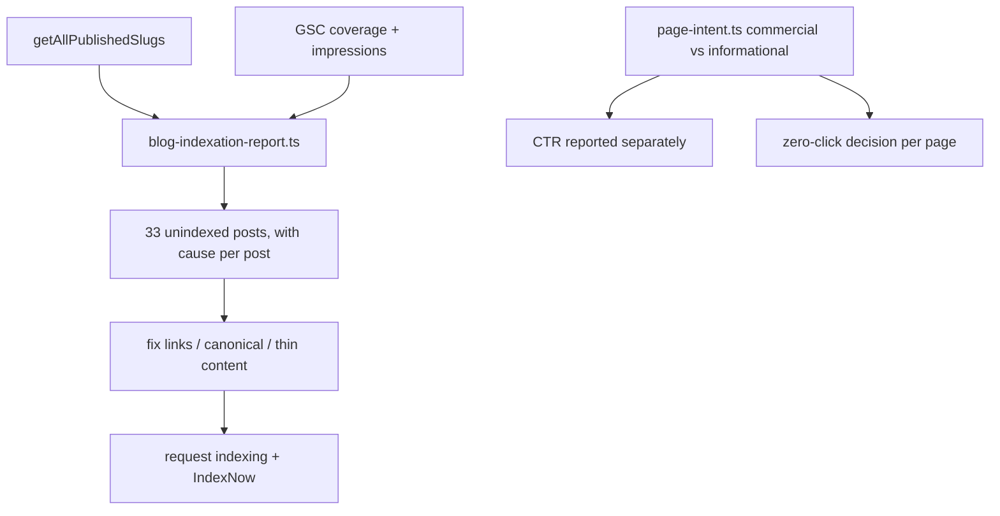

# PRD 06 — Blog Indexation & Zero-Click Impressions

**Complexity: 5 → MEDIUM mode** (6-10 files +2, new module +2, external API (GSC) +1)

**Planning Mode: Principal Architect**
**Source:** audit §02, §04, §07; `data/gsc-crawled-not-indexed.csv` (33 `/blog/*` rows)

---

## 1. Context

**Problem:** Two blog problems pull in opposite directions and are easy to confuse.

**(a) 33 English blog posts are crawled and not indexed.** These are the assets that convert —
the single roundup post `/blog/best-free-ai-image-upscaler-2026-tested-compared` produces 1,499
clicks at 12.4% CTR, 18% of all site clicks. Unindexed posts are the highest-value part of the
2,840 not-indexed pile and must be fixed individually, never pruned like matrix pages (PRD 03
explicitly excludes `/blog/*`).

**(b) Seven informational posts produce 41% of site impressions and 4.7% of clicks.**

| Page                                      |  Impressions |   Clicks |   CTR | Position |
| ----------------------------------------- | -----------: | -------: | ----: | -------: |
| `/blog/fixing-pixelated-photos`           |       90,070 |       13 | 0.01% |      9.6 |
| `/blog/poster-size-dimensions-pixels`     |       20,815 |       55 | 0.26% |      7.0 |
| `/blog/topaz-labs-free-trial`             |       15,141 |      175 | 1.16% |      8.0 |
| `/blog/how-to-upscale-youtube-thumbnails` |       11,379 |       64 | 0.56% |      7.1 |
| `/blog/best-image-upscaler`               |        6,858 |       36 | 0.52% |      9.8 |
| `/blog/best-ai-upscaler`                  |        6,047 |       33 | 0.55% |      9.9 |
| `/blog/topaz-video-upscaler`              |        5,449 |       13 | 0.24% |     10.2 |
| **Total**                                 | **~156,000** | **~389** |       |          |

One query — "how to fix pixelated photos" — produced **88,317 impressions and 1 click at position
9.4**. A normal page-one blue link converts at 1–2%. One click from 88K means the URL is being
_displayed_ (AI Overview, image pack, "things to know") and not clicked. Generative-AI-feature
impressions rose 24.2K → 37.6K (+55%) in the same 28 days.

Consequence: site-wide CTR (2.2%) and average position (12.2) are **not health metrics** here.
They are dragged by seven URLs that will never convert. Real CTR on commercial pages is 5–12%.

**Files Analyzed:**

- `server/services/blog.service.ts` — `getAllPublishedPosts` (line 420), `getPublishedPostBySlug` (451), `getAllPublishedSlugs` (466)
- `app/[locale]/blog/[slug]/page.tsx` — `dynamic = 'force-static'`, `revalidate = 86400`, metadata + FAQ/breadcrumb schema
- `app/sitemap-blog.xml/route.ts`
- `lib/seo/seo-equity.ts` — `getRelatedPostsForSlug`, `getPseoRelatedBlogPosts`, `getHomepageBlogPicks`, `validateSeoEquityPromotedUrls`
- `content/seo-equity.json`, `content/seo-equity.config.json` — the internal-link promotion layer
- `client/components/blog/BlogCTA.tsx`, `BlogPostHeroSection.tsx` — CTA placement
- `.claude/skills/seo-content-3-kings-technique/`, `.claude/skills/blog-publish/`
- `tests/unit/seo/{blog-sitemap,blog-internal-links,blog-ctr-fixes,blog-seo-fields}.unit.spec.ts`

**Current Behavior:**

- No mechanism reports which published posts are indexed. Indexation is discovered by manual GSC reads.
- Internal linking to posts is driven by `content/seo-equity.json`, which is hand-maintained; a new
  post can ship with zero inbound internal links and nothing complains.
- Every blog post is reported under one site-wide CTR number; the seven zero-click URLs mathematically
  hide the commercial pages' 5–12%.
- CTAs exist (`BlogCTA`) but the zero-click pages were never audited for above-the-fold tool entry.

---

## 2. Solution

**Approach:**

1. **Indexation report per post.** `scripts/seo/blog-indexation-report.ts` joins `getAllPublishedSlugs()`
   against GSC coverage + impressions and prints, for every post: indexed?, inbound internal links,
   word count, canonical, publish date. The 33 unindexed posts stop being a mystery list.
2. **Fix the three mechanical causes** the report exposes — zero inbound internal links, canonical
   conflicts, and thin content — then request indexing. `validateSeoEquityPromotedUrls` becomes a
   hard rule: every published post has ≥2 inbound internal links from a live page.
3. **Classify every URL as commercial or informational** in one place (`lib/seo/page-intent.ts`) and
   report CTR separately. Site-wide CTR stops being used as a health metric anywhere in the repo.
4. **Decide each zero-click page explicitly** — convert it (title/meta rewrite + tool CTA above the
   fold) or accept it as an AI-Overview citation and exclude it from CTR reporting. No page stays
   undecided; the decision is recorded in the data.
5. **Make the winning template reusable.** Extract what makes the roundup work (real testing, real
   screenshots, verdict table, 12.4% CTR) into a `blog-roundup` checklist so the next five posts
   clone the asset that works, not the matrix that does not.



**Key Decisions:**

- **Never noindex a blog post to fix a CTR average.** The metric follows the site, not the reverse.
  Excluded-from-reporting ≠ excluded from the index.
- **`/blog/fixing-pixelated-photos` is treated as an AI-citation asset**, not a failure: 88K
  impressions at position 9.4 is genuine visibility. Add an above-the-fold tool CTA to convert the
  trickle, then stop measuring it by CTR.
- **Two inbound internal links minimum** per published post — enforced in CI, not by good intentions.
- Roundup cloning is content work; this PRD ships the checklist and the internal-link wiring, and
  names the five targets. Writing them is tracked in the SEO backlog, not here.

**Data Changes:** `content/seo-equity.json` gains entries for previously unlinked posts. Optional
`intent` field on blog post metadata (`commercial | informational`) — defaults derived, never guessed
at read time.

---

## Integration Ledger

| #   | New thing                                      | Live caller (`file:line`, non-test)                                                                                   | Replaces                 | Old path removed?                                     | Negative control                                                            |
| --- | ---------------------------------------------- | --------------------------------------------------------------------------------------------------------------------- | ------------------------ | ----------------------------------------------------- | --------------------------------------------------------------------------- |
| 1   | `scripts/seo/blog-indexation-report.ts`        | `package.json:101` (`seo:blog:indexation`)                                                                            | manual GSC reads         | n/a                                                   | run with an empty GSC response → exits 1 instead of reporting "all indexed" |
| 2   | `lib/seo/page-intent.ts` (`getPageIntent`)     | `scripts/seo/blog-indexation-report.ts:388`, `scripts/seo/ctr-report.ts:136`, `client/components/blog/BlogCTA.tsx:69` | site-wide CTR reading    | commercial/informational split replaces it in Phase 2 | classify everything as commercial → the CTR-split test goes red             |
| 3   | Inbound-link rule in `lib/seo/seo-equity.ts`   | `scripts/validate-seo-equity.ts:20` (called by `package.json:29` `verify`)                                            | advisory validation      | strengthened in Phase 1                               | publish a post with no inbound links → `yarn verify` fails                  |
| 4   | Above-the-fold tool CTA on informational posts | `app/[locale]/blog/[slug]/page.tsx:394`                                                                               | CTA only mid/end of post | Phase 3                                               | remove the CTA → the e2e above-the-fold test goes red                       |

### Reachability

**How is this reached?** `yarn verify` (link rule), the blog post route (CTA), and two scripts the
user runs. All pre-existing entry points except the scripts.

**User-facing?** YES — the above-the-fold CTA on informational posts.

**Full flow:** a visitor lands on `/blog/fixing-pixelated-photos` from an AI Overview → sees a tool
entry point before scrolling → clicks through to `/tools/ai-image-upscaler`.

**What does this replace?** Site-wide CTR as the health metric, and hand-checked internal linking.

---

## 3. Execution Phases

### Phase 0: Why is each of the 33 posts unindexed? (measurement)

**Files (2):**

- `scripts/seo/blog-indexation-report.ts` — NEW
- `package.json` — EDIT: `"seo:blog:indexation"`

**Implementation:**

- [ ] For every slug from `getAllPublishedSlugs()`: indexed (GSC), impressions 90d, inbound internal
      link count (from `content/seo-equity.json` + rendered pSEO/blog templates), word count,
      canonical, publish date, in `sitemap-blog.xml`?
- [ ] Flag the mechanical causes: `NO_INBOUND_LINKS`, `CANONICAL_MISMATCH`, `THIN` (<800 words),
      `NOT_IN_SITEMAP`, `TOO_NEW` (<14 days)
- [ ] Cross-check the output against the 33 `/blog/*` rows in `data/gsc-crawled-not-indexed.csv` —
      if the script finds a different set, the script is wrong; fix it before acting

**Verification Plan:**

```bash
yarn seo:blog:indexation | tee /tmp/blog-index-before.txt
# Expected: ≈33 unindexed posts, each with at least one cause flag; totals reconcile with the CSV
```

**Negative control:** feed it a slug list containing `best-free-ai-image-upscaler-2026-tested-compared`
(known indexed, 1,499 clicks). If it reports that post as unindexed, the join is broken.

---

### Phase 1: Fix the mechanical causes and request indexing

**Files (5):**

- `content/seo-equity.json` — EDIT: inbound links for every orphaned post
- `lib/seo/seo-equity.ts` — EDIT: `validateSeoEquityPromotedUrls` fails when a published post has <2 inbound links
- `app/[locale]/blog/[slug]/page.tsx` — EDIT: canonical correctness for posts flagged `CANONICAL_MISMATCH`
- `docs/SEO/maintenance/gsc-request-indexing-backlog.md` — EDIT: the URL list to submit manually
- `tests/unit/seo/blog-internal-links.unit.spec.ts` — EDIT (pre-existing)

**Implementation:**

- [ ] Every unindexed post gets ≥2 inbound links: from the roundup, a related post, and/or the
      matching pSEO tool page (`getPseoRelatedBlogPosts`)
- [ ] Thin posts: expand or merge into a stronger post with a 301 — decided per post, recorded in the report
- [ ] `yarn tsx scripts/submit-indexnow.ts` after deploy, then request indexing in GSC per the backlog

**Wiring:**

- [ ] Caller edited: `lib/seo/seo-equity.ts` validation already runs in the verify chain
- [ ] Old path: advisory-only validation replaced by a failing rule
- [ ] Ledger rows filled: #3

**Tests Required:**

| Test File                                                 | Test Name                                                              | Assertion                                                            | Negative control            |
| --------------------------------------------------------- | ---------------------------------------------------------------------- | -------------------------------------------------------------------- | --------------------------- |
| `tests/unit/seo/blog-internal-links.unit.spec.ts`         | `should give every published post at least two inbound internal links` | computed inbound count ≥2 for all slugs                              | remove a post's links → red |
| `tests/unit/seo/blog-sitemap.unit.spec.ts` (pre-existing) | `should include every published post`                                  | slugs from `getAllPublishedSlugs()` all appear in `sitemap-blog.xml` | drop one → red              |
| `tests/unit/seo/blog-canonical.unit.spec.ts`              | `should self-canonical every published post`                           | canonical === the post's own URL                                     | point one elsewhere → red   |

**Revert check:** revert `content/seo-equity.json` → the inbound-link test fails.

---

### Phase 2: Report commercial CTR separately from informational

**Files (4):**

- `lib/seo/page-intent.ts` — NEW: `getPageIntent(url) → 'commercial' | 'informational'`
- `scripts/seo/ctr-report.ts` — NEW: GSC CTR split by intent, plus the excluded-URL list
- `package.json` — EDIT: `"seo:ctr:report"`
- `tests/unit/seo/page-intent.unit.spec.ts` — NEW

**Implementation:**

- [ ] Commercial: `/tools/*`, `/free/*`, `/scale/*`, `/formats/*`, pricing, homepage, and roundup posts
- [ ] Informational: the seven zero-click URLs and their kind
- [ ] Report prints both, plus a one-line reminder that the site-wide number is not the health metric
- [ ] Excluded URLs are listed explicitly in the report — never silently dropped

**Tests Required:**

| Test File                                 | Test Name                                                     | Assertion                                                                                  | Negative control                   |
| ----------------------------------------- | ------------------------------------------------------------- | ------------------------------------------------------------------------------------------ | ---------------------------------- |
| `tests/unit/seo/page-intent.unit.spec.ts` | `should classify the roundup post as commercial`              | `getPageIntent('/blog/best-free-ai-image-upscaler-2026-tested-compared') === 'commercial'` | classify by path prefix only → red |
| `tests/unit/seo/page-intent.unit.spec.ts` | `should classify the pixelated-photos guide as informational` | returns `informational`                                                                    | invert → red                       |
| `tests/unit/seo/page-intent.unit.spec.ts` | `should list every excluded URL in the report`                | excluded set is non-empty and printed                                                      | silently drop → red                |

---

### Phase 3: Convert the zero-click traffic that can be converted

**Files (4):**

- `app/[locale]/blog/[slug]/page.tsx` — EDIT: render the tool CTA above the fold for informational posts
- `client/components/blog/BlogCTA.tsx` — EDIT: compact above-the-fold variant
- Blog content (via `blog-edit` skill): titles + metas for the seven URLs, per `seo-content-3-kings-technique`
- `tests/e2e/blog/above-fold-cta.spec.ts` — NEW

**Implementation:**

- [ ] `/blog/fixing-pixelated-photos`: CTA to `/tools/ai-image-upscaler` above the fold; title/meta
      rewritten to answer "how to fix pixelated photos" in the first sentence (AI-Overview citation shape)
- [ ] `/blog/topaz-labs-free-trial` and `/blog/topaz-video-upscaler`: comparison intent — CTA to the
      roundup, which converts at 12.4%
- [ ] `/blog/poster-size-dimensions-pixels`, `/blog/how-to-upscale-youtube-thumbnails`: CTA to the
      matching resize tool
- [ ] `/blog/best-image-upscaler`, `/blog/best-ai-upscaler`: same intent as the roundup — evaluate
      301 consolidation into it (coordinate with PRD 04's cannibalization test)

**Tests Required:**

| Test File                                                   | Test Name                                                      | Assertion                                    | Negative control             |
| ----------------------------------------------------------- | -------------------------------------------------------------- | -------------------------------------------- | ---------------------------- |
| `tests/e2e/blog/above-fold-cta.spec.ts`                     | `should show a tool CTA without scrolling on a 390px viewport` | CTA visible in the initial viewport          | move it below the fold → red |
| `tests/unit/seo/blog-ctr-fixes.unit.spec.ts` (pre-existing) | `should answer the primary query in the first paragraph`       | first paragraph contains the primary keyword | revert the copy → red        |

**User Verification (manual):** open each of the seven URLs on a phone-sized viewport; a tool entry
point is visible without scrolling and leads to the right tool.

---

### Phase 4: The roundup blueprint (clone what works)

**Files (2):**

- `.claude/skills/blog-writing/roundup-checklist.md` — NEW: what makes the 12.4% CTR post work
  (real testing, screenshots per tool, verdict table, updated-date, comparison schema, internal links
  to the tools tested)
- `docs/SEO/maintenance/seo-changes-backlog.md` — EDIT: the five named targets

**Targets (from the audit):** best GIF upscaler · best free upscaler without watermark · Topaz
alternatives · best 8K upscaler · best bulk upscaler.

**Verification:** each new roundup ships with ≥2 inbound internal links (Phase 1 rule) and is
measured at 28 days against the 12.4% CTR benchmark. Lane 6 provides the local bulk-roundup
artifact with its inbound-link wiring; production publication, deployment, and indexing remain
post-deploy external steps. One of these is worth 200 matrix pages.

---

## 4. Checkpoint Protocol

Automated `prd-work-reviewer` after each phase; manual after Phase 3 (visual change), plus:

```text
Also audit:
1. Did any blog post get noindexed to improve a CTR average? (must be NO)
2. Is the inbound-link rule enforced in the verify chain, not merely documented?
3. Does the CTR report list excluded URLs explicitly rather than silently dropping them?
4. Phase 0: does the script's unindexed set reconcile with data/gsc-crawled-not-indexed.csv?
5. Revert check observed red?
```

---

## 5. Verification Strategy

### Live proof

```bash
yarn seo:blog:indexation | tee /tmp/blog-index-after.txt
diff /tmp/blog-index-before.txt /tmp/blog-index-after.txt        # cause flags cleared
yarn seo:ctr:report                                              # commercial vs informational split
curl -s https://myimageupscaler.com/blog/fixing-pixelated-photos | grep -c 'href="/tools/ai-image-upscaler"'
```

### Integration proof

```bash
grep -rn "getPageIntent" lib app scripts --include=*.ts --include=*.tsx | grep -v tests/   # ≥3 consumers
grep -rn "validateSeoEquityPromotedUrls" lib scripts package.json                           # in the verify chain
git stash && yarn test:unit tests/unit/seo/blog-internal-links.unit.spec.ts && git stash pop
```

### Post-deploy GSC protocol

1. Request indexing for the 33 posts (GSC allows ~10/day — spread over 4 days, tracked in the backlog)
2. **2026-08-27 (14 days):** ≥15 of the 33 indexed
3. **2026-09-10 (28 days):** ≥28 of the 33 indexed; commercial-page CTR reported separately and ≥5%
4. **2026-09-10:** clicks from the seven zero-click URLs ≥ 600 (from 389) — or the decision to treat
   them as citations is recorded and their CTR is excluded from reporting
5. Track non-brand clicks (~3,050 baseline) as the scoreboard, per the audit's §09

---

## 6. Acceptance Criteria

- [ ] A reader searching one of the 33 unindexed posts' primary queries can find that post in Google
- [ ] Every published post has ≥2 inbound internal links, enforced before merge
- [ ] Someone landing on `/blog/fixing-pixelated-photos` from an AI Overview sees a tool entry point
      without scrolling
- [ ] Commercial CTR is reported separately from informational CTR, with excluded URLs named
- [ ] No blog post was noindexed or deleted to improve a metric
- [ ] The roundup checklist exists and the next roundup ships against it.
      Lane 6's local artifact is ready.
      Production publication, deployment, GSC/IndexNow indexing, and live measurements remain post-deploy external acceptance items.

Binary done checks:

- [ ] All phases complete · tests pass · `yarn verify` passes
- [ ] Automated + manual checkpoints passed
- [ ] Integration Ledger has every caller cell populated
- [ ] Every gate observed red first
- [ ] SEO backlog + GSC indexing backlog updated
