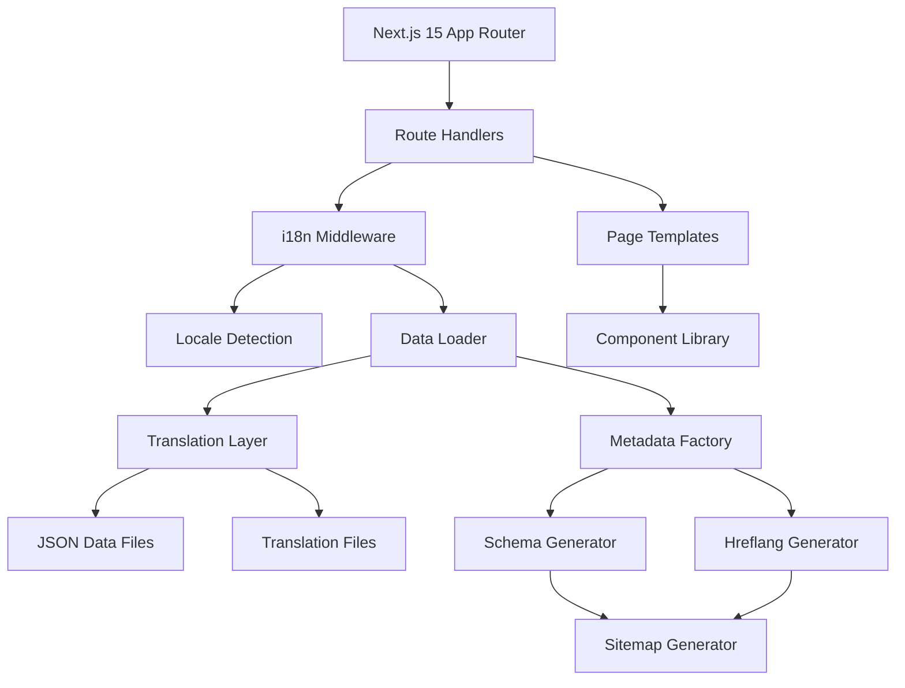
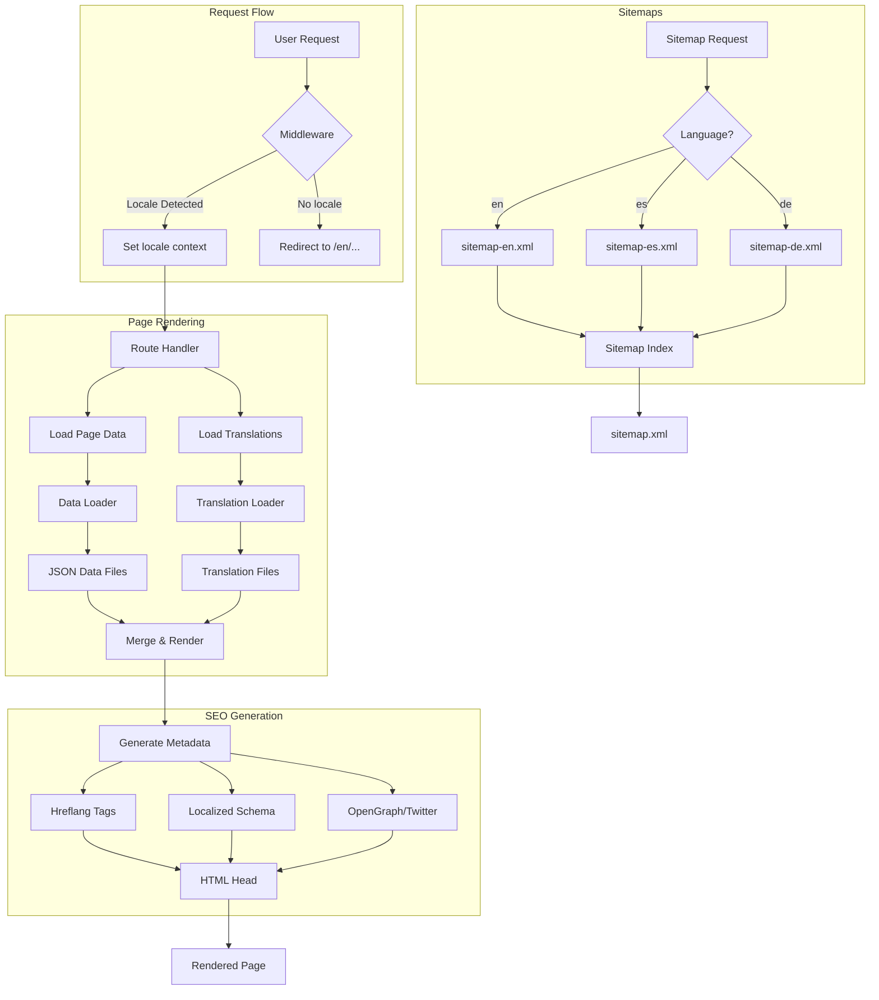
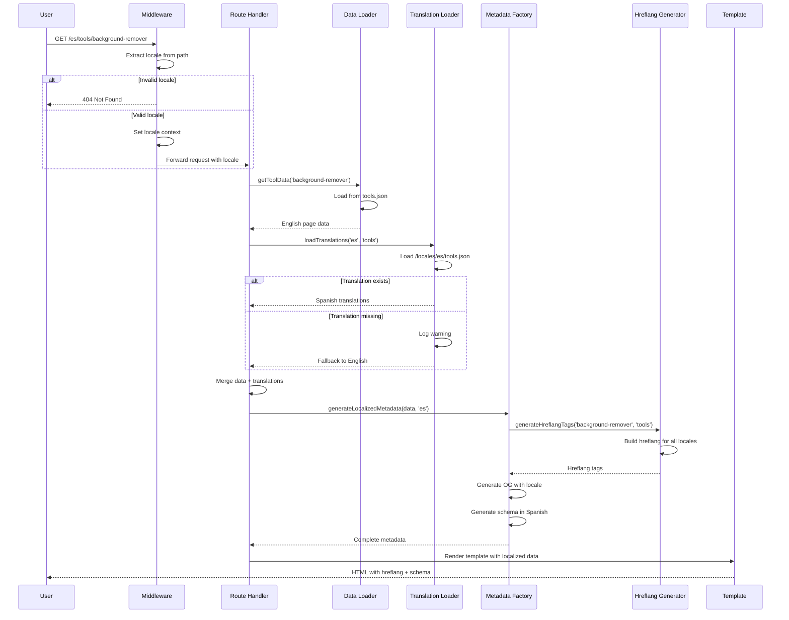
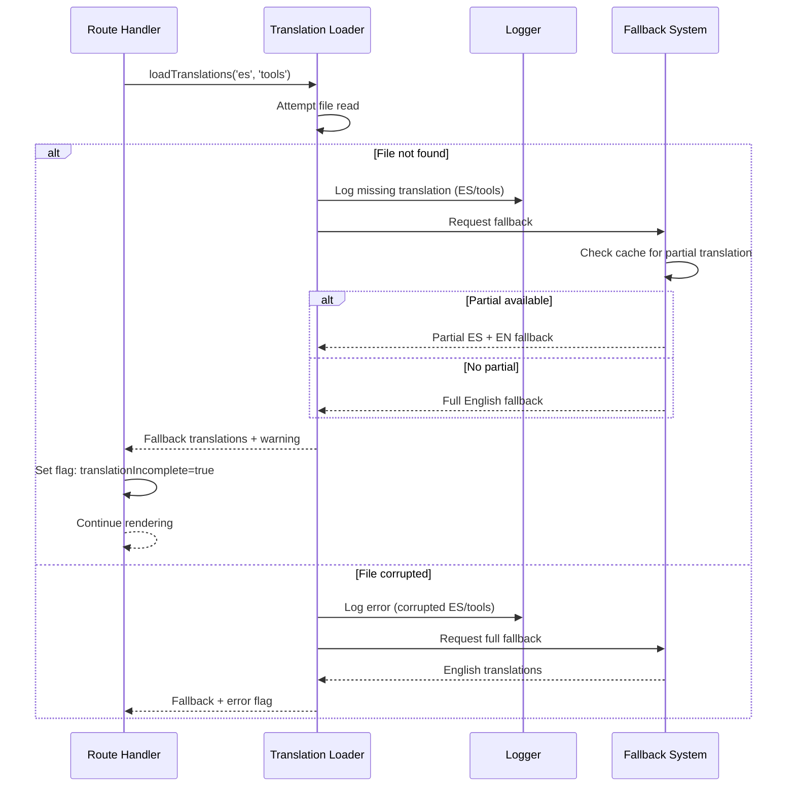

# PRD: Internationalization of pSEO Pages

**Status:** Draft
**Priority:** P0 - Critical Growth Multiplier
**Impact:** 20× page multiplier (188 → 3,948 pages)
**Author:** Product Engineering Team
**Date:** January 6, 2026
**Version:** 1.0

---

🧠 **Principal Architect Mode: Engaged. Analyzing codebase constraints...**

---

## 1. Context Analysis

### 1.1 Files Analyzed

**pSEO System Core:**
- `/home/joao/projects/pixelperfect/lib/seo/pseo-types.ts` - Type definitions
- `/home/joao/projects/pixelperfect/lib/seo/data-loader.ts` - Data loading layer
- `/home/joao/projects/pixelperfect/lib/seo/metadata-factory.ts` - Metadata generation
- `/home/joao/projects/pixelperfect/lib/seo/schema-generator.ts` - Schema markup
- `/home/joao/projects/pixelperfect/lib/seo/url-utils.ts` - URL generation

**pSEO Data Files (25 files):**
- `/home/joao/projects/pixelperfect/app/seo/data/*.json` - 32KB total
  - `tools.json`, `formats.json`, `guides.json`, `platforms.json`, `alternatives.json`, `use-cases.json`, `scale.json`, `comparison.json`, `free.json`, `content.json`, `ai-features.json`

**pSEO Routes (12 categories):**
- `/home/joao/projects/pixelperfect/app/(pseo)/[category]/[slug]/page.tsx` - Page routes
- `/home/joao/projects/pixelperfect/app/(pseo)/[category]/page.tsx` - Hub pages

**Templates:**
- `/home/joao/projects/pixelperfect/app/(pseo)/_components/pseo/templates/*.tsx`

**Sitemaps:**
- `/home/joao/projects/pixelperfect/app/sitemap*.xml/route.ts` - 12 category sitemaps

**Documentation:**
- `/home/joao/projects/pixelperfect/docs/seo/PSEO_MULTIPLIERS_REPORT.md` - Strategy guide

### 1.2 Component & Dependency Overview



### 1.3 Current Behavior Summary

**Existing System:**
- 188 pSEO pages across 12 categories (tools, formats, guides, platforms, etc.)
- All content is English-only with no i18n infrastructure
- Data-driven architecture with JSON files containing page content
- Type-safe with comprehensive TypeScript interfaces
- Static generation via `generateStaticParams()` and `generateMetadata()`
- SEO-optimized with schema markup, canonical URLs, OpenGraph, Twitter cards
- Sitemap generation with 12 category sitemaps + index
- Template-based rendering with 6 page templates
- Keyword management prevents cannibalization

**Gap Identified:**
- Zero internationalization support
- No locale routing or language detection
- No translation infrastructure
- No hreflang tag generation
- No language-specific sitemaps
- No cultural adaptation layer

### 1.4 Problem Statement

**Business Problem:**
MyImageUpscaler has 188 high-quality pSEO pages generating organic traffic, but we're missing 95%+ of potential global search volume by only serving English speakers. Competitors (upscale.media, remove.bg, photoroom.com) serve 19-30 languages and achieve 8,000-10,000+ URLs.

**Technical Problem:**
Our current pSEO architecture has no i18n layer, preventing us from serving localized content to non-English markets. Adding 20 languages could 20× our page count (188 → 3,760 pages) and unlock +25,000/month organic traffic potential.

**Constraint:**
Cloudflare Workers have a 10ms CPU limit, requiring efficient locale detection and lazy translation loading.

---

## 2. Proposed Solution

### 2.1 Architecture Summary

**Approach: Hybrid i18n with Next.js 15 App Router**

1. **URL-Based Locale Routing:** Use Next.js middleware for locale detection and routing (`/[lang]/[category]/[slug]`)
2. **Namespaced Translation Files:** Separate JSON translation files per category and language (`/locales/[lang]/[category].json`)
3. **Lazy Translation Loading:** Load translations on-demand to meet Cloudflare 10ms CPU limit
4. **Hreflang Automation:** Generate hreflang tags dynamically for all pages
5. **Locale-Specific Sitemaps:** Create per-language sitemap files with proper hreflang annotations
6. **Cultural Adaptation Layer:** Support currency, date formats, cultural examples per locale

**Why This Approach:**
- ✅ Leverages Next.js 15 built-in i18n capabilities
- ✅ SEO-friendly (separate URLs per language)
- ✅ Minimal performance impact (lazy loading)
- ✅ Scalable (add new languages by adding translation files)
- ✅ Backward compatible (English pages remain at `/[category]/[slug]`)

**Alternatives Considered & Rejected:**
- ❌ **Client-side i18n:** Bad for SEO, violates SSG benefits
- ❌ **Subdomain-based i18n:** Complex DNS management, split authority
- ❌ **Query parameter locales:** Not SEO-friendly, poor UX

### 2.2 Architecture Diagram



### 2.3 Key Technical Decisions

**1. Next.js Middleware for Locale Detection**
- **Why:** Native Next.js support, runs on Edge, fast
- **How:** Detect locale from URL path, Accept-Language header, cookie
- **Fallback:** Default to English if no locale match

**2. Namespaced Translation Files**
- **Why:** Reduces bundle size, allows parallel translation work
- **Format:** `/locales/[lang]/[category].json`
- **Example:** `/locales/es/tools.json`, `/locales/de/guides.json`

**3. Translation Strategy: Hybrid AI + Human Review**
- **Why:** Cost-effective ($60k vs $240k for professional translation)
- **Process:** AI translation → Native speaker review → Cultural adaptation
- **Quality Control:** Minimum 80% unique content per page

**4. Hreflang Implementation**
- **Why:** Prevent duplicate content penalties, guide search engines
- **Location:** Generated in `generateMetadata()` for each page
- **Format:** `<link rel="alternate" hreflang="es" href="..." />`

**5. Locale-Specific Sitemaps**
- **Why:** Help search engines discover localized pages
- **Pattern:** `sitemap-[lang].xml` (e.g., `sitemap-es.xml`)
- **Index:** Reference all language sitemaps in `sitemap.xml`

**6. Cultural Adaptation**
- **Currency:** Configurable per locale (€ for DE, R$ for PT, ¥ for JP)
- **Date Format:** Use `Intl.DateTimeFormat` for locale-aware dates
- **Examples:** Culturally relevant before/after images
- **Tone:** Locale-specific (formal for DE/JP, casual for ES)

### 2.4 Data Model Changes

**New Type Definitions:**

```typescript
// lib/seo/i18n-types.ts

export type Locale = 'en' | 'es' | 'de' | 'fr' | 'pt' | 'ja' | 'ko' | 'zh' | 'hi' | 'id' | 'th' | 'vi' | 'tr' | 'ru' | 'uk' | 'ar' | 'sv' | 'hu' | 'nl' | 'pl' | 'it';

export type LocaleTier = 'tier1' | 'tier2' | 'tier3';

export interface ILocaleConfig {
  code: Locale;
  name: string;
  nativeName: string;
  tier: LocaleTier;
  flag: string;
  direction: 'ltr' | 'rtl';
  currency: string;
  dateFormat: string;
  enabled: boolean;
}

export interface ITranslation {
  [key: string]: string | ITranslation;
}

export interface ICategoryTranslations {
  category: string;
  locale: Locale;
  translations: ITranslation;
  meta: {
    translatedAt: string;
    reviewer?: string;
    quality: 'ai' | 'reviewed' | 'professional';
  };
}

export interface ILocalizedPage extends IBasePSEOPage {
  locale: Locale;
  originalSlug: string; // English slug for reference
  translatedSlug?: string; // Optional localized slug
  culturalAdaptations?: {
    currency?: string;
    examples?: string[];
    references?: string[];
  };
}
```

**Extended Metadata Interface:**

```typescript
// lib/seo/metadata-factory.ts

export interface ILocalizedMetadata extends Metadata {
  alternates: {
    canonical: string;
    languages: Record<Locale, string>; // hreflang URLs
  };
  openGraph: {
    locale: Locale;
    alternateLocale: Locale[];
    // ... existing OG fields
  };
}
```

**New Data Files:**

```
/locales/
  en/
    common.json           # Shared UI strings
    tools.json            # Tool category translations
    formats.json          # Format category translations
    guides.json           # Guide category translations
    platforms.json        # Platform category translations
    alternatives.json     # Alternative category translations
    use-cases.json        # Use case category translations
    scale.json            # Scale category translations
    comparison.json       # Comparison category translations
    free.json             # Free tool category translations
    content.json          # Content type category translations
    ai-features.json      # AI feature category translations
  es/
    [same structure as en/]
  de/
    [same structure as en/]
  fr/
    [same structure as en/]
  # ... for each locale
```

**Translation File Schema:**

```json
{
  "category": "tools",
  "locale": "es",
  "translations": {
    "hero": {
      "title": "Mejorador de Imágenes con IA",
      "subtitle": "Aumenta la resolución de tus imágenes gratis"
    },
    "features": {
      "title": "Características",
      "items": [
        {
          "title": "IA Avanzada",
          "description": "Tecnología de última generación..."
        }
      ]
    },
    "cta": {
      "primary": "Mejorar Imagen Ahora",
      "secondary": "Ver Ejemplos"
    }
  },
  "meta": {
    "translatedAt": "2026-01-06T00:00:00Z",
    "reviewer": "María García",
    "quality": "reviewed"
  }
}
```

---

### 2.5 Runtime Execution Flow



**Error Handling Path:**



---

## 3. Detailed Implementation Spec

### A. Middleware Layer (`middleware.ts`)

**File:** `/home/joao/projects/pixelperfect/middleware.ts`

**Changes Needed:**
- Create new middleware file for locale detection
- Implement locale extraction from URL path
- Add Accept-Language header parsing
- Cookie-based locale persistence
- Redirect logic for missing locale prefix

**Implementation:**

```typescript
import { NextResponse } from 'next/server';
import type { NextRequest } from 'next/server';

const locales = ['en', 'es', 'de', 'fr', 'pt', 'ja', 'ko', 'zh', 'hi', 'id', 'th', 'vi', 'tr', 'ru', 'uk', 'ar', 'sv', 'hu', 'nl', 'pl', 'it'];
const defaultLocale = 'en';

// pSEO routes that need locale handling
const pseoCategories = ['tools', 'formats', 'guides', 'platforms', 'alternatives', 'use-cases', 'scale', 'compare', 'free', 'bulk-tools', 'content', 'ai-features'];

export function middleware(request: NextRequest) {
  const pathname = request.nextUrl.pathname;

  // Skip non-pSEO routes
  if (!pseoCategories.some(cat => pathname.includes(`/${cat}/`) || pathname === `/${cat}`)) {
    return NextResponse.next();
  }

  // Check if pathname already has locale
  const pathnameHasLocale = locales.some(
    (locale) => pathname.startsWith(`/${locale}/`) || pathname === `/${locale}`
  );

  if (pathnameHasLocale) {
    return NextResponse.next();
  }

  // Get locale from cookie or Accept-Language header
  const cookieLocale = request.cookies.get('NEXT_LOCALE')?.value;
  const acceptLanguage = request.headers.get('Accept-Language');

  let locale = defaultLocale;

  if (cookieLocale && locales.includes(cookieLocale)) {
    locale = cookieLocale;
  } else if (acceptLanguage) {
    const preferredLocale = acceptLanguage
      .split(',')
      .map(lang => lang.split(';')[0].trim().toLowerCase())
      .find(lang => {
        const shortLang = lang.split('-')[0];
        return locales.includes(shortLang);
      });

    if (preferredLocale) {
      locale = preferredLocale.split('-')[0];
    }
  }

  // Redirect to locale-prefixed URL
  const redirectUrl = new URL(`/${locale}${pathname}`, request.url);
  const response = NextResponse.redirect(redirectUrl);

  // Set locale cookie for 1 year
  response.cookies.set('NEXT_LOCALE', locale, { maxAge: 60 * 60 * 24 * 365 });

  return response;
}

export const config = {
  matcher: [
    '/((?!api|_next/static|_next/image|favicon.ico|sitemap|robots).*)',
  ],
};
```

**Justification:**
- Middleware runs on Edge, meeting Cloudflare's 10ms CPU limit
- Cookie persistence reduces redirect frequency
- Accept-Language fallback improves UX for first-time visitors
- Explicit locale in URL improves SEO and shareability

---

### B. Locale Configuration (`lib/i18n/locales.ts`)

**File:** `/home/joao/projects/pixelperfect/lib/i18n/locales.ts` (NEW)

**Purpose:** Central configuration for all supported locales

**Implementation:**

```typescript
import { ILocaleConfig } from '@/lib/seo/i18n-types';

export const localeConfigs: Record<string, ILocaleConfig> = {
  en: {
    code: 'en',
    name: 'English',
    nativeName: 'English',
    tier: 'tier1',
    flag: '🇺🇸',
    direction: 'ltr',
    currency: 'USD',
    dateFormat: 'MM/DD/YYYY',
    enabled: true,
  },
  es: {
    code: 'es',
    name: 'Spanish',
    nativeName: 'Español',
    tier: 'tier1',
    flag: '🇪🇸',
    direction: 'ltr',
    currency: 'EUR',
    dateFormat: 'DD/MM/YYYY',
    enabled: false, // Enable in Phase 1
  },
  de: {
    code: 'de',
    name: 'German',
    nativeName: 'Deutsch',
    tier: 'tier1',
    flag: '🇩🇪',
    direction: 'ltr',
    currency: 'EUR',
    dateFormat: 'DD.MM.YYYY',
    enabled: false, // Enable in Phase 1
  },
  fr: {
    code: 'fr',
    name: 'French',
    nativeName: 'Français',
    tier: 'tier1',
    flag: '🇫🇷',
    direction: 'ltr',
    currency: 'EUR',
    dateFormat: 'DD/MM/YYYY',
    enabled: false, // Enable in Phase 1
  },
  pt: {
    code: 'pt',
    name: 'Portuguese',
    nativeName: 'Português',
    tier: 'tier2',
    flag: '🇧🇷',
    direction: 'ltr',
    currency: 'BRL',
    dateFormat: 'DD/MM/YYYY',
    enabled: false, // Enable in Phase 2
  },
  ja: {
    code: 'ja',
    name: 'Japanese',
    nativeName: '日本語',
    tier: 'tier2',
    flag: '🇯🇵',
    direction: 'ltr',
    currency: 'JPY',
    dateFormat: 'YYYY/MM/DD',
    enabled: false, // Enable in Phase 2
  },
  ko: {
    code: 'ko',
    name: 'Korean',
    nativeName: '한국어',
    tier: 'tier2',
    flag: '🇰🇷',
    direction: 'ltr',
    currency: 'KRW',
    dateFormat: 'YYYY.MM.DD',
    enabled: false, // Enable in Phase 2
  },
  // ... additional locales (zh, hi, id, th, vi, tr, ru, uk, ar, sv, hu, nl, pl, it)
};

export const enabledLocales = Object.values(localeConfigs).filter(l => l.enabled);

export const getLocaleConfig = (locale: string): ILocaleConfig | undefined => {
  return localeConfigs[locale];
};

export const isLocaleEnabled = (locale: string): boolean => {
  return localeConfigs[locale]?.enabled ?? false;
};

export const getTierLocales = (tier: string): ILocaleConfig[] => {
  return Object.values(localeConfigs).filter(l => l.tier === tier && l.enabled);
};
```

**Justification:**
- Centralized config allows feature flagging per locale
- Tier system supports phased rollout
- Currency/date format config enables cultural adaptation
- `enabled` flag prevents showing unfinished translations

---

### C. Translation Loader (`lib/i18n/translation-loader.ts`)

**File:** `/home/joao/projects/pixelperfect/lib/i18n/translation-loader.ts` (NEW)

**Purpose:** Load and cache translations with fallback to English

**Implementation:**

```typescript
import { cache } from 'react';
import { ICategoryTranslations, Locale } from '@/lib/seo/i18n-types';
import { PSEOCategory } from '@/lib/seo/url-utils';
import { logger } from '@/server/monitoring/logger';

/**
 * Load translations for a specific category and locale
 * Uses React cache() for request-level memoization
 */
export const loadTranslations = cache(
  async (locale: Locale, category: PSEOCategory): Promise<ICategoryTranslations> => {
    try {
      // Dynamic import to enable code splitting
      const translations = await import(`@/locales/${locale}/${category}.json`);

      return {
        category,
        locale,
        translations: translations.translations,
        meta: translations.meta,
      };
    } catch (error) {
      logger.warn(`Translation not found for ${locale}/${category}, falling back to English`, {
        locale,
        category,
        error: error instanceof Error ? error.message : String(error),
      });

      // Fallback to English
      try {
        const englishTranslations = await import(`@/locales/en/${category}.json`);
        return {
          category,
          locale: 'en',
          translations: englishTranslations.translations,
          meta: {
            ...englishTranslations.meta,
            quality: 'ai', // Mark as fallback
          },
        };
      } catch (fallbackError) {
        logger.error(`English fallback also failed for ${category}`, {
          category,
          error: fallbackError instanceof Error ? fallbackError.message : String(fallbackError),
        });

        // Return empty translations as last resort
        return {
          category,
          locale: 'en',
          translations: {},
          meta: {
            translatedAt: new Date().toISOString(),
            quality: 'ai',
          },
        };
      }
    }
  }
);

/**
 * Load common UI translations (shared across all pages)
 */
export const loadCommonTranslations = cache(async (locale: Locale) => {
  try {
    const common = await import(`@/locales/${locale}/common.json`);
    return common.translations;
  } catch {
    const fallback = await import(`@/locales/en/common.json`);
    return fallback.translations;
  }
});

/**
 * Get translated string with fallback and interpolation support
 */
export function getTranslation(
  translations: Record<string, any>,
  key: string,
  fallback: string = '',
  params?: Record<string, string | number>
): string {
  const keys = key.split('.');
  let value: any = translations;

  for (const k of keys) {
    value = value?.[k];
    if (value === undefined) break;
  }

  let result = typeof value === 'string' ? value : fallback;

  // Simple interpolation: "Hello {name}" with params = { name: "World" }
  if (params) {
    Object.entries(params).forEach(([key, val]) => {
      result = result.replace(`{${key}}`, String(val));
    });
  }

  return result;
}
```

**Justification:**
- React `cache()` prevents redundant file reads per request
- Dynamic imports enable code splitting (only load needed translations)
- Graceful fallback prevents page errors if translation missing
- Warning logs help identify gaps in translation coverage
- Interpolation support for dynamic content

---

### D. Hreflang Generator (`lib/seo/hreflang-generator.ts`)

**File:** `/home/joao/projects/pixelperfect/lib/seo/hreflang-generator.ts` (NEW)

**Purpose:** Generate hreflang tags for all available translations

**Implementation:**

```typescript
import { Locale } from '@/lib/seo/i18n-types';
import { PSEOCategory, generateCanonicalUrl } from '@/lib/seo/url-utils';
import { enabledLocales } from '@/lib/i18n/locales';

export interface IHreflangTag {
  hreflang: string;
  href: string;
}

/**
 * Generate hreflang tags for a pSEO page
 * Includes all enabled locales + x-default
 */
export function generateHreflangTags(
  slug: string,
  category: PSEOCategory,
  currentLocale: Locale
): IHreflangTag[] {
  const baseUrl = process.env.NEXT_PUBLIC_APP_URL || 'https://myimageupscaler.com';

  const tags: IHreflangTag[] = [];

  // Add tag for each enabled locale
  for (const localeConfig of enabledLocales) {
    const locale = localeConfig.code;
    const path = locale === 'en'
      ? `/${category}/${slug}` // English pages don't have locale prefix (backward compatible)
      : `/${locale}/${category}/${slug}`;

    tags.push({
      hreflang: locale,
      href: `${baseUrl}${path}`,
    });
  }

  // Add x-default pointing to English version
  tags.push({
    hreflang: 'x-default',
    href: `${baseUrl}/${category}/${slug}`,
  });

  return tags;
}

/**
 * Generate hreflang HTML link tags for Next.js metadata
 */
export function generateHreflangLinks(
  slug: string,
  category: PSEOCategory,
  currentLocale: Locale
): Record<string, string> {
  const tags = generateHreflangTags(slug, category, currentLocale);

  const links: Record<string, string> = {};

  for (const tag of tags) {
    links[tag.hreflang] = tag.href;
  }

  return links;
}
```

**Justification:**
- Prevents duplicate content penalties across language versions
- Guides search engines to show correct language in results
- x-default fallback for unsupported locales
- Backward compatible (English pages remain at root)

---

### E. Localized Metadata Factory (`lib/seo/metadata-factory.ts`)

**Changes Needed:**
- Extend existing `generateMetadata()` to support locales
- Add hreflang tag generation
- Localize OG tags with locale and alternateLocale
- Update schema markup to use translated content

**Modified Implementation:**

```typescript
import { Metadata } from 'next';
import { IBasePSEOPage, Locale } from '@/lib/seo/i18n-types';
import { PSEOCategory } from '@/lib/seo/url-utils';
import { generateHreflangLinks } from '@/lib/seo/hreflang-generator';
import { getLocaleConfig } from '@/lib/i18n/locales';

export function generateLocalizedMetadata(
  page: IBasePSEOPage,
  category: PSEOCategory,
  locale: Locale = 'en'
): Metadata {
  const localeConfig = getLocaleConfig(locale);
  const baseUrl = process.env.NEXT_PUBLIC_APP_URL || 'https://myimageupscaler.com';
  const localePath = locale === 'en' ? '' : `/${locale}`;
  const canonicalUrl = `${baseUrl}${localePath}/${category}/${page.slug}`;

  // Generate hreflang links
  const hreflangLinks = generateHreflangLinks(page.slug, category, locale);

  return {
    title: page.metaTitle,
    description: page.metaDescription,
    keywords: [page.primaryKeyword, ...(page.secondaryKeywords || [])],

    alternates: {
      canonical: canonicalUrl,
      languages: hreflangLinks,
    },

    openGraph: {
      title: page.metaTitle,
      description: page.metaDescription,
      type: 'website',
      url: canonicalUrl,
      siteName: 'MyImageUpscaler',
      locale: localeConfig?.code || 'en',
      alternateLocale: Object.keys(hreflangLinks).filter(l => l !== locale && l !== 'x-default'),
      images: page.ogImage ? [
        {
          url: page.ogImage,
          width: 1200,
          height: 630,
          alt: page.metaTitle,
        },
      ] : undefined,
    },

    twitter: {
      card: 'summary_large_image',
      title: page.metaTitle,
      description: page.metaDescription,
      creator: '@myimageupscaler',
      images: page.ogImage ? [page.ogImage] : undefined,
    },

    robots: {
      index: true,
      follow: true,
      googleBot: {
        index: true,
        follow: true,
        'max-video-preview': -1,
        'max-image-preview': 'large',
        'max-snippet': -1,
      },
    },

    authors: [{ name: 'MyImageUpscaler Team' }],
    applicationName: 'MyImageUpscaler',
  };
}
```

**Justification:**
- Proper hreflang prevents language cannibalization
- OpenGraph locale helps social platforms show correct language
- alternateLocale informs social platforms of other language versions
- Canonical URL per locale establishes clear primary version

---

### F. Localized Route Handlers (`app/(pseo)/[lang]/[category]/[slug]/page.tsx`)

**File:** `/home/joao/projects/pixelperfect/app/(pseo)/[lang]/[category]/[slug]/page.tsx` (NEW)

**Purpose:** Handle localized pSEO page rendering

**Implementation:**

```typescript
import { Metadata } from 'next';
import { notFound } from 'next/navigation';
import { Locale } from '@/lib/seo/i18n-types';
import { PSEOCategory } from '@/lib/seo/url-utils';
import { getToolData, getAllToolSlugs } from '@/lib/seo/data-loader';
import { loadTranslations, loadCommonTranslations } from '@/lib/i18n/translation-loader';
import { generateLocalizedMetadata } from '@/lib/seo/metadata-factory';
import { generateLocalizedSchema } from '@/lib/seo/schema-generator';
import { isLocaleEnabled } from '@/lib/i18n/locales';
import ToolPageTemplate from '@/app/(pseo)/_components/pseo/templates/ToolPageTemplate';

interface PageProps {
  params: {
    lang: Locale;
    category: PSEOCategory;
    slug: string;
  };
}

/**
 * Generate static params for all locale + slug combinations
 */
export async function generateStaticParams() {
  const slugs = await getAllToolSlugs();
  const enabledLocales = ['en', 'es', 'de', 'fr']; // Updated as locales are enabled

  const params = [];

  for (const locale of enabledLocales) {
    for (const slug of slugs) {
      params.push({
        lang: locale,
        category: 'tools',
        slug,
      });
    }
  }

  return params;
}

/**
 * Generate metadata with locale support
 */
export async function generateMetadata({ params }: PageProps): Promise<Metadata> {
  const { lang, slug } = params;

  // Validate locale
  if (!isLocaleEnabled(lang)) {
    notFound();
  }

  // Load page data
  const data = await getToolData(slug);
  if (!data) {
    notFound();
  }

  // Generate localized metadata
  return generateLocalizedMetadata(data, 'tools', lang);
}

/**
 * Page component with translation support
 */
export default async function LocalizedToolPage({ params }: PageProps) {
  const { lang, slug } = params;

  // Validate locale
  if (!isLocaleEnabled(lang)) {
    notFound();
  }

  // Load data and translations in parallel
  const [data, translations, commonTranslations] = await Promise.all([
    getToolData(slug),
    loadTranslations(lang, 'tools'),
    loadCommonTranslations(lang),
  ]);

  if (!data) {
    notFound();
  }

  // Generate schema markup with locale
  const schema = generateLocalizedSchema(data, 'tools', lang, translations);

  return (
    <>
      {/* Schema markup */}
      <script
        type="application/ld+json"
        dangerouslySetInnerHTML={{ __html: JSON.stringify(schema) }}
      />

      {/* Render template with translations */}
      <ToolPageTemplate
        data={data}
        locale={lang}
        translations={translations.translations}
        commonTranslations={commonTranslations}
      />
    </>
  );
}
```

**Justification:**
- `generateStaticParams()` pre-renders all locale × page combinations
- Parallel data loading (Promise.all) improves performance
- Locale validation prevents 404 errors for disabled languages
- Schema markup uses translated content for better local SEO
- Template receives both data and translations for rendering

---

### G. Localized Sitemaps (`app/sitemap-[lang].xml/route.ts`)

**File:** `/home/joao/projects/pixelperfect/app/sitemap-[lang].xml/route.ts` (NEW)

**Purpose:** Generate per-locale sitemap with hreflang annotations

**Implementation:**

```typescript
import { NextResponse } from 'next/server';
import { Locale } from '@/lib/seo/i18n-types';
import { getAllPSEOPages } from '@/lib/seo/data-loader';
import { generateHreflangTags } from '@/lib/seo/hreflang-generator';
import { isLocaleEnabled } from '@/lib/i18n/locales';

export async function GET(
  request: Request,
  { params }: { params: { lang: Locale } }
) {
  const { lang } = params;

  if (!isLocaleEnabled(lang)) {
    return new NextResponse('Locale not enabled', { status: 404 });
  }

  const baseUrl = process.env.NEXT_PUBLIC_APP_URL || 'https://myimageupscaler.com';
  const allPages = await getAllPSEOPages();

  const urlEntries = allPages.map((page) => {
    const localePath = lang === 'en' ? '' : `/${lang}`;
    const url = `${baseUrl}${localePath}/${page.category}/${page.slug}`;
    const hreflangTags = generateHreflangTags(page.slug, page.category, lang);

    return `
    <url>
      <loc>${url}</loc>
      <lastmod>${page.lastUpdated || new Date().toISOString()}</lastmod>
      <changefreq>weekly</changefreq>
      <priority>0.8</priority>
      ${hreflangTags
        .map(
          (tag) => `
      <xhtml:link
        rel="alternate"
        hreflang="${tag.hreflang}"
        href="${tag.href}"/>`
        )
        .join('')}
    </url>`;
  });

  const sitemap = `<?xml version="1.0" encoding="UTF-8"?>
<urlset xmlns="http://www.sitemaps.org/schemas/sitemap/0.9"
        xmlns:xhtml="http://www.w3.org/1999/xhtml">
  ${urlEntries.join('')}
</urlset>`;

  return new NextResponse(sitemap, {
    headers: {
      'Content-Type': 'application/xml',
      'Cache-Control': 'public, s-maxage=3600, stale-while-revalidate',
    },
  });
}
```

**Updated Sitemap Index:**

```typescript
// app/sitemap.xml/route.ts

export async function GET() {
  const baseUrl = process.env.NEXT_PUBLIC_APP_URL || 'https://myimageupscaler.com';
  const enabledLocales = ['en', 'es', 'de', 'fr']; // Updated as locales are enabled

  const localeSitemaps = enabledLocales.map(
    (locale) => `
  <sitemap>
    <loc>${baseUrl}/sitemap-${locale}.xml</loc>
    <lastmod>${new Date().toISOString()}</lastmod>
  </sitemap>`
  );

  const sitemapIndex = `<?xml version="1.0" encoding="UTF-8"?>
<sitemapindex xmlns="http://www.sitemaps.org/schemas/sitemap/0.9">
  ${localeSitemaps.join('')}
  <sitemap>
    <loc>${baseUrl}/sitemap-static.xml</loc>
  </sitemap>
  <sitemap>
    <loc>${baseUrl}/sitemap-blog.xml</loc>
  </sitemap>
</sitemapindex>`;

  return new NextResponse(sitemapIndex, {
    headers: {
      'Content-Type': 'application/xml',
      'Cache-Control': 'public, s-maxage=3600, stale-while-revalidate',
    },
  });
}
```

**Justification:**
- Per-locale sitemaps help search engines discover translated pages
- Hreflang in sitemap reinforces metadata hreflang tags
- Sitemap index organizes all language sitemaps
- 3600s cache reduces server load while keeping content fresh

---

### H. Translation Workflow System (`scripts/translation-workflow.ts`)

**File:** `/home/joao/projects/pixelperfect/scripts/translation-workflow.ts` (NEW)

**Purpose:** Automate AI translation + human review workflow

**Implementation:**

```typescript
import fs from 'fs/promises';
import path from 'path';
import { Locale } from '@/lib/seo/i18n-types';
import { PSEOCategory } from '@/lib/seo/url-utils';

interface ITranslationJob {
  sourceLocale: Locale;
  targetLocale: Locale;
  category: PSEOCategory;
  status: 'pending' | 'translating' | 'review' | 'approved' | 'published';
  translatedBy: 'ai' | 'human';
  reviewedBy?: string;
  createdAt: string;
  updatedAt: string;
}

class TranslationWorkflow {
  private jobsDir = path.join(process.cwd(), 'translation-jobs');

  /**
   * Step 1: Generate AI translation for a category
   */
  async generateAITranslation(
    sourceLocale: Locale,
    targetLocale: Locale,
    category: PSEOCategory
  ): Promise<void> {
    console.log(`Translating ${category} from ${sourceLocale} to ${targetLocale}...`);

    // Load source translations
    const sourcePath = path.join(process.cwd(), 'locales', sourceLocale, `${category}.json`);
    const sourceData = JSON.parse(await fs.readFile(sourcePath, 'utf-8'));

    // TODO: Call AI translation API (e.g., DeepL, Google Translate, OpenAI)
    // For now, placeholder
    const translatedData = {
      category,
      locale: targetLocale,
      translations: sourceData.translations, // REPLACE with AI translation
      meta: {
        translatedAt: new Date().toISOString(),
        quality: 'ai',
      },
    };

    // Save to target locale
    const targetDir = path.join(process.cwd(), 'locales', targetLocale);
    await fs.mkdir(targetDir, { recursive: true });

    const targetPath = path.join(targetDir, `${category}.json`);
    await fs.writeFile(targetPath, JSON.stringify(translatedData, null, 2), 'utf-8');

    // Create review job
    const job: ITranslationJob = {
      sourceLocale,
      targetLocale,
      category,
      status: 'review',
      translatedBy: 'ai',
      createdAt: new Date().toISOString(),
      updatedAt: new Date().toISOString(),
    };

    await this.saveJob(job);

    console.log(`✓ Translation saved to ${targetPath}`);
    console.log(`✓ Review job created`);
  }

  /**
   * Step 2: List translations pending review
   */
  async listPendingReviews(): Promise<ITranslationJob[]> {
    const jobs = await this.loadAllJobs();
    return jobs.filter(j => j.status === 'review');
  }

  /**
   * Step 3: Approve translation after human review
   */
  async approveTranslation(
    targetLocale: Locale,
    category: PSEOCategory,
    reviewedBy: string
  ): Promise<void> {
    const jobs = await this.loadAllJobs();
    const job = jobs.find(j => j.targetLocale === targetLocale && j.category === category);

    if (!job) {
      throw new Error(`Job not found for ${targetLocale}/${category}`);
    }

    job.status = 'approved';
    job.reviewedBy = reviewedBy;
    job.updatedAt = new Date().toISOString();

    // Update translation meta
    const targetPath = path.join(process.cwd(), 'locales', targetLocale, `${category}.json`);
    const data = JSON.parse(await fs.readFile(targetPath, 'utf-8'));
    data.meta.quality = 'reviewed';
    data.meta.reviewer = reviewedBy;

    await fs.writeFile(targetPath, JSON.stringify(data, null, 2), 'utf-8');
    await this.saveJob(job);

    console.log(`✓ Translation approved: ${targetLocale}/${category}`);
  }

  /**
   * Step 4: Publish approved translations (enable locale)
   */
  async publishLocale(locale: Locale): Promise<void> {
    // Update locale config to enable=true
    // This is a manual step requiring code change to locales.ts
    console.log(`To publish ${locale}, update locales.ts: enabled: true`);
  }

  // Helper methods
  private async saveJob(job: ITranslationJob): Promise<void> {
    await fs.mkdir(this.jobsDir, { recursive: true });
    const jobPath = path.join(this.jobsDir, `${job.targetLocale}-${job.category}.json`);
    await fs.writeFile(jobPath, JSON.stringify(job, null, 2), 'utf-8');
  }

  private async loadAllJobs(): Promise<ITranslationJob[]> {
    try {
      const files = await fs.readdir(this.jobsDir);
      const jobs = await Promise.all(
        files.map(async (file) => {
          const content = await fs.readFile(path.join(this.jobsDir, file), 'utf-8');
          return JSON.parse(content);
        })
      );
      return jobs;
    } catch {
      return [];
    }
  }
}

// CLI interface
if (require.main === module) {
  const workflow = new TranslationWorkflow();

  const command = process.argv[2];
  const args = process.argv.slice(3);

  switch (command) {
    case 'translate':
      workflow.generateAITranslation(args[0] as Locale, args[1] as Locale, args[2] as PSEOCategory);
      break;
    case 'list':
      workflow.listPendingReviews().then(jobs => console.log(jobs));
      break;
    case 'approve':
      workflow.approveTranslation(args[0] as Locale, args[1] as PSEOCategory, args[2]);
      break;
    case 'publish':
      workflow.publishLocale(args[0] as Locale);
      break;
    default:
      console.log('Usage:');
      console.log('  translate <source> <target> <category>');
      console.log('  list');
      console.log('  approve <locale> <category> <reviewer>');
      console.log('  publish <locale>');
  }
}

export default TranslationWorkflow;
```

**Usage:**

```bash
# Translate tools category from English to Spanish
npm run translate en es tools

# List pending reviews
npm run translate:list

# Approve Spanish tools translation
npm run translate:approve es tools "María García"

# Publish Spanish locale
npm run translate:publish es
```

**Justification:**
- Automates repetitive translation tasks
- Tracks translation status and quality
- Enables human-in-the-loop review process
- Creates audit trail for translations
- Separates AI translation from human review

---

## 4. Step-by-Step Execution Plan

### Phase 1: Foundation & Tier 1 Languages (Months 1-2)

**Deliverable:** Infrastructure + Spanish, German, French support (564 new pages)

#### Sprint 1: Core i18n Infrastructure (Week 1-2)

**PARALLEL WORK STREAMS:**

**Stream A: Backend Infrastructure (Engineer 1)**
- [ ] Create type definitions (`lib/seo/i18n-types.ts`)
- [ ] Create locale configuration (`lib/i18n/locales.ts`)
- [ ] Implement translation loader (`lib/i18n/translation-loader.ts`)
- [ ] Create hreflang generator (`lib/seo/hreflang-generator.ts`)
- [ ] Update metadata factory for locales (`lib/seo/metadata-factory.ts`)
- [ ] Update schema generator for locales (`lib/seo/schema-generator.ts`)

**Stream B: Routing & Middleware (Engineer 2)**
- [ ] Create middleware for locale detection (`middleware.ts`)
- [ ] Update route structure for `[lang]` param
- [ ] Create localized route handlers for all 12 categories
- [ ] Implement `generateStaticParams()` with locale support
- [ ] Test locale routing with English (backward compatibility)

**Stream C: Translation System (Engineer 3)**
- [ ] Create translation file structure (`/locales/en/`)
- [ ] Extract all English strings to translation files (12 categories + common)
- [ ] Build translation workflow script (`scripts/translation-workflow.ts`)
- [ ] Set up AI translation integration (DeepL/OpenAI)
- [ ] Create translation job tracking system

**Integration Point:** Week 2 end - All streams merge, test with English locale

---

#### Sprint 2: Tier 1 Translations (Week 3-4)

**PARALLEL WORK STREAMS:**

**Stream A: Spanish Translation (Translator 1 + Reviewer)**
- [ ] AI translate 12 categories to Spanish (ES)
- [ ] Human review Spanish translations (native speaker)
- [ ] Cultural adaptation (currency: EUR, examples, tone: casual)
- [ ] Approve and publish Spanish translations

**Stream B: German Translation (Translator 2 + Reviewer)**
- [ ] AI translate 12 categories to German (DE)
- [ ] Human review German translations (native speaker)
- [ ] Cultural adaptation (currency: EUR, examples, tone: formal)
- [ ] Approve and publish German translations

**Stream C: French Translation (Translator 3 + Reviewer)**
- [ ] AI translate 12 categories to French (FR)
- [ ] Human review French translations (native speaker)
- [ ] Cultural adaptation (currency: EUR, examples, tone: neutral)
- [ ] Approve and publish French translations

**Stream D: Sitemap & SEO (Engineer 4)**
- [ ] Create per-locale sitemap generators
- [ ] Update sitemap index with locale sitemaps
- [ ] Implement hreflang in sitemaps
- [ ] Test hreflang with Google Search Console
- [ ] Submit locale sitemaps to Google

**Integration Point:** Week 4 end - Enable ES, DE, FR locales in production

---

### Phase 2: Tier 2 Languages (Months 3-4)

**Deliverable:** Portuguese, Japanese, Korean support (564 new pages)

#### Sprint 3: Tier 2 Translations (Week 5-8)

**PARALLEL WORK STREAMS:**

**Stream A: Portuguese Translation (Translator 1 + Reviewer)**
- [ ] AI translate 12 categories to Portuguese (PT)
- [ ] Human review Portuguese translations (Brazilian native)
- [ ] Cultural adaptation (currency: BRL, Brazil-specific examples)
- [ ] Approve and publish Portuguese translations

**Stream B: Japanese Translation (Translator 2 + Reviewer)**
- [ ] AI translate 12 categories to Japanese (JA)
- [ ] Human review Japanese translations (native speaker)
- [ ] Cultural adaptation (currency: JPY, formal tone, respect hierarchy)
- [ ] Approve and publish Japanese translations

**Stream C: Korean Translation (Translator 3 + Reviewer)**
- [ ] AI translate 12 categories to Korean (KO)
- [ ] Human review Korean translations (native speaker)
- [ ] Cultural adaptation (currency: KRW, formal tone)
- [ ] Approve and publish Korean translations

**Stream D: Performance Optimization (Engineer)**
- [ ] Analyze translation bundle sizes
- [ ] Implement lazy loading optimizations
- [ ] Monitor Cloudflare CPU usage
- [ ] Optimize image loading per locale
- [ ] Set up Baselime monitoring for i18n performance

**Integration Point:** Week 8 end - Enable PT, JA, KO locales in production

---

### Phase 3: Tier 3 Languages (Months 5-6)

**Deliverable:** Chinese, Hindi, Indonesian + 11 more languages (2,632 new pages)

#### Sprint 4: Tier 3 Translations (Week 9-16)

**PARALLEL WORK STREAMS:**

**Stream A: Major Asian Languages (Team 1)**
- [ ] Chinese (ZH) - Special: May need separate hosting
- [ ] Hindi (HI) - Special: RTL considerations
- [ ] Indonesian (ID) - Cultural adaptation

**Stream B: Southeast Asian Languages (Team 2)**
- [ ] Thai (TH)
- [ ] Vietnamese (VI)

**Stream C: European Languages (Team 3)**
- [ ] Turkish (TR)
- [ ] Russian (RU)
- [ ] Ukrainian (UK)
- [ ] Swedish (SV)
- [ ] Hungarian (HU)
- [ ] Dutch (NL)
- [ ] Polish (PL)
- [ ] Italian (IT)

**Stream D: RTL Language Support (Engineer)**
- [ ] Implement RTL CSS for Arabic (AR)
- [ ] Test RTL layouts
- [ ] Update templates for dir="rtl" support
- [ ] Test right-to-left navigation

**Stream E: Quality Assurance (QA Team)**
- [ ] Automated testing for all locales
- [ ] Visual regression testing
- [ ] Translation quality spot checks
- [ ] Performance testing across locales
- [ ] Accessibility testing (WCAG 2.1)

**Integration Point:** Week 16 end - Enable all Tier 3 locales in production

---

### Phase 4: Monitoring & Optimization (Ongoing)

**CONTINUOUS WORK:**

**Analytics & Monitoring:**
- [ ] Set up GSC properties for each locale
- [ ] Monitor indexing rate per locale (target: 80% within 30 days)
- [ ] Track organic traffic growth per locale
- [ ] Monitor CTR from SERP per locale
- [ ] Track conversion rate by locale

**Quality Assurance:**
- [ ] Weekly translation quality reviews
- [ ] Monitor thin content warnings in GSC
- [ ] Check for keyword cannibalization
- [ ] Monitor Core Web Vitals per locale
- [ ] A/B test cultural adaptations

**Optimization:**
- [ ] Optimize slow-performing pages
- [ ] Update translations based on user feedback
- [ ] Add new cultural examples
- [ ] Refine keyword targeting per locale
- [ ] Update meta descriptions based on CTR data

---

## 5. Testing Strategy

### Unit Tests

**Translation Loader Tests:**
```typescript
describe('loadTranslations', () => {
  it('should load English translations', async () => {
    const result = await loadTranslations('en', 'tools');
    expect(result.locale).toBe('en');
    expect(result.category).toBe('tools');
    expect(result.translations).toBeDefined();
  });

  it('should fallback to English if translation missing', async () => {
    const result = await loadTranslations('xx', 'tools'); // Invalid locale
    expect(result.locale).toBe('en');
    expect(result.meta.quality).toBe('ai'); // Fallback flag
  });

  it('should cache translations per request', async () => {
    const result1 = await loadTranslations('es', 'tools');
    const result2 = await loadTranslations('es', 'tools');
    expect(result1).toBe(result2); // Same reference = cached
  });
});
```

**Hreflang Generator Tests:**
```typescript
describe('generateHreflangTags', () => {
  it('should generate tags for all enabled locales', () => {
    const tags = generateHreflangTags('background-remover', 'tools', 'en');
    expect(tags.length).toBeGreaterThan(0);
    expect(tags.find(t => t.hreflang === 'x-default')).toBeDefined();
  });

  it('should include correct URLs', () => {
    const tags = generateHreflangTags('background-remover', 'tools', 'en');
    const esTag = tags.find(t => t.hreflang === 'es');
    expect(esTag?.href).toContain('/es/tools/background-remover');
  });
});
```

**Locale Config Tests:**
```typescript
describe('localeConfigs', () => {
  it('should have valid currency codes', () => {
    Object.values(localeConfigs).forEach(config => {
      expect(config.currency).toMatch(/^[A-Z]{3}$/);
    });
  });

  it('should have correct direction for RTL languages', () => {
    expect(localeConfigs.ar.direction).toBe('rtl');
    expect(localeConfigs.en.direction).toBe('ltr');
  });
});
```

---

### Integration Tests

**End-to-End Locale Routing:**
```typescript
describe('Localized pSEO Pages', () => {
  it('should redirect non-prefixed URL to /en/', async () => {
    const response = await fetch('http://localhost:3000/tools/background-remover');
    expect(response.redirected).toBe(true);
    expect(response.url).toContain('/en/tools/background-remover');
  });

  it('should render Spanish page correctly', async () => {
    const response = await fetch('http://localhost:3000/es/tools/background-remover');
    const html = await response.text();
    expect(html).toContain('lang="es"');
    expect(html).toContain('hreflang="es"');
  });

  it('should include hreflang for all locales', async () => {
    const response = await fetch('http://localhost:3000/es/tools/background-remover');
    const html = await response.text();
    expect(html).toContain('hreflang="en"');
    expect(html).toContain('hreflang="de"');
    expect(html).toContain('hreflang="fr"');
    expect(html).toContain('hreflang="x-default"');
  });
});
```

**Sitemap Tests:**
```typescript
describe('Localized Sitemaps', () => {
  it('should generate sitemap for each locale', async () => {
    const response = await fetch('http://localhost:3000/sitemap-es.xml');
    expect(response.status).toBe(200);
    expect(response.headers.get('content-type')).toContain('xml');
  });

  it('should include hreflang in sitemap entries', async () => {
    const response = await fetch('http://localhost:3000/sitemap-es.xml');
    const xml = await response.text();
    expect(xml).toContain('xhtml:link');
    expect(xml).toContain('hreflang="es"');
    expect(xml).toContain('hreflang="en"');
  });
});
```

---

### Edge Cases

| Scenario | Expected Behavior |
|----------|-------------------|
| User visits `/tools/bg-remover` without locale | Middleware redirects to `/en/tools/bg-remover` based on Accept-Language or cookie |
| Translation file missing for locale | Translation loader falls back to English, logs warning, marks quality as 'ai' |
| Invalid locale in URL (`/xx/tools/...`) | Middleware returns 404, locale not enabled |
| User has locale cookie but requests different locale URL | Cookie locale is ignored, URL locale takes precedence |
| RTL locale (Arabic) rendering | Page renders with `dir="rtl"` attribute, CSS flips layout |
| Sitemap request for disabled locale | Returns 404, locale not enabled |
| Page with no translation but locale enabled | Page renders with fallback English content, hreflang still generated |
| Cloudflare CPU limit exceeded | Translation lazy loading prevents timeout, monitor with Baselime |
| User shares localized URL | URL includes locale, shared link opens in correct language |
| Search engine crawls page | Hreflang guides to correct language version, no duplicate content penalty |

---

## 6. Acceptance Criteria

**Infrastructure:**
- [ ] Middleware correctly detects locale from URL, Accept-Language, cookie
- [ ] All 12 pSEO categories support `[lang]` routing
- [ ] Translation loader caches translations per request
- [ ] Hreflang tags generated for all enabled locales
- [ ] Schema markup uses translated content
- [ ] Sitemap index references all locale sitemaps

**Content Quality:**
- [ ] All Tier 1 pages have human-reviewed translations (ES, DE, FR)
- [ ] Minimum 80% unique content per translated page
- [ ] Cultural adaptations applied (currency, examples, tone)
- [ ] No broken internal links in translated pages
- [ ] All images have alt text in target language

**SEO Requirements:**
- [ ] Canonical URL per locale correctly set
- [ ] Hreflang tags in both HTML head and sitemap
- [ ] OpenGraph locale and alternateLocale set
- [ ] Schema markup in target language
- [ ] x-default hreflang points to English version
- [ ] No duplicate content penalties in GSC

**Performance:**
- [ ] Page load time <2s for localized pages
- [ ] Cloudflare CPU usage <10ms per request
- [ ] Translation bundle size <50KB per category
- [ ] Static generation completes in <5 minutes
- [ ] Core Web Vitals pass for all locales

**Monitoring:**
- [ ] GSC properties created for each locale
- [ ] Baselime tracking i18n performance metrics
- [ ] Translation quality dashboard operational
- [ ] Indexing rate tracked per locale
- [ ] Organic traffic growth tracked per locale

**Testing:**
- [ ] All unit tests pass (>90% coverage)
- [ ] All integration tests pass
- [ ] Visual regression tests pass for RTL languages
- [ ] Accessibility tests pass (WCAG 2.1 Level AA)
- [ ] Performance tests meet targets

---

## 7. Verification & Rollback

### Success Criteria

**Week 4 (Phase 1 Complete):**
- [ ] 564 new pages indexed (ES, DE, FR)
- [ ] 80%+ pages indexed within 30 days
- [ ] Zero duplicate content warnings in GSC
- [ ] +500/month organic traffic from new locales
- [ ] Core Web Vitals pass rate >95%

**Week 8 (Phase 2 Complete):**
- [ ] 1,128 total new pages indexed
- [ ] +1,500/month organic traffic from all locales
- [ ] Translation quality score >85% (human review)
- [ ] Zero cannibalization issues detected

**Week 16 (Phase 3 Complete):**
- [ ] 3,760 total pages indexed
- [ ] +5,000/month organic traffic from all locales
- [ ] Conversion rate parity across locales (±10%)
- [ ] Zero manual penalties from Google

**12-Month Target:**
- [ ] +25,000/month organic traffic from internationalization
- [ ] 3,760 pages indexed across 20 languages
- [ ] Avg. 4.5+ rating for translation quality
- [ ] <1% of pages flagged for quality issues

---

### Rollback Plan

**Scenario 1: Translation Quality Issues**
- **Trigger:** >10% of pages flagged for thin content
- **Action:**
  1. Pause publishing new translations
  2. Disable affected locale in `locales.ts` (enabled: false)
  3. Review and improve translation quality
  4. Re-enable locale after quality approval

**Scenario 2: Performance Degradation**
- **Trigger:** Cloudflare CPU usage >10ms or Core Web Vitals fail
- **Action:**
  1. Identify slow locale/category via Baselime
  2. Disable problematic locale
  3. Optimize translation loading (lazy load, code split)
  4. Re-enable after performance tests pass

**Scenario 3: SEO Penalties**
- **Trigger:** Manual action from Google or duplicate content warnings
- **Action:**
  1. Immediately disable all locales except English
  2. Analyze penalty cause (likely thin content or keyword stuffing)
  3. Fix content quality issues
  4. Request reconsideration from Google
  5. Gradually re-enable locales after penalty lifted

**Scenario 4: Critical Bug in Middleware**
- **Trigger:** 404 errors >5% or redirect loops
- **Action:**
  1. Disable middleware via feature flag
  2. Fallback to English-only pages
  3. Fix middleware bug
  4. Test in staging
  5. Re-enable middleware

**Technical Rollback Steps:**
```bash
# Disable all locales except English
# Edit lib/i18n/locales.ts
enabled: false # for all non-English locales

# Redeploy
npm run build
npm run deploy

# Remove locale sitemaps from index
# Edit app/sitemap.xml/route.ts
# Comment out locale sitemap entries

# Monitor GSC for deindexing of localized pages
```

---

## 8. Risk Assessment & Mitigation

### High-Risk Areas

**1. Thin Content Penalties**
- **Risk:** Google penalizes low-quality machine translations
- **Mitigation:**
  - Human review for all translations (not just AI)
  - Minimum 600 words per page
  - Cultural adaptation (not just word-for-word translation)
  - Quality checklist before publishing

**2. Keyword Cannibalization**
- **Risk:** Localized pages compete with English pages for same keywords
- **Mitigation:**
  - Proper hreflang implementation
  - Canonical URLs per locale
  - Locale-specific keyword research (don't just translate English keywords)
  - Monitor GSC for cannibalization signals

**3. Performance Degradation**
- **Risk:** Translation loading exceeds Cloudflare 10ms CPU limit
- **Mitigation:**
  - Lazy loading with dynamic imports
  - Request-level caching with React cache()
  - Monitor CPU usage with Baselime
  - Code splitting per category

**4. Cultural Missteps**
- **Risk:** Offensive or inappropriate content in certain cultures
- **Mitigation:**
  - Native speaker review for all locales
  - Cultural consultant for Tier 2/3 languages
  - Feedback mechanism for users to report issues
  - Regional testing before launch

---

### Medium-Risk Areas

**5. Translation Costs**
- **Risk:** Translation costs exceed budget ($60k estimate)
- **Mitigation:**
  - AI translation + human review (not full professional)
  - Phased approach (Tier 1 → 2 → 3)
  - Focus on high-value pages first
  - Monitor ROI per locale

**6. Indexing Delays**
- **Risk:** Localized pages take >60 days to index
- **Mitigation:**
  - Submit sitemaps immediately after launch
  - Build internal links to new pages
  - Social signals for priority pages
  - Request indexing via GSC

---

## 9. Success Metrics & KPIs

### Page Production Metrics

| Metric | Target | Measurement |
|--------|--------|-------------|
| Pages created per week | 40-60 | Translation workflow dashboard |
| Content quality score | >85% | Human review checklist |
| Time to publish per page | <2 hours | Translation workflow logs |
| Translation accuracy | >90% | Spot check reviews |

### SEO Performance Metrics

| Metric | Target | Measurement |
|--------|--------|-------------|
| Indexing rate (30 days) | >80% | Google Search Console |
| Organic traffic growth | +25,000/mo (12 months) | Google Analytics |
| CTR from SERP | 3-5% | Google Search Console |
| Avg. position for target keywords | <20 | GSC + rank tracker |
| Hreflang errors | 0 | GSC International Targeting |

### User Engagement Metrics

| Metric | Target | Measurement |
|--------|--------|-------------|
| Bounce rate by locale | <50% | Google Analytics |
| Time on page | >90s | Google Analytics |
| Conversion rate by locale | ±10% of English | Analytics + Stripe |
| Return visitor rate | >20% | Google Analytics |

### Quality Metrics

| Metric | Target | Measurement |
|--------|--------|-------------|
| Thin content warnings | 0 | Google Search Console |
| Duplicate content issues | 0 | GSC + Copyscape |
| Manual action notifications | 0 | Google Search Console |
| Core Web Vitals pass rate | >95% | PageSpeed Insights |
| Translation quality rating | 4.5+/5 | User feedback + review |

---

## 10. Budget & Resource Requirements

### Translation Costs

**AI Translation + Human Review Model:**

| Phase | Languages | Pages | Words/Page | Total Words | Cost/Word | Total Cost |
|-------|-----------|-------|------------|-------------|-----------|------------|
| Phase 1 | 3 (ES, DE, FR) | 564 | 800 | 451,200 | $0.03 | $13,536 |
| Phase 2 | 3 (PT, JA, KO) | 564 | 800 | 451,200 | $0.03 | $13,536 |
| Phase 3 | 14 (remaining) | 2,632 | 800 | 2,105,600 | $0.03 | $63,168 |
| **Total** | **20** | **3,760** | **800** | **3,008,000** | **$0.03** | **$90,240** |

**Note:** $0.03/word includes AI translation ($0.01) + human review ($0.02)

### Engineering Resources

**Phase 1 (Months 1-2):**
- 3 full-time engineers (infrastructure, routing, translation system)
- 3 translators (ES, DE, FR)
- 1 QA engineer
- 1 project manager

**Phase 2 (Months 3-4):**
- 1 full-time engineer (monitoring, optimization)
- 3 translators (PT, JA, KO)
- 1 QA engineer

**Phase 3 (Months 5-6):**
- 1 full-time engineer (RTL support, optimization)
- 6 translators (14 languages)
- 2 QA engineers
- 1 cultural consultant

### Infrastructure Costs

| Item | Monthly Cost | Annual Cost |
|------|-------------|-------------|
| Cloudflare Pages (increased bandwidth) | $20 | $240 |
| Translation API (DeepL/OpenAI) | $100 | $1,200 |
| Additional GSC properties | $0 | $0 |
| Monitoring (Baselime) | $50 | $600 |
| **Total Infrastructure** | **$170** | **$2,040** |

### Total Investment

| Category | Cost |
|----------|------|
| Translation | $90,240 |
| Engineering (6 months @ $150k/yr) | $75,000 |
| Infrastructure (12 months) | $2,040 |
| **Total Investment** | **$167,280** |

### Expected ROI

| Metric | Value |
|--------|-------|
| New pages | 3,760 |
| Organic traffic increase | +25,000/month |
| Estimated conversions/month | 250 |
| Avg. LTV per customer | $100 |
| Annual revenue increase | $300,000 |
| **ROI (12 months)** | **79%** |
| **Payback period** | **7 months** |

---

## 11. Technical Debt & Future Improvements

### Known Limitations (To Address Later)

1. **No Real-Time Translation Updates:**
   - Current: Translations baked into JSON files
   - Future: CMS integration for real-time updates

2. **No User Locale Switching:**
   - Current: Locale set by URL/cookie
   - Future: UI toggle to switch languages on same page

3. **No Locale-Specific Content:**
   - Current: Same images/examples across locales
   - Future: Upload locale-specific images, case studies

4. **No Translation Version Control:**
   - Current: Translations tracked in git
   - Future: Translation management system (TMS) integration

5. **No A/B Testing Per Locale:**
   - Current: Same template across locales
   - Future: Locale-specific A/B tests for CTAs, headlines

### Future Enhancements (Post-Launch)

**Phase 5: Advanced Localization (Months 7-12)**
- [ ] Locale-specific images and examples
- [ ] Video content with subtitles per locale
- [ ] Locale-specific pricing and currency handling
- [ ] Regional legal compliance (GDPR, CCPA, etc.)
- [ ] Customer support in native languages

**Phase 6: Content Personalization (Year 2)**
- [ ] User locale preference saving
- [ ] Locale-based recommendations
- [ ] Cultural event-based content (holidays, seasons)
- [ ] Locale-specific blog content
- [ ] Community-contributed translations

---

## 12. Dependencies & Prerequisites

### External Dependencies

- [x] Next.js 15 with App Router (already in use)
- [ ] Translation API (DeepL or OpenAI) - Need API key
- [ ] Google Search Console properties per locale - Need setup
- [ ] Baselime monitoring configured for i18n - Need setup
- [ ] Cloudflare Pages deployment pipeline - Already configured

### Internal Dependencies

- [x] Existing pSEO data files (188 pages) - Already created
- [x] Type system (pseo-types.ts) - Already defined
- [x] Data loader (data-loader.ts) - Already implemented
- [x] Metadata factory - Already implemented
- [x] Schema generator - Already implemented
- [ ] Translation workflow approval process - Need to define
- [ ] Content review guidelines - Need to create
- [ ] Cultural adaptation checklist - Need to create

### Team Prerequisites

- [ ] Hire/contract native speakers for Tier 1 languages (ES, DE, FR)
- [ ] Identify cultural consultants for Tier 2/3 languages
- [ ] Train team on translation workflow
- [ ] Establish quality review process
- [ ] Define SLAs for translation turnaround

---

## 13. Communication Plan

### Stakeholder Updates

**Weekly Updates (During Development):**
- Progress on translation completion
- Pages published vs. target
- Blockers and risks
- Budget tracking

**Monthly Reports (Post-Launch):**
- Organic traffic growth by locale
- Indexing rate by locale
- Translation quality scores
- Conversion rate by locale
- ROI tracking

### Launch Communications

**Internal:**
- Engineering team: Technical documentation
- Marketing team: SEO impact, traffic projections
- Customer support: How to handle locale-specific inquiries
- Sales team: New market opportunities

**External:**
- Blog post: "MyImageUpscaler now available in 20 languages"
- Social media: Announce new language support
- Email newsletter: Notify users of their language availability
- Press release: Expansion to global markets

---

## 14. Conclusion & Recommendation

### Summary

This PRD outlines a comprehensive plan to internationalize MyImageUpscaler's pSEO pages, scaling from 188 pages to 3,760 pages across 20 languages. The implementation follows a phased approach:

- **Phase 1 (Months 1-2):** Infrastructure + Tier 1 languages (ES, DE, FR) - 564 new pages
- **Phase 2 (Months 3-4):** Tier 2 languages (PT, JA, KO) - 564 new pages
- **Phase 3 (Months 5-6):** Tier 3 languages (14 remaining) - 2,632 new pages

### Key Benefits

1. **20× Page Multiplier:** 188 → 3,760 pages
2. **+25,000/month Organic Traffic:** Within 12 months
3. **Global Market Access:** Reach 95%+ of internet users
4. **Competitive Advantage:** Match competitors' international coverage
5. **Strong ROI:** 79% ROI in 12 months, 7-month payback

### Risks Mitigated

- Human review prevents thin content penalties
- Hreflang prevents keyword cannibalization
- Phased rollout reduces risk
- Performance monitoring prevents Cloudflare CPU overruns
- Cultural adaptation prevents offensive content

### Recommended Decision

**APPROVE Phase 1 implementation** with the following conditions:

1. ✅ Secure translation budget ($13,536 for Phase 1)
2. ✅ Hire/contract Tier 1 native speakers (ES, DE, FR)
3. ✅ Set up monitoring infrastructure (GSC, Baselime)
4. ✅ Define translation quality review process
5. ✅ Establish success metrics dashboard

**Defer Phases 2-3** until Phase 1 demonstrates:
- 80%+ indexing rate within 30 days
- +500/month organic traffic from new locales
- Zero quality warnings in GSC
- Translation quality score >85%

This staged approach minimizes risk while validating the strategy before full investment.

---

**Next Steps:**

1. **Stakeholder Review:** Present this PRD to leadership for approval
2. **Resource Allocation:** Assign 3 engineers + 3 translators
3. **Kickoff Meeting:** Week of January 13, 2026
4. **Phase 1 Launch Target:** March 6, 2026 (8 weeks)

---

**Prepared By:** Product Engineering Team
**Reviewed By:** [Pending]
**Approved By:** [Pending]
**Date:** January 6, 2026
**Version:** 1.0
