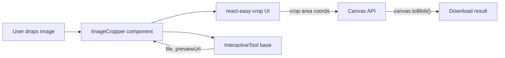
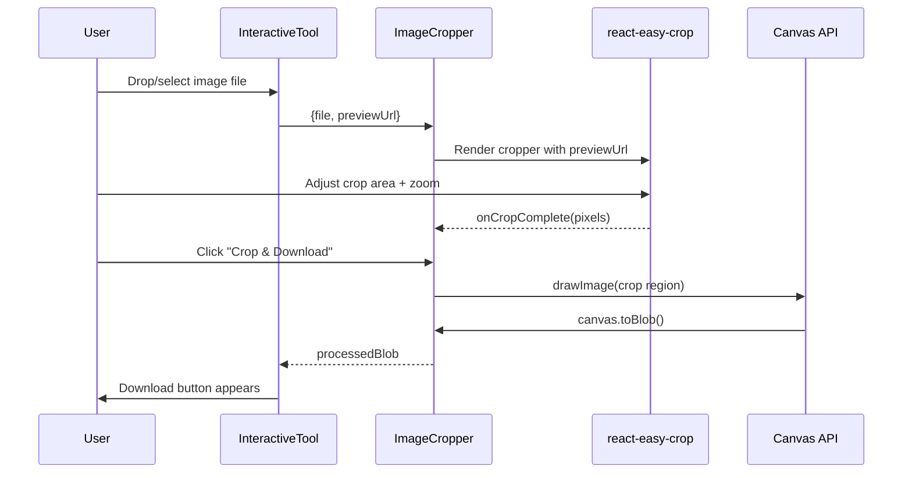

# PRD: Image Cropper Tool

**Status**: Draft
**Author**: Claude
**Date**: April 23, 2026
**Branch**: `feat/image-cropper-tool`
**Complexity**: MEDIUM (score 6)

---

## 1. Context

### 1.1 Problem

The site has no image cropper tool despite 90.5K monthly searches for "image cropper" (+22% YoY). The existing Image Resizer handles scaling but not cropping — a distinct and high-demand operation. Users searching "crop image to circle" (~27K/mo) or "crop image for instagram" (~18K/mo) find no matching page.

### 1.2 Files Analyzed

- `app/(pseo)/tools/[slug]/page.tsx` — tool page route (already handles dynamic tools)
- `app/(pseo)/_components/tools/ImageResizer.tsx` — closest existing tool (reference for patterns)
- `app/(pseo)/_components/tools/InteractiveTool.tsx` — base component for all interactive tools
- `app/(pseo)/_components/pseo/templates/InteractiveToolPageTemplate.tsx` — tool component registry + prop mapping
- `app/(pseo)/_components/tools/index.ts` — tool barrel export
- `app/seo/data/interactive-tools.json` — pSEO data for interactive tools
- `app/(pseo)/tools/page.tsx` — tools hub page with category groups
- `lib/seo/pseo-types.ts` — `IToolConfig` interface
- `middleware.ts` — pSEO path detection (`isPSEOPath`)
- `lib/seo/localization-config.ts` — category localization config

### 1.3 Current Behavior

- Image Resizer handles resizing via Canvas API — no crop functionality
- All interactive tools follow the same pattern: `InteractiveTool` wrapper + specific processing logic + `canvas.toBlob()` output
- Tool components are registered in `TOOL_COMPONENTS` map inside `InteractiveToolPageTemplate.tsx`
- Tool data lives in `interactive-tools.json` with `isInteractive: true` and `toolComponent` field
- Tools hub page at `/tools` auto-discovers tools from data — new tools appear automatically
- pSEO tool paths are already handled by middleware (`/tools/` prefix is in `isPSEOPath`)

---

## 2. Solution

### 2.1 Approach

1. Install `react-easy-crop` for the crop UI (1.74M weekly downloads, most-used React cropper)
2. Build an `ImageCropper` component following the existing tool pattern (uses `InteractiveTool` base)
3. Extend `IToolConfig` with cropper-specific fields (aspect ratio presets, default aspect)
4. Add 5 pSEO data entries to `interactive-tools.json` for the keyword clusters
5. Register the component in the `TOOL_COMPONENTS` map and `getToolProps` switch
6. Add the main `image-cropper` slug to the tools hub `CATEGORY_GROUPS`

### 2.2 Architecture



### 2.3 Key Decisions

- **`react-easy-crop`**: Most popular React cropper, handles zoom/rotation/aspect lock, touch-friendly. Returns pixel crop coordinates — we use those with Canvas to extract the cropped region.
- **Client-side only**: Zero server cost. Cropping is pure Canvas — no AI, no upload.
- **Free for all users**: No credits consumed. Matches the Resizer/Compressor model.
- **`dynamic()` import NOT needed**: `react-easy-crop` is pure JS, no Web Workers or WASM. Standard client component import is fine.
- **Aspect ratio presets**: Match existing Resizer social media presets for consistency.

### 2.4 Data Changes

**`IToolConfig` extension** — add cropper config fields:

```typescript
// Add to IToolConfig in pseo-types.ts
defaultAspectRatio?: number;       // e.g. 1 for square, 16/9 for landscape
aspectRatioPresets?: string;       // filter label for preset group
```

**`interactive-tools.json`** — add 5 new entries (see Phase 2)

---

## 3. Sequence Flow



---

## 4. Execution Phases

### Phase 1: ImageCropper Component — Working crop tool on `/tools/image-cropper`

**Files (max 5):**

- `app/(pseo)/_components/tools/ImageCropper.tsx` — new cropper component
- `app/(pseo)/_components/tools/index.ts` — add export
- `app/(pseo)/_components/pseo/templates/InteractiveToolPageTemplate.tsx` — register in TOOL_COMPONENTS + getToolProps
- `lib/seo/pseo-types.ts` — extend `IToolConfig` with cropper fields
- `app/seo/data/interactive-tools.json` — add `image-cropper` entry

**Implementation:**

- [ ] Install `react-easy-crop` via `yarn add react-easy-crop`
- [ ] Create `ImageCropper.tsx` following `ImageResizer.tsx` pattern:
  - Props: `defaultAspectRatio?`, `aspectRatioPresets?`, `title?`, `description?`
  - Aspect ratio presets: Free, 1:1 (Square), 16:9 (Landscape), 4:3, 3:2, 9:16 (Portrait)
  - Social media presets: Instagram Post (1:1), Instagram Story (9:16), YouTube Thumbnail (16:9), Facebook Post (1.91:1), Twitter Post (16:9), LinkedIn Post (1.91:1), Pinterest Pin (2:3)
  - Uses `InteractiveTool` wrapper for upload/download flow
  - Cropper UI in render callback with `react-easy-crop`'s `Cropper` component
  - On "Crop & Download": use `cropImageViaCanvas()` helper to extract crop region
  - Show crop dimensions in real-time
- [ ] Add `ImageCropper` export to `tools/index.ts`
- [ ] Register `ImageCropper` in `TOOL_COMPONENTS` map
- [ ] Add `case 'ImageCropper':` to `getToolProps()` returning `defaultAspectRatio` and `aspectRatioPresets`
- [ ] Extend `IToolConfig` with `defaultAspectRatio?: number` and `aspectRatioPresets?: string`
- [ ] Add `image-cropper` entry to `interactive-tools.json` with full pSEO data (see data template below)

**Data template for `image-cropper`:**

```json
{
  "slug": "image-cropper",
  "title": "Image Cropper",
  "metaTitle": "Free Image Cropper - Crop Images Online Instantly",
  "metaDescription": "Crop images online for free. No upload required — all processing happens in your browser. Crop to any aspect ratio: square, 16:9, circle. Perfect for social media.",
  "h1": "Free Online Image Cropper - Crop Images Instantly",
  "intro": "Crop your images to any dimension or aspect ratio in seconds. Our free online image cropper works entirely in your browser — no upload, no signup, no watermarks. Perfect for social media, profile pictures, and prints.",
  "primaryKeyword": "image cropper",
  "secondaryKeywords": ["crop image online", "online image cropper", "crop image", "image crop tool", "crop photo online", "picture cropper"],
  "lastUpdated": "2026-04-23T00:00:00Z",
  "category": "tools",
  "toolName": "Image Cropper",
  "description": "Professional image cropping tool that works directly in your browser. Crop images to exact dimensions, choose from social media presets, or use free-form cropping. No quality loss.",
  "isInteractive": true,
  "toolComponent": "ImageCropper",
  "maxFileSizeMB": 25,
  "acceptedFormats": ["image/jpeg", "image/png", "image/webp"],
  "toolConfig": {},
  "features": [...],
  "useCases": [...],
  "benefits": [...],
  "howItWorks": [...],
  "faq": [...],
  "relatedTools": ["image-resizer", "image-compressor", "png-to-jpg"],
  "relatedGuides": [],
  "ctaText": "Need higher resolution?",
  "ctaUrl": "/?signup=1"
}
```

**Tests Required:**

| Test File                                            | Test Name                                           | Assertion                                          |
| ---------------------------------------------------- | --------------------------------------------------- | -------------------------------------------------- |
| `tests/unit/seo/interactive-tools-data.unit.spec.ts` | `should include image-cropper in interactive tools` | `expect(slugs).toContain('image-cropper')`         |
| `tests/unit/seo/interactive-tools-data.unit.spec.ts` | `should have valid toolComponent for image-cropper` | `expect(entry.toolComponent).toBe('ImageCropper')` |
| `tests/unit/seo/interactive-tools-data.unit.spec.ts` | `should have all required fields for image-cropper` | Validate required IToolPage fields exist           |
| `tests/e2e/image-cropper.e2e.spec.ts`                | `should show cropper UI when image is uploaded`     | Cropper container is visible                       |
| `tests/e2e/image-cropper.e2e.spec.ts`                | `should display aspect ratio presets`               | Preset buttons are present                         |
| `tests/e2e/image-cropper.e2e.spec.ts`                | `should show download button after cropping`        | Download button appears after crop action          |

**User Verification:**

- Action: Visit `/tools/image-cropper`, upload an image, select a crop area, click "Crop & Download"
- Expected: Cropped image downloads with correct dimensions

---

### Phase 2: pSEO Crop Variant Pages — 4 additional cropper landing pages

**Files (max 5):**

- `app/seo/data/interactive-tools.json` — add 4 variant entries
- `app/(pseo)/tools/page.tsx` — add "Image Cropper" category group with crop variants

**Implementation:**

- [ ] Add 4 pSEO data entries to `interactive-tools.json`:

| Slug                               | Primary Keyword            | Tool Config                           |
| ---------------------------------- | -------------------------- | ------------------------------------- |
| `crop-image-online-free`           | "crop image online free"   | `{}` (default/free crop)              |
| `crop-image-to-circle`             | "crop image to circle"     | `{ defaultAspectRatio: 1 }`           |
| `crop-image-for-instagram`         | "crop image for instagram" | `{ aspectRatioPresets: "instagram" }` |
| `crop-image-for-youtube-thumbnail` | "crop youtube thumbnail"   | `{ defaultAspectRatio: 16/9 }`        |

- [ ] Add "Image Cropper" group to `CATEGORY_GROUPS` in tools hub page with slugs: `image-cropper`, `crop-image-online-free`, `crop-image-to-circle`, `crop-image-for-instagram`, `crop-image-for-youtube-thumbnail`

**Tests Required:**

| Test File                                            | Test Name                                                | Assertion                             |
| ---------------------------------------------------- | -------------------------------------------------------- | ------------------------------------- |
| `tests/unit/seo/interactive-tools-data.unit.spec.ts` | `should include all crop variant slugs`                  | All 5 slugs present                   |
| `tests/unit/seo/interactive-tools-data.unit.spec.ts` | `should have unique slugs across all interactive tools`  | No duplicate slugs                    |
| `tests/e2e/image-cropper.e2e.spec.ts`                | `should render crop-image-to-circle page with cropper`   | Page loads, cropper component visible |
| `tests/e2e/image-cropper.e2e.spec.ts`                | `should apply default aspect ratio for circle crop page` | Aspect ratio locked to 1:1 on load    |

**User Verification:**

- Action: Visit `/tools/crop-image-to-circle`
- Expected: Cropper loads with square (1:1) aspect locked

---

### Phase 3: SEO Infrastructure — Sitemap, metadata, and structured data validation

**Files (max 5):**

- `tests/unit/seo/image-cropper-seo.unit.spec.ts` — SEO validation tests

**Implementation:**

- [ ] Write SEO unit tests validating:
  - Each crop slug has a valid `metaTitle` (30-60 chars)
  - Each crop slug has a valid `metaDescription` (120-160 chars)
  - Each crop slug has `h1` matching primary keyword intent
  - Each crop slug has `primaryKeyword` and `secondaryKeywords`
  - All crop slugs have `robots: index: true` (no noindex)
  - No duplicate `metaTitle` or `metaDescription` across crop variants
  - Canonical URLs resolve correctly for crop tool pages

**Tests Required:**

| Test File                                       | Test Name                                                | Assertion                       |
| ----------------------------------------------- | -------------------------------------------------------- | ------------------------------- |
| `tests/unit/seo/image-cropper-seo.unit.spec.ts` | `should have valid meta titles for all crop pages`       | Each title 30-60 chars, unique  |
| `tests/unit/seo/image-cropper-seo.unit.spec.ts` | `should have valid meta descriptions for all crop pages` | Each desc 120-160 chars, unique |
| `tests/unit/seo/image-cropper-seo.unit.spec.ts` | `should have h1 matching primary keyword intent`         | H1 contains primary keyword     |
| `tests/unit/seo/image-cropper-seo.unit.spec.ts` | `should not have duplicate meta descriptions`            | All descriptions unique         |
| `tests/unit/seo/image-cropper-seo.unit.spec.ts` | `should have indexable robots directive`                 | No noindex on any crop page     |

**User Verification:**

- Action: Run `yarn test tests/unit/seo/image-cropper-seo.unit.spec.ts`
- Expected: All tests pass

---

## 5. Checkpoint Protocol

### Automated Checkpoint (ALL phases)

After completing each phase, spawn `prd-work-reviewer` agent:

```
Use Agent tool with:
- subagent_type: "prd-work-reviewer"
- prompt: "Review checkpoint for phase [N] of PRD at docs/PRDs/image-cropper-tool.md"
```

Continue to next phase only when agent reports PASS.

---

## 6. Verification Strategy

### Verification Plan

1. **Unit Tests:**
   - File: `tests/unit/seo/interactive-tools-data.unit.spec.ts`
   - Tests: data validation for all crop tool entries

2. **E2E Test:**
   - File: `tests/e2e/image-cropper.e2e.spec.ts`
   - Flow: Visit `/tools/image-cropper` → Upload image → Select crop area → Crop → Download

3. **Manual Verification:**

   ```bash
   # Start dev server
   yarn dev

   # Visit each page and verify:
   # /tools/image-cropper - full cropper with all presets
   # /tools/crop-image-to-circle - 1:1 locked aspect
   # /tools/crop-image-for-instagram - Instagram presets
   # /tools/crop-image-for-youtube-thumbnail - 16:9 locked
   # /tools/crop-image-online-free - free-form crop
   ```

4. **Build Verification:**

   ```bash
   yarn verify
   ```

5. **Evidence Required:**
   - [ ] All unit tests pass (`yarn test`)
   - [ ] E2E test demonstrates full crop flow
   - [ ] `yarn verify` passes
   - [ ] All 5 pages render correctly in browser
   - [ ] Cropped image has correct dimensions

---

## 7. Acceptance Criteria

- [ ] Phase 1 complete: `/tools/image-cropper` shows working cropper, uploads image, crops, downloads
- [ ] Phase 2 complete: 5 pSEO crop pages render with correct aspect ratio defaults
- [ ] Phase 3 complete: All SEO unit tests pass
- [ ] All phases complete with automated checkpoint PASS
- [ ] `yarn verify` passes
- [ ] `react-easy-crop` loaded client-side only (no SSR issues)
- [ ] Zero server cost — all processing client-side via Canvas API
- [ ] Tool appears in `/tools` hub page under "Image Cropper" group
- [ ] All 5 pages have unique, valid meta titles and descriptions

---

## 8. Risks

| Risk                                                   | Mitigation                                                                                                                      |
| ------------------------------------------------------ | ------------------------------------------------------------------------------------------------------------------------------- |
| `react-easy-crop` bundle size (~15KB gzipped)          | Dynamic import not needed — small enough. But if it grows, wrap in `dynamic(() => import(...), { ssr: false })`                 |
| Touch-based crop UX on mobile                          | `react-easy-crop` handles touch natively — verify on mobile viewport                                                            |
| Circle crop not truly circular (Canvas outputs square) | For "crop to circle": apply CSS `border-radius: 50%` preview + export as PNG with transparent corners using `canvas arc + clip` |
| Large images cause lag in cropper                      | `react-easy-crop` uses CSS transforms, not canvas redraw — performant. Limit to 25MB as existing tools do                       |
| pSEO pages for crop variants feel thin                 | Each must have unique intro, features, use cases, FAQ — not just copy-paste with different titles                               |

---

## 9. Integration Points Checklist

**How will this feature be reached?**

- [x] Entry point: `/tools/image-cropper` (and 4 variant slugs)
- [x] Caller file: `app/(pseo)/tools/[slug]/page.tsx` — already handles dynamic tool resolution
- [x] Registration needed: Add to `interactive-tools.json` + `TOOL_COMPONENTS` map + tools hub `CATEGORY_GROUPS`

**Is this user-facing?**

- [x] YES → UI component: `ImageCropper.tsx` using `react-easy-crop`

**Full user flow:**

1. User navigates to `/tools/image-cropper` (from tools hub, search engine, or direct link)
2. Page renders via `tools/[slug]/page.tsx` → loads pSEO data → uses `InteractiveToolPageTemplate`
3. Template resolves `ImageCropper` from `TOOL_COMPONENTS` map
4. User uploads image → `InteractiveTool` base handles file validation
5. `ImageCropper` renders `react-easy-crop` with aspect ratio presets
6. User adjusts crop → clicks "Crop & Download" → Canvas extracts region → downloads
