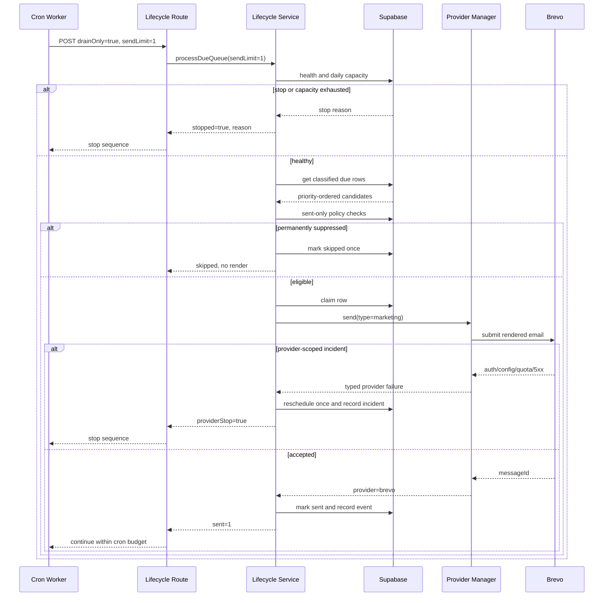

# PRD: Lifecycle and Recovery Email Delivery Restoration

**Status:** Complete; production delivery active under continuous bounded drain
**Owner:** Growth / Engineering
**Created:** 2026-07-15 (America/Vancouver)
**Complexity: 9 → HIGH mode** (+3 touches 10+ files, +2 complex queue/concurrency state, +2 main Worker and standalone cron Worker, +1 database migration, +1 external email provider integration)

## 1. Context

**Problem:** Lifecycle, win-back, and revenue-recovery campaigns exist and the cron runs, but almost no current marketing email reaches a provider because pending rows suppress one another, stale rows are repeatedly recorded as suppressed, and the backlog cannot be released safely within the provider and Cloudflare Worker limits.

### Production evidence captured during this investigation

Evidence was collected read-only on 2026-07-15/16. No marketing email was sent during the investigation.

- Cloudflare Email Sending is enabled for `myimageupscaler.com`; current payment and support transactional messages are reaching Cloudflare and being delivered.
- Cloudflare documents Email Sending as an outbound **transactional** email service. Marketing, lifecycle, and win-back mail must therefore remain on Brevo, not Cloudflare: <https://developers.cloudflare.com/email-service/>.
- The production Brevo credential is healthy:
  - `myimageupscaler-api-prod` versions 27 and 28 contain the same current key.
  - Both versions authenticate to `GET https://api.brevo.com/v3/account` with HTTP 200.
  - Version 28 is current and version 27 remains enabled as a backup.
  - The account is on Brevo's free plan with a 300-message daily send limit.
- The invalid Brevo key is only the stale local development value in `.env.api`, last modified on 2026-06-06. It is not the production source of truth. Production deploys fetch `myimageupscaler-api-prod` into `.env.api.prod` before uploading Worker secrets.
- The deployed cron is active. New suppression events were recorded during the scheduled `:10` run while this investigation was in progress.
- The local `yarn recovery:cron:check` returns HTTP 401 because the local development `CRON_SECRET` does not match production. This is a tooling/parity problem, not evidence that the deployed cron is unauthorized.
- Exact seven-day database counts at investigation time:
  - 200 lifecycle rows were sent, all from the older July 9 Cloudflare-marketing path.
  - 140,732 lifecycle rows were marked skipped.
  - 3,591 rows remained pending; 3,590 were already due.
  - The oldest due row was scheduled for 2026-07-02.
  - No lifecycle `sent` event occurred after the July 15 deployment.
- Current pending backlog composition:

| Dimension         |     Count |
| ----------------- | --------: |
| `keep_high`       |       203 |
| `keep_medium`     |       815 |
| `hold_experiment` |     1,131 |
| Unclassified      |     1,442 |
| **Total**         | **3,591** |

| Campaign                     | Pending |
| ---------------------------- | ------: |
| `first-result-followup`      |   1,505 |
| `low-credits`                |   1,125 |
| `zero-credits`               |     349 |
| `winback-never-uploaded-14d` |     291 |
| `high-usage-free-user`       |     205 |
| `winback-former-buyer-45d`   |      56 |
| `unused-credits-14d`         |      33 |
| `checkout-abandoned-24h`     |      20 |
| `winback-credit-holder-21d`  |       7 |

- In the latest 1,000 skipped rows, 618 used `suppressed_campaign_cooldown` and 379 used `suppressed_lifecycle_weekly_cap`.
- In the last seven days, `email_logs` recorded 1,154 failed provider attempts. The sampled historical failures were dominated by Cloudflare HTTP 429 throttling and the removed Resend fallback's invalid key. Current code no longer registers Resend and routes marketing only to Brevo.
- The production queue audit command currently times out with `canceling statement due to statement timeout`, so the guarded recipient-value rollout cannot be operated reliably at the present queue size.
- The most recent GitHub deployment workflow is blocked before deployment by 18 unrelated navigation tests that use machine-specific absolute paths. Manual deployment succeeded, but automated release verification is not currently trustworthy.

### Files analyzed

- `shared/config/env.ts`
- `server/services/email.service.ts`
- `server/services/email-lifecycle.service.ts`
- `server/services/email-recipient-value.service.ts`
- `server/services/email-providers/base-email-provider-adapter.ts`
- `server/services/email-providers/brevo.provider-adapter.ts`
- `server/services/email-providers/cloudflare.provider-adapter.ts`
- `server/services/email-providers/email-provider-manager.ts`
- `app/api/cron/email-lifecycle/route.ts`
- `workers/cron/index.ts`
- `workers/cron/wrangler.toml`
- `scripts/check-recovery-cron-target.ts`
- `scripts/check-recovery-delivery.ts`
- `scripts/audit-email-recipient-value.ts`
- `scripts/deploy/deploy.sh`
- `scripts/deploy/steps/05-secrets.sh`
- `scripts/deploy/steps/06-verify.sh`
- `.github/workflows/deploy.yml`
- `supabase/migrations/20260710000100_email_campaign_priority.sql`
- `supabase/migrations/20260710000300_email_lifecycle_health_report.sql`
- `supabase/migrations/20260712000100_email_recipient_value_classification.sql`
- `supabase/migrations/20260712000200_email_recipient_value_apply_rpc.sql`
- `supabase/migrations/20260712000300_email_recipient_value_due_queue.sql`
- `supabase/migrations/20260712000400_email_recipient_value_performance.sql`
- `docs/PRDs/email-queue-recipient-value-pruning.md`
- `docs/PRDs/revenue-optimization-2026-07-10/01-cloudflare-email-primary-and-priority-caps.md`
- Relevant provider, lifecycle, cron, migration, and recovery script unit tests.

## 2. Root Causes

### 2.1 Pending rows are counted as delivered frequency history

`EmailLifecycleService` counts both `pending` and `sent` rows in global marketing and priority caps. The send-time call supplies `ignoreExistingPending: true`, but `getSuppressionReason()` and its count helpers never use that option.

Consequences:

- Multiple eligible campaigns queued for one user reserve the same frequency window.
- A pending campaign can suppress another pending campaign before either is delivered.
- Backlog rows can be converted to `skipped` without a provider submission.
- The observed suppression totals describe queue contention more than user contact frequency.

### 2.2 Suppression audit rows are not idempotent

When eligibility is re-evaluated, a suppressed candidate gets a new skipped queue row and lifecycle event. The hourly scan can therefore record the same user/campaign/reason repeatedly while the underlying cap remains active. This explains the 140,732 skipped rows and makes operational metrics noisy and expensive.

### 2.3 Unclassified marketing rows are implicitly sendable

`get_due_email_lifecycle_queue` uses `COALESCE(recipient_value_decision, 'keep_medium')`. That treats 1,442 unclassified production rows as approved medium-value recipients, contradicting the recipient-value PRD's requirement to classify before delivery.

### 2.4 A single request can attempt too much work for Cloudflare

The cron asks one Next.js Worker request to scan up to 500 users and process up to 250 due rows. Every actual send loads a React Email template, renders HTML, performs policy queries, and calls an external provider. That shape is incompatible with the project's 10 ms Cloudflare Worker CPU constraint and can burst a provider quota.

### 2.5 Provider incidents are not represented accurately

- `BrevoProviderAdapter` throws generic errors rather than typed provider/recipient failures.
- `EmailProviderManager` creates its terminal error with `transient: true` regardless of the last failure.
- Lifecycle handling only recognizes provider-capacity exhaustion when no provider was attempted.
- An attempted provider with invalid credentials, a quota response, or an account incident can therefore reschedule rows repeatedly instead of stopping the batch with a provider-scoped reason.

### 2.6 Production readiness does not prove the marketing route

Current deploy checks verify the app and cron schedule but do not prove that:

- the production Brevo key authenticates;
- the deployed Worker can submit one marketing message;
- the submitted message is absent from Cloudflare Email Sending logs;
- the queue and lifecycle event are updated consistently.

## 3. Goals

1. Restore intentional lifecycle and recovery delivery through Brevo without routing marketing content through Cloudflare.
2. Make frequency caps reflect messages actually sent, while preserving same-campaign deduplication and safety suppressions.
3. Prevent repeated suppression records for the same decision window.
4. Keep unclassified and experiment-hold rows out of the due queue.
5. Process at most one rendered email per Next.js Worker invocation and stay within the 10 ms CPU constraint.
6. Preserve the 300/day Brevo limit and reserve capacity for transactional fallback.
7. Stop a drain immediately on provider-scoped authentication, configuration, quota, or availability incidents.
8. Provide a no-send production readiness check plus one explicit, controlled delivery proof.
9. Drain only revalidated, high-value backlog rows in staged cohorts with automatic stop thresholds.

## 4. Non-Goals

- Do not send marketing, lifecycle, recovery, education, or win-back campaigns through Cloudflare Email Service.
- Do not restore Resend as quota-harvesting fallback.
- Do not redesign email copy or templates in this project.
- Do not bypass unsubscribe, preference, complaint, permanent-bounce, campaign-cooldown, or emergency-ceiling rules.
- Do not send `hold_experiment`, `cancel`, or unclassified rows.
- Do not bypass the one-send invocation limit, priority ordering, or 200/day marketing budget.
- Do not purchase a Brevo plan automatically. A paid-plan decision can follow measured demand and conversion.
- Do not expose recipient addresses, user IDs, provider keys, or message content in readiness output.
- Do not create a new operator UI; this remains a background and CLI-operated system.

## 5. Success Criteria

- A controlled production recovery email to an explicit internal recipient is submitted by `brevo`, received, and absent from Cloudflare Email Sending logs.
- Production readiness proves Brevo HTTP 200 authentication using the GCloud production secret before enabling any cohort.
- Global and priority cap queries count only `sent` rows; pending rows cannot consume a delivered-message allowance.
- Same-campaign pending deduplication remains enforced.
- Preferences, complaints, bounces, and unsubscribe state are evaluated before any force-frequency override.
- At most one suppression audit row/event is recorded per user, campaign, reason, and 24-hour observation window.
- The due-queue RPC returns zero unclassified, `hold_experiment`, `cancel`, disabled-campaign, or actively claimed marketing rows.
- `yarn email:queue:audit:prod` completes against the current production queue without a statement timeout and without mutation.
- One Next.js Worker invocation renders and submits at most one email.
- Cloudflare observability shows lifecycle drain p95 CPU below 8 ms during canary and zero CPU-limit terminations.
- Marketing delivery is capped at 200 Brevo submissions per UTC day during backlog drain, leaving at least 100 of the free plan's 300 daily credits for transactional fallback and controlled verification.
- A provider authentication/configuration/quota incident reschedules the current row once, stops the drain, and emits one structured incident reason.
- The oldest eligible `keep_high` due row moves forward on every healthy drain window.
- No `keep_medium` cohort begins until the revalidated `keep_high` cohort passes delivery thresholds.
- `yarn test` on affected areas and `yarn verify` pass before rollout.

## 6. Integration Points

### How will this feature be reached?

- [x] Entry point identified: Cloudflare cron triggers `app/api/cron/email-lifecycle/route.ts`; guarded CLI scripts perform readiness, controlled delivery, audit, and reporting.
- [x] Caller identified: `workers/cron/index.ts` invokes the lifecycle route; `EmailLifecycleService` calls `EmailService`; `EmailProviderManager` selects Brevo for marketing.
- [x] Registration/wiring identified: cron routing, route query parsing, service policy, due-queue RPC, provider adapters, deploy verification, and package scripts must be updated together.

### Is this user-facing?

- [x] No new UI. Recipients receive existing recovery/lifecycle templates. Operators use count-only CLI and provider dashboards.

### Full recipient flow

1. A user action or daily eligibility scan identifies a campaign candidate.
2. Permanent safety suppressions and same-campaign deduplication run.
3. A pending row is inserted only once.
4. The due-queue RPC returns only enabled, classified, retained rows in priority/value order.
5. One Worker invocation revalidates the row against **sent-only** frequency history and claims it.
6. Marketing email renders once and is submitted to Brevo.
7. The queue row and lifecycle event record the provider/message ID.
8. Click, return, and purchase attribution use the existing signed lifecycle URL flow.

```mermaid
flowchart LR
  Trigger[User event or eligibility cron] --> Eligibility[Eligibility and permanent suppressions]
  Eligibility --> Queue[(Lifecycle queue)]
  Queue --> DueRPC[Classified due-row RPC]
  Cron[Standalone cron Worker] -->|sequential one-send invocations| Drain[Next.js drain route]
  DueRPC --> Drain
  Drain --> Policy[Sent-only frequency policy]
  Policy --> Claim[Claim one row]
  Claim --> Manager[Email provider manager]
  Manager -->|transactional| CF[Cloudflare Email Service]
  Manager -->|marketing| Brevo[Brevo]
  CF --> Events[(Logs and lifecycle events)]
  Brevo --> Events
  Events --> Health[Health and attribution reports]
```

## 7. Key Decisions

### 7.1 Provider policy

| Email type                   | Primary    | Fallback                                   | Reason                                                          |
| ---------------------------- | ---------- | ------------------------------------------ | --------------------------------------------------------------- |
| Transactional                | Cloudflare | Brevo on provider-scoped eligible failures | Current delivered path; preserve resilience                     |
| Marketing/lifecycle/recovery | Brevo      | None                                       | Cloudflare Email Service is transactional; do not quota-harvest |

### 7.2 Stage-aware suppression history

Use explicit history modes rather than a boolean that callers can ignore:

- `enqueue`:
  - same campaign: count `pending` or `sent` for deduplication/cooldown;
  - global/priority caps: count only `sent`;
  - permanent suppressions always apply.
- `send`:
  - exclude the current queue row;
  - same campaign and global/priority caps count only `sent`;
  - permanent suppressions always apply again.
- `forceFrequency` may bypass only time/frequency caps. It must never bypass preference, unsubscribe, complaint, bounce, disabled campaign, or invalid-recipient checks.

### 7.3 Worker slicing

- Queue eligibility runs once at `:10`.
- Drain calls are separate, sequential HTTP requests from the standalone cron Worker.
- Each application request may scan/suppress a small number of rows but may render and submit **at most one** message.
- The cron Worker stops its sequence when the application reports a provider incident, health stop, or no eligible row.
- Do not use `Promise.all` for drain calls; sequential calls avoid repeatedly selecting the same top row and make provider stop signals effective.

### 7.4 Daily capacity

- Initial hard marketing budget: 200 successful Brevo submissions per UTC day.
- Provider account hard limit: 300/day.
- Reserved capacity: 100/day for transactional fallback, verification, and operational margin.
- Provider usage must be checked atomically before each submission and incremented only after acceptance.
- A 429 or exhausted budget stops the current cron sequence; it does not mark recipients permanently failed.

### 7.5 Backlog eligibility

- `keep_high`: eligible after revalidation.
- `keep_medium`: retained but paused until high-value canary passes.
- `hold_experiment`: excluded.
- `cancel`: excluded.
- Unclassified: excluded until a successful recipient-value audit/apply run assigns a current policy version.
- Disabled campaigns: excluded without changing existing rows to `skipped`; re-enabling resumes them.

## 8. Data Changes

One additive migration will:

1. Replace `get_due_email_lifecycle_queue` so marketing rows require a non-null current recipient-value decision in `protected`, `keep_high`, or `keep_medium`.
2. Permit transactional rows independently of recipient-value classification.
3. Exclude disabled campaigns and active claims.
4. Preserve priority → value decision → value score → campaign sort priority → scheduled time ordering.
5. Add or verify indexes for:
   - due status/scheduled time/claim state;
   - user/status/created time sent-history checks;
   - user/campaign/status/reason/created time suppression idempotency;
   - recipient-value decision/score due ordering.
6. Preserve rollback by restoring the previous RPC definition and dropping only newly introduced indexes.

No recipient email, template payload, or provider credential is added to a new table.

## 9. Sequence Flow

## 10. Execution Phases

### Release prerequisite: restore automated deployment

The current GitHub workflow cannot deploy because `tests/unit/navigation/pseo-links.unit.spec.ts` reads absolute paths from one developer machine. Repair that test to resolve paths from the repository root and prove the full quality job is green before deploying any email phase. This is a release prerequisite, not an email behavior change.

### Phase 1: Correct suppression semantics — eligible queued users are no longer suppressed by undelivered rows

**Files (max 5):**

- `server/services/email-lifecycle.service.ts` — replace the unused pending-ignore boolean with explicit enqueue/send history modes; apply permanent suppressions before force-frequency logic; add suppression idempotency.
- `server/services/__tests__/email-lifecycle.service.test.ts` — service-level enqueue, send-time, force, and idempotency coverage.
- `tests/unit/server/services/email-lifecycle-priority.unit.spec.ts` — sent-only cap matrix coverage.
- `tests/unit/api/email-lifecycle-cron.unit.spec.ts` — prove pending rows do not consume a send allowance through the cron path.

**Implementation:**

- [x] Introduce a typed history mode: `enqueue` or `send`.
- [x] Keep same-campaign pending deduplication at enqueue.
- [x] Count only `sent` rows for revenue, lifecycle/education, and emergency ceilings.
- [x] At send time, count only previously sent rows and exclude the current queue ID.
- [x] Evaluate preference/unsubscribe/bounce/complaint before `forceFrequency`.
- [x] Limit `forceFrequency` to cap bypass; document every allowed caller.
- [x] Reuse a recent identical skipped decision instead of inserting another row/event within 24 hours.
- [x] Return whether a suppression was newly recorded so cron metrics remain honest.

**Tests Required:**

| Test file                                                   | Test name                                                                             | Assertion                       |
| ----------------------------------------------------------- | ------------------------------------------------------------------------------------- | ------------------------------- |
| `server/services/__tests__/email-lifecycle.service.test.ts` | `should not count another pending campaign as sent history when processing a due row` | Due row remains eligible        |
| Same                                                        | `should deduplicate the same pending campaign when enqueueing`                        | No second pending row           |
| Same                                                        | `should count a sent campaign toward the applicable cap`                              | Correct suppression reason      |
| Same                                                        | `should not bypass a complaint when forceFrequency is true`                           | Permanent suppression wins      |
| Same                                                        | `should reuse a recent identical suppression audit record`                            | One row/event in 24 hours       |
| `tests/unit/api/email-lifecycle-cron.unit.spec.ts`          | `should submit one eligible row when only other pending campaigns exist`              | `EmailService.send` called once |

**Verification Plan:**

1. Run both service and cron unit suites.
2. Seed one user with two pending campaigns and no sends; dry-run must report one eligible candidate rather than a weekly-cap suppression.
3. Seed one prior sent row; dry-run must produce the expected cap.
4. Run `yarn verify`.

**Checkpoint:** Spawn `prd-work-reviewer` for Phase 1. Continue only on PASS.

### Phase 2: Make queue selection safe and operable — only classified retained rows can drain and the audit completes

**Files (max 5):**

- `supabase/migrations/<timestamp>_restore_lifecycle_delivery_queue.sql` — due RPC and supporting indexes with rollback notes.
- `tests/unit/server/services/email-recipient-value-migration.unit.spec.ts` — migration contract coverage.
- `server/services/email-recipient-value.service.ts` — ensure audit pagination uses indexed, bounded reads.
- `server/services/__tests__/email-recipient-value.integration.test.ts` — retained/unclassified/disabled/held selection behavior.
- `scripts/audit-email-recipient-value.ts` — bounded progress and actionable timeout reporting.

**Implementation:**

- [x] Remove the implicit `COALESCE(..., 'keep_medium')` approval for marketing rows.
- [x] Require a current policy version for retained marketing decisions.
- [x] Exclude held, cancelled, disabled, and active-claim rows.
- [x] Keep transactional rows independent of classification.
- [x] Add the minimum indexes demonstrated by `EXPLAIN (ANALYZE, BUFFERS)`.
- [x] Page the audit without one long-running statement or unbounded in-memory result.
- [x] Preserve deterministic priority/value/time ordering.

**Tests Required:**

| Test file              | Test name                                                          | Assertion                                        |
| ---------------------- | ------------------------------------------------------------------ | ------------------------------------------------ |
| Migration unit         | `should exclude unclassified marketing rows from the due queue`    | RPC has explicit non-null retained decision gate |
| Migration unit         | `should allow transactional rows without recipient classification` | Transactional branch remains eligible            |
| Integration            | `should return keep_high before keep_medium`                       | Stable ordering                                  |
| Integration            | `should exclude disabled and held campaigns`                       | Neither row returned                             |
| Integration            | `should release a stale claim but preserve an active claim`        | Ten-minute claim behavior retained               |
| Audit unit/integration | `should page the current queue without statement timeout`          | Complete count-only result                       |

**Verification Plan:**

1. Apply migration to a disposable/local database and run migration tests.
2. Run `EXPLAIN (ANALYZE, BUFFERS)` on due selection and the audit source query using production-scale fixtures.
3. Run production audit in dry-run; expected total reconciles with direct pending count and no status changes.
4. Run `yarn verify`.

**Checkpoint:** Spawn `prd-work-reviewer` for Phase 2. Continue only on PASS.

### Phase 3: Slice delivery across Worker invocations — one app request renders at most one message

**Files (max 5):**

- `server/services/email-lifecycle.service.ts` — accept a send limit separate from scan limit and stop after one accepted submission.
- `app/api/cron/email-lifecycle/route.ts` — parse bounded `drainOnly`, `scanLimit`, and `sendLimit`; expose structured stop reasons.
- `workers/cron/index.ts` — run one eligibility call and a bounded sequence of single-send drain calls.
- `tests/unit/api/cron-email-lifecycle.unit.spec.ts` — route bounds and response contract.
- `workers/cron/index.test.ts` — sequential drain and early-stop behavior.

**Implementation:**

- [x] Separate `scanLimit` from `sendLimit`.
- [x] Hard-cap `sendLimit` to 1 for production route invocations.
- [x] Support `drainOnly=true` so repeated drain calls do not rerun eligibility scans.
- [x] Have the cron Worker call drains sequentially, never in parallel.
- [x] Stop the cron sequence on no eligible row, health stop, provider stop, operator stop, or daily budget stop.
- [x] Keep each response count-only and free of recipient data.
- [x] Log wall time and provider I/O separately from Worker CPU evidence.

**Tests Required:**

| Test file         | Test name                                            | Assertion                                 |
| ----------------- | ---------------------------------------------------- | ----------------------------------------- |
| Cron route unit   | `should cap production sendLimit at one`             | Service receives `sendLimit: 1`           |
| Cron route unit   | `should skip eligibility when drainOnly is true`     | Queue eligibility not called              |
| Lifecycle service | `should stop after one accepted provider submission` | One render/send, remaining rows untouched |
| Cron Worker       | `should invoke drain requests sequentially`          | Next call begins after prior response     |
| Cron Worker       | `should stop drain sequence on provider incident`    | No later calls                            |

**Verification Plan:**

1. Run route, service, and standalone cron Worker tests.
2. Use mocks that expose concurrent calls; maximum concurrency must be one.
3. Run a non-send dry-run against production and verify response bounds.
4. During controlled canary, verify p95 Worker CPU below 8 ms and zero CPU-limit events.
5. Run `yarn verify`.

**Manual checkpoint required:** External/CPU behavior must be inspected in Cloudflare observability before Phase 4 rollout.

**Checkpoint:** Spawn `prd-work-reviewer` for Phase 3, then obtain manual CPU verification. Continue only when both pass.

### Phase 4: Make provider failure behavior truthful — provider incidents stop the drain without burning recipients

**Files (max 5):**

- `server/services/email-providers/brevo.provider-adapter.ts` — map HTTP/network outcomes to typed provider or recipient failures.
- `server/services/email-providers/email-provider-manager.ts` — preserve terminal classification, transience, scope, and attempted providers.
- `server/services/email-lifecycle.service.ts` — reschedule provider-scoped failures once and stop; permanently fail only recipient-scoped rejections.
- `server/services/email-providers/__tests__/email-provider-manager.test.ts` — routing and terminal metadata coverage.
- `server/services/__tests__/email-lifecycle.service.test.ts` — queue outcomes for provider versus recipient failure.

**Implementation:**

- [x] Classify Brevo 401/403 as provider authentication, 402/config errors as provider configuration, 429 as rate limited, 408/timeouts and 5xx as transient provider errors, and explicit invalid-recipient/bounce responses as recipient scoped.
- [x] Preserve the last error's `transient` and `fallbackEligible` values in the manager's terminal error.
- [x] Keep marketing Brevo-only and transactional Cloudflare → Brevo.
- [x] On provider-scoped failure, reschedule the row with a structured reason and stop the current drain sequence.
- [x] On recipient-scoped permanent rejection, mark only that row failed and continue later invocations.
- [x] Record classification, attempted providers, unavailable providers, and fallback reasons in lifecycle event metadata without message content.

**Tests Required:**

| Test file         | Test name                                                                                      | Assertion                          |
| ----------------- | ---------------------------------------------------------------------------------------------- | ---------------------------------- |
| Provider manager  | `should preserve Brevo authentication failure as non-transient provider-scoped terminal error` | Classification and flags unchanged |
| Provider manager  | `should never route marketing email to Cloudflare`                                             | Cloudflare not called              |
| Provider manager  | `should use Brevo only as transactional fallback on eligible Cloudflare failure`               | Ordered attempts                   |
| Lifecycle service | `should reschedule once and stop when Brevo is rate limited`                                   | Pending row, provider stop true    |
| Lifecycle service | `should fail only the rejected recipient and not stop future drains`                           | Recipient row failed               |

**Verification Plan:**

1. Run provider manager and lifecycle service tests.
2. Exercise mocked 401, 429, 500, timeout, and invalid-recipient responses.
3. Verify structured logs contain no addresses or payloads.
4. Run `yarn verify`.

**Checkpoint:** Spawn `prd-work-reviewer` for Phase 4. Continue only on PASS.

### Phase 5: Add production readiness and controlled proof — deployment cannot enable cohorts without proving Brevo

**Files (max 5):**

- `scripts/check-email-delivery-readiness.ts` — no-send validation of production Brevo auth, Cloudflare sending domain, queue counts, policy distribution, and cron dry-run.
- `tests/unit/scripts/check-email-delivery-readiness.unit.spec.ts` — fail-closed and redaction tests.
- `scripts/check-recovery-delivery.ts` — assert controlled marketing delivery uses Brevo and exactly one explicit recipient.
- `scripts/deploy/steps/06-verify.sh` — run no-send readiness using fetched production env before rollout.
- `package.json` — add local/prod readiness commands using the existing environment loader.

**Implementation:**

- [x] Load production values only from fetched `.env.api.prod`/`.env.client.prod`; never promote `.env.api` or `.env.client`.
- [x] Validate Brevo account auth and report only plan type/daily limit, never account identity or key material.
- [x] Validate Cloudflare sending domain is enabled without sending.
- [x] Authenticate the lifecycle dry-run to the deployed target.
- [x] Report exact pending/due counts and value bands with no recipient data.
- [x] Fail readiness on invalid provider auth, stale cron secret, unclassified rows being returned as due, or missing backup secret version.
- [x] Require explicit `--send --user-id --email` for the existing controlled delivery command.
- [x] Assert controlled marketing result provider is `brevo`; clean verifier rows unless `--keep-rows` is explicit.

**Tests Required:**

| Test file                | Test name                                                          | Assertion                            |
| ------------------------ | ------------------------------------------------------------------ | ------------------------------------ |
| Readiness script unit    | `should fail when production Brevo authentication is not HTTP 200` | Non-zero exit                        |
| Same                     | `should redact keys account identity and recipients`               | Output contains only counts/booleans |
| Same                     | `should fail when cron dry-run returns 401`                        | Secret parity required               |
| Controlled delivery unit | `should require explicit send mode user and recipient`             | Fail closed                          |
| Controlled delivery unit | `should reject a non-Brevo marketing result`                       | Provider policy proved               |

**Verification Plan:**

1. Run readiness tests and the no-send command against production.
2. Confirm GCloud production versions 27 and 28 remain enabled; do not destroy either.
3. Send exactly one controlled recovery message to an internal address.
4. Confirm Brevo submission/delivery, queue `sent`, lifecycle `sent`, click redirect, and no Cloudflare marketing log.
5. Run `yarn verify`.

**Manual checkpoint required:** Confirm provider dashboards and receipt for the controlled recipient.

**Checkpoint:** Spawn `prd-work-reviewer` for Phase 5, then obtain manual provider verification. Continue only when both pass.

### Phase 6: Reclassify and drain the backlog — high-value recipients receive measured cohorts without a burst

**Files:** No new implementation files. This is a guarded production rollout using the completed scripts, campaign controls, and reports.

**Implementation/operations:**

- [x] Run the recipient-value audit in dry-run and reconcile totals with direct pending counts.
- [x] Apply classification only with the persisted run ID, unchanged snapshot, explicit expected count, and `--write` guard from the existing pruning PRD.
- [x] Leave `hold_experiment`, `cancel`, and unclassified rows excluded.
- [x] Disable non-canary campaigns before the first drain; due selection must honor disabled campaigns without discarding rows.
- [x] Start with current/revalidated `keep_high` revenue-critical rows.
- [x] Increase the daily cohort only after the previous checkpoint passes.
- [x] Keep the maximum at 200/day while the Brevo plan is 300/day.
- [x] Re-run classification before releasing any row older than 30 days.

**Rollout stages:**

| Stage | Cohort                                      | Maximum submissions | Required observation                |
| ----- | ------------------------------------------- | ------------------: | ----------------------------------- |
| 0     | One explicit internal controlled recipient  |             1 total | Receipt, provider, attribution, CPU |
| 1     | Internal/allowlisted `keep_high` fixtures   |            10 total | 24 hours                            |
| 2     | `keep_high` revenue-critical                |              25/day | 48 hours                            |
| 3     | Remaining `keep_high`                       |             100/day | 72 hours                            |
| 4     | Revalidated `keep_medium`, priority ordered |             200/day | Continuous daily review             |

On 2026-07-16, the operator explicitly waived the 24/48/72-hour observation delays and directed
immediate activation. This waiver removed time-based pauses only. The one-send invocation limit,
sequential drain, retained-recipient gates, provider stop behavior, priority ordering, and 200/day
marketing budget remain enforced.

**Stop conditions:**

- Any provider authentication or configuration failure.
- Any marketing message observed in Cloudflare Email Sending.
- Any complaint in the first 100 external sends; afterward complaint rate above 0.1%.
- Two hard bounces in the first 100 external sends; afterward hard-bounce rate above 2%.
- Provider failure rate above 5% over any 100-send rolling window.
- Cloudflare Worker p95 CPU at or above 8 ms or any CPU-limit termination.
- Queue/event reconciliation mismatch.
- Daily Brevo usage reaches 200 marketing submissions or total account usage approaches 300.

**Verification Plan:**

1. Capture readiness output before every stage.
2. Capture provider accepted/delivered/bounced/complained counts and lifecycle sent/clicked/returned/purchased counts after each stage.
3. Reconcile provider submissions to queue/event records.
4. Run the recipient-value performance report by campaign, priority, and value band.
5. Run `yarn verify` before each code-bearing deployment; no code change is required between rollout stages.

**Manual checkpoint required:** Product/Growth approves each cohort increase after reviewing delivery, complaints, bounces, clicks, purchases, provider capacity, and Worker CPU.

## 11. Error Handling Contract

| Failure                                                         | Scope              | Queue action                                     | Drain action                |
| --------------------------------------------------------------- | ------------------ | ------------------------------------------------ | --------------------------- |
| Preference/unsubscribe/complaint/known bounce                   | Recipient          | Mark skipped with stable reason                  | Continue next invocation    |
| Invalid recipient/permanent bounce                              | Recipient          | Mark failed                                      | Continue next invocation    |
| Brevo 401/403                                                   | Provider           | Reschedule once                                  | Stop immediately            |
| Brevo configuration/account error                               | Provider           | Reschedule once                                  | Stop immediately            |
| Brevo 429/daily budget exhausted                                | Provider capacity  | Reschedule after UTC reset/backoff               | Stop immediately            |
| Brevo timeout/5xx/network                                       | Provider transient | Reschedule with bounded backoff                  | Stop current sequence       |
| Cloudflare transactional provider failure eligible for fallback | Provider           | Attempt Brevo once                               | Record fallback             |
| Template missing/render failure                                 | Application        | Mark failed with template classification         | Continue; alert engineering |
| Database suppression/claim query failure                        | Infrastructure     | Leave pending and release stale claim by timeout | Stop current invocation     |
| Worker CPU limit                                                | Runtime            | Row remains pending unless claim cleanup needed  | Stop rollout and redesign   |

Retries must be bounded and idempotent. Do not retry permanent recipient failures through another provider.

## 12. Security and Compliance

- Continue using `serverEnv`; never access `process.env` directly in application code.
- GCloud `myimageupscaler-api-prod` remains the production source of truth.
- Never push local `.env.api` or `.env.client` to a production secret.
- Fetch the current production secret, modify only the required value, add a new version, validate it, and retain at least two enabled versions.
- Readiness and logs must not print keys, account identity, recipient addresses, user IDs, subjects, or template payloads.
- Cron/readiness endpoints remain protected by `CRON_SECRET` and are not added to public routes.
- Marketing preference and permanent suppression checks fail closed for delivery. A database read failure leaves the row pending.
- Controlled sends require an explicit recipient and must never support a broad list.

## 13. Observability

Every cron response/log should include only aggregate fields:

- `dryRun`, `drainOnly`, `scanLimit`, `sendLimit`;
- `eligible`, `sent`, `skipped`, `failed`, `rescheduled`;
- `duePending`, `oldestPendingScheduledFor`;
- `stoppedByHealth`, `stoppedByProvider`, `stoppedByCapacity`;
- `providerClassification`, `attemptedProviders`, `fallbackReasons`;
- counts by campaign priority and recipient-value band;
- wall time and externally observed Worker CPU metric reference.

Required daily report:

- queued, due, sent, skipped, failed, and rescheduled;
- suppressions by stable reason;
- Brevo accepted, delivered, bounced, complained, and remaining daily capacity;
- Cloudflare transactional accepted/delivered and fallback count;
- lifecycle sent/clicked/returned/purchased by campaign, priority, and value band;
- oldest eligible due row and backlog age percentiles.

## 14. Risks and Mitigations

| Risk                                           | Mitigation                                                                 |
| ---------------------------------------------- | -------------------------------------------------------------------------- |
| Fixing caps releases thousands at once         | One-send invocation, 200/day budget, campaign gating, staged value cohorts |
| Brevo free quota blocks transactional fallback | Reserve at least 100/day and stop before account limit                     |
| Pending rows still distort caps                | Explicit history modes and tests asserting sent-only global counts         |
| Repeated scans recreate suppression noise      | 24-hour suppression idempotency and supporting index                       |
| Unclassified recipients are accidentally sent  | Due RPC requires current retained decision                                 |
| Parallel drains collide                        | Sequential cron calls plus existing claim/stale-claim behavior             |
| Worker CPU exceeds 10 ms                       | One render per invocation, canary CPU gate, immediate stop threshold       |
| Provider incident burns the queue              | Provider-scoped typed errors reschedule once and stop sequence             |
| Local stale key is mistaken for production     | Readiness loads fetched `.env.api.prod` only and labels its source         |
| CI blocks or skips deployment verification     | Repair path-dependent test before Phase 1 deployment                       |
| Metrics count attempts as deliveries           | Reconcile lifecycle `sent` events with provider accepted IDs               |

## 15. Acceptance Criteria

- [x] Release prerequisite is fixed and the repository quality job passes.
- [x] All six phases complete under the explicit observation-delay waiver.
- [x] All implemented phase-specific tests pass.
- [x] `yarn test` on affected areas passes.
- [x] `yarn verify` passes.
- [x] Every automated `prd-work-reviewer` checkpoint through the completed Phase 5 passes.
- [x] Manual CPU and external-provider checkpoints pass.
- [x] Production Brevo auth is HTTP 200 from the fetched production secret.
- [x] At least two enabled production secret versions remain.
- [x] One controlled marketing recovery email is delivered through Brevo only.
- [x] Cloudflare continues delivering transactional messages and receives zero marketing campaigns.
- [x] Pending rows do not consume sent-frequency caps.
- [x] Permanent suppressions cannot be bypassed by force-frequency mode.
- [x] Suppression recording is idempotent within the defined window.
- [x] Unclassified/held/cancelled/disabled marketing rows are absent from due selection.
- [x] Production queue audit completes without timeout.
- [x] Each app invocation renders/submits at most one email.
- [x] Marketing sends are atomically limited to 200/day on the current Brevo plan.
- [x] Provider incidents stop the drain with structured, secret-free evidence.
- [x] Continuous production drain is active; deterministic due ordering exhausts eligible
      `keep_high` before selecting `keep_medium`.

## 16. Verification Evidence

Populate this section during implementation. Do not mark a phase complete from code review alone.

### Phase 1

- Unit tests: `server/services/__tests__/email-lifecycle.service.test.ts`,
  `tests/unit/server/services/email-lifecycle-priority.unit.spec.ts`, and
  `tests/unit/api/email-lifecycle-cron.unit.spec.ts` cover sent-only history,
  same-campaign pending deduplication, force-override safety, suppression audit reuse,
  and the cron-to-service submission path.
- Dry-run fixture proof: deterministic queue fixtures prove that two pending campaigns with
  no sends produce `eligible=1, queued=1, skipped=0`, while one prior sent campaign produces
  `eligible=1, queued=0, skipped=1`.
- `yarn verify`: passed after the final Phase 1 corrections.
- Reviewer checkpoint: PASS; focused affected suites 44/44, TypeScript, verify, and
  `git diff --check` all passed. A later narrow regression re-review also passed 31/31 tests,
  confirming empty Cloudflare `permanent_bounces` arrays do not suppress while genuine permanent
  signals and the original Phase 1 cap/deduplication behavior remain intact.

### Phase 2

- Migration tests: 24/24 migration, audit CLI, paginated service, and delivery-policy tests
  passed. The
  migration also applied cleanly to a disposable PostgreSQL 16 database with 100,000 queue
  fixtures and returned zero ineligible due rows. A second clean migration run behaviorally
  proved transactional/unclassified independence, current-policy marketing gates,
  keep-high-before-medium ordering, disabled/held exclusion, active-claim exclusion,
  stale-claim release, and bounded transaction-signal aggregation.
- `EXPLAIN (ANALYZE, BUFFERS)`: due selection completed in 29.9 ms with the full 100,000-row
  pending fixture and 12.5 ms with a 9,909-row pending subset. The keyset audit page used
  `idx_email_lifecycle_queue_pending_audit` and completed in 0.253 ms for 250 rows.
- Production audit duration/count reconciliation: count-only audit run
  `9858c3ad-d67a-4eac-8933-32b3493ad3d9` completed in 43.52 seconds with 3,623 candidates;
  an independent exact pending count also returned 3,623. Queue statuses were not mutated.
- `yarn verify`: passed after Phase 2 implementation and production audit evidence.
- Reviewer checkpoint: PASS; the reviewer independently reran all 24 focused tests,
  TypeScript, and `git diff --check`.

### Phase 3

- Route/cron/service tests: 37/37 focused application tests and 21/21 standalone cron Worker
  tests passed.
- Maximum observed invocation concurrency: 1, measured by a deferred-response Worker test
  across all 10 bounded drain calls.
- Production deployment: main Worker version `9a3fd334-ad32-4a5a-9340-3436efc7dad3` and cron
  Worker version `0bf2f558-ea29-4949-a881-5dea41f62ca0` were deployed on 2026-07-16. The
  authenticated deployed drain-only contract returned HTTP 200 without sending.
- Rollout control: the temporary production-disable flag was removed by explicit operator
  instruction. After the initial provider incident, the two lifecycle schedules were removed at
  the Cloudflare trigger layer while the five unrelated cron schedules remained active. Local
  configuration retains all seven schedules for an explicit later reactivation.
- Cloudflare Worker CPU for the 2026-07-16 16:00–16:20 UTC production window was p50 0.198 ms,
  p95 1.628 ms, p99 2.444 ms, and max 5.770 ms across 518 successful main-Worker requests. There
  were zero `exceededResources` rows; the cron Worker p95/max was 0.006 ms across six successful
  requests.
- `yarn verify`: passed after Phase 3 implementation (existing lint warnings only).
- Reviewer/manual checkpoint: automated reviewer PASS and manual Cloudflare CPU checkpoint PASS.

### Phase 4

- Provider failure matrix tests: typed Brevo authentication, configuration, quota, timeout/5xx,
  invalid-recipient, request-failure, terminal-manager, reschedule, and stop-sequence paths passed
  in the affected provider/lifecycle suites.
- Structured-log redaction proof: tests assert provider incident metadata while excluding provider
  response bodies, credentials, recipient addresses, and message content.
- `yarn verify`: passed after the Phase 4 implementation (existing lint warnings only).
- Reviewer checkpoint: PASS after corrections for explicit failure scope, raw-error redaction,
  provider-request rescheduling, and Brevo recipient/config classification; independent focused
  rerun passed 63/63 plus TypeScript and `git diff --check`.

### Phase 5

- No-send readiness output after remediation: production check passed with Brevo API authentication,
  active `noreply@myimageupscaler.com` sender, authenticated `myimageupscaler.com` domain,
  298 remaining daily credits on the free plan, Cloudflare sending domain enabled, cron
  authenticated, 3,771 due pending rows, zero unclassified rows returned by due selection, and
  six enabled backup-secret versions. All 3,776 pending rows reconciled across the complete
  decision distribution and the complete recipient-value-band distribution.
- Controlled Brevo message/receipt evidence: the first controlled attempt exposed an unvalidated
  sender-domain configuration, not an API-key authentication failure. Brevo domain verification,
  DKIM/DMARC authentication, and sender activation were completed. A stale test inbox then hard
  bounced and was retired. The final internal canary was accepted as
  `<202607161632.76634305946@smtp-relay.mailin.fr>`, reported delivered by Brevo at
  2026-07-16 09:32:20 America/Vancouver, and independently found in the connected recipient Gmail
  inbox from the configured sender with the expected subject.
- Queue/event/click reconciliation: the controlled verifier produced one Brevo marketing log,
  requested the actual signed `/api/email/click` HTTP route, required its attributed HTTP 302,
  and verified `sent`, `clicked`, and `returned` lifecycle events. Fail-closed cleanup then
  removed the verifier queue/event rows and independently confirmed zero remaining rows.
- Cloudflare marketing absence confirmation: zero controlled marketing logs used Cloudflare.
- Production mutation safety: a fresh backup was captured immediately before reconciliation at
  `backups/backup_2026-07-16_09-37-21.schema.sql` and
  `backups/backup_2026-07-16_09-37-21.data.sql`.
- Deployment verification: corrected main Worker version
  `e05f58ac-1663-4630-a1ee-31ab41eba4d0` is live and app health returns HTTP 200. The cron Worker
  was not redeployed; remote configuration still contains exactly the five non-lifecycle schedules,
  with both lifecycle schedules paused. Earlier deployment checks also passed Stripe webhook secret
  parity, subscription reconciliation, and both checkout smoke tests.
- `yarn verify`: passed before deployment.
- Reviewer/manual checkpoint: PASS. The independent reviewer reran 13/13 focused tests,
  TypeScript, and `git diff --check`; independently confirmed the Brevo delivery, Gmail receipt,
  Brevo-only log, complete readiness distributions, signed-route proof, and zero verifier rows.

### Phase 6

- Audit/apply run IDs and count reconciliation: refreshed production audit run
  `0308f136-f6b0-461d-ad11-be35cb692c51` reconciled exactly 3,777 candidates to an independent
  3,777-row pending count. The guarded apply used the persisted run ID, policy `v1`, explicit
  expected count 3,777, and `--write`; it atomically classified all rows as 351 `keep_high`,
  1,175 `keep_medium`, one protected, 1,785 held, and 465 cancelled. No `keep_high` row was older
  than 30 days. Backup `backup_2026-07-16_09-53-38` was captured immediately before apply.
- Per-stage provider and lifecycle metrics: provider reconciliation proved all 20 scheduled-drain
  submissions received Brevo `error` events because the sender domain was not yet authenticated;
  they were not deliveries. After the fresh backup, the 20 queue rows were moved from false
  `sent` state back to `pending`, the 20 lifecycle events were corrected to `failed`, and all 22
  rejected controlled/cohort provider logs were corrected to `failed`. For the fresh Stage 1,
  backup `backup_2026-07-16_09-55-16` was captured, all 23 non-canary campaigns were disabled,
  and only revenue-critical `winback-former-buyer-45d` remained enabled. Ten sequential one-send
  invocations from 2026-07-16T16:56:26Z through 16:56:40Z produced exactly 10 sent, zero skipped,
  zero failed, zero rescheduled, and zero active claims. Queue rows, lifecycle sent events, and
  Brevo marketing logs reconcile 10:10:10; Cloudflare marketing logs remain zero.
- Bounce/complaint/provider-failure rates: pre-remediation evidence was 21 configuration errors,
  one hard bounce from the retired stale test inbox, and one delivered internal canary. The
  provider-configuration stop condition fired as designed. The fresh Stage 1 provider result is
  10 requested, 10 delivered, one opened at the initial checkpoint, zero hard bounces, zero
  complaints, and zero provider errors.
- Worker CPU evidence: initial p95 was 1.628 ms with zero CPU-limit terminations. The fresh Stage 1
  window recorded 72 successful main-Worker requests, zero errors/non-success statuses, p50
  0.078 ms, p95 1.065 ms, p99/max 1.860 ms, and zero CPU-limit terminations.
- Performance reporting: the original production RPC timed out. Migration
  `20260716000100_optimize_recipient_value_performance.sql` now bounds reporting to sent rows,
  correlates provider failures by exact message ID, and adds three supporting indexes. A durable
  PostgreSQL 16 test proves migration application, the 20-send privacy threshold, Wilson bounds,
  seven-day purchase attribution, failure deduplication/correlation, and execution grants. The
  migration was applied after backup `backup_2026-07-16_10-01-48`; the formerly timing-out
  seven-day production report now completes in 2.47 seconds and correctly returns no rows below
  its 20-send privacy threshold. An exact rollback restores the prior RPC and drops only the three
  new indexes.
- Product/Growth approvals: operator direction authorized autonomous guarded execution. Stage 0
  and the immediate Stage 1 gates passed. At 2026-07-16T17:36Z, the operator explicitly waived
  the remaining time-based observation gates and ordered immediate activation. All 24 campaigns
  were enabled and the remote cron set was restored to exactly seven schedules, including the
  `:10` eligibility and `:40` lifecycle drain schedules. The 200-message daily marketing limit
  and every technical/provider stop condition remain active.
- Reviewer checkpoint: PASS for the immediate Stage 1 gate. The independent reviewer reran 18/18
  focused tests including executable PostgreSQL 16 semantics, executed the rollback successfully,
  verified the backup artifacts and production report recovery, and independently reconciled the
  provider/lifecycle/CPU evidence. The later operator activation directive superseded the
  time-based observation gate without changing technical stop conditions.
- Early observation checkpoint at 2026-07-16T17:13Z: all 10 canary messages remain delivered with
  one open and zero bounce, complaint, or error events; queue/lifecycle/provider reconciliation
  remains 10:10:10 with zero active claims. Readiness reports 288 remaining Brevo credits, 341
  pending `keep_high`, zero unclassified rows, and complete decision/band reconciliation. The only
  enabled campaign remains `winback-former-buyer-45d`, and the remote cron set still contains only
  the five non-lifecycle schedules. Main-Worker successful-request CPU remains below the stop gate
  at p95 1.147 ms and max 2.248 ms with no CPU-limit status. Eight unrelated whole-Worker
  `exceededMemory` statuses were visible and are recorded separately because the rollout stop
  condition is CPU-specific; no canary reconciliation or provider failure accompanied them.
- Immediate activation checkpoint: ten explicit sequential drain invocations and the first ten
  scheduled drain invocations produced 20 Brevo submissions. Provider reconciliation returned
  19 delivered and one blocked recipient, with four opens and no authentication/configuration
  errors or complaints. The blocked recipient was corrected to `failed` in the queue, lifecycle
  event, and provider log with a permanent-failure signal. Final database reconciliation is
  19 queue `sent` + one `failed`, 19 lifecycle `sent` + one `failed`, and 19 provider-log `sent`
  - one `failed`; three separately recorded frequency-cap suppressions required no provider call.
    Readiness after activation passed with authenticated Brevo, verified sender/domain, 269 daily
    credits remaining, 3,280 due rows, zero unclassified rows returned by due selection, and all
    distribution totals reconciled.
- Backup retention after activation: `scripts/db-backup.sh` now writes `.gz` archives, runs
  `gzip -t`, test-extracts each archive into a secure temporary directory, byte-compares it to
  the raw source, and deletes the raw file only after verification. Imports validate and extract
  compressed backups once for restore, and retention/listing recognize compressed schema/data
  pairs. Five fresh production backup sets are retained as mode-0600 compressed archives; all
  ten archive files passed the one-time extraction comparison.
