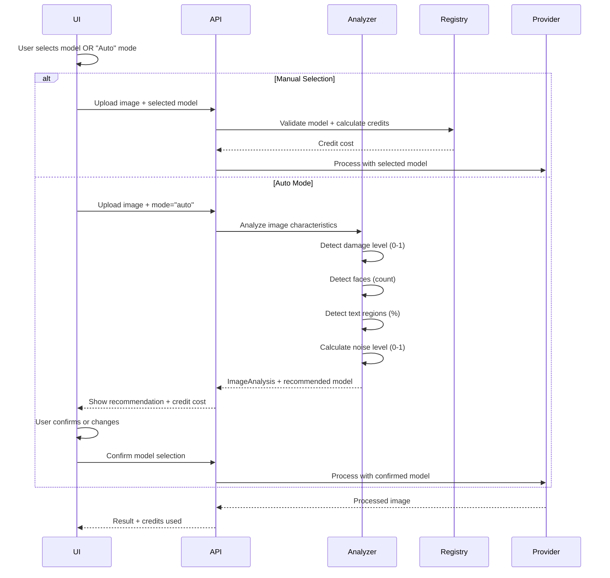
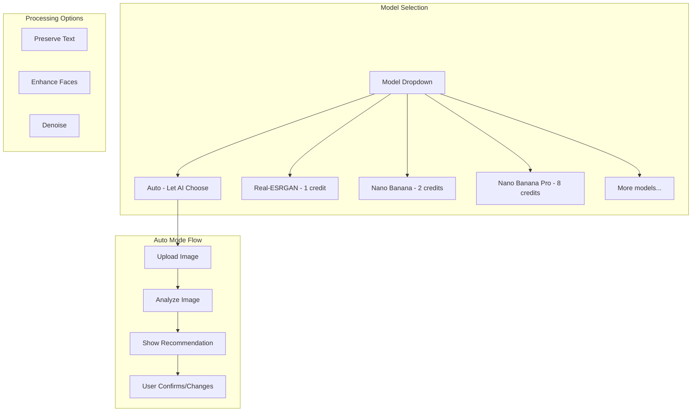

# PRD: Multi-Model Architecture for Adaptive Image Processing

**Version**: 1.0
**Last Updated**: December 2025
**Status**: Draft
**Author**: Engineering Team

---

## Executive Summary

This PRD defines the architecture for supporting multiple AI models in PixelPerfect's image processing pipeline. The system will:

1. **Support multiple models** configurable via environment variables
2. **Automatically select the best model** based on image analysis (damage level, content type)
3. **Allow users to customize features** via UI toggles that influence model selection
4. **Apply appropriate credit costs** based on the model's economics

### Business Impact

| Metric | Current | Target |
|--------|---------|--------|
| Processing Quality | 8.5/10 (one-size-fits-all) | 9.5/10 (adaptive) |
| Heavy Restoration Success | ~60% | 90%+ |
| User Satisfaction | Good | Excellent |
| Revenue per User | Fixed | Variable (premium features) |

---

## 1. Problem Statement

### Current Limitations

1. **One Model Fits All**: Currently using Replicate Real-ESRGAN for upscaling and Gemini for enhancement, with no adaptive selection based on image characteristics

2. **Missed Optimization Opportunities**:
   - Damaged/old photos need specialized restoration (Nano Banana Pro at $0.13/run)
   - Simple upscales could use cheaper models
   - Text-heavy images benefit from specific models

3. **No User Control**: Users cannot influence model selection based on their quality preferences

4. **Fixed Credit Costs**: All operations cost the same regardless of computational intensity

### Target State

A dynamic model selection system that:
- Analyzes input images to determine optimal processing approach
- Allows users to enable/disable premium features via UI toggles
- Routes to the best model for each use case
- Charges credits proportionally to model costs

---

## 2. Model Registry & Economics

### 2.1 Supported Models

| Model ID | Display Name | Provider | Cost/Run | Quality | Best For | Credits |
|----------|--------------|----------|----------|---------|----------|---------|
| `real-esrgan-standard` | Real-ESRGAN | Replicate | $0.0017 | 8.5/10 | General upscaling | 1 |
| `real-esrgan-gfpgan` | Real-ESRGAN + GFPGAN | Replicate | $0.0025 | 9.0/10 | Portrait restoration | 2 |
| `nano-banana` | Nano Banana | Google API (free tier) | $0.00* | 9.0/10 | Text preservation, quality | 2 |
| `nano-banana-pro` | Nano Banana Pro | Replicate | $0.13 | 9.8/10 | Heavy damage, 4K output | 8 |
| `clarity-upscaler` | Clarity Upscaler | Replicate | $0.017 | 9.5/10 | AI-generated art | 4 |
| `swinir` | SwinIR Ultra | Replicate | $0.04 | 9.7/10 | Maximum quality | 6 |

*\*Nano Banana uses Google Gemini 2.5 Flash Image free tier (500 req/day). Falls back to Replicate ($0.00127) when exhausted.*

### 2.2 Google Free Tier Strategy

| Resource | Limit | Reset |
|----------|-------|-------|
| Daily requests | 500/day | Midnight PT |
| Rate limit | 15 RPM | Rolling |
| Fallback | Replicate `google/nano-banana` | Automatic |

**Monthly Capacity**: ~15,000 images/month at $0 cost

```
┌─────────────────────────────────────────────────────┐
│              Nano Banana Request Flow               │
├─────────────────────────────────────────────────────┤
│                                                     │
│   Request → Check Daily Counter → < 500?            │
│                    │                                │
│              ┌─────┴─────┐                          │
│              │           │                          │
│            Yes          No                          │
│              │           │                          │
│              ▼           ▼                          │
│      Google API    Replicate Fallback               │
│      (Free)        ($0.00127/image)                 │
│                                                     │
└─────────────────────────────────────────────────────┘
```

### 2.3 Credit Cost Formula

```
creditCost = baseCreditCost × modelMultiplier × scaleMultiplier

Where:
- baseCreditCost = 1 (upscale) | 2 (enhance/both)
- modelMultiplier = model.creditMultiplier (1x - 8x)
- scaleMultiplier = 1.0 (2x) | 1.5 (4x) | 2.0 (8x)
```

### 2.4 Economic Rationale

| Model | API Cost | Credits Charged | Revenue/Credit ($0.058) | Margin |
|-------|----------|-----------------|-------------------------|--------|
| Real-ESRGAN | $0.0017 | 1 | $0.058 | 97% |
| Nano Banana | $0.00 (free tier) | 2 | $0.116 | **100%** |
| Nano Banana (fallback) | $0.00127 | 2 | $0.116 | 99% |
| Nano Banana Pro | $0.13 | 8 | $0.464 | 72% |
| Clarity | $0.017 | 4 | $0.232 | 93% |
| SwinIR | $0.04 | 6 | $0.348 | 88% |

**Cost Savings with Free Tier**: At 500 images/day, we save ~$585/month compared to paid API.

---

## 3. Architecture Design

### 3.1 Component Overview

```mermaid
graph TD
    subgraph UI Layer
        A[Upload Image] --> B[Model Selector]
        B --> C{Selection Mode}
        C -->|Manual| D[User Picks Model]
        C -->|Auto| E[Image Analyzer]
        E --> F[AI Recommends Model]
    end

    subgraph API Layer
        D --> G[/api/upscale]
        F --> G
        G --> H[Credit Calculator]
        H --> I[Process Image]
    end

    subgraph Service Layer
        I --> J[Model Registry]
        J --> K{Provider Router}
        K --> L[Google API - Free Tier]
        K --> M[Replicate - Paid]
        L -->|Exhausted| M
    end

    subgraph Data Layer
        N[(Free Tier Counter)]
        O[(Model Config)]
        P[(Processing History)]
    end

    L --> N
    J --> O
    M --> P
```

### 3.2 Model Registry Schema

```typescript
interface IModelConfig {
  id: string;                    // Unique identifier
  displayName: string;           // User-facing name
  provider: 'replicate' | 'gemini' | 'openai';
  modelVersion: string;          // Provider-specific model ID
  capabilities: ModelCapability[];
  costPerRun: number;            // USD cost per API call
  creditMultiplier: number;      // Base credit cost multiplier
  qualityScore: number;          // 1-10 quality rating
  processingTimeMs: number;      // Average processing time
  maxInputResolution: number;    // Max input pixels
  maxOutputResolution: number;   // Max output pixels
  supportedScales: number[];     // [2, 4, 8]
  isEnabled: boolean;            // Model enabled/disabled
  tierRestriction?: SubscriptionTier; // Minimum tier required
}

type ModelCapability =
  | 'upscale'
  | 'enhance'
  | 'text-preservation'
  | 'face-restoration'
  | 'denoise'
  | 'damage-repair'
  | 'ai-art-upscale'
  | '4k-output'
  | '8k-output';
```

### 3.3 User-Driven Model Selection Flow



### 3.4 Auto Mode: Image Analysis Algorithm

**Note**: This algorithm is only triggered when user selects "Auto" mode. For manual selection, user picks the model directly.

```typescript
interface IImageAnalysis {
  damageLevel: number;      // 0-1: 0=pristine, 1=heavily damaged
  faceCount: number;        // Number of detected faces
  textCoverage: number;     // 0-1: Percentage of image with text
  noiseLevel: number;       // 0-1: Compression artifacts/noise
  contentType: ContentType; // photo|artwork|product|document|portrait
  resolution: {
    width: number;
    height: number;
    megapixels: number;
  };
}

type ContentType =
  | 'photo'        // General photography
  | 'portrait'     // Face-focused images
  | 'product'      // E-commerce product images
  | 'document'     // Text-heavy documents
  | 'artwork'      // Digital/AI art
  | 'vintage'      // Old/damaged photos
  | 'unknown';

function analyzeAndRecommendModel(
  analysis: IImageAnalysis,
  userTier: SubscriptionTier
): IModelRecommendation {
  const candidates = getEligibleModels(userTier);

  // Rule-based recommendation (simple, predictable)
  let recommended: string;
  let reasoning: string;

  if (analysis.damageLevel > 0.7) {
    recommended = 'nano-banana-pro';
    reasoning = 'Heavy damage detected. Premium restoration recommended.';
  } else if (analysis.faceCount > 0 && analysis.contentType === 'portrait') {
    recommended = 'real-esrgan-gfpgan';
    reasoning = 'Portrait detected. Face enhancement model selected.';
  } else if (analysis.textCoverage > 0.15) {
    recommended = 'nano-banana';
    reasoning = 'Text/logos detected. Text preservation model selected.';
  } else if (analysis.contentType === 'artwork') {
    recommended = 'clarity-upscaler';
    reasoning = 'AI artwork detected. Specialized upscaler selected.';
  } else {
    recommended = 'real-esrgan-standard';
    reasoning = 'Standard upscaling. Fast and efficient.';
  }

  // Check tier eligibility, downgrade if needed
  if (!candidates.includes(recommended)) {
    recommended = 'real-esrgan-standard';
    reasoning += ' (Upgraded model requires higher tier)';
  }

  return {
    recommendedModel: recommended,
    reasoning,
    creditCost: calculateCreditCost(recommended),
    alternatives: candidates.filter(m => m !== recommended).slice(0, 2)
  };
}
```

---

## 4. Environment Configuration

### 4.1 Model Configuration via Environment Variables

```bash
# .env.api - Model Registry Configuration

# ==========================================
# MODEL REGISTRY - Enable/Disable Models
# ==========================================
MODELS_ENABLED=real-esrgan-standard,real-esrgan-gfpgan,nano-banana,nano-banana-pro

# ==========================================
# REPLICATE MODELS
# ==========================================
REPLICATE_API_TOKEN=r8_xxxxx

# Real-ESRGAN Standard (T4 GPU)
REPLICATE_MODEL_REAL_ESRGAN=nightmareai/real-esrgan:42fed1c4974146d4d2414e2be2c5277c7fcf05fcc3a73abf41610695738c1d7b
REPLICATE_MODEL_REAL_ESRGAN_COST=0.0017
REPLICATE_MODEL_REAL_ESRGAN_CREDITS=1

# Real-ESRGAN + GFPGAN (Face Enhancement)
REPLICATE_MODEL_GFPGAN=tencentarc/gfpgan:9283608cc6b7be6b65a8e44983db012355fde4132009bf99d976b2f0896856a3
REPLICATE_MODEL_GFPGAN_COST=0.0025
REPLICATE_MODEL_GFPGAN_CREDITS=2

# Clarity Upscaler (AI Art)
REPLICATE_MODEL_CLARITY=philz1337x/clarity-upscaler:dfad41707589d68ecdccd1dfa600d55a208f9310748e44bfe35b4a6291453d5e
REPLICATE_MODEL_CLARITY_COST=0.017
REPLICATE_MODEL_CLARITY_CREDITS=4

# SwinIR (Ultra Quality)
REPLICATE_MODEL_SWINIR=jingyunliang/swinir:660d922d33153019e8c263a3bba265de882e7f4f70396546b6c9c8f9d47a021a
REPLICATE_MODEL_SWINIR_COST=0.04
REPLICATE_MODEL_SWINIR_CREDITS=6

# ==========================================
# GOOGLE GEMINI DIRECT (Standard - Free Tier Priority)
# ==========================================
GEMINI_API_KEY=AIzaSyxxxxx

# Nano Banana Standard (Google Direct API - leverages free tier)
GEMINI_MODEL_NANO_BANANA=gemini-2.0-flash-exp
GEMINI_MODEL_NANO_BANANA_COST=0.00127
GEMINI_MODEL_NANO_BANANA_CREDITS=2
GEMINI_FREE_TIER_ENABLED=true

# ==========================================
# REPLICATE (Premium + Fallback)
# ==========================================
# Nano Banana Pro (Premium - Replicate)
REPLICATE_MODEL_NANO_BANANA_PRO=google/nano-banana-pro
REPLICATE_MODEL_NANO_BANANA_PRO_COST=0.13
REPLICATE_MODEL_NANO_BANANA_PRO_CREDITS=8
REPLICATE_MODEL_NANO_BANANA_PRO_MIN_TIER=pro

# Nano Banana Fallback (if Google free tier exhausted)
REPLICATE_MODEL_NANO_BANANA_FALLBACK=google/nano-banana
REPLICATE_MODEL_NANO_BANANA_FALLBACK_COST=0.00127

# ==========================================
# MODEL SELECTION THRESHOLDS
# ==========================================
# Damage threshold for premium model (0-1)
MODEL_DAMAGE_THRESHOLD_PREMIUM=0.7

# Text coverage threshold for text-preservation model (0-1)
MODEL_TEXT_THRESHOLD=0.15

# Face count threshold for portrait model
MODEL_FACE_THRESHOLD=1

# Noise threshold for denoise model (0-1)
MODEL_NOISE_THRESHOLD=0.5

```

### 4.2 Environment Schema Extension

```typescript
// shared/config/env.ts - Extension

const modelConfigSchema = z.object({
  // Enabled models (comma-separated)
  MODELS_ENABLED: z.string().transform(s => s.split(',')),

  // Replicate models
  REPLICATE_MODEL_REAL_ESRGAN: z.string(),
  REPLICATE_MODEL_REAL_ESRGAN_COST: z.coerce.number(),
  REPLICATE_MODEL_REAL_ESRGAN_CREDITS: z.coerce.number(),

  REPLICATE_MODEL_GFPGAN: z.string().optional(),
  REPLICATE_MODEL_GFPGAN_COST: z.coerce.number().optional(),
  REPLICATE_MODEL_GFPGAN_CREDITS: z.coerce.number().optional(),

  REPLICATE_MODEL_CLARITY: z.string().optional(),
  REPLICATE_MODEL_CLARITY_COST: z.coerce.number().optional(),
  REPLICATE_MODEL_CLARITY_CREDITS: z.coerce.number().optional(),

  REPLICATE_MODEL_SWINIR: z.string().optional(),
  REPLICATE_MODEL_SWINIR_COST: z.coerce.number().optional(),
  REPLICATE_MODEL_SWINIR_CREDITS: z.coerce.number().optional(),

  // Gemini models
  GEMINI_MODEL_NANO_BANANA: z.string().optional(),
  GEMINI_MODEL_NANO_BANANA_COST: z.coerce.number().optional(),
  GEMINI_MODEL_NANO_BANANA_CREDITS: z.coerce.number().optional(),

  GEMINI_MODEL_NANO_BANANA_PRO: z.string().optional(),
  GEMINI_MODEL_NANO_BANANA_PRO_COST: z.coerce.number().optional(),
  GEMINI_MODEL_NANO_BANANA_PRO_CREDITS: z.coerce.number().optional(),
  GEMINI_MODEL_NANO_BANANA_PRO_MIN_TIER: z.enum(['free', 'hobby', 'pro', 'business']).optional(),

  // Selection thresholds
  MODEL_DAMAGE_THRESHOLD_PREMIUM: z.coerce.number().min(0).max(1).default(0.7),
  MODEL_TEXT_THRESHOLD: z.coerce.number().min(0).max(1).default(0.15),
  MODEL_FACE_THRESHOLD: z.coerce.number().min(0).default(1),
  MODEL_NOISE_THRESHOLD: z.coerce.number().min(0).max(1).default(0.5),

});
```

---

## 5. User Interface

### 5.1 Model Selection UI (User-Driven)

Users choose their model directly, with "Auto" as an option for AI-assisted selection.



### 5.2 Processing Options Interface

```typescript
// components/upload/ProcessingOptions.tsx

interface IProcessingOptions {
  // Model selection (user-driven)
  selectedModel: 'auto' | ModelId;  // 'auto' triggers image analysis

  // Scale factor
  scale: 2 | 4 | 8;

  // Processing options (affect model behavior)
  preserveText: boolean;       // Hints for Nano Banana prompt
  enhanceFaces: boolean;       // Triggers GFPGAN combo
  denoise: boolean;            // Enables noise reduction

  // Target resolution (Pro+ tiers)
  targetResolution?: '2k' | '4k' | '8k';
}

type ModelId =
  | 'real-esrgan-standard'
  | 'real-esrgan-gfpgan'
  | 'nano-banana'
  | 'nano-banana-pro'
  | 'clarity-upscaler'
  | 'swinir';

// Models available by tier
const modelsByTier: Record<SubscriptionTier, ModelId[]> = {
  free: ['real-esrgan-standard', 'nano-banana'],
  hobby: ['real-esrgan-standard', 'real-esrgan-gfpgan', 'nano-banana'],
  pro: ['real-esrgan-standard', 'real-esrgan-gfpgan', 'nano-banana', 'nano-banana-pro', 'clarity-upscaler'],
  business: ['real-esrgan-standard', 'real-esrgan-gfpgan', 'nano-banana', 'nano-banana-pro', 'clarity-upscaler', 'swinir'],
};
```

### 5.3 UI Component: Model Selector

```tsx
// Simplified component structure

interface ModelSelectorProps {
  userTier: SubscriptionTier;
  creditBalance: number;
  onModelChange: (model: string) => void;
  onOptionsChange: (options: IProcessingOptions) => void;
}

const ModelSelector: React.FC<ModelSelectorProps> = ({
  userTier,
  creditBalance,
  onModelChange,
  onOptionsChange,
}) => {
  const models = [
    {
      id: 'auto',
      name: 'Auto (Recommended)',
      description: 'AI analyzes your image and picks the best model',
      credits: 'Varies',
      icon: '✨',
      available: true,
    },
    {
      id: 'real-esrgan-standard',
      name: 'Real-ESRGAN',
      description: 'Fast, reliable upscaling',
      credits: 1,
      available: true,
    },
    {
      id: 'nano-banana',
      name: 'Nano Banana',
      description: 'Best for text & logos, high quality',
      credits: 2,
      available: true,
    },
    {
      id: 'real-esrgan-gfpgan',
      name: 'Portrait Mode',
      description: 'Face enhancement + upscaling',
      credits: 2,
      available: userTier !== 'free',
    },
    {
      id: 'nano-banana-pro',
      name: 'Nano Banana Pro',
      description: 'Premium restoration for damaged photos',
      credits: 8,
      badge: 'PRO',
      available: ['pro', 'business'].includes(userTier),
    },
    {
      id: 'clarity-upscaler',
      name: 'Clarity (AI Art)',
      description: 'Optimized for AI-generated images',
      credits: 4,
      available: ['pro', 'business'].includes(userTier),
    },
    {
      id: 'swinir',
      name: 'SwinIR Ultra',
      description: 'Maximum quality, slower processing',
      credits: 6,
      badge: 'BUSINESS',
      available: userTier === 'business',
    },
  ];

  return (
    <div className="model-selector">
      <h3>Select Model</h3>
      <Select options={models} />

      <h3>Processing Options</h3>
      <Checkbox
        label="Preserve Text & Logos"
        description="Keep text sharp (works best with Nano Banana)"
      />
      <Checkbox
        label="Enhance Faces"
        description="AI face restoration"
      />
      <Checkbox
        label="Reduce Noise"
        description="Remove compression artifacts"
      />

      <CreditEstimate
        modelCredits={selectedModel.credits}
        balance={creditBalance}
      />
    </div>
  );
};
```

### 5.4 Credit Cost Preview

Before processing, users see a clear breakdown:

```
┌─────────────────────────────────────────┐
│  Processing Cost Estimate               │
├─────────────────────────────────────────┤
│  Quality Level: Enhanced      2 credits │
│  + Text Preservation          1 credit  │
│  + Face Enhancement           1 credit  │
│  × Scale (4x)                 ×1.5      │
├─────────────────────────────────────────┤
│  Total Cost                   6 credits │
│  Your Balance                42 credits │
│  After Processing            36 credits │
└─────────────────────────────────────────┘
│         [ Process Image ]               │
└─────────────────────────────────────────┘
```

---

## 6. API Design

### 6.1 Enhanced Upscale Request Schema

```typescript
// shared/validation/upscale.schema.ts - Extension

const enhancedUpscaleSchema = z.object({
  imageData: z.string(),
  mimeType: z.string().default('image/jpeg'),
  config: z.object({
    // Existing fields
    mode: z.enum(['upscale', 'enhance', 'both', 'custom']),
    scale: z.union([z.literal(2), z.literal(4), z.literal(8)]).default(2),

    // New quality level
    qualityLevel: z.enum(['standard', 'enhanced', 'premium']).default('standard'),

    // Processing options
    preserveText: z.boolean().default(false),
    enhanceFaces: z.boolean().default(false),
    denoise: z.boolean().default(false),

    // Advanced options
    autoModelSelection: z.boolean().default(true),
    preferredModel: z.string().optional(),
    targetResolution: z.enum(['2k', '4k', '8k']).optional(),

    // Custom prompt (for custom mode)
    customPrompt: z.string().optional(),
  }),
});

// Response includes model info
const upscaleResponseSchema = z.object({
  success: z.boolean(),
  imageData: z.string(),
  mimeType: z.string(),
  processing: z.object({
    modelUsed: z.string(),
    modelDisplayName: z.string(),
    processingTimeMs: z.number(),
    creditsUsed: z.number(),
    creditsRemaining: z.number(),
  }),
  analysis: z.object({
    damageLevel: z.number().optional(),
    contentType: z.string().optional(),
    modelRecommendation: z.string().optional(),
  }).optional(),
});
```

### 6.2 New Endpoints

```typescript
// GET /api/models
// Returns available models for the user's tier
{
  models: [
    {
      id: 'real-esrgan-standard',
      displayName: 'Real-ESRGAN (Standard)',
      description: 'Fast, reliable upscaling',
      creditCost: 1,
      capabilities: ['upscale'],
      qualityScore: 8.5,
      processingTime: '~2s',
      available: true,
    },
    {
      id: 'nano-banana-pro',
      displayName: 'Nano Banana Pro',
      description: 'Premium quality for damaged photos',
      creditCost: 8,
      capabilities: ['upscale', 'enhance', 'damage-repair', '4k-output'],
      qualityScore: 9.8,
      processingTime: '~30s',
      available: false,  // Tier restricted
      requiresTier: 'pro',
    },
  ],
  defaultModel: 'real-esrgan-standard',
}

// POST /api/analyze-image
// Analyzes image and recommends model (optional pre-processing step)
Request: { imageData: string, mimeType: string }
Response: {
  analysis: {
    damageLevel: 0.75,
    faceCount: 2,
    textCoverage: 0.05,
    noiseLevel: 0.6,
    contentType: 'vintage',
    resolution: { width: 800, height: 600, megapixels: 0.48 },
  },
  recommendation: {
    model: 'nano-banana-pro',
    reason: 'High damage level detected. Premium model recommended for best restoration.',
    creditCost: 8,
    alternativeModel: 'real-esrgan-gfpgan',
    alternativeCost: 2,
  },
}

// GET /api/credit-estimate
// Pre-calculates credit cost for a processing job
Request: {
  config: ProcessingConfig,
  analysisHint?: ImageAnalysis,  // From /api/analyze-image
}
Response: {
  breakdown: {
    baseCredits: 2,
    featureCredits: {
      preserveText: 1,
      enhanceFaces: 1,
    },
    scaleMultiplier: 1.5,
    totalCredits: 6,
  },
  modelToBe: 'nano-banana',
  estimatedProcessingTime: '15-30s',
}
```

---

## 7. Implementation Plan

### Phase 1: Model Registry & Configuration (Week 1)

- [ ] Create `ModelRegistry` service with environment-based configuration
- [ ] Extend environment schema with model configuration variables
- [ ] Implement model capability matching logic
- [ ] Add tier restriction validation
- [ ] Update `image-processor.factory.ts` to use registry

**Files to Create/Modify:**
- `server/services/model-registry.ts` (new)
- `server/services/model-registry.types.ts` (new)
- `shared/config/env.ts` (extend)
- `server/services/image-processor.factory.ts` (modify)

### Phase 2: Image Analysis Engine (Week 2)

- [ ] Implement lightweight image analysis (client-side pre-analysis)
- [ ] Create damage detection heuristics (blur, noise, artifacts)
- [ ] Implement text region detection (OCR-lite or edge detection)
- [ ] Add face detection integration (existing GFPGAN check)
- [ ] Create content type classifier

**Files to Create:**
- `server/services/image-analyzer.ts` (new)
- `server/services/image-analyzer.types.ts` (new)
- `shared/utils/image-analysis.ts` (client-side helpers)

### Phase 3: Model Selection Algorithm (Week 2-3)

- [ ] Implement scoring algorithm for model selection
- [ ] Create model capability matching
- [ ] Add user preference integration
- [ ] Implement fallback chain logic
- [ ] Add credit cost calculation

**Files to Create/Modify:**
- `server/services/model-selector.ts` (new)
- `server/services/model-selector.types.ts` (new)
- `shared/config/subscription.config.ts` (extend credit costs)

### Phase 4: Credit System Update (Week 3)

- [ ] Update credit calculation to support variable costs
- [ ] Add model-based credit multipliers
- [ ] Update `consume_credits_v2` RPC if needed
- [ ] Implement credit estimate endpoint
- [ ] Add credit breakdown to processing response

**Files to Modify:**
- `shared/config/subscription.config.ts`
- `shared/config/subscription.utils.ts`
- `server/services/image-generation.service.ts`
- `server/services/replicate.service.ts`

### Phase 5: UI Implementation (Week 4)

- [ ] Create `QualitySelector` component
- [ ] Add processing options checkboxes
- [ ] Implement credit estimate preview
- [ ] Add model recommendation display
- [ ] Update upload flow with new options

**Files to Create/Modify:**
- `components/upload/QualitySelector.tsx` (new)
- `components/upload/ProcessingOptions.tsx` (new)
- `components/upload/CreditEstimate.tsx` (new)
- `components/upload/UploadZone.tsx` (modify)

### Phase 6: API Integration (Week 4-5)

- [ ] Update `/api/upscale` with new schema
- [ ] Create `/api/models` endpoint
- [ ] Create `/api/analyze-image` endpoint
- [ ] Create `/api/credit-estimate` endpoint
- [ ] Add model info to processing response

**Files to Create/Modify:**
- `app/api/upscale/route.ts` (modify)
- `app/api/models/route.ts` (new)
- `app/api/analyze-image/route.ts` (new)
- `app/api/credit-estimate/route.ts` (new)

### Phase 7: Testing & Monitoring (Week 5)

- [ ] Unit tests for model registry
- [ ] Unit tests for image analysis
- [ ] Unit tests for model selection
- [ ] Integration tests for full flow
- [ ] Add analytics for model usage
- [ ] Add monitoring for model performance

---

## 8. Testing Strategy

### 8.1 Unit Tests

```typescript
describe('ModelRegistry', () => {
  it('should load models from environment variables');
  it('should filter models by tier');
  it('should return only enabled models');
  it('should calculate correct credit costs');
});

describe('ImageAnalyzer', () => {
  it('should detect damage level correctly');
  it('should identify portraits with faces');
  it('should detect text-heavy images');
  it('should classify content types');
});

describe('ModelSelector', () => {
  it('should select premium model for heavily damaged images');
  it('should select GFPGAN for portrait images');
  it('should select Nano Banana for text-heavy images');
  it('should respect tier restrictions');
  it('should apply user preferences');
});
```

### 8.2 Edge Cases

| Scenario | Expected Behavior |
|----------|------------------|
| No models enabled | Use fallback Real-ESRGAN |
| User lacks credits for recommended model | Suggest cheaper alternative |
| Premium model unavailable | Fall back to next best |
| Image analysis fails | Skip to default model |
| User on free tier requests premium | Show upgrade prompt |

---

## 9. Success Metrics

### 9.1 Technical Metrics

| Metric | Target | Measurement |
|--------|--------|-------------|
| Model selection latency | <100ms | p95 response time |
| Image analysis latency | <500ms | p95 response time |
| Correct model selection | >90% | User satisfaction surveys |
| Fallback rate | <5% | Primary model failures |

### 9.2 Business Metrics

| Metric | Baseline | Target | Timeline |
|--------|----------|--------|----------|
| Premium model usage | 0% | 15% of jobs | 3 months |
| Average credits/job | 1.5 | 2.5 | 3 months |
| Revenue per user | $29 | $35 | 6 months |
| User satisfaction (NPS) | +30 | +50 | 6 months |

### 9.3 Quality Metrics

| Metric | Target |
|--------|--------|
| Damaged photo restoration success | 90%+ |
| Text preservation accuracy | 95%+ |
| Face enhancement quality | 9.0/10 |
| User retry rate | <10% |

---

## 10. Rollout Strategy

### 10.1 Rollout Phases

| Phase | Audience | Duration | Success Criteria |
|-------|----------|----------|------------------|
| 1. Internal | Team only | 1 week | No critical bugs |
| 2. Staged | Pro/Business users | 2 weeks | Error rate <1% |
| 3. GA | All users | Ongoing | Revenue targets met |

### 10.2 Rollback Plan

If issues arise:
1. Revert to single-model factory (Real-ESRGAN + Gemini fallback)
2. Refund any overcharged credits
3. Communicate via in-app notification

---

## 11. Security Considerations

1. **Credit Manipulation**: Server-side credit calculation only; never trust client
2. **Model Injection**: Validate model IDs against registry whitelist
3. **Cost Abuse**: Rate limit premium model access
4. **Data Privacy**: Image analysis runs server-side; no external logging

---

## 12. Future Considerations

### 12.1 Potential Enhancements

- **User Model Training**: Custom models trained on user's image style
- **Batch Optimization**: Intelligent batching for similar images
- **Cost Prediction**: ML-based credit cost estimation
- **A/B Testing Framework**: Model comparison for quality improvements

### 12.2 Model Additions (Roadmap)

| Model | Use Case | Timeline |
|-------|----------|----------|
| SDXL Upscaler | AI art enhancement | Q2 2026 |
| Video Upscaling | Video frame processing | Q3 2026 |
| Custom LoRA | Brand-specific enhancement | Q4 2026 |

---

## Appendix A: Model Comparison Matrix

| Model | Upscale | Enhance | Text | Faces | Denoise | Damage | 4K | Speed | Cost |
|-------|---------|---------|------|-------|---------|--------|-----|-------|------|
| Real-ESRGAN | Yes | No | Fair | No | Yes | Fair | Yes | Fast | Low |
| Real-ESRGAN+GFPGAN | Yes | No | Fair | Yes | Yes | Fair | Yes | Fast | Low |
| Nano Banana | Yes | Yes | Good | Yes | Yes | Good | No | Med | Low |
| Nano Banana Pro | Yes | Yes | Best | Yes | Yes | Best | Yes | Med | High |
| Clarity | Yes | Yes | Fair | Fair | Yes | Fair | Yes | Med | Med |
| SwinIR | Yes | No | Good | No | Yes | Good | Yes | Slow | Med |

---

## Appendix B: Credit Cost Examples

| Scenario | Quality | Features | Scale | Credits |
|----------|---------|----------|-------|---------|
| Quick upscale | Standard | None | 2x | 1 |
| Product photo | Standard | Text | 2x | 2 |
| Portrait restoration | Enhanced | Faces | 4x | 4.5 |
| Damaged family photo | Premium | All | 4x | 12 |
| AI art upscale | Enhanced | None | 4x | 3 |

---

*Last Updated: December 2025*
*See also: [Feature Requirements](../business-model-canvas/feature-requirements.md), [Image Models](../business-model-canvas/economics/image-upscaling-models.md)*
