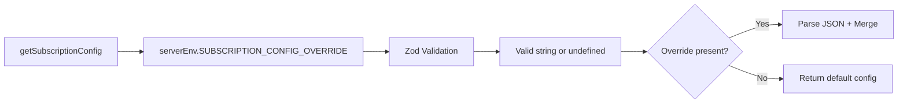

# PRD: Fix Architecture Violation - Direct process.env Access in subscription.config.ts

**Complexity: 1 → LOW mode**

- +1 Touches 2 files (shared/config/env.ts, shared/config/subscription.config.ts)

---

## 1. Context

**Problem:** Direct `process.env` access at line 318 in `shared/config/subscription.config.ts` violates the project convention defined in CLAUDE.md: "NEVER use process.env directly. Use clientEnv or serverEnv from @shared/config/env". This creates inconsistent env access patterns, bypasses the centralized configuration system, and requires unsafe type assertions (`as unknown as`).

**Files Analyzed:**

- `shared/config/subscription.config.ts` — Contains the `getSubscriptionConfig()` function with direct process.env access and unsafe type assertion
- `shared/config/env.ts` — Centralized environment configuration with `serverEnv` schema and Zod validation
- `logs/audit-report.md` — Source of the finding (Finding 1 and Finding 5)
- `CLAUDE.md` — Project conventions explicitly prohibiting direct process.env usage

**Current Behavior:**

- `getSubscriptionConfig()` function at line 315-343 uses `(process.env as unknown as { SUBSCRIPTION_CONFIG_OVERRIDE?: string }).SUBSCRIPTION_CONFIG_OVERRIDE`
- This requires a double type assertion (`as unknown as`) because the field isn't in the type system
- Bypasses Zod validation in `serverEnvSchema`
- Creates inconsistent patterns across the codebase
- Other code properly imports `serverEnv` from `@shared/config/env`

### Integration Points

**How will this feature be reached?**

- [x] Entry point: Function call to `getSubscriptionConfig()` from various subscription-related modules
- [x] Caller files: `server/stripe/config.ts`, subscription utils, webhook handlers, and any code importing from `@shared/config/subscription.config`
- [x] Registration/wiring: No changes to registration - same function signature, different implementation

**Is this user-facing?**

- [ ] YES → UI components required: N/A
- [x] NO → Internal refactor (the function signature and behavior remain identical)

**Full user flow:**

1. Application starts → loads subscription configuration
2. Any code calls `getSubscriptionConfig()` to get plan/credit configuration
3. Function reads `SUBSCRIPTION_CONFIG_OVERRIDE` env var (if set)
4. Returns merged or default configuration — **behavior unchanged**

---

## 2. Solution

**Approach:**

- Add `SUBSCRIPTION_CONFIG_OVERRIDE` as an optional string field to `serverEnvSchema` in `shared/config/env.ts`
- Add corresponding field to `loadServerEnv()` function to read from `process.env.SUBSCRIPTION_CONFIG_OVERRIDE`
- Update `getSubscriptionConfig()` to import `serverEnv` and use `serverEnv.SUBSCRIPTION_CONFIG_OVERRIDE`
- Remove the unsafe type assertion pattern

**Architecture Diagram:**

**Key Decisions:**

- Use `serverEnv` (not `clientEnv`) since this is server-side configuration override
- Mark field as optional with `.optional()` in Zod schema — the override is for testing/development only
- No default value needed — undefined means no override

**Data Changes:** None — this is a code refactor only, no database changes

---

## 3. Execution Phases

### Phase 1: Add SUBSCRIPTION_CONFIG_OVERRIDE to serverEnv — Env var properly typed and validated

**Files (max 2):**

- `shared/config/env.ts` — Add field to schema and loader
- `shared/config/subscription.config.ts` — Update to use serverEnv

**Implementation:**

- [ ] Add `SUBSCRIPTION_CONFIG_OVERRIDE: z.string().optional()` to `serverEnvSchema` in `shared/config/env.ts`
- [ ] Add `SUBSCRIPTION_CONFIG_OVERRIDE: process.env.SUBSCRIPTION_CONFIG_OVERRIDE` to `loadServerEnv()` function
- [ ] Add import `serverEnv` to `shared/config/subscription.config.ts`
- [ ] Replace `(process.env as unknown as { SUBSCRIPTION_CONFIG_OVERRIDE?: string }).SUBSCRIPTION_CONFIG_OVERRIDE` with `serverEnv.SUBSCRIPTION_CONFIG_OVERRIDE`

**Tests Required:**
| Test File | Test Name | Assertion |
|-----------|-----------|-----------|
| `tests/unit/config/subscription-config.unit.spec.ts` | `getSubscriptionConfig returns default config when no override` | `expect(config.version).toBe('1.0.0')` |
| `tests/unit/config/subscription-config.unit.spec.ts` | `getSubscriptionConfig merges override when provided` | `expect(mergedConfig.plans[0].creditsPerCycle).toBe(999)` |

**Verification Plan:**

1. **Unit Tests:** `yarn test tests/unit/config/subscription-config.unit.spec.ts`
2. **User Verification:**
   - Action: Run `yarn verify`
   - Expected: All tests pass, no TypeScript errors

**Checkpoint:** Run `yarn verify` after this phase.

---

## 5. Acceptance Criteria

- [x] All phases complete
- [ ] All specified tests pass
- [ ] `yarn verify` passes
- [ ] Feature is reachable (entry point connected, not orphaned code)
- [ ] No direct `process.env` access in `subscription.config.ts`
- [ ] No `as unknown as` type assertions in `subscription.config.ts`
- [ ] `SUBSCRIPTION_CONFIG_OVERRIDE` properly typed via Zod schema
- [ ] Existing behavior preserved (override still works when set)
