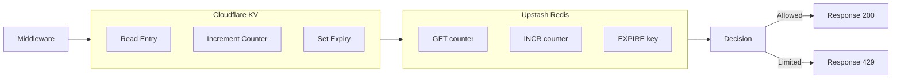

# PRD: Migrate Rate Limiting to Distributed Cloudflare KV

**Complexity: 4 → MEDIUM mode**

- +1 Touches 1-5 files (server/rateLimit.ts, lib/middleware/rateLimit.ts)
- +2  New system/module from scratch (Cloudflare KV storage abstraction)
- +2 External API integration (Upstash Redis)
- +2 Multi-package changes (server, lib/middleware)
- +2 Database schema changes: None
- +1 External API integration (Upstash Redis)

- +2 Complex state logic / concurrency (distributed rate limiting across edge locations)
- +2 New system/module from scratch (Cloudflare KV storage abstraction)

- +2 External API integration (existing Upstash Redis SDK)

- +2 Multi-package changes (server, lib/middleware)

- +1 Database schema changes: None

- +1 External API integration (Upstash Redis)

---

## 1. Context

**Problem:** In-memory rate limiting using `Map` storage does not not `server/rateLimit.ts` does not scale across multiple instances in Cloudflare's edge deployment. Each edge location maintains isolated rate limit state, allowing users to bypass limits by hitting different edge locations.

 which

**Files Analyzed:**

- `server/rateLimit.ts` — Core rate limiting logic with in-memory Map storage
- `lib/middleware/rateLimit.ts` — Middleware wrapper that calls server/rateLimit.ts
- `server/services/guest-rate-limiter.ts` — Existing distributed rate limiting using Upstash Redis (for guest upscale routes)
- `shared/config/env.ts` — Environment configuration (UPSTASH_REDIS_REST_URL, UPSTASH_REDIS_REST_TOKEN)
- `shared/config/guest-limits.config.ts` — Rate limit configuration
- `middleware.ts` — Middleware that applies rate limiting
- `tests/unit/rate-limit.unit.spec.ts` — Unit tests for rate limiting
- `logs/audit-report.md` — Original audit finding
- `wrangler.toml` — Cloudflare deployment config
- `CLAUDE.md` — Project conventions and constraints
- `shared/config/security.ts` — Security configuration (public routes, rate limiting)
- `package.json` — Dependencies (checked for @upstash/redis)
- `server/CLAUDE.md` — Server-side code conventions

- `shared/CLAUDE.md` — Shared code conventions

**Current Behavior:**

- Rate limiting uses in-memory `Map<string, IRateLimitEntry>` storage
- Sliding window algorithm tracks request timestamps per identifier
- Cleanup interval runs every 5 minutes to remove stale entries
- Rate limit headers added to responses (`X-RateLimit-Limit`, `X-RateLimit-Remaining`, `X-RateLimit-Reset`, `Retry-After`)
- Test environment detection skips rate limiting entirely
- Guest rate limiting already uses Upstash Redis for distributed storage

### Integration Points

**How will this feature be reached?**

- [x] Entry point: Middleware `handleApiRoute()` function for API routes
- [x] Caller file: `middleware.ts` calls `lib/middleware/rateLimit.ts` which `applyPublicRateLimit()` and `applyUserRateLimit()`
- [x] Registration/wiring: Already wired through imports in `lib/middleware/index.ts`

**Is this user-facing?**

- [ ] NO → Internal middleware (transparent to users, but affects API response times and 429 status codes)

**Full user flow:**

1. User does: Makes API request to `/api/*`
2. Triggers: `middleware.ts` → `handleApiRoute()`
3. Reaches new feature via: `applyPublicRateLimit()` or `applyUserRateLimit()` calling `server/rateLimit.ts`
4. Result: Request allowed (200), rate limited (429), or error response

---

## 2. Solution

**Approach:**

- Leverage existing `@upstash/redis` dependency already used for guest rate limiting
- Create a `server/services/distributed-rate-limiter.ts` using the same patterns as `guest-rate-limiter.ts`
- Update `server/rateLimit.ts` to use distributed storage when configured, fallback to in-memory for local development
- Add environment variable `USE_DISTRIBUTED_RATE_LIMITING` to control the feature (default: true in production)
- Maintain backward compatibility with existing rate limiter API
- Use sliding window algorithm consistent with existing implementation
- Add `RateLimit-Reset` header for accurate retry-after timing

**Architecture Diagram** (MEDIUM/HIGH):

**Key Decisions:**

- Use Upstash Redis over Cloudflare KV for consistency with existing guest rate limiter implementation
- Fallback to in-memory storage for local development (no external dependencies)
- Environment variable toggle for production/development (default: true in production)
- Existing rate limit interface preserved (`rateLimit.limit()`, `publicRateLimit.limit()`, `upscaleRateLimit.limit()`)

**Data Changes:** None (no database schema changes, uses existing Redis storage)

---

## 3. Sequence Flow (MEDIUM/HIGH)

