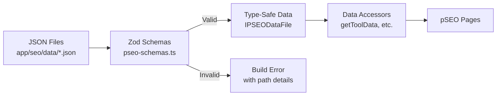
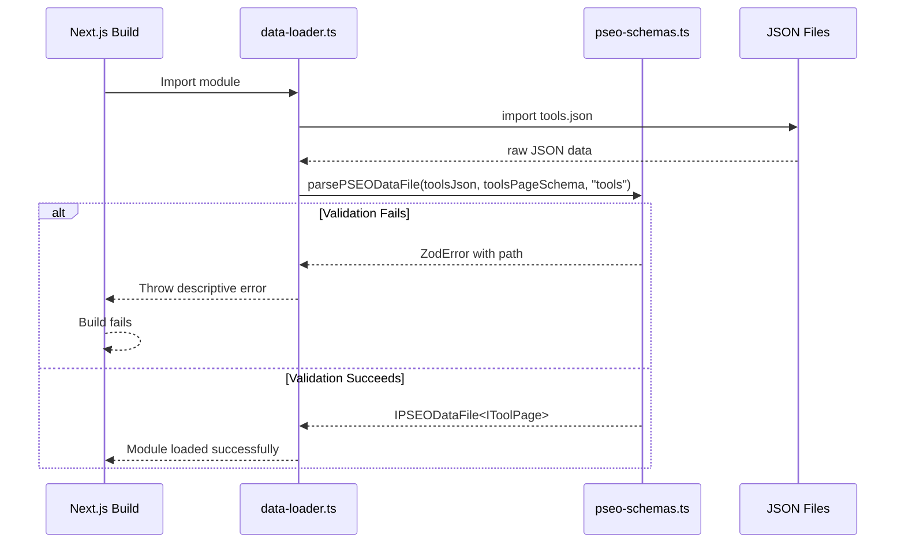

# PRD: Replace Unsafe Type Assertions with Zod Validation in pSEO Data Loader

**Complexity: 4 → MEDIUM mode**

- +2: Touches 6-10 files (pseo-schemas.ts, data-loader.ts, pseo-types.ts, test file, and schema updates)
- +2: New module from scratch (Zod schemas for all pSEO page types)

---

## 1. Context

**Problem:** The pSEO data loader (`lib/seo/data-loader.ts`) uses ~30+ `as unknown as` type assertions to cast dynamically imported JSON data to TypeScript interfaces. These assertions bypass TypeScript's type safety entirely—if a JSON file's structure drifts from the expected interface (missing fields, wrong types, renamed properties), the error will only surface at runtime as undefined values or cryptic failures, not at build time.

**Files Analyzed:**

- `lib/seo/data-loader.ts` — The file with unsafe assertions; loads pSEO JSON data and exports accessor functions
- `lib/seo/pseo-types.ts` — TypeScript interfaces for all pSEO page types (IToolPage, IFormatPage, etc.)
- `shared/validation/upscale.schema.ts` — Existing Zod schema pattern used in the project
- `app/seo/data/tools.json` — Example JSON data file structure
- `tests/unit/seo/schema-validation.unit.spec.ts` — Existing SEO unit test pattern

**Current Behavior:**

- JSON files are imported directly and cast with `as unknown as IPSEODataFile<T>`
- No runtime validation occurs—any malformed data passes silently
- Type assertions are repeated ~30+ times across the file
- Build succeeds even if JSON structure is completely wrong
- Errors only appear at runtime (e.g., `page.slug` is undefined)

### Integration Points

**How will this feature be reached?**

- [x] Entry point: Build time (when Next.js imports data-loader) and runtime (when pages call data accessor functions)
- [x] Caller file: All pSEO pages via `getAllToolSlugs()`, `getToolData()`, etc.
- [x] Registration/wiring: No changes needed—validation happens transparently during data loading

**Is this user-facing?**

- [ ] YES → UI components required
- [x] NO → Internal/background improvement (developers benefit from earlier error detection)

**Full user flow:**

1. Developer modifies a pSEO JSON file (e.g., adds a new tool)
2. Developer runs `yarn build` or `yarn dev`
3. Zod schemas validate all JSON imports at module load time
4. If validation fails: Build fails with clear error message showing exact path and validation issue
5. If validation succeeds: Application starts normally with type-safe data

---

## 2. Solution

**Approach:**

- Create `lib/seo/pseo-schemas.ts` with Zod schemas mirroring all interfaces from `pseo-types.ts`
- Use Zod's `z.infer` to derive TypeScript types from schemas (single source of truth)
- Replace all `as unknown as` casts with `schema.parse()` calls in `data-loader.ts`
- Create a generic `parsePSEODataFile()` helper to reduce boilerplate
- Add build-time validation that fails fast with descriptive error messages

**Architecture Diagram:**

**Key Decisions:**

- **Zod over io-ts/yup**: Project already uses Zod extensively (see `shared/validation/`), maintaining consistency
- **Schema-first types**: Use `z.infer<typeof Schema>` to derive types from schemas, eliminating interface/schema drift
- **Fail-fast strategy**: Validate at module load time, not lazily on access, to catch errors during build
- **Generic helper**: Create `parsePSEODataFile<T>(data: unknown, schema: z.ZodSchema<T>, name: string)` to reduce repetition
- **Keep interfaces**: Maintain existing interfaces in `pseo-types.ts` for backward compatibility; add type assertion from `z.infer` to verify equivalence

**Data Changes:** None (validates existing JSON structure, no schema changes)

---

## 3. Sequence Flow

---

## 4. Execution Phases

### Phase 1: Create Base Zod Schemas — Foundation schemas for shared types

**Files (max 5):**

- `lib/seo/pseo-schemas.ts` — New file with Zod schemas for all pSEO types

**Implementation:**

- [ ] Create `lib/seo/pseo-schemas.ts` with base schemas for shared types (IFeature, IUseCase, IBenefit, IFAQ, IHowItWorksStep, etc.)
- [ ] Create schemas for all page types (IToolPage, IFormatPage, IScalePage, IUseCasePage, IComparisonPage, IAlternativePage, IGuidePage, IFreePage, IBulkToolPage, IPlatformPage, IContentTypePage, IAIFeaturePage, IFormatScalePage, IPlatformFormatPage, IDeviceUseCasePage, IPhotoRestorationPage, ICameraRawPage, IIndustryInsightPage, IDeviceOptimizationPage)
- [ ] Create `IPSEODataFileSchema<T>` generic wrapper schema
- [ ] Export types using `z.infer<typeof Schema>` and verify they match existing interfaces

**Tests Required:**

| Test File | Test Name | Assertion |
|-----------|-----------|-----------|
| `tests/unit/seo/pseo-schemas.unit.spec.ts` | `should parse valid IToolPage data` | `expect(() => ToolPageSchema.parse(validData)).not.toThrow()` |
| `tests/unit/seo/pseo-schemas.unit.spec.ts` | `should reject IToolPage missing required slug` | `expect(() => ToolPageSchema.parse(invalidData)).toThrow(ZodError)` |
| `tests/unit/seo/pseo-schemas.unit.spec.ts` | `should parse valid IFormatPage data` | `expect(() => FormatPageSchema.parse(validFormatData)).not.toThrow()` |
| `tests/unit/seo/pseo-schemas.unit.spec.ts` | `should reject invalid category value` | `expect(() => ToolPageSchema.parse(wrongCategory)).toThrow()` |
| `tests/unit/seo/pseo-schemas.unit.spec.ts` | `should infer type matches IToolPage interface` | `Type assertion compiles without error` |

**Verification Plan:**

1. **Unit Tests:** `yarn test:unit --grep pseo-schemas`
2. **User Verification:**
   - Action: Run `yarn tsc` to verify type inference
   - Expected: No type errors, inferred types match existing interfaces

**Checkpoint:** Run `yarn verify` after this phase.

---

### Phase 2: Create Validation Helper and Update Data Loader — Replace unsafe casts with validation

**Files (max 5):**

- `lib/seo/data-loader.ts` — Replace all `as unknown as` with `parsePSEODataFile()`
- `lib/seo/pseo-schemas.ts` — Add `parsePSEODataFile()` helper (if not added in Phase 1)

**Implementation:**

- [ ] Create `parsePSEODataFile<T>(data: unknown, schema: z.ZodSchema<T>, name: string): IPSEODataFile<T>` helper
- [ ] Replace static imports (lines 50-79) with validated parsing
- [ ] Replace dynamic imports in `loadLocalizedPSEOData()` with validated parsing
- [ ] Replace all inline casts (lines 165, 171, 203, 209, 241, 247, 262, 268, 282, 310, 319, 331, 344, 353, 365, etc.) with validated parsing
- [ ] Add try-catch with descriptive error messages including file path and validation issues

**Tests Required:**

| Test File | Test Name | Assertion |
|-----------|-----------|-----------|
| `tests/unit/seo/pseo-data-loader.unit.spec.ts` | `should validate tools.json at load time` | `expect(toolsData.pages).toBeDefined()` |
| `tests/unit/seo/pseo-data-loader.unit.spec.ts` | `should throw descriptive error for malformed JSON` | `expect(() => parseInvalidData()).toThrow(/tools\.json/)` |
| `tests/unit/seo/pseo-data-loader.unit.spec.ts` | `should preserve data integrity after validation` | `expect(validatedData.pages[0].slug).toBe('ai-image-upscaler')` |
| `tests/unit/seo/pseo-data-loader.unit.spec.ts` | `should handle optional fields correctly` | `expect(data.withOptionalField.ogImage).toBeUndefined()` |

**Verification Plan:**

1. **Unit Tests:** `yarn test:unit --grep "pseo-data-loader"`
2. **User Verification:**
   - Action: Run `yarn build` to verify all JSON files pass validation
   - Expected: Build succeeds without validation errors

**Checkpoint:** Run `yarn verify` after this phase.

---

### Phase 3: Add Comprehensive Schema Tests — Ensure all page types are covered

**Files (max 5):**

- `tests/unit/seo/pseo-schemas.unit.spec.ts` — Add tests for all remaining page type schemas

**Implementation:**

- [ ] Add test fixtures for each page type (valid and invalid samples)
- [ ] Test each schema with valid data passes
- [ ] Test each schema with missing required fields fails
- [ ] Test each schema with wrong type values fails
- [ ] Test nested object validation (features, useCases, benefits, faq)
- [ ] Test array field validation

**Tests Required:**

| Test File | Test Name | Assertion |
|-----------|-----------|-----------|
| `tests/unit/seo/pseo-schemas.unit.spec.ts` | `should validate all page types in IPSEODataFile` | `forEach pageType: expect(schema.parse(data)).not.toThrow()` |
| `tests/unit/seo/pseo-schemas.unit.spec.ts` | `should reject missing pages array` | `expect(() => schema.parse({})).toThrow(/pages/)` |
| `tests/unit/seo/pseo-schemas.unit.spec.ts` | `should validate nested IFeature array` | `expect(() => schema.parse(missingFeatures)).toThrow()` |
| `tests/unit/seo/pseo-schemas.unit.spec.ts` | `should validate IFAQ question/answer required` | `expect(() => FAQSchema.parse({})).toThrow()` |
| `tests/unit/seo/pseo-schemas.unit.spec.ts` | `should validate IPSEODataFile meta fields` | `expect(() => DataFileSchema.parse(invalidMeta)).toThrow(/totalPages/)` |

**Verification Plan:**

1. **Unit Tests:** `yarn test:unit tests/unit/seo/pseo-schemas.unit.spec.ts`
2. **User Verification:**
   - Action: Run `yarn test:unit` to verify all tests pass
   - Expected: All schema validation tests pass

**Checkpoint:** Run `yarn verify` after this phase.

---

## 5. Acceptance Criteria

- [ ] All phases complete
- [ ] All specified tests pass
- [ ] `yarn verify` passes
- [ ] Feature is reachable (existing data accessor functions work unchanged)
- [ ] No `as unknown as` type assertions remain in `lib/seo/data-loader.ts`
- [ ] Build fails with clear error message when JSON structure is invalid
- [ ] All existing pSEO pages render correctly after validation
- [ ] Test coverage for `pseo-schemas.ts` is ≥ 80%
