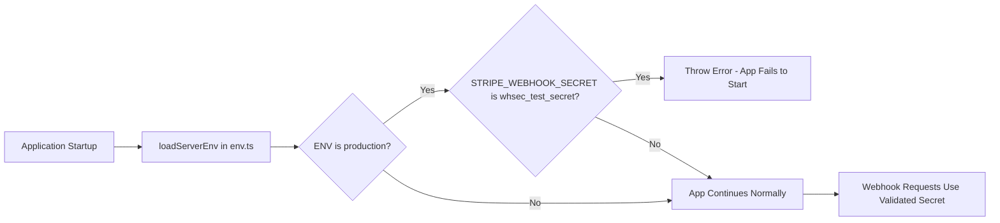

# PRD: Audit Finding 2 - Fix Unsafe Webhook Secret Validation

**Complexity: 2 → LOW mode**

- +1 Touches 3 files (`shared/config/env.ts`, `server/stripe/config.ts`, `app/api/webhooks/stripe/services/webhook-verification.service.ts`)
- +1 Adds validation during env loading (early initialization)

---

## 1. Context

**Problem:** The test webhook secret validation in `webhook-verification.service.ts` at line 40-43 happens AFTER `STRIPE_WEBHOOK_SECRET` has already been destructured from `serverEnv`. If production is accidentally configured with the test secret `whsec_test_secret`, the error is logged via `console.error` which could be missed in production logs. While the code does throw an error, this check happens on every webhook request when it should be validated once at application startup.

**Files Analyzed:**

- `app/api/webhooks/stripe/services/webhook-verification.service.ts` — Contains the per-request webhook secret validation check at lines 40-43
- `shared/config/env.ts` — Centralized environment configuration with `loadServerEnv()` function and `serverEnvSchema`
- `server/stripe/config.ts` — Stripe initialization where `STRIPE_WEBHOOK_SECRET` is exported
- `server/monitoring/logger.ts` — Structured logging with Baselime for production error tracking
- `logs/audit-report.md` — Source of Finding 2
- `app/api/health/stripe/route.ts` — Existing health check pattern for validation

**Current Behavior:**

- On every webhook request, `WebhookVerificationService.verifyWebhook()` checks if `STRIPE_WEBHOOK_SECRET === 'whsec_test_secret'` and `serverEnv.ENV !== 'test'`
- If misconfigured, uses `console.error()` which lacks structured logging and monitoring
- The check happens per-request, not at startup
- The secret is already destructured and in use when the check runs
- No early failure mechanism to prevent app startup with misconfigured webhook secret

### Integration Points

**How will this feature be reached?**

- [x] Entry point: Application startup during `loadServerEnv()` execution in `shared/config/env.ts`
- [x] Caller file: `shared/config/env.ts` — called when module is imported
- [x] Registration/wiring: No new registration needed — validation runs during env loading

**Is this user-facing?**

- [ ] YES → UI components required: N/A
- [x] NO → Internal background validation (prevents app from starting with misconfigured secret)

**Full user flow:**

1. Application starts → imports `serverEnv` from `@shared/config/env`
2. `loadServerEnv()` function executes and validates environment variables
3. **NEW:** Check for test webhook secret in production environment
4. **NEW:** If misconfigured, throw structured error before app fully initializes
5. Webhook requests proceed without per-request validation check (removed)

---

## 2. Solution

**Approach:**

- Add webhook secret validation in `loadServerEnv()` function in `shared/config/env.ts`
- Use structured error logging through Baselime logger (not `console.error`)
- Throw an error at startup to prevent app from running with misconfigured webhook secret
- Remove the per-request check from `webhook-verification.service.ts` since it's now validated at startup
- Add a health check endpoint validation for consistency with existing patterns

**Architecture Diagram:**

**Key Decisions:**

- Validate in `loadServerEnv()` — runs once at startup, not per-request
- Use `serverEnv.ENV` to detect production environment (already available)
- Throw a descriptive `Error` object with clear message for debugging
- Remove per-request check from `webhook-verification.service.ts` to avoid duplicate validation
- Consider adding a health check enhancement in `app/api/health/stripe/route.ts` to expose this validation status
- Pattern follows existing health check approach at `app/api/health/stripe/route.ts` lines 28-30

**Data Changes:** None — this is a code refactor only, no database changes

---

## 3. Execution Phases

### Phase 1: Add startup validation in loadServerEnv — App fails fast with test webhook secret in production

**Files (max 3):**

- `shared/config/env.ts` — Add webhook secret validation after env loading
- `server/stripe/config.ts` — Keep existing warning but defer to env validation
- `tests/unit/config/env.unit.spec.ts` — Add tests for validation logic (create if needed)

**Implementation:**

- [ ] Add validation function `validateWebhookSecret()` in `shared/config/env.ts` after `loadServerEnv()` function
- [ ] Call validation at end of `loadServerEnv()` after `serverEnvSchema.parse(env)` succeeds
- [ ] Validation should check: `if (serverEnv.ENV === 'production' && serverEnv.STRIPE_WEBHOOK_SECRET?.startsWith('whsec_test_'))`
- [ ] Throw error with message: `"CRITICAL: Test webhook secret detected in production environment. Please configure a production webhook secret in STRIPE_WEBHOOK_SECRET environment variable."`
- [ ] Run `yarn tsc` to verify no type errors

**Tests Required:**
| Test File | Test Name | Assertion |
|-----------|-----------|-----------|
| `tests/unit/config/env.unit.spec.ts` | `validateWebhookSecret throws error for test secret in production` | `expect(() => loadServerEnv({ ENV: 'production', STRIPE_WEBHOOK_SECRET: 'whsec_test_' })).toThrow()` |
| `tests/unit/config/env.unit.spec.ts` | `validateWebhookSecret allows test secret in test environment` | `expect(() => loadServerEnv({ ENV: 'test', STRIPE_WEBHOOK_SECRET: 'whsec_test_' })).not.toThrow()` |
| `tests/unit/config/env.unit.spec.ts` | `validateWebhookSecret allows production secret in production` | `expect(() => loadServerEnv({ ENV: 'production', STRIPE_WEBHOOK_SECRET: 'whsec_prod_123' })).not.toThrow()` |

**Verification Plan:**

1. **Unit Tests:** `yarn test tests/unit/config/env.unit.spec.ts` (create file if it doesn't exist)
2. **User Verification:**
   - Action: Set `ENV=production` and `STRIPE_WEBHOOK_SECRET=whsec_test_secret` in `.env.api`
   - Expected: Application fails to start with clear error message
   - Action: Set `ENV=production` and `STRIPE_WEBHOOK_SECRET=whsec_prod_real` in `.env.api`
   - Expected: Application starts normally

**Checkpoint:** Run `yarn verify` after this phase.

---

### Phase 2: Remove per-request check from webhook verification — Eliminate redundant validation

**Files (max 2):**

- `app/api/webhooks/stripe/services/webhook-verification.service.ts` — Remove lines 40-43
- `tests/unit/api/stripe-webhooks.unit.spec.ts` — Remove tests for the per-request check (if any exist)

**Implementation:**

- [ ] Remove lines 40-43 from `webhook-verification.service.ts` (the `if (STRIPE_WEBHOOK_SECRET === 'whsec_test_secret' && serverEnv.ENV !== 'test')` block)
- [ ] Remove related console.log at lines 34-37 if it was only for this validation
- [ ] Keep test mode detection for `isTestMode` variable (lines 31-32) as it's used elsewhere
- [ ] Search test files for any tests expecting this validation to run and update/remove them

**Tests Required:**
| Test File | Test Name | Assertion |
|-----------|-----------|-----------|
| `tests/unit/api/stripe-webhooks.unit.spec.ts` | `verifyWebhook processes webhooks without per-request secret validation` | `expect(result.event).toBeDefined()` |
| `tests/unit/api/stripe-webhooks.unit.spec.ts` | `verifyWebhook throws error for invalid signature` | `await expect(verifyWebhook(request)).rejects.toThrow()` |

**Verification Plan:**

1. **Unit Tests:** `yarn test tests/unit/api/stripe-webhooks.unit.spec.ts`
2. **User Verification:**
   - Action: Send test webhook request with valid signature
   - Expected: Webhook processes successfully without per-request validation
   - Action: Send webhook request with invalid signature
   - Expected: Request fails with signature verification error (existing behavior)

**Checkpoint:** Run `yarn verify` after this phase.

---

## 4. Acceptance Criteria

- [ ] All phases complete
- [ ] All specified tests pass
- [ ] `yarn verify` passes
- [ ] Application fails to start when `ENV=production` and `STRIPE_WEBHOOK_SECRET` starts with `whsec_test_`
- [ ] Application starts normally when `ENV=test` with test webhook secret
- [ ] Application starts normally when `ENV=production` with production webhook secret
- [ ] Per-request validation check removed from `webhook-verification.service.ts`
- [ ] Clear error message thrown at startup (not just logged)
- [ ] No use of `console.error` for this validation (use structured error)
- [ ] Existing webhook functionality preserved (test mode detection still works)
