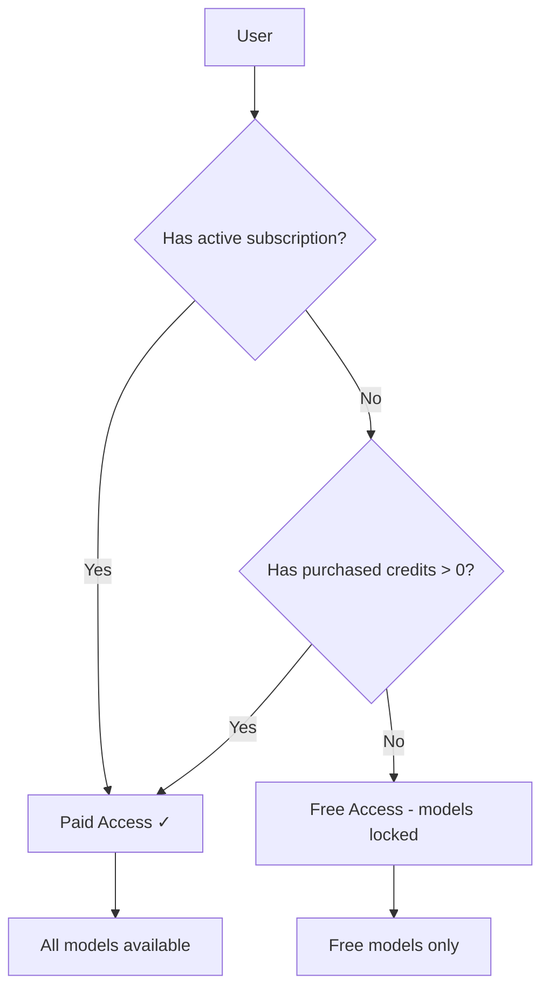
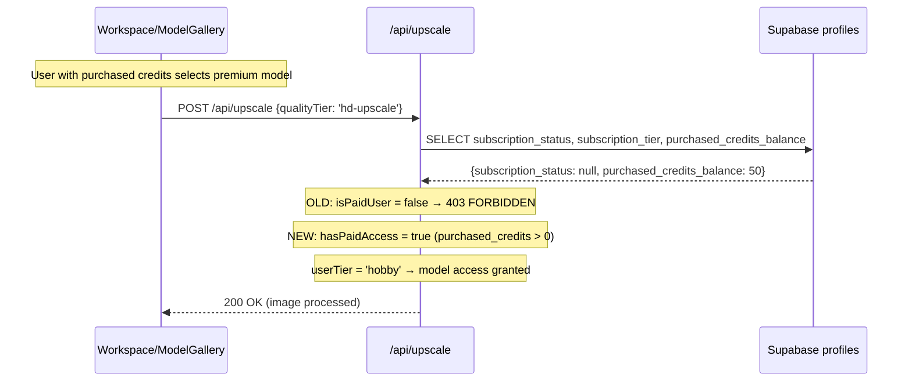

# PRD: Paid Model Access for Credit Purchasers + Billing Page Tabs

**Complexity: 5 → MEDIUM mode**

- Touches ~8 files (+2)
- Complex state logic (dual "paid" definition: subscription OR purchased credits)
- UI restructuring (billing page tabs)

---

## 1. Context

**Problem:** Users who purchase credits cannot access paid models because `isFreeUser` only checks subscription status, not credit purchases. Additionally, the billing page prominently shows credit packs while hiding the subscription option behind a "Change Plan" button, misleading users into buying credits instead of subscribing.

**Files Analyzed:**

- `client/components/features/workspace/Workspace.tsx` — `isFreeUser` logic (line 52-60)
- `client/components/features/workspace/BatchSidebar.tsx` — `isFreeUser` logic (line 58)
- `client/components/features/workspace/ModelGalleryModal.tsx` — lock overlay logic
- `client/components/features/workspace/BatchSidebar/QualityTierSelector.tsx` — tier gating
- `client/components/features/workspace/BatchSidebar/EnhancementOptions.tsx` — smart analysis gating
- `app/api/upscale/route.ts` — server-side tier enforcement (lines 221-222, 354, 483-505)
- `app/api/models/route.ts` — API tier determination (line 70)
- `app/[locale]/dashboard/billing/page.tsx` — billing page layout
- `client/components/ui/InternalTabs.tsx` — reusable tab component
- `server/services/model-registry.ts` — `getModelsByTier()` (line 412)
- `shared/config/model-costs.config.ts` — `PREMIUM_QUALITY_TIERS`, `FREE_QUALITY_TIERS`

**Current Behavior:**

- `isFreeUser` in Workspace: checks `subscription_status` and `subscription_tier` only — users with purchased credits but no subscription are treated as free
- `isFreeUser` in BatchSidebar: checks `!profile?.subscription_tier` only — same problem
- Server-side (`/api/upscale`): `isPaidUser = isPaidSubscriptionStatus(subscriptionStatus)` — only checks `'active' | 'trialing'`, ignores purchased credits
- Server-side (`/api/models`): only grants model access when `subscription_status === 'active'`
- Billing page: credit packs shown prominently in main view, subscription hidden behind "Change Plan" button

## 2. Solution

**Approach:**

1. Introduce a unified `hasPaidAccess` concept: user has paid access if they have an active subscription **OR** a positive `purchased_credits_balance`
2. Add `isFreeUser` to the existing `useUserData` hook in `client/store/userStore.ts` — single source of truth, replaces 2 inconsistent inline computations
3. Refactor all consumer components to use `isFreeUser` from the hook instead of computing it locally
4. Update server-side `/api/upscale` and `/api/models` to grant paid model access to users with purchased credits
5. Restructure billing page into tabs using `InternalTabs` component: "Subscription" (default) and "Credits"

**Architecture Diagram:**



**Key Decisions:**

- Credit purchasers get access to the same model tier as `hobby` (lowest paid tier) — they paid money, they deserve paid models
- Server-side enforces this via a new `hasPaidAccess()` helper that checks both subscription AND purchased credits
- The `userTier` for credit-only purchasers defaults to `'hobby'` to unlock hobby-restricted models
- Billing page uses existing `InternalTabs` component (same as Settings page)
- No database changes needed — `purchased_credits_balance` already exists in profiles

**Data Changes:** None

## 3. Sequence Flow



---

## 4. Execution Phases

### Phase 1: Server-Side — Grant Model Access to Credit Purchasers

**User-visible outcome:** Users who purchased credits can now use paid models via the API.

**Files (4):**

- `app/api/upscale/route.ts` — add purchased credits check to `isPaidUser` logic
- `app/api/models/route.ts` — add purchased credits check to tier determination
- `server/services/model-registry.ts` — no changes needed (already works with tier param)
- `tests/unit/tier-restriction.unit.spec.ts` — add tests for credit-purchaser model access

**Implementation:**

- [ ] In `app/api/upscale/route.ts`:
  - Modify the profile query (line 214) to also select `purchased_credits_balance`
  - Update `isPaidUser` logic (line 221) to also be `true` when `purchased_credits_balance > 0`
  - Update `userTier` (line 222) to default to `'hobby'` for credit-only purchasers (no subscription but has purchased credits)

- [ ] In `app/api/models/route.ts`:
  - Modify the profile query (line 53) to also select `purchased_credits_balance`
  - Update tier determination (line 70) to set `userTier = 'hobby'` when user has no active subscription but has `purchased_credits_balance > 0`

**Tests Required:**
| Test File | Test Name | Assertion |
|-----------|-----------|-----------|
| `tests/unit/tier-restriction.unit.spec.ts` | `should grant hobby-tier model access when user has purchased credits but no subscription` | `expect(hasPaidAccess).toBe(true)` |
| `tests/unit/tier-restriction.unit.spec.ts` | `should block premium models for users with no subscription AND no purchased credits` | `expect(hasPaidAccess).toBe(false)` |
| `tests/unit/tier-restriction.unit.spec.ts` | `should use subscription tier when both subscription and purchased credits exist` | `expect(userTier).toBe(subscriptionTier)` |

**Verification Plan:**

1. **Unit Tests:** `tests/unit/tier-restriction.unit.spec.ts` — cover all 3 scenarios (subscription only, credits only, both)
2. **Evidence:** `yarn verify` passes

---

### Phase 2: Frontend — Centralized `isFreeUser` Hook + Component Refactor

**User-visible outcome:** Users with purchased credits see premium models as unlocked (no lock overlay) in the model gallery and can select premium quality tiers.

**Problem being solved:** `isFreeUser` is computed inline in 2 components with **inconsistent logic**:

- `Workspace.tsx` (lines 52-60): checks `subscription_status`, `subscription_tier`, `price_id` — complex but misses purchased credits
- `BatchSidebar.tsx` (line 58): `!profile?.subscription_tier` — simpler, also wrong, also misses purchased credits

Both are wrong and duplicated. Fix: single source of truth in `useUserData`.

**Files (4):**

- `client/store/userStore.ts` — add `isFreeUser` to `useUserData` return value
- `client/components/features/workspace/Workspace.tsx` — consume `isFreeUser` from hook, remove inline logic
- `client/components/features/workspace/BatchSidebar.tsx` — consume `isFreeUser` from hook, remove inline logic
- `tests/unit/client/model-gallery-modal.unit.spec.tsx` — update tests

**Implementation:**

- [ ] In `client/store/userStore.ts` — add `isFreeUser` to the existing `useUserData` hook (line 417):

  ```typescript
  export const useUserData = (): {
    totalCredits: number;
    profile: IUserProfile | null;
    subscription: ISubscription | null;
    isAuthenticated: boolean;
    isFreeUser: boolean;
  } =>
    useUserStore(
      useShallow(state => {
        const profile = state.user?.profile ?? null;
        const subscription = state.user?.subscription ?? null;
        const subscriptionTier = profile?.subscription_tier?.toLowerCase() ?? null;
        const hasPaidTier = !!subscriptionTier && subscriptionTier !== 'free';
        const hasSubscription =
          hasPaidTier ||
          !!subscription?.price_id ||
          (!!profile?.subscription_status &&
            profile.subscription_status !== 'canceled' &&
            profile.subscription_status !== 'unpaid');
        const hasPurchasedCredits = (profile?.purchased_credits_balance ?? 0) > 0;

        return {
          totalCredits:
            (profile?.subscription_credits_balance ?? 0) +
            (profile?.purchased_credits_balance ?? 0),
          profile,
          subscription,
          isAuthenticated: state.isAuthenticated,
          isFreeUser: !hasSubscription && !hasPurchasedCredits,
        };
      })
    );
  ```

- [ ] In `client/components/features/workspace/Workspace.tsx` (lines 51-60):
  - Replace all inline `isFreeUser` computation:

    ```typescript
    // BEFORE (6 lines of inline logic):
    const { subscription, profile } = useUserData();
    const subscriptionTier = profile?.subscription_tier?.toLowerCase() ?? null;
    const hasPaidTier = !!subscriptionTier && subscriptionTier !== 'free';
    const hasSubscription = hasPaidTier || ...;
    const isFreeUser = !hasSubscription;

    // AFTER (1 line):
    const { subscription, profile, isFreeUser } = useUserData();
    ```

  - Remove the `subscriptionTier`, `hasPaidTier`, `hasSubscription` local variables
  - Note: keep the `hasSubscription` usage in `UpgradeSuccessBanner` prop — derive from `!isFreeUser` instead

- [ ] In `client/components/features/workspace/BatchSidebar.tsx` (line 53-58):
  - Replace inline computation:

    ```typescript
    // BEFORE:
    const { totalCredits, profile } = useUserData();
    const isFreeUser = !profile?.subscription_tier;

    // AFTER:
    const { totalCredits, profile, isFreeUser } = useUserData();
    ```

  - Remove the local `isFreeUser` line

**Tests Required:**
| Test File | Test Name | Assertion |
|-----------|-----------|-----------|
| `tests/unit/client/model-gallery-modal.unit.spec.tsx` | `should show premium models unlocked when user has purchased credits` | `expect(lockOverlay).not.toBeInTheDocument()` |
| `tests/unit/client/model-gallery-modal.unit.spec.tsx` | `should show premium models locked when user has no subscription and no purchased credits` | `expect(lockOverlay).toBeInTheDocument()` |

**Verification Plan:**

1. **Unit Tests:** model gallery modal tests pass with new scenarios
2. **Evidence:** `yarn verify` passes

**Downstream components (no changes needed):**
These receive `isFreeUser` as a prop from Workspace/BatchSidebar — they're already correct:

- `ModelGalleryModal` — receives `isFreeUser` prop
- `QualityTierSelector` — receives `isFreeUser` prop
- `EnhancementOptions` — receives `isFreeUser` prop
- `ActionPanel` — receives `isFreeUser` prop

---

### Phase 3: Billing Page — Tab Layout Restructure

**User-visible outcome:** Billing page shows two tabs: "Subscription" (default, prominent) and "Credits". Users see subscription options first instead of credit packs.

**Files (2):**

- `app/[locale]/dashboard/billing/page.tsx` — restructure with `InternalTabs`
- `locales/en/dashboard.json` — add tab label translations

**Implementation:**

- [ ] In `app/[locale]/dashboard/billing/page.tsx`:
  - Import `InternalTabs` and `ITabItem` from `@client/components/ui/InternalTabs`
  - Import `CreditCard` and `Coins` (or `Wallet`) icons from lucide-react
  - Keep the page header (title + refresh button) and loading/error states as-is
  - Extract current plan section + subscription details into a `SubscriptionTab` component
  - Extract credit top-up + credit history into a `CreditsTab` component
  - Keep payment methods and billing history in a shared section below tabs (they apply to both)
  - Wire up `InternalTabs` with:
    ```typescript
    const tabs: ITabItem[] = [
      { id: 'subscription', label: t('tabs.subscription'), icon: CreditCard, content: <SubscriptionTab /> },
      { id: 'credits', label: t('tabs.credits'), icon: Coins, content: <CreditsTab /> },
    ];
    ```
  - Default tab: `'subscription'`

- [ ] In `locales/en/dashboard.json`:
  - Add under `billing`:
    ```json
    "tabs": {
      "subscription": "Subscription",
      "credits": "Credits"
    }
    ```

**Tab Content Layout:**

**Subscription Tab:**

- Current Plan card (plan name, status badge, credits balance)
- "Change Plan" / "Choose Plan" button (prominent CTA)
- Cancel subscription button
- Subscription details (period end, trial info, scheduled changes)
- Payment Methods section
- Billing History section

**Credits Tab:**

- Credit Top-Up section (CreditPackSelector)
- "Better value" tip promoting subscriptions
- Credit History section (transactions list with pagination)

**Tests Required:**
| Test File | Test Name | Assertion |
|-----------|-----------|-----------|
| `tests/unit/client/billing-page.unit.spec.tsx` | `should render Subscription tab as default` | `expect(subscriptionTab).toHaveClass('text-accent')` |
| `tests/unit/client/billing-page.unit.spec.tsx` | `should render Credits tab content when clicked` | `expect(creditPackSelector).toBeInTheDocument()` |
| `tests/unit/client/billing-page.unit.spec.tsx` | `should show subscription plan info in Subscription tab` | `expect(planName).toBeInTheDocument()` |

**Verification Plan:**

1. **Unit Tests:** billing page component tests
2. **Manual Verification:** Navigate to `/dashboard/billing` → see tabs, switch between them
3. **Evidence:** `yarn verify` passes

---

## 5. Acceptance Criteria

- [ ] All phases complete
- [ ] All specified tests pass
- [ ] `yarn verify` passes
- [ ] Users with purchased credits (no subscription) can select and use premium models
- [ ] Users with purchased credits (no subscription) see premium models unlocked in UI
- [ ] Server-side `/api/upscale` allows premium tiers for credit purchasers
- [ ] Server-side `/api/models` returns premium models as available for credit purchasers
- [ ] Billing page has Subscription tab (default) and Credits tab
- [ ] Subscription tab shows plan info, change plan CTA, cancel, payment methods, billing history
- [ ] Credits tab shows credit packs, credit history
- [ ] `InternalTabs` component from Settings is reused (no new tab component)
- [ ] `isFreeUser` logic lives in `useUserData` hook only — no inline computation in components
- [ ] `Workspace.tsx` and `BatchSidebar.tsx` consume `isFreeUser` from `useUserData()`, not computed locally
