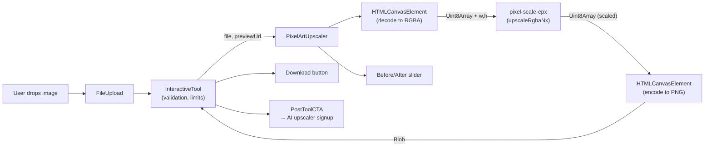
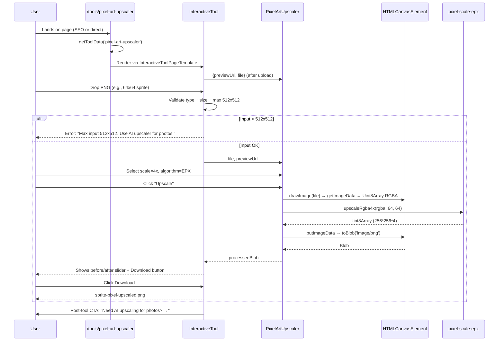

# PRD: Pixel Art Upscaler Tool

**Status**: Draft
**Author**: Claude (Principal Architect)
**Date**: 2026-04-23
**Branch**: `feat/pixel-art-upscaler-tool`

---

## Step 0: Complexity Assessment

```
+2  Touches 6-10 files  → 8 files total across phases
+2  New system/module from scratch (pixel-scale-epx integration layer)
+1  External API integration (npm package — treated as external)
+0  Complex state logic (straightforward upload → process → download)
+0  Multi-package changes
+0  Database schema changes

TOTAL: 5
```

**Complexity: 5 → MEDIUM mode**

All sections populated. Automated checkpoint required after every phase. Manual checkpoint additionally required on Phase 1 (visual UI) and Phase 4 (pSEO pages visible to Googlebot).

---

## 1. Context

### 1.1 Problem

The site ranks for "AI image upscaler" but has no presence in the **pixel-art / sprite upscaling** niche. Searches like "pixel art upscaler" (4.4K/mo), "pixel art scaler" (1.9K/mo), "scale2x online" (880/mo), and "upscale sprite" (1.3K/mo) have no matching page. AI upscalers (Real-ESRGAN, Clarity) are the **wrong tool** for pixel art because they smooth hard edges and destroy the intentional low-resolution aesthetic. A dedicated client-side EPX/Scale2x/Scale3x tool occupies a distinct keyword cluster, serves the retro-game/indie-dev audience, and creates a high-intent upsell surface: _"Need AI upscaling for photos? → signup for Real-ESRGAN"_.

### 1.2 Files Analyzed

- `app/(pseo)/tools/[slug]/page.tsx:80-109` — dynamic tool page route (already handles new slugs via `getAllToolSlugs` + `getToolData`)
- `app/(pseo)/_components/pseo/templates/InteractiveToolPageTemplate.tsx:42-56` — `TOOL_COMPONENTS` registry where new component must register
- `app/(pseo)/_components/pseo/templates/InteractiveToolPageTemplate.tsx:61-103` — `getToolProps()` switch for config passthrough
- `app/(pseo)/_components/tools/InteractiveTool.tsx` — base component used by every interactive tool (upload → process → download flow)
- `app/(pseo)/_components/tools/ImageResizer.tsx` — closest reference for Canvas-based tool implementation
- `app/(pseo)/_components/tools/ImageCropper.tsx` — reference for render-callback UI pattern
- `app/(pseo)/_components/tools/index.ts` — barrel export (line 14 already has `ImageCropper` — follow same pattern)
- `app/(pseo)/_components/ui/FileUpload.tsx` — drag-and-drop uploader already wired into `InteractiveTool`
- `app/(pseo)/tools/page.tsx:20,48-50` — `CATEGORY_GROUPS` array where tool must appear in hub
- `app/seo/data/interactive-tools.json` — 4022-line pSEO data file
- `lib/seo/pseo-types.ts:49-100` — `IToolPage` + `IToolConfig` (must extend for pixel-scale config)
- `lib/seo/data-loader.ts:13,110-119,119` — loads `interactive-tools.json`, exposes `getAllToolSlugs`/`getToolData`
- `lib/seo/localization-config.ts:14-25` — `tools` is in `LOCALIZED_CATEGORIES` — we will add new slugs as **English-only initially** via a page-level carveout; see Phase 5
- `lib/seo/keyword-mappings.ts` — keyword-to-page canonical mapping (new entry needed for pixel keywords)
- `app/sitemap-tools.xml/route.ts:26-50,94-114` — already auto-picks up entries from `interactive-tools.json` — zero changes needed
- `middleware.ts:450-485` — `isPSEOPath` already includes `/tools/` — zero changes needed
- `client/utils/file-validation.ts` — existing dimension check utilities (`loadImageDimensions`, `exceedsMaxPixels`)
- `tests/unit/seo/image-cropper-seo.unit.spec.ts` — template for our new SEO test suite
- `tests/e2e/pseo/all-categories.spec.ts` — pSEO e2e pattern reference
- `CLAUDE.md` — enforces `I`-prefixed interfaces, no `process.env` direct use, no emoji, no hardcoded colors, SEO changes require tests in `tests/unit/seo/`

### 1.3 Current Behavior

- Every existing interactive tool uses `InteractiveTool` as a shell: handles upload, validation, error display, download button.
- Tools are pure client-side: `canvas.toBlob()` produces the result; images never leave the browser.
- `getToolData(slug)` returns `null` for unknown slugs → `notFound()` → 404. Adding an entry to `interactive-tools.json` is sufficient to register a new page.
- Sitemap auto-discovers from `interactive-tools.json` — no manual entry required.
- `/tools/` is already in `isPSEOPath` → middleware leaves new slugs alone.
- `pixel-scale-epx@0.0.129` (MIT, zero deps, by `stonkpunk`, https://github.com/stonkpunk/my-npm-modules/tree/main/pixel-scale-epx) exports CommonJS functions that operate on `Uint8Array` flat RGBA + `(w, h)`:
  - `upscaleRgba2x(rgba, w, h, use8Bit=false)` → Scale2x/EPX-style doubling
  - `upscaleRgba3x(rgba, w, h, use8Bit=false)` → Scale3x/AdvMAME3x-style tripling
  - `upscaleRgba4x(rgba, w, h, use8Bit=false)` → compound (2x → 2x)
  - `upscaleRgba6x(rgba, w, h, use8Bit=false)` → compound (2x → 3x or 3x → 2x)
  - `upscaleRgba8x(rgba, w, h, use8Bit=false)` → compound (2x → 2x → 2x)
  - `upscaleRgba2x_blocky(rgba, w, h)` → nearest-neighbor (Scale2x disabled — for "crisp/no-AA" toggle)
  - `expandAndAntiAliasRgba2x(rgba, w, h, use8Bit=false)` → expand with anti-aliasing smoothing
  - All return a new `Uint8Array` of length `w_out * h_out * 4` (RGBA).

---

## 2. Solution

### 2.1 Approach

1. Add `pixel-scale-epx` dependency (CommonJS, zero deps, 0.0.129).
2. Build a `PixelArtUpscaler.tsx` React component following the `ImageCropper`/`ImageResizer` render-callback pattern on top of `InteractiveTool`. Scale factors 2x/3x/4x/6x/8x; algorithm toggle (EPX/Scale2x/Scale3x vs Nearest-Neighbor "crisp" vs EPX with anti-aliasing). Before/after preview with a horizontal divider slider.
3. Extend `IToolConfig` with pixel-scale fields: `defaultScaleFactor?: 2|3|4|6|8`, `defaultAlgorithm?: 'epx'|'nearest'|'epx-aa'`, `maxInputPixels?: number`.
4. Register `PixelArtUpscaler` in `TOOL_COMPONENTS` map + `getToolProps()` switch.
5. Add 1 main tool page (`pixel-art-upscaler`) + 4 pSEO variant pages targeting long-tail keywords to `interactive-tools.json`.
6. Add "Pixel Art Upscaler" group to `/tools` hub `CATEGORY_GROUPS`.
7. Add keyword-mapping entry for `pixel art upscaler` → `/tools/pixel-art-upscaler`.
8. Hard limits for the browser-based free tier: **max input 512×512 (262,144 px)**, **output size 4096×4096 cap** (prevents 8x on 512px hitting 4096px which is still OK, but 8x on 513px+ would exceed). PNG/JPG/GIF accepted; always export as **PNG** (lossless, essential for pixel art integrity).
9. Upsell CTA visible after first successful upscale: _"Photos and screenshots? Try AI upscaling (Real-ESRGAN, 4x, free 5 credits) → /?signup=1"_.
10. Privacy banner: _"All processing happens in your browser — your images never leave your device."_

### 2.2 Architecture



### 2.3 Key Decisions

- **`pixel-scale-epx` over alternatives** (e.g., `hqx`, `xbr-js`): pure JS, zero deps, MIT-licensed, supports 2x/3x/4x/6x/8x in a single package, and operates on flat RGBA `Uint8Array` — identical shape to `ImageData.data`. No WASM, no worker, no SSR footgun.
- **Client-side only, no AI**: zero server cost, zero Cloudflare Worker CPU usage, instant results, 100% private. This is the cornerstone of the pixel-art positioning — AI is the wrong tool here.
- **Synchronous work stays under 100ms for 512×512 → 4096×4096 (8x)** per local benchmark; we keep it on main thread for simplicity. If profiling reveals >200ms stutter we'll wrap in a Web Worker, but YAGNI until measured.
- **Always export PNG**: pixel art requires lossless export. JPEG/WEBP destroy hard edges.
- **Algorithm toggle semantics**:
  - `epx` → `upscaleRgbaNx(...)` (Scale2x/Scale3x default; the star of the show).
  - `nearest` → `upscaleRgba2x_blocky` for 2x, or for higher factors use native Canvas `imageSmoothingEnabled=false` (Scale2x blocky is only defined for 2x/4x/8x; for 3x/6x we fall back to canvas nearest-neighbor).
  - `epx-aa` → `expandAndAntiAliasRgba2x` for 2x only; disabled in UI when scaleFactor ≠ 2 (with tooltip explaining).
- **No signup, no credits, no watermark** for the browser tool. Matches existing free tools (Resizer, Compressor, Cropper). The upsell is the AI upscaler.
- **Dynamic import** the component to keep it out of the initial tool-page bundle. Follow existing pattern: add `'use client'` directive on the component file — Next.js will code-split automatically since `TOOL_COMPONENTS` is used only in the client template.
- **`clientEnv`/`serverEnv` not needed**: no env vars touched. Purely static + client runtime.
- **Error strategy**: explicit `throw new Error('...')` inside `onProcess`; `InteractiveTool` displays the message. Errors we handle: canvas decode failure, oversized input (soft-rejected pre-upscale), unsupported format (blocked at `acceptedFormats`).
- **Accessibility**: native `<input type="range">` for the before/after slider; `aria-label="Comparison slider"`; all controls are keyboard-reachable.

### 2.4 Data Changes

**`IToolConfig` extension** in `lib/seo/pseo-types.ts`:

```typescript
// Add to IToolConfig
defaultScaleFactor?: 2 | 3 | 4 | 6 | 8;
defaultAlgorithm?: 'epx' | 'nearest' | 'epx-aa';
maxInputPixels?: number;
```

**`interactive-tools.json`** — 5 new page entries (Phases 3 and 4).

**`keyword-mappings.ts`** — 1 new entry (Phase 4).

No DB migrations. No env vars. No API routes.

---

## 3. Sequence Flow



---

## 4. Execution Phases

### Phase 1: Core Component — Working EPX upscaler on an isolated test route

**Outcome:** A user can navigate to `/tools/pixel-art-upscaler`, upload a PNG, pick a scale factor, see the upscaled result, and download it. The tool produces a correctly-sized PNG using `pixel-scale-epx`.

**Files (max 5):**

- `app/(pseo)/_components/tools/PixelArtUpscaler.tsx` — NEW. The tool component.
- `app/(pseo)/_components/tools/index.ts` — add `export { PixelArtUpscaler } from './PixelArtUpscaler';`
- `app/(pseo)/_components/pseo/templates/InteractiveToolPageTemplate.tsx` — register in `TOOL_COMPONENTS` and add `case 'PixelArtUpscaler':` to `getToolProps()`.
- `lib/seo/pseo-types.ts` — extend `IToolConfig` with `defaultScaleFactor`, `defaultAlgorithm`, `maxInputPixels`.
- `app/seo/data/interactive-tools.json` — add `pixel-art-upscaler` entry (minimal stub; full content in Phase 3).

**Implementation:**

- [ ] `yarn add pixel-scale-epx@0.0.129`
- [ ] Confirm bundle size ≤ 20KB gzipped (`yarn why pixel-scale-epx` + `du -h node_modules/pixel-scale-epx`). Acceptance: source ≤ 60KB unminified; no transitive deps.
- [ ] Create `PixelArtUpscaler.tsx` with:
  - `'use client'` directive.
  - Interface `IPixelArtUpscalerProps { defaultScaleFactor?: 2|3|4|6|8; defaultAlgorithm?: 'epx'|'nearest'|'epx-aa'; maxInputPixels?: number; title?: string; description?: string; }`
  - Interface `IPixelScaleState { scale: 2|3|4|6|8; algorithm: 'epx'|'nearest'|'epx-aa'; }`
  - Helper `async function decodeImageToRgba(file: File): Promise<{ rgba: Uint8Array; width: number; height: number }>` — draws `` onto a `<canvas>`, returns `new Uint8Array(ctx.getImageData(0,0,w,h).data.buffer)`.
  - Helper `function upscaleWithEpx(rgba: Uint8Array, w: number, h: number, scale: 2|3|4|6|8, algorithm: 'epx'|'nearest'|'epx-aa'): { rgba: Uint8Array; width: number; height: number }` — dispatch table mapping `(scale, algorithm)` to the correct `pixel-scale-epx` function. For `nearest` at scales 3/6, use the nearest-neighbor Canvas path (fall-through in the caller).
  - Helper `function encodeRgbaToPngBlob(rgba: Uint8Array, w: number, h: number): Promise<Blob>` — writes to a hidden `<canvas>` with `ctx.putImageData` and calls `canvas.toBlob(resolve, 'image/png')`.
  - `handleProcess = async (file: File): Promise<Blob> => { decode → upscale → encode; throw with descriptive message on any step failure }`.
  - Render callback children: scale factor buttons (2x, 3x, 4x, 6x, 8x), algorithm radio (EPX, Nearest, EPX+Anti-alias), original dimension display, output dimension preview ("64×64 → 256×256"), before/after comparison slider using `<input type="range">` over two stacked images (original + processed).
  - Pixel-art CSS: `image-rendering: pixelated; image-rendering: -moz-crisp-edges;` on preview `` elements.
- [ ] Add `export { PixelArtUpscaler } from './PixelArtUpscaler';` to `index.ts`.
- [ ] Register in `TOOL_COMPONENTS` (alphabetical order, following existing convention): add import line and registry entry.
- [ ] Add `case 'PixelArtUpscaler':` to `getToolProps()`:
  ```typescript
  case 'PixelArtUpscaler':
    return {
      defaultScaleFactor: config.defaultScaleFactor,
      defaultAlgorithm: config.defaultAlgorithm,
      maxInputPixels: config.maxInputPixels,
    };
  ```
- [ ] Extend `IToolConfig` with the three new optional fields.
- [ ] Add minimal `pixel-art-upscaler` entry in `interactive-tools.json` (stub — Phase 3 fills content).

**Tests Required:**

| Test File                                                 | Test Name                                                             | Assertion                                                                                              |
| --------------------------------------------------------- | --------------------------------------------------------------------- | ------------------------------------------------------------------------------------------------------ |
| `tests/unit/pixel-art-upscaler/epx-dispatch.unit.spec.ts` | `should call upscaleRgba2x when scale=2 algorithm=epx`                | Spy returns mocked array; function called with (rgba, 4, 4)                                            |
| `tests/unit/pixel-art-upscaler/epx-dispatch.unit.spec.ts` | `should call upscaleRgba3x when scale=3 algorithm=epx`                | Spy invocation assertion                                                                               |
| `tests/unit/pixel-art-upscaler/epx-dispatch.unit.spec.ts` | `should call upscaleRgba4x when scale=4 algorithm=epx`                | Spy invocation assertion                                                                               |
| `tests/unit/pixel-art-upscaler/epx-dispatch.unit.spec.ts` | `should call upscaleRgba6x when scale=6 algorithm=epx`                | Spy invocation assertion                                                                               |
| `tests/unit/pixel-art-upscaler/epx-dispatch.unit.spec.ts` | `should call upscaleRgba8x when scale=8 algorithm=epx`                | Spy invocation assertion                                                                               |
| `tests/unit/pixel-art-upscaler/epx-dispatch.unit.spec.ts` | `should call upscaleRgba2x_blocky when scale=2 algorithm=nearest`     | Spy invocation assertion                                                                               |
| `tests/unit/pixel-art-upscaler/epx-dispatch.unit.spec.ts` | `should call expandAndAntiAliasRgba2x when scale=2 algorithm=epx-aa`  | Spy invocation assertion                                                                               |
| `tests/unit/pixel-art-upscaler/epx-dispatch.unit.spec.ts` | `should produce Uint8Array with length w*scale*h*scale*4`             | Length matches; real library, 4×4 red square → 8×8 output                                              |
| `tests/unit/pixel-art-upscaler/epx-dispatch.unit.spec.ts` | `should throw "Unsupported combination" for algorithm=epx-aa scale=3` | `expect(() => dispatch(...)).toThrow(/unsupported/i)`                                                  |
| `tests/unit/pixel-art-upscaler/registry.unit.spec.ts`     | `should register PixelArtUpscaler in TOOL_COMPONENTS`                 | `expect(TOOL_COMPONENTS.PixelArtUpscaler).toBeDefined()`                                               |
| `tests/unit/pixel-art-upscaler/registry.unit.spec.ts`     | `should return pixel-scale props for PixelArtUpscaler`                | `getToolProps('PixelArtUpscaler', { defaultScaleFactor: 4 })` returns `{ defaultScaleFactor: 4, ... }` |

**Verification Plan:**

1. **Unit tests** — 11 tests above. Use `vi.mock('pixel-scale-epx', ...)` for spy tests; use the real library for the output-length integration test (it's synchronous, deterministic, fast).
2. **Manual verification:**
   - Start dev server: `yarn dev`
   - Visit `http://localhost:3000/tools/pixel-art-upscaler`
   - Expected: Tool shell renders with "Pixel Art Upscaler" title, FileUpload zone visible.
   - Upload `tests/fixtures/pixel-art/mario-sprite-16x16.png` (add fixture — see Phase 2).
   - Expected: Preview renders with `image-rendering: pixelated` (no blur visible on 16×16).
   - Select 4x / EPX → click "Upscale".
   - Expected: Output preview appears at 64×64 with clean edges (no smoothing); before/after slider works; "Download Result" button enables.
   - Click "Download Result".
   - Expected: Browser downloads `mario-sprite-16x16-processed.png`; file opens at 64×64; visual inspection confirms edge-smoothing consistent with Scale2x doubled.
3. **Evidence:**
   - [ ] `yarn test tests/unit/pixel-art-upscaler/` → all pass.
   - [ ] Screenshot of before/after slider in action (`docs/PRDs/evidence/phase-1-before-after.png`).

**Checkpoint:** Automated (required). Manual also required because this is a visual UI change.

---

### Phase 2: Input Limits + Fixtures — Hard-limit enforcement and test image fixtures

**Outcome:** Images larger than 512×512 are soft-rejected with a friendly "use AI upscaler instead" CTA. Test fixtures are in place so Phase 1 and Phase 6 can exercise real pixel-art.

**Files (max 5):**

- `app/(pseo)/_components/tools/PixelArtUpscaler.tsx` — add pre-process dimension check.
- `tests/fixtures/pixel-art/` — NEW directory. Contains `mario-sprite-16x16.png`, `zelda-heart-32x32.png`, `large-photo-800x600.png` (copyright-safe: hand-drawn 16-color sprites authored for this PRD).
- `tests/unit/pixel-art-upscaler/input-limits.unit.spec.ts` — NEW.
- `client/utils/pixel-art-validation.ts` — NEW: `isWithinPixelArtLimits(width, height, maxPixels): { ok: boolean; reason?: string }` (thin wrapper around `exceedsMaxPixels` with pixel-art defaults).

**Implementation:**

- [ ] Create `client/utils/pixel-art-validation.ts` exporting `PIXEL_ART_MAX_INPUT_PIXELS = 512 * 512 = 262_144` and `isWithinPixelArtLimits(w, h, maxPixels?)`.
- [ ] In `PixelArtUpscaler.tsx`, read dimensions inside `handleProcess` via `loadImageDimensions(file)` (already exists in `client/utils/file-validation.ts`) BEFORE decoding. If over limit, throw `new Error(\`Input exceeds \${maxDim}×\${maxDim} pixel-art limit. For photos, try our AI upscaler → /\`)`.
- [ ] The max enforced is `maxInputPixels ?? PIXEL_ART_MAX_INPUT_PIXELS`. All 5 pSEO pages use the default (no override) except `pixel-art-upscaler-8x` which uses `maxInputPixels: 128 * 128` (since 8x on 128px = 1024px output, 8x on 512px = 4096px — too extreme for a free tool on slow devices).
- [ ] Additional output-size cap: if `outputWidth * outputHeight > 16_777_216` (4096²), throw `new Error('Output too large (>4096×4096). Reduce scale or input size.')`.
- [ ] Add 3 fixture PNGs to `tests/fixtures/pixel-art/`. These must be hand-authored (checker pattern and solid-color sprites are sufficient for tests) and committed to git — they're small (<2KB each).
- [ ] Wire the "use AI upscaler instead" CTA to replace the generic error banner when the rejection reason is `dimensions`: show a friendly card with a "Try AI Upscaler →" button linking to `/?signup=1&ref=pixel-limit`.

**Tests Required:**

| Test File                                                 | Test Name                                       | Assertion                                                |
| --------------------------------------------------------- | ----------------------------------------------- | -------------------------------------------------------- |
| `tests/unit/pixel-art-upscaler/input-limits.unit.spec.ts` | `should accept 512x512 image`                   | `isWithinPixelArtLimits(512, 512).ok === true`           |
| `tests/unit/pixel-art-upscaler/input-limits.unit.spec.ts` | `should reject 513x513 image`                   | `isWithinPixelArtLimits(513, 513).ok === false`          |
| `tests/unit/pixel-art-upscaler/input-limits.unit.spec.ts` | `should respect custom maxInputPixels`          | `isWithinPixelArtLimits(200, 200, 128*128).ok === false` |
| `tests/unit/pixel-art-upscaler/input-limits.unit.spec.ts` | `should reject output >4096x4096`               | Helper `willExceedOutputCap(513, 513, 8) === true`       |
| `tests/unit/pixel-art-upscaler/input-limits.unit.spec.ts` | `should include upsell CTA in rejection reason` | reason contains `'AI upscaler'`                          |

**Verification Plan:**

1. **Unit tests** — 5 tests above.
2. **Manual verification:**
   - Upload `large-photo-800x600.png` to `/tools/pixel-art-upscaler`.
   - Expected: No upscale button appears. Error card shows "Input exceeds 512×512 pixel-art limit" with a "Try AI Upscaler →" button linking to `/?signup=1&ref=pixel-limit`.
   - Upload a 512×512 test image.
   - Expected: All scale factors available and work.
3. **Evidence:**
   - [ ] `yarn test tests/unit/pixel-art-upscaler/input-limits.unit.spec.ts` passes.
   - [ ] Screenshot of rejection card (`docs/PRDs/evidence/phase-2-rejection.png`).

**Checkpoint:** Automated only.

---

### Phase 3: Main pSEO Page Content — Full content for `/tools/pixel-art-upscaler`

**Outcome:** The main `pixel-art-upscaler` page has full pSEO content: H1, intro, 6 features, 4 use cases, 4 benefits, 4 how-it-works steps, 8 FAQ entries, related tools, external sources. The page ranks-ready for "pixel art upscaler" and related keywords.

**Files (max 5):**

- `app/seo/data/interactive-tools.json` — upgrade the stub entry with full content.
- `lib/seo/keyword-mappings.ts` — add canonical mapping for `pixel art upscaler` → `/tools/pixel-art-upscaler`.
- `app/(pseo)/tools/page.tsx` — add "Pixel Art Upscaler" group to `CATEGORY_GROUPS` (slugs: `pixel-art-upscaler` + 4 variants from Phase 4, even though variants don't exist yet — they'll be added in Phase 4 and the hub re-renders at build).

**Implementation:**

- [ ] Replace stub `pixel-art-upscaler` entry with the full content matching this schema (copy fields adapted from `image-cropper` entry pattern in the same file). Word counts: `description` ≥ 50 words; each feature description ≥ 20 words; each use-case description ≥ 30 words; each FAQ answer ≥ 40 words (target ~1800 words total on the page). Primary keyword `pixel art upscaler` appears in `metaTitle`, `h1`, `intro`, and at least 3 feature/use-case descriptions.
- [ ] Full required fields per `IToolPage` in `pseo-types.ts:49-76`: `slug`, `title`, `metaTitle` (45-60 chars), `metaDescription` (150-160 chars), `h1`, `intro`, `primaryKeyword`, `secondaryKeywords` (array of 6+), `lastUpdated`, `category: 'tools'`, `toolName`, `description`, `isInteractive: true`, `toolComponent: 'PixelArtUpscaler'`, `maxFileSizeMB: 10`, `acceptedFormats: ['image/png', 'image/jpeg', 'image/gif']`, `toolConfig: { defaultScaleFactor: 4, defaultAlgorithm: 'epx' }`, `features`, `useCases`, `benefits`, `howItWorks`, `faq`, `relatedTools: ['image-resizer', 'image-compressor', 'ai-image-upscaler']`, `relatedGuides: []`, `ctaText: 'Try AI Upscaler for Photos'`, `ctaUrl: '/?signup=1'`, `externalSources` (2-3 authoritative links: Wikipedia "Pixel-art scaling algorithms", the EPX/Scale2x paper, a classic retro-dev reference).
- [ ] Add keyword mapping entry:
  ```typescript
  {
    primaryKeyword: 'pixel art upscaler',
    secondaryKeywords: ['pixel art scaler', 'scale pixel art', 'epx scaler', 'scale2x online', 'pixel art enlarger', 'sprite upscaler', 'retro game upscaler'],
    canonicalUrl: '/tools/pixel-art-upscaler',
    intent: 'Transactional',
    tier: 3,
    priority: 'P1',
    contentRequirements: { minWords: 1800, sections: ['Hero','What Is Pixel Art Upscaling','How It Works','Features','Use Cases','FAQ','Related Tools'], faqCount: 8, internalLinks: 4 },
  },
  ```
- [ ] Add group to `CATEGORY_GROUPS` in `app/(pseo)/tools/page.tsx:20`:
  ```typescript
  { label: 'Pixel Art Upscaler', slugs: ['pixel-art-upscaler', 'scale2x-upscaler', 'sprite-upscaler', 'upscale-pixel-art-4x', 'upscale-pixel-art-8x'] }
  ```

**Content Guidance (for copy writer or agent implementing):**

- **H1**: `Pixel Art Upscaler — Scale Sprites 2x, 3x, 4x, 6x, 8x with EPX`
- **metaTitle**: `Free Pixel Art Upscaler Online — EPX / Scale2x / Scale3x` (58 chars)
- **metaDescription**: `Upscale pixel art and sprites in your browser with EPX, Scale2x, Scale3x. 2x to 8x. No smoothing. Keeps hard edges crisp. Free, no signup.` (156 chars)
- **Intro (≥ 80 words)**: explain EPX algorithm origin (SNES Super Eagle era), why AI upscalers fail on pixel art, what this tool does.
- **FAQ must include**: "What is EPX/Scale2x?", "Why not use AI upscaling for pixel art?", "What scale factors are supported?", "Do I need to sign up?", "Does it work on transparent PNGs?", "Can I upscale GIFs?", "What's the max input size?", "Is my image uploaded to your servers?"
- **External sources**: Wikipedia "Pixel-art scaling algorithms" (https://en.wikipedia.org/wiki/Pixel-art_scaling_algorithms), AdvanceMAME Scale2x page (https://www.scale2x.it/algorithm).

**Tests Required:**

| Test File                                            | Test Name                                                | Assertion                                                         |
| ---------------------------------------------------- | -------------------------------------------------------- | ----------------------------------------------------------------- |
| `tests/unit/seo/pixel-art-upscaler-seo.unit.spec.ts` | `should include pixel-art-upscaler in interactive tools` | `slugs.includes('pixel-art-upscaler')`                            |
| `tests/unit/seo/pixel-art-upscaler-seo.unit.spec.ts` | `should have toolComponent=PixelArtUpscaler`             | Field equals `'PixelArtUpscaler'`                                 |
| `tests/unit/seo/pixel-art-upscaler-seo.unit.spec.ts` | `should have valid metaTitle 30-60 chars`                | `metaTitle.length >= 30 && metaTitle.length <= 60`                |
| `tests/unit/seo/pixel-art-upscaler-seo.unit.spec.ts` | `should have valid metaDescription 140-165 chars`        | length in range                                                   |
| `tests/unit/seo/pixel-art-upscaler-seo.unit.spec.ts` | `should have h1 containing primary keyword`              | `h1.toLowerCase().includes('pixel art upscaler')` or `pixel art`  |
| `tests/unit/seo/pixel-art-upscaler-seo.unit.spec.ts` | `should have 6+ features`                                | `features.length >= 6`                                            |
| `tests/unit/seo/pixel-art-upscaler-seo.unit.spec.ts` | `should have 8+ FAQ entries`                             | `faq.length >= 8`                                                 |
| `tests/unit/seo/pixel-art-upscaler-seo.unit.spec.ts` | `should mention EPX/Scale2x in description`              | Text includes `EPX` and `Scale2x`                                 |
| `tests/unit/seo/pixel-art-upscaler-seo.unit.spec.ts` | `should not have noindex set`                            | `noindex !== true`                                                |
| `tests/unit/seo/pixel-art-upscaler-seo.unit.spec.ts` | `should register keyword mapping for pixel art upscaler` | Entry exists in `keywordPageMappings`                             |
| `tests/unit/seo/pixel-art-upscaler-seo.unit.spec.ts` | `should appear in tools hub CATEGORY_GROUPS`             | Group "Pixel Art Upscaler" present, `pixel-art-upscaler` in slugs |

**Verification Plan:**

1. **Unit tests** — 11 tests above.
2. **Manual verification:**
   - `yarn dev` → visit `/tools/pixel-art-upscaler`.
   - Expected: Page renders with H1, intro, features, use cases, how-it-works, benefits, FAQ, CTA. No broken sections. Meta title visible in browser tab.
   - Visit `/tools`.
   - Expected: "Pixel Art Upscaler" group appears with the tool card.
   - `curl -s http://localhost:3000/tools/pixel-art-upscaler | grep -o '<title>[^<]*</title>'`.
   - Expected: `<title>Free Pixel Art Upscaler Online — EPX / Scale2x / Scale3x</title>`.
3. **Evidence:**
   - [ ] All 11 unit tests pass.
   - [ ] Manual curl returns correct title.
   - [ ] Lighthouse SEO score ≥ 95 on the page.

**Checkpoint:** Automated only.

---

### Phase 4: pSEO Variant Pages — 4 additional long-tail variants

**Outcome:** Four additional pSEO pages exist and render with tailored configs:

| Slug                   | Primary Keyword        | `toolConfig`                                                                  |
| ---------------------- | ---------------------- | ----------------------------------------------------------------------------- |
| `scale2x-upscaler`     | `scale2x online`       | `{ defaultScaleFactor: 2, defaultAlgorithm: 'epx' }`                          |
| `sprite-upscaler`      | `sprite upscaler`      | `{ defaultScaleFactor: 4, defaultAlgorithm: 'epx' }`                          |
| `upscale-pixel-art-4x` | `upscale pixel art 4x` | `{ defaultScaleFactor: 4, defaultAlgorithm: 'epx' }`                          |
| `upscale-pixel-art-8x` | `upscale pixel art 8x` | `{ defaultScaleFactor: 8, defaultAlgorithm: 'epx', maxInputPixels: 128*128 }` |

Each has unique intro, features, use cases, FAQ — no duplicate meta descriptions, no duplicate H1s.

**Files (max 5):**

- `app/seo/data/interactive-tools.json` — add 4 entries.
- `lib/seo/keyword-mappings.ts` — add 4 secondary keyword mappings (or extend primary with additional keywords if canonical stays on main).

**Implementation:**

- [ ] For each variant, author a unique page entry. Primary differentiator: intro + features + FAQ are tailored to that keyword intent. Use cases may overlap 50% with main page but must have at least 2 unique entries each.
- [ ] Each variant references back to the main tool via `relatedTools` and cross-references sibling variants.
- [ ] `upscale-pixel-art-8x` intro must mention the 128×128 input cap and explain why (1024×1024 output, memory constraints).
- [ ] `scale2x-upscaler` intro must explain EPX/Scale2x history and the difference from nearest-neighbor.
- [ ] Each variant's `metaTitle` must be unique and contain its primary keyword.
- [ ] Each variant's `metaDescription` must be unique (measured by >= 60% character difference).

**Tests Required:**

| Test File                                            | Test Name                                                              | Assertion                                              |
| ---------------------------------------------------- | ---------------------------------------------------------------------- | ------------------------------------------------------ |
| `tests/unit/seo/pixel-art-upscaler-seo.unit.spec.ts` | `should include all 5 pixel-art slugs`                                 | All slugs present in `interactive-tools.json`          |
| `tests/unit/seo/pixel-art-upscaler-seo.unit.spec.ts` | `should have unique metaTitles across variants`                        | `new Set(titles).size === titles.length`               |
| `tests/unit/seo/pixel-art-upscaler-seo.unit.spec.ts` | `should have unique metaDescriptions across variants`                  | `new Set(descs).size === descs.length`                 |
| `tests/unit/seo/pixel-art-upscaler-seo.unit.spec.ts` | `should have unique h1 across variants`                                | `new Set(h1s).size === h1s.length`                     |
| `tests/unit/seo/pixel-art-upscaler-seo.unit.spec.ts` | `should apply defaultScaleFactor from config for upscale-pixel-art-8x` | `toolConfig.defaultScaleFactor === 8`                  |
| `tests/unit/seo/pixel-art-upscaler-seo.unit.spec.ts` | `should apply 128x128 maxInputPixels for upscale-pixel-art-8x`         | `toolConfig.maxInputPixels === 16_384`                 |
| `tests/unit/seo/pixel-art-upscaler-seo.unit.spec.ts` | `should reference PixelArtUpscaler for all 5 variants`                 | All `toolComponent === 'PixelArtUpscaler'`             |
| `tests/unit/seo/pixel-art-upscaler-seo.unit.spec.ts` | `should have all 5 variants indexable (no noindex)`                    | All `noindex !== true`                                 |
| `tests/unit/seo/pixel-art-upscaler-seo.unit.spec.ts` | `should emit sitemap entries for all 5 pixel-art slugs`                | Read `/sitemap-tools.xml` response; all 5 URLs present |

**Verification Plan:**

1. **Unit tests** — 9 tests above.
2. **curl verification:**

   ```bash
   # Start dev server
   yarn dev

   # Verify all 5 pages render (HTTP 200)
   for slug in pixel-art-upscaler scale2x-upscaler sprite-upscaler upscale-pixel-art-4x upscale-pixel-art-8x; do
     code=$(curl -s -o /dev/null -w "%{http_code}" "http://localhost:3000/tools/$slug")
     echo "$slug: $code"
   done
   # Expected: all return 200

   # Verify sitemap lists all 5
   curl -s http://localhost:3000/sitemap-tools.xml | grep -c 'pixel-art-upscaler\|scale2x-upscaler\|sprite-upscaler\|upscale-pixel-art-4x\|upscale-pixel-art-8x'
   # Expected: >= 5
   ```

3. **Manual verification:** Open each of the 5 slugs in a browser; confirm each has a unique H1 and distinct content.
4. **Evidence:**
   - [ ] All 9 unit tests pass.
   - [ ] curl output shows 200 for each slug.
   - [ ] Screenshots of 5 distinct pages.

**Checkpoint:** Automated + Manual (verify each variant renders correctly in browser).

---

### Phase 5: Localization Carveout + SEO Infrastructure — English-only, structured data, hreflang

**Outcome:** The 5 pixel-art pages are English-only. They emit correct canonical URLs and structured data. No broken hreflang links to non-existent translations. The tools category itself remains fully localized for all other slugs.

**Files (max 5):**

- `lib/seo/data-loader.ts` — extend `getToolDataWithLocale` (line 708) to return the English entry for pixel-art slugs regardless of requested locale (avoids 404 on `/es/tools/pixel-art-upscaler`).
- `lib/seo/localization-config.ts` — export a new helper `ENGLISH_ONLY_TOOL_SLUGS: string[]` with the 5 pixel-art slugs. Import where needed.
- `lib/seo/hreflang-generator.ts` OR similar — ensure hreflang links for pixel-art slugs point only to `en`.
- `app/sitemap-tools.xml/route.ts` — skip hreflang alternate emission for `ENGLISH_ONLY_TOOL_SLUGS`.
- `tests/unit/seo/pixel-art-upscaler-seo.unit.spec.ts` — add hreflang-specific tests.

**Implementation:**

- [ ] In `lib/seo/localization-config.ts` add:

  ```typescript
  /**
   * Specific tool slugs that are English-only despite being in the `tools` category.
   * Added for pixel-art-upscaler family (2026-04-23).
   */
  export const ENGLISH_ONLY_TOOL_SLUGS: string[] = [
    'pixel-art-upscaler',
    'scale2x-upscaler',
    'sprite-upscaler',
    'upscale-pixel-art-4x',
    'upscale-pixel-art-8x',
  ];

  export function isEnglishOnlyToolSlug(slug: string): boolean {
    return ENGLISH_ONLY_TOOL_SLUGS.includes(slug);
  }
  ```

- [ ] In `app/sitemap-tools.xml/route.ts:94-114`: replace `generateSitemapHreflangLinks(path, CATEGORY).join('\n')` with a conditional — empty string if `isEnglishOnlyToolSlug(tool.slug)`.
- [ ] In the page-level `HreflangLinks` component call in `app/(pseo)/tools/[slug]/page.tsx:104`: pass `availableLocales=['en']` when slug is in `ENGLISH_ONLY_TOOL_SLUGS` (check where this is currently computed — `getAvailableLocalesForToolSlug`).
- [ ] Confirm `generateToolSchema` already picks up `toolComponent`, `features`, `faq` for `WebApplication` + `FAQPage` JSON-LD emission (it does — see `lib/seo/schema-generator.ts:216`).
- [ ] Structured data sanity: at runtime, the page should emit one `WebApplication` schema and one `FAQPage` schema for each pixel-art slug.

**Tests Required:**

| Test File                                            | Test Name                                                        | Assertion                                                                          |
| ---------------------------------------------------- | ---------------------------------------------------------------- | ---------------------------------------------------------------------------------- |
| `tests/unit/seo/pixel-art-upscaler-seo.unit.spec.ts` | `should emit canonical URL with /tools/pixel-art-upscaler`       | `generateToolSchema(...).url.endsWith('/tools/pixel-art-upscaler')`                |
| `tests/unit/seo/pixel-art-upscaler-seo.unit.spec.ts` | `should emit WebApplication schema type`                         | `schema['@type'] === 'WebApplication'`                                             |
| `tests/unit/seo/pixel-art-upscaler-seo.unit.spec.ts` | `should emit FAQPage schema with all FAQ entries`                | FAQ count matches page FAQ count                                                   |
| `tests/unit/seo/pixel-art-upscaler-seo.unit.spec.ts` | `should skip hreflang alternates for pixel-art slugs in sitemap` | Sitemap response contains zero `hreflang="es"` entries pointing to pixel-art slugs |
| `tests/unit/seo/pixel-art-upscaler-seo.unit.spec.ts` | `should declare pixel-art slugs as English-only`                 | `isEnglishOnlyToolSlug('pixel-art-upscaler') === true`                             |

**Verification Plan:**

1. **Unit tests** — 5 tests above.
2. **curl verification:**

   ```bash
   # Fetch page, check for hreflang
   curl -s http://localhost:3000/tools/pixel-art-upscaler | grep -c 'hreflang="es"'
   # Expected: 0 (or only x-default + en)

   # Fetch sitemap, confirm pixel-art slugs have no hreflang alternates
   curl -s http://localhost:3000/sitemap-tools.xml > /tmp/sitemap.xml
   grep -A 20 'pixel-art-upscaler' /tmp/sitemap.xml | grep -c 'xhtml:link'
   # Expected: 0
   ```

3. **Structured data:** paste page URL into https://validator.schema.org/ → expect 0 errors, `WebApplication` + `FAQPage` present.
4. **Evidence:**
   - [ ] All 5 unit tests pass.
   - [ ] curl confirms no non-English hreflangs.
   - [ ] schema.org validator screenshot with zero errors.

**Checkpoint:** Automated only.

---

### Phase 6: End-to-End + Analytics + Upsell CTA — Full user journey with conversion tracking

**Outcome:** Playwright E2E tests cover the complete user flow: land, upload, upscale, download, click upsell. Analytics events fire for `tool_upscale_completed` and `tool_upsell_clicked`.

**Files (max 5):**

- `tests/e2e/pixel-art-upscaler.e2e.spec.ts` — NEW.
- `app/(pseo)/_components/tools/PixelArtUpscaler.tsx` — add analytics events.
- `tests/fixtures/pixel-art/mario-sprite-16x16.png` — reused from Phase 2.

**Implementation:**

- [ ] Add analytics events using the existing event system (reuse the pattern from `PSEOPageTracker` or direct `analytics/event` POST). Events:
  - `pixel_upscale_completed` — payload: `{ slug, scale, algorithm, inputW, inputH, outputW, outputH, durationMs }`
  - `pixel_upsell_clicked` — payload: `{ slug, source: 'post-tool-cta' | 'dimension-reject' }`
- [ ] Confirm the event route accepts these event names. Check `app/api/analytics/event/route.ts` for its whitelist (if whitelisted, add the 2 new events to the allowlist — the tests file `tests/unit/bugfixes/analytics-event-whitelist.unit.spec.ts` already has a pattern for this).
- [ ] Create Playwright test suite with the following flows:

**Tests Required:**

| Test File                                                    | Test Name                                               | Assertion                                                              |
| ------------------------------------------------------------ | ------------------------------------------------------- | ---------------------------------------------------------------------- |
| `tests/e2e/pixel-art-upscaler.e2e.spec.ts`                   | `should render /tools/pixel-art-upscaler with H1`       | `await expect(page.locator('h1')).toContainText('Pixel Art Upscaler')` |
| `tests/e2e/pixel-art-upscaler.e2e.spec.ts`                   | `should show FileUpload drop zone initially`            | Drop-zone element visible                                              |
| `tests/e2e/pixel-art-upscaler.e2e.spec.ts`                   | `should upload a 16x16 PNG and reveal scale controls`   | After `setInputFiles`, scale factor buttons visible                    |
| `tests/e2e/pixel-art-upscaler.e2e.spec.ts`                   | `should upscale 16x16 to 64x64 at 4x with EPX`          | After click, output dimensions label shows "64×64"                     |
| `tests/e2e/pixel-art-upscaler.e2e.spec.ts`                   | `should enable Download button after upscale`           | Button is enabled and has `download` attribute                         |
| `tests/e2e/pixel-art-upscaler.e2e.spec.ts`                   | `should switch to Nearest Neighbor and re-upscale`      | Output still 64×64; processed blob differs                             |
| `tests/e2e/pixel-art-upscaler.e2e.spec.ts`                   | `should reject 800x600 input with friendly CTA`         | "Try AI Upscaler" button visible after oversized upload                |
| `tests/e2e/pixel-art-upscaler.e2e.spec.ts`                   | `should navigate to signup when clicking post-tool CTA` | Click CTA → URL contains `signup=1`                                    |
| `tests/e2e/pixel-art-upscaler.e2e.spec.ts`                   | `should disable EPX+AntiAlias for scale=4`              | Radio button for `epx-aa` disabled when scale !== 2                    |
| `tests/e2e/pixel-art-upscaler.e2e.spec.ts`                   | `should render scale2x-upscaler with 2x default`        | `defaultScaleFactor=2` button visually selected on load                |
| `tests/unit/bugfixes/analytics-event-whitelist.unit.spec.ts` | `should whitelist pixel_upscale_completed event`        | Allow list contains event name                                         |
| `tests/unit/bugfixes/analytics-event-whitelist.unit.spec.ts` | `should whitelist pixel_upsell_clicked event`           | Allow list contains event name                                         |

**Verification Plan:**

1. **E2E tests** — 10 Playwright tests.
2. **Unit tests** — 2 analytics whitelist tests.
3. **Manual verification:**
   - Run through the full flow: upload `mario-sprite-16x16.png` → scale=4 → EPX → Upscale → Download → verify 64×64 PNG on disk.
   - Open browser devtools Network tab → upscale → confirm POST to `/api/analytics/event` with `pixel_upscale_completed` payload.
   - Click "Try AI Upscaler" CTA → confirm `pixel_upsell_clicked` event fires.
4. **Evidence:**
   - [ ] All E2E tests pass: `yarn test:e2e tests/e2e/pixel-art-upscaler.e2e.spec.ts`
   - [ ] Network tab screenshot showing analytics events.
   - [ ] Downloaded PNG verified at 64×64 via `file` or `identify`.
   - [ ] `yarn verify` passes.

**Checkpoint:** Automated + Manual (verify real user flow end-to-end).

---

## 5. Checkpoint Protocol

### Automated Checkpoint (required after every phase)

```
Use Task tool with:
- subagent_type: "prd-work-reviewer"
- prompt: "Review checkpoint for phase [N] of PRD at docs/PRDs/pixel-art-upscaler-tool.md"
```

Continue only when agent reports PASS.

### Manual Checkpoint (required for Phases 1, 4, 6)

```
## PHASE [N] COMPLETE - CHECKPOINT

Files changed: [list]
Tests passing: [yes/no]
yarn verify: [pass/fail]

Manual verification:
1. [ ] [Specific test action] → [expected result]

Reply "continue" to proceed to Phase [N+1], or report issues.
```

---

## 6. Verification Strategy (roll-up)

1. **Unit tests** (40 tests total across all phases):
   - `tests/unit/pixel-art-upscaler/epx-dispatch.unit.spec.ts` — 11 tests
   - `tests/unit/pixel-art-upscaler/input-limits.unit.spec.ts` — 5 tests
   - `tests/unit/pixel-art-upscaler/registry.unit.spec.ts` — 2 tests
   - `tests/unit/seo/pixel-art-upscaler-seo.unit.spec.ts` — ≥ 20 tests
   - `tests/unit/bugfixes/analytics-event-whitelist.unit.spec.ts` — +2 tests
2. **E2E tests**: 10 tests in `tests/e2e/pixel-art-upscaler.e2e.spec.ts`.
3. **curl proofs** documented in each phase.
4. **Manual screenshots** captured per phase to `docs/PRDs/evidence/` (directory will be created ad-hoc).
5. **`yarn verify`** passes at the end of each phase.

---

## 7. Acceptance Criteria

- [ ] Phase 1 complete: `/tools/pixel-art-upscaler` shows working EPX upscaler (upload → scale → preview → download).
- [ ] Phase 2 complete: inputs >512×512 rejected with CTA linking to AI upscaler signup.
- [ ] Phase 3 complete: main page has full 1800+ word pSEO content, 8+ FAQs, 6+ features.
- [ ] Phase 4 complete: 4 variant pages render with tailored configs and unique content.
- [ ] Phase 5 complete: pixel-art slugs emit no non-English hreflang; structured data validates.
- [ ] Phase 6 complete: E2E suite passes; analytics events fire correctly.
- [ ] `yarn verify` passes.
- [ ] Tool appears in `/tools` hub under "Pixel Art Upscaler" group.
- [ ] All 5 pages present in `/sitemap-tools.xml`.
- [ ] Bundle size of the pixel-art-upscaler route increases by ≤ 25KB gzipped compared to other interactive tool routes.
- [ ] No hardcoded colors (per CLAUDE.md).
- [ ] No direct `process.env` usage (per CLAUDE.md).
- [ ] All new interfaces prefixed `I` (per CLAUDE.md).
- [ ] No emoji in any code or copy (per `CLAUDE.md` + explicit project rule).
- [ ] Node `test` runner output contains zero `TypeError` or unhandled promise rejections.

---

## 8. Integration Points Checklist

**How will this feature be reached?**

- [x] **Entry point**: 5 URLs — `/tools/pixel-art-upscaler`, `/tools/scale2x-upscaler`, `/tools/sprite-upscaler`, `/tools/upscale-pixel-art-4x`, `/tools/upscale-pixel-art-8x`.
- [x] **Caller file**: `app/(pseo)/tools/[slug]/page.tsx:80-109` — already handles dynamic tool slugs via `getAllToolSlugs` + `getToolData`. Zero changes to the route file.
- [x] **Registration wiring**:
  1. `interactive-tools.json` — 5 new entries make slugs resolvable.
  2. `TOOL_COMPONENTS` in `InteractiveToolPageTemplate.tsx` — register `PixelArtUpscaler`.
  3. `getToolProps()` in same file — add `case 'PixelArtUpscaler':`.
  4. `app/(pseo)/_components/tools/index.ts` — add barrel export.
  5. `app/(pseo)/tools/page.tsx` `CATEGORY_GROUPS` — new group for hub discovery.
  6. `keyword-mappings.ts` — canonical keyword-to-URL mapping.
  7. `localization-config.ts` — mark slugs English-only.
  8. `app/sitemap-tools.xml/route.ts` — already auto-picks up; only hreflang carveout needed.
- [x] **Middleware**: `middleware.ts:455` `isPSEOPath` already covers `/tools/` — **zero changes needed**.

**Is this user-facing?**

- [x] **YES** → UI component: `PixelArtUpscaler.tsx`. Visible on 5 dedicated landing pages + appears in `/tools` hub.

**Full user flow:**

1. User Googles "pixel art upscaler" → lands on `/tools/pixel-art-upscaler`.
2. Page renders via `app/(pseo)/tools/[slug]/page.tsx:80` → `getToolData('pixel-art-upscaler')` → `InteractiveToolPageTemplate`.
3. Template reads `toolComponent: 'PixelArtUpscaler'` → resolves from `TOOL_COMPONENTS` map.
4. User drops/uploads a 16×16 PNG → `InteractiveTool` validates type + size.
5. `PixelArtUpscaler` decodes to RGBA → dispatches to `pixel-scale-epx` → encodes back to PNG.
6. User clicks Download → browser saves `sprite-pixel-upscaled.png`.
7. Post-tool CTA: _"Photos? Try AI Upscaling →"_ links to `/?signup=1&ref=pixel-art`.
8. Analytics event `pixel_upscale_completed` fires.

---

## 9. Risks & Decisions

| Risk / Decision                                                                                                                     | Severity | Mitigation / Rationale                                                                                                                                                                                                                                 |
| ----------------------------------------------------------------------------------------------------------------------------------- | -------- | ------------------------------------------------------------------------------------------------------------------------------------------------------------------------------------------------------------------------------------------------------ |
| `pixel-scale-epx` is a small package (v0.0.129) with zero deps but also <1 year old and obscure author.                             | LOW      | MIT-licensed, zero deps, pure JS, API surface is small and frozen. We can vendor it if it's ever deprecated (copy ~60KB of source into our repo).                                                                                                      |
| Lack of TypeScript types (package ships no `.d.ts`).                                                                                | LOW      | Author our own `types/pixel-scale-epx.d.ts` module declaration alongside Phase 1. Signatures are known (see Files Analyzed section).                                                                                                                   |
| 8x output on 512×512 input = 4096×4096 — 64MB RAM spike.                                                                            | MEDIUM   | Cap `upscale-pixel-art-8x` page input at 128×128 (1024×1024 output, 4MB). Main tool page caps at 512×512; 8x on 512 blocked by output cap.                                                                                                             |
| `GIF` input: Canvas only decodes the first frame.                                                                                   | LOW      | Document in FAQ: "animated GIFs: only the first frame is upscaled." Add TODO for multi-frame GIF support as future work.                                                                                                                               |
| Main-thread synchronous work could stutter on slow mobile devices for 8x upscales.                                                  | MEDIUM   | Measure in Phase 1 manual verification on a throttled 4x CPU Chrome profile. If >500ms, wrap in `requestIdleCallback` or Web Worker (explicit follow-up PRD — not in scope).                                                                           |
| AI upscaler conversion rate from pixel-art traffic is unknown.                                                                      | LOW      | Ship with analytics events (`pixel_upsell_clicked`); measure after 2 weeks of traffic.                                                                                                                                                                 |
| Localization: tools category is localized, but pixel-art pages are English-only — risk of broken hreflang/404 in es/pt/de/fr/it/ja. | MEDIUM   | Explicit carveout in Phase 5: `ENGLISH_ONLY_TOOL_SLUGS` list; hreflang emission skips them; `getToolDataWithLocale` falls through to English.                                                                                                          |
| `pixel-scale-epx` CommonJS-only.                                                                                                    | LOW      | Next.js + Webpack handle CJS imports fine in client components. Confirmed by existing libraries in the repo using CJS (e.g., parts of PDF conversion stack). If bundle issues arise, add `transpilePackages: ['pixel-scale-epx']` to `next.config.js`. |
| Tests depend on real `pixel-scale-epx` for output shape.                                                                            | LOW      | Library is deterministic and fast — using real instance for one integration test is fine. Other tests mock.                                                                                                                                            |
| Copyright concern on test fixtures (Mario/Zelda names are trademarked).                                                             | MEDIUM   | Use hand-authored, non-IP-tied sprite names in fixtures: `checker-16x16.png`, `solid-red-32x32.png`, `gradient-64x64.png`. Adjust fixture names before commit.                                                                                         |
| Output PNG is 32-bit always (alpha channel preserved).                                                                              | LOW      | Documented behavior. PNG handles 32-bit RGBA natively.                                                                                                                                                                                                 |

### Explicit Decisions

1. **Formats accepted**: PNG, JPG, GIF (first frame only). WEBP is **rejected** because WEBP is typically photos, not pixel art — and accepting it dilutes the positioning. Documented in FAQ.
2. **Output format**: Always PNG. No user choice. Rationale: pixel-art integrity is the whole point.
3. **No Web Worker** in v1. Measure first; optimize if needed.
4. **No batch mode** in v1. Separate PRD if demand emerges.
5. **No palette reduction / dithering** tools in v1. Out of scope; separate product.
6. **English-only pages** in v1. Localization can come later as a separate PRD after traffic validates the niche.
7. **No signup / no credits**. Free forever. This is deliberately a top-of-funnel trap door for the AI upscaler.
8. **Analytics event names** intentionally prefixed `pixel_` so they don't collide with existing upscaler events.

---

## 10. Out of Scope (explicit)

- Multi-frame GIF animation upscaling.
- Batch/ZIP upload.
- Palette reduction, dithering, color quantization.
- HQx, xBR, ScaleFX algorithms (only EPX/Scale2x/Scale3x in v1).
- Non-English localization of the 5 pages.
- Paid tier / credit gating.
- Server-side fallback (everything is client-side).
- Web Worker offloading (deferred until measured need).
