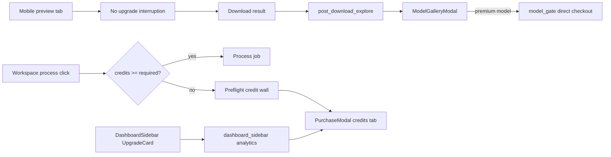
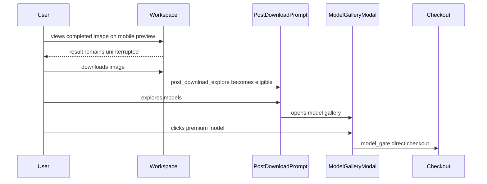
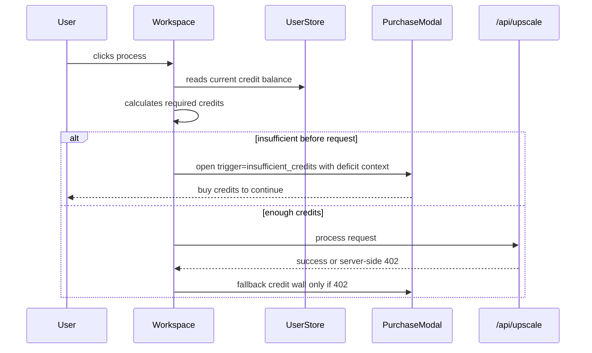

# PRD: Prompt CTR Optimization

**Date:** 2026-07-08
**Status:** Ready
**Complexity:** 5 -> MEDIUM mode
**Owner:** Conversion / Growth
**Source:** Prompt CTR deep dive, July 2026

---

## 0. Complexity Assessment

**Complexity: 5 -> MEDIUM mode**

- +2 touches 6-10 implementation files
- +2 user-facing state and prompt timing changes
- +1 API/analytics contract cleanup around credit-wall context

This is a MEDIUM PRD because it changes multiple prompt surfaces, checkout attribution, and credit-wall behavior, but it does not require new database tables, external integrations, or a new system from scratch.

---

## Integration Points Checklist

**How will this feature be reached?**

- [x] Entry points identified:
  - Mobile workspace preview tab after completed processing
  - Workspace processing flow when credits are insufficient
  - Dashboard sidebar upgrade card
  - Dashboard mobile header credits display
  - Workspace model gallery premium model gate
- [x] Caller files identified:
  - `client/components/features/workspace/Workspace.tsx`
  - `client/components/features/workspace/MobileUpgradePrompt.tsx`
  - `client/components/features/workspace/BatchSidebar/ActionPanel.tsx`
  - `client/components/dashboard/UpgradeCard.tsx`
  - `client/components/dashboard/DashboardSidebar.tsx`
  - `client/components/dashboard/DashboardLayout.tsx`
  - `client/components/stripe/PurchaseModal.tsx`
- [x] Registration/wiring needed:
  - Remove or disable the `MobileUpgradePrompt` render path from `Workspace.tsx`
  - Route single-image insufficient-credit states through an explicit preflight/wall instead of only reacting to API 402 errors
  - Align `UpgradeCard` analytics trigger with the surface that opens the modal
  - Preserve existing `model_gate` direct checkout wiring

**Is this user-facing?**

- [x] YES -> UI components required:
  - Workspace credit preflight warning
  - Insufficient-credit modal/copy in purchase flow
  - Sidebar upgrade card copy
  - Optional tests confirming mobile preview prompt no longer appears

**Full user flow:**

1. User completes an image on mobile and opens Preview.
2. Current behavior triggers `mobile_preview_prompt`; target behavior does not interrupt preview.
3. User downloads result or explores models through the existing post-download/model-gallery path.
4. Premium model clicks continue to use `model_gate` direct checkout.
5. If the user lacks credits before processing, the workspace shows required credits and deficit before the API call where possible.
6. If the server still returns 402, the upgrade prompt frames the purchase as instant continuation, with required credits and recommended pack context.

---

## 1. Context

**Problem:** Two low-intent triggers, `mobile_preview_prompt` and `insufficient_credits`, consume 37.5% of prompt impressions while producing only 20 clicks, pulling overall prompt CTR down to 4.5%.

**Files Analyzed:**

- `client/components/features/workspace/MobileUpgradePrompt.tsx`
- `client/components/features/workspace/Workspace.tsx`
- `client/components/features/workspace/BatchSidebar/ActionPanel.tsx`
- `client/components/features/workspace/ModelGalleryModal.tsx`
- `client/components/dashboard/UpgradeCard.tsx`
- `client/components/dashboard/DashboardSidebar.tsx`
- `client/components/dashboard/DashboardLayout.tsx`
- `client/components/stripe/CreditsDisplay.tsx`
- `client/components/stripe/InsufficientCreditsModal.tsx`
- `client/components/stripe/PurchaseModal.tsx`
- `client/utils/purchaseModalDefaults.ts`
- `app/api/upscale/route.ts`
- `app/api/credit-estimate/route.ts`
- `server/analytics/types.ts`
- `tests/unit/client/components/MobileUpgradePrompt.unit.spec.tsx`
- `client/components/features/workspace/__tests__/Workspace.test.tsx`

**Current Behavior:**

- `mobile_preview_prompt` is rendered in `Workspace.tsx` when `mobileTab === 'preview' && completedCount > 0`. It already uses direct checkout, so the current low CTR is primarily a placement problem, not a checkout-routing problem.
- `post_download_explore` already exists and is a better-timed discovery prompt after user value is delivered.
- `insufficient_credits` is currently triggered after queue items enter `ERROR` with an insufficient-credit message. The user experiences this as a failed processing attempt.
- Batch processing has a better pre-wall pattern in `BatchSidebar/ActionPanel.tsx`: it shows current balance, total cost, credit deficit, and a dedicated insufficient-credit modal before processing.
- `UpgradeCard` emits `trigger: 'upgrade_card'`, but `DashboardSidebar` opens `PurchaseModal` with `trigger="dashboard_sidebar"`. This causes clicks without matching shown counts and weakens trigger-level reporting.
- `model_gate` direct checkout is already implemented in `ModelGalleryModal.tsx` and `Workspace.tsx`; the task is to increase high-intent exposure without regressing that path.
- `/api/credit-estimate` exists, but it appears to use legacy `credits_balance` instead of the current `subscription_credits_balance + purchased_credits_balance` model. Treat it as suspect unless fixed and tested.

---

## 2. Solution

### 2.1 Approach

1. **Remove `mobile_preview_prompt` from the active workspace flow.** Do not show an upgrade prompt merely because a mobile user is viewing their result. Keep the user in task-completion mode.
2. **Route mobile monetization through existing post-value moments.** Preserve `post_download_explore` and `model_gate` as the mobile path: download/explore -> model gallery -> premium model -> direct checkout.
3. **Redesign insufficient-credit handling as a preflight, not only an error reaction.** Reuse the batch sidebar pattern for single-image/workspace processing: show current balance, required credits, and deficit before the user starts a job when the deficit is knowable.
4. **Improve purchase copy for credit-wall sessions.** Change the framing from “insufficient credits” to instant continuation: “You used your free credits - get 50 more instantly.”
5. **Clean up analytics trigger attribution.** Align sidebar card shown/clicked/modal triggers so CTR reports are trustworthy.
6. **Protect `model_gate`.** Keep direct checkout and add regression tests that premium model clicks still emit `model_gate` and open checkout directly.

### 2.2 Architecture Diagram

### 2.3 Key Decisions

- **Mobile preview:** remove the active prompt rather than changing copy. The trigger has 0.07% CTR and 76% dismiss rate despite already having direct checkout.
- **Credit preflight:** prefer local calculation from `QUALITY_TIER_CONFIG`/provider-aware model config where already available in workspace state. Only use `/api/credit-estimate` if Phase 2 fixes its legacy balance field and adds tests.
- **Purchase modal default:** keep `insufficient_credits` defaulting to the smallest credit pack, but make copy and analytics explicit about required credits and deficit.
- **Analytics:** do not add new trigger names for this PRD unless a genuinely new surface is introduced. The first target is cleaner measurement for existing triggers.
- **Cloudflare constraint:** no heavy server computation. Any credit preflight should be constant-time config lookup or one lightweight API call.

### 2.4 Data Changes

None. No schema changes are required.

---

## 3. Sequence Flow

### 3.1 Mobile Post-Value Path

### 3.2 Credit Preflight Path

---

## 4. Execution Phases

### Phase 1: Remove Mobile Preview Interruption - Mobile preview no longer shows a low-intent upgrade prompt

**Files (max 5):**

- `client/components/features/workspace/Workspace.tsx` - stop rendering `MobileUpgradePrompt` in the preview column.
- `client/components/features/workspace/MobileUpgradePrompt.tsx` - delete if no other live imports remain, or leave unused only if the implementation team explicitly wants a rollback path.
- `tests/unit/client/components/MobileUpgradePrompt.unit.spec.tsx` - delete or replace with a “not wired from workspace” regression test.
- `client/components/features/workspace/__tests__/Workspace.test.tsx` - update mocked `MobileUpgradePrompt` expectations and remove direct-checkout test for the preview prompt.
- `tests/unit/client/upgrade-prompts.unit.spec.tsx` - update expected trigger list/counts if it asserts `mobile_preview_prompt` shown behavior.

**Implementation:**

- [ ] Remove the `MobileUpgradePrompt` import and JSX block from `Workspace.tsx`.
- [ ] Ensure mobile preview still displays completed results and global errors normally.
- [ ] Keep `PostDownloadPrompt` unchanged so post-value exploration remains available.
- [ ] Remove tests asserting that mobile preview direct checkout opens.
- [ ] Add or update a workspace unit test: completed mobile preview does not render `mobile-upgrade-prompt`.

**Tests Required:**

| Test File                                                           | Test Name                                                                | Assertion                                                        |
| ------------------------------------------------------------------- | ------------------------------------------------------------------------ | ---------------------------------------------------------------- |
| `client/components/features/workspace/__tests__/Workspace.test.tsx` | `should not show mobile preview upgrade prompt after a completed result` | `screen.queryByTestId('mobile-upgrade-prompt')` is null          |
| `tests/unit/client/upgrade-prompts.unit.spec.tsx`                   | `should not count mobile_preview_prompt as an active shown prompt`       | active prompt table excludes preview prompt or marks it disabled |

**User Verification:**

- Action: On a mobile viewport, process one image and open the Preview tab.
- Expected: The result is visible with no upgrade prompt inserted above it.

**Checkpoint:**

- Run affected tests: `yarn test:unit client/components/features/workspace/__tests__/Workspace.test.tsx tests/unit/client/upgrade-prompts.unit.spec.tsx`
- Run `yarn verify`
- Automated checkpoint reviewer: `Review checkpoint for phase 1 of PRD at docs/PRDs/prompt-ctr-optimization.md`

---

### Phase 2: Credit Preflight and Credit-Wall Copy - Users see the deficit before hitting a failed job

**Files (max 5):**

- `client/components/features/workspace/Workspace.tsx` - calculate required credits before process and open credit wall before starting when balance is insufficient.
- `client/components/features/workspace/BatchSidebar/ActionPanel.tsx` - extract or mirror the deficit copy pattern if needed.
- `client/components/stripe/InsufficientCreditsModal.tsx` - update title/body/CTA copy to instant-continuation framing.
- `client/components/stripe/PurchaseModal.tsx` - include required/deficit context for `insufficient_credits` sessions where available.
- `client/utils/purchaseModalDefaults.ts` - keep smallest credit pack default and add tests for `insufficient_credits`.

**Implementation:**

- [ ] Add a small helper near workspace processing to derive required credits from the selected quality tier and scale using existing config.
- [ ] Read current credits via `useCredits()` or existing user store state already available in workspace.
- [ ] Before calling `processBatch(config)`, if `requiredCredits > currentBalance`, open the credit wall with `trigger='insufficient_credits'` and do not start processing.
- [ ] Preserve the server 402 fallback because balances can become stale or provider-aware pricing can differ.
- [ ] Update insufficient-credit copy to outcome framing:
  - Title: `Keep enhancing instantly`
  - Body: `You used your free credits. Get 50 more now and continue this upscale.`
  - CTA: `Get credits`
- [ ] Avoid hardcoded prices in copy. Use existing credit pack data when showing pack sizes/prices.

**Tests Required:**

| Test File                                                            | Test Name                                                                          | Assertion                                                                                    |
| -------------------------------------------------------------------- | ---------------------------------------------------------------------------------- | -------------------------------------------------------------------------------------------- |
| `client/components/features/workspace/__tests__/Workspace.test.tsx`  | `should open insufficient_credits modal before processing when balance is too low` | `processBatch` is not called and `PurchaseModal` opens with `trigger='insufficient_credits'` |
| `client/components/features/workspace/__tests__/Workspace.test.tsx`  | `should still process when balance covers selected model cost`                     | `processBatch(config)` is called                                                             |
| `tests/unit/client/utils/purchaseModalDefaults.unit.spec.ts`         | `should default insufficient_credits to the starter credit pack`                   | `purchaseMode === 'credits'` and selected pack key is `small`                                |
| `tests/unit/client/components/PurchaseModal.analytics.unit.spec.tsx` | `should include outOfCredits context when insufficient_credits prompt is shown`    | `upgrade_prompt_shown` includes `trigger` and `outOfCredits`                                 |

**User Verification:**

- Action: Set a free account to 0 credits, choose a paid model, and click process.
- Expected: Processing does not start; the credit wall explains how many credits are needed and offers credits without presenting the job as a failed attempt.

**Checkpoint:**

- Run affected tests: `yarn test:unit client/components/features/workspace/__tests__/Workspace.test.tsx tests/unit/client/utils/purchaseModalDefaults.unit.spec.ts tests/unit/client/components/PurchaseModal.analytics.unit.spec.tsx`
- Run `yarn verify`
- Automated checkpoint reviewer: `Review checkpoint for phase 2 of PRD at docs/PRDs/prompt-ctr-optimization.md`

---

### Phase 3: Sidebar Trigger Attribution Cleanup - Dashboard sidebar reports shown/clicked under one trigger

**Files (max 5):**

- `client/components/dashboard/UpgradeCard.tsx` - accept a `trigger` prop and use it for clicked analytics.
- `client/components/dashboard/DashboardSidebar.tsx` - pass `trigger="dashboard_sidebar"` into `UpgradeCard`.
- `client/components/dashboard/DashboardLayout.tsx` - ensure credits-display modal uses `dashboard_layout` consistently.
- `tests/unit/client/upgrade-prompts.unit.spec.tsx` - update assertions around sidebar triggers.
- `server/analytics/types.ts` - update trigger union only if existing types do not already permit the aligned trigger.

**Implementation:**

- [ ] Add `trigger?: TUpgradePromptTrigger` or local typed string prop to `UpgradeCard`, defaulting to `upgrade_card` for backward compatibility.
- [ ] In `DashboardSidebar`, render `<UpgradeCard trigger="dashboard_sidebar" ... />`.
- [ ] Ensure the modal opened from that same click also receives `trigger="dashboard_sidebar"`.
- [ ] Decide whether `upgrade_card` should remain as a standalone trigger. If no live surface uses it after this change, mark it deprecated in tests/docs rather than deleting immediately.
- [ ] Add shown-event tracking if `UpgradeCard` is the actual impression source and current reports depend on `PurchaseModal` shown events.

**Tests Required:**

| Test File                                         | Test Name                                                                    | Assertion                                        |
| ------------------------------------------------- | ---------------------------------------------------------------------------- | ------------------------------------------------ |
| `tests/unit/client/upgrade-prompts.unit.spec.tsx` | `should track dashboard sidebar card clicks with dashboard_sidebar trigger`  | clicked event has `trigger: 'dashboard_sidebar'` |
| `tests/unit/client/upgrade-prompts.unit.spec.tsx` | `should keep upgrade_card fallback trigger when no trigger prop is supplied` | clicked event has `trigger: 'upgrade_card'`      |

**User Verification:**

- Action: Click the dashboard sidebar upgrade card.
- Expected: Purchase modal opens as before; analytics clicked and shown events use one consistent trigger.

**Checkpoint:**

- Run affected tests: `yarn test:unit tests/unit/client/upgrade-prompts.unit.spec.tsx`
- Run `yarn verify`
- Automated checkpoint reviewer: `Review checkpoint for phase 3 of PRD at docs/PRDs/prompt-ctr-optimization.md`

---

### Phase 4: Protect and Expand Intent-Gated Conversion - Premium model gates remain the primary purchase path

**Files (max 5):**

- `client/components/features/workspace/ModelGalleryModal.tsx` - verify all premium tiers use the same direct `model_gate` path.
- `client/components/features/workspace/Workspace.tsx` - keep `handleUpgradeDirect` source attribution correct.
- `tests/unit/client/components/ModelGalleryModal.upgrade-direct.unit.spec.tsx` - add coverage for each locked premium model category.
- `tests/unit/client/upgrade-funnel-analytics.unit.spec.tsx` - assert `model_gate` clicked events retain `originatingModel`/pricing context.
- `tests/e2e/upgrade-funnel-post-auth-redirect.e2e.spec.ts` - ensure unauthenticated model gate still resumes checkout after auth.

**Implementation:**

- [ ] Audit `QUALITY_TIER_CONFIG` and `ModelGalleryModal` lock conditions to confirm every premium model card calls `onUpgradeDirect({ trigger: 'model_gate', planId })` for free users.
- [ ] Confirm paid-credit users still bypass upgrade copy and can select premium models.
- [ ] Confirm `post_download_explore -> model_gate` attribution still works after removing mobile preview prompt.
- [ ] Add tests for any premium model family not currently covered by direct-checkout tests.

**Tests Required:**

| Test File                                                                     | Test Name                                                                    | Assertion                                               |
| ----------------------------------------------------------------------------- | ---------------------------------------------------------------------------- | ------------------------------------------------------- |
| `tests/unit/client/components/ModelGalleryModal.upgrade-direct.unit.spec.tsx` | `should route every locked premium model through model_gate direct checkout` | `onUpgradeDirect` receives `trigger: 'model_gate'`      |
| `tests/unit/client/upgrade-funnel-analytics.unit.spec.tsx`                    | `should include originating model context for model_gate clicks`             | analytics payload includes `trigger` and model metadata |
| `tests/e2e/upgrade-funnel-post-auth-redirect.e2e.spec.ts`                     | `should resume checkout after auth for model_gate`                           | checkout opens with preserved price and trigger         |

**User Verification:**

- Action: As a free user, open model gallery from workspace and click each locked premium tier.
- Expected: Each click opens direct checkout with `model_gate` attribution; no premium card silently opens a generic modal.

**Checkpoint:**

- Run affected tests: `yarn test:unit tests/unit/client/components/ModelGalleryModal.upgrade-direct.unit.spec.tsx tests/unit/client/upgrade-funnel-analytics.unit.spec.tsx`
- Run targeted e2e: `yarn test:e2e tests/e2e/upgrade-funnel-post-auth-redirect.e2e.spec.ts`
- Run `yarn verify`
- Automated checkpoint reviewer: `Review checkpoint for phase 4 of PRD at docs/PRDs/prompt-ctr-optimization.md`

---

## 5. Verification Strategy

**Required commands before completion:**

- `yarn test:unit client/components/features/workspace/__tests__/Workspace.test.tsx`
- `yarn test:unit tests/unit/client/upgrade-prompts.unit.spec.tsx`
- `yarn test:unit tests/unit/client/utils/purchaseModalDefaults.unit.spec.ts`
- `yarn test:unit tests/unit/client/components/PurchaseModal.analytics.unit.spec.tsx`
- `yarn test:unit tests/unit/client/components/ModelGalleryModal.upgrade-direct.unit.spec.tsx`
- `yarn verify`

**Manual verification:**

- Mobile viewport: completed preview shows no `mobile_preview_prompt`.
- Mobile post-download: user can still explore models and reach `model_gate`.
- Zero-credit account: processing click opens a preflight credit wall instead of starting a doomed job.
- Dashboard sidebar: modal behavior unchanged, analytics trigger consistent.

**Production monitoring after deploy:**

- `mobile_preview_prompt` shown volume should drop to zero or near-zero.
- Overall prompt CTR should rise toward 6% immediately from impression-mix cleanup.
- `insufficient_credits` CTR should rise from 1.2% toward 3-4% after preflight/copy changes.
- `model_gate` shown volume and CTR should remain healthy. Any CTR drop below 10% is a regression signal.
- `upgrade_card` should either disappear from active reports or have matching shown/clicked counts if retained.

---

## 6. Risks and Mitigations

- **Risk:** Removing `mobile_preview_prompt` reduces a small number of purchases from that path.
  - **Mitigation:** The path produced only 2 clicks from 3,041 impressions. Monitor assisted conversion through `post_download_explore` and `model_gate`.

- **Risk:** Local credit preflight miscalculates provider-aware credit cost.
  - **Mitigation:** Keep server-side 402 fallback. Prefer existing pricing helpers over duplicated math. Add tests for variable-credit tiers.

- **Risk:** Trigger cleanup breaks historical dashboards expecting `upgrade_card`.
  - **Mitigation:** Deprecate gradually. Keep type support unless no downstream dashboard depends on it.

- **Risk:** Purchase modal copy changes affect all out-of-credit paths.
  - **Mitigation:** Scope copy by `trigger === 'insufficient_credits' || outOfCredits`. Preserve generic purchase modal copy elsewhere.

---

## 7. Acceptance Criteria

- [ ] `mobile_preview_prompt` is no longer shown from the mobile preview tab.
- [ ] `post_download_explore` and `model_gate` flows still work on mobile and desktop.
- [ ] Single-image/workspace processing shows an insufficient-credit preflight when balance is known to be too low.
- [ ] Server 402 insufficient-credit fallback still opens a purchase path.
- [ ] `insufficient_credits` copy frames purchase as instant continuation and uses credit-pack data rather than hardcoded prices.
- [ ] Dashboard sidebar shown/clicked/modal analytics use a consistent trigger.
- [ ] All phase tests pass.
- [ ] `yarn verify` passes.
- [ ] Automated checkpoint reviews pass after each implementation phase.

---

## 8. Out of Scope

- New pricing plans or credit packs.
- New database schema.
- Email or push recovery campaigns.
- SEO changes.
- Redesigning the full purchase modal.
- Changing Stripe checkout provider behavior.

---

## 9. Implementation Notes

- Do not use `process.env` directly. Use `clientEnv` or `serverEnv` from `@shared/config/env`.
- Do not hardcode colors. Use existing Tailwind tokens.
- Keep changes surgical. The goal is impression-mix and credit-wall quality, not a full conversion-system rewrite.
- Treat `/api/credit-estimate` as legacy until its balance model is verified. If implementation chooses to use it, first update it to read current credit balances and add tests.
