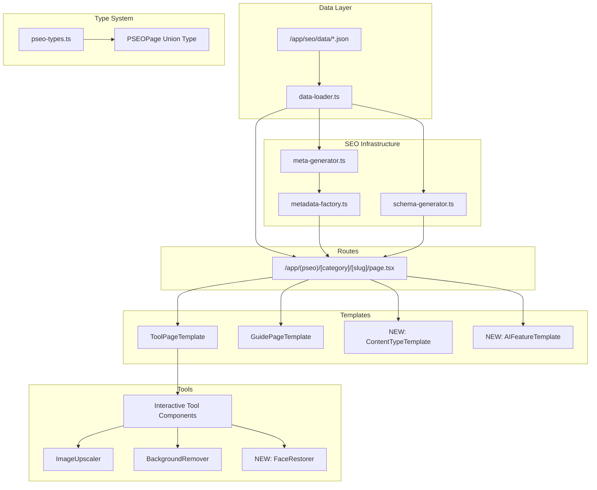
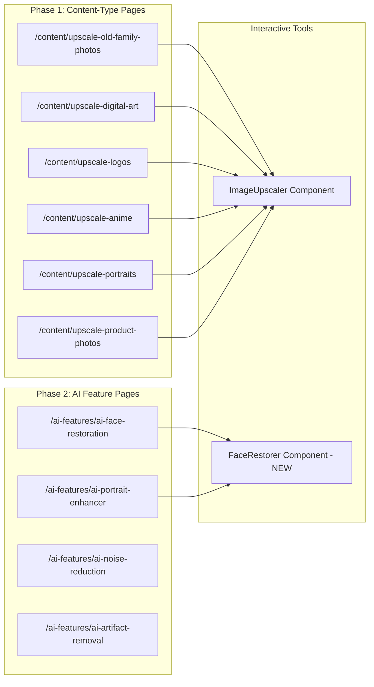
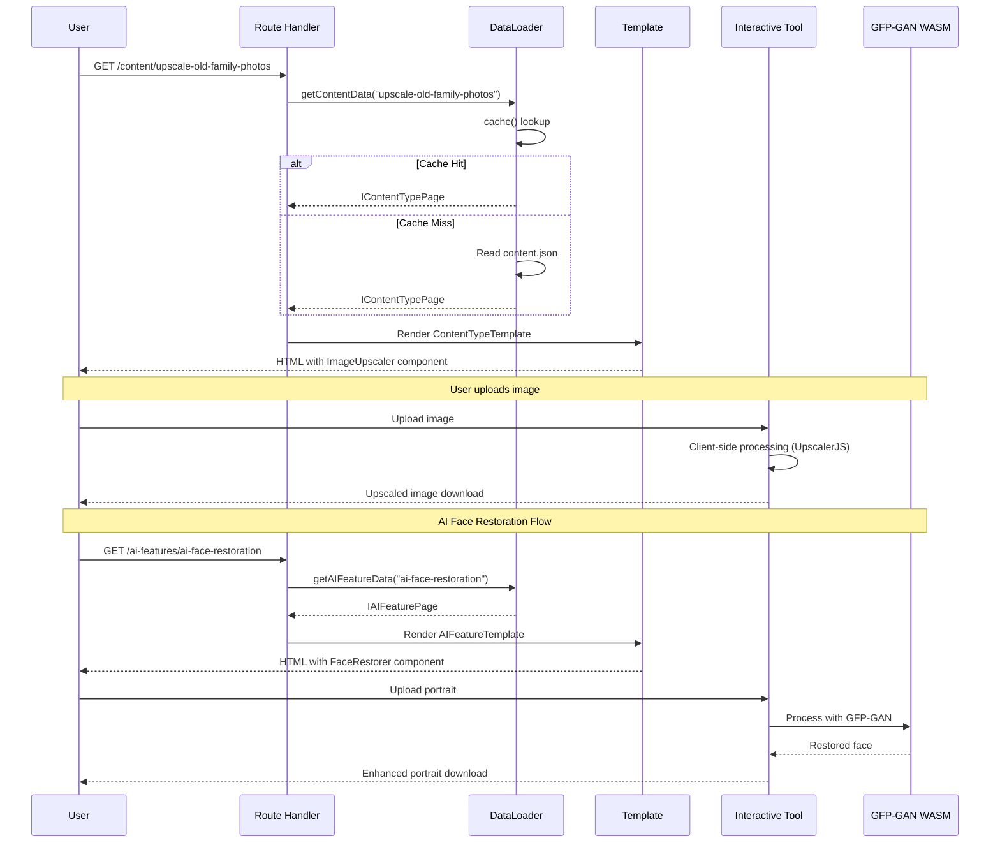

# pSEO Content-Type Upscaling & AI Features Expansion Plan

**Status:** Planning
**Created:** January 6, 2026
**Priority:** P0 - High Impact, Strategic Opportunity

---

## 1. Context Analysis

### 1.1 Files Analyzed

```
/app/seo/data/*.json (23 data files)
/lib/seo/pseo-types.ts
/app/(pseo)/**/* (all pSEO routes)
/lib/seo/data-loader.ts
/lib/seo/meta-generator.ts
/lib/seo/url-utils.ts
/lib/seo/schema-generator.ts
/docs/seo/COMPETITOR_INTELLIGENCE_REPORT.md
/docs/SEO/keywords.csv
```

### 1.2 Component & Dependency Overview



### 1.3 Current Behavior Summary

- **188 pSEO pages** across 22 categories
- Strong coverage: alternatives (41 pages), comparisons (41 pages), tools (10 pages)
- **Critical Gaps Identified:**
  - No content-type specific pages (family photos, digital art, logos)
  - No AI feature pages (face restoration, portrait enhancement)
  - Limited platform pages (only 5, competitors have 15+)
  - No profession-specific headshot pages

### 1.4 Problem Statement

MyImageUpscaler lacks **content-type specific pSEO pages** that competitors are ranking for (45,000+ monthly searches), and is missing the growing **AI face restoration/enhancement** market segment represented by UpscalerJS and GFP-GAN capabilities.

---

## 2. Proposed Solution

### 2.1 Architecture Summary

**Two-Phase Approach:**

1. **Phase 1: Content-Type Pages** (Quick Win)
   - New category: `/content/[slug]`
   - Pages: old-family-photos, digital-art, logos, portraits, anime, product-photos
   - Reuses existing `IToolPage` pattern with content-specific data
   - **Est. Traffic:** 25,000+ monthly searches

2. **Phase 2: AI Feature Pages** (Strategic)
   - New category: `/ai-features/[slug]`
   - Pages: face-restoration, portrait-enhancer, noise-reduction, artifact-removal
   - New interactive tool component: `FaceRestorer` (GFP-GAN via WASM)
   - **Est. Traffic:** 18,000+ monthly searches

**Alternative Approaches Rejected:**
- ❌ Adding to existing `/tools/` category: Would dilute tool focus, harder to target specific keywords
- ❌ Blog posts only: Missing pSEO benefits (structured data, direct tool CTA, consistent template)
- ❌ Single mega-page: Loses long-tail keyword opportunities

### 2.2 Architecture Diagram



### 2.3 Key Technical Decisions

| Decision | Choice | Justification |
|----------|--------|---------------|
| **New Categories vs Existing** | New `/content/` and `/ai-features/` | Cleaner URLs, better keyword targeting, easier sitemap management |
| **Template Approach** | Extend `IToolPage` for content, new `IAIFeaturePage` for AI | Content pages are upscaler variations; AI features need unique fields |
| **Interactive Tools** | Reuse `ImageUpscaler` for content; new `FaceRestorer` for AI | Leverage existing tool; face restoration needs GFP-GAN integration |
| **Data File Structure** | Separate JSON per category | Consistent with existing pattern, easier maintenance |
| **Schema Markup** | `SoftwareApplication` + `HowTo` | Matches competitor rich snippets, aligns with existing patterns |

### 2.4 Data Model Changes

**New Type: `IContentTypePage`** (extends IToolPage pattern)
```typescript
export interface IContentTypePage extends IBasePSEOPage {
  category: 'content';
  contentType: string; // "family-photos" | "digital-art" | "logos" | etc.
  contentDescription: string;
  targetAudience: string[];
  commonChallenges: string[];
  features: IFeature[];
  useCases: IUseCase[];
  benefits: IBenefit[];
  howItWorks: IHowItWorksStep[];
  beforeAfterExamples?: IBeforeAfterExample[];
  tips: string[];
  faq: IFAQ[];
  relatedContent: string[];
  relatedTools: string[];
  ctaText: string;
  ctaUrl: string;
}
```

**New Type: `IAIFeaturePage`**
```typescript
export interface IAIFeaturePage extends IBasePSEOPage {
  category: 'ai-features';
  featureName: string;
  featureType: 'enhancement' | 'restoration' | 'correction' | 'generation';
  technology: string; // "GFP-GAN" | "ESRGAN" | "UpscalerJS" | etc.
  description: string;
  capabilities: string[];
  features: IFeature[];
  useCases: IUseCase[];
  benefits: IBenefit[];
  howItWorks: IHowItWorksStep[];
  limitations: string[];
  isInteractive?: boolean;
  toolComponent?: string;
  faq: IFAQ[];
  relatedFeatures: string[];
  relatedTools: string[];
  ctaText: string;
  ctaUrl: string;
}
```

**New Interface: `IBeforeAfterExample`**
```typescript
export interface IBeforeAfterExample {
  title: string;
  description: string;
  beforeImage?: string;
  afterImage?: string;
  improvement: string;
}
```

---

## 2.5 Runtime Execution Flow



---

## 3. Detailed Implementation Spec

### A. `/lib/seo/pseo-types.ts`

**Changes Needed:**
- Add `IContentTypePage` interface
- Add `IAIFeaturePage` interface
- Add `IBeforeAfterExample` interface
- Extend `PSEOPage` union type
- Extend `PSEOCategory` in url-utils.ts

**New Code:**

```typescript
// After line 216 (after IPlatformPage)

/**
 * Content-type specific upscaling page
 * For pages like /content/upscale-old-family-photos, /content/upscale-digital-art
 */
export interface IContentTypePage extends IBasePSEOPage {
  category: 'content';
  contentType: string;
  contentDescription: string;
  targetAudience: string[];
  commonChallenges: string[];
  features: IFeature[];
  useCases: IUseCase[];
  benefits: IBenefit[];
  howItWorks: IHowItWorksStep[];
  beforeAfterExamples?: IBeforeAfterExample[];
  tips: string[];
  faq: IFAQ[];
  relatedContent: string[];
  relatedTools: string[];
  ctaText: string;
  ctaUrl: string;
}

/**
 * AI Feature page data structure
 * For pages like /ai-features/ai-face-restoration, /ai-features/ai-portrait-enhancer
 */
export interface IAIFeaturePage extends IBasePSEOPage {
  category: 'ai-features';
  featureName: string;
  featureType: 'enhancement' | 'restoration' | 'correction' | 'generation';
  technology: string;
  description: string;
  capabilities: string[];
  features: IFeature[];
  useCases: IUseCase[];
  benefits: IBenefit[];
  howItWorks: IHowItWorksStep[];
  limitations: string[];
  isInteractive?: boolean;
  toolComponent?: string;
  faq: IFAQ[];
  relatedFeatures: string[];
  relatedTools: string[];
  ctaText: string;
  ctaUrl: string;
}

export interface IBeforeAfterExample {
  title: string;
  description: string;
  beforeImage?: string;
  afterImage?: string;
  improvement: string;
}
```

**Update PSEOPage union (line 221):**
```typescript
export type PSEOPage =
  | IToolPage
  | IFormatPage
  | IScalePage
  | IUseCasePage
  | IComparisonPage
  | IAlternativePage
  | IGuidePage
  | IFreePage
  | IBulkToolPage
  | IPlatformPage
  | IContentTypePage   // NEW
  | IAIFeaturePage;    // NEW
```

**Justification:** Extends existing type system without breaking changes. New interfaces follow established patterns.

---

### B. `/lib/seo/url-utils.ts`

**Changes Needed:**
- Add 'content' and 'ai-features' to `PSEO_CATEGORIES`

**Pseudo-code:**
```typescript
export const PSEO_CATEGORIES = [
  'tools',
  'formats',
  'scale',
  'use-cases',
  'compare',
  'alternatives',
  'guides',
  'free',
  'bulk-tools',
  'platforms',
  'content',        // NEW
  'ai-features',    // NEW
] as const;
```

---

### C. `/lib/seo/data-loader.ts`

**Changes Needed:**
- Add data loaders for content and ai-features categories

**New Functions:**
```typescript
// Content type pages
export const getAllContentSlugs = cache(async (): Promise<string[]> => {
  const data = await import('@/app/seo/data/content.json');
  return data.pages.map((page: IContentTypePage) => page.slug);
});

export const getContentData = cache(async (slug: string): Promise<IContentTypePage | null> => {
  const data = await import('@/app/seo/data/content.json');
  return data.pages.find((page: IContentTypePage) => page.slug === slug) || null;
});

export const getAllContentPages = cache(async (): Promise<IContentTypePage[]> => {
  const data = await import('@/app/seo/data/content.json');
  return data.pages;
});

// AI Feature pages
export const getAllAIFeatureSlugs = cache(async (): Promise<string[]> => {
  const data = await import('@/app/seo/data/ai-features.json');
  return data.pages.map((page: IAIFeaturePage) => page.slug);
});

export const getAIFeatureData = cache(async (slug: string): Promise<IAIFeaturePage | null> => {
  const data = await import('@/app/seo/data/ai-features.json');
  return data.pages.find((page: IAIFeaturePage) => page.slug === slug) || null;
});

export const getAllAIFeaturePages = cache(async (): Promise<IAIFeaturePage[]> => {
  const data = await import('@/app/seo/data/ai-features.json');
  return data.pages;
});
```

**Update `getAllPSEOPages()` to include new categories.**

---

### D. `/lib/seo/meta-generator.ts`

**Changes Needed:**
- Add meta patterns for new categories

**New Patterns:**
```typescript
content: {
  title: "Upscale {{ContentType}} - AI Enhancement Free | MyImageUpscaler",
  description: "Upscale and enhance {{contentType}} with AI. Improve quality, restore details, and get professional results. Free online tool.",
  titleMaxLength: 60,
  descriptionMaxLength: 160,
},
'ai-features': {
  title: "{{FeatureName}} - AI-Powered {{FeatureType}} | MyImageUpscaler",
  description: "{{FeatureName}} using advanced AI technology. {{Description}}. Free online tool with instant results.",
  titleMaxLength: 60,
  descriptionMaxLength: 160,
},
```

---

### E. `/app/seo/data/content.json` (NEW FILE)

**Structure:**
```json
{
  "category": "content",
  "pages": [
    {
      "slug": "upscale-old-family-photos",
      "title": "Upscale Old Family Photos",
      "metaTitle": "Upscale Old Family Photos - AI Photo Restoration Free | MyImageUpscaler",
      "metaDescription": "Restore and upscale old family photos with AI. Enhance vintage photos, fix blur, and preserve memories in high resolution. Free online tool.",
      "h1": "Upscale Old Family Photos with AI",
      "intro": "Preserve your family memories by upscaling old, low-resolution photos to stunning quality. Our AI technology enhances vintage photos while maintaining their authentic character.",
      "primaryKeyword": "upscale old family photos",
      "secondaryKeywords": ["restore old photos", "enhance vintage photos", "family photo restoration", "old photo upscaler"],
      "lastUpdated": "2026-01-06T00:00:00Z",
      "category": "content",
      "contentType": "family-photos",
      "contentDescription": "Vintage and legacy family photographs that need enhancement",
      "targetAudience": ["Family historians", "Genealogy enthusiasts", "Parents and grandparents", "Photo archivists"],
      "commonChallenges": [
        "Low resolution from old cameras or scans",
        "Faded colors from age",
        "Scratches and damage",
        "Small original print sizes"
      ],
      "features": [...],
      "useCases": [...],
      "benefits": [...],
      "howItWorks": [...],
      "tips": [...],
      "faq": [...],
      "relatedContent": ["upscale-portraits", "upscale-vintage-photos"],
      "relatedTools": ["ai-image-upscaler", "photo-restoration"],
      "ctaText": "Upscale Your Family Photos Free",
      "ctaUrl": "/upscaler"
    },
    // ... more pages
  ],
  "meta": {
    "totalPages": 8,
    "lastUpdated": "2026-01-06T00:00:00Z"
  }
}
```

---

### F. `/app/seo/data/ai-features.json` (NEW FILE)

**Structure:**
```json
{
  "category": "ai-features",
  "pages": [
    {
      "slug": "ai-face-restoration",
      "title": "AI Face Restoration",
      "metaTitle": "AI Face Restoration - Fix Blurry Faces Free | MyImageUpscaler",
      "metaDescription": "Restore blurry faces in photos with AI. Fix pixelated portraits, enhance facial details, and recover damaged face photos. Free online tool powered by GFP-GAN.",
      "h1": "AI Face Restoration - Fix Blurry Faces Instantly",
      "intro": "Restore and enhance faces in your photos using advanced AI technology. Our GFP-GAN powered tool fixes blurry portraits, enhances facial details, and brings clarity to damaged face photos.",
      "primaryKeyword": "ai face restoration",
      "secondaryKeywords": ["fix blurry faces", "restore face in photo", "face enhancement AI", "portrait restoration"],
      "lastUpdated": "2026-01-06T00:00:00Z",
      "category": "ai-features",
      "featureName": "AI Face Restoration",
      "featureType": "restoration",
      "technology": "GFP-GAN",
      "description": "Restore and enhance faces in photos using GFP-GAN neural network technology",
      "capabilities": [
        "Restore blurry and pixelated faces",
        "Enhance facial details and features",
        "Fix compression artifacts on faces",
        "Improve low-resolution portraits"
      ],
      "features": [...],
      "useCases": [...],
      "benefits": [...],
      "howItWorks": [...],
      "limitations": [
        "Works best on frontal face photos",
        "May not restore extremely damaged photos",
        "Processing time depends on image size"
      ],
      "isInteractive": true,
      "toolComponent": "FaceRestorer",
      "faq": [...],
      "relatedFeatures": ["ai-portrait-enhancer", "ai-noise-reduction"],
      "relatedTools": ["ai-image-upscaler"],
      "ctaText": "Try AI Face Restoration Free",
      "ctaUrl": "/tools/ai-face-restoration"
    },
    // ... more pages
  ],
  "meta": {
    "totalPages": 6,
    "lastUpdated": "2026-01-06T00:00:00Z"
  }
}
```

---

### G. `/app/(pseo)/content/[slug]/page.tsx` (NEW ROUTE)

**Structure:**
```typescript
import { Metadata } from 'next';
import { notFound } from 'next/navigation';
import { getAllContentSlugs, getContentData } from '@/lib/seo/data-loader';
import { generatePageMetadata } from '@/lib/seo/metadata-factory';
import { generateContentSchema } from '@/lib/seo/schema-generator';
import { ContentTypeTemplate } from '../../_components/pseo/templates/ContentTypeTemplate';
import { SchemaMarkup } from '../../_components/schema-markup';

export async function generateStaticParams() {
  const slugs = await getAllContentSlugs();
  return slugs.map((slug) => ({ slug }));
}

export async function generateMetadata({ params }: { params: Promise<{ slug: string }> }): Promise<Metadata> {
  const { slug } = await params;
  const data = await getContentData(slug);
  if (!data) return {};
  return generatePageMetadata(data, 'content');
}

export default async function ContentTypePage({ params }: { params: Promise<{ slug: string }> }) {
  const { slug } = await params;
  const data = await getContentData(slug);
  if (!data) notFound();

  const schema = generateContentSchema(data);

  return (
    <>
      <SchemaMarkup schema={schema} />
      <ContentTypeTemplate data={data} />
    </>
  );
}
```

---

### H. `/app/(pseo)/ai-features/[slug]/page.tsx` (NEW ROUTE)

**Similar structure to content route, using AIFeatureTemplate.**

---

### I. Templates (NEW)

**`/app/(pseo)/_components/pseo/templates/ContentTypeTemplate.tsx`**
- Hero section with content type badge
- Common challenges section
- Target audience section
- Features, benefits, how it works (reuse existing sections)
- Before/after examples section
- Tips section
- FAQ section
- CTA with ImageUpscaler component

**`/app/(pseo)/_components/pseo/templates/AIFeatureTemplate.tsx`**
- Hero section with AI technology badge
- Capabilities section
- Features, benefits, how it works
- Limitations section (transparent about what AI can/can't do)
- Interactive tool section (FaceRestorer)
- FAQ section
- CTA

---

## 4. Step-by-Step Execution Plan

### Phase 1: Foundation (Can be parallelized)

#### 1A. Type System Updates
- [ ] Add `IContentTypePage` interface to `/lib/seo/pseo-types.ts`
- [ ] Add `IAIFeaturePage` interface to `/lib/seo/pseo-types.ts`
- [ ] Add `IBeforeAfterExample` interface
- [ ] Update `PSEOPage` union type
- [ ] Add 'content' and 'ai-features' to `PSEO_CATEGORIES` in `/lib/seo/url-utils.ts`

#### 1B. Data Infrastructure
- [ ] Add data loaders for content category in `/lib/seo/data-loader.ts`
- [ ] Add data loaders for ai-features category
- [ ] Update `getAllPSEOPages()` to include new categories
- [ ] Add meta patterns to `/lib/seo/meta-generator.ts`

### Phase 2: Content-Type Pages (Priority)

#### 2A. Data Files
- [ ] Create `/app/seo/data/content.json` with 8 pages:
  - `upscale-old-family-photos`
  - `upscale-digital-art`
  - `upscale-logos`
  - `upscale-anime`
  - `upscale-portraits`
  - `upscale-product-photos`
  - `upscale-screenshots`
  - `upscale-vintage-photos`

#### 2B. Routes & Templates
- [ ] Create `/app/(pseo)/content/[slug]/page.tsx`
- [ ] Create `/app/(pseo)/content/page.tsx` (hub page)
- [ ] Create `ContentTypeTemplate.tsx`
- [ ] Add schema generator for content pages

#### 2C. Sitemaps
- [ ] Create `/app/sitemap-content.xml/route.ts`
- [ ] Update main sitemap index

### Phase 3: AI Feature Pages

#### 3A. Data Files
- [ ] Create `/app/seo/data/ai-features.json` with 6 pages:
  - `ai-face-restoration`
  - `ai-portrait-enhancer`
  - `ai-noise-reduction`
  - `ai-artifact-removal`
  - `ai-color-correction`
  - `ai-detail-enhancement`

#### 3B. Routes & Templates
- [ ] Create `/app/(pseo)/ai-features/[slug]/page.tsx`
- [ ] Create `/app/(pseo)/ai-features/page.tsx` (hub page)
- [ ] Create `AIFeatureTemplate.tsx`
- [ ] Add schema generator for AI feature pages

#### 3C. Interactive Tool (FaceRestorer)
- [ ] Research GFP-GAN WASM implementation
- [ ] Create `/app/(pseo)/_components/tools/FaceRestorer.tsx`
- [ ] Integrate with AI feature pages

#### 3D. Sitemaps
- [ ] Create `/app/sitemap-ai-features.xml/route.ts`
- [ ] Update main sitemap index

### Phase 4: Verification & Launch

- [ ] Run `yarn verify` to check all routes
- [ ] Test all new pages in development
- [ ] Validate SEO meta tags
- [ ] Test interactive tools
- [ ] Submit new sitemaps to Google Search Console
- [ ] Monitor indexing progress

---

## 5. Testing Strategy

### Unit Tests

- [ ] Test data loaders return correct types
- [ ] Test slug generation for new categories
- [ ] Test meta generation patterns

### Integration Tests

- [ ] Test route generation for all new pages
- [ ] Test template rendering with sample data
- [ ] Test interactive tool functionality

### Edge Cases

| Scenario | Expected Behavior |
|----------|-------------------|
| Missing content data | Return 404 via `notFound()` |
| Invalid slug format | Return 404 |
| Empty FAQ array | Render page without FAQ section |
| Missing optional fields | Graceful fallback to defaults |

---

## 6. Acceptance Criteria

- [ ] All 8 content-type pages render correctly
- [ ] All 6 AI feature pages render correctly
- [ ] Sitemaps include all new pages
- [ ] Meta titles/descriptions pass validation (length, keywords)
- [ ] Schema markup validates in Google Rich Results Test
- [ ] Interactive tools work in all modern browsers
- [ ] Pages score 90+ on Lighthouse performance
- [ ] `yarn verify` passes with no errors
- [ ] Pages appear in Google Search Console within 7 days

---

## 7. Verification & Rollback

### Success Criteria

- **Indexing:** 80% of new pages indexed within 30 days
- **Rankings:** Target keywords in top 50 within 60 days
- **Traffic:** 5,000+ monthly visitors from new pages within 90 days

### Monitoring

- Google Search Console: Coverage, Performance reports
- Lighthouse: Weekly performance audits
- Keyword tracking: Ahrefs/SEMrush for target keywords

### Rollback Plan

1. If pages cause errors: Revert JSON data files
2. If SEO issues: Add `noindex` meta tag, investigate
3. If interactive tool fails: Disable `isInteractive`, serve static pages

---

## 8. Content Pages Detail

### 8.1 Content-Type Page List

| Slug | Primary Keyword | Monthly Searches | Competition |
|------|-----------------|------------------|-------------|
| `upscale-old-family-photos` | "upscale old photos" | 5,400 | Low |
| `upscale-digital-art` | "upscale digital art" | 3,200 | Medium |
| `upscale-logos` | "upscale logo" | 2,900 | Low |
| `upscale-anime` | "upscale anime" | 8,100 | Medium |
| `upscale-portraits` | "upscale portrait" | 1,900 | Low |
| `upscale-product-photos` | "upscale product photos" | 1,300 | Low |
| `upscale-screenshots` | "upscale screenshot" | 2,400 | Low |
| `upscale-vintage-photos` | "upscale vintage photos" | 1,800 | Low |

**Total Est. Monthly Traffic:** 27,000+

### 8.2 AI Feature Page List

| Slug | Primary Keyword | Monthly Searches | Competition |
|------|-----------------|------------------|-------------|
| `ai-face-restoration` | "ai face restoration" | 4,400 | Medium |
| `ai-portrait-enhancer` | "ai portrait enhancer" | 2,200 | Medium |
| `ai-noise-reduction` | "ai noise reduction" | 3,600 | Medium |
| `ai-artifact-removal` | "remove jpeg artifacts" | 2,900 | Low |
| `ai-color-correction` | "ai color correction" | 1,800 | Medium |
| `ai-detail-enhancement` | "ai detail enhancement" | 1,200 | Low |

**Total Est. Monthly Traffic:** 16,100+

---

## 9. Risk Assessment

| Risk | Likelihood | Impact | Mitigation |
|------|------------|--------|------------|
| GFP-GAN WASM integration fails | Medium | High | Fallback to static pages, research alternatives |
| Thin content penalty | Low | High | Ensure 800+ words per page, unique content |
| Keyword cannibalization | Medium | Medium | Clear keyword mapping, canonical tags |
| Slow page load from WASM | Medium | Medium | Lazy load tool component, show static content first |

---

## 10. Dependencies

### External Libraries (for FaceRestorer)
- `@pqina/pintura` or custom GFP-GAN WASM - **Needs research**
- Alternative: Use existing upscaler with face-focused presets

### Internal Dependencies
- Existing `ImageUpscaler` component (reuse for content pages)
- Existing pSEO templates and sections
- Existing data loader and metadata patterns

---

## Appendix: Competitor Reference

### Competitors with Content-Type Pages
- **upscale.media:** `/tools/ai-old-photo-repair-denoise`
- **pixelbin.io:** `/ai-tools/anime-upscaler`, profession-specific headshots
- **vanceai.com:** `/old-photo-restoration`, `/photo-to-sketch`

### Competitors with AI Feature Pages
- **upscale.media:** `/tools/ai-portrait-enhancement`, `/tools/ai-sharpness-enhancement`
- **pixelbin.io:** `/ai-tools/midjourney-upscaler`

---

**Document Prepared By:** Claude (Principal Architect Mode)
**Date:** January 6, 2026
**Version:** 1.0
