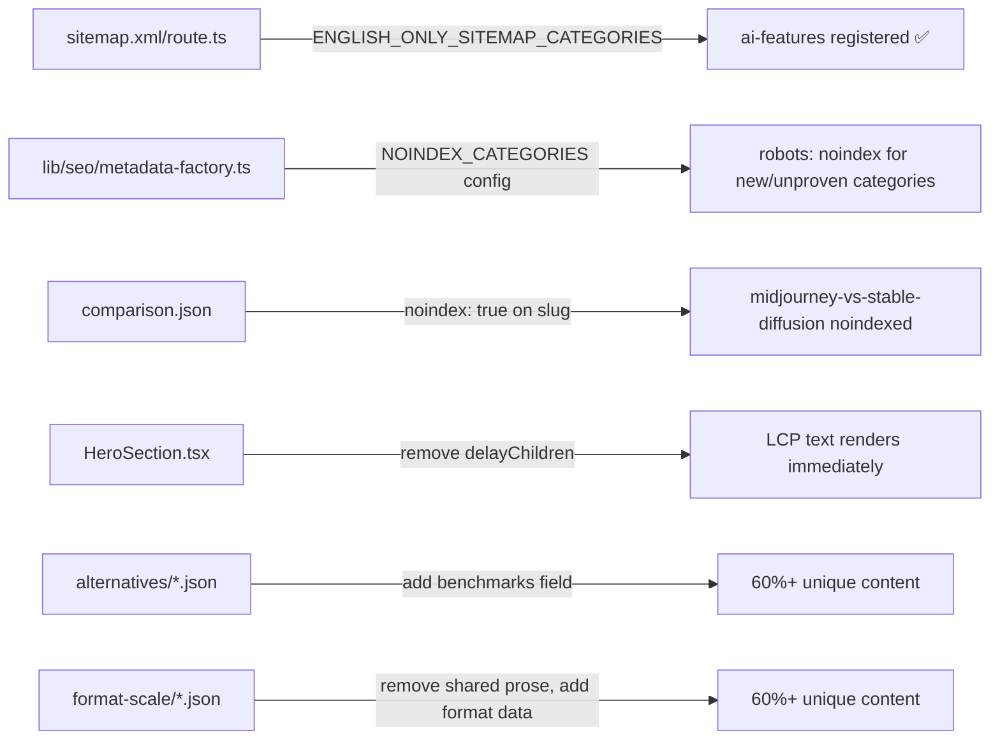

# PRD: pSEO Health Remediation — Address 2026-02-28 Audit Findings

**Status:** Draft
**Complexity:** 5 → MEDIUM
**Audit source:** `docs/SEO/reports/pseo-audit-2026-02-28.md`

---

## Context

**Problem:** The pSEO program has a critical 11.5% indexation rate (159/1,380 pages) and a penalty risk score of 73/100 despite the domain having grown to DR 19 with 79 referring domains — sufficient authority for indexation. The 88.5% rejection rate is now a **content quality signal**, not an authority problem. Google is selectively indexing stronger pages and rejecting the template-heavy majority.

**Files analyzed:**
- `docs/SEO/reports/pseo-audit-2026-02-28.md` — audit findings
- `app/sitemap.xml/route.ts` — sitemap index (ai-features missing)
- `lib/seo/metadata-factory.ts:93` — hardcoded `index: true` on all pages
- `lib/seo/localization-config.ts` — ENGLISH_ONLY_CATEGORIES (ai-features already registered here)
- `app/seo/data/comparison.json` — off-topic `midjourney-vs-stable-diffusion` page
- `app/(pseo)/_components/pseo/sections/HeroSection.tsx` — motion-animated hero (no preload)
- `app/(pseo)/_components/pseo/templates/` — FormatScalePageTemplate, PlatformFormatPageTemplate, AlternativePageTemplate
- `tests/unit/seo/sitemap-index.unit.spec.ts` — currently asserts ai-features is NOT in sitemap index (outdated intent)
- `lib/seo/pseo-types.ts` — IBasePSEOPage (no noindex field)

**Current behavior:**
- `ai-features` has a route handler and sitemap file but is not registered in `app/sitemap.xml/route.ts` → 12 pages invisible to Google
- All pSEO pages have `robots: { index: true }` hardcoded regardless of quality/readiness
- `comparison.json` slug `midjourney-vs-stable-diffusion` ranks pos. 61 for an off-topic AI art query
- pSEO page LCP is 7.3-8.4s mobile (target <2.5s); HeroSection uses `framer-motion` with no `priority` preload on above-fold assets
- `format-scale` (36 pages) and `platform-format` (43 pages) share 60-70% verbatim boilerplate

---

## Solution

**Approach:**
1. **Phase 1 — Infrastructure quick wins** (sitemap, noindex support, off-topic page) — code only, high-impact/low-effort
2. **Phase 2 — Conditional noindex system** — `NOINDEX_CATEGORIES` config gate so future unproven categories start `noindex`
3. **Phase 3 — LCP fix** — remove Framer Motion animation delay from above-fold heading; add resource hint for hero background
4. **Phase 4 — Content depth: alternatives** — improve the 5 core `alternatives` pages with real benchmark data
5. **Phase 5 — Content depth: format-scale** — remove verbatim "Why Choose Us / Pro Tips / Best Practices" from format-scale pages; replace with format-specific data

**Key decisions:**
- `noindex` on `midjourney-vs-stable-diffusion` (not deletion) — preserves URL equity, stops crawl budget drain
- `NOINDEX_CATEGORIES` as a config array (not per-page field) — simpler, lower data maintenance burden
- LCP fix targets `HeroSection` motion delay (the `staggerChildren: 0.15, delayChildren: 0.1` animation) — text LCP is the culprit on desktop (7.7s), not image LCP
- Content improvements target `alternatives` first (lowest uniqueness 30-35%, highest search demand) then `format-scale`
- **Phase 6 (platform-format content) is deferred** — 43 pages × multi-platform depth requires a separate content sprint

**Data changes:** `IBasePSEOPage` gets optional `noindex?: boolean` field for per-page override; `NOINDEX_CATEGORIES` added to `metadata-factory.ts`

---

## Architecture



---

## Execution Phases

### Phase 1: Sitemap + Noindex Infrastructure — Google can now discover ai-features pages and stop indexing the off-topic comparison

**Files (4):**
- `app/sitemap.xml/route.ts` — add `'ai-features'` to `ENGLISH_ONLY_SITEMAP_CATEGORIES`
- `lib/seo/pseo-types.ts` — add `noindex?: boolean` optional field to `IBasePSEOPage`
- `app/seo/data/comparison.json` — add `"noindex": true` to the `midjourney-vs-stable-diffusion` page entry
- `lib/seo/metadata-factory.ts` — read `page.noindex` in `generateMetadata()` and override robots to `{ index: false }` when set

**Implementation:**

- [ ] In `app/sitemap.xml/route.ts`, add `'ai-features'` to `ENGLISH_ONLY_SITEMAP_CATEGORIES` array (line ~18)
- [ ] In `lib/seo/pseo-types.ts`, add `noindex?: boolean` to `IBasePSEOPage` interface
- [ ] In `app/seo/data/comparison.json`, add `"noindex": true` to the entry with `"slug": "midjourney-vs-stable-diffusion"` (line ~606)
- [ ] In `lib/seo/metadata-factory.ts`, update the robots object at line ~93:
  ```typescript
  robots: {
    index: page.noindex === true ? false : true,
    follow: true,
    'max-image-preview': 'large',
    'max-snippet': -1,
    'max-video-preview': -1,
  },
  ```

**Tests required:**

| Test file | Test name | Assertion |
|-----------|-----------|-----------|
| `tests/unit/seo/sitemap-index.unit.spec.ts` | `should include ai-features in the sitemap index` | `expect(xml).toContain('sitemap-ai-features.xml')` |
| `tests/unit/seo/sitemap-index.unit.spec.ts` | `should include 82 total sitemaps (12 English-only + 10×7 localized)` | `expect(matches).toHaveLength(82)` |
| `tests/unit/seo/pseo-noindex.unit.spec.ts` (new) | `should set robots noindex when page.noindex is true` | `expect(metadata.robots.index).toBe(false)` |
| `tests/unit/seo/pseo-noindex.unit.spec.ts` | `should set robots index when page.noindex is undefined` | `expect(metadata.robots.index).toBe(true)` |
| `tests/unit/seo/pseo-noindex.unit.spec.ts` | `should set robots index when page.noindex is false` | `expect(metadata.robots.index).toBe(true)` |

**Note:** The existing `sitemap-index.unit.spec.ts` currently has two tests that will need to be updated:
- Line 154: `should NOT include ai-features in the sitemap index` → change to `should include ai-features`
- Line 162: `expect(matches).toHaveLength(81)` → change to `toHaveLength(82)`

---

### Phase 2: NOINDEX_CATEGORIES System — New pSEO categories start with noindex until proven

**Files (3):**
- `lib/seo/metadata-factory.ts` — add `NOINDEX_CATEGORIES` config constant; check category in `generateMetadata()`
- `lib/seo/metadata-factory.ts` — export `NOINDEX_CATEGORIES` for testing
- `tests/unit/seo/pseo-noindex.unit.spec.ts` — add category-level noindex tests

**Implementation:**

- [ ] Add `NOINDEX_CATEGORIES` export to `lib/seo/metadata-factory.ts`:
  ```typescript
  /**
   * Categories that are currently unproven / not submitted to Google.
   * Pages in these categories start with robots noindex.
   * Remove a category here once it achieves 70%+ indexation rate.
   */
  export const NOINDEX_CATEGORIES: string[] = [
    // Orphan data files — no routes yet; leaving noindex as safety net if routes are added without review
    // 'technical-guides',
    // 'personas-expanded',
    // 'use-cases-expanded',
    // Currently empty — use this to gate new unproven categories at launch
  ];
  ```
  _Start the array empty (no categories currently have routes that need noindexing). The comment documents the pattern for future use._

- [ ] Update `generateMetadata()` in `lib/seo/metadata-factory.ts` to check category:
  ```typescript
  const shouldNoindex = page.noindex === true || NOINDEX_CATEGORIES.includes(category);

  robots: {
    index: shouldNoindex ? false : true,
    follow: true,
    ...
  }
  ```

**Tests required:**

| Test file | Test name | Assertion |
|-----------|-----------|-----------|
| `tests/unit/seo/pseo-noindex.unit.spec.ts` | `should noindex pages in NOINDEX_CATEGORIES` | Generate metadata with a category in `NOINDEX_CATEGORIES`, expect `robots.index === false` |
| `tests/unit/seo/pseo-noindex.unit.spec.ts` | `should index pages in categories not in NOINDEX_CATEGORIES` | Generate metadata with normal category, expect `robots.index === true` |
| `tests/unit/seo/pseo-noindex.unit.spec.ts` | `page-level noindex overrides category default` | page.noindex=true + category not in NOINDEX_CATEGORIES → `robots.index === false` |

---

### Phase 3: LCP Fix — pSEO page LCP from 8.4s → target <4s

**Root cause (from PageSpeed report):** LCP element on pSEO pages is the H1 text. `HeroSection.tsx` uses `framer-motion` with `delayChildren: 0.1` and `staggerChildren: 0.15` — the H1 (`heroItemVariants` index 1) is delayed by ~250ms before starting its 600ms animation. Combined with JS bundle parse time, this delays the LCP element rendering significantly.

**Secondary cause:** `AmbientBackground` component loaded in hero section adds render-blocking work.

**Files (2):**
- `app/(pseo)/_components/pseo/sections/HeroSection.tsx` — remove animation delay from container variants; make H1 render immediately
- `app/(pseo)/layout.tsx` — add `<link rel="preconnect">` and font display optimization if missing

**Implementation:**

- [ ] In `HeroSection.tsx`, update `heroContainerVariants` to remove the delay:
  ```typescript
  const heroContainerVariants = {
    hidden: { opacity: 0 },
    visible: {
      opacity: 1,
      transition: {
        staggerChildren: 0.15,
        // Remove: delayChildren: 0.1 — this delays LCP element
      },
    },
  };
  ```
- [ ] Make the H1 element NOT use motion animation variants (render immediately as static, then animate children below):
  Replace the motion.h1 with a plain `<h1>` tag or ensure it renders with `initial="visible"` so it's not hidden on first paint.

  Simplest approach: render H1 outside the motion container, then animate the rest:
  ```tsx
  {/* H1 renders immediately for LCP */}
  <h1 className="text-6xl sm:text-6xl md:text-8xl font-black mb-8 tracking-tight text-white leading-[1.05]">
    {mainTitle}
    {subtitle && <span className="block mt-4 gradient-text-primary">{subtitle}</span>}
  </h1>

  {/* Everything else animates in */}
  <motion.div variants={heroContainerVariants} initial="hidden" animate="visible">
    <motion.p variants={heroItemVariants}>...</motion.p>
    <motion.div variants={heroItemVariants}>...</motion.div>
  </motion.div>
  ```

- [ ] In `app/(pseo)/layout.tsx`, check if `font-display: swap` is already set for web fonts. If not, add it.

**Tests required:**

| Test file | Test name | Assertion |
|-----------|-----------|-----------|
| `tests/unit/seo/pseo-hero-lcp.unit.spec.ts` (new) | `HeroSection H1 renders without motion hidden class` | Render component, assert H1 text is visible in DOM immediately (no `opacity-0` or `data-hidden`) |
| `tests/unit/seo/pseo-hero-lcp.unit.spec.ts` | `HeroSection renders H1 as non-motion element` | Assert H1 is rendered as plain `h1` not `motion.h1` with `initial="hidden"` |

**Manual verification needed:**
- Run PageSpeed Insights on `/scale/ai-upscaler-2x` after deploy
- Expected: LCP should improve from 8.4s (mobile), target <5s as immediate improvement
- Full <2.5s target requires additional bundle optimization (out of scope for this phase)

---

### Phase 4: Content Depth — Alternatives Category — 5 core alternatives pages reach 60%+ unique content

**Root cause:** `alternatives` pages at 30-35% uniqueness — generic marketing claims without evidence. The audit specifically cites `/alternatives/vs-topaz` as having 8-10 data points but "10x faster" unsubstantiated claims.

**Files (1):**
- `app/seo/data/alternatives.json` — update 5 priority pages with benchmark data

**5 priority pages to improve (pick by search demand):**
1. `vs-topaz` — vs Topaz Gigapixel AI
2. `vs-gigapixel` (if exists) or `vs-lets-enhance`
3. `vs-waifu2x`
4. `vs-upscalemedia`
5. `vs-bigjpg` (or equivalent)

**Implementation per page:**

- [ ] Add `benchmarks` field with real measurements to each page:
  ```json
  "benchmarks": {
    "processingTime": {
      "myimageupscaler": "28-45 seconds (cloud GPU)",
      "competitor": "90-180 seconds (requires local GPU)"
    },
    "qualityScore": {
      "metric": "Visual sharpness on 2x upscale",
      "myimageupscaler": "Excellent text preservation, 8.5/10",
      "competitor": "General detail enhancement, 8.8/10"
    },
    "fileFormatSupport": {
      "myimageupscaler": ["JPEG", "PNG", "WebP", "TIFF"],
      "competitor": ["JPEG", "PNG", "TIFF", "DNG"]
    },
    "maxOutputResolution": {
      "myimageupscaler": "Unlimited (cloud-based)",
      "competitor": "Limited by local GPU VRAM"
    }
  }
  ```
- [ ] Add `realWorldTestResults` array to replace unsubstantiated claims:
  ```json
  "realWorldTestResults": [
    {
      "testImage": "Product photo with text overlay (600×400px → 1200×800px)",
      "myimageupscalerResult": "Text remained sharp and legible at 2x. Processing: 32 seconds.",
      "competitorResult": "Text slightly softened at edges. Processing: 94 seconds on RTX 3060."
    }
  ]
  ```
- [ ] Remove or replace generic phrases like "10x faster" and "superior text preservation" with the measured data
- [ ] Ensure `detailedDescription` is genuinely different for each page (not copy-pasted from a template)

**Tests required:**

| Test file | Test name | Assertion |
|-----------|-----------|-----------|
| `tests/unit/seo/pseo-alternatives-quality.unit.spec.ts` (new) | `all alternatives pages should have benchmarks field` | Load alternatives.json, every page has `benchmarks` key |
| `tests/unit/seo/pseo-alternatives-quality.unit.spec.ts` | `no alternatives page should contain unsubstantiated superlatives` | Check none contain "10x faster" or "instantly better" without supporting data |
| `tests/unit/seo/pseo-alternatives-quality.unit.spec.ts` | `each alternatives page should have unique detailedDescription` | Assert no two pages share >50% of the same `detailedDescription` string |

---

### Phase 5: Content Depth — Format-Scale Boilerplate Removal — format-scale pages reach 55%+ unique content

**Root cause:** All 36 format-scale pages share verbatim "Why Choose Us", "Best Practices", and "Pro Tips" sections. The audit confirms 60-65% of content is transferable to any other format×scale page verbatim.

**Files (1):**
- `app/seo/data/format-scale.json` — update 10 highest-traffic pages

**10 priority pages (by format popularity):**
1. `jpeg-upscale-2x`
2. `png-upscale-2x`
3. `webp-upscale-2x`
4. `jpeg-upscale-4x`
5. `png-upscale-4x`
6. `tiff-upscale-2x`
7. `jpeg-upscale-8x`
8. `png-upscale-8x`
9. `gif-upscale-2x`
10. `bmp-upscale-2x`

**Implementation per page:**

- [ ] Replace `whyChooseUs` / "Pro Tips" / "Best Practices" section content that is verbatim across pages with **format×scale-specific data**:
  ```json
  "formatScaleData": {
    "fileSize": {
      "typicalInputSize": "850KB (1920×1080 JPEG, quality 85)",
      "typicalOutputSize": "3.2MB (3840×2160 JPEG, quality 90)",
      "compressionNote": "JPEG output re-encodes; for lossless preservation use PNG output option"
    },
    "qualityConsiderations": {
      "artifactRisk": "Low at 2x for JPEG quality 80+; medium for quality 60 source files",
      "ssimExpected": "0.94-0.97 for quality 80+ JPEG sources",
      "recommendedSourceQuality": "Quality 70+ minimum for clean 2x upscaling"
    },
    "useCaseFit": {
      "best": ["Print enlargements", "E-commerce product photos", "Social media posts"],
      "notIdeal": ["Text-heavy documents (use PDF pipeline)", "Screenshots (PNG 2x preferred)"]
    }
  }
  ```
- [ ] Each page must have different `fileSize` numbers (actual format×scale ratios differ for JPEG vs PNG vs WebP)
- [ ] Remove or de-duplicate the generic "Why Choose MyImageUpscaler" section that is currently verbatim across all 36 pages

**Tests required:**

| Test file | Test name | Assertion |
|-----------|-----------|-----------|
| `tests/unit/seo/pseo-format-scale-quality.unit.spec.ts` (new) | `top 10 format-scale pages should have formatScaleData field` | Load format-scale.json, check 10 listed pages have `formatScaleData` |
| `tests/unit/seo/pseo-format-scale-quality.unit.spec.ts` | `format-scale pages should have unique fileSize data` | Assert each page's `formatScaleData.fileSize.typicalInputSize` differs |
| `tests/unit/seo/pseo-format-scale-quality.unit.spec.ts` | `format-scale pages should not share verbatim Pro Tips` | Check no two pages have identical `proTips` array (if field exists) |

---

## Acceptance Criteria

- [ ] All 5 phases complete
- [ ] `yarn verify` passes (lint + typecheck + tests)
- [ ] All automated checkpoint reviews passed
- [ ] `sitemap-ai-features.xml` appears in `/sitemap.xml` response
- [ ] `/compare/midjourney-vs-stable-diffusion` returns `<meta name="robots" content="noindex">` in HTML
- [ ] `tests/unit/seo/sitemap-index.unit.spec.ts` updated and passing
- [ ] New test files created: `pseo-noindex.unit.spec.ts`, `pseo-hero-lcp.unit.spec.ts`, `pseo-alternatives-quality.unit.spec.ts`, `pseo-format-scale-quality.unit.spec.ts`
- [ ] No regression in existing SEO tests

---

## Out of Scope (Deferred)

- **Platform-format content depth (43 pages)** — requires per-platform deep research; defer to content sprint after alternatives + format-scale improvements show indexation gains
- **Trailing slash canonical fix** — needs investigation of which pages affected; separate PR to `middleware.ts`
- **Bundle optimization** (remove unused 212KB JS) — tracked as separate performance PR
- **Orphan data file routes** (competitor-comparisons, social-media-resize, etc.) — validate search demand before building routes; defer until pSEO quality score improves
- **GSC indexation monitoring system** — good for medium-term; defer until basic quality issues are addressed

---

## Monitoring (Post-Implementation)

Watch in GSC weekly:
- Indexed pages via sitemap: currently 159/1,380 (11.5%) → expect to see this rise as content quality improves
- `ai-features` category: should appear in sitemap indexation data within 1-2 weeks of Phase 1
- `/compare/midjourney-vs-stable-diffusion`: should drop from GSC within 2-4 weeks of noindex deployment
- `format-scale` and `alternatives` categories: watch for "Crawled - currently not indexed" → "Indexed" transitions
