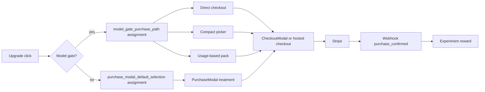
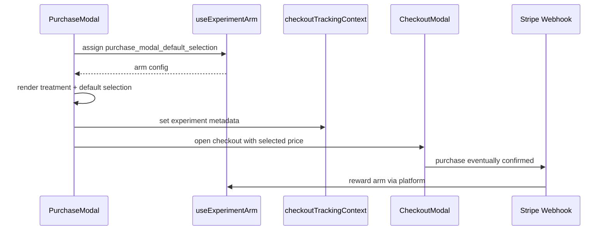
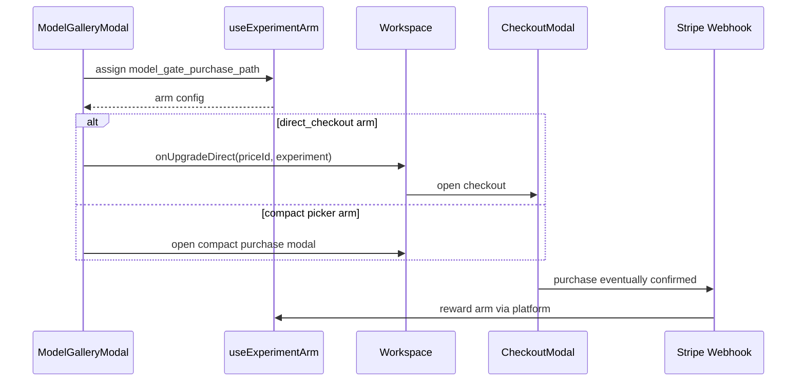

# PRD: Purchase Conversion Bandits

**Date:** 2026-05-26
**Status:** Draft
**Owner:** Growth / Billing
**Depends on:** `docs/PRDs/shared-bandit-experiment-platform.md`
**Related:** `docs/analysis/multi-armed-bandit-opportunities-2026-05-26.md`, `docs/PRDs/revenue-funnel-telemetry-and-checkout-repair.md`, `docs/PRDs/click-to-checkout-conversion-fix.md`
**Complexity:** 10 -> HIGH mode

---

## 0. Complexity Assessment

**Score: 10 -> HIGH mode**

- +3 touches 10+ files across purchase modal, model gallery, checkout context, analytics, tests, and seeded experiment arms
- +2 complex state logic: trigger attribution, direct checkout vs modal routing, auth redirects, session-stable assignments
- +2 user-facing UI changes to purchase modal and model-gate flows
- +1 external API integration: Stripe checkout metadata and Amplitude analytics
- +1 database seed changes for experiment arms
- +1 checkout/webhook reward integration through PRD 1 platform

This PRD is a product vertical slice. It must not implement a second experiment platform; it consumes PRD 1's shared assignment and reward attribution.

---

## 1. Context

**Problem:** Live Amplitude data shows high-intent purchase users are leaking before Stripe: `480` upgrade clicks became only `239` checkout opens and `23` purchases in the last 30 days.

### Files Analyzed

- `docs/analysis/multi-armed-bandit-opportunities-2026-05-26.md`
- `client/components/stripe/PurchaseModal.tsx`
- `client/components/stripe/CheckoutModal.tsx`
- `client/components/stripe/CreditPackSelector.tsx`
- `client/components/stripe/SubscriptionPlanGrid.tsx`
- `client/components/features/workspace/ModelGalleryModal.tsx`
- `client/components/features/workspace/Workspace.tsx`
- `client/components/features/workspace/BatchSidebar.tsx`
- `client/utils/purchaseModalDefaults.ts`
- `client/utils/checkoutTrackingContext.ts`
- `client/hooks/useRegionTier.ts`
- `client/hooks/useCheckoutSession.ts`
- `shared/config/subscription.config.ts`
- `shared/config/stripe.ts`
- `server/analytics/types.ts`
- `app/api/checkout/route.ts`
- `app/api/webhooks/stripe/handlers/payment.handler.ts`

### Live Amplitude Baseline

Last 30 days from user-provided Amplitude brief:

| Funnel Step              | Volume |        Conversion |
| ------------------------ | -----: | ----------------: |
| `upgrade_prompt_shown`   |  6,731 |                 - |
| `upgrade_prompt_clicked` |    480 |          7.1% CTR |
| `checkout_opened`        |    239 |   49.8% of clicks |
| `purchase_confirmed`     |     23 | 9.6% of checkouts |
| End-to-end               |      - |             0.58% |

Purchase modal layer:

| Funnel Step             | Volume |
| ----------------------- | -----: |
| `purchase_modal_opened` |    426 |
| `checkout_opened`       |    239 |
| Modal -> checkout       |    56% |

The modal picker loses roughly `187` high-intent users before Stripe loads.

### Current Behavior

- `ModelGalleryModal` can route locked model clicks to direct checkout through `onUpgradeDirect`.
- `PurchaseModal` presents credit packs and subscriptions with trigger-specific defaults.
- Some high-intent flows still enter a decision-heavy modal before checkout.
- Checkout attribution context already carries trigger, originating model, originating trigger, and attribution chain.
- No adaptive system currently chooses between purchase-modal layouts or model-gate routing treatments.

---

## 2. Integration Points Checklist

**How will this feature be reached?**

- [x] Entry points identified:
  - Locked model click in `ModelGalleryModal`.
  - Upgrade CTA click that opens `PurchaseModal`.
  - Purchase modal initial render and CTA to checkout.
- [x] Caller files identified:
  - `Workspace.tsx` wires `ModelGalleryModal`, `PurchaseModal`, and `CheckoutModal`.
  - `ModelGalleryModal.tsx` handles model-gate clicks.
  - `PurchaseModal.tsx` renders purchase options and opens checkout.
  - `CheckoutModal.tsx` and `/api/checkout` finalize checkout attribution.
- [x] Registration/wiring needed:
  - Seed experiment arms via PRD 1.
  - Use `useExperimentArm` in `PurchaseModal` and `ModelGalleryModal`.
  - Add experiment metadata to checkout tracking context.

**Is this user-facing?**

- [x] YES
  - Users may see different purchase picker layouts, defaults, or direct checkout routes.

**Full user flow**

1. User clicks an upgrade prompt or locked premium model.
2. Code requests an experiment arm for the relevant surface and context.
3. User sees assigned purchase path or modal layout.
4. If they proceed, checkout metadata includes experiment attribution.
5. Stripe webhook records `purchase_confirmed` reward against the assigned arm.

---

## 3. Solution

### Approach

1. Launch two purchase experiments using the shared bandit platform:
   - `purchase_modal_default_selection`
   - `model_gate_purchase_path`
2. Start with low-risk arms that vary routing/defaults/layout, not discounts.
3. Optimize for revenue per assigned impression, not clicks or checkout opens.
4. Keep direct checkout and current modal behavior as explicit control arms.
5. Preserve assisted attribution from post-download/model-gallery discovery into model-gate checkout.

### Architecture Diagram



### Key Decisions

- The control arm for model-gate is current direct checkout to cheapest regional plan/pack.
- The control arm for purchase modal is current modal behavior.
- Do not introduce discounts in this PRD. Discount arms belong in a later discount/rescue PRD.
- Persist assignment for a session so users do not see a different purchase path after closing/reopening.
- Segment context by `pricingRegion`, device class, trigger, and auth state, but avoid over-fragmenting early traffic.

### Data Changes

Requires PRD 1 schema.

Add seed migration for experiment arms:

`supabase/migrations/YYYYMMDD_seed_purchase_conversion_bandit_arms.sql`

Suggested initial arms:

```sql
INSERT INTO experiment_arms (experiment_key, context_key, arm_key, arm_config, is_active)
VALUES
  (
    'purchase_modal_default_selection',
    'global',
    'current_modal_control',
    '{"description":"Current purchase modal behavior"}',
    true
  ),
  (
    'purchase_modal_default_selection',
    'global',
    'starter_anchor',
    '{"defaultType":"credit_pack","defaultKey":"small","layout":"credits_first","copy":"starter_anchor"}',
    true
  ),
  (
    'purchase_modal_default_selection',
    'global',
    'compact_credit_picker',
    '{"defaultType":"credit_pack","visiblePacks":["small","medium"],"hideSubscriptionsInitially":true}',
    true
  ),
  (
    'model_gate_purchase_path',
    'global',
    'direct_small_pack_control',
    '{"path":"direct_checkout","defaultKey":"small"}',
    true
  ),
  (
    'model_gate_purchase_path',
    'global',
    'compact_credit_picker',
    '{"path":"compact_picker","visiblePacks":["small","medium"]}',
    true
  ),
  (
    'model_gate_purchase_path',
    'global',
    'usage_based_pack',
    '{"path":"direct_checkout","selection":"model_cost_based"}',
    true
  ),
  (
    'model_gate_purchase_path',
    'global',
    'subscription_unlock',
    '{"path":"direct_checkout","defaultType":"subscription","defaultKey":"starter"}',
    true
  )
ON CONFLICT (experiment_key, context_key, arm_key) DO NOTHING;
```

---

## 4. Sequence Flows

### Purchase Modal Assignment



### Model-Gate Assignment



---

## 5. Execution Phases

#### Phase 1: Purchase Modal Default-Selection Bandit - Modal treatments can be assigned and measured

**Files (max 5):**

- `client/components/stripe/PurchaseModal.tsx` - consume assignment and render arms
- `client/utils/purchaseModalDefaults.ts` - apply arm-specific defaults
- `supabase/migrations/YYYYMMDD_seed_purchase_conversion_bandit_arms.sql` - seed modal arms
- `tests/unit/client/components/PurchaseModal.bandit.unit.spec.tsx` - modal assignment tests
- `tests/unit/client/purchaseModalDefaults.unit.spec.ts` - default logic tests

**Implementation:**

- [ ] Request `purchase_modal_default_selection` assignment when modal opens.
- [ ] Use `current_modal_control` fallback when assignment fails.
- [ ] Implement `starter_anchor` default: credit pack small selected and entry-price copy emphasized.
- [ ] Implement `compact_credit_picker`: show small and medium packs first, with subscriptions behind a secondary tab or link.
- [ ] Attach experiment metadata to `purchase_modal_opened`, `upgrade_prompt_clicked`, `checkout_opened`, and checkout context.

**Tests Required:**

| Test File                                                         | Test Name                                     | Assertion                                   |
| ----------------------------------------------------------------- | --------------------------------------------- | ------------------------------------------- |
| `tests/unit/client/components/PurchaseModal.bandit.unit.spec.tsx` | `renders control modal when assigned control` | Current layout/defaults are preserved       |
| `tests/unit/client/components/PurchaseModal.bandit.unit.spec.tsx` | `renders compact credit picker arm`           | Only intended packs are visible initially   |
| `tests/unit/client/components/PurchaseModal.bandit.unit.spec.tsx` | `includes experiment metadata on checkout`    | Checkout context contains experiment fields |
| `tests/unit/client/purchaseModalDefaults.unit.spec.ts`            | `starter anchor selects small pack`           | Default selected item is small credit pack  |

**User Verification:**

- Action: Open purchase modal in local dev with each forced arm.
- Expected: Correct layout/default appears and checkout still opens.

#### Phase 2: Model-Gate Purchase Path Bandit - Locked-model clicks can route through assigned purchase paths

**Files (max 5):**

- `client/components/features/workspace/ModelGalleryModal.tsx` - assign model-gate arm and route
- `client/components/features/workspace/Workspace.tsx` - accept experiment metadata in direct checkout and compact modal paths
- `client/utils/checkoutTrackingContext.ts` - carry experiment context from model gate
- `tests/unit/client/components/ModelGalleryModal.bandit.unit.spec.tsx` - model-gate tests
- `tests/unit/client/components/Workspace.direct-checkout.unit.spec.tsx` - checkout wiring tests

**Implementation:**

- [ ] Request `model_gate_purchase_path` assignment when a locked model or unlock banner is clicked.
- [ ] Keep `direct_small_pack_control` as fallback.
- [ ] For `direct_small_pack_control`, continue current direct checkout path.
- [ ] For `compact_credit_picker`, close model gallery and open purchase modal in compact mode.
- [ ] For `usage_based_pack`, resolve pack based on clicked model credit cost and selected scale.
- [ ] For `subscription_unlock`, route to Starter/Hobby subscription checkout only when not an obvious one-off pack intent.
- [ ] Include originating model, trigger, attribution chain, and experiment metadata in all downstream events.

**Tests Required:**

| Test File                                                              | Test Name                                            | Assertion                                        |
| ---------------------------------------------------------------------- | ---------------------------------------------------- | ------------------------------------------------ |
| `tests/unit/client/components/ModelGalleryModal.bandit.unit.spec.tsx`  | `direct arm opens direct checkout`                   | Calls `onUpgradeDirect` with experiment metadata |
| `tests/unit/client/components/ModelGalleryModal.bandit.unit.spec.tsx`  | `compact arm opens purchase modal path`              | Does not call direct checkout                    |
| `tests/unit/client/components/ModelGalleryModal.bandit.unit.spec.tsx`  | `falls back to direct control when assignment fails` | Purchase path still works                        |
| `tests/unit/client/components/Workspace.direct-checkout.unit.spec.tsx` | `checkout_opened includes experiment metadata`       | Analytics payload is attributable                |

**User Verification:**

- Action: Force each model-gate arm and click a locked premium model.
- Expected: User reaches the assigned purchase path and checkout still works.

#### Phase 3: Reward Attribution and Health Reporting - Purchase rewards prove which arm wins

**Files (max 5):**

- `app/api/checkout/route.ts` - verify product experiment metadata is preserved
- `app/api/webhooks/stripe/handlers/payment.handler.ts` - verify reward call for product arms
- `scripts/check-experiment-bandit-health.ts` - report experiment performance
- `tests/unit/api/checkout-route.unit.spec.ts` - checkout metadata tests
- `tests/unit/api/payment-handler-fixes.unit.spec.ts` - purchase reward tests

**Implementation:**

- [ ] Ensure checkout metadata contains experiment arm for both modal and direct model-gate paths.
- [ ] Ensure purchase rewards are revenue-weighted from `purchase_confirmed`.
- [ ] Add health script output for impressions, checkout opens, rewards, revenue, and revenue per impression.
- [ ] Add guardrail counters for checkout errors and abandons if PRD 1 supports guardrail recording.

**Tests Required:**

| Test File                                           | Test Name                                       | Assertion                                 |
| --------------------------------------------------- | ----------------------------------------------- | ----------------------------------------- |
| `tests/unit/api/checkout-route.unit.spec.ts`        | `passes product experiment metadata to Stripe`  | Session metadata has arm identifiers      |
| `tests/unit/api/payment-handler-fixes.unit.spec.ts` | `rewards purchase modal experiment on purchase` | Reward service receives modal arm ID      |
| `tests/unit/api/payment-handler-fixes.unit.spec.ts` | `rewards model gate experiment on purchase`     | Reward service receives model-gate arm ID |

**User Verification:**

- Action: Run a test checkout with forced arm metadata.
- Expected: Health script shows assignment and reward after simulated webhook.

#### Phase 4: Rollout Guardrails - Bandits can be enabled safely in production

**Files (max 5):**

- `shared/config/feature-flags.ts` - feature flags for each experiment
- `docs/PRDs/purchase-conversion-bandits.md` - rollout status updates
- `docs/technical/systems/analytics.md` - dashboard/reporting instructions
- `tests/unit/config/feature-flags.unit.spec.ts` - flags tests
- `tests/e2e/purchase-conversion-bandits.e2e.spec.ts` - optional e2e smoke path

**Implementation:**

- [ ] Add `ENABLE_PURCHASE_MODAL_BANDIT`.
- [ ] Add `ENABLE_MODEL_GATE_PURCHASE_PATH_BANDIT`.
- [ ] Start at 10% traffic or staging-only until metadata/reward path is verified.
- [ ] Define kill switch behavior: assignment fallback to control and no UI breakage.
- [ ] Document Amplitude dashboard links and expected funnel cuts.

**Tests Required:**

| Test File                                           | Test Name                                              | Assertion             |
| --------------------------------------------------- | ------------------------------------------------------ | --------------------- |
| `tests/unit/config/feature-flags.unit.spec.ts`      | `purchase bandits default off when unset`              | Safe default          |
| `tests/e2e/purchase-conversion-bandits.e2e.spec.ts` | `locked model reaches checkout with forced direct arm` | End-to-end path works |
| `tests/e2e/purchase-conversion-bandits.e2e.spec.ts` | `purchase modal reaches checkout with compact arm`     | End-to-end path works |

**User Verification:**

- Action: Enable each flag in staging and test forced arms.
- Expected: No checkout regression, and Amplitude receives assignment + checkout events.

---

## 6. Checkpoint Protocol

After each phase:

1. Run targeted tests.
2. Run `yarn tsc`.
3. Run relevant Playwright smoke tests for checkout surfaces after UI phases.
4. Spawn `prd-work-reviewer` checkpoint before continuing.

Manual checkpoint required for Phases 1, 2, and 4 because these are user-facing checkout UI changes.

---

## 7. Success Metrics

Primary metrics:

| Metric                                | Baseline |                            Target |
| ------------------------------------- | -------: | --------------------------------: |
| Modal -> checkout conversion          |      56% |                              70%+ |
| Upgrade click -> checkout open        |    49.8% |                              65%+ |
| Checkout -> purchase                  |     9.6% |               Maintain or improve |
| End-to-end upgrade prompt -> purchase |    0.58% |                             1.0%+ |
| Revenue per assigned impression       |      New | Winning arm beats control by 15%+ |

Guardrails:

| Guardrail                 | Target                                                  |
| ------------------------- | ------------------------------------------------------- |
| Checkout errors           | No increase over baseline                               |
| Purchase refunds          | No increase over baseline                               |
| Average order value       | No material drop unless revenue per impression improves |
| Auth-required abandonment | No increase without offsetting purchases                |
| Event attribution loss    | Under 5% for sessions with assignment                   |

---

## 8. Risks and Open Questions

- Purchase modal and model-gate experiments may overlap. Mitigation: assign one primary experiment per flow and include attribution chain.
- Subscription arm can increase AOV but reduce conversion. Mitigation: optimize revenue per impression and monitor AOV separately.
- Compact modal may hide subscriptions and reduce subscription starts. Mitigation: include subscription visibility guardrail.
- Assignment API latency can delay modal render. Mitigation: fallback to control and cache assignments.
- Unauthenticated users may lose assignment across auth redirects. Mitigation: checkout context and assignment storage must survive post-auth return.

---

## 9. Out of Scope

- Engagement discount bandit.
- Checkout rescue bandit.
- Onboarding restoration bandit.
- Post-download next-action bandit.
- Regional pricing bandit changes.
- Admin UI for managing arms.
