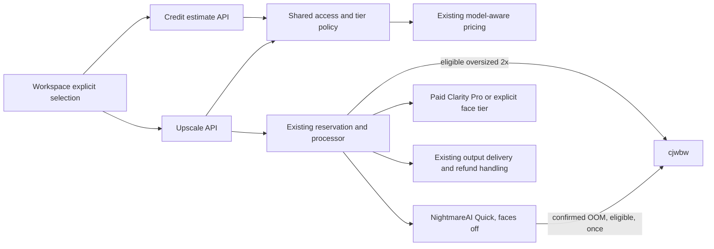

# Cost-conscious Quick recovery and paid face enhancement

Date: 2026-09-08. Status: locally implemented and verified; release evidence pending.

Planning Mode: Principal Architect. Complexity: 6 → MEDIUM (10+ files: 3; shared policy module: 2; external API: 1). No schema or infrastructure changes planned. The user selected NightmareAI as the economical default, cjwbw as the bounded size/CUDA fallback, and paid-only face enhancement. This revision supersedes the earlier blanket cjwbw default decision.

## Decision

Keep **nightmareai/real-esrgan as the default provider model for ordinary Quick**, for free and paid customers, with `face_enhance: false`. Preserve the distinct logical IDs and builders: `real-esrgan` → NightmareAI (`image, scale, face_enhance`); `real-esrgan-large` → cjwbw (`image, upscale`). Route eligible oversized 2× inputs directly to cjwbw. For an eligible ordinary Quick request whose NightmareAI prediction ends in a confirmed CUDA OOM, make **one cjwbw recovery attempt instead of retrying NightmareAI**. Never fall back to Clarity or another premium model for Quick, regardless of account type.

Disable face enhancement by default. Offer face-enhanced upscaling through the existing paid **Clarity Pro** tier, with its actual dimension-based credit price shown before submission. Keep existing Quick customer pricing for successful recovery: the extra provider attempt is our bounded reliability cost, not a surprise customer surcharge.

Use Clarity Pro for launch because its builder, pricing and paid tier already exist and it supports explicit upscale factors. This is an implementation decision, not a proven claim of superior portrait quality. Portrait acceptance tests below are a release gate. Crystal is the provider's more specifically portrait-oriented offering, but is not integrated; adding it is outside this PRD. If Clarity Pro fails the portrait gate, retain the paywall and keep the new face-upscale offer unavailable until the model decision is revised; do not silently substitute another model.

The existing GFPGAN Face Restore tier also becomes paid-only. Keep its distinct old-photo restoration purpose and price. Keep Portrait Pro (`flux-2-pro`) as its existing paid enhancement-only experience; it cannot satisfy a promised 2×/4× output. Ordinary Quick may upscale photos containing faces, but has no dedicated face-restoration pass.

## Integration ledger

Locations below identify inspected callers; update to final non-test line evidence during implementation. A newly exported helper must have a live caller in its introducing phase.

| ID  | New thing / changed gate                   | Live caller                                                                                                                              | Replaces                                                         | Old path disposition                                                           | Negative control                                                                              |
| --- | ------------------------------------------ | ---------------------------------------------------------------------------------------------------------------------------------------- | ---------------------------------------------------------------- | ------------------------------------------------------------------------------ | --------------------------------------------------------------------------------------------- |
| A   | Cost-first size routing                    | `app/api/upscale/route.ts:929`; `server/services/scale-preserving-model.ts:42`                                                           | Paid-first Clarity routing and free premium alternate            | Phase 1 removes premium candidates; NightmareAI stays default                  | Restore Clarity candidate: paid oversized Quick assertion fails                               |
| B   | Paid face access and effective tier policy | `app/api/upscale/route.ts:660`; `app/api/credit-estimate/route.ts:206`                                                                   | Ungated checkbox, free Face Restore and quote disagreement       | Phase 3 introduces shared policy; incumbent branches delegate                  | Free raw face request must return 403 before inference                                        |
| C   | Explicit face-upscale selection and price  | `client/components/features/workspace/Workspace.tsx:210`; `client/components/features/workspace/BatchSidebar/EnhancementOptions.tsx:286` | Default-on checkbox and unpriced enhancement                     | Phase 4 replaces checkbox behavior and handles stale settings                  | Restore default-on or omit quote refresh: workspace flow fails                                |
| D   | Model/tier access catalog                  | `app/api/models/route.ts`; `server/services/model-registry.ts:201`; `shared/config/model-costs.config.ts:154`                            | Free GFPGAN eligibility                                          | Phase 2 removes free eligibility including Auto                                | Restore free GFPGAN: access test fails                                                        |
| E   | One NightmareAI→cjwbw CUDA recovery        | `server/services/replicate.service.ts:395–467`, invoked by `app/api/upscale/route.ts:1254`                                               | Retry closure using identical modelVersion and payload after OOM | Phase 1a replaces Quick OOM retry only, inside the existing credit reservation | Inject OOM then success: second provider call must be cjwbw; restoring same-model retry fails |
| F   | Actual fallback cost attribution           | `server/services/replicate.service.ts:167–231`; `app/api/upscale/route.ts:1254`                                                          | Reporting only initially resolved model/cost                     | Phase 5 records actual attempts while retaining quoted customer charge         | Successful recovery must expose both attempts, one customer debit and cjwbw output            |

## Evidence and current behavior

- Replicate read-only API confirmed prediction `2r5b2rd4dnrga0d0fjhbcrw0pg`: NightmareAI, failed after 14.94 seconds, `scale: 2`, `face_enhance: true`, CUDA OOM. This does not establish whether face enhancement, fragmentation or input size caused the failure. Listing prediction history returned 403, so comparative failure rates are unknown.
- `Workspace.tsx:208` initializes `enhanceFaces: true`, although shared defaults are false. The free/premium tier lists currently allow `face-restore`; direct model and Auto routing must be gated too.
- `scale-preserving-model.ts` currently selects cjwbw for oversized free Quick 2× inputs, but prefers paid Clarity for paying customers while preserving Quick billing. Remove that premium subsidy: both account types use cjwbw only when the validated size policy or CUDA recovery requires it.
- `credit-estimate/route.ts` and `upscale/route.ts` read different profile fields for access. Upscale treats active subscriptions, purchased balances and paid-plan history as paid. Reuse consistent access semantics, but entitlement alone must never bypass sufficient credits. Existing reservation/refund handling remains the accounting authority.
- `guest-processor.ts` has a hardcoded NightmareAI-shaped payload and environment fallback. Search found no live non-test caller; do not claim it proves a guest flow. Audit the actual guest entry before changing behavior and keep this retained processor compatible with the default.

Diagnosis confirmed in local code: `replicate.service.ts:304–320` builds the model version and payload before `withRetry`; `createReplicateRetryPolicy` allows one OOM retry but never switches either. After retry exhaustion, `processImage` refunds and throws. This is missing cross-model recovery, not a cjwbw selection attempted and rejected at runtime. The 18 existing GPU/size/wiring tests passed on 2026-09-08 and currently encode this behavior; they do not prove recovery on cjwbw. `yarn verify` passed with existing warnings. These are baseline diagnostics, not implementation acceptance evidence.

### Available models checked on 2026-09-08

| Model                                                                                                             | Existing integration                                                                                                                  | Decision and limits                                                                                                                                                                                                                                          |
| ----------------------------------------------------------------------------------------------------------------- | ------------------------------------------------------------------------------------------------------------------------------------- | ------------------------------------------------------------------------------------------------------------------------------------------------------------------------------------------------------------------------------------------------------------ |
| [cjwbw/real-esrgan](https://replicate.com/cjwbw/real-esrgan)                                                      | `real-esrgan-large`; pinned `d0ee3d708c9b911f122a4ad90046c5d26a0293b99476d697f6bb7f2e251ce2d4`; builder sends `image, upscale`        | Size/CUDA fallback, not the default. Local notes verify 2048×2048 at 2×; 4× maximum inputs require new measurements. Provider lists approximately $0.0051/run, input-dependent. No `face_enhance` parameter in our integration.                              |
| [Clarity Pro](https://replicate.com/philz1337x/clarity-pro-upscaler)                                              | `clarity-pro-upscaler`; pinned `8e33eb474936d75d3ceaa787f3e66f5ba16f35db0853a7697a4ca4e5fc14b6cd`; enabled by `ENABLE_PREMIUM_MODELS` | Paid face-upscale launch target, subject to portrait gate. Provider offers 2/4/8/16×, creativity -10..10, 64 MP cap. Existing app offers 2/4/8×. $0.03/output MP, $0.03 minimum. Use existing creativity 0 initially; quality claims require actual samples. |
| [Crystal Upscaler](https://replicate.com/philz1337x/crystal-upscaler)                                             | Not registered                                                                                                                        | Provider explicitly targets portraits/faces and recommends it over Clarity Pro for that purpose. Not selected for this implementation; no unverified price assumptions.                                                                                      |
| [GFPGAN](https://replicate.com/xinntao/gfpgan) / [FLUX.2 Pro](https://replicate.com/black-forest-labs/flux-2-pro) | Face Restore / Portrait Pro                                                                                                           | Preserve their separate purposes, both behind paid access. FLUX is an editing model, not our scale-preserving face-upscale replacement.                                                                                                                      |

Provider pages describe capabilities, not independently measured quality. No paid prediction was launched while creating this document. Reconfirm pinned schemas and effective production feature flags before rollout; “registered” does not mean production-enabled.

## Product and billing contract

| Request                                                                                    | Result                                                                                                                |
| ------------------------------------------------------------------------------------------ | --------------------------------------------------------------------------------------------------------------------- |
| Free or paid Quick without face enhancement                                                | NightmareAI without face enhancement; eligible size/CUDA cases use cjwbw; unchanged Quick customer price              |
| Free face checkbox, Face Restore, Clarity Pro, Portrait Pro or direct face-model request   | Purchase flow in UI; forged authenticated request receives 403 with zero debit and zero inference calls               |
| Eligible paying user chooses Enhance Faces from Quick                                      | Explicitly select Clarity Pro, preserve supported scale, display updated credit estimate, then user starts processing |
| Paid Face Restore / Portrait Pro                                                           | Existing separate model semantics and full model price; no free access or hidden chain                                |
| Unavailable paid model, invalid dimensions, insufficient balance or final provider failure | Actionable error; no silent model/quality downgrade; existing refund/release exactly once if a reservation exists     |

Paid access means the existing paid-customer classification (subscription or credit purchaser, including existing paid history semantics) plus a sufficient spendable balance under the current credit ledger. Signup/anonymous access is not entitlement. Audit credit origins: if promotional balances can masquerade as purchased credits, enforce verified purchase provenance for face access before launch using existing billing data; do not introduce a new payment system or schema silently. Cover expired accounts with no balance and free users with promotional credits explicitly.

The server rejects legacy `quick + enhanceFaces:true` with a structured reselect-required validation response for paid users and 403 for free users. It must not silently upgrade a request's cost or silently drop the option. The client migrates stale saved/interrupted configurations by showing the new choice before resubmission. Auto recommendations cannot activate paid face work without entitlement and the quoted/selected premium tier; recompute or reject rather than exceeding the displayed estimate.

Use `calculateFinalProviderAwareCredits` and existing output-megapixel pricing for Clarity Pro. A 1 MP source at 2× produces 4 MP ($0.12 provider cost); at 4× it produces 16 MP ($0.48). Those are provider costs, not customer prices. Do not price this as a one-credit checkbox or six-credit flat fee. Estimate, reservation and final deduction must agree for actual validated dimensions. Reject output over the model cap instead of merely clamping the price. No two-stage ESRGAN→Clarity chain.

## Cost rationale and bounded recovery contract

Configured estimates in `shared/config/model-costs.config.ts`: NightmareAI $0.0017/run, cjwbw $0.0047/run, original Clarity $0.017/run. At 10,000 runs that is $17, $47 and $170 respectively. Replicate lists cjwbw around $0.0051/run, varying with inputs. The local cjwbw estimate was measured at 2048×2048 2×; NightmareAI has no equivalent documented benchmark. The 2.8× configured ratio is not a controlled same-image comparison and does not prove cjwbw costs 2.8× for ordinary small inputs.

For planning only, let `s` be the share routed directly to cjwbw for size and `f` the share of remaining NightmareAI jobs needing CUDA recovery. Using the configured estimates, expected provider spend per submitted job is `(1-s) × (0.0017 + f × 0.0047) + s × 0.0047`. With `s=0` and `f=10%`, this is $0.00217/job, or $21.70/10,000 versus $47 for all-cjwbw. This assumes the failed primary costs the normal estimate; failed runs may cost more or less, so replace it with measured failed-attempt charges, durations and actual invoice treatment. Measure cost per delivered result as well as per submission, including failed recoveries. Do not claim global cost optimality from these assumptions.

| Starting condition                                                                                                                   | Provider execution and stop condition                                                                            |
| ------------------------------------------------------------------------------------------------------------------------------------ | ---------------------------------------------------------------------------------------------------------------- |
| Quick within primary input limit                                                                                                     | NightmareAI once, `face_enhance:false`; success ends the job                                                     |
| Quick 2× above 2,096,704 pixels, at most 4,194,304 pixels and each side ≤2048                                                        | cjwbw directly; no knowingly invalid NightmareAI attempt                                                         |
| Confirmed NightmareAI CUDA OOM; Quick, faces off, known dimensions and verified cjwbw scale/size                                     | cjwbw once using original source and requested scale; no second NightmareAI inference                            |
| cjwbw fails, fallback disabled, unsupported scale/size, unknown dimensions, face option on, or definitive primary input/auth failure | No model switch; existing actionable failure/refund handling                                                     |
| Timeout/network ambiguity, active prediction, or rate limit                                                                          | Never treat as proof of terminal OOM; retain safe existing non-GPU handling without starting duplicate inference |

Initially cjwbw recovery is enabled only at 2× within the already verified ≤2048-per-side envelope, including inputs below the primary pixel guard. Keep 4× recovery off until the Phase 1a runtime benchmark verifies the actual maximum supported primary input at 4×, then explicitly encode its per-scale limit. No silent 4×→2× downgrade or resizing. Out-of-envelope primary inputs remain validation errors. Unknown dimensions cannot authorize cjwbw recovery.

The Quick OOM policy owns at most two inference executions (one primary and one alternate), or one when directly routed to cjwbw. Do not retry the alternate on OOM, bounce back to NightmareAI, or invoke a premium model. Existing rate-limit handling must be distinguished from actual inference attempts and share the overall route deadline. Add an attempt guard so generic retry wrappers cannot replay the whole primary/fallback pair. Inspect the failed prediction state where needed: a timeout is not a terminal failure. Return a clear refunded failure if the remaining deadline cannot accommodate recovery.

Use the existing single `processImage` credit reservation: recover inside its provider-call boundary before the refund catch. Never recursively call `processImage` or acquire another reservation to switch models. On fallback success, charge the original Quick quote once; on terminal failure, refund/release once. Rebuild the alternate's payload with its registered builder and the original image reference. Explicit face requests must hit the paid/reselection gate, never silently lose face enhancement during recovery.

## Architecture



```mermaid
sequenceDiagram
  participant B as Browser
  participant A as API
  participant L as Credit ledger
  participant R as Replicate
  B->>A: Estimate explicit tier, dimensions, scale
  A-->>B: Allowed tier and full cost, or purchase requirement
  B->>A: Start selected job
  A->>A: Recheck access, dimensions, model and price
  alt not eligible or stale face option
    A-->>B: 403 or reselect-required; no inference
  else eligible with credits
    A->>L: Reserve once
    A->>R: Execute selected provider model
    alt deliverable output
      R-->>A: Image
      A-->>B: Existing downloadable result
    else confirmed primary CUDA OOM and eligible Quick
      A->>R: One cjwbw attempt, original source, alternate builder
      alt recovery succeeds
        A-->>B: Deliver output at original Quick charge
      else recovery fails
        A->>L: Refund/release once
        A-->>B: Actionable failure
      end
    else terminal failure
      A->>L: Existing refund/release once
      A-->>B: Retryable or final failure
    end
  end
```

Reuse the current registry/builders, credit utilities, errors and loggers. Any new environment setting goes through `serverEnv`/`clientEnv`. Do no image computation in Workers. No migrations, dependencies or infrastructure are needed by this plan.

Coordinate with `docs/PRDs/cloudflare-async-upscale-crash-fix.md`: this PRD owns model/access/price policy; that PRD owns transport and job lifecycle. If async lands first, invoke this policy before reservation/submission and persist the resolved model and price on the existing attempt. Do not implement an independent poller or retry ledger here.

## Implementation phases

Each phase must edit its listed existing caller and remain at most five files. If exploration reveals more necessary files, split the phase before implementing; do not omit consumers. Run the named focused tests red against the old behavior, implement, then green. Every phase ends with `yarn verify` and independent reviewer PASS before continuing. Reviewers record actual caller census, negative-control output and phase evidence in this PRD.

### Phase 1 — Oversized Quick uses the economical alternate

Files: EDIT `server/services/scale-preserving-model.ts` (cjwbw-only candidates for both account types); EDIT `app/api/upscale/route.ts` (wire no-premium size selection); EDIT `server/services/replicate/builders/models/real-esrgan.builder.ts` (Quick payload always faces off after explicit-option validation); EDIT `tests/unit/server/scale-preserving-fallback-wiring.unit.spec.ts`; EDIT `tests/unit/server/scale-preserving-model.unit.spec.ts`. Ledger A.

Retain both model IDs, pinned versions and distinct builders. Preserve existing size validation; disabled cjwbw must cause an actionable size-limit failure, not Clarity or an oversized primary call. No blanket cjwbw default, registry alias or input-limit widening. Do not release phases independently before the face access/default-off work is complete: old explicit face requests must be rejected for reselection rather than silently processed without their requested option.

Required tests: `should keep NightmareAI for ordinary Quick without face enhancement`; `should route oversized Quick to cjwbw for both free and paid users`; `should fail without premium inference when cjwbw is unavailable`. Restore paid-first Clarity to observe red. User verification: ordinary Quick stays cheap, oversized eligible 2× succeeds at original dimensions and Quick price. Command: `yarn test:unit tests/unit/server/scale-preserving-fallback-wiring.unit.spec.ts tests/unit/server/scale-preserving-model.unit.spec.ts`.

### Phase 1a — A primary CUDA failure recovers on cjwbw

Files: EDIT `server/services/replicate.service.ts` (switch inside one reservation, rebuild payload, bounded attempts); EDIT `server/services/scale-preserving-model.ts` (export shared recovery eligibility consumed by the service); EDIT `server/utils/retry.ts` (separate OOM recovery from generic retries); EDIT `tests/unit/server/replicate-gpu-contention.unit.spec.ts` (replace same-model Quick expectations); EDIT `server/services/__tests__/replicate.service.test.ts` (transport and debit/refund integration). Ledger E.

Use the real failure string from prediction `2r5b2rd4dnrga0d0fjhbcrw0pg` in a regression test. First reproduce two NightmareAI calls with identical inputs on the baseline. Then assert NightmareAI OOM → cjwbw success with distinct registered versions, `scale` and `face_enhance:false` on the first request and `upscale` on the second, original image reference unchanged, exactly one debit, no refund on recovery and one refund on final failure. Exercise the actual retry orchestration with fake timers; the existing service test's mocked `withRetry` must not mask the production retry behavior in this test. Restore the old closure to observe red.

Required tests: `should recover on cjwbw once when eligible Quick fails with CUDA OOM`; `should refund once when cjwbw recovery fails`; `should not replay primary inference when the alternate fails`; `should not switch models when dimensions or scale are unverified`. Include successful primary (one call), direct cjwbw OOM (one inference, refund), disabled alternate, invalid input, face-enabled legacy request, ambiguous timeout and deadline exhaustion. Non-Quick models retain their existing policy; prevent this patch from silently changing unrelated retry behavior.

Runtime proof uses the original incident image if available without exposing it, otherwise records the source gap and uses a portrait of equivalent dimensions. Run primary with faces off and cjwbw on the same permitted inputs. Prove 2048×2048 2× direct routing and an ordinary-size 2× forced-OOM recovery through the real request transport with provider boundary fault injection. Benchmark the hardest supported 4× input before enabling 4× recovery; keep it disabled if not proven. Record delivered dimensions, attempt IDs, elapsed time and actual provider cost. Command: `yarn test:unit tests/unit/server/replicate-gpu-contention.unit.spec.ts server/services/__tests__/replicate.service.test.ts tests/unit/server/scale-preserving-model.unit.spec.ts`.

### Phase 2 — Model listings stop offering free face restoration

Files: EDIT `shared/config/model-costs.config.ts` (free/premium lists); EDIT `server/services/model-registry.ts` (GFPGAN paid restriction and candidate filtering); EDIT `app/api/models/route.ts` (catalog integration); EDIT `shared/config/subscription.utils.ts` (shared tier eligibility); EDIT `tests/unit/tier-restriction.unit.spec.ts` (catalog/selection coverage). Ledger D.

Required test: `should exclude face restoration when listing or auto-selecting models for a free user`. Include direct GFPGAN selection, Clarity Pro, Portrait Pro and purchased-credit access. Keep Quick available. Revert the GFPGAN free-list removal to observe red. User verification: a free account sees face tools as paid. Command: `yarn test:unit tests/unit/tier-restriction.unit.spec.ts tests/unit/shared/quality-tier-config.unit.spec.ts`.

### Phase 3 — APIs enforce face access and agree on price

Files: NEW `shared/config/face-enhancement-policy.ts` (pure policy over existing entitlement facts, no database I/O); EDIT `app/api/upscale/route.ts` (enforce before analysis, reservation or inference); EDIT `app/api/credit-estimate/route.ts` (same profile fields, policy and effective model); NEW `tests/unit/api/paid-face-enhancement.unit.spec.ts`; EDIT `tests/unit/api/credit-estimate-auto-parity.unit.spec.ts`. Ledger B.

Required tests: `should reject face enhancement before spending credits when the user is free`; `should require reselection when a legacy Quick request enables faces`; `should quote the charged Clarity Pro cost when a paying user selects face upscaling`. Cover promotional credits, credit packs, expired balance, disabled model, missing dimensions, output cap and forged flags. Assert 401 unauthenticated, 403 entitlement, 400 stale/invalid configuration and existing insufficient-credit status. Rate limiting and existing error envelopes remain intact. Assert no provider call and no net debit on rejected requests, including pre-existing reservation cleanup where applicable. Revert the gate to observe red. User verification: a raw free request cannot bypass the paywall. Command: `yarn test:unit tests/unit/api/paid-face-enhancement.unit.spec.ts tests/unit/api/credit-estimate-auto-parity.unit.spec.ts`.

### Phase 4 — Users explicitly choose paid face upscaling

Files: EDIT `client/components/features/workspace/Workspace.tsx` (default false and explicit premium selection); EDIT `client/components/features/workspace/BatchSidebar/EnhancementOptions.tsx` (paid CTA/selection); EDIT `client/components/features/workspace/BatchSidebar.tsx` (wire selection callback and quote); EDIT `client/utils/interruptedJob.ts` (stale option handling); EDIT `client/components/features/workspace/__tests__/Workspace.test.tsx`. Ledger C.

Required test: `should keep face enhancement off until the user selects a paid face tier`. Free click opens the existing purchase flow, preserving image and scale. Paid click selects Clarity Pro and refreshes the full quote; no job starts automatically. Handle feature disabled, unsupported scale, insufficient credits and saved pre-change jobs. Remove the irrelevant checkbox for incompatible editing tiers instead of changing their behavior. Respect purchase-CTA suppression. Revert default false/callback to observe red. User verification: desktop and mobile purchase/selection flows, visible cost before Start. Command: `yarn test:unit client/components/features/workspace/__tests__/Workspace.test.tsx`.

### Phase 5 — Recovery reports actual cost and accurate failures

Files: EDIT `server/services/replicate.service.ts` (actual attempt telemetry); EDIT `server/services/replicate/utils/error-mapper.ts` (accurate OOM classification); EDIT `app/api/upscale/route.ts` (consume actual processing attribution); EDIT `tests/unit/server/replicate-gpu-contention.unit.spec.ts`; EDIT `tests/unit/api/upscale-failure-recording.unit.spec.ts`. Ledger F.

Correct the assertion that every CUDA OOM proves shared-GPU contention. Log requested tier, initial/actual provider model, prediction IDs, fallback reason, attempt count and success/failure without image URLs, payloads or secrets. Attribute measured or explicitly estimated provider spend to both attempts, preserving the originally quoted customer credits. Reuse existing telemetry and persistence fields; if result typing or another caller needs editing, split an additional bounded phase before implementation. Do not label fallback output as a successful NightmareAI-only run.

Required test: `should record both provider attempts and unchanged Quick credits when recovery succeeds`. Include final failure, direct-size routing and a one-call successful primary. Disabling attribution must make assertions fail. User verification: job completes at the original price; diagnostics identify the actual alternate and total attempt cost. Command: `yarn test:unit tests/unit/server/replicate-gpu-contention.unit.spec.ts tests/unit/api/upscale-failure-recording.unit.spec.ts tests/unit/api/upscale-tail-refund.unit.spec.ts`.

Audit the guest processor's live caller census at release. It remains on NightmareAI with faces off; no live non-test caller was found, so do not rewrite this unused path as proof of user recovery. If a live guest caller is found during implementation, add a bounded integration phase to route it through the same eligibility/recovery policy without credit operations. Do not manufacture a new guest endpoint.

### Phase 6 — Release proof and accurate product copy

Files: EDIT `tests/e2e/upscaler.e2e.spec.ts`; EDIT `tests/e2e/guest-paywall.e2e.spec.ts`; EDIT this PRD (evidence); EDIT `locales/en/workspace.json` (paid label and reselection copy); EDIT `client/components/features/workspace/BatchSidebar/EnhancementOptions.tsx` (consume localized copy).

Use existing translation fallbacks and follow the repository translation workflow; if additional locale files are mandatory, add bounded localization phases before release. Audit claims that specifically promise free face restoration. If SEO metadata/routes/schema require corrections, add a separately enumerated phase using the SEO backlog skill, `tests/unit/seo/` coverage and backlog entry; do not silently ship conflicting free claims or expand this phase beyond five files.

Required E2E: `should deliver Quick output with faces disabled for a free user`; `should require payment before face restoration`; `should show and charge the premium estimate for paid face upscaling`. Restore the old default/gate separately to prove each test detects regression. Commands: `yarn test:e2e tests/e2e/upscaler.e2e.spec.ts tests/e2e/guest-paywall.e2e.spec.ts`; `yarn test:unit tests/unit/config/provider-aware-credits.unit.spec.ts tests/unit/config/variable-credit-scale.unit.spec.ts`; `yarn verify`. Run `yarn test` as the full release regression suite with the required local services configured.

## Verification evidence and release gates

Automated implementation evidence below was executed on 2026-09-08. Provider runtime, deployment and independent-review evidence remain required before release.

| Phase    | Required evidence                                                                                                                    | Current result                                                                                                                      |
| -------- | ------------------------------------------------------------------------------------------------------------------------------------ | ----------------------------------------------------------------------------------------------------------------------------------- |
| 1, 1a, 2 | Pinned provider/schema, actual output dimensions, default-model transport assertion, free/paid catalog tests, observed red and green | Local automated tests pass; provider output/runtime evidence pending                                                                |
| 3–4      | Raw API rejects, quote/debit parity, no-inference assertions, mobile/desktop screenshots and saved-config flow                       | Local API/UI/E2E assertions pass; screenshots and saved-config release evidence pending                                             |
| 5        | Actual per-attempt cost/model attribution, no premium calls, one reservation/refund, guest caller census                             | Mocked attribution/refund tests pass; actual provider cost and rollout census pending                                               |
| 6        | E2E, full tests/verify, portrait comparisons, independent review and deployment observations                                         | Required E2E pass; `yarn verify` passes; full `yarn test` is red on four pre-existing SEO contracts; external release gates pending |

### Local implementation evidence — 2026-09-08

- PRD-focused unit suites pass: 15 files, 331 tests. Coverage includes direct size routing, one-shot NightmareAI → cjwbw CUDA recovery, paid model catalog policy, raw API paywall/reselection responses, Clarity Pro quote/debit parity, UI selection, attempt attribution, refund behavior and provider-aware pricing.
- Required Phase 6 browser command passes: `yarn test:e2e tests/e2e/upscaler.e2e.spec.ts tests/e2e/guest-paywall.e2e.spec.ts` — 39 tests passed in Chromium. The three required acceptance flows assert Quick faces off, payment before face processing and the paid Clarity Pro estimate before processing.
- Full `yarn test` completed: API 259 passed and 1 skipped; Chromium 462 passed with 1 flaky retry; Vitest 4 SEO contract tests failed. The failures are outside this change (`blog-index-params-noindex`, `gsc-opportunity-recovery`, `seo-safeguards` and `three-kings-refresh-2026-09-03`) and leave the repository release suite red until the existing SEO drift is resolved.
- `yarn verify` passes: TypeScript, lint (0 errors; 1,667 existing warnings), ICU, schema, indexation and cache checks. It does not supply provider runtime, portrait-quality, Cloudflare transport, production-flag, rollout or independent-review evidence.

Portrait quality gate: compare Clarity Pro against the current face-enhanced baseline on at least five permitted fixtures: clean portrait, low-resolution face, damaged photo, group photo and darker-skin portrait. Test 2× and 4×; inspect identity, eyes/teeth, skin texture, artifacts and dimensions at 100% crops. Record input/output artifacts, prediction IDs, actual price and latency. Zero unacceptable identity changes or output/scale failures; reviewer must find the paid result acceptable on every fixture. Provider marketing is not a substitute for this gate. Runtime benchmarks incur provider charges and belong to implementation validation, not this documentation task.

Quick gate: run at least 20 representative jobs across supported dimensions/scales, including maximum-size inputs, and record failures, p50/p95 time and cost. Require zero unrecovered eligible CUDA failures and correct output sizes; report primary OOM and successful recovery separately. Include the forced-OOM case so a sample without spontaneous failures cannot falsely prove recovery. This is a launch gate, not a long-term reliability guarantee. Keep per-scale limits at the highest proven boundary. Demonstrate the actual Cloudflare transport on large outputs without CPU-heavy image processing.

Before release, audit `MODEL_VERSION_REAL_ESRGAN` and `REPLICATE_MODEL_VERSION` overrides and all literal NightmareAI references: effective primary and alternate versions must match their distinct builders and the intended NightmareAI-default policy. Fetch only necessary credentials read-only through the gcloud-secrets skill; never print values. Record effective model IDs/versions and feature-flag state. Preserve the same provider contract on rollback: never switch only a version while leaving an incompatible builder.

After controlled rollout, inspect Quick attempts by provider, CUDA failure rate, premium attempts from free accounts (must be zero), estimate/debit mismatches (zero), duplicate debits (zero) and refunds for terminal failures. Use existing monitoring, not a new analytics platform. Roll back the affected model release if sample gates regress, while keeping face paywall and default-off behavior. Do not silently restore free face enhancement or premium fallback. NightmareAI remains the default; any future blanket cjwbw switch requires matched-input cost/completion evidence and a revised decision. Track cost per successful delivery against the same-model-retry baseline. Recovery rollback may disable the alternate retry, but must preserve paid gating and never restore automatic premium substitution.

## Acceptance checklist

- [ ] Quick keeps pinned NightmareAI with faces off by default; eligible oversized inputs use cjwbw directly and eligible CUDA failures use one cjwbw attempt, with correct payloads and no premium fallback.
- [ ] Face features default off and require paid access on UI, estimate, direct model, Auto and processing paths; old saved options cannot bypass payment or consent.
- [ ] Paid face-upscale selection uses Clarity Pro at the displayed dimension-based price; existing Face Restore and Portrait Pro remain distinct paid choices.
- [ ] Quality/runtime benchmarks, red/green tests, accounting/retry proof, `yarn test`, `yarn verify` and independent phase reviews pass with actual artifacts and caller evidence.
- [ ] Deployment checks pass; all gaps are closed before moving this PRD to `docs/PRDs/done/`.
