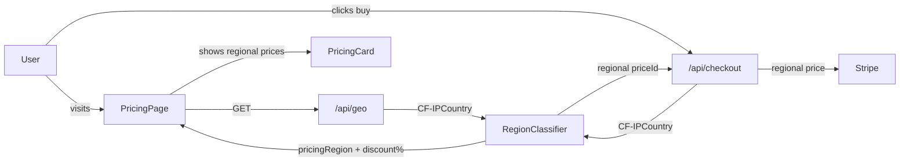
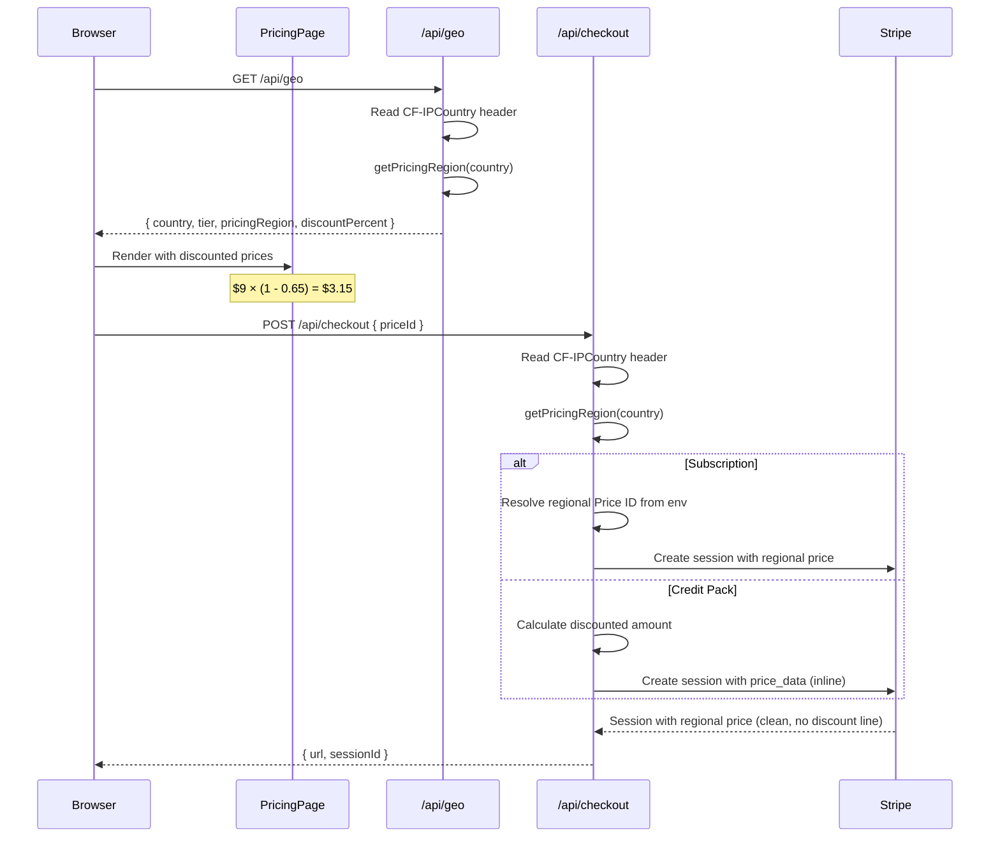

# Regional Dynamic Pricing System

**Complexity: 7 → HIGH mode**
**Date:** 2026-03-06
**Status:** Draft

---

## 1. Context

**Problem:** Users from India and Philippines visit the site but don't convert — $9/mo (~₹750 / ₱500) is too expensive relative to local purchasing power. We need PPP-adjusted pricing with a clean UX (no visible "discount" line — users just see their regional price).

**Files Analyzed:**

- `lib/anti-freeloader/region-classifier.ts` — existing region tier system
- `app/api/geo/route.ts` — geo endpoint returning country + tier
- `client/hooks/useRegionTier.ts` — client-side geo hook
- `app/api/checkout/route.ts` — Stripe checkout session creation
- `shared/config/subscription.config.ts` — pricing source of truth
- `shared/config/stripe.ts` — Stripe exports (STRIPE_PRICES, SUBSCRIPTION_PLANS)
- `app/[locale]/pricing/PricingPageClient.tsx` — pricing page UI
- `client/components/stripe/PricingCard.tsx` — plan card component
- `client/components/stripe/CreditPackSelector.tsx` — credit pack UI
- `client/components/features/landing/Pricing.tsx` — homepage pricing section
- `server/analytics/types.ts` — analytics event taxonomy

**Current Behavior:**

- All pricing is USD-only ($9/$19/$49/$149/mo, packs $4.99/$14.99/$39.99)
- Region detection exists (`CF-IPCountry` → 'standard'/'restricted') for anti-freeloader only
- Pricing page already shows different messaging per region (credit pack note for PH/IN)
- No price adjustments or Stripe coupons are applied
- Checkout route creates sessions with the same price for all regions

## 2. Solution

**Approach:**

- Create a `PricingRegion` system that maps countries to pricing tiers with discount percentages
- Extend `/api/geo` to return pricing region info alongside existing freeloader tier
- **Subscriptions:** Create separate Stripe Price objects per region (clean UX — user sees "$3.15/mo", not "$9 with 65% discount")
- **Credit packs:** Use Stripe `price_data` inline at checkout with the discounted amount (no extra Price objects needed for one-time payments)
- Route users to the correct Price ID based on `CF-IPCountry` at checkout
- Show regional prices on the pricing page and homepage via the geo hook

**Architecture Diagram:**



**Key Decisions:**

- **Separate Price objects for subscriptions** (not coupons) — user sees a clean "$3.15/mo" in Stripe Checkout, no "Discount" line. Coupons always show a discount breakdown which feels less polished.
- **Inline `price_data` for credit packs** — Stripe allows custom amounts for one-time payments, so no extra Price objects needed. User sees "$1.75" cleanly.
- **Server-side country detection only** — `CF-IPCountry` header is set by Cloudflare edge, unforgeable by client
- **Regional Price IDs stored in env vars** — not hardcoded, easy to rotate or change in Stripe Dashboard
- **Existing anti-freeloader system reused** — same `getRegionTier()` pattern, extended with pricing-specific regions
- **No DB migration needed** — region data is transient (detected per-request), prices are Stripe-side

**Data Changes:** None (Price objects are Stripe-side, region mapping is in-code config)

**Why not coupons?** Stripe Checkout (hosted and embedded) always shows a "Discount" line when a coupon is applied. User sees "$9.00 → Discount -$5.85 → Total $3.15" which reveals the full price and feels like a promotion rather than their actual price. Regional Price objects give a seamless UX where "$3.15/mo" is just the price.

## 3. Sequence Flow



---

## 4. Execution Phases

### Phase 1: Pricing Region Config — "Region classifier returns pricing discount info"

**Files (4):**

- `shared/config/pricing-regions.ts` — NEW: pricing region definitions
- `lib/anti-freeloader/region-classifier.ts` — add `getPricingRegion()` export
- `app/api/geo/route.ts` — extend response with pricing region
- `tests/unit/pricing/pricing-regions.unit.spec.ts` — NEW: unit tests

**Implementation:**

- [ ] Create `shared/config/pricing-regions.ts` with:
  - `PricingRegion` type: `'standard' | 'south_asia' | 'southeast_asia' | 'latam' | 'eastern_europe' | 'africa'`
  - `IPricingRegionConfig` interface: `{ region, discountPercent, couponEnvKey, countries[] }`
  - `PRICING_REGIONS` array with configs:
    - `standard`: 0% discount (US, CA, GB, DE, FR, JP, AU, etc.)
    - `south_asia`: 65% discount (IN, PK, BD, LK, NP)
    - `southeast_asia`: 60% discount (PH, ID, VN, TH, MM, KH, LA)
    - `latam`: 50% discount (BR, MX, CO, AR, PE, CL, EC, VE, BO, PY, UY)
    - `eastern_europe`: 40% discount (UA, RO, BG, RS, HR, BA, MK, AL, MD, GE)
    - `africa`: 65% discount (NG, KE, ZA, GH, ET, TZ, UG, RW, SN, CI)
  - `getPricingRegion(countryCode: string): IPricingRegionConfig` function
  - `getDiscountPercent(countryCode: string): number` helper
  - `getCouponEnvKey(countryCode: string): string | null` helper
- [ ] Export `getPricingRegion` from `region-classifier.ts` (re-export from pricing-regions for colocation)
- [ ] Extend `/api/geo` response to include `pricingRegion` and `discountPercent`

**Tests Required:**

| Test File | Test Name | Assertion |
|-----------|-----------|-----------|
| `tests/unit/pricing/pricing-regions.unit.spec.ts` | `should return south_asia for IN` | `expect(getPricingRegion('IN').region).toBe('south_asia')` |
| same | `should return southeast_asia for PH` | `expect(getPricingRegion('PH').region).toBe('southeast_asia')` |
| same | `should return standard for US` | `expect(getPricingRegion('US').discountPercent).toBe(0)` |
| same | `should return 65% discount for India` | `expect(getDiscountPercent('IN')).toBe(65)` |
| same | `should return 60% discount for Philippines` | `expect(getDiscountPercent('PH')).toBe(60)` |
| same | `should handle case-insensitive country codes` | `expect(getPricingRegion('in').region).toBe('south_asia')` |
| same | `should return standard for unknown country` | `expect(getPricingRegion('XX').region).toBe('standard')` |
| same | `should return standard for Tor (T1)` | `expect(getPricingRegion('T1').region).toBe('standard')` |

**Verification Plan:**

1. Unit tests pass for all region mappings
2. `/api/geo` returns new fields

---

### Phase 2: Regional Price Routing in Checkout — "Checkout uses clean regional prices"

**Files (4):**

- `shared/config/env.ts` — add regional Price ID env vars to `serverEnvSchema`
- `app/api/checkout/route.ts` — route to regional price based on country
- `server/analytics/types.ts` — add `pricingRegion` to checkout event properties
- `tests/unit/pricing/checkout-regional.unit.spec.ts` — NEW: unit tests

**Implementation:**

- [ ] Add env vars to `serverEnvSchema` in `env.ts` for regional subscription Price IDs:
  ```
  # South Asia (65% off) — 4 plans × Price ID each
  STRIPE_PRICE_STARTER_SOUTH_ASIA
  STRIPE_PRICE_HOBBY_SOUTH_ASIA
  STRIPE_PRICE_PRO_SOUTH_ASIA
  STRIPE_PRICE_BUSINESS_SOUTH_ASIA
  # Southeast Asia (60% off)
  STRIPE_PRICE_STARTER_SOUTHEAST_ASIA
  STRIPE_PRICE_HOBBY_SOUTHEAST_ASIA
  STRIPE_PRICE_PRO_SOUTHEAST_ASIA
  STRIPE_PRICE_BUSINESS_SOUTHEAST_ASIA
  # LatAm (50% off)
  STRIPE_PRICE_STARTER_LATAM
  STRIPE_PRICE_HOBBY_LATAM
  STRIPE_PRICE_PRO_LATAM
  STRIPE_PRICE_BUSINESS_LATAM
  # Eastern Europe (40% off)
  STRIPE_PRICE_STARTER_EASTERN_EUROPE
  STRIPE_PRICE_HOBBY_EASTERN_EUROPE
  STRIPE_PRICE_PRO_EASTERN_EUROPE
  STRIPE_PRICE_BUSINESS_EASTERN_EUROPE
  # Africa (65% off)
  STRIPE_PRICE_STARTER_AFRICA
  STRIPE_PRICE_HOBBY_AFRICA
  STRIPE_PRICE_PRO_AFRICA
  STRIPE_PRICE_BUSINESS_AFRICA
  ```
  - All default to `''` (empty = fallback to standard price = graceful degradation)
- [ ] Add `getRegionalPriceId(basePriceId, region)` to `pricing-regions.ts`:
  - Maps base Price ID + region → regional Price ID from env
  - Falls back to base Price ID if regional Price is not configured
- [ ] In `checkout/route.ts` POST handler:
  - Read `CF-IPCountry` from request headers (same pattern as `/api/geo`)
  - Call `getPricingRegion(country)` to get region config
  - **For subscriptions**: Call `getRegionalPriceId(priceId, region)` to swap the Price ID
  - **For credit packs**: Use `price_data` with discounted amount instead of `price` reference:
    ```ts
    line_items: [{
      price_data: {
        currency: 'usd',
        product: stripeProductId,   // from the original Price object
        unit_amount: discountedAmountInCents,
      },
      quantity: 1,
    }]
    ```
  - Add `pricing_region` and `discount_percent` to session metadata
- [ ] Add `pricingRegion` field to `ICheckoutStartedProperties` in analytics types

**Tests Required:**

| Test File | Test Name | Assertion |
|-----------|-----------|-----------|
| `tests/unit/pricing/checkout-regional.unit.spec.ts` | `should resolve regional Price ID for south_asia starter` | Returns south_asia Price ID |
| same | `should fallback to base Price ID when regional not configured` | Returns original priceId |
| same | `should not swap price for standard region` | Returns original priceId |
| same | `should calculate discounted amount for credit packs` | `499 * 0.35 = 175 cents` |
| same | `should add pricing_region to metadata` | Metadata includes region |

**Verification Plan:**

1. Unit tests pass
2. Manual: Create test regional Price in Stripe Dashboard, set env var, test checkout from India IP

**Manual setup required (outside code):**

- Create regional Price objects in Stripe Dashboard (one per plan per region = 20 total):
  - Each is a new Price on the same Product, just with a different `unit_amount`
  - Example: Starter product → add Price "$3.15/mo" named "Starter South Asia"
- Copy each Price ID and set in `.env.api`
- **Credit packs don't need extra Price objects** — we use `price_data` inline

---

### Phase 3: Pricing Page UI — "Users see adjusted prices for their region"

**Files (5):**

- `client/hooks/useRegionTier.ts` — extend to return pricing region + discount
- `app/[locale]/pricing/PricingPageClient.tsx` — show discounted prices
- `client/components/stripe/PricingCard.tsx` — accept `discountPercent` prop
- `client/components/stripe/CreditPackSelector.tsx` — show discounted prices
- `tests/unit/pricing/pricing-display.unit.spec.ts` — NEW: UI tests

**Implementation:**

- [ ] Extend `useRegionTier()` hook:
  - Update `IGeoCache` to include `pricingRegion: string` and `discountPercent: number`
  - Return `{ tier, country, isLoading, isRestricted, pricingRegion, discountPercent }`
- [ ] In `PricingPageClient.tsx`:
  - Get `discountPercent` from `useRegionTier()`
  - Pass `discountPercent` to each `PricingCard` component
  - Pass `discountPercent` to `CreditPackSelector`
  - Show a region discount banner when `discountPercent > 0` (e.g., "Special pricing for your region — up to 65% off!")
  - Remove or update existing `CREDIT_PACK_COUNTRIES` / `SUBSCRIPTION_VALUE_COUNTRIES` logic (replace with discount-aware messaging)
- [ ] In `PricingCard.tsx`:
  - Add optional `discountPercent?: number` prop
  - When `discountPercent > 0`, show the **discounted price as the primary price** (clean, no strikethrough):
    ```
    $3.15
    per month
    ```
  - Use `Math.round(price * (1 - discountPercent / 100) * 100) / 100` for display
  - The user just sees their regional price — it's presented as THE price, not a discount
- [ ] In `CreditPackSelector.tsx`:
  - Add optional `discountPercent?: number` prop
  - Show discounted price as the primary price (clean)
  - Update price-per-credit calculation to use discounted price

**Tests Required:**

| Test File | Test Name | Assertion |
|-----------|-----------|-----------|
| `tests/unit/pricing/pricing-display.unit.spec.ts` | `should calculate discounted price correctly` | `$9 * 0.35 = $3.15` |
| same | `should display discounted price as primary (no strikethrough)` | Only discounted price shown |
| same | `should not modify price for standard region` | Normal $9 price shown |
| same | `should show regional banner when discountPercent > 0` | Banner visible |

**Verification Plan:**

1. Unit tests pass
2. Manual: Set `x-test-country: IN` header → pricing page shows $3.15 cleanly

---

### Phase 4: Homepage Pricing + Analytics — "Complete pricing display + tracking"

**Files (4):**

- `client/components/features/landing/Pricing.tsx` — show discounted prices on homepage
- `server/analytics/types.ts` — finalize analytics events
- `tests/unit/pricing/regional-pricing-analytics.unit.spec.ts` — NEW: analytics tests
- `tests/unit/pricing/homepage-pricing.unit.spec.ts` — NEW: homepage pricing tests

**Implementation:**

- [ ] In `Pricing.tsx` (homepage):
  - Use `useRegionTier()` to get `discountPercent`
  - When discount > 0, show regional price cleanly (no strikethrough, no "was $X")
  - Update `generateProductJsonLd` to use regional price for schema markup
- [ ] Add analytics event properties:
  - Add `pricingRegion?: string` and `discountPercent?: number` to `IPricingPageViewedProperties`
  - Add `pricingRegion?: string` and `discountPercent?: number` to `ICheckoutStartedProperties`
  - Add `pricingRegion?: string` to `ICheckoutCompletedProperties`
- [ ] Track `pricingRegion` in pricing page view event (`PricingPageClient.tsx`)
- [ ] Track `pricingRegion` in checkout started event (`checkout/route.ts`)

**Tests Required:**

| Test File | Test Name | Assertion |
|-----------|-----------|-----------|
| `tests/unit/pricing/homepage-pricing.unit.spec.ts` | `should show discounted price on homepage when region has discount` | Discounted amount displayed |
| `tests/unit/pricing/regional-pricing-analytics.unit.spec.ts` | `should include pricingRegion in pricing_page_viewed` | Property present |
| same | `should include pricingRegion in checkout_started` | Property present |

**Verification Plan:**

1. All unit tests pass
2. `yarn verify` passes
3. Manual: Check homepage pricing from different geo test headers

---

### Phase 5: Anti-Abuse & Edge Cases — "VPN abuse is mitigated"

**Files (3):**

- `app/api/checkout/route.ts` — billing address validation
- `shared/config/pricing-regions.ts` — document abuse considerations
- `tests/unit/pricing/anti-abuse.unit.spec.ts` — NEW: anti-abuse tests

**Implementation:**

- [ ] In checkout route, add optional billing address country check:
  - If the user's `signup_country` (from anti-freeloader system) is a standard-tier country but their current `CF-IPCountry` is a discounted region → apply discount (benefit of the doubt)
  - If `CF-IPCountry` is a discounted region → apply discount (this is the expected case)
  - If `CF-IPCountry` is standard → no discount (VPN from India using US VPN = no discount, acceptable)
  - Log `pricing_region_mismatch` event when signup_country ≠ checkout country for monitoring
- [ ] Document in pricing-regions.ts the abuse model:
  - CF-IPCountry is Cloudflare-edge-set → not spoofable by client
  - VPN users get the VPN exit node's country → acceptable tradeoff
  - Fingerprint system already catches multi-account fraud
  - Stripe's billing address is an additional signal but not enforced (some users use international cards)

**Tests Required:**

| Test File | Test Name | Assertion |
|-----------|-----------|-----------|
| `tests/unit/pricing/anti-abuse.unit.spec.ts` | `should apply discount based on CF-IPCountry not signup_country` | Discount applied per request IP |
| same | `should not apply discount when CF-IPCountry is standard` | No coupon for US/GB/DE |
| same | `should handle missing CF-IPCountry gracefully (standard)` | Defaults to no discount |

**Verification Plan:**

1. All tests pass
2. `yarn verify` passes
3. Manual: Test checkout with different country headers

---

## 5. Pricing Summary

| Region | Countries | Discount | Starter | Hobby | Pro | Business |
|--------|-----------|----------|---------|-------|-----|----------|
| Standard | US, CA, GB, DE, etc. | 0% | $9 | $19 | $49 | $149 |
| South Asia | IN, PK, BD, LK, NP | 65% | $3.15 | $6.65 | $17.15 | $52.15 |
| Southeast Asia | PH, ID, VN, TH, etc. | 60% | $3.60 | $7.60 | $19.60 | $59.60 |
| LatAm | BR, MX, CO, AR, etc. | 50% | $4.50 | $9.50 | $24.50 | $74.50 |
| Eastern Europe | UA, RO, BG, RS, etc. | 40% | $5.40 | $11.40 | $29.40 | $89.40 |
| Africa | NG, KE, ZA, GH, etc. | 65% | $3.15 | $6.65 | $17.15 | $52.15 |

**Credit Packs with Discount:**

| Pack | Standard | S. Asia (65%) | SE Asia (60%) | LatAm (50%) | E. Europe (40%) |
|------|----------|---------------|---------------|-------------|-----------------|
| Small (50) | $4.99 | $1.75 | $2.00 | $2.50 | $2.99 |
| Medium (200) | $14.99 | $5.25 | $6.00 | $7.50 | $8.99 |
| Large (600) | $39.99 | $14.00 | $16.00 | $20.00 | $23.99 |

---

## 6. Acceptance Criteria

- [ ] All 5 phases complete
- [ ] All specified tests pass
- [ ] `yarn verify` passes
- [ ] Feature is reachable (pricing page shows regional prices, checkout uses correct Price ID)
- [ ] Analytics track `pricingRegion` on checkout events
- [ ] Regional Stripe Price objects created and env vars configured
- [ ] No pricing regression for standard (US/EU) users
- [ ] Graceful degradation if coupon env vars are missing (no crash, standard price applied)

---

## 7. Manual Stripe Setup (Required)

Create regional Price objects in Stripe Dashboard **before** deploying.

### Subscription Prices (20 Price objects)

For each of the 4 subscription plans (Starter, Hobby, Pro, Business), create a regional Price on the **same Product**:

1. Go to Stripe Dashboard → Products → select "Starter" product
2. Click "Add another price"
3. Set:
   - **Price:** Regional amount (see table below)
   - **Recurring:** Monthly
   - **Nickname:** "Starter — South Asia" (for your reference)
4. Copy the Price ID and add to `.env.api`

| Plan | Standard | S. Asia ($) | SE Asia ($) | LatAm ($) | E. Europe ($) | Africa ($) |
|------|----------|-------------|-------------|-----------|---------------|------------|
| Starter | $9.00 | $3.15 | $3.60 | $4.50 | $5.40 | $3.15 |
| Hobby | $19.00 | $6.65 | $7.60 | $9.50 | $11.40 | $6.65 |
| Pro | $49.00 | $17.15 | $19.60 | $24.50 | $29.40 | $17.15 |
| Business | $149.00 | $52.15 | $59.60 | $74.50 | $89.40 | $52.15 |

### Env Vars (`.env.api`)

```
# Regional subscription Price IDs (leave empty to fallback to standard price)
STRIPE_PRICE_STARTER_SOUTH_ASIA=price_xxx
STRIPE_PRICE_HOBBY_SOUTH_ASIA=price_xxx
STRIPE_PRICE_PRO_SOUTH_ASIA=price_xxx
STRIPE_PRICE_BUSINESS_SOUTH_ASIA=price_xxx

STRIPE_PRICE_STARTER_SOUTHEAST_ASIA=price_xxx
STRIPE_PRICE_HOBBY_SOUTHEAST_ASIA=price_xxx
STRIPE_PRICE_PRO_SOUTHEAST_ASIA=price_xxx
STRIPE_PRICE_BUSINESS_SOUTHEAST_ASIA=price_xxx

STRIPE_PRICE_STARTER_LATAM=price_xxx
STRIPE_PRICE_HOBBY_LATAM=price_xxx
STRIPE_PRICE_PRO_LATAM=price_xxx
STRIPE_PRICE_BUSINESS_LATAM=price_xxx

STRIPE_PRICE_STARTER_EASTERN_EUROPE=price_xxx
STRIPE_PRICE_HOBBY_EASTERN_EUROPE=price_xxx
STRIPE_PRICE_PRO_EASTERN_EUROPE=price_xxx
STRIPE_PRICE_BUSINESS_EASTERN_EUROPE=price_xxx

STRIPE_PRICE_STARTER_AFRICA=price_xxx
STRIPE_PRICE_HOBBY_AFRICA=price_xxx
STRIPE_PRICE_PRO_AFRICA=price_xxx
STRIPE_PRICE_BUSINESS_AFRICA=price_xxx
```

### Credit Packs — No Extra Setup

Credit packs use `price_data` inline at checkout with the calculated regional amount. No extra Stripe Price objects needed.

### Phased Rollout Tip

You can start with just **South Asia + Southeast Asia** (8 Price objects) to validate the approach, then add remaining regions later. The system gracefully falls back to standard pricing for any region without configured Price IDs.
