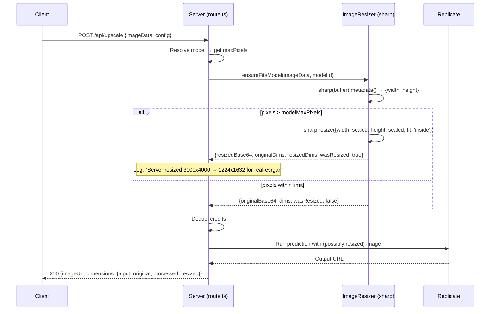

# PRD: Replicate Image Size Safety — Per-Model Server-Side Auto-Resize

**Complexity: 6 → MEDIUM mode**

- Touches 8-10 files (+3)
- External API integration (+1)
- Complex validation + resize logic (+2)

---

## 1. Context

**Problem:** A 3000×4000 (12MP) JPEG bypassed all validation layers and was sent to Replicate's real-esrgan model, which OOM'd with: _"total number of pixels 12000000 greater than the max size that fits in GPU memory on this hardware, 2096704"_. Credits were wasted and the user got an unhelpful generic error.

**Files Analyzed:**

- `shared/validation/upscale.schema.ts` — `decodeImageDimensions()` reads only ~750 bytes (misses JPEG SOF after EXIF)
- `app/api/upscale/route.ts` — skips pixel check when dimensions unknown (line 570-605)
- `app/api/upscale/guest/route.ts` — zero dimension validation
- `server/services/replicate/utils/error-mapper.ts` — doesn't detect GPU OOM errors
- `client/utils/file-validation.ts` — catch block returns `{valid: true}` on decode failure (line 107-110)
- `client/components/features/image-processing/Dropzone.tsx` — resizes to global MAX_PIXELS, not per-model
- `client/utils/image-compression.ts` — client-side resize (robust, uses Canvas API)
- `shared/config/model-costs.config.ts` — per-model pixel limits already defined
- `server/services/blogImageStorage.service.ts` — `sharp` already used in production

**Root Cause — 6 gaps in the auto-resize chain:**

| #   | Gap                                               | Location                     | Why it breaks                                                                   |
| --- | ------------------------------------------------- | ---------------------------- | ------------------------------------------------------------------------------- |
| 1   | JPEG decoder reads only ~750 bytes                | `upscale.schema.ts:324`      | Phone JPEGs have 20-60KB EXIF before SOF marker → decoder returns `null`        |
| 2   | Server skips pixel check when dimensions unknown  | `route.ts:373-376`           | `if (inputDimensions)` gate → null means no check                               |
| 3   | Client catch-all passes through on decode failure | `file-validation.ts:107-110` | `catch { return { valid: true } }` — HEIC, corrupt files bypass validation      |
| 4   | Client resizes to global 1.5MP, not per-model     | `Dropzone.tsx:92`            | Model selected AFTER upload. flux-kontext-fast needs 1.04MP, clarity allows 4MP |
| 5   | Guest route has zero dimension validation         | `guest/route.ts`             | Only checks file size (2MB), not pixel count                                    |
| 6   | No server-side resize exists anywhere             | —                            | If client fails → image hits Replicate as-is → GPU OOM                          |

**Key insight:** Client auto-resize works for the happy path, but has multiple bypass paths. The server is the only reliable enforcement point, and it currently only rejects (when it can decode) — it never resizes. **Sharp is already a dependency and confirmed working at runtime** — used in `server/services/blogImageStorage.service.ts` (called from `/api/blog/images/upload/route.ts` in production on CF Workers with `nodejs_compat`).

**Integration Points Checklist:**

- [x] Entry point: `/api/upscale` POST, `/api/upscale/guest` POST
- [x] Caller: `client/utils/api-client.ts` → `processImage()`
- [x] Integration: New `server/utils/image-resizer.ts` called from both upscale routes BEFORE Replicate call
- [x] Not user-facing UI — transparent resize happens server-side before processing
- [x] No new routes needed

**Full user flow (after fix):**

1. User uploads 3000×4000 JPEG (12MP)
2. Client auto-resize catches it (happy path) OR fails (EXIF issue, HEIC, disabled, bypassed)
3. Server decodes dimensions (fixed decoder reads 32KB, catches 99%+ of JPEGs)
4. Server checks pixels vs **target model's** limit (e.g., real-esrgan = 1.5MP)
5. Image exceeds limit → **sharp auto-resizes** to fit within model's max pixels, maintaining aspect ratio
6. Resized image sent to Replicate → success, no OOM, no wasted credits
7. If sharp resize fails → reject with 422 (last resort, not silent pass-through)

---

## 2. Solution

**Approach:**

1. **Server-side per-model auto-resize using sharp** (core fix): Create `server/utils/image-resizer.ts` that takes base64 image + target model's max pixels, returns resized base64. Called from both upscale routes before Replicate call. Transparent to user.
2. **Fix JPEG dimension decoder**: Increase read window from ~750 bytes to ~32KB so server can detect oversized images reliably (enables smart resize vs. blind resize)
3. **Close null-dimensions gap**: When decode returns null, still attempt sharp resize to the model's max (sharp can read any format including HEIC). If sharp also fails, reject.
4. **Add GPU OOM to error mapper**: Last-resort safety — if somehow an oversized image still reaches Replicate, give actionable error instead of generic failure
5. **Add dimension validation + resize to guest route**: Same sharp-based resize before sending to Replicate

**Architecture:**

```mermaid
flowchart TD
    Upload[Image Upload] --> ClientVal{Client Validation}
    ClientVal -->|Auto-resize| ClientResize[Canvas resize to 1.5MP]
    ClientVal -->|Bypass/Fail| Raw[Raw image]
    ClientResize --> API[/api/upscale]
    Raw --> API
    API --> ModelRes[Resolve target model]
    ModelRes --> GetLimit[Get MODEL_MAX_INPUT_PIXELS for model]
    GetLimit --> SharpCheck{sharp: pixels > model max?}
    SharpCheck -->|Yes| SharpResize[sharp.resize to model max<br/>maintain aspect ratio<br/>JPEG quality 90]
    SharpCheck -->|No| Pass[Image OK]
    SharpResize --> Replicate[Send to Replicate]
    Pass --> Replicate
    Replicate --> Success[Return Result]
```

**Key Decisions:**

- [x] **sharp for resize** — already a dependency, already used in production, Node.js runtime available
- [x] **Per-model limits** — use `MODEL_MAX_INPUT_PIXELS[modelId]` (already defined for all 11 models)
- [x] **Transparent to user** — server resizes silently, user gets result (not rejection)
- [x] **Aspect ratio preserved** — scale factor = `sqrt(maxPixels / actualPixels)`
- [x] **JPEG output at quality 90** — good balance of size/quality for upscaling input
- [x] **Resize BEFORE credit deduction** — user only pays for what actually processes
- [x] **Log resize events** — track when server resize happens (indicates client-side gap)

**Data Changes:** None

---

## 3. Sequence Flow



---

## 4. Execution Phases

### Phase 1: Server-Side Image Resizer Utility — "Sharp-based per-model auto-resize"

**Files (3):**

- `server/utils/image-resizer.ts` — **NEW**: Core resize utility using sharp
- `shared/validation/upscale.schema.ts` — Fix JPEG decoder read window (750 bytes → 32KB)
- `tests/unit/server/image-resizer.unit.spec.ts` — **NEW**: Unit tests for resizer

**Implementation:**

- [ ] Create `server/utils/image-resizer.ts` with:

  ```typescript
  interface IResizeResult {
    imageData: string; // base64 (possibly resized)
    mimeType: string;
    dimensions: { width: number; height: number };
    wasResized: boolean;
    originalDimensions?: { width: number; height: number };
  }

  async function ensureFitsModel(
    imageData: string, // base64 or data URL
    modelId: string, // e.g. 'real-esrgan'
    options?: { quality?: number }
  ): Promise<IResizeResult>;
  ```

- [ ] Implementation: extract base64 → Buffer → `sharp(buffer).metadata()` for dimensions → if `width * height > MODEL_MAX_INPUT_PIXELS[modelId]`, calculate scale factor `sqrt(maxPixels / pixels)` → `sharp.resize({ width: scaledW, height: scaledH, fit: 'inside' }).jpeg({ quality: 90 })` → convert back to base64
- [ ] Handle edge cases: invalid buffer, sharp failure → throw descriptive error (caller decides reject/fallback)
- [ ] Support all formats sharp supports (JPEG, PNG, WebP, HEIC, AVIF, TIFF) — much broader than our manual decoder
- [ ] In `upscale.schema.ts`: Change `base64Data.slice(0, 1000)` to `base64Data.slice(0, 44000)` (~32KB binary) as secondary improvement

**Tests Required:**

| Test File                                      | Test Name                                                 | Assertion                                         |
| ---------------------------------------------- | --------------------------------------------------------- | ------------------------------------------------- |
| `tests/unit/server/image-resizer.unit.spec.ts` | `should resize image exceeding model pixel limit`         | Output pixels ≤ model max, aspect ratio preserved |
| `tests/unit/server/image-resizer.unit.spec.ts` | `should not resize image within model pixel limit`        | Returns original, `wasResized: false`             |
| `tests/unit/server/image-resizer.unit.spec.ts` | `should use per-model limits from MODEL_MAX_INPUT_PIXELS` | real-esrgan=1.5M, clarity=4M, flux-kontext=1.04M  |
| `tests/unit/server/image-resizer.unit.spec.ts` | `should preserve aspect ratio after resize`               | Width/height ratio within 1% of original          |
| `tests/unit/server/image-resizer.unit.spec.ts` | `should handle JPEG with large EXIF data`                 | Correctly reads dimensions via sharp metadata     |
| `tests/unit/server/image-resizer.unit.spec.ts` | `should throw on corrupt/invalid image data`              | Throws descriptive error                          |

**Verification Plan:**

1. **Unit Tests:** All tests above pass
2. **Manual:** Create a 3000×4000 test JPEG, pass through `ensureFitsModel('real-esrgan')` → verify output is ≤1.5MP

---

### Phase 2: Integrate Resizer into Authenticated Upscale Route — "No oversized image reaches Replicate"

**Files (2):**

- `app/api/upscale/route.ts` — Call `ensureFitsModel()` after model resolution, before credit deduction
- `tests/unit/api/upscale-resize.unit.spec.ts` — Integration tests

**Implementation:**

- [ ] After model resolution (line ~496) and before credit calculation (line ~608), add:
  ```typescript
  // Server-side auto-resize: ensure image fits within model's pixel limit
  const resizeResult = await ensureFitsModel(validatedInput.imageData, resolvedModelId);
  if (resizeResult.wasResized) {
    logger.info('Server auto-resized image for model', {
      userId,
      modelId: resolvedModelId,
      originalDimensions: resizeResult.originalDimensions,
      resizedDimensions: resizeResult.dimensions,
      maxPixels: MODEL_MAX_INPUT_PIXELS[resolvedModelId],
    });
    // Use resized image data for processing
    validatedInput.imageData = resizeResult.imageData;
  }
  // Update inputDimensions with sharp's reliable reading (replaces flaky decoder)
  const inputDimensions = resizeResult.dimensions;
  ```
- [ ] Remove the existing `decodeImageDimensions()` call and the `if (inputDimensions)` pixel check block (lines 356-605) — sharp-based resize replaces both the decode AND the validation. The decoder becomes redundant since sharp reads all formats reliably.
- [ ] Keep the `decodeImageDimensions` function in schema.ts (it's shared code, may be used elsewhere) but the upscale route no longer depends on it
- [ ] Wrap `ensureFitsModel()` in try/catch: if sharp fails, reject with 422 "Unable to process image. Please try a different format or smaller image." — **never** proceed with unknown-size image

**Tests Required:**

| Test File                                    | Test Name                                               | Assertion                                      |
| -------------------------------------------- | ------------------------------------------------------- | ---------------------------------------------- |
| `tests/unit/api/upscale-resize.unit.spec.ts` | `should auto-resize 12MP JPEG to fit real-esrgan limit` | Replicate receives ≤1.5MP image                |
| `tests/unit/api/upscale-resize.unit.spec.ts` | `should not resize image already within model limit`    | Replicate receives original image              |
| `tests/unit/api/upscale-resize.unit.spec.ts` | `should use correct limit per model`                    | clarity-upscaler allows 4MP, real-esrgan 1.5MP |
| `tests/unit/api/upscale-resize.unit.spec.ts` | `should reject if sharp resize fails`                   | Returns 422, no Replicate call                 |
| `tests/unit/api/upscale-resize.unit.spec.ts` | `should log resize event with dimensions`               | Logger called with original/resized dims       |

**Verification Plan:**

1. **Unit Tests:** All tests pass
2. **Integration:** Upload 12MP JPEG → upscale succeeds (server logged "auto-resized"), no GPU OOM
3. **yarn verify** passes

---

### Phase 3: Guest Route + Error Mapper — "Guest uploads and edge cases covered"

**Files (3):**

- `app/api/upscale/guest/route.ts` — Add sharp-based resize before `processGuestImage()`
- `server/services/replicate/utils/error-mapper.ts` — Add GPU OOM pattern detection
- `tests/unit/services/error-mapper.unit.spec.ts` — Test GPU OOM mapping

**Implementation:**

- [ ] In `guest/route.ts`: After file size validation (line 53), before `processGuestImage()` (line 96):

  ```typescript
  import { ensureFitsModel } from '@server/utils/image-resizer';

  // Auto-resize to fit guest model (real-esrgan)
  const resizeResult = await ensureFitsModel(validated.imageData, GUEST_LIMITS.MODEL);
  const processImageData = resizeResult.imageData;
  // Pass resized data to processGuestImage
  ```

- [ ] In `error-mapper.ts`: Add GPU memory/OOM detection before generic fallback:
  ```typescript
  // Check for GPU memory errors (image too large for model's hardware)
  if (
    message.includes('GPU memory') ||
    message.includes('greater than the max size') ||
    message.includes('out of memory') ||
    message.includes('OOM')
  ) {
    return new ReplicateError(
      'Image is too large for processing. Please use a smaller image or lower resolution.',
      ReplicateErrorCode.IMAGE_TOO_LARGE
    );
  }
  ```
- [ ] Add `IMAGE_TOO_LARGE = 'IMAGE_TOO_LARGE'` to `ReplicateErrorCode` enum
- [ ] In `route.ts` error handler: map `IMAGE_TOO_LARGE` to 422 status code

**Tests Required:**

| Test File                                       | Test Name                                               | Assertion                             |
| ----------------------------------------------- | ------------------------------------------------------- | ------------------------------------- |
| `tests/unit/services/error-mapper.unit.spec.ts` | `should map GPU memory error to IMAGE_TOO_LARGE`        | Returns correct code                  |
| `tests/unit/services/error-mapper.unit.spec.ts` | `should map "greater than max size" to IMAGE_TOO_LARGE` | Exact Replicate error message matched |
| `tests/unit/services/error-mapper.unit.spec.ts` | `should preserve existing error mappings`               | Rate limit, safety, timeout unchanged |

**Verification Plan:**

1. **Unit Tests:** Error mapper + guest route tests pass
2. **yarn verify** passes
3. **curl test for guest route:**

```bash
curl -X POST http://localhost:3000/api/upscale/guest \
  -H "Content-Type: application/json" \
  -d '{"imageData":"<oversized-base64>","mimeType":"image/jpeg","visitorId":"test1234567890"}'
# Expected: 200 success (image was auto-resized), NOT 422 or GPU OOM
```

---

### Phase 4: Response Enhancement + Cleanup — "User knows when resize happened"

**Files (2):**

- `app/api/upscale/route.ts` — Include resize info in response dimensions
- `tests/unit/api/upscale-response.unit.spec.ts` — Verify response shape

**Implementation:**

- [ ] When `resizeResult.wasResized`, include in response `dimensions`:
  ```typescript
  dimensions: {
    input: resizeResult.originalDimensions,   // What user uploaded (3000×4000)
    processed: resizeResult.dimensions,       // What was sent to model (1224×1632)
    output: { width: processed.width * scale, height: processed.height * scale },
    actualScale: scale,
    wasServerResized: true,  // Signal to client
  }
  ```
- [ ] This allows the client to optionally show "Image was automatically resized for optimal processing" info
- [ ] Clean up dead code: remove the now-redundant `if (inputDimensions)` pixel limit check block (replaced by sharp resize in Phase 2)
- [ ] Run `yarn verify` — full pass required

**Tests Required:**

| Test File                                      | Test Name                                                    | Assertion                              |
| ---------------------------------------------- | ------------------------------------------------------------ | -------------------------------------- |
| `tests/unit/api/upscale-response.unit.spec.ts` | `should include wasServerResized in dimensions when resized` | `dimensions.wasServerResized === true` |
| `tests/unit/api/upscale-response.unit.spec.ts` | `should show original and processed dimensions`              | Both present when resized              |
| `tests/unit/api/upscale-response.unit.spec.ts` | `should not include wasServerResized when not resized`       | Field absent or false                  |

---

## 5. Acceptance Criteria

- [ ] All phases complete
- [ ] All specified tests pass
- [ ] `yarn verify` passes
- [ ] **Core guarantee: NO image exceeding a model's pixel limit ever reaches Replicate**
- [ ] Server auto-resizes using sharp (per-model limits from `MODEL_MAX_INPUT_PIXELS`)
- [ ] Works for all formats sharp supports (JPEG, PNG, WebP, HEIC, AVIF)
- [ ] JPEGs with large EXIF data (phone photos) are correctly handled
- [ ] Guest route has the same resize protection
- [ ] GPU OOM errors (if they somehow still occur) map to actionable "resize" message
- [ ] Response includes original vs processed dimensions when resize occurred
- [ ] No credits wasted on GPU OOM failures
- [ ] Client-side auto-resize continues to work as before (this is additive server-side safety net)
