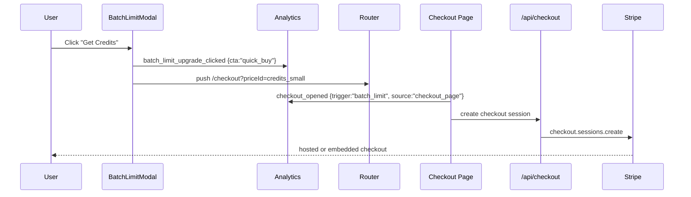
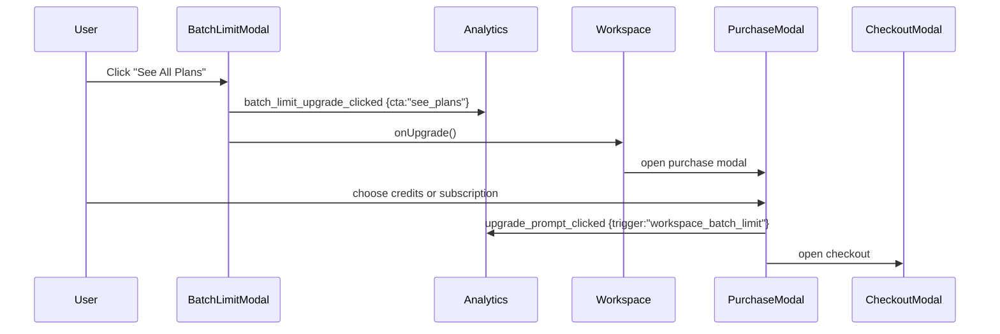
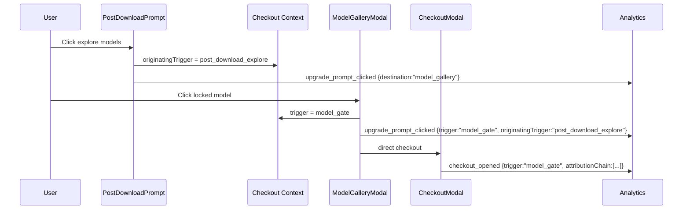

# PRD: Revenue Funnel Telemetry and Checkout Repair

**Date:** 2026-05-07  
**Status:** Ready for implementation  
**Owner:** Growth / Billing  
**Complexity:** 8 -> HIGH mode

---

## 0. Complexity Assessment

**Score: 8 -> HIGH mode**

- +3 touches 10+ files across checkout UI, analytics API, tests, and docs
- +1 external API integration: Stripe checkout session creation and Stripe Dashboard log audit
- +2 complex state logic: auth redirect, hosted vs embedded checkout, attribution context, abandonment timers
- +2 user-facing UI changes: batch paywall CTA, upgrade prompt placement, discount offer surface

This PRD is intentionally structured as proof-first work because the reported funnel could be a mixed failure: broken product path, broken telemetry, or both.

---

## 1. Context

**Problem:** Revenue-intent events show severe leaks in batch-limit checkout, checkout completion, upgrade prompts, and discount CTAs; code inspection shows at least one telemetry taxonomy mismatch that can make a working path look dead.

### Files Analyzed

- `client/components/features/workspace/BatchLimitModal.tsx`
- `client/components/features/workspace/Workspace.tsx`
- `client/components/features/workspace/PostDownloadPrompt.tsx`
- `client/components/features/workspace/ModelGalleryModal.tsx`
- `client/components/features/workspace/MobileUpgradePrompt.tsx`
- `client/components/features/workspace/UpgradeSuccessBanner.tsx`
- `client/components/stripe/PurchaseModal.tsx`
- `client/components/stripe/CheckoutModal.tsx`
- `client/components/engagement-discount/EngagementDiscountBanner.tsx`
- `client/hooks/useCheckoutFlow.ts`
- `client/hooks/useCheckoutSession.ts`
- `client/hooks/useUpgradeAbandonmentDetector.ts`
- `client/services/stripeService.ts`
- `client/utils/checkoutTrackingContext.ts`
- `client/analytics/analyticsClient.ts`
- `app/[locale]/checkout/page.tsx`
- `app/api/checkout/route.ts`
- `app/api/analytics/event/route.ts`
- `server/analytics/types.ts`
- `tests/unit/client/batch-limit-modal.unit.spec.ts`
- `tests/unit/client/engagement-discount-banner.unit.spec.tsx`
- `tests/unit/client/components/EngagementDiscountBanner.source.unit.spec.tsx`
- `tests/unit/client/hooks/useCheckoutSession.unit.spec.ts`
- `tests/unit/bugfixes/analytics-event-whitelist.unit.spec.ts`
- Prior PRDs: `docs/PRDs/click-to-checkout-conversion-fix.md`, `docs/PRDs/engagement-based-first-purchase-discount.md`

### Current Behavior

- The report references `batch_limit_upgrade_clicked`, but `BatchLimitModal.tsx` currently emits `batch_limit_quick_buy_clicked` and `batch_limit_see_plans_clicked`.
- `app/api/analytics/event/route.ts` allows `batch_limit_upgrade_clicked`, but does not allow `batch_limit_quick_buy_clicked` or `batch_limit_see_plans_clicked`. If client events are sent through this route, the current batch CTA events are dropped.
- Batch quick-buy closes the modal and routes to `/checkout?priceId=${NEXT_PUBLIC_STRIPE_PRICE_CREDITS_SMALL}`. This may work, but it does not produce a clean `batch_limit_upgrade_clicked -> checkout_opened` funnel.
- Model-gate direct checkout already exists: `ModelGalleryModal` calls `onUpgradeDirect`, and `Workspace` emits `checkout_opened` with `source: 'direct_checkout'`.
- `post_download_explore` intentionally routes to the model gallery, not checkout. It is a discovery CTA, so one-step conversion reporting undercounts assisted conversions through `model_gate`.
- The discount offer is implemented as a fixed bottom banner named `EngagementDiscountBanner`, while telemetry labels it as `engagement_discount_toast_*`. The reported 12-day median from shown to clicked is inconsistent with the current 30-minute expiry and needs telemetry validation before UX changes are trusted.
- `CheckoutModal` uses hosted Stripe checkout on mobile and embedded checkout on desktop. The reported `network_error` checkout failures could be genuine API failures, Stripe session creation failures, stale price IDs, or client-side event loss.

### Source Data From Prompt

- Batch limit: 404 modals, 85 upgrade clicks, 0 checkouts, 0 purchases.
- Checkout: 181 checkouts, 23 purchases, 13% checkout-to-purchase, with many zero-purchase days and 3 `network_error` checkout errors.
- Upgrade prompts: 8,023 shown, about 535 clicked, about 6.7% CTR; `post_download_explore` has highest volume and weak timing.
- Discount: 195 shown, 2 clicked, 1 checkout, 0 purchases; observed click latency suggests broken visibility or attribution.

---

## 2. Integration Points Checklist

**How will this work be reached?**

- [x] Entry points identified:
  - Batch limit modal: `BatchLimitModal` quick-buy and see-plans buttons.
  - Upgrade prompt funnel: `PostDownloadPrompt`, `ModelGalleryModal`, `MobileUpgradePrompt`, `UpgradeSuccessBanner`, `PurchaseModal`.
  - Checkout: `CheckoutModal`, `/checkout?priceId=...`, `/api/checkout`.
  - Discount offer: `EngagementDiscountBanner`, `useUpgradeAbandonmentDetector`, `/api/engagement-discount/eligibility`.
- [x] Caller files identified:
  - `Workspace.tsx` wires batch modal, model gallery, direct checkout modal, and discount banner.
  - `useCheckoutSession.ts` calls `StripeService.createCheckoutSession`.
  - `stripeService.ts` calls `/api/checkout`.
  - `analyticsClient.ts` emits client analytics and internal bus events.
- [x] Registration/wiring needed:
  - Update analytics allowlist/schema for actual batch-limit events.
  - Add canonical bridge event or alias from batch CTAs to `batch_limit_upgrade_clicked`.
  - Ensure checkout-opened events include `trigger`, `source`, `originatingTrigger`, and `attributionChain`.

**Is this user-facing?**

- [x] YES
  - Batch limit modal CTA behavior and analytics.
  - Post-download prompt timing/volume.
  - Discount banner placement and visibility.
  - Checkout error handling and price consistency.

**Full user flow**

1. User exceeds batch limit.
2. `BatchLimitModal` opens and emits modal impression.
3. User clicks quick-buy or see-plans.
4. Code emits a canonical upgrade click event and opens checkout or purchase modal.
5. `CheckoutModal` or `/checkout` emits `checkout_opened`.
6. `/api/checkout` creates Stripe session with the price and discount the user saw.
7. Stripe webhook confirms purchase and emits purchase/completion analytics.

---

## 3. Solution

### Approach

1. **Prove telemetry first.** Add a deterministic funnel contract test for batch limit CTA -> checkout opened, and align event names so reporting cannot miss real clicks.
2. **Repair batch paywall handoff.** Make both batch CTA paths emit canonical `batch_limit_upgrade_clicked` plus CTA-specific properties, then verify quick-buy opens checkout and see-plans opens a purchase path.
3. **Audit checkout failures end to end.** Add diagnostics around `/api/checkout` failures, Stripe price validation, displayed price vs charged price, and hosted/embedded mode outcomes.
4. **Reframe discovery prompts.** Stop evaluating `post_download_explore` as a direct checkout trigger. Either reduce its volume or report it as assisted conversion through `model_gate`.
5. **Make discount visibility measurable.** Rename or supplement toast events with banner-visible metrics, prove viewport visibility in Playwright, then test a modal only if the banner is visible but still ignored.

### Architecture Diagram

```mermaid
flowchart LR
    BL[BatchLimitModal] -->|canonical click| A[Analytics API]
    BL -->|quick buy| CP[/checkout?priceId=credits_small]
    BL -->|see plans| PM[PurchaseModal]
    CP --> CM[CheckoutModal/Page Checkout]
    PM --> CM
    CM --> API[/api/checkout]
    API --> S[Stripe Checkout Session]
    S --> WH[Stripe Webhook]
    WH --> REV[Purchase Analytics]

    PD[post_download_explore] --> MG[ModelGalleryModal]
    MG -->|model_gate| CM
```

### Key Decisions

- Keep existing direct checkout infrastructure; do not rebuild Stripe flow.
- Treat `batch_limit_upgrade_clicked` as the canonical reporting event and attach `cta: 'quick_buy' | 'see_plans'`.
- Keep `batch_limit_quick_buy_clicked` and `batch_limit_see_plans_clicked` only if dashboards need legacy detail; otherwise remove or alias them in analytics.
- Treat `post_download_explore` as an assisted-conversion origin, not a failed direct-checkout CTA.
- Do not change prices or Stripe IDs until Stripe Dashboard confirms stale IDs or price mismatches.
- Add telemetry assertions before UX experiments so a future dashboard regression is caught in tests.

### Data Changes

None expected. This PRD reuses existing analytics payloads, sessionStorage checkout context, Supabase profiles, and Stripe metadata.

---

## 4. Sequence Flows

### Batch Quick-Buy



### Batch See-Plans



### Discovery Prompt Attribution



---

## 5. Execution Phases

### Phase 1: Telemetry Contract and Batch Event Repair

**User-visible outcome:** Batch-limit upgrade clicks are visible in analytics and can be joined to checkout-opened events.

**Files (max 5):**

- `client/components/features/workspace/BatchLimitModal.tsx` - emit canonical event from both upgrade CTAs.
- `app/api/analytics/event/route.ts` - allow actual batch CTA events or standardize to canonical event only.
- `server/analytics/types.ts` - align event-name union and properties.
- `tests/unit/client/batch-limit-modal.unit.spec.ts` - assert canonical event and CTA-specific properties.
- `tests/unit/bugfixes/analytics-event-whitelist.unit.spec.ts` - assert allowlist accepts the emitted events.

**Implementation:**

- [ ] Add `analytics.track('batch_limit_upgrade_clicked', { cta: 'quick_buy', ... })` before quick-buy navigation.
- [ ] Add `analytics.track('batch_limit_upgrade_clicked', { cta: 'see_plans', ... })` before opening purchase modal.
- [ ] Decide whether to keep `batch_limit_quick_buy_clicked` and `batch_limit_see_plans_clicked`; if kept, add them to allowlist and type union.
- [ ] Ensure properties include `limit`, `attempted`, `currentCount`, `availableSlots`, `serverEnforced`, `userType`, and `copyVariant`.
- [ ] Update tests so event names in component, type system, and API allowlist match exactly.

**Tests Required:**

| Test File                                                    | Test Name                                       | Assertion                                                                        |
| ------------------------------------------------------------ | ----------------------------------------------- | -------------------------------------------------------------------------------- |
| `tests/unit/client/batch-limit-modal.unit.spec.ts`           | `quick buy emits canonical batch upgrade event` | `analytics.track` receives `batch_limit_upgrade_clicked` with `cta: 'quick_buy'` |
| `tests/unit/client/batch-limit-modal.unit.spec.ts`           | `see plans emits canonical batch upgrade event` | `analytics.track` receives `batch_limit_upgrade_clicked` with `cta: 'see_plans'` |
| `tests/unit/bugfixes/analytics-event-whitelist.unit.spec.ts` | `accepts all emitted batch limit CTA events`    | event schema parses every event emitted by `BatchLimitModal`                     |

**User Verification:**

- Action: Open batch modal, click quick-buy and see-plans in dev with analytics dev logging enabled.
- Expected: Dev console shows canonical `batch_limit_upgrade_clicked`; backend analytics route accepts the same event name.

---

### Phase 2: Batch Paywall Checkout Handoff Proof

**User-visible outcome:** Clicking batch quick-buy reliably reaches checkout; clicking see-plans opens a purchase path that can reach checkout.

**Files (max 5):**

- `client/components/features/workspace/BatchLimitModal.tsx` - adjust quick-buy destination if needed.
- `app/[locale]/checkout/page.tsx` - ensure `/checkout?priceId=...` emits `checkout_opened` with `trigger: 'batch_limit'`.
- `client/components/features/workspace/Workspace.tsx` - preserve batch trigger through purchase modal and direct checkout.
- `tests/e2e/batch-limit-checkout-funnel.e2e.spec.ts` - add user-flow proof.
- `tests/unit/client/batch-limit-modal.unit.spec.ts` - route assertion for quick-buy.

**Implementation:**

- [ ] Verify whether locale routing expects `/checkout` or `/{locale}/checkout`; if locale-aware routing is required, update `router.push`.
- [ ] Ensure quick-buy sets checkout context before navigation: `{ trigger: 'batch_limit' }`.
- [ ] Ensure checkout page reads the context and emits `checkout_opened` with `source: 'checkout_page'`, `trigger: 'batch_limit'`, and `priceId`.
- [ ] Ensure see-plans opens `PurchaseModal` with `trigger: 'workspace_batch_limit'` or normalized `batch_limit`.
- [ ] Add Playwright coverage with mocked auth/session so the flow proves checkout opening, not only click handling.

**Tests Required:**

| Test File                                           | Test Name                                                  | Assertion                                                                             |
| --------------------------------------------------- | ---------------------------------------------------------- | ------------------------------------------------------------------------------------- |
| `tests/e2e/batch-limit-checkout-funnel.e2e.spec.ts` | `quick buy reaches checkout from batch limit modal`        | click produces a visible checkout route/modal and `checkout_opened` analytics payload |
| `tests/e2e/batch-limit-checkout-funnel.e2e.spec.ts` | `see plans reaches purchase modal from batch limit modal`  | click opens purchase modal with batch trigger                                         |
| `tests/unit/client/batch-limit-modal.unit.spec.ts`  | `quick buy routes to checkout with credits small price id` | `router.push` receives checkout URL with configured price id                          |

**User Verification:**

- Action: As a free authenticated user, add more files than allowed and click quick-buy.
- Expected: Stripe checkout opens for the small credit pack and analytics contains the batch trigger.

---

### Phase 3: Checkout-to-Purchase Failure Audit and Diagnostics

**User-visible outcome:** Checkout failures show actionable diagnostics; stale price IDs and displayed-vs-charged price mismatches are caught before users reach Stripe.

**Files (max 5):**

- `app/api/checkout/route.ts` - add structured logging and safe error codes around Stripe session creation.
- `client/hooks/useCheckoutSession.ts` - include checkout mode, trigger, and price id in `checkout_error`.
- `client/services/stripeService.ts` - preserve API error codes for UI and analytics.
- `tests/unit/client/hooks/useCheckoutSession.unit.spec.ts` - assert error telemetry contains actionable fields.
- `tests/unit/api/checkout-price-alignment.unit.spec.ts` - add price consistency assertions if missing.

**Implementation:**

- [ ] Log Stripe session creation failures with `priceId`, `resolvedPrice.type`, `checkoutMode`, `pricingRegion`, `discountPercent`, `uiMode`, and Stripe error `code/param/type`.
- [ ] Track `checkout_error` with `trigger`, `source`, `priceId`, `uiMode`, and `errorCode`.
- [ ] Verify configured env price IDs in `shared/config/env.ts` against Stripe Dashboard for production mode.
- [ ] In Stripe Dashboard, inspect the 181 sessions and classify non-purchases: abandoned, card declined, session expired, payment failed, blocked, price mismatch, or webhook missing.
- [ ] Compare displayed regional/engagement/checkout-rescue prices to final Stripe `unit_amount` for at least one checkout per pricing region.

**Tests Required:**

| Test File                                                             | Test Name                                                   | Assertion                                                      |
| --------------------------------------------------------------------- | ----------------------------------------------------------- | -------------------------------------------------------------- |
| `tests/unit/client/hooks/useCheckoutSession.unit.spec.ts`             | `tracks checkout error with price and ui mode`              | `checkout_error` includes `priceId`, `uiMode`, and `errorCode` |
| `tests/unit/api/checkout-price-alignment.unit.spec.ts`                | `uses inline price_data amount matching displayed discount` | Stripe session params match expected amount                    |
| `tests/unit/api/subscription-price-resolution-fallbacks.unit.spec.ts` | `rejects or logs stale configured Stripe price id`          | stale price produces explicit error path                       |

**User Verification:**

- Action: Force a bad price id in local/test configuration.
- Expected: UI shows a checkout error, analytics logs `checkout_error` with useful fields, and server logs identify the bad price.

---

### Phase 4: Upgrade Prompt Attribution and Prompt Mix

**User-visible outcome:** Discovery prompts no longer look like broken checkout prompts; high-intent blocks are easier to optimize.

**Files (max 5):**

- `client/components/features/workspace/PostDownloadPrompt.tsx` - reduce frequency or mark as discovery-only.
- `client/components/features/workspace/ModelGalleryModal.tsx` - ensure assisted attribution is preserved.
- `client/utils/checkoutTrackingContext.ts` - harden attribution chain behavior if needed.
- `tests/unit/client/components/PostDownloadPrompt.attribution.unit.spec.tsx` - assert discovery attribution.
- `tests/unit/analytics/upgrade-funnel-attribution.unit.spec.ts` - assert reporting chain.

**Implementation:**

- [ ] Keep `post_download_explore` only if it is evaluated as `destination: 'model_gallery'`, not direct checkout.
- [ ] If reducing volume, cap post-download prompt to first successful download per session and suppress it after a checkout attempt.
- [ ] Add `originatingTrigger` and `attributionChain` to all downstream `model_gate` and `checkout_opened` events.
- [ ] Define dashboard metrics:
  - Direct funnel: `upgrade_prompt_clicked(trigger) -> checkout_opened(trigger)`.
  - Assisted funnel: `upgrade_prompt_clicked(originatingTrigger) -> checkout_opened(attributionChain contains originatingTrigger)`.
- [ ] Prioritize optimization of `model_gate`, `mobile_preview_prompt`, `premium_upsell`, `after_batch`, and `insufficient_credits` as purchase-intent moments.

**Tests Required:**

| Test File                                                                   | Test Name                                            | Assertion                                                      |
| --------------------------------------------------------------------------- | ---------------------------------------------------- | -------------------------------------------------------------- |
| `tests/unit/client/components/PostDownloadPrompt.attribution.unit.spec.tsx` | `post download prompt stores originating trigger`    | context contains `originatingTrigger: 'post_download_explore'` |
| `tests/unit/analytics/upgrade-funnel-attribution.unit.spec.ts`              | `checkout_opened carries assisted attribution chain` | event props include `attributionChain`                         |
| `tests/unit/client/upgrade-prompts.unit.spec.tsx`                           | `post download prompt is frequency capped`           | prompt does not show repeatedly after cap                      |

**User Verification:**

- Action: Download an image, click explore models, then click a locked model.
- Expected: Checkout opens from `model_gate`; analytics carries `originatingTrigger: 'post_download_explore'`.

---

### Phase 5: Discount Offer Visibility and Placement Test

**User-visible outcome:** The discount offer is visibly reachable when fired, and CTA clicks start checkout with the discount trigger.

**Files (max 5):**

- `client/components/engagement-discount/EngagementDiscountBanner.tsx` - add visibility-safe layout and optional stronger placement variant.
- `client/components/features/workspace/Workspace.tsx` - wire modal/banner experiment variant if needed.
- `client/hooks/useUpgradeAbandonmentDetector.ts` - ensure timer source and eligibility are tracked.
- `tests/unit/client/engagement-discount-banner.unit.spec.tsx` - visibility and CTA analytics assertions.
- `tests/e2e/engagement-discount.e2e.spec.ts` - viewport visibility proof.

**Implementation:**

- [ ] Rename reporting label in dashboards from "toast" to "discount offer" or add a new `engagement_discount_offer_shown` event while preserving legacy events.
- [ ] Add viewport-safe CSS checks for mobile tab bar, bottom safe-area inset, and checkout modal overlap.
- [ ] Track `engagement_discount_cta_clicked` with `engagement_discount_source`, `timeRemainingSeconds`, and `targetPriceId`.
- [ ] Ensure CTA sets checkout context `{ trigger: 'engagement_discount_banner' }` and opens checkout for `NEXT_PUBLIC_STRIPE_PRICE_CREDITS_MEDIUM`.
- [ ] If Playwright proves banner is visible and CTR remains below 2%, add a modal variant for abandonment source only.

**Tests Required:**

| Test File                                                            | Test Name                                                             | Assertion                                         |
| -------------------------------------------------------------------- | --------------------------------------------------------------------- | ------------------------------------------------- |
| `tests/unit/client/engagement-discount-banner.unit.spec.tsx`         | `CTA tracks source and target price`                                  | event includes source and target pack             |
| `tests/e2e/engagement-discount.e2e.spec.ts`                          | `discount offer is visible above mobile chrome`                       | CTA bounding box is within viewport and clickable |
| `tests/unit/client/hooks/useUpgradeAbandonmentDetector.unit.spec.ts` | `abandonment timer creates visible offer only when no checkout opens` | checkout event cancels timer                      |

**User Verification:**

- Action: Trigger an upgrade click, do not open checkout, wait for abandonment offer in a controlled test.
- Expected: Discount offer is visible, CTA opens checkout, and checkout metadata includes `checkout_trigger: engagement_discount_banner`.

---

## 6. Verification Strategy

### Automated Commands

Run targeted tests first:

```bash
yarn vitest tests/unit/client/batch-limit-modal.unit.spec.ts
yarn vitest tests/unit/bugfixes/analytics-event-whitelist.unit.spec.ts
yarn vitest tests/unit/client/hooks/useCheckoutSession.unit.spec.ts
yarn vitest tests/unit/analytics/upgrade-funnel-attribution.unit.spec.ts
yarn vitest tests/unit/client/engagement-discount-banner.unit.spec.tsx
yarn playwright test tests/e2e/batch-limit-checkout-funnel.e2e.spec.ts tests/e2e/engagement-discount.e2e.spec.ts
```

Then run the repo verification command used by CI:

```bash
yarn verify
```

### Manual / External Verification

- Stripe Dashboard:
  - Export sessions for the same 30-day range as the report.
  - Segment sessions by metadata `checkout_trigger`, `price_id`, `pricing_region`, `discount_percent`, and `ui_mode`.
  - Classify non-purchases by Stripe status and payment failure reason.
- Analytics:
  - Confirm batch quick-buy now produces `batch_limit_upgrade_clicked -> checkout_opened`.
  - Confirm old and new batch CTA names are either both accepted or only canonical names are emitted.
  - Confirm `post_download_explore` assisted conversions are counted through `attributionChain`.
- Browser:
  - Desktop and mobile checkout for quick-buy.
  - Discount offer visibility at 375x667, 390x844, 768x1024, and desktop.

---

## 7. Success Metrics

- Batch-limit funnel:
  - `batch_limit_upgrade_clicked -> checkout_opened` should be above 70% for authenticated users.
  - Zero-day target: no more days where batch clicks exist but accepted checkout-opened events are impossible to join.
- Checkout completion:
  - Checkout-to-purchase baseline remains measured, with non-purchase reasons classified for at least 90% of sessions.
  - `network_error` count is either eliminated or tied to explicit error codes.
- Prompt attribution:
  - `post_download_explore` direct funnel is replaced by assisted funnel reporting.
  - `model_gate` and `mobile_preview_prompt` direct checkout rates are reported separately from discovery origins.
- Discount:
  - Discount offer CTA visible in Playwright on mobile and desktop.
  - `engagement_discount_cta_clicked -> checkout_opened` above 50% for authenticated users.

---

## 8. Risks and Open Questions

- The reported `batch_limit_upgrade_clicked` may come from older deployed code, a dashboard alias, or a data transform. Implementation must verify production event taxonomy before deleting any legacy event.
- If most checkout sessions are legitimate abandonment or card declines, code fixes will improve observability but not necessarily purchase rate.
- Hosted mobile checkout redirects away from the app, so client-side `checkout_opened` may not fully represent Stripe page load success.
- Discount click latency of 12 days conflicts with a 30-minute offer window; this likely indicates event identity/session stitching issues or stale dashboard joins.
- Existing dirty worktree changes are unrelated to this PRD and should not be reverted during implementation.

---

## 9. Rollout Plan

1. Ship Phase 1 behind no feature flag; it is telemetry alignment and low user risk.
2. Ship Phase 2 with targeted e2e proof before deploy.
3. Ship Phase 3 diagnostics and review Stripe logs for 48 hours before changing checkout UX.
4. Ship Phase 4 reporting changes before reducing prompt volume, so baseline comparisons are valid.
5. Ship Phase 5 visibility fix; only test modal placement after proving the banner is actually visible.

---

## 10. Definition of Done

- The batch CTA event names emitted by UI, accepted by analytics API, and asserted in tests are identical.
- Batch quick-buy and see-plans each have a passing automated funnel test.
- Checkout errors include enough fields to distinguish stale price IDs, network failures, auth failures, and Stripe declines.
- Stripe Dashboard audit has a written classification for the 181 checkout sessions.
- `post_download_explore` is not judged as a direct checkout CTA in dashboards.
- Discount offer is viewport-visible and its CTA opens checkout with the correct trigger metadata.
