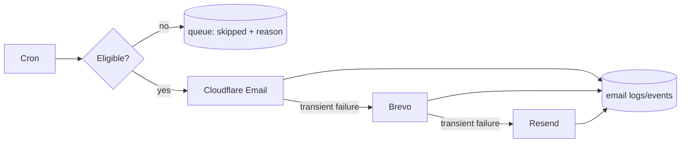

# PRD: Cloudflare Email Primary and Priority Caps

**Status:** Ready  
**Complexity: 6 → MEDIUM mode** (+2 touches 6–10 files, +2 state/policy logic, +1 external integration, +1 background delivery path)

## 1. Context

**Problem:** Lifecycle delivery is suppressed by one blunt marketing cap and provider exhaustion; the configured provider chain still documents free quotas as capacity.

**Files analyzed:** `shared/config/env.ts`, `server/services/email.service.ts`, `server/services/email-lifecycle.service.ts`, `server/services/email-providers/email-provider-manager.ts`, `server/services/email-providers/cloudflare.provider-adapter.ts`, `tests/unit/api/email-lifecycle-cron.unit.spec.ts`, `server/services/email-providers/__tests__/email-provider-manager.test.ts`.

**Current behavior:**

- Cloudflare is already registered as primary, followed by Brevo and Resend.
- Marketing is suppressed after one marketing email in seven days, regardless of revenue priority.
- Transactional campaigns already bypass marketing caps.
- Same-campaign cooldowns, preferences, bounces, and complaints are separate safety checks.
- Provider failures eventually produce a generic all-providers-failed result.

## 2. Integration Points

- **Entry point:** scheduled request to `app/api/cron/email-lifecycle/route.ts`.
- **Caller:** `workers/cron/index.ts` invokes the lifecycle endpoint; `EmailLifecycleService` calls `EmailService`.
- **Wiring:** provider manager keeps Cloudflare first; lifecycle campaign priority/category determines cap policy.
- **User-facing:** No UI. Users receive fewer, better-prioritized messages.

Flow: cron selects due row → suppression policy evaluates priority → Cloudflare sends → Brevo/Resend only handle eligible transient fallback → queue and provider metrics record the outcome.

## 3. Solution

- Make the provider policy explicit as `cloudflare → brevo → resend`; remove free-quota language and do not round-robin for quota harvesting.
- Add a typed campaign priority: `transactional`, `revenue_critical`, `lifecycle`, `education`.
- Preserve preference, unsubscribe, same-campaign cooldown, bounce, and complaint suppression.
- Apply 72-hour/2-per-7-day limits to revenue-critical messages, 7-day limits to lifecycle/education, and a hard 3-marketing-per-7-day emergency ceiling.
- Permit fallback only for transient/provider-unavailable failures; do not retry invalid recipients, complaints, or permanent rejections through another provider.
- Emit structured suppression and provider-fallback reasons for operational measurement.

**Data changes:** Migration adds/backfills `priority` on `email_lifecycle_campaigns` with a constrained value. Existing checkout recovery, credit-wall, low/zero-credit, former-buyer, and high-usage campaigns are `revenue_critical`; blog education is `education`; remaining marketing campaigns are `lifecycle`.

## 4. Execution Phases

### Phase 1: Provider contract — Cloudflare is the paid/default route and fallback is failure-aware

**Files (max 5):**

- `server/services/email-providers/email-provider-manager.ts` — explicit priority and transient/permanent fallback rules.
- `server/services/email-providers/base-email-provider-adapter.ts` — normalized failure classification.
- `server/services/email.service.ts` — accurate provider policy documentation and structured error propagation.
- `server/services/email-providers/__tests__/email-provider-manager.test.ts` — routing tests.
- `tests/unit/server/services/email.service.unit.spec.ts` — service behavior tests.

**Implementation:**

- [ ] Require configured Cloudflare to be attempted first.
- [ ] Fall back on rate limit, timeout, 5xx, or provider unavailable only.
- [ ] Stop on invalid recipient, unsubscribe, complaint, or other permanent rejection.
- [ ] Log attempted providers and terminal classification without secrets or message content.

**Tests required:**

| Test file             | Test name                                                            | Assertion                          |
| --------------------- | -------------------------------------------------------------------- | ---------------------------------- |
| provider manager test | `should use Cloudflare first when configured`                        | Cloudflare receives the first send |
| provider manager test | `should fall back when Cloudflare returns a transient failure`       | Brevo is attempted once            |
| provider manager test | `should not fall back when Cloudflare permanently rejects recipient` | Only Cloudflare is attempted       |

**Verification plan:** Run the two test files; in a non-production environment send one allowlisted message and verify Cloudflare's message ID. Then run `yarn verify`.

### Phase 2: Priority-aware cap — revenue messages flow without removing safety limits

**Files (max 5):**

- `supabase/migrations/YYYYMMDD_email_campaign_priority.sql` — priority column, constraint, and campaign backfill.
- `server/services/email-lifecycle.service.ts` — policy evaluator and reason metadata.
- `tests/unit/api/email-lifecycle-cron.unit.spec.ts` — end-to-end queue eligibility cases.
- `tests/unit/server/services/email-lifecycle-priority.unit.spec.ts` — cap matrix tests.

**Implementation:**

- [ ] Evaluate permanent suppression before priority/frequency rules.
- [ ] Implement the cap matrix exactly as specified above.
- [ ] Prioritize due queue rows by campaign priority, then scheduled time.
- [ ] Keep `forceFrequency` restricted to explicit admin/test paths; never use it in normal cron processing.

**Tests required:**

| Test file               | Test name                                                     | Assertion                              |
| ----------------------- | ------------------------------------------------------------- | -------------------------------------- |
| lifecycle priority test | `should allow revenue-critical email after 72 hours`          | Eligible below rolling limits          |
| lifecycle priority test | `should enforce emergency ceiling across campaign priorities` | Fourth marketing message is suppressed |
| lifecycle priority test | `should always suppress complained recipient`                 | Priority cannot bypass complaint       |
| cron test               | `should process revenue-critical rows before education rows`  | Stable priority ordering               |

**User verification:** Seed only internal recipients across all priorities; confirm sent/skipped outcomes and reasons match the matrix.

## 5. Rollout and Acceptance Criteria

- [ ] Cloudflare paid sending and domain authentication are verified before enabling backlog drain.
- [ ] Start at normal cron throughput for internal/test users, then 5%, 25%, and 100% of eligible backlog.
- [ ] Stop if hard bounce >2%, complaint >0.1%, or provider failure >5% over any 500-send window.
- [ ] Existing preferences and unsubscribe tests remain green.
- [ ] A seven-day dashboard/query exposes sends, suppressions by reason, fallback rate, bounces, complaints, and conversions by campaign priority.
- [ ] Affected tests, `yarn test`, and `yarn verify` pass.
