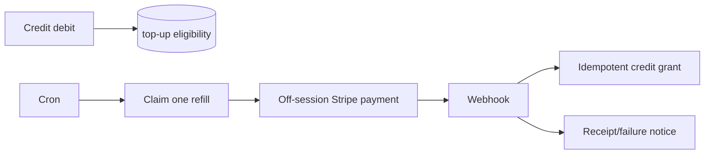

# PRD: Repeat Pack Purchase and Auto Top-Up

**Status:** Product/Stripe design ready; implementation requires explicit approval  
**Complexity: 9 → HIGH mode** (+3 touches 10+ files, +2 new module, +2 payment state/idempotency, +1 database change, +1 Stripe integration)

## 1. Context

**Problem:** Thirty-five percent of pack buyers purchase again, but the product offers no deliberate repeat-purchase path or threshold refill.

**Scope decision:** Start with opt-in auto top-up on the proven Small/Medium pack products. Defer permanent next-pack discounts until refill adoption and repeat-purchase behavior are measured.

## 2. Integration Points

- Entry points: successful pack checkout and billing settings.
- Stripe checkout obtains explicit consent and a reusable payment method/customer relationship.
- Credit debit path emits a lightweight threshold event; it must not call Stripe inline.
- A scheduled/background route claims eligible refills, creates an idempotent off-session payment, and credits only after Stripe confirmation.
- Billing UI shows status, threshold, pack, last refill, and one-click disable.

## 3. Data Changes

- `auto_top_up_settings`: user, enabled, threshold, pack/price identity, Stripe payment method/customer, consent timestamp, failure state, timestamps.
- `auto_top_up_attempts`: unique idempotency key, starting balance, status, Stripe payment intent, amount/currency, credited transaction, error class, timestamps.
- RLS prevents users reading/updating other users; only server paths can write payment identifiers or attempts.

## 4. Execution Phases

### Phase 1: Opt-in and settings — buyer can enable and disable a precise refill rule

**Files (max 5):** migration, checkout/API contract, billing settings component, API unit test, component test.

**Tests:** opt-in is never prechecked; selected threshold/pack persists; disable takes effect immediately; foreign-user access is denied.

**Manual checkpoint:** Stripe test-mode checkout shows clear recurring/off-session consent and billing settings reflect it.

### Phase 2: Safe refill — one threshold crossing produces at most one charge and one credit grant

**Files (max 5):** eligibility service, scheduled route, Stripe webhook handler, service unit test, webhook unit test.

**Implementation:**

- [ ] Claim attempts atomically; use a deterministic Stripe idempotency key.
- [ ] Never charge inside the image/upscale request path.
- [ ] Credit only from a verified successful payment event.
- [ ] Handle concurrent debits, webhook retries, delayed events, and user disable during an in-flight attempt.
- [ ] Disable/pause after a bounded number of failures and notify the user.

**Tests:** concurrent eligibility creates one attempt; duplicate webhook creates one credit transaction; declined payment adds no credits; disabled setting prevents new charge.

### Phase 3: Repeat-purchase prompt — eligible prior buyers can buy the last pack in one short flow

**Files (max 5):** post-purchase/low-balance prompt component, selection helper, analytics event types, component test, E2E test.

**Implementation:** Show a non-blocking “buy again” path to prior pack buyers, defaulting to their last purchased pack while exposing all packs. Do not apply an unapproved discount.

## 5. Checkpoints and Acceptance Criteria

After each phase, an automated PRD checkpoint review must compare implementation to this PRD and run affected tests plus `yarn verify`. Phases 1 and 2 also require manual Stripe test-mode evidence before continuing.

- [ ] Auto top-up is explicit opt-in and easy to disable.
- [ ] At-most-once charge and credit behavior is proven under concurrency/retries.
- [ ] Currency/region price comes from validated Stripe/config resolution, never a client amount.
- [ ] Receipts and failure notices use Cloudflare Email primary.
- [ ] Metrics cover opt-in, successful refill, decline, disable, repeat-purchase conversion, and support/refund rate.
- [ ] Roll out to staff, then 5%, 25%, and 100% of eligible prior pack buyers with a kill switch.
