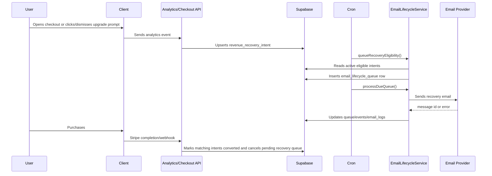

# Revenue Recovery Email Cohorts

## Complexity

Complexity: 11 -> HIGH mode

- +3 touches 10+ files
- +2 new recovery audience/import module
- +2 complex state logic across analytics, checkout, lifecycle queue, and purchases
- +1 database schema changes
- +1 external API integration with Amplitude Behavioral Cohorts API
- +2 background jobs plus email/provider operations

## Context

**Problem:** High-intent users are abandoning checkout, upgrade prompts, and credit-wall prompts, but the app only has generic lifecycle drips and a client-side rescue offer, so these users are not reliably targeted by email.

**Files analyzed:**

- `docs/PRDs/checkout-recovery-system.md`
- `docs/PRDs/email-lifecycle-retention-drip-strategy.md`
- `docs/PRDs/click-to-checkout-conversion-fix.md`
- `workers/cron/index.ts`
- `workers/cron/wrangler.toml`
- `app/api/cron/email-lifecycle/route.ts`
- `server/services/email-lifecycle.service.ts`
- `server/services/email.service.ts`
- `server/services/email-providers/base-email-provider-adapter.ts`
- `supabase/migrations/20260607011814_create_email_lifecycle_tables.sql`
- `app/api/analytics/event/route.ts`
- `client/hooks/useCheckoutAnalytics.ts`
- `client/hooks/useCheckoutSession.ts`
- `client/hooks/useUpgradeAbandonmentDetector.ts`
- `app/api/checkout/route.ts`
- `shared/config/env.ts`

**Current behavior:**

- Lifecycle emails are queued in `email_lifecycle_queue` and sent by `/api/cron/email-lifecycle`.
- Existing campaigns cover low credits, zero credits, first result follow-up, unused credits, and win-back.
- There is no seeded campaign or template for checkout abandoners, upgrade clickers with no purchase, credit-wall dismissers, or high-usage free users.
- The client tracks `checkout_opened`, `checkout_abandoned`, `upgrade_prompt_clicked`, and `upgrade_prompt_dismissed`, but the app does not persist a first-party recovery audience table.
- The production secret currently has `AMPLITUDE_API_KEY`, but no `AMPLITUDE_SECRET_KEY`. Amplitude cohort download APIs require API key + secret-key basic auth.
- The email system is mostly healthy, but the queue is behind: at least 1,000 due pending lifecycle emails were observed while the daily cron defaults to `batchSize=50` and `scanLimit=100`.

## Target Audiences

| Priority | Audience                          | Source                                                                         | Initial size | Message                                                                          |
| -------- | --------------------------------- | ------------------------------------------------------------------------------ | -----------: | -------------------------------------------------------------------------------- |
| 1        | Checkout Abandoners               | Existing Amplitude cohort `i1u84c2g`; future first-party checkout intent table |          ~60 | "Your cart is still waiting" with direct checkout and optional 10% 24h incentive |
| 2        | Upgrade Clickers, No Purchase     | Existing Amplitude cohort `o4y4ltj8`; future first-party upgrade intent table  |         ~230 | "You tried to unlock X" with direct upgrade link                                 |
| 3        | `insufficient_credits` Dismissers | New first-party event persistence or Amplitude query/cohort                    |         ~400 | Outcome-first credit pack email 24-48h after dismiss                             |
| 4        | High-Usage Free Users             | Profiles + job/credit usage                                                    |     ~150-200 | Proactive "You have used X of your free upscales" before the wall                |

## Goals

1. Send revenue-recovery emails to the two live Amplitude cohorts without hand-exporting CSVs.
2. Add first-party audience capture so future targeting does not depend on Amplitude cohort exports.
3. Add recovery lifecycle campaigns with frequency caps, preference handling, purchase cancellation, and attribution.
4. Fix lifecycle email throughput so due pending emails do not sit for weeks.
5. Prove email delivery, recovery attribution, and cron queue health with tests and production-safe verification.

## Non-Goals

- Do not replace Amplitude analytics.
- Do not build a full marketing automation product.
- Do not email anonymous users unless we have a lawful email address and consent basis.
- Do not bypass unsubscribe/preferences for marketing emails.
- Do not trigger real production sends during verification without an explicit dry-run or test recipient path.

## Key Decisions

- Reuse `email_lifecycle_campaigns`, `email_lifecycle_queue`, `email_lifecycle_events`, `email_logs`, and `EmailLifecycleService` instead of adding a separate email queue.
- Add a first-party `revenue_recovery_intents` table for future audiences, but use Amplitude cohort import for the two cohorts that already exist.
- Add `AMPLITUDE_SECRET_KEY` to production secrets before using Amplitude Behavioral Cohorts API. Keep it server-only in `serverEnv`.
- Prefer direct checkout links with signed recovery tokens over generic `/pricing` CTAs.
- Use existing engagement/checkout rescue discount infrastructure where possible. Introduce a separate recovery coupon only if product wants a distinct 10% checkout-abandon incentive.
- Increase cron throughput by running the lifecycle processor more often and by making batch controls explicit, bounded, and observable.

## External API Notes

Amplitude Behavioral Cohorts API supports listing cohorts with `GET https://amplitude.com/api/3/cohorts` and `includeSyncInfo=true`, then downloading a cohort via an async request/poll/download flow. Authentication uses basic auth with `{api_key}:{secret_key}`. Official docs also note download concurrency and rate limits, so import jobs must be idempotent and bounded.

Amplitude cohort sync destinations can push cohorts to marketing platforms, but this repo does not currently have Braze, Customer.io, Klaviyo, Iterable, HubSpot, or Userlist credentials in production secrets. Current production marketing/email keys found: `RESEND_API_KEY`, `BREVO_API_KEY`, and `AMPLITUDE_API_KEY`.

References:

- https://amplitude.com/docs/apis/analytics/behavioral-cohorts
- https://amplitude.com/docs/data/sync-cohorts-with-destinations
- https://amplitude.com/docs/partners/receiving-behavioral-cohorts

## Architecture

```mermaid
flowchart LR
    Client[Checkout and upgrade events] --> AnalyticsAPI[/api/analytics/event]
    AnalyticsAPI --> Amplitude[Amplitude]
    AnalyticsAPI --> IntentDB[(revenue_recovery_intents)]
    AmplitudeAPI[Amplitude Cohort Import] --> ImportAPI[/api/admin/recovery-cohorts/import]
    ImportAPI --> IntentDB
    IntentDB --> Lifecycle[EmailLifecycleService]
    Lifecycle --> Queue[(email_lifecycle_queue)]
    Cron[myimageupscaler-cron] --> EmailCron[/api/cron/email-lifecycle]
    EmailCron --> Queue
    EmailCron --> EmailProviders[Cloudflare/Brevo/Resend]
    EmailProviders --> Logs[(email_logs)]
    StripeWebhook[Stripe webhooks] --> Lifecycle
    StripeWebhook --> IntentDB
```

## Data Changes

### `revenue_recovery_intents`

Stores one row per user per active recovery audience, with enough context to queue a specific campaign and cancel it on purchase.

```sql
CREATE TABLE public.revenue_recovery_intents (
  id UUID PRIMARY KEY DEFAULT gen_random_uuid(),
  user_id UUID NOT NULL REFERENCES public.profiles(id) ON DELETE CASCADE,
  audience_key TEXT NOT NULL,
  source TEXT NOT NULL,
  source_id TEXT NULL,
  price_id TEXT NULL,
  purchase_type TEXT NULL CHECK (purchase_type IN ('subscription', 'credit_pack') OR purchase_type IS NULL),
  selected_key TEXT NULL,
  trigger TEXT NULL,
  pricing_region TEXT NULL,
  credits_remaining INTEGER NULL,
  free_usage_count INTEGER NULL,
  context JSONB NOT NULL DEFAULT '{}',
  status TEXT NOT NULL DEFAULT 'active' CHECK (status IN ('active', 'queued', 'converted', 'suppressed', 'expired')),
  first_seen_at TIMESTAMPTZ NOT NULL DEFAULT NOW(),
  last_seen_at TIMESTAMPTZ NOT NULL DEFAULT NOW(),
  queued_at TIMESTAMPTZ NULL,
  converted_at TIMESTAMPTZ NULL,
  created_at TIMESTAMPTZ NOT NULL DEFAULT NOW(),
  updated_at TIMESTAMPTZ NOT NULL DEFAULT NOW(),
  UNIQUE (user_id, audience_key)
);

CREATE INDEX idx_revenue_recovery_intents_status_seen
  ON public.revenue_recovery_intents(status, last_seen_at DESC);
CREATE INDEX idx_revenue_recovery_intents_audience_status
  ON public.revenue_recovery_intents(audience_key, status);
```

### Campaign Seeds

Add campaign rows:

- `checkout-abandoned-24h`
- `upgrade-click-no-purchase-24h`
- `credit-wall-dismissed-48h`
- `high-usage-free-user`

All are `marketing` type and must honor `marketing_emails` unless a future legal review classifies a message as transactional.

## Sequence Flow



## Integration Points

**How will this feature be reached?**

- Entry points:
  - `/api/analytics/event` for first-party recovery intent capture.
  - `/api/checkout` for checkout session/intention metadata.
  - `/api/webhooks/stripe` for purchase conversion/cancellation.
  - `/api/cron/email-lifecycle` for queueing and sending.
  - New admin-only `/api/admin/recovery-cohorts/import` for importing the two existing Amplitude cohorts.
- Caller files:
  - `client/hooks/useCheckoutAnalytics.ts`
  - `client/hooks/useCheckoutSession.ts`
  - existing upgrade prompt components that already call `analytics.track`
  - `workers/cron/index.ts`
- Registration/wiring:
  - Add cron route mapping and/or increase lifecycle cron frequency.
  - Add server env variables for `AMPLITUDE_SECRET_KEY` and cohort IDs.
  - Seed campaigns and templates.

**Is this user-facing?**

- Yes. Users receive emails with direct links. No new in-app UI is required for phase 1 beyond existing preferences/unsubscribe.

**Full user flow:**

1. User opens checkout, clicks upgrade, dismisses insufficient-credit prompt, or approaches free limit.
2. App records a recovery intent either from Amplitude cohort import or first-party event capture.
3. Lifecycle cron queues the correct campaign after the required delay.
4. Email service sends a recovery email with signed CTA link.
5. User clicks the email, returns to pricing/checkout/upscale, and purchases.
6. Stripe webhook records purchase attribution and cancels pending recovery emails.

## Execution Phases

### Phase 0: Secrets and Read-Only Cohort Discovery - Amplitude import can be safely authenticated.

**Files:**

- `shared/config/env.ts` - ensure `AMPLITUDE_SECRET_KEY` remains server-only and add optional cohort ID config.
- `docs/PRDs/revenue-recovery-email-cohorts.md` - update verification evidence after discovery.
- GCloud Secret Manager only - add `AMPLITUDE_SECRET_KEY` to `myimageupscaler-api-prod` using the safe fetch-modify-push flow.

**Implementation:**

- [ ] Fetch current prod API secret to a temp file.
- [ ] Add `AMPLITUDE_SECRET_KEY` only after obtaining it from Amplitude.
- [ ] Optionally add:
  - `AMPLITUDE_COHORT_CHECKOUT_ABANDONERS=i1u84c2g`
  - `AMPLITUDE_COHORT_UPGRADE_CLICKERS_NO_PURCHASE=o4y4ltj8`
- [ ] Verify `GET /api/3/cohorts?includeSyncInfo=true` can see both cohorts.
- [ ] Do not log cohort member emails or raw identifiers.

**Tests Required:**

| Test File                                   | Test Name                                  | Assertion                                        |
| ------------------------------------------- | ------------------------------------------ | ------------------------------------------------ |
| `tests/unit/shared/config/env.unit.spec.ts` | `should keep amplitude secret server-only` | `serverEnv` exposes secret, `clientEnv` does not |

**User Verification:**

- Action: Run read-only cohort list script with masked output.
- Expected: Both cohort IDs resolve and sync info is visible; no user PII printed.

### Phase 1: Immediate Cohort Import and Queueing - The two live Amplitude cohorts can receive recovery emails.

**Files:**

- `server/services/amplitude-cohort.service.ts` - list/request/poll/download cohort members.
- `server/services/revenue-recovery.service.ts` - import members and upsert recovery intents.
- `app/api/admin/recovery-cohorts/import/route.ts` - admin-only dry-run/import endpoint.
- `supabase/migrations/YYYYMMDD_create_revenue_recovery_intents.sql` - recovery intent table.
- `server/services/__tests__/revenue-recovery.service.test.ts` - import and dedupe tests.

**Implementation:**

- [ ] Build Amplitude client using `serverEnv.AMPLITUDE_API_KEY` and `serverEnv.AMPLITUDE_SECRET_KEY`.
- [ ] Support dry-run import for a cohort ID and audience key.
- [ ] Match cohort users to `profiles` by user ID first; only use email if present and verified in app data.
- [ ] Upsert `revenue_recovery_intents` with `source='amplitude_cohort'`.
- [ ] Queue:
  - `checkout-abandoned-24h` for cohort `i1u84c2g`.
  - `upgrade-click-no-purchase-24h` for cohort `o4y4ltj8`.
- [ ] Enforce no duplicate pending queue row per user/campaign.

**Tests Required:**

| Test File                                                    | Test Name                                                                 | Assertion                                          |
| ------------------------------------------------------------ | ------------------------------------------------------------------------- | -------------------------------------------------- |
| `server/services/__tests__/amplitude-cohort.service.test.ts` | `should poll and download cohort members when request succeeds`           | Mocked API pages return normalized identifiers     |
| `server/services/__tests__/revenue-recovery.service.test.ts` | `should upsert imported checkout abandoners without duplicate queue rows` | Same user imported twice creates one active intent |
| `tests/unit/api/recovery-cohort-import.unit.spec.ts`         | `should return 401 when admin auth is missing`                            | Admin route rejects unauthenticated calls          |
| `tests/unit/api/recovery-cohort-import.unit.spec.ts`         | `should not persist rows during dry run`                                  | Response contains counts only                      |

**User Verification:**

- Action: Run admin import in `dryRun=true` for both cohort IDs.
- Expected: Counts match expected sizes, with matched/unmatched counts and zero queued emails.
- Action: Run import for a tiny test cohort or test user only.
- Expected: One pending lifecycle email is created and no real broad send happens.

### Phase 2: Recovery Campaigns, Templates, and Direct Links - Users receive audience-specific emails.

**Files:**

- `supabase/migrations/YYYYMMDD_seed_revenue_recovery_campaigns.sql` - campaign seeds.
- `emails/templates/CheckoutRecoveryEmail.tsx` - checkout and upgrade recovery template.
- `emails/templates/CreditWallRecoveryEmail.tsx` - credit-wall/high-usage template.
- `server/services/email-providers/base-email-provider-adapter.ts` - template loader/subjects.
- `server/services/email-lifecycle.service.ts` - queue recovery campaigns and signed CTA data.

**Implementation:**

- [ ] Add template names:
  - `checkout-recovery`
  - `credit-wall-recovery`
- [ ] Add subject lines:
  - Checkout abandoner: `Your checkout is still waiting`
  - Upgrade clicker: `Unlock the feature you tried to use`
  - Credit wall dismisser: `Finish more images with more credits`
  - High-usage free user: `You are close to your free upscale limit`
- [ ] Add signed direct CTA links:
  - Checkout abandoners -> `/pricing?recovery=checkout-abandoned&intent=...`
  - Upgrade clickers -> `/pricing?recovery=upgrade-click&trigger=...`
  - Credit wall dismissers -> `/pricing?recovery=credit-wall`
  - High-usage free users -> `/pricing?recovery=free-limit`
- [ ] Include UTM tags and `queue_id` click tracking through existing `/api/email/click`.
- [ ] Add optional discount fields, but gate discount rollout behind config:
  - `RECOVERY_CHECKOUT_DISCOUNT_ENABLED`
  - `STRIPE_RECOVERY_COUPON_ID`
- [ ] On purchase, call `recordPurchaseAttribution` and mark matching recovery intents `converted`.

**Tests Required:**

| Test File                                                    | Test Name                                                     | Assertion                              |
| ------------------------------------------------------------ | ------------------------------------------------------------- | -------------------------------------- |
| `tests/unit/emails/checkout-recovery-email.unit.spec.tsx`    | `should render checkout recovery CTA with no raw token leak`  | Rendered HTML has CTA and no secret    |
| `tests/unit/emails/credit-wall-recovery-email.unit.spec.tsx` | `should render outcome-first copy for credit wall dismissers` | Copy does not lead with "buy credits"  |
| `server/services/__tests__/email-lifecycle.service.test.ts`  | `should queue checkout recovery with click tracking`          | Queue row template data has signed CTA |
| `tests/unit/api/stripe-webhooks-email.unit.spec.ts`          | `should cancel pending recovery emails after purchase`        | Pending recovery rows become cancelled |

**User Verification:**

- Action: Send a dev/test recovery email to a controlled account.
- Expected: Email renders, CTA returns to the app, and click/purchase attribution records.

### Phase 3: First-Party Recovery Intent Capture - New users enter cohorts without Amplitude import.

**Files:**

- `app/api/analytics/event/route.ts` - persist selected revenue recovery events.
- `server/services/revenue-recovery.service.ts` - event-to-intent mapping.
- `app/api/checkout/route.ts` - persist checkout session intent with price/plan context.
- `app/api/webhooks/stripe/handlers/payment.handler.ts` - convert/cancel recovery intents.
- `tests/unit/api/analytics-recovery-intents.unit.spec.ts` - analytics capture tests.

**Implementation:**

- [ ] On `checkout_opened`, upsert `audience_key='checkout_abandoner'`.
- [ ] On `checkout_abandoned`, update intent context with abandon method/step/time.
- [ ] On `upgrade_prompt_clicked`, upsert `audience_key='upgrade_click_no_purchase'`.
- [ ] On `upgrade_prompt_dismissed` with `trigger='insufficient_credits'`, upsert `audience_key='credit_wall_dismissed'`.
- [ ] On `/api/checkout` session creation, persist `price_id`, purchase type, selected key, pricing region, and Stripe session ID if available.
- [ ] On successful Stripe purchase, mark all active recovery intents for that user as `converted` and cancel pending recovery emails.
- [ ] Do not persist events for unauthenticated users unless a verified user ID is present.

**Tests Required:**

| Test File                                                | Test Name                                                                   | Assertion                                         |
| -------------------------------------------------------- | --------------------------------------------------------------------------- | ------------------------------------------------- |
| `tests/unit/api/analytics-recovery-intents.unit.spec.ts` | `should upsert checkout abandoner intent when checkout_opened is tracked`   | DB insert has `audience_key='checkout_abandoner'` |
| `tests/unit/api/analytics-recovery-intents.unit.spec.ts` | `should upsert credit wall intent only for insufficient_credits dismissals` | Other triggers are ignored                        |
| `tests/unit/api/checkout-price-alignment.unit.spec.ts`   | `should persist recovery intent context after creating checkout session`    | Intent has `price_id` and `selected_key`          |
| `tests/unit/api/stripe-webhooks-email.unit.spec.ts`      | `should mark recovery intents converted after checkout completion`          | `status='converted'`                              |

**User Verification:**

- Action: In a test account, click upgrade, open checkout, close it, and inspect intent rows.
- Expected: One checkout intent exists, then becomes converted after a test purchase.

### Phase 4: Credit-Wall and High-Usage Eligibility - Lower-intent but high-volume users are queued.

**Files:**

- `server/services/revenue-recovery.service.ts` - eligibility scanner.
- `server/services/email-lifecycle.service.ts` - call scanner during daily eligibility.
- `tests/unit/server/services/revenue-recovery.service.test.ts` - eligibility tests.
- `tests/unit/server/services/email-lifecycle.service.test.ts` - queue integration tests.
- `docs/technical/email-system.md` - add short operational note only if implementation changes behavior.

**Implementation:**

- [ ] Queue `credit-wall-dismissed-48h` only after 24-48h delay and no purchase.
- [ ] Queue `high-usage-free-user` when user is near free limit, has not purchased, and has not received another marketing email within cap.
- [ ] Use existing preference and frequency cap checks.
- [ ] Prioritize audiences when a user qualifies for several:
  1. checkout abandoner
  2. upgrade clicker
  3. credit wall dismisser
  4. high-usage free user
- [ ] Do not queue a lower-priority recovery email if a higher-priority one is pending or sent within 7 days.

**Tests Required:**

| Test File                                                     | Test Name                                                                 | Assertion                         |
| ------------------------------------------------------------- | ------------------------------------------------------------------------- | --------------------------------- |
| `tests/unit/server/services/revenue-recovery.service.test.ts` | `should queue credit wall recovery after delay when no purchase exists`   | Eligible intent creates queue row |
| `tests/unit/server/services/revenue-recovery.service.test.ts` | `should suppress high usage free email when checkout recovery is pending` | No lower-priority row created     |
| `server/services/__tests__/email-lifecycle.service.test.ts`   | `should honor marketing opt out for recovery campaigns`                   | Skipped row/event recorded        |

**User Verification:**

- Action: Run cron endpoint with `dryRun=true`.
- Expected: Response reports eligible counts by audience without creating rows.

### Phase 5: Lifecycle Cron Throughput and Observability - Pending queue drains predictably.

**Files:**

- `workers/cron/wrangler.toml` - increase lifecycle cron cadence.
- `workers/cron/index.ts` - route multiple lifecycle schedules with explicit parameters.
- `app/api/cron/email-lifecycle/route.ts` - add bounded loop and queue health response.
- `workers/cron/index.test.ts` - schedule routing tests.
- `tests/unit/workers/cron-router.unit.spec.ts` - route coverage.

**Implementation:**

- [ ] Change email lifecycle cron from once daily to every 15 minutes or hourly.
- [ ] Use query params from worker route, for example:
  - normal run: `batchSize=100&scanLimit=250`
  - catch-up run: `batchSize=250&scanLimit=500`
- [ ] Add hard max bounds in API route:
  - `batchSize <= 250`
  - `scanLimit <= 1000`
- [ ] Return queue health:
  - due pending count
  - oldest pending scheduled time
  - sent/skipped/failed counts
  - processing duration
- [ ] Add structured logs for lifecycle cron start/end/failure.
- [ ] Add a follow-up runbook command to inspect queue health without sending: `dryRun=true`.

**Tests Required:**

| Test File                                          | Test Name                                                            | Assertion                                             |
| -------------------------------------------------- | -------------------------------------------------------------------- | ----------------------------------------------------- |
| `workers/cron/index.test.ts`                       | `should route email lifecycle catch-up schedule with bounded params` | Fetch URL includes expected query params              |
| `tests/unit/api/email-lifecycle-cron.unit.spec.ts` | `should cap batchSize above max`                                     | Request with `batchSize=9999` uses max                |
| `tests/unit/api/email-lifecycle-cron.unit.spec.ts` | `should include queue health in response`                            | JSON has `duePending` and `oldestPendingScheduledFor` |

**User Verification:**

- Action: Run `/api/cron/email-lifecycle?dryRun=true&batchSize=250&scanLimit=500`.
- Expected: No sends, queue health returned.
- Action: Tail Cloudflare for one scheduled run after deploy.
- Expected: Worker logs `Email Lifecycle completed successfully`.

## Operational Requirements

- Never send recovery campaigns to broad imported cohorts until a dry-run has reported:
  - cohort size
  - matched profiles
  - skipped missing email
  - suppressed preference
  - already purchased
  - duplicate pending
- Keep a kill switch:
  - `RECOVERY_EMAILS_ENABLED=false` disables all new recovery queueing.
  - Existing pending rows can be cancelled by admin script if needed.
- Add an admin-only dry-run endpoint before any production send.
- Add a database query/runbook for:
  - due pending lifecycle queue count
  - oldest due pending row
  - failed emails in last 24h
  - recovery sends/clicks/purchases by campaign

## Acceptance Criteria

- [ ] Production secrets include `AMPLITUDE_SECRET_KEY` if Amplitude import is enabled.
- [ ] The two live cohorts can be imported in dry-run with no PII printed.
- [ ] Recovery intent rows dedupe by `(user_id, audience_key)`.
- [ ] Each of the four audiences has a campaign seed, template, tests, and queueing logic.
- [ ] Marketing preferences and frequency caps apply to all four campaigns.
- [ ] Purchases cancel pending recovery emails and mark intents converted.
- [ ] Lifecycle cron can process at least 1,000 due emails per day without manual intervention.
- [ ] Dry-run queue health is available and covered by tests.
- [ ] `yarn test` passes for affected areas.
- [ ] `yarn verify` passes before deployment.

## Rollout Plan

1. Deploy Phase 5 cron throughput first or alongside Phase 1, otherwise new campaigns will worsen backlog.
2. Import and send only to a controlled test cohort.
3. Send Audience 1 to 10 users, monitor failures/clicks/purchases for 24 hours.
4. Roll Audience 1 to the full cohort.
5. Roll Audience 2 after Audience 1 metrics are clean.
6. Enable Audience 3 and Audience 4 from first-party eligibility only after frequency caps are verified.

## Metrics

- Recovery email sent count by campaign.
- Delivery failure rate by provider and template.
- Open rate if provider supports it; click rate via `/api/email/click`.
- Purchase attribution within 7 days of click.
- Revenue per sent email and per clicked email.
- Unsubscribe/preference opt-out rate.
- Due pending lifecycle queue count.
- Oldest pending lifecycle email age.

## Open Questions

1. Should checkout abandoners get a 10% discount immediately, or should the first send be non-discount and the discount be reserved for a second send?
2. Should Audience 2 use the existing 20% engagement discount or a smaller recovery-specific incentive?
3. Do we want to create a custom Amplitude cohort sync destination later, or is first-party capture enough once Phase 3 ships?
4. Should anonymous checkout emails be supported later with explicit consent capture, or should this scope stay authenticated-only?

## Verification Evidence

### Phase 0: Secrets and Read-Only Cohort Discovery

- 2026-07-08: Added `AMPLITUDE_SECRET_KEY` to `myimageupscaler-api-prod` in GCloud Secret Manager using the safe fetch-modify-push flow.
- 2026-07-08: Added cohort ID config to `myimageupscaler-api-prod`:
  - `AMPLITUDE_COHORT_CHECKOUT_ABANDONERS=i1u84c2g`
  - `AMPLITUDE_COHORT_UPGRADE_CLICKERS_NO_PURCHASE=o4y4ltj8`
- 2026-07-08: Verified latest secret version has `AMPLITUDE_SECRET_KEY` present with 32-hex format and existing Stripe secret still appears to be a live key.
- 2026-07-08: Latest enabled secret version observed: `26`; older enabled versions remain available.
- 2026-07-08: Added repeatable read-only cohort discovery script:
  - `scripts/check-recovery-cohorts.ts`
  - `yarn recovery:cohorts:check`
  - `yarn recovery:cohorts:check:prod` after deploy has generated `.env.client.prod` and `.env.api.prod`
- 2026-07-08: The script lists cohort metadata only, masks configured cohort IDs in output, never downloads cohort members, and fails non-zero if either configured recovery cohort is not discoverable.
- 2026-07-08: Added combined recovery verification commands:
  - `yarn recovery:verify:local` runs recovery-focused tests plus local non-send email smoke
  - `yarn recovery:verify:prod` runs prod cohort discovery, target recovery cron dry-run verification, then the local recovery verification gate
- 2026-07-08: Added explicit controlled-account first-party path verifier:
  - `scripts/check-recovery-controlled-path.ts`
  - `yarn recovery:controlled:check -- --write --user-id <test-user-id>`
  - `yarn recovery:controlled:check:prod -- --write --user-id <test-user-id>` after deploy has generated prod env files
  - refuses writes unless `--write` and `--user-id` are supplied, refuses users with existing active/queued recovery intents unless `--allow-existing` is supplied, creates a tagged synthetic recovery queue row without provider sending, verifies conversion cancellation, and cleans verifier rows by default

Still required:

- 2026-07-08: `GET https://amplitude.com/api/3/cohorts?includeSyncInfo=true` authenticated successfully with the latest prod API secret and returned 6 discoverable cohorts, but did not return target cohort IDs `i1u84c2g` or `o4y4ltj8`. The listed discoverable cohorts were different zero-size cohorts, so either the PRD cohort IDs are not discoverable to the prod API key, the IDs changed, or the API key points at a different Amplitude project. No cohort member identifiers or emails were printed.
- 2026-07-08: `npx tsx scripts/check-recovery-cohorts.ts` run with the latest `myimageupscaler-api-prod` GCloud secret reproduced the blocker with masked output:
  - 6 cohort(s) visible
  - `FAIL checkout abandoners: cohort i1***2g was not discoverable`
  - `FAIL upgrade clickers no purchase: cohort o4***j8 was not discoverable`
  - no cohort members downloaded
- 2026-07-08: Added automated config test coverage proving `AMPLITUDE_SECRET_KEY` and recovery cohort IDs are server-only.
- 2026-07-08: Added automated script helper coverage proving configured cohort IDs are masked and missing cohorts fail without printing member identifiers.
- Confirm the correct discoverable Amplitude cohort IDs before running a non-dry-run import.

### Phase 1: Immediate Cohort Import and Queueing

- 2026-07-08: Added server-only recovery cohort env config, `revenue_recovery_intents` migration, read-only Amplitude cohort client, recovery import service, and admin dry-run/import route.
- 2026-07-08: Import implementation matches cohort members to profiles by user ID first, falls back to verified Supabase Auth email only when a profile exists, upserts intents by `(user_id, audience_key)`, checks existing pending queue rows before queueing, and returns count-only import summaries.
- 2026-07-08: Added automated coverage for Amplitude async poll/download parsing, import dry-run/no-persist behavior, duplicate import queue suppression, admin auth rejection, and server-only recovery env config.
- 2026-07-08: Verification:
  - `yarn -s vitest run server/services/__tests__/amplitude-cohort.service.test.ts server/services/__tests__/revenue-recovery.service.test.ts tests/unit/api/recovery-cohort-import.unit.spec.ts tests/unit/config/amplitude-env-fallback.unit.spec.ts` passed: 10 tests.
  - `rm -rf .next/dev/types .next/types && yarn tsc --pretty false --incremental false` passed after removing stale generated Next type output.
  - `yarn verify` passed with existing lint warnings, ICU translation check complete, and schema validation passed.

Still required:

- Resolve the Amplitude cohort ID/project discoverability mismatch before importing the two live cohorts.
- Run admin import in `dryRun=true` for both confirmed cohort IDs and compare matched/unmatched/suppressed counts before any non-dry-run queueing.

### Phase 2: Recovery Campaigns, Templates, and Direct Links

- 2026-07-08: Added recovery campaign seed migration for all four audiences:
  - `checkout-abandoned-24h`
  - `upgrade-click-no-purchase-24h`
  - `credit-wall-dismissed-48h`
  - `high-usage-free-user`
- 2026-07-08: Added renderable `checkout-recovery` and `credit-wall-recovery` email templates and wired them into the base provider adapter.
- 2026-07-08: Added subject-line selection for checkout abandoners, upgrade clickers, credit wall dismissers, and high-usage free users.
- 2026-07-08: Verified recovery CTA URLs are wrapped by the existing signed `/api/email/click` lifecycle click-tracking path during send preparation.
- 2026-07-08: Added recovery-specific CTA destination parameters before click wrapping:
  - checkout abandoners include `intent=checkout_abandoner`
  - upgrade clickers include `intent=upgrade_click_no_purchase`, `trigger`, and selected plan/pack context when available
  - credit-wall dismissers include `intent=credit_wall_dismissed` and `trigger=insufficient_credits`
  - high-usage free users include `intent=high_usage_free_user`
- 2026-07-08: Added local recovery email smoke script:
  - `scripts/smoke-recovery-emails.ts`
  - `yarn recovery:emails:smoke`
  - renders all four recovery email variants with signed lifecycle `/api/email/click` URLs
  - does not call an email provider and does not send email
- 2026-07-08: Added explicit controlled provider-delivery verifier:
  - `scripts/check-recovery-delivery.ts`
  - `yarn recovery:delivery:check -- --send --user-id <test-user-id> --email <test-recipient>`
  - `yarn recovery:delivery:check:prod -- --send --user-id <test-user-id> --email <test-recipient>` after deploy has generated prod env files
  - refuses sends unless `--send`, `--user-id`, and `--email` are supplied
  - sends exactly one checkout recovery template to the explicit recipient, creates one tagged lifecycle queue row for click attribution, records a sent event, exercises `EmailLifecycleService.recordClick`, verifies `sent`, `clicked`, and `returned` events, and removes verifier queue/event rows by default
- 2026-07-08: Added `yarn recovery:verify:local` as the local recovery readiness gate. It runs recovery-focused API/service/template/script tests and then `yarn recovery:emails:smoke`.
- 2026-07-08: Verification:
  - `yarn -s vitest run tests/unit/emails/checkout-recovery-email.unit.spec.tsx tests/unit/emails/credit-wall-recovery-email.unit.spec.tsx server/services/__tests__/email-lifecycle.service.test.ts` passed: 8 tests.
  - `yarn -s vitest run server/services/__tests__/revenue-recovery.service.test.ts server/services/__tests__/email-lifecycle.service.test.ts` passed: 15 tests.
  - `yarn -s vitest run tests/unit/scripts/smoke-recovery-emails.unit.spec.ts tests/unit/emails/checkout-recovery-email.unit.spec.tsx tests/unit/emails/credit-wall-recovery-email.unit.spec.tsx` passed: 4 tests.
  - `yarn recovery:emails:smoke` passed for checkout, upgrade, credit-wall, and high-usage recovery variants with `clickRoute=true` and `rawTokenLeak=false`.
  - `yarn recovery:verify:local` passed: 62 focused tests and four local rendered recovery email smoke variants.
  - `yarn -s vitest run tests/unit/scripts/check-recovery-delivery.unit.spec.ts` passed: 3 tests.
  - `npx tsx scripts/check-recovery-delivery.ts --help` printed the guarded usage path.
  - `npx tsx scripts/check-recovery-delivery.ts` failed closed as expected with `Refusing to send email` because `--send --user-id <test-user-id> --email <test-recipient>` was not supplied.
  - `yarn tsc --pretty false --incremental false` passed.
  - `yarn verify` passed with existing lint warnings, ICU translation check complete, and schema validation passed.

Still required:

- Add optional recovery discount config fields and Stripe coupon handling if product chooses an incentive rollout.
- After deploy, run `yarn recovery:controlled:check:prod -- --write --user-id <test-user-id>` for a clean controlled account to verify the first-party intent -> dry-run eligibility -> conversion/cancel path against the target database. Local render/click-token smoke is covered by `yarn recovery:emails:smoke`.
- After deploy, run `yarn recovery:delivery:check:prod -- --send --user-id <test-user-id> --email <test-recipient>` for a controlled recipient and verify provider delivery, click return, and attribution in a non-broad-send path.

### Phase 3: First-Party Recovery Intent Capture

- 2026-07-08: Added first-party recovery capture to `/api/analytics/event` after auth resolution. Authenticated `checkout_opened` and `checkout_abandoned` events map to `checkout_abandoner`; `upgrade_prompt_clicked` maps to `upgrade_click_no_purchase`; `upgrade_prompt_dismissed` only maps to `credit_wall_dismissed` when `trigger='insufficient_credits'`. Anonymous events are passed through without a user ID and are ignored by the recovery service.
- 2026-07-08: Added checkout-session context persistence after Stripe Checkout session creation, including `price_id`, purchase type, selected key, pricing region, and Stripe session ID.
- 2026-07-08: Added purchase conversion handling in Stripe checkout completion and async payment success paths. Successful purchases mark active/queued recovery intents `converted` and cancel pending recovery campaign emails for that user.
- 2026-07-08: Added controlled-account self-verification script for the Phase 3 path. It captures a checkout recovery intent through `RevenueRecoveryService.captureAnalyticsIntent`, ages it for dry-run eligibility, creates one tagged synthetic pending recovery queue row without sending, calls `markUserConverted`, verifies the intent is `converted` and the pending queue row is `cancelled`, then cleans verifier rows by default.
- 2026-07-08: Verification:
  - `yarn -s vitest run server/services/__tests__/revenue-recovery.service.test.ts tests/unit/api/analytics-recovery-intents.unit.spec.ts tests/unit/api/checkout-price-alignment.unit.spec.ts tests/unit/api/stripe-webhooks-email.unit.spec.ts` passed: 23 tests.
  - `yarn -s vitest run tests/unit/scripts/check-recovery-controlled-path.unit.spec.ts` passed: 3 tests.
  - `npx tsx scripts/check-recovery-controlled-path.ts --help` printed the guarded usage path.
  - `npx tsx scripts/check-recovery-controlled-path.ts` failed closed as expected with `Refusing to mutate data` because `--write --user-id <test-user-id>` was not supplied.
  - `yarn recovery:verify:local` passed: 59 focused tests and four local rendered recovery email smoke variants.
  - `yarn tsc --pretty false --incremental false` passed.
  - `yarn verify` passed with existing lint warnings, ICU translation check complete, and schema validation passed.

Still required:

- Run `yarn recovery:controlled:check:prod -- --write --user-id <test-user-id>` after migrations are available in the target environment and confirm the controlled checkout intent becomes eligible, converted, and cancels the pending recovery queue row.

### Phase 4: Credit-Wall and High-Usage Eligibility

- 2026-07-08: Added recovery eligibility scanning for active `revenue_recovery_intents`, including a 24-hour delay for checkout, upgrade, and credit-wall recovery audiences.
- 2026-07-08: Added high-usage free-user eligibility from profile credit balances for users with no purchases, no active subscription, and one or fewer free credits remaining.
- 2026-07-08: Added recovery audience priority suppression so lower-priority campaigns are not queued when a higher-priority recovery campaign is pending or sent within 7 days.
- 2026-07-08: Wired recovery eligibility into `EmailLifecycleService.queueDailyEligibility`, so the existing cron dry-run path and lifecycle queueing path now include recovery campaigns.
- 2026-07-08: Recovery campaigns queue through `queueLifecycleEmail`, preserving existing marketing preference checks, bounce/complaint suppression, campaign cooldowns, and lifecycle frequency caps.
- 2026-07-08: Added `recoveryEligibility.byAudience` to the email lifecycle cron response so dry-runs report scanned, eligible, queued, and skipped counts for each recovery audience.
- 2026-07-08: Added lifecycle/recovery operational runbook notes to `docs/technical/email-system.md`, including cron dry-run usage, queue health SQL, failed-email SQL, recovery attribution SQL, intent status SQL, and kill-switch cancellation SQL.
- 2026-07-08: Added repeatable target-environment recovery cron dry-run checker:
  - `scripts/check-recovery-cron-target.ts`
  - `yarn recovery:cron:check`
  - `yarn recovery:cron:check:prod` after deploy has generated `.env.client.prod` and `.env.api.prod`
  - validates `success`, `dryRun`, queue health fields, duration, and all four `recoveryEligibility.byAudience` count objects without sending emails
- 2026-07-08: Verification:
  - `yarn -s vitest run server/services/__tests__/revenue-recovery.service.test.ts server/services/__tests__/email-lifecycle.service.test.ts tests/unit/api/cron-email-lifecycle.unit.spec.ts tests/unit/api/email-lifecycle-cron.unit.spec.ts` passed: 18 tests.
  - `yarn tsc --pretty false --incremental false` passed.
  - `yarn verify` passed with existing lint warnings, ICU translation check complete, and schema validation passed.
  - `yarn build` passed as a local production-build smoke. The build emitted expected local placeholder-env warnings for missing Stripe/Supabase secrets and `example.supabase.co`, but exited successfully and included the new `/api/admin/recovery-cohorts/import` route.

Still required:

- Run `yarn recovery:cron:check:prod` against the target environment after migrations deploy and confirm `recoveryEligibility.byAudience` counts without creating rows or sending emails.

### Phase 5: Lifecycle Cron Throughput and Observability

- 2026-07-08: Increased lifecycle cron capacity from one daily `batchSize=50` run to hourly normal runs at `batchSize=100&scanLimit=250` plus hourly catch-up runs at `batchSize=250&scanLimit=500`.
- 2026-07-08: Effective scheduled send-processing capacity is now up to 8,400 due queue rows/day before manual intervention: `(24 * 100) + (24 * 250)`, above the 1,000/day PRD requirement.
- 2026-07-08: Added server-side hard bounds for lifecycle cron params: `batchSize <= 250`, `scanLimit <= 1000`, minimum `1`, with invalid values falling back to defaults.
- 2026-07-08: Added queue health response fields for dry-run and live runs: `duePending`, `oldestPendingScheduledFor`, and `durationMs`, plus structured start/completion/failure logs.
- 2026-07-08: Added deploy-time recovery lifecycle dry-run verification to `scripts/deploy/steps/06-verify.sh`. It POSTs `/api/cron/email-lifecycle?dryRun=true&batchSize=250&scanLimit=500` with cron auth, requires a 200 response, and validates `success`, `dryRun`, queue health fields, duration, and all four `recoveryEligibility.byAudience` count objects.
- 2026-07-08: Added standalone target recovery lifecycle dry-run verification through `yarn recovery:cron:check` and `yarn recovery:cron:check:prod` so production cron readiness can be self-verified outside deploy.
- 2026-07-08: Verification:
  - `yarn -s vitest run tests/unit/api/cron-email-lifecycle.unit.spec.ts tests/unit/api/email-lifecycle-cron.unit.spec.ts` passed: 4 tests.
  - `npm test --prefix workers/cron -- --run index.test.ts` passed: 15 tests.
  - `bash -n scripts/deploy/steps/06-verify.sh` passed.
  - `yarn tsc --pretty false --incremental false` passed.
  - `yarn verify` passed with existing lint warnings, ICU translation check complete, and schema validation passed.

Still required:

- After deploy, let `scripts/deploy/steps/06-verify.sh` run the recovery lifecycle dry-run against the target environment, or manually run `/api/cron/email-lifecycle?dryRun=true&batchSize=250&scanLimit=500` with cron auth and confirm production queue health.
- Tail Cloudflare for one scheduled lifecycle run and confirm `Email Lifecycle completed successfully`.
