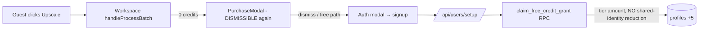
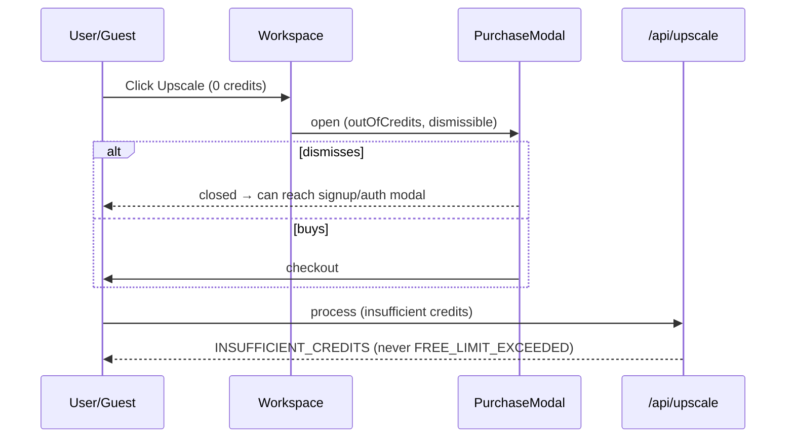

# PRD: Rollback Free-Tier Anti-Abuse Changes — Payment Funnel Recovery

**Status:** Planned
**Date:** 2026-07-22
**Complexity:** 5 → MEDIUM
**Decision (user):** Surgical policy rollback (keep applied schema/RPC infra); backfill affected Jul 18+ signups.

---

## 1. Context

**Problem:** Payments dropped ~60–80% after Jul 17. The Jul 17 checkout outage (cross-account Stripe price IDs) is already fixed and verified; the _remaining_ suppression is a ~45% signup drop (250–296/day → 130–149/day, including −41% in standard/paying regions) that started exactly with the Jul 17 evening deploy of the free-tier anti-abuse changes (`229b6b87`, `99a73485`), against only a ~22% organic traffic dip.

**Files analyzed:**

- `client/components/features/workspace/Workspace.tsx`, `client/components/stripe/PurchaseModal.tsx`, `client/hooks/useBatchQueue.ts`
- `app/api/upscale/route.ts`, `app/api/users/setup/route.ts`
- `server/services/free-credit-grant.service.ts`, `server/services/anti-freeloader.service.ts` (pre/post)
- `lib/anti-freeloader/region-classifier.ts`, `shared/utils/credit-limit.ts`, `shared/config/credits.config.ts`
- `supabase/migrations/20260718021253_free_tier_credit_grants.sql` + 6 follow-up migrations (`20260718175546`…`20260718195105`)
- Production data: `free_credit_grants`, `profiles`, `auth.users`, Stripe API, GA4

**Current behavior (the actual Jul 17/18 delta — verified against git history):**

- **Hard gate (NEW, prime suspect):** Any free user — _including unauthenticated guests_ — with 0 credits who clicks "Upscale" gets a **non-dismissible** `PurchaseModal` (`hardGate=true`: no close button, no backdrop dismiss, `handleDismiss` no-ops). Pre-incident this modal was dismissible with a free-plan path. Guests can no longer bounce off it into signup → uniform signup drop across all tiers.
- **Shared-identity reduction (NEW):** `claim_free_credit_grant` counts prior grants matching `identity_hash OR network_hash` in 90 days (incl. legacy backfill of ALL historical users): 2nd account → 3 credits, 3rd+ → 0. Hits ~4.5% of standard-tier signups (15 of 331 since Jul 18) — real but secondary. CGNAT/shared-network false positives accrue over time.
- **Grant timing (NEW):** Credits granted via RPC during `/api/users/setup` instead of the `handle_new_user` DB trigger. Working correctly in prod (grant rows ≈ signups daily), keep it.
- **`FREE_LIMIT_EXCEEDED` error (NEW):** upscale route returns it for free users at 0 credits, which is what triggers the hard gate from batch errors.
- **`image_uploaded` analytics (REGRESSION):** moved from add-time (with `isGuest`, `source`) to post-processing-success only — guests/pre-auth uploads no longer tracked, breaking the signup-funnel measurement we need to monitor recovery.

**Explicitly NOT part of this rollback (pre-dates the incident, was live during the healthy Jul 11–13 period):**

- Region-tier system and per-tier credits (standard 5 / restricted 3 / paywalled 0) — since Feb/Mar (`d09b8bb8`, `00dd9e7d`). Pre-incident, the trigger granted 5 then `adjust_regional_credits` reduced restricted/paywalled at setup — same net amounts as today.
- Google-only auth for restricted regions, paywalled-country processing block, `GuestUpscaler` paywall notice.
- The `free_credit_grants` schema and salted-hash infra (irreversible anyway — `profiles.signup_ip` was dropped and hashed one-way; **there is no migration re-run that restores the old system**).

> ⚠️ **Note on the backfill decision:** the "backfill all to 5" option was offered before we established that paywalled-tier users received 0 credits _before_ the incident too. Granting them 5 now would exceed pre-incident behavior and contradict the surgical scope. This PRD defaults to **backfill to each user's tier amount** (standard→5, restricted→3, paywalled→0, i.e. only shared-identity victims get topped up). To also grant paywalled users 5, flip the flag in Phase 3 — it's a one-line change to the manifest query.

---

## 2. Solution

**Approach:**

- Remove the hard gate end-to-end: upscale route stops emitting `FREE_LIMIT_EXCEEDED`; Workspace stops requesting hard-gated modals; PurchaseModal drops the `hardGate` prop and always renders dismissible.
- Neutralize the shared-identity reduction with a forward migration: `claim_free_credit_grant` grants the full requested amount regardless of `matched_account_count`, while still **recording** the match count (data keeps accruing so abuse controls can be re-enabled later with evidence).
- Restore add-time `image_uploaded` tracking (with `isGuest`/`source`) so we can measure the recovery funnel.
- Backfill Jul 18+ shared-identity victims to their tier amount via the existing incident-repair RPC pattern.
- Keep: grant-at-setup flow, region tiers, deploy Stripe guard, `free_credit_grants` schema.



**Key decisions:**

- [x] Forward migration, not `git revert` — 6 follow-up migrations already applied in prod; `signup_ip` unrecoverable; `92624ae3` e2e tests + uncommitted working-tree changes would conflict.
- [x] Keep `matched_account_count` computation/logging (read-only) — free telemetry for a future, better-tuned abuse policy.
- [x] Keep `FREE_LIMIT_EXCEEDED` in the `ErrorCodes` enum (avoid breaking imports/tests); just stop emitting it from the upscale route.
- [x] Reuse `repair_free_credit_incident_user` pattern (manifest-hash-gated) for the backfill rather than ad-hoc UPDATEs.

**Data changes:**

- Migration `2026072XXXXXXX_disable_shared_identity_reduction.sql` — redefine `claim_free_credit_grant` (grant `p_requested_credits` unconditionally; keep idempotency, advisory lock, row recording).
- One-off backfill via repair RPC (no schema change).

---

## 3. Sequence Flow (target state)



---

## 4. Execution Phases

> **Pre-work (before Phase 1):** the working tree has uncommitted changes (`CreditsDisplay.tsx`, e2e/test helpers). Commit or stash them first — `deploy.sh` now hard-fails on a dirty worktree.

### Phase 1: Remove the hard gate — guests and 0-credit users can dismiss the purchase modal again

**Files (5):**

- `client/components/stripe/PurchaseModal.tsx` — remove `hardGate` prop and all gated branches (restore close button, backdrop dismiss, `handleDismiss`, free-plan confirmation path; delete `free_limit_gate_*` analytics calls)
- `client/components/features/workspace/Workspace.tsx` — remove `upgradeModalHardGate` state and the 4th arg to `openUpgradeModal`; `free limit reached` error branch falls through to the normal `insufficient_credits` handling
- `app/api/upscale/route.ts` — always return `ErrorCodes.INSUFFICIENT_CREDITS` (drop `getCreditLimitErrorCode` call and the "used all of your free credits" message branch)
- `shared/utils/credit-limit.ts` — delete `getCreditLimitErrorCode` (orphaned by this change)
- `client/utils/upgrade-prompt-dismissals.ts` — delete if orphaned (added by `229b6b87` solely for hard-gate dismissal tracking; verify no other importers first)

**Implementation:**

- [ ] Strip `hardGate` from PurchaseModal props/refs/render paths
- [ ] Strip hard-gate wiring from Workspace (`openUpgradeModal` back to 3-arg signature)
- [ ] Upscale route: single `INSUFFICIENT_CREDITS` path
- [ ] Remove now-dead `FreeLimitExceededError` handling in `client/utils/api-client.ts` / `useBatchQueue.ts` if orphaned

**Tests required:**
| Test file | Test name | Assertion |
|---|---|---|
| `tests/unit/anti-freeloader/free-tier-processing-events.unit.spec.ts` | `should return INSUFFICIENT_CREDITS when free user has zero credits` | response `code === 'INSUFFICIENT_CREDITS'`, status 402/400 (existing convention) |
| `client/components/features/workspace/__tests__/Workspace.test.tsx` | `should open dismissible upgrade modal when credits insufficient` | modal rendered without hard-gate; dismiss handler closes it |
| `tests/unit/stripe/purchase-modal.unit.spec.ts` (or nearest existing) | `should always render close button` | close button present with 0 balance + free user |

**User verification:**

- Action: incognito (logged out), upload an image, click Upscale
- Expected: purchase modal appears **with a close button**; closing it works; signup remains reachable

---

### Phase 2: Forward migration — full tier credits regardless of shared identity

**Files (2):**

- `supabase/migrations/2026072XXXXXXX_disable_shared_identity_reduction.sql` — `CREATE OR REPLACE FUNCTION public.claim_free_credit_grant(...)`: keep salt/hash computation, advisory lock, per-user idempotency, row insert, and `matched_account_count` in the return value — but set `v_granted_credits := p_requested_credits` unconditionally
- `tests/unit/anti-freeloader/free-credit-grants-migration.unit.spec.ts` — update contract test

**Implementation:**

- [ ] **`yarn db:backup` first — verify archives with `yarn db:backups` + `gzip -t`, record paths here:** `_______`
- [ ] Write migration (base it on `20260718195105_fix_claim_grant_column_ambiguity.sql`, the currently-live definition — NOT the original, which has the ambiguity bug)
- [ ] Apply via the standard migration flow (`supabase-migrations` skill)
- [ ] `server/services/free-credit-grant.service.ts` needs no change (it already just forwards `p_requested_credits = getFreeCreditsForTier(tier)`)

**Tests required:**
| Test file | Test name | Assertion |
|---|---|---|
| `free-credit-grants-migration.unit.spec.ts` | `should grant full requested credits when identity matches prior grants` | migration SQL contains no `LEAST(` / `matched_account_count`-based CASE reduction |
| same | `should keep per-user idempotency` | second claim for same user returns `existing_grant = true` |

**Verification plan (post-apply, prod SQL):**

```sql
-- New signups after deploy: standard-tier grants must all be 5
select granted_credits, count(*) from free_credit_grants g
join profiles p on p.id = g.user_id
where g.created_at > '<deploy-ts>' and p.region_tier = 'standard'
group by 1;  -- expect only granted_credits = 5
```

---

### Phase 3: Backfill Jul 18+ reduced-grant users to tier amounts

**Files (2):**

- `scripts/one-off/backfill-shared-identity-grants.ts` — generates a manifest (user_id, expected balances, tier, delta), hashes it, then calls `repair_free_credit_incident_user` per user
- `tests/unit/scripts/backfill-shared-identity-grants.unit.spec.ts` — manifest selection logic

**Selection (default — tier-correct):**

```sql
-- Victims: granted less than their tier's amount since Jul 18
select g.user_id, p.region_tier, g.granted_credits,
       (case p.region_tier when 'standard' then 5 when 'restricted' then 3 else 0 end) - g.granted_credits as delta
from free_credit_grants g join profiles p on p.id = g.user_id
where g.created_at >= '2026-07-18'
  and g.granted_credits < case p.region_tier when 'standard' then 5 when 'restricted' then 3 else 0 end
  and p.subscription_tier = 'free';
```

- [ ] **Optional flag (`--include-paywalled-five`):** also top paywalled-tier users to 5 (matches the original "backfill all" click; off by default — see Context note). Requires extending the repair RPC's classification allowlist.
- [ ] Estimated cohort: ~15 standard/restricted users (tier-correct mode); ~215 if paywalled included.

**Implementation:**

- [ ] `yarn db:backup` (fresh, same verification ritual as Phase 2)
- [ ] Dry-run mode prints manifest + total delta; real run requires the manifest hash
- [ ] Insert `credit_transactions` rows via the RPC (it does this) — no direct balance UPDATEs

**Verification plan:**

```sql
select count(*) from free_credit_grants g join profiles p on p.id = g.user_id
where g.created_at >= '2026-07-18' and p.subscription_tier = 'free'
  and g.granted_credits < case p.region_tier when 'standard' then 5 when 'restricted' then 3 else 0 end;
-- expect 0 after run (tier-correct mode)
```

---

### Phase 4: Restore funnel analytics + deploy + monitor recovery

**Files (2):**

- `client/hooks/useBatchQueue.ts` — restore add-time `image_uploaded` tracking (with `isGuest`, `source`, dimensions best-effort) as it was pre-`229b6b87`; drop the post-processing-only variant
- `docs/SEO/maintenance/seo-changes-backlog.md` — no entry needed (not SEO) — listed here only to note the deliberate omission

**Implementation:**

- [ ] Restore `image_uploaded` at `addFiles` time (`git show 229b6b87^:client/hooks/useBatchQueue.ts` is the reference)
- [ ] `yarn test` on affected areas + `yarn verify`
- [ ] Deploy via `yarn deploy` (clean worktree; Stripe guard runs automatically)
- [ ] Post-deploy smoke: incognito guest → upload → dismissible modal → sign up → receive 5 credits → process 1 image

**Monitoring (daily for 7 days, compare to Jul 10–16 baseline):**
| Metric | Source | Baseline | Recovery target |
|---|---|---|---|
| Signups/day | `auth.users` | 250–296 | > 200 |
| Standard-tier signups/day | `profiles.region_tier` | ~110 | > 90 |
| Checkout sessions created/day | Stripe API | 12–21 | > 12 |
| Succeeded payments/day | Stripe API | ~2.5–4 | > 2 |
| `image_uploaded` with `isGuest=true` | Amplitude | (broken since Jul 17) | flowing again |

If signups do **not** recover within ~5 days of deploy, the residual drop is traffic-side (organic was −22%) — pivot to SEO/GSC investigation, not further rollbacks.

---

## 5. Checkpoint Protocol

After each phase: spawn `prd-work-reviewer` (`Review checkpoint for phase N of docs/PRDs/rollback-anti-abuse-payment-recovery.md`). Phases 2–3 are automated-only; Phase 1 and the Phase 4 smoke test add **manual** verification (visual modal behavior, real signup flow).

## 6. Acceptance Criteria

- [ ] Guest with 0 credits sees a dismissible purchase modal and can reach signup (manual + Playwright)
- [ ] Upscale route never returns `FREE_LIMIT_EXCEEDED`
- [ ] New standard-tier signups all receive 5 credits even on shared networks (prod SQL check)
- [ ] Jul 18+ reduced-grant victims topped up to tier amounts (verification query returns 0)
- [ ] `image_uploaded` guest events flowing in Amplitude again
- [ ] `yarn verify` passes; all phase checkpoints PASS
- [ ] Fresh DB backups taken and verified before Phase 2 and Phase 3 (paths recorded above)
- [ ] Monitoring table shows signup + payment recovery vs baseline (or explicit pivot decision recorded)

## Rollback of the rollback

If abuse spikes after disabling the reduction: re-apply the reduction with a single forward migration restoring the `20260718195105` function body. The `free_credit_grants` rows (with `matched_account_count` telemetry) keep accruing throughout, so a re-enable can be tuned with real false-positive data (e.g. exempt CGNAT ranges, require identity_hash match not just network_hash).
