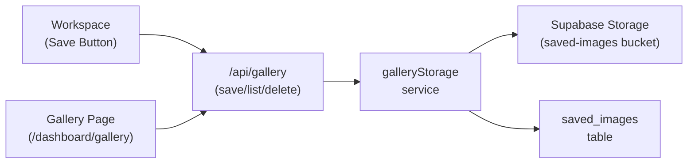
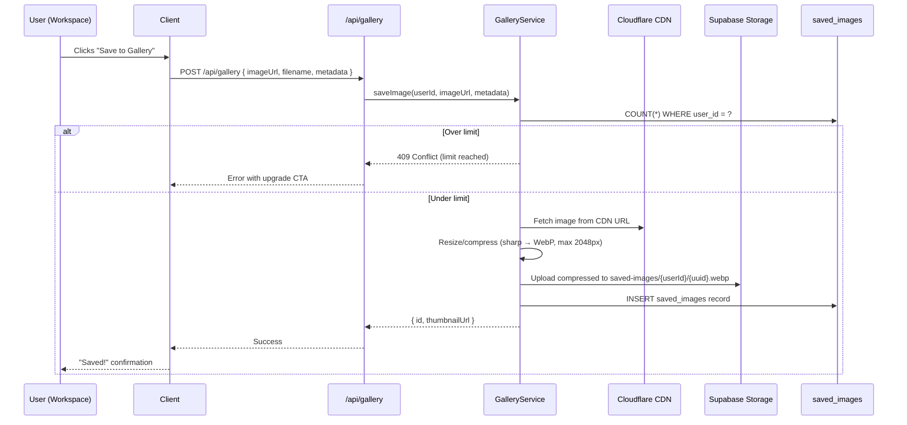
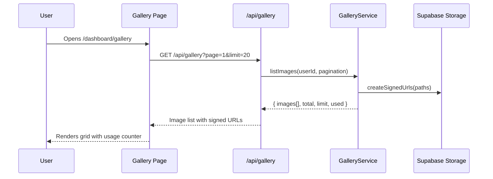
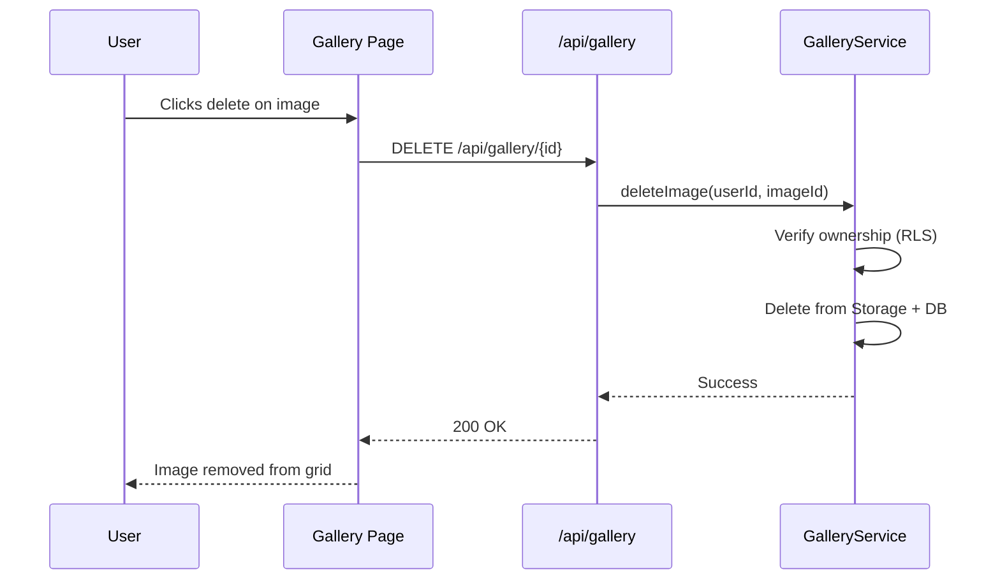

# PRD: Saved Image Gallery

**Complexity: 7 → HIGH mode**

## 1. Context

**Problem:** Users upscale images and must download immediately — there's no reason to come back. A saved image gallery creates a persistent asset library that drives retention and repeat visits.

**Files Analyzed:**

- `shared/config/subscription.config.ts` — tier definitions, features, limits
- `client/components/features/workspace/PreviewArea.tsx` — post-upscale UI, download flow
- `client/components/features/image-processing/ImageComparison.tsx` — comparison + download button
- `client/components/dashboard/DashboardSidebar.tsx` — sidebar navigation items
- `server/services/blogImageStorage.service.ts` — existing Supabase Storage pattern (blog-images bucket)
- `server/services/cloudflareImages.service.ts` — current image delivery via Cloudflare CDN
- `supabase/migrations/20250121_create_processing_jobs_table.sql` — processing jobs schema
- `supabase/migrations/20260131_create_blog_images_bucket.sql` — bucket creation pattern
- `app/[locale]/dashboard/*/page.tsx` — existing dashboard routes

**Current Behavior:**

- Upscaled images are delivered via Cloudflare Images CDN URLs
- Images are fully ephemeral — no persistent link to user accounts
- `processing_jobs` table tracks metadata (model, credits, status) but not retrievable images
- Users must download immediately after processing or lose access
- No retention mechanism exists beyond credits/subscription

## 2. Solution

**Approach:**

- Add a "Save to Gallery" button in the workspace after upscaling completes
- Store saved images in a **Supabase Storage bucket** (`saved-images`) with user-scoped paths
- Track metadata in a new `saved_images` table (user, filename, model, dimensions, etc.)
- New `/dashboard/gallery` page with image grid, re-download, and delete
- Per-tier image count limits with 30-day inactivity cleanup for free users

**Architecture:**



**Key Decisions:**

- [x] **Supabase Storage** for image persistence (same pattern as blog-images, already proven)
- [x] **Count-based limits** (not size-based) — simpler to reason about and display to users
- [x] **Save only the upscaled output** — no original image (halves storage cost)
- [x] **Manual save via button** — user opts in, reduces storage waste
- [x] **No folders/tags/sharing** for v1 (YAGNI)
- [x] **Images fetched from Cloudflare CDN URL** at save time — re-uploaded to Supabase Storage for persistence
- [x] **Resize + compress before storage** — sharp converts to WebP (quality 80), caps at 2048px max dimension (same pattern as `blogImageStorage.service.ts`). Reduces storage cost significantly while preserving quality for gallery viewing

**Gallery Limits by Tier:**

| Tier         | Saved Images | Retention                | Cleanup                   |
| ------------ | ------------ | ------------------------ | ------------------------- |
| Free         | 5            | 30 days since last login | Auto-delete on inactivity |
| Starter      | 50           | Permanent                | Manual delete only        |
| Hobby        | 150          | Permanent                | Manual delete only        |
| Professional | 500          | Permanent                | Manual delete only        |
| Business     | 2,000        | Permanent                | Manual delete only        |

**Data Changes:**

### New Table: `saved_images`

```sql
CREATE TABLE public.saved_images (
  id UUID PRIMARY KEY DEFAULT gen_random_uuid(),
  user_id UUID NOT NULL REFERENCES public.profiles(id) ON DELETE CASCADE,
  storage_path TEXT NOT NULL,        -- path in Supabase Storage bucket
  original_filename TEXT NOT NULL,   -- user's original file name
  file_size_bytes INTEGER NOT NULL,  -- for storage tracking
  width INTEGER,                     -- output image dimensions
  height INTEGER,
  model_used TEXT,                   -- AI model that processed it
  processing_mode TEXT,              -- upscale/enhance/both
  created_at TIMESTAMPTZ NOT NULL DEFAULT NOW()
);
```

### New Bucket: `saved-images`

- Private bucket (not publicly accessible)
- User-scoped paths: `{user_id}/{uuid}.webp`
- 10MB file size limit
- Allowed MIME types: `image/webp`, `image/png`, `image/jpeg`

## 3. Sequence Flows

### Save Image Flow



### Gallery Page Flow



### Delete Image Flow



## 4. Integration Points

```markdown
**How will this feature be reached?**

- [x] Entry point 1: "Save to Gallery" button in workspace PreviewArea (after upscale completes)
- [x] Entry point 2: Gallery page via sidebar navigation (/dashboard/gallery)
- [x] Caller: ImageComparison.tsx will get onSave prop, DashboardSidebar.tsx gets new nav item
- [x] Registration: New API routes at /api/gallery, new page at app/[locale]/dashboard/gallery/page.tsx

**Is this user-facing?**

- [x] YES → Save button in workspace, Gallery page in dashboard, usage counter in sidebar

**Full user flow:**

1. User upscales an image in workspace → sees result in ImageComparison
2. User clicks "Save to Gallery" button (next to Download)
3. Image saved to Supabase Storage, confirmation toast shown
4. User navigates to /dashboard/gallery via sidebar
5. Sees grid of saved images with usage counter (e.g., "3/50 saved")
6. Can view full-size, re-download, or delete images
7. Free users hitting 5-image limit see upgrade CTA
```

## 5. Execution Phases

---

### Phase 1: Database & Storage Foundation

**User-visible outcome:** Database and storage bucket ready for image persistence.

**Files (4):**

- `supabase/migrations/20260318_create_saved_images_table.sql` — new table + RLS policies
- `supabase/migrations/20260318_create_saved_images_bucket.sql` — storage bucket + policies
- `shared/config/gallery.config.ts` — gallery limits per tier, constants
- `shared/types/gallery.types.ts` — TypeScript interfaces

**Implementation:**

- [ ] Create `saved_images` table with columns: id, user_id, storage_path, original_filename, file_size_bytes, width, height, model_used, processing_mode, created_at
- [ ] Add RLS policies: users can SELECT/INSERT/DELETE own images, service role has full access
- [ ] Create indexes on user_id and created_at
- [ ] Create `saved-images` Supabase Storage bucket (private, 10MB limit, webp/png/jpeg)
- [ ] Storage policies: authenticated users can read own path (`{user_id}/*`), service role can write/delete
- [ ] Define `GALLERY_CONFIG` with tier limits: { free: 5, starter: 50, hobby: 150, pro: 500, business: 2000 }
- [ ] Define `IGalleryImage`, `IGalleryListResponse`, `ISaveImageRequest` interfaces

**Verification Plan:**

1. **Unit Tests:**
   - File: `tests/unit/gallery/gallery-config.unit.spec.ts`
   - Tests: `should define limits for all subscription tiers`, `should have valid positive limits`

---

### Phase 2: Gallery Service & Save API

**User-visible outcome:** POST /api/gallery endpoint saves an image; GET lists them; DELETE removes them.

**Files (4):**

- `server/services/galleryStorage.service.ts` — save, list, delete, count operations
- `app/api/gallery/route.ts` — GET (list) and POST (save) handlers
- `app/api/gallery/[id]/route.ts` — DELETE handler
- `shared/validation/gallery.schema.ts` — Zod schemas for request validation

**Implementation:**

- [ ] `galleryStorage.service.ts`:
  - `saveImage(userId, imageUrl, metadata)`: fetch image from CDN URL, **resize/compress with sharp** (max 2048px, WebP quality 80), upload to Supabase Storage, insert DB record, return saved image data
  - `compressForGallery(buffer)`: sharp pipeline — resize to max 2048px (fit: inside, withoutEnlargement), convert to WebP quality 80. Same pattern as `blogImageStorage.service.ts` `compressImage()`
  - `listImages(userId, page, limit)`: query saved_images + generate signed URLs for display
  - `deleteImage(userId, imageId)`: verify ownership, delete from Storage + DB
  - `getUsage(userId)`: return { used: count, limit: tierLimit }
  - Enforce tier limits before save (count check)
- [ ] POST `/api/gallery` — authenticated, validates request, calls saveImage
- [ ] GET `/api/gallery` — authenticated, paginated list with signed URLs + usage info
- [ ] DELETE `/api/gallery/[id]` — authenticated, calls deleteImage
- [ ] Zod schemas: `saveImageSchema` (imageUrl, filename, width?, height?, modelUsed?, processingMode?)

**Verification Plan:**

1. **Unit Tests:**
   - File: `tests/unit/gallery/gallery-service.unit.spec.ts`
   - Tests: `should reject save when over tier limit`, `should validate image URL format`, `should generate correct storage path`
2. **API Proof (curl):**

   ```bash
   # Save an image
   curl -X POST http://localhost:3000/api/gallery \
     -H "Authorization: Bearer $TOKEN" \
     -H "Content-Type: application/json" \
     -d '{"imageUrl":"https://cdn.example.com/img.png","filename":"test.png"}'
   # Expected: {"id":"uuid","storagePath":"...","createdAt":"..."}

   # List saved images
   curl http://localhost:3000/api/gallery?page=1&limit=20 \
     -H "Authorization: Bearer $TOKEN"
   # Expected: {"images":[...],"total":1,"usage":{"used":1,"limit":50}}

   # Delete an image
   curl -X DELETE http://localhost:3000/api/gallery/IMAGE_ID \
     -H "Authorization: Bearer $TOKEN"
   # Expected: 200 OK
   ```

---

### Phase 3: Save Button in Workspace

**User-visible outcome:** After upscaling, user sees a "Save to Gallery" button next to Download. Clicking it saves the image with a toast confirmation.

**Files (5):**

- `client/components/features/image-processing/ImageComparison.tsx` — add Save button
- `client/hooks/useGallery.ts` — save/delete/usage hook with API calls
- `client/components/features/workspace/Workspace.tsx` — pass save handler through
- `client/components/features/workspace/PreviewArea.tsx` — pass onSave prop
- `shared/config/subscription.config.ts` — add gallery limit to plan features list

**Implementation:**

- [ ] `useGallery` hook: `saveImage(imageUrl, filename, metadata)`, `usage` state, `isSaving` loading state
- [ ] Add `onSave` prop to `IImageComparisonProps` and `IPreviewAreaProps`
- [ ] Render "Save to Gallery" button (Bookmark icon) next to Download in ImageComparison
- [ ] Button states: default → saving (spinner) → saved (checkmark, disabled) → error (retry)
- [ ] Show toast on save: "Image saved to gallery (3/50)"
- [ ] When at limit: button shows "Gallery full" with upgrade link for free users
- [ ] Track analytics: `gallery_image_saved`, `gallery_limit_reached`
- [ ] Add "X saved images" to each plan's features array in subscription config

**Verification Plan:**

1. **Unit Tests:**
   - File: `tests/unit/gallery/use-gallery-hook.unit.spec.ts`
   - Tests: `should call save API with correct payload`, `should update usage after save`, `should show limit reached state`
2. **Playwright E2E:**
   - File: `tests/e2e/gallery/save-image.e2e.spec.ts`
   - Flow: Login → Upload image → Process → Click "Save to Gallery" → Verify toast → Navigate to gallery → Verify image appears

---

### Phase 4: Gallery Page

**User-visible outcome:** Users navigate to /dashboard/gallery and see a grid of their saved images with view, download, and delete actions.

**Files (5):**

- `app/[locale]/dashboard/gallery/page.tsx` — gallery route page
- `client/components/dashboard/Gallery.tsx` — main gallery component
- `client/components/dashboard/GalleryImageCard.tsx` — individual image card with actions
- `client/components/dashboard/DashboardSidebar.tsx` — add Gallery nav item
- `client/hooks/useGallery.ts` — extend with listImages, deleteImage, pagination

**Implementation:**

- [ ] Gallery page: server component wrapper with metadata, renders `<Gallery />` client component
- [ ] `Gallery.tsx`:
  - Usage bar at top: "3 of 50 images saved" with progress indicator
  - Responsive grid: 2 cols mobile, 3 cols tablet, 4 cols desktop
  - Empty state: illustration + "Save your first image" CTA linking to workspace
  - Loading skeleton grid
  - Pagination (load more button, not infinite scroll — simpler)
- [ ] `GalleryImageCard.tsx`:
  - Thumbnail with aspect-ratio-preserved display
  - Hover overlay with: View full size, Download, Delete
  - Metadata below: filename (truncated), model used, date saved
  - Delete confirmation modal
- [ ] Add "Gallery" nav item to `DashboardSidebar.tsx` menu items (ImageIcon from lucide, between Dashboard and Billing)
- [ ] Extend `useGallery` hook: `fetchImages(page)`, `deleteImage(id)`, pagination state
- [ ] Free user at limit: show upgrade banner at top of gallery

**Verification Plan:**

1. **Unit Tests:**
   - File: `tests/unit/gallery/gallery-component.unit.spec.ts`
   - Tests: `should render empty state when no images`, `should show usage counter`, `should render image grid`
2. **Playwright E2E:**
   - File: `tests/e2e/gallery/gallery-page.e2e.spec.ts`
   - Flow: Login → Navigate to Gallery → Verify empty state → Save image from workspace → Return to gallery → Verify image appears → Delete image → Verify removed

---

### Phase 5: Free User Cleanup & Polish

**User-visible outcome:** Free users who haven't logged in for 30 days get their gallery images cleaned up. Usage shown in sidebar. Upgrade CTAs throughout.

**Files (5):**

- `server/services/galleryCleanup.service.ts` — cleanup logic for inactive free users
- `app/api/cron/gallery-cleanup/route.ts` — cron endpoint for cleanup job
- `client/components/dashboard/DashboardSidebar.tsx` — show gallery usage mini-counter
- `client/components/dashboard/UpgradeCard.tsx` — add gallery upgrade messaging
- `shared/config/subscription.config.ts` — update plan features with gallery counts

**Implementation:**

- [ ] `galleryCleanup.service.ts`:
  - Query free users with saved images whose `profiles.updated_at` (last activity proxy) is > 30 days ago
  - Delete their storage files and DB records in batches
  - Log cleanup actions for monitoring
- [ ] Cron endpoint: protected with cron secret header, calls cleanup service
- [ ] Sidebar: show small badge on Gallery nav item with image count (e.g., "3/5")
- [ ] UpgradeCard: if gallery is >80% full, show "Running out of gallery space" messaging
- [ ] Update plan features arrays with gallery limits for pricing page display
- [ ] Add i18n keys for all gallery-related strings

**Verification Plan:**

1. **Unit Tests:**
   - File: `tests/unit/gallery/gallery-cleanup.unit.spec.ts`
   - Tests: `should identify inactive free users`, `should delete images for inactive users`, `should not delete paid user images`, `should batch delete correctly`
2. **API Proof:**
   ```bash
   # Trigger cleanup (cron)
   curl -X POST http://localhost:3000/api/cron/gallery-cleanup \
     -H "X-Cron-Secret: $CRON_SECRET"
   # Expected: {"cleaned":2,"imagesDeleted":7}
   ```

---

## 6. Acceptance Criteria

- [ ] All 5 phases complete
- [ ] All unit tests pass
- [ ] E2E tests pass (save flow, gallery page, delete flow)
- [ ] `yarn verify` passes
- [ ] All automated checkpoint reviews passed
- [ ] Save button visible and functional in workspace after upscaling
- [ ] Gallery page accessible from sidebar navigation
- [ ] Per-tier limits enforced (free: 5, starter: 50, hobby: 150, pro: 500, business: 2000)
- [ ] Free user cleanup works for 30-day inactive accounts
- [ ] Upgrade CTAs shown when gallery is full (especially for free users)
- [ ] Images persist across sessions and can be re-downloaded
- [ ] Delete removes both storage file and database record
- [ ] Images are compressed (WebP, max 2048px, quality 80) before storage
