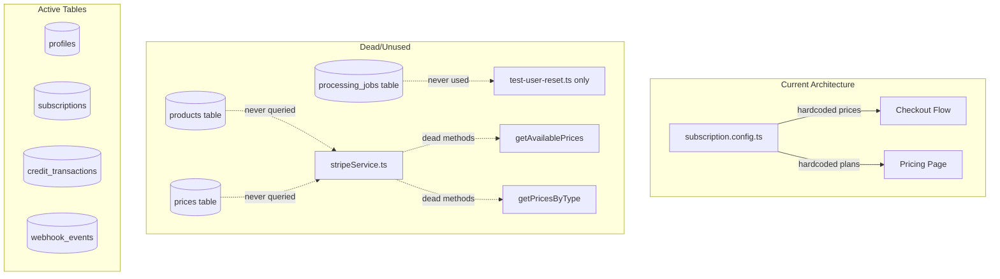
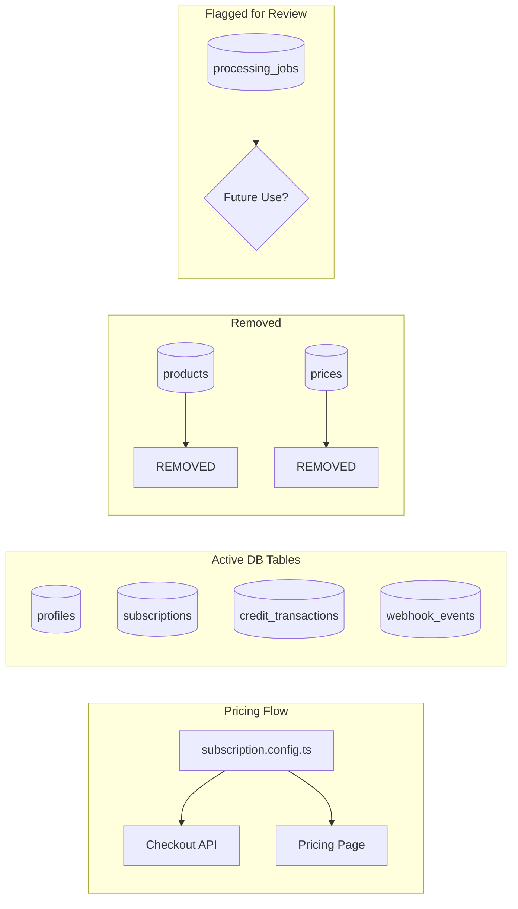
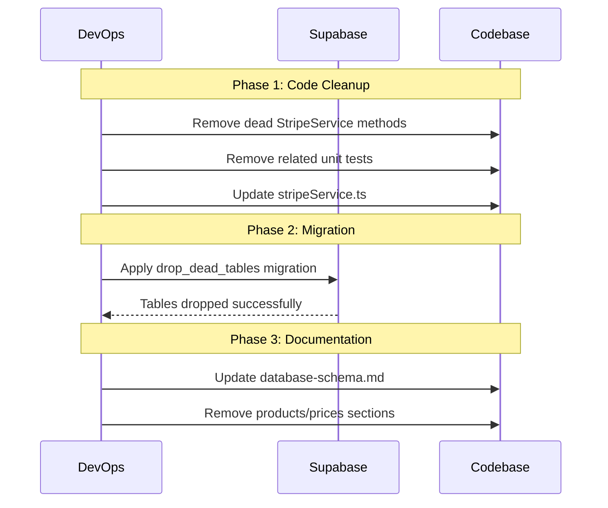

# PRD: Database Schema Cleanup - Dead Tables

## 1. Context Analysis

### 1.1 Files Analyzed

```
/supabase/migrations/20250120_create_subscriptions_table.sql
/supabase/migrations/20250121_create_processing_jobs_table.sql
/client/services/stripeService.ts
/shared/config/subscription.config.ts
/tests/helpers/test-user-reset.ts
/docs/technical/database-schema.md
```

### 1.2 Component & Dependency Overview



### 1.3 Current Behavior Summary

- **`products` table**: Created in migration as "Optional", has 0 rows, never populated
- **`prices` table**: Created in migration as optional Stripe cache, has 0 rows, never populated
- **`processing_jobs` table**: Created for background job tracking, has 0 rows, never used
- Pricing/products data comes from hardcoded `subscription.config.ts`
- Image processing happens client-side via direct Replicate API calls (no job queue)
- `StripeService.getAvailablePrices()` and `getPricesByType()` exist but are never called

### 1.4 Problem Statement

Three database tables (`products`, `prices`, `processing_jobs`) and two service methods remain in the codebase despite never being used, creating technical debt, potential confusion, and unnecessary database overhead.

---

## 2. Proposed Solution

### 2.1 Architecture Summary

- **Remove `products` table**: Dead code, Stripe products are not synced to DB
- **Remove `prices` table**: Dead code, pricing uses hardcoded config instead
- **Keep `processing_jobs` table with cleanup flag**: Potential future use for server-side processing
- **Remove dead `StripeService` methods**: `getAvailablePrices()`, `getPricesByType()`
- **Update documentation**: Remove references to dead schema

**Alternative Considered - Keep and Implement Sync:**
- Rejected because hardcoded config is simpler and works well
- Stripe API can be called directly when needed
- No benefit to caching in DB for current scale

### 2.2 Architecture Diagram (After Cleanup)



### 2.3 Key Technical Decisions

| Decision | Rationale |
|----------|-----------|
| Drop `products` and `prices` tables | Never populated, pricing handled via hardcoded config |
| Keep `processing_jobs` for now | Could be useful if moving to server-side processing |
| Remove dead service methods | Reduces confusion, prevents false positive in code searches |
| Single migration for cleanup | Atomic, reversible change |

### 2.4 Data Model Changes

**Tables to DROP:**
- `public.products` (0 rows, no foreign key dependencies)
- `public.prices` (0 rows, FK to products only)

**Tables to KEEP (flagged for future review):**
- `public.processing_jobs` (0 rows, but has documented migration)

---

## 2.5 Runtime Execution Flow



---

## 3. Detailed Implementation Spec

### A. `supabase/migrations/YYYYMMDD_drop_dead_tables.sql`

**Changes Needed:** New migration file

**SQL:**

```sql
-- ============================================================================
-- Drop Dead Tables Migration
-- ============================================================================
-- Removes unused products and prices tables that were created as optional
-- Stripe sync caches but never implemented.
--
-- Context: Pricing data uses hardcoded subscription.config.ts instead.
-- ============================================================================

-- Drop prices first (has FK to products)
DROP TABLE IF EXISTS public.prices CASCADE;

-- Drop products
DROP TABLE IF EXISTS public.products CASCADE;

-- Comment for future reference
COMMENT ON TABLE public.processing_jobs IS 'Created for background image processing jobs - currently unused but retained for potential future use with server-side processing';
```

**Justification:** Clean removal with CASCADE to handle any lingering FK constraints.

---

### B. `client/services/stripeService.ts`

**Changes Needed:** Remove unused methods

**Methods to REMOVE:**
- `getAvailablePrices()` (lines 229-247)
- `getPricesByType()` (lines 254-275)

**Justification:** These methods query the empty `prices` table and are never called in production code.

---

### C. `tests/unit/server/stripe/stripeService.unit.spec.ts`

**Changes Needed:** Remove tests for deleted methods

**Tests to REMOVE:**
- Tests for `getAvailablePrices`
- Tests for `getPricesByType`

---

### D. `docs/technical/database-schema.md`

**Changes Needed:** Remove `prices` table documentation

**Sections to REMOVE:**
- "prices" table section (lines 225-253)
- References in ERD diagram
- Related index documentation

---

## 4. Step-by-Step Execution Plan

### Phase 1: Code Cleanup (No DB Changes)

- [ ] Remove `getAvailablePrices()` method from `stripeService.ts`
- [ ] Remove `getPricesByType()` method from `stripeService.ts`
- [ ] Remove related types (`IPrice`, `IProduct` imports if unused elsewhere)
- [ ] Remove tests for deleted methods
- [ ] Run `yarn verify` to ensure no breakage

### Phase 2: Database Migration

- [ ] Create migration file `YYYYMMDD_drop_dead_tables.sql`
- [ ] Test migration locally with `supabase db reset`
- [ ] Apply to production after Phase 1 is deployed

### Phase 3: Documentation Update

- [ ] Update `docs/technical/database-schema.md`
- [ ] Remove `products` and `prices` from ERD
- [ ] Add note about `processing_jobs` being unused but retained

---

## 5. Testing Strategy

### Unit Tests

- Verify `stripeService.ts` compiles without removed methods
- Ensure no other files import removed methods

### Integration Tests

- Run full test suite to catch any hidden dependencies
- Verify webhook handlers don't reference removed tables

### Edge Cases

| Scenario | Expected Behavior |
|----------|-------------------|
| Migration on empty tables | Clean drop, no data loss |
| FK constraint issues | CASCADE handles cleanup |
| Rollback needed | Re-apply original migration |

---

## 6. Acceptance Criteria

- [ ] `products` table no longer exists in database
- [ ] `prices` table no longer exists in database
- [ ] `getAvailablePrices()` method removed from codebase
- [ ] `getPricesByType()` method removed from codebase
- [ ] All tests pass (`yarn verify`)
- [ ] Documentation updated to reflect current schema
- [ ] `processing_jobs` table retained with comment explaining status

---

## 7. Verification & Rollback

### Success Criteria

- No runtime errors in production
- All existing features continue to work
- Database query count unchanged (no queries were hitting these tables)

### Rollback Plan

1. If issues arise, re-apply original migration:
   ```sql
   -- Re-run 20250120_create_subscriptions_table.sql sections for products/prices
   ```
2. Revert code changes via git
3. No data loss possible (tables are empty)

---

## Appendix: Investigation Evidence

### Query Results

```sql
SELECT table_name, COUNT(*) as row_count FROM (
  SELECT 'products' as table_name FROM products
  UNION ALL SELECT 'prices' FROM prices
  UNION ALL SELECT 'processing_jobs' FROM processing_jobs
) GROUP BY table_name;

-- Result: All 0 rows
```

### Code Search Results

| Pattern | Production Hits | Test-Only Hits |
|---------|-----------------|----------------|
| `from('products')` | 0 | 0 |
| `from('prices')` | 1 (stripeService.ts) | 1 |
| `from('processing_jobs')` | 0 | 1 (test-user-reset.ts) |
| `getAvailablePrices` | 1 (definition) | 1 |
| `getPricesByType` | 1 (definition) | 1 |

### Migration History

- `20250120_create_subscriptions_table.sql`: Created `products` and `prices` as "Optional"
- `20250121_create_processing_jobs_table.sql`: Created for background processing (never implemented)
