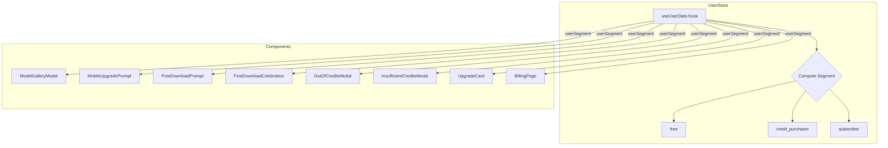

# PRD: Segment-Aware Upgrade Funnel

## Status: Ready

## Problem

The upgrade funnel treats all non-subscriber users the same. A user who bought credits but has no subscription sees the same CTAs as a completely free user. We're missing the opportunity to convert credit purchasers into subscribers by showing them subscription-oriented messaging instead of repeating the "buy credits" pitch they've already accepted.

## Files Analyzed

- `client/store/userStore.ts` — `useUserData()` hook, `isFreeUser` derivation (lines 454-485)
- `client/components/features/workspace/ModelGalleryModal.tsx` — upgrade banner + locked tier gate
- `client/components/features/workspace/MobileUpgradePrompt.tsx` — mobile CTA variants
- `client/components/features/workspace/PostDownloadPrompt.tsx` — post-download upsell modal
- `client/components/features/workspace/FirstDownloadCelebration.tsx` — first download celebration
- `client/components/stripe/OutOfCreditsModal.tsx` — out of credits modal (tabs: credits vs subscribe)
- `client/components/stripe/InsufficientCreditsModal.tsx` — insufficient credits modal
- `client/components/dashboard/UpgradeCard.tsx` — sidebar upgrade card
- `client/components/dashboard/DashboardSidebar.tsx` — sidebar showing UpgradeCard for free users
- `app/[locale]/dashboard/billing/page.tsx` — billing page with credits/subscription/invoices tabs
- `client/hooks/useCheckoutFlow.ts` — checkout flow orchestration
- `shared/config/stripe.ts` — STRIPE_PRICES, SUBSCRIPTION_PLANS, CREDIT_PACKS
- `shared/config/subscription.config.ts` — plan configs (Starter $9, Hobby, Pro, Business)

## Current Behavior

- `isFreeUser` is a binary: `!hasSubscription && !hasPurchasedCredits`
- Credit purchasers get `isFreeUser: false` — same as subscribers
- All upgrade CTAs target free users only (`if (isFreeUser)`)
- Credit purchasers see NO upgrade prompts at all (they're "not free")
- Billing page always defaults to "Credits" tab regardless of user segment
- ModelGalleryModal always shows "$4.99 credits" CTA for all free users
- Sidebar UpgradeCard only shows for `isFreeUser === true`

## Solution

### Approach

1. Introduce a `UserSegment` enum: `'free' | 'credit_purchaser' | 'subscriber'`
2. Expose `userSegment` from `useUserData()` alongside existing `isFreeUser` (backward compatible)
3. Differentiate CTA copy and behavior per segment across all touchpoints
4. Credit purchasers see subscription-first messaging; billing page opens to subscription tab
5. Free users continue to see the $4.99 credits entry point

### Key Decisions

- **Backward compatible**: `isFreeUser` stays — now means `userSegment === 'free'` (true free, never purchased)
- **No DB changes**: Segment derived entirely from existing `profile` fields
- **No new API calls**: Everything computed client-side from existing data
- **Analytics enriched**: All `upgrade_prompt_*` events get `userSegment` property

### Segmentation Logic

```typescript
type UserSegment = 'free' | 'credit_purchaser' | 'subscriber';

// In useUserData():
const hasSubscription = /* existing logic */;
const hasPurchasedCredits = (profile?.purchased_credits_balance ?? 0) > 0;
const hasEverPurchased = (profile?.purchased_credits_balance ?? 0) > 0 || !!profile?.stripe_customer_id;

const userSegment: UserSegment = hasSubscription
  ? 'subscriber'
  : hasEverPurchased
    ? 'credit_purchaser'
    : 'free';

// isFreeUser now means "true free" (never purchased anything)
const isFreeUser = userSegment === 'free';
```

> **Note**: Using `stripe_customer_id` as a fallback ensures users who bought credits previously but spent them all are still recognized as credit purchasers, not free users.

### CTA Strategy Per Segment

| Touchpoint                         | Free User                                 | Credit Purchaser                                      | Subscriber             |
| ---------------------------------- | ----------------------------------------- | ----------------------------------------------------- | ---------------------- |
| **ModelGalleryModal banner**       | "Unlock Premium Models — From $4.99"      | "Subscribe & Save — From $9/mo, 100 credits included" | Hidden                 |
| **ModelGalleryModal locked click** | Opens SMALL_CREDITS checkout              | Opens STARTER_MONTHLY checkout                        | N/A (unlocked)         |
| **MobileUpgradePrompt**            | "Get visibly better results" → View Plans | "Subscribe for unlimited access" → View Plans         | Hidden                 |
| **PostDownloadPrompt**             | "Get 10x sharper with Premium" → billing  | "Save with a monthly plan" → billing?tab=subscription | Hidden                 |
| **FirstDownloadCelebration**       | "See Premium Plans" button                | "Subscribe & Save" button                             | Hidden                 |
| **OutOfCreditsModal**              | Credits tab first (existing)              | Subscription tab first                                | Subscription tab first |
| **InsufficientCreditsModal**       | Buy Credits primary CTA                   | "Subscribe for more" primary CTA                      | Buy Credits (top-up)   |
| **Sidebar UpgradeCard**            | "Upgrade to Pro" → billing                | "Subscribe & Save" → billing?tab=subscription         | Hidden                 |
| **Billing Page default tab**       | Credits tab (existing)                    | **Subscription tab**                                  | Subscription tab       |

### Architecture



---

## Execution Phases

### Phase 1: User Segmentation Core — "useUserData returns userSegment"

**Files (3):**

- `shared/types/stripe.types.ts` — Add `UserSegment` type
- `client/store/userStore.ts` — Compute and expose `userSegment` from `useUserData()`
- `tests/unit/client/user-segment.unit.spec.ts` — Unit tests for segmentation logic

**Implementation:**

- [ ] Add `type UserSegment = 'free' | 'credit_purchaser' | 'subscriber'` to shared types
- [ ] Update `useUserData()` to compute `userSegment` based on subscription and purchase state
- [ ] Update `isFreeUser` to mean `userSegment === 'free'` (breaking change: credit purchasers who had `isFreeUser: false` are now also "not free" — same behavior, but credit purchasers no longer silently pass through upgrade gates)
- [ ] Keep `isFreeUser` on the return type for backward compatibility

**Tests Required:**
| Test File | Test Name | Assertion |
|-----------|-----------|-----------|
| `tests/unit/client/user-segment.unit.spec.ts` | `should return 'free' when no subscription and no purchases` | `userSegment === 'free'` |
| `tests/unit/client/user-segment.unit.spec.ts` | `should return 'credit_purchaser' when has purchased credits but no subscription` | `userSegment === 'credit_purchaser'` |
| `tests/unit/client/user-segment.unit.spec.ts` | `should return 'credit_purchaser' when has stripe_customer_id but zero balance` | `userSegment === 'credit_purchaser'` |
| `tests/unit/client/user-segment.unit.spec.ts` | `should return 'subscriber' when has active subscription` | `userSegment === 'subscriber'` |
| `tests/unit/client/user-segment.unit.spec.ts` | `should return 'subscriber' when subscription is trialing` | `userSegment === 'subscriber'` |
| `tests/unit/client/user-segment.unit.spec.ts` | `isFreeUser should be true only for 'free' segment` | `isFreeUser === (segment === 'free')` |

**User Verification:**

- Action: Inspect `useUserData()` return value in React DevTools for a free account, a credit-purchaser account, and a subscriber account
- Expected: Each returns the correct `userSegment` value

---

### Phase 2: ModelGalleryModal + Workspace Segment Awareness — "Credit purchasers see subscription CTA in model gallery"

**Files (4):**

- `client/components/features/workspace/ModelGalleryModal.tsx` — Segment-aware banner copy + checkout target
- `client/components/features/workspace/Workspace.tsx` — Pass `userSegment` to ModelGalleryModal
- `client/hooks/useCheckoutFlow.ts` — No changes needed (already accepts priceId)
- `tests/unit/client/model-gallery-modal.unit.spec.tsx` — Update tests for segment-aware behavior

**Implementation:**

- [ ] Change `ModelGalleryModal` props: add `userSegment: UserSegment` (keep `isFreeUser` derived internally for backward compat)
- [ ] Update upgrade banner: Free → "$4.99 credits" CTA, Credit purchaser → "$9/mo subscription" CTA, Subscriber → hidden
- [ ] Update `handleLockedClick`: Free → `STRIPE_PRICES.SMALL_CREDITS`, Credit purchaser → `STRIPE_PRICES.STARTER_MONTHLY`
- [ ] Update `Workspace.tsx` to pass `userSegment` from `useUserData()`
- [ ] Show upgrade banner for credit purchasers too (currently hidden because `isFreeUser` is false for them)
- [ ] Update analytics events to include `userSegment`

**Tests Required:**
| Test File | Test Name | Assertion |
|-----------|-----------|-----------|
| `tests/unit/client/model-gallery-modal.unit.spec.tsx` | `should show credits CTA for free users` | Banner text contains "$4.99" |
| `tests/unit/client/model-gallery-modal.unit.spec.tsx` | `should show subscription CTA for credit purchasers` | Banner text contains "$9/mo" |
| `tests/unit/client/model-gallery-modal.unit.spec.tsx` | `should hide upgrade banner for subscribers` | Banner not rendered |
| `tests/unit/client/model-gallery-modal.unit.spec.tsx` | `should lock premium tiers for credit purchasers without subscription` | Lock icon visible |

**User Verification:**

- Action: Open model gallery as a credit purchaser
- Expected: See "Subscribe & Save — From $9/mo" banner instead of "$4.99 credits"

---

### Phase 3: Billing Page + Sidebar — "Credit purchasers land on subscription tab"

**Files (4):**

- `app/[locale]/dashboard/billing/page.tsx` — Default tab based on segment
- `client/components/dashboard/UpgradeCard.tsx` — Segment-aware copy
- `client/components/dashboard/DashboardSidebar.tsx` — Show UpgradeCard for credit purchasers too
- `tests/unit/client/billing-page-segment.unit.spec.ts` — Tests for tab defaulting

**Implementation:**

- [ ] Billing page: Read `userSegment` (from URL param or computed). If `credit_purchaser` → default to `subscription` tab. If `subscriber` → default to `subscription` tab. If `free` → default to `credits` tab (existing).
- [ ] Support `?tab=subscription` URL param to deep-link to subscription tab (for CTA links)
- [ ] UpgradeCard: Accept `userSegment` prop. Free → "Upgrade to Pro" / "View Plans". Credit purchaser → "Subscribe & Save" / "View Subscriptions" linking to `/dashboard/billing?tab=subscription`.
- [ ] DashboardSidebar: Show UpgradeCard for `credit_purchaser` segment too (currently only for `isFreeUser`)

**Tests Required:**
| Test File | Test Name | Assertion |
|-----------|-----------|-----------|
| `tests/unit/client/billing-page-segment.unit.spec.ts` | `should default to credits tab for free users` | `activeTab === 'credits'` |
| `tests/unit/client/billing-page-segment.unit.spec.ts` | `should default to subscription tab for credit purchasers` | `activeTab === 'subscription'` |
| `tests/unit/client/billing-page-segment.unit.spec.ts` | `should respect ?tab= URL param override` | `activeTab === param value` |

**User Verification:**

- Action: Navigate to billing page as a credit purchaser
- Expected: Subscription tab is active by default, showing plan cards

---

### Phase 4: Remaining Modals + Mobile — "All upgrade touchpoints are segment-aware"

**Files (5):**

- `client/components/stripe/OutOfCreditsModal.tsx` — Default to subscribe tab for credit purchasers
- `client/components/stripe/InsufficientCreditsModal.tsx` — Swap primary CTA for credit purchasers
- `client/components/features/workspace/MobileUpgradePrompt.tsx` — Segment-aware copy
- `client/components/features/workspace/PostDownloadPrompt.tsx` — Segment-aware copy + link
- `client/components/features/workspace/FirstDownloadCelebration.tsx` — Segment-aware CTA

**Implementation:**

- [ ] `OutOfCreditsModal`: Accept `userSegment` prop. Credit purchaser → default to subscription tab. Analytics include `userSegment`.
- [ ] `InsufficientCreditsModal`: Accept `userSegment` prop. Credit purchaser → primary button says "Subscribe for More Credits" linking to billing subscription tab. Secondary → buy credits.
- [ ] `MobileUpgradePrompt`: Accept `userSegment` prop. Show for credit purchasers too. Credit purchaser → "Subscribe for unlimited access" copy, link to `/dashboard/billing?tab=subscription`.
- [ ] `PostDownloadPrompt`: Accept `userSegment` prop. Show for credit purchasers. Credit purchaser → "Save with a monthly plan" copy, link to `/dashboard/billing?tab=subscription`.
- [ ] `FirstDownloadCelebration`: Accept `userSegment` prop. Credit purchaser → "Subscribe & Save" button text.
- [ ] Update all parent components (Workspace.tsx, etc.) to pass `userSegment` down

**Tests Required:**
| Test File | Test Name | Assertion |
|-----------|-----------|-----------|
| `tests/unit/client/upgrade-prompts.unit.spec.tsx` | `OutOfCreditsModal defaults to subscribe tab for credit purchasers` | Subscribe tab selected |
| `tests/unit/client/upgrade-prompts.unit.spec.tsx` | `InsufficientCreditsModal shows subscribe CTA for credit purchasers` | Primary button text contains "Subscribe" |
| `tests/unit/client/upgrade-prompts.unit.spec.tsx` | `MobileUpgradePrompt shows for credit purchasers` | Component renders |
| `tests/unit/client/upgrade-prompts.unit.spec.tsx` | `PostDownloadPrompt shows subscribe messaging for credit purchasers` | Link href contains tab=subscription |

**User Verification:**

- Action: Run out of credits as a credit purchaser
- Expected: Out of credits modal opens with subscription tab selected, showing plan cards

---

### Phase 5: Analytics Enrichment — "All funnel events include userSegment"

**Files (3):**

- `client/analytics/analyticsClient.ts` (or wherever events are tracked) — Add `userSegment` to common properties
- `tests/unit/client/upgrade-funnel-analytics.unit.spec.tsx` — Update existing analytics tests
- `tests/unit/analytics/model-selection-events.unit.spec.ts` — Update model selection analytics tests

**Implementation:**

- [ ] Add `userSegment` to all `upgrade_prompt_shown`, `upgrade_prompt_clicked`, `upgrade_prompt_dismissed` events
- [ ] Add `userSegment` to `checkout_opened` events
- [ ] Add `userSegment` to `model_selection_changed` and `model_gallery_closed` events
- [ ] Replace hardcoded `currentPlan: 'free'` with dynamic value based on segment

**Tests Required:**
| Test File | Test Name | Assertion |
|-----------|-----------|-----------|
| `tests/unit/client/upgrade-funnel-analytics.unit.spec.tsx` | `should include userSegment in upgrade_prompt_shown` | Event payload contains `userSegment` |
| `tests/unit/client/upgrade-funnel-analytics.unit.spec.tsx` | `should track 'credit_purchaser' segment correctly` | `userSegment === 'credit_purchaser'` |

**User Verification:**

- Action: Trigger upgrade prompt as each segment, check analytics events
- Expected: All events include correct `userSegment` property

---

## Acceptance Criteria

- [ ] All phases complete
- [ ] All specified tests pass
- [ ] `yarn verify` passes
- [ ] Free users see $4.99 credits CTA across all touchpoints
- [ ] Credit purchasers see subscription-first messaging across all touchpoints
- [ ] Credit purchasers land on subscription tab on billing page
- [ ] Subscribers see no upgrade prompts
- [ ] Analytics events include `userSegment` property
- [ ] `isFreeUser` backward compatibility maintained (no regressions in existing behavior)
- [ ] Sidebar UpgradeCard visible for credit purchasers (not just free users)
