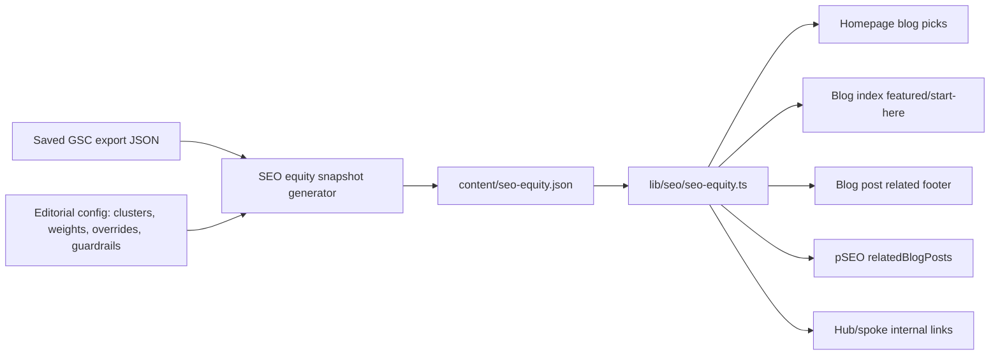

# PRD: SEO Equity Flywheel - Data-Informed Internal Link & Blog Promotion System

**Based on:** GSC 90-day export dated 2026-06-07 (`/tmp/gsc-miu-seo-equity-prd.json`), SEO backlog (`docs/SEO/maintenance/seo-changes-backlog.md`), and 3 Kings Opportunities report (`docs/SEO/reports/3-kings-opportunities-2026-06-07.md`)
**Status:** Active
**Scope:** Replace hardcoded homepage/blog/related/pSEO promotion picks with a deterministic GSC-informed static SEO equity snapshot and editorial rules
**Total Effort:** ~10-16 hours

---

## Complexity Assessment

```
+3  Touches 10+ files/surfaces in the later implementation
+2  New generated data artifact + scoring module
+1  SEO-sensitive changes affecting link equity distribution
+1  External data source ingestion from saved/fresh GSC exports
```

**Complexity: 7 → HIGH mode**

This PRD is documentation only. No product/code changes are implemented as part of creating this PRD.

---

## Context

**Problem:** MIU currently distributes internal SEO equity by hand-maintained arrays and same-category defaults instead of current search demand, CTR opportunity, business value, and canonical intent decisions.

**Files/Surfaces Analyzed:**

- `app/[locale]/page.tsx` — hardcoded `HOMEPAGE_BLOG_SLUGS`
- `client/components/landing/LandingBlogSection.tsx` — consumes homepage blog slugs
- `app/[locale]/blog/page.tsx` — hardcoded `FEATURED_POST_PRIORITY`, `START_HERE_LINKS`, topic filters
- `app/[locale]/blog/[slug]/page.tsx` — blog post route and related/footer composition
- `app/[locale]/blog/_components/BlogPostFooter.tsx` — related post footer surface
- `server/services/blog.service.ts` — blog retrieval/sorting service layer
- `app/seo/data/*.json` — pSEO `relatedBlogPosts` arrays
- `locales/*/tools.json` — localized tool `relatedBlogPosts` arrays
- `docs/SEO/maintenance/seo-changes-backlog.md` — recent SEO edits and measurement guardrails
- `docs/SEO/reports/3-kings-opportunities-2026-06-07.md` — current SEO opportunity context
- `/tmp/gsc-miu-seo-equity-prd.json` — fresh GSC evidence window

### Current Behavior

- Homepage blog promotion is fixed in `HOMEPAGE_BLOG_SLUGS`, so homepage equity goes to manually chosen posts until code changes.
- Blog index featured/start-here logic is fixed in `FEATURED_POST_PRIORITY` and `START_HERE_LINKS`.
- Blog post related links are primarily category/default based rather than query-intent or opportunity based.
- pSEO and tool pages embed `relatedBlogPosts` in static JSON/locale files, creating duplicated hand-maintained promotion choices.
- There is no single source of truth for canonical cluster winners, recently edited guardrails, homepage equity budget, or high-value posts that should receive more internal links.

### GSC Evidence Baseline

Fresh GSC export window: **2026-03-07 to 2026-06-04**.

Aggregate web metrics:

- **277,727 impressions**
- **6,390 clicks**
- **2.30% CTR**
- **12.73 average position**

Example pages showing why manual promotion is insufficient:

| URL | Impressions | Clicks | CTR | Avg Position | Notes |
| --- | ---: | ---: | ---: | ---: | --- |
| `/blog/best-free-ai-image-upscaler-2026-tested-compared` | 77,603 | 238 | 0.31% | 7.08 | Very high visibility; touched on 2026-06-07, so promotion changes need a measurement guardrail. |
| `/blog/ai-image-upscaling-vs-sharpening-explained` | 6,127 | 6 | 0.10% | 4.61 | Strong ranking but weak CTR; cannibalized with `/blog/photo-enhancement-upscaling-vs-quality`. |
| `/blog/best-ai-upscaler` | 12,178 | 9 | 0.07% | 9.55 | High impressions, low CTR/ranking-lift opportunity. |
| `/blog/topaz-video-upscaler` | 8,506 | 3 | 0.04% | 9.08 | Recently refreshed; should be eligible only after guardrail window. |
| `/blog/fix-blurry-photos-ai-methods-guide` | 5,144 | 3 | 0.06% | 8.87 | Ranking-lift candidate if canonical relationship is clear. |
| `/blog/fixing-pixelated-photos` | 2,589 | 1 | 0.04% | 13.25 | Low-hanging query `how to fix pixelated photos`: 1,905 impressions, 0 clicks, avg position 11.03. |

Cannibalization examples from GSC:

- `ai image upscaling vs sharpening explained`: split between `/blog/photo-enhancement-upscaling-vs-quality` and `/blog/ai-image-upscaling-vs-sharpening-explained`.
- `how to fix pixelated photos`: mostly `/blog/fixing-pixelated-photos`, but also minor impressions on `/blog/fix-pixelated-image` and `/blog/best-image-upscaler`.
- `best free ai image upscaler 2026`: several blog URLs appear, with `/blog/best-free-ai-image-upscaler-2026-tested-compared` as the likely canonical winner.

---

## Goals

### Primary

1. Create a static/generated SEO equity snapshot that ranks which blog posts, tool pages, pSEO pages, and hubs should receive internal promotion.
2. Use GSC data plus editorial rules to replace guesswork in homepage, blog index, blog footer, and pSEO related-blog promotion.
3. Reinforce canonical winners per query intent so internal links reduce cannibalization instead of amplifying it.
4. Preserve link stability with weekly/monthly refresh cadence and guardrails for recently edited pages.

### Secondary

1. Make homepage equity allocation explicit and measurable.
2. Add business-value weighting so commercial/high-conversion pages can outrank pure-impression opportunities when appropriate.
3. Support future hub-and-spoke linking between blog posts, tool pages, pSEO use cases, formats, alternatives, and free-tool pages.
4. Enable repeatable post-change measurement after enough complete GSC days have elapsed.

---

## Non-Goals

- No request-time GSC API calls.
- No daily automated link churn.
- No automatic public content rewrites, title rewrites, H1 edits, redirects, or canonical tag changes.
- No implementation/code/product changes in this PRD creation task.
- No deploy, push, or live API calls required for this PRD.
- No fully automated editorial decisions without manual override/review capability.
- No guarantee that every locale receives identical promoted links; non-English handling is a later implementation concern.

---

## Proposed Solution

### Approach

Build a deterministic SEO equity snapshot generated from a saved GSC export plus editorial configuration. Later consuming surfaces read the static artifact at build time and select stable, validated internal links from it.

Recommended artifact shape:

- `content/seo-equity.json` — generated snapshot consumed by app code.
- `content/seo-equity-overrides.json` or `content/seo-equity.config.json` — manual editorial rules, blocklists, allowlists, canonical clusters, business weights, and guardrails.
- `scripts/seo/generate-seo-equity-snapshot.ts` — deterministic generator from GSC export + config.
- `lib/seo/seo-equity.ts` — typed loader/filtering helpers for app consumption.

### Architecture Diagram



### Key Decisions

- Snapshot is generated offline/build-time, not at request time.
- GSC access happens in one scheduled job, never inside Next.js pages, API routes, middleware, build-time rendering, or Cloudflare request handling.
- The site consumes only committed/generated static JSON; all scoring, fetching, and expensive validation happens outside the runtime path.
- Inputs are explicit and versionable: a GSC export path plus editorial config.
- Scoring is deterministic; same inputs produce identical output ordering.
- Internal link consumers should prefer canonical cluster winners and avoid linking to blocked/cannibalized losers.
- Promotion slots should have budgets and decay rules so a single page does not monopolize all equity.
- Recently edited pages can be locked/guarded until at least 14 complete GSC days are available.

### Scheduled Refresh Architecture

Use a scheduled CI/automation job as the only GSC caller. The job should run daily at most, but default to **fetch daily / propose link-snapshot changes weekly** to avoid SEO link churn and noisy diffs.

Recommended flow:

1. Daily scheduled job fetches a rolling GSC export once and stores it as an artifact/cache, e.g. `tmp/gsc/seo-equity-latest.json`.
2. Generator reads that saved export plus `content/seo-equity.config.json` and emits `content/seo-equity.json`.
3. A diff gate compares the newly generated snapshot to the committed snapshot.
4. If there is no material change, the job exits without opening a PR/commit.
5. If there is a material change and dwell/guardrail rules allow it, the job opens a reviewable PR or produces a report for manual approval.
6. Runtime code reads only `content/seo-equity.json` through typed selectors.

Material-change gate should ignore noise:

- no PR for date-only/source timestamp changes;
- no PR if promoted sets are unchanged;
- no PR if score deltas are below configured thresholds;
- no homepage/blog-index churn before minimum dwell time;
- no changes for pages inside `recentlyEditedUntil` unless explicitly pinned.

This avoids repeated GSC requests, keeps Cloudflare CPU near zero, and prevents daily automated internal-link churn.

### Data Changes

None in the database. The implementation should introduce static JSON/config artifacts only.

---

## SEO Equity Snapshot Requirements

### Snapshot Contents

`content/seo-equity.json` should include enough information for consumers to avoid bespoke scoring logic:

```json
{
  "generatedAt": "2026-06-07T00:00:00.000Z",
  "source": {
    "gscExport": "/tmp/gsc-miu-seo-equity-prd.json",
    "window": { "startDate": "2026-03-07", "endDate": "2026-06-04", "days": 90 }
  },
  "settings": {
    "refreshCadence": "weekly-or-monthly",
    "minStableDaysAfterEdit": 14
  },
  "entities": [
    {
      "url": "/blog/fixing-pixelated-photos",
      "type": "blog",
      "canonicalCluster": "fix-pixelated-photos",
      "canonicalWinner": true,
      "score": 82.4,
      "scoreBreakdown": {
        "impressions": 18.2,
        "position": 14.5,
        "ctrGap": 22.0,
        "businessValue": 12.0,
        "freshness": 5.0,
        "cannibalization": 6.0,
        "conversion": 4.7
      },
      "eligibleSurfaces": ["blogIndex", "blogFooter", "pseoRelated"],
      "guardrails": []
    }
  ],
  "surfaces": {
    "homepageBlogPicks": [],
    "blogIndexFeatured": [],
    "blogStartHere": [],
    "blogFooterRelated": {},
    "pseoRelatedBlogPosts": {},
    "hubSpokeLinks": {}
  }
}
```

Exact schema can be refined during implementation, but it must be typed and tested.

### Scoring Model

The generator should compute a weighted opportunity score using these inputs:

1. **Impressions** — prioritize pages/queries with meaningful visibility inventory.
2. **Average position** — reward pages in striking distance, especially positions 4-20.
3. **CTR gap** — compare actual CTR to expected CTR by position/query class; high impression + low CTR pages get promotion priority.
4. **Business value** — editorial weight for pages that drive uploads, signups, subscriptions, or high-intent tool use.
5. **Freshness / edit guardrail** — recently edited pages can be monitored before receiving additional experimental link changes.
6. **Cannibalization / canonical cluster** — promote the canonical winner; suppress or demote non-winners for the same intent.
7. **Conversion / GA4 data if available** — boost pages with proven organic upload/signup/conversion paths; do not block if GA4 is unavailable.
8. **Surface fit** — homepage slots, blog footer slots, pSEO related posts, and hub links should each have different eligibility filters.

### Manual Editorial Controls

Add an override/config file that supports:

- `allowlist`: pages that may be promoted even if score is low.
- `blocklist`: pages never promoted, e.g. redirects, stale posts, canonical losers, thin pages, legal pages.
- `pinnedBySurface`: fixed picks for a surface when editorial strategy requires it.
- `canonicalClusters`: one winner per query/intent cluster.
- `businessValueWeights`: per URL or URL-pattern weights.
- `recentlyEditedUntil`: dates that prevent further experimentation until GSC lag clears.
- `maxSurfaceSlots`: homepage/blog/pSEO budgets.
- `localePolicy`: whether a URL is English-only, localized, or safe to surface in non-English pages.

---

## Surfaces to Wire in Later Implementation

### 1. Homepage Blog Picks

Current surface:

- `app/[locale]/page.tsx`
- `client/components/landing/LandingBlogSection.tsx`

Desired behavior:

- Replace `HOMEPAGE_BLOG_SLUGS` with a stable selection from `seo-equity.json`.
- Apply a homepage equity budget, e.g. 4 posts total:
  - 1 canonical commercial/high-value post
  - 1 CTR-gap/ranking-lift post
  - 1 freshness/editorial proof post
  - 1 evergreen support/hub post
- Exclude pages under active measurement guardrails unless explicitly pinned.

### 2. Blog Index Featured and Start-Here Logic

Current surface:

- `app/[locale]/blog/page.tsx`

Desired behavior:

- Replace `FEATURED_POST_PRIORITY` with `blogIndexFeatured` picks from the snapshot.
- Replace or augment `START_HERE_LINKS` with canonical hub/start-here picks from the snapshot.
- Keep topic filters deterministic and user-friendly; do not make the blog index jump around daily.

### 3. Blog Post Footer Related Posts

Current surface:

- `app/[locale]/blog/[slug]/page.tsx`
- `app/[locale]/blog/_components/BlogPostFooter.tsx`
- `server/services/blog.service.ts`

Desired behavior:

- Use canonical cluster and hub/spoke rules instead of same-category/first-three defaults.
- Prefer related posts that either:
  - strengthen the canonical winner for the same intent family;
  - link from a broad informational post to a high-value tool/use-case page;
  - route readers to the next likely task.
- Avoid reciprocal loops that over-link the same two URLs everywhere.

### 4. pSEO `relatedBlogPosts`

Current surfaces:

- `app/seo/data/*.json`
- `locales/*/tools.json`

Desired behavior:

- Replace hardcoded pSEO related-blog lists with generated or snapshot-backed mappings.
- Preserve local JSON where required by the current pSEO data architecture, but generate those arrays from the central snapshot/config rather than hand-editing duplicates.
- Enforce locale policy so English-only blog posts are not blindly promoted on localized pages unless that is already acceptable for the route.

### 5. Internal Hub/Spoke Links

Potential future surfaces:

- Tool hubs: `/tools/*`
- pSEO hubs: `/free`, `/formats`, `/scale`, `/alternatives`, `/use-cases`
- Blog clusters around upscaling, sharpening, blurry photos, pixelation, Topaz alternatives, free/no-watermark tools

Desired behavior:

- Define explicit hub pages per topic and connect spokes to the canonical hub/winner.
- Add internal links where templates already support related content; do not inject unrelated links into body content automatically.

---

## Other Strategy Requirements

### Canonical Cluster Map

The snapshot must enforce one primary winner per intent cluster. Example clusters:

- `best-free-ai-image-upscaler-2026`: winner likely `/blog/best-free-ai-image-upscaler-2026-tested-compared`; suppress older/duplicate free-upscaler listicles unless intentionally supporting.
- `ai-upscaling-vs-sharpening`: choose between `/blog/ai-image-upscaling-vs-sharpening-explained` and `/blog/photo-enhancement-upscaling-vs-quality` before distributing links.
- `fix-pixelated-photos`: winner likely `/blog/fixing-pixelated-photos`; supporting pages should link to it instead of competing.
- `topaz-video-upscaler`: winner likely `/blog/topaz-video-upscaler`, subject to recent-edit guardrail.

### Homepage Equity Budget

Homepage links are the highest-value internal links and should be budgeted deliberately:

- Max 4 blog promotion slots unless design changes approve more.
- No more than 1 slot per canonical cluster.
- At least 1 slot reserved for commercial/tool-adjacent intent when eligible.
- Guardrailed pages require explicit `pinnedBySurface.homepage` override.

### Hub-and-Spoke Linking

Use snapshot categories to shape links:

- Blog posts explain intent and route readers to relevant tools/use-case pages.
- Tool and pSEO pages link back to the best supporting article when it helps the user decide.
- Hubs should link to canonical spokes, and spokes should link back to the hub/canonical winner.

### Decay and Rotation Rules

Avoid over-rotation and link churn:

- Default refresh cadence: weekly during active SEO sprint, monthly after stabilization.
- Do not change a surface if the top set is unchanged or score delta is below a threshold.
- Minimum dwell time for homepage/blog index picks: 14-28 complete GSC days unless broken/stale.
- Decay pages that have already received prolonged homepage promotion unless they remain strong business-value winners.

### Experiment Guardrails

Recently edited pages need measurement protection. The implementation should read `docs/SEO/maintenance/seo-changes-backlog.md` manually or via config updates and avoid stacking multiple SEO experiments before GSC catches up.

Examples:

- `/blog/best-free-ai-image-upscaler-2026-tested-compared` was updated on 2026-06-07; do not infer post-change CTR from a GSC window ending 2026-06-04.
- `/blog/topaz-video-upscaler` was refreshed in the 3 Kings pass; avoid additional promotion changes until 14 complete GSC days are available unless the promotion itself is the planned experiment.
- `/blog/fixing-pixelated-photos` was refreshed and linked internally on 2026-06-07; measure the effect before layering more changes.

---

## Execution Phases

### Phase 1: Snapshot Schema and Editorial Config

**User-visible outcome:** No visible site changes; engineers can define canonical clusters, weights, and guardrails in one place.

**Files (max 5):**

- `content/seo-equity.config.json` — editorial rules, clusters, blocklist/allowlist, surface budgets
- `content/seo-equity.schema.ts` or `lib/seo/seo-equity.schema.ts` — Zod/TypeScript schema
- `tests/unit/seo/seo-equity-schema.unit.spec.ts` — schema validation tests

**Implementation:**

- [ ] Define entity types: `blog`, `tool`, `pseo`, `hub`.
- [ ] Define surfaces: `homepageBlogPicks`, `blogIndexFeatured`, `blogStartHere`, `blogFooterRelated`, `pseoRelatedBlogPosts`, `hubSpokeLinks`.
- [ ] Add canonical cluster config with exactly one winner per cluster.
- [ ] Add manual allowlist/blocklist and `recentlyEditedUntil` guardrail fields.
- [ ] Add homepage and per-surface slot budgets.

**Tests Required:**

| Test File | Test Name | Assertion |
| --- | --- | --- |
| `tests/unit/seo/seo-equity-schema.unit.spec.ts` | validates editorial config | Required fields parse and invalid surface names fail. |
| `tests/unit/seo/seo-equity-schema.unit.spec.ts` | enforces canonical winner | A cluster with zero or multiple winners fails validation. |
| `tests/unit/seo/seo-equity-schema.unit.spec.ts` | supports guardrails | `recentlyEditedUntil` dates are parsed and exposed. |

**Checkpoint:** Run targeted unit test file.

---

### Phase 2: Deterministic Snapshot Generator

**User-visible outcome:** No visible site changes; running a script produces a stable `content/seo-equity.json` from GSC export + config.

**Files (max 5):**

- `scripts/seo/generate-seo-equity-snapshot.ts` — generator CLI
- `scripts/seo/diff-seo-equity-snapshot.ts` — material-change/diff gate for automation
- `content/seo-equity.json` — generated snapshot committed after review
- `lib/seo/seo-equity-scoring.ts` — pure scoring/filtering helpers
- `tests/unit/seo/seo-equity-scoring.unit.spec.ts` — deterministic scoring tests

**Implementation:**

- [ ] Read a saved GSC export path from CLI args, e.g. `--gsc=tmp/gsc/seo-equity-latest.json`.
- [ ] Do not call GSC from the generator unless an explicit separate fetch command is invoked by scheduled automation.
- [ ] Normalize full URLs to site-relative paths.
- [ ] Compute score components for impressions, position, CTR gap, business value, freshness/guardrails, cannibalization, and optional conversion.
- [ ] Apply blocklist/allowlist/pinned rules.
- [ ] Apply canonical cluster winner rules.
- [ ] Emit a deterministic sorted JSON file with stable key ordering.
- [ ] Add a diff/materiality gate that exits cleanly when promoted sets are unchanged or score deltas are below thresholds.
- [ ] Fail loudly on broken/missing configured URLs.

**Tests Required:**

| Test File | Test Name | Assertion |
| --- | --- | --- |
| `tests/unit/seo/seo-equity-scoring.unit.spec.ts` | deterministic ordering | Same input/config yields byte-identical output. |
| `tests/unit/seo/seo-equity-scoring.unit.spec.ts` | CTR gap boosts opportunity | Low CTR at strong position outranks same impressions with normal CTR. |
| `tests/unit/seo/seo-equity-scoring.unit.spec.ts` | canonical losers suppressed | Non-winner cluster pages are ineligible unless explicitly allowed. |
| `tests/unit/seo/seo-equity-scoring.unit.spec.ts` | guardrailed pages protected | Recently edited pages are excluded from experiment surfaces unless pinned. |

**Checkpoint:** Run generator twice and verify no diff between outputs. Run the diff gate against an unchanged snapshot and confirm it exits with “no material change”.

---

### Phase 2.5: Scheduled GSC Fetch and Snapshot Proposal Job

**User-visible outcome:** GSC is queried at most once per scheduled run, and snapshot updates are proposed only when useful.

**Files (expected):**

- `.github/workflows/seo-equity-snapshot.yml` or equivalent scheduler — daily/weekly automation outside app runtime
- `scripts/seo/fetch-gsc-seo-equity-export.ts` — optional explicit GSC fetch command
- `scripts/seo/generate-seo-equity-snapshot.ts` — consumes saved export only
- `scripts/seo/diff-seo-equity-snapshot.ts` — blocks noisy/no-op updates

**Implementation:**

- [ ] Run on a schedule outside Cloudflare/Next.js request handling.
- [ ] Fetch GSC data once per run using stored CI secrets/service account credentials.
- [ ] Store the raw GSC export as a CI artifact/cache, not as runtime state.
- [ ] Generate a candidate snapshot from the saved export.
- [ ] Run the material-change gate before committing/opening a PR.
- [ ] Default behavior: daily data refresh/reporting, weekly promotion proposal cadence.
- [ ] Never auto-merge snapshot changes; open a PR or report for review because internal links affect SEO experiments.
- [ ] Keep secrets out of committed files and out of generated snapshots.

**Tests/Verification Required:**

| Test File / Check | Test Name | Assertion |
| --- | --- | --- |
| `tests/unit/seo/seo-equity-scoring.unit.spec.ts` | ignores timestamp-only changes | Diff gate reports no material change when only `generatedAt`/source timestamps differ. |
| `tests/unit/seo/seo-equity-scoring.unit.spec.ts` | suppresses below-threshold score movement | Diff gate reports no material change when promoted sets stay identical and score movement is below threshold. |
| workflow dry run | no runtime GSC access | App build/render tests do not require GSC credentials or network access. |

**Checkpoint:** Dry-run the workflow/script locally with a saved export and without GSC credentials; generator and consumers still work from static JSON.

---

### Phase 3: Snapshot Loader and Link Validation Helpers

**User-visible outcome:** No visible site changes; app code has safe helpers for future consumers.

**Files (max 5):**

- `lib/seo/seo-equity.ts` — typed loader and surface selectors
- `lib/seo/internal-link-validation.ts` — URL existence/broken-link helper if no existing helper fits
- `tests/unit/seo/seo-equity-loader.unit.spec.ts` — loader and validation tests

**Implementation:**

- [ ] Load `content/seo-equity.json` at build time.
- [ ] Provide selectors such as `getHomepageBlogPicks()`, `getBlogIndexFeatured()`, `getRelatedPostsForSlug(slug)`, and `getPseoRelatedBlogPosts(path)`.
- [ ] Keep selectors pure and deterministic.
- [ ] Add broken-link validation against known blog slugs, pSEO slugs, and tool paths.
- [ ] Return safe fallbacks only when snapshot data is missing; log/throw in tests/build validation.

**Tests Required:**

| Test File | Test Name | Assertion |
| --- | --- | --- |
| `tests/unit/seo/seo-equity-loader.unit.spec.ts` | returns homepage picks | Picks are ordered and capped by budget. |
| `tests/unit/seo/seo-equity-loader.unit.spec.ts` | validates URLs | Broken links fail validation. |
| `tests/unit/seo/seo-equity-loader.unit.spec.ts` | excludes current post | Related posts never include the current slug. |

**Checkpoint:** Targeted tests pass.

---

### Phase 4: Wire Read-Only Consumers Surface-by-Surface

**User-visible outcome:** Internal link promotion becomes data-informed while keeping stable rendered pages.

**Files (expected; split into multiple PRs if needed):**

- `app/[locale]/page.tsx` — replace `HOMEPAGE_BLOG_SLUGS` source
- `client/components/landing/LandingBlogSection.tsx` — accept snapshot-derived picks if needed
- `app/[locale]/blog/page.tsx` — replace `FEATURED_POST_PRIORITY` / `START_HERE_LINKS` logic
- `app/[locale]/blog/[slug]/page.tsx` — pass snapshot-related posts
- `app/[locale]/blog/_components/BlogPostFooter.tsx` — render snapshot-related posts
- `server/services/blog.service.ts` — support slug lookup/snapshot ordering
- `app/seo/data/*.json` or generator input for these files — replace pSEO `relatedBlogPosts` source
- `locales/*/tools.json` or generator input for these files — handle localized related-blog policy

**Implementation:**

- [ ] Wire homepage first and verify rendered links.
- [ ] Wire blog index featured/start-here picks.
- [ ] Wire blog post footer related posts.
- [ ] Wire pSEO related blog posts, preferably by generation from snapshot/config rather than manual JSON edits.
- [ ] Keep old arrays only as temporary fallbacks during migration; remove once tests cover consumers.

**Tests Required:**

| Test File | Test Name | Assertion |
| --- | --- | --- |
| `tests/unit/seo/homepage-blog-promotion.unit.spec.ts` | homepage uses snapshot picks | Rendered homepage contains selected snapshot URLs and no broken links. |
| `tests/unit/seo/blog-index-promotion.unit.spec.ts` | blog index uses snapshot featured picks | Featured/start-here links match snapshot selectors. |
| `tests/unit/seo/blog-related-posts.unit.spec.ts` | footer uses canonical related picks | Related links reinforce canonical winners and exclude current post. |
| `tests/unit/seo/pseo-related-blog-posts.unit.spec.ts` | pSEO related posts are valid | Generated related posts exist and respect locale policy. |

**Checkpoint:** Run targeted SEO tests, then `yarn verify` before implementation completion.

---

## Acceptance Criteria

- [ ] A deterministic generated snapshot exists, e.g. `content/seo-equity.json`, with source metadata and stable ordering.
- [ ] A manual editorial config exists with canonical clusters, business weights, allowlist/blocklist, and guardrails.
- [ ] The generator can be run from a saved GSC export without live/request-time API calls.
- [ ] GSC is fetched only by an explicit scheduled/offline job, at most once per scheduled run.
- [ ] Runtime code, middleware, API routes, and Cloudflare-rendered pages require no GSC credentials and perform no GSC/network fetches for promotion choices.
- [ ] Snapshot update automation has a material-change gate that suppresses timestamp-only diffs, unchanged promoted sets, and below-threshold score movement.
- [ ] Promotion proposal cadence prevents daily link churn; homepage/blog index picks respect minimum dwell time.
- [ ] Re-running the generator with the same inputs produces no diff.
- [ ] Snapshot consumers have unit tests for scoring/filtering and surface selection.
- [ ] No generated/promoted URL is broken.
- [ ] Blog related posts exclude the current post and do not create self-link loops.
- [ ] Canonical winners are reinforced; canonical losers are not promoted unless explicitly overridden.
- [ ] Homepage promotion obeys a fixed equity budget and does not over-promote one cluster.
- [ ] Recently edited pages can be excluded until 14 complete GSC days are available.
- [ ] pSEO related-blog promotion respects locale policy and does not require manually editing duplicate locale arrays.
- [ ] No Cloudflare request-time GSC fetch, heavy scoring computation, or unnecessary CPU work is introduced.

---

## Verification and Measurement Plan

### Pre-Launch Verification

- Run generator twice from the same input and confirm byte-identical `content/seo-equity.json`.
- Validate every promoted URL against known routes/content.
- Run targeted unit tests for:
  - scoring model;
  - canonical cluster filtering;
  - editorial overrides;
  - homepage picks;
  - blog index picks;
  - blog footer related posts;
  - pSEO related posts.
- Run `yarn verify` before merging implementation work.

### Post-Launch Measurement

Measure after **14 complete GSC days** following deploy/indexing, not including GSC lag days.

Primary metrics:

- Impressions for promoted posts/pages.
- Clicks from promoted posts/pages.
- CTR by page and by key query/page pair.
- Average position by page and key query/page pair.
- Cannibalization count: number of queries where multiple MIU URLs compete for the same intent.
- Organic uploads/signups/subscription events if GA4 data is available and reliable.

Suggested watched query/page rows:

- `best free ai image upscaler 2026` → `/blog/best-free-ai-image-upscaler-2026-tested-compared`
- `ai image upscaling vs sharpening explained` → canonical winner for the cluster
- `how to fix pixelated photos` → `/blog/fixing-pixelated-photos`
- `topaz video upscaler` / related Topaz alternatives queries → `/blog/topaz-video-upscaler`
- `best ai upscaler` → `/blog/best-ai-upscaler`

Success indicators:

- Promoted canonical winners gain clicks without a cannibalization increase.
- CTR improves or holds while average position improves for ranking-lift candidates.
- No material organic conversion decline from replacing editorial picks.
- Homepage/blog/pSEO rendered links remain stable for at least one measurement window unless explicitly changed.

---

## Risks and Edge Cases

| Risk | Impact | Mitigation |
| --- | --- | --- |
| GSC lag | Recent edits appear ineffective or harmful because data ends before the change. | Use `recentlyEditedUntil` guardrails and require 14 complete GSC days. |
| Recency bias | A new spike gets over-promoted before it proves stable. | Use 90-day windows plus minimum impression thresholds and dampening. |
| Cannibalization | Internal links promote multiple pages for one intent. | Require canonical cluster winners and suppress losers by default. |
| Query volatility | One-off trend changes promotion slots too often. | Weekly/monthly cadence, score delta threshold, and dwell time rules. |
| Over-rotation | Homepage/blog links churn and weaken signals. | Fixed equity budgets and minimum 14-28 day dwell time. |
| Cloudflare CPU | Request-time scoring or GSC calls exceed CPU limits. | Static snapshot only; load precomputed JSON at build/runtime with no heavy compute. |
| Stale generated data | Promotion keeps pointing at old opportunities. | Store `generatedAt`, source window, and warn/fail when stale beyond threshold. |
| Broken links | Generated URLs point to removed/redirected posts. | Validate against known route/content inventory in tests. |
| Non-English locales | English-only posts appear on localized pages inappropriately. | Add explicit locale policy and tests for localized surfaces. |
| Business-value blind spots | High-traffic informational posts get all links while tool pages are neglected. | Add business-value weights and homepage/hub slot budgets. |
| Experiment stacking | Multiple SEO changes hit the same page before measurement. | Guardrail recently edited pages and reference SEO backlog in refresh workflow. |

---

## Open Questions for Implementation

1. Should the first implementation consume only GSC, or should GA4 organic upload/signup data be required before homepage picks are changed?
2. Should `content/seo-equity.json` be committed, generated in CI, or generated manually during SEO refreshes and reviewed in PRs?
3. Should pSEO `relatedBlogPosts` remain stored inside existing JSON files, or should pSEO rendering call a central snapshot selector directly?
4. What is the default business-value weight for tool pages versus blog posts?
5. For localized pages, should English blog related links be hidden, translated, or allowed as-is?

---

## Definition of Done for This PRD

- [x] PRD created under `docs/PRDs/`.
- [x] PRD includes problem/background, goals, non-goals, proposed system, surfaces, strategy, acceptance criteria, implementation phases, verification, and risks.
- [x] PRD uses fresh saved GSC export evidence.
- [x] PRD does not implement product/code changes.
