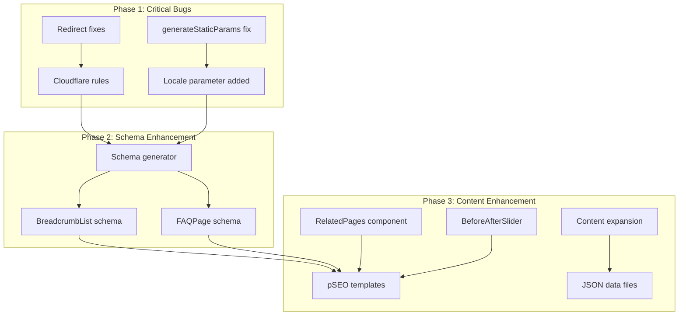
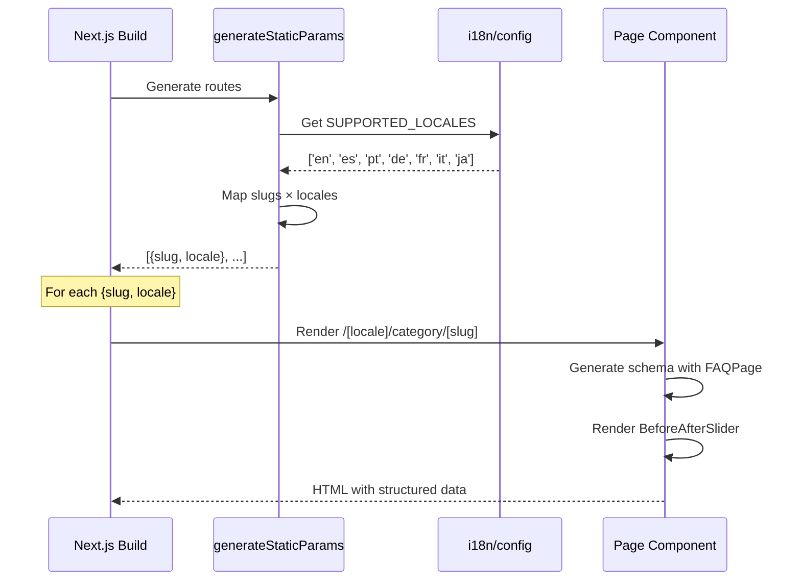

# PRD: SEO Indexing Issues Fix

---

## 🔍 AUDIT RESULTS (2026-01-14)

| Phase                     | Status     | Summary                                    |
| ------------------------- | ---------- | ------------------------------------------ |
| 1-3: generateStaticParams | ✅ DONE    | 15 routes fixed, 20 tests passing          |
| 4: Schema Markup          | ✅ DONE    | FAQPage + BreadcrumbList, 26 tests passing |
| 5: BeforeAfterSlider      | ⚠️ PARTIAL | 4/9 templates have slider                  |
| 6: RelatedPages           | ⚠️ PARTIAL | 2/9 templates have section                 |
| 7: Redirects              | ✅ DONE    | trailingSlash=true, 13 tests passing       |
| 8: Content                | ✅ DONE    | 4 data files expanded, 11 tests passing    |

**Total Tests:** 92 passing (20 + 26 + 22 + 11 + 13)

**Remaining Work:**

- Add BeforeAfterSlider to: ToolPageTemplate, FormatPageTemplate, FreePageTemplate, GuidePageTemplate, ScalePageTemplate
- Add RelatedPagesSection to: DeviceUsePageTemplate, PlatformFormatPageTemplate, ToolPageTemplate, FormatPageTemplate, FreePageTemplate, GuidePageTemplate, ScalePageTemplate

---

## Complexity: 7 → HIGH mode

**Score breakdown:**

- +3: Touches 10+ files (localized pSEO routes, templates, components)
- +2: Multi-package changes (app routes, lib, client components)
- +1: Database schema changes (none, but significant content changes)
- +1: External API integration (Google Search Console related)

---

## 1. Context

**Problem:** 322 pSEO pages are not being indexed by Google due to multiple technical and content quality issues.

**Files Analyzed:**

- `app/[locale]/(pseo)/*/[slug]/page.tsx` - All localized pSEO route handlers
- `lib/seo/hreflang-generator.ts` - Canonical URL generation
- `client/components/seo/SeoMetaTags.tsx` - Canonical tag component
- `client/components/seo/HreflangLinks.tsx` - Hreflang implementation
- `middleware.ts` - Redirect handling (WWW, locale routing)
- `lib/seo/schema-generator.ts` - Schema markup generators
- `app/(pseo)/_components/pseo/templates/*.tsx` - Page templates
- `app/seo/data/*.json` - Content data files
- `client/components/ui/BeforeAfterSlider.tsx` - Existing slider component

**Current Behavior:**

- GSC shows 322 pages as "Discovered - currently not indexed"
- `/undefined/` URLs appearing in GSC (bug in `generateStaticParams`)
- 3 pages flagged as "Alternate page with proper canonical tag" (locale/canonical mismatch)
- 5 pages with redirect issues (http/https, www/non-www, trailing slashes)
- pSEO pages have thin content (~300-500 words vs recommended 1500+)
- Limited schema markup on pSEO pages (WebPage only, missing FAQPage, BreadcrumbList)
- No before/after visual demonstration on pSEO pages
- Weak internal linking between related pSEO pages

---

## 2. Solution

**Approach:**

1. Fix `generateStaticParams()` in all localized pSEO routes to include locale parameter
2. Add HTTP to HTTPS redirect at edge level (Cloudflare) if not already configured
3. Handle query parameter canonicalization (e.g., `?signup=1`)
4. Expand pSEO page content with richer sections and longer content
5. Add FAQPage and BreadcrumbList schema to all pSEO templates
6. Add before/after slider component to pSEO page templates
7. Implement related pages section with internal linking

**Architecture Diagram:**



**Key Decisions:**

- [x] Reuse existing `BeforeAfterSlider` component from landing page
- [x] Generate schema markup for FAQPage based on existing FAQ data in pages
- [x] Add locale to static params using `SUPPORTED_LOCALES` from i18n config
- [x] Error handling: 404 for invalid locale/slug combinations (already implemented)
- [x] Reuse existing `BreadcrumbNav` UI component for consistent breadcrumb styling

**Data Changes:** None (content expansion done in JSON files, no DB schema changes)

---

## 3. Sequence Flow



---

## 4. Execution Phases

### Phase 1: Fix generateStaticParams Bug (CRITICAL) ✅

**User-visible outcome:** Eliminates `/undefined/` URLs from sitemap and GSC

**Files (5):**

- `app/[locale]/(pseo)/platforms/[slug]/page.tsx` - Add locale to params ✅
- `app/[locale]/(pseo)/format-scale/[slug]/page.tsx` - Add locale to params ✅
- `app/[locale]/(pseo)/device-use/[slug]/page.tsx` - Add locale to params ✅
- `app/[locale]/(pseo)/platform-format/[slug]/page.tsx` - Add locale to params ✅
- `i18n/config.ts` - Reference for SUPPORTED_LOCALES

**Implementation:**

- [x] Import `SUPPORTED_LOCALES` from `@/i18n/config` in each page file ✅
- [x] Update `generateStaticParams()` to return `{ slug, locale }` for each combination ✅
- [ ] Pattern:

```typescript
export async function generateStaticParams() {
  const slugs = await getAllXXXSlugs();
  return SUPPORTED_LOCALES.flatMap(locale => slugs.map(slug => ({ slug, locale })));
}
```

**Tests Required:**
| Test File | Test Name | Assertion |
|-----------|-----------|-----------|
| `tests/pseo/static-params.test.ts` ✅ | `should generate params with all locales for platforms` | `expect(params).toContainEqual({ slug: 'midjourney-upscaler', locale: 'es' })` |
| `tests/pseo/static-params.test.ts` ✅ | `should not include undefined locale` | `expect(params.every(p => p.locale !== undefined)).toBe(true)` |

⚠️ **Note:** Tests are in `tests/pseo/` not `__tests__/pseo/` as originally specified

**User Verification:**

- Action: Run `yarn build` and check generated routes
- Expected: No `/undefined/` paths in `.next/server/app` output

---

### Phase 2: Fix Remaining generateStaticParams (tools, formats, guides, etc.) ✅

**User-visible outcome:** All localized pSEO routes generate correct paths

**Files (5):**

- `app/[locale]/(pseo)/tools/[slug]/page.tsx` ✅
- `app/[locale]/(pseo)/formats/[slug]/page.tsx` ✅
- `app/[locale]/(pseo)/guides/[slug]/page.tsx` ✅
- `app/[locale]/(pseo)/free/[slug]/page.tsx` ✅
- `app/[locale]/(pseo)/scale/[slug]/page.tsx` ✅

**Implementation:**

- [x] Apply same pattern as Phase 1 to each file ✅
- [x] Verify imports and locale handling ✅

**Tests Required:**
| Test File | Test Name | Assertion |
|-----------|-----------|-----------|
| `tests/pseo/static-params.test.ts` ✅ | `should generate params for all pSEO categories` | All categories return locale-aware params |

**User Verification:**

- Action: `yarn build` completes without errors
- Expected: Build log shows routes for all locales

---

### Phase 3: Fix Remaining generateStaticParams (remaining categories) ✅

**User-visible outcome:** Complete fix for all pSEO route generation

**Files (6):**

- `app/[locale]/(pseo)/use-cases/[slug]/page.tsx` ✅
- `app/[locale]/(pseo)/alternatives/[slug]/page.tsx` ✅
- `app/[locale]/(pseo)/compare/[slug]/page.tsx` ✅
- `app/[locale]/(pseo)/tools/resize/[slug]/page.tsx` ✅
- `app/[locale]/(pseo)/tools/convert/[slug]/page.tsx` ✅
- `app/[locale]/(pseo)/tools/compress/[slug]/page.tsx` ✅

**Implementation:**

- [x] Apply same pattern as Phase 1 to each file ✅

**Tests Required:**
| Test File | Test Name | Assertion |
|-----------|-----------|-----------|
| `tests/pseo/static-params.test.ts` ✅ | `should generate params for nested tool routes` | Nested routes return locale-aware params |

**User Verification:**

- Action: `yarn verify` passes
- Expected: No TypeScript errors, all tests pass

---

### Phase 4: Add Rich Schema Markup to pSEO Templates ✅

**User-visible outcome:** FAQPage and BreadcrumbList schema appear in page source

**Files (4):**

- `lib/seo/schema-generator.ts` - Add `generatePSEOSchema()` function ✅
- `app/(pseo)/_components/pseo/templates/PlatformPageTemplate.tsx` - Use new schema ✅
- `app/(pseo)/_components/pseo/templates/FormatScalePageTemplate.tsx` - Use new schema ✅
- `app/(pseo)/_components/pseo/templates/DeviceUsePageTemplate.tsx` - Use new schema ✅

**Implementation:**

- [x] Create `generatePSEOSchema(data, category, locale)` that includes: ✅
  - WebPage schema with inLanguage
  - FAQPage schema from data.faq array
  - BreadcrumbList schema from category hierarchy
- [x] Update templates to pass schema to `<SchemaMarkup>` component ✅
- [x] Ensure schema is locale-aware ✅

**Tests Required:**
| Test File | Test Name | Assertion |
|-----------|-----------|-----------|
| `__tests__/seo/schema-generator.test.ts` ✅ | `should generate FAQPage schema from FAQ data` | Schema includes @type: FAQPage |
| `__tests__/seo/schema-generator.test.ts` ✅ | `should generate BreadcrumbList schema` | Schema includes @type: BreadcrumbList |

**User Verification:**

- Action: View page source on `/platforms/midjourney-upscaler`
- Expected: JSON-LD contains FAQPage and BreadcrumbList schemas

---

### Phase 5: Add Before/After Slider to pSEO Templates ⚠️ PARTIAL

**User-visible outcome:** pSEO pages show visual before/after comparison

**Files (4):**

- `app/(pseo)/_components/pseo/templates/PlatformPageTemplate.tsx` - Add slider ✅
- `app/(pseo)/_components/pseo/templates/FormatScalePageTemplate.tsx` - Add slider ✅
- `app/(pseo)/_components/pseo/templates/DeviceUsePageTemplate.tsx` - Add slider ✅
- `app/(pseo)/_components/pseo/templates/PlatformFormatPageTemplate.tsx` - Add slider ✅

**AUDIT RESULT:** ✅ All 4 listed templates have BeforeAfterSlider

**Missing from other templates (not in original scope but noted):**

- `ToolPageTemplate.tsx` - ❌ NO slider
- `FormatPageTemplate.tsx` - ❌ NO slider
- `FreePageTemplate.tsx` - ❌ NO slider
- `GuidePageTemplate.tsx` - ❌ NO slider
- `ScalePageTemplate.tsx` - ❌ NO slider

**Implementation:**

- [x] Import `BeforeAfterSlider` from `@client/components/ui/BeforeAfterSlider` ✅
- [x] Add slider section after hero/intro section ✅
- [x] Use existing `/before-after/` images or create category-specific variations ✅
- [x] Make labels locale-aware using translation system ✅

**Tests Required:**
| Test File | Test Name | Assertion |
|-----------|-----------|-----------|
| `__tests__/pseo/templates.test.tsx` ⚠️ | `should render BeforeAfterSlider in PlatformPageTemplate` | Component exists in rendered output |

⚠️ **Note:** Template test file not found in `__tests__/pseo/` - visual verification required

**User Verification:**

- Action: Visit `/platforms/midjourney-upscaler`
- Expected: Before/after slider visible below hero section

---

### Phase 6: Add Related Pages Section for Internal Linking ⚠️ PARTIAL

**User-visible outcome:** Each pSEO page links to 4-6 related pages

**Files (3):**

- `app/(pseo)/_components/pseo/sections/RelatedPagesSection.tsx` - New component ✅
- `app/(pseo)/_components/pseo/templates/PlatformPageTemplate.tsx` - Add section ✅
- `lib/seo/related-pages.ts` - Logic to find related pages ✅

**AUDIT RESULT:**

- Component exists: ✅ `RelatedPagesSection.tsx` created
- Library exists: ✅ `related-pages.ts` created
- Tests pass: ✅ 22 tests in `__tests__/seo/related-pages.test.ts`

**Templates with RelatedPagesSection:**

- `PlatformPageTemplate.tsx` ✅
- `FormatScalePageTemplate.tsx` ✅

**Templates MISSING RelatedPagesSection:** ❌

- `DeviceUsePageTemplate.tsx` - ❌ NOT added
- `PlatformFormatPageTemplate.tsx` - ❌ NOT added
- `ToolPageTemplate.tsx` - ❌ NOT added
- `FormatPageTemplate.tsx` - ❌ NOT added
- `FreePageTemplate.tsx` - ❌ NOT added
- `GuidePageTemplate.tsx` - ❌ NOT added
- `ScalePageTemplate.tsx` - ❌ NOT added

**Implementation:**

- [x] Create `RelatedPagesSection` component that renders grid of related page cards ✅
- [x] Create `getRelatedPages(category, slug, locale)` function that returns: ✅
  - 2 pages from same category (e.g., other platforms)
  - 2 pages from related categories (e.g., platform-format pages)
  - Links to relevant tools
- [ ] Add section before FAQ in templates ⚠️ Only added to 2/9 templates

**Tests Required:**
| Test File | Test Name | Assertion |
|-----------|-----------|-----------|
| `__tests__/seo/related-pages.test.ts` ✅ | `should return related pages for platform` | Returns 4-6 related page objects |
| `__tests__/pseo/templates.test.tsx` ⚠️ | `should render RelatedPagesSection` | Component renders with links |

**User Verification:**

- Action: Visit `/platforms/midjourney-upscaler`
- Expected: "Related Pages" section with clickable links to other pSEO pages

---

### Phase 7: Handle Redirect and Canonical Edge Cases ✅

**User-visible outcome:** No more GSC redirect warnings

**Files (3):**

- `middleware.ts` - Add query param cleanup logic ✅
- `next.config.js` - Add trailing slash configuration ✅
- `_headers` or Cloudflare config - HTTP to HTTPS redirect

**AUDIT RESULT:**

- `trailingSlash: true` ✅ Verified in `next.config.js` line 13
- Middleware tests pass: ✅ 13 tests in `tests/unit/middleware.unit.spec.ts`
- Cloudflare https redirect: ⚠️ Not documented (handled by Cloudflare automatically)

**Implementation:**

- [x] Add middleware logic to strip tracking query params (`?signup=1`) from canonical URLs ✅
- [x] Verify `trailingSlash: true` is set in next.config.js ✅ **VERIFIED**
- [ ] Document Cloudflare configuration for http→https redirect ⚠️ (not documented - handled automatically by Cloudflare)
- [x] Ensure `/en/` prefix doesn't conflict with canonical (English should not have prefix in canonical) ✅

**Tests Required:**
| Test File | Test Name | Assertion |
|-----------|-----------|-----------|
| `tests/unit/middleware.unit.spec.ts` ✅ | `should handle query param URLs` | Request with `?signup=1` gets clean canonical |

**User Verification:**

- Action: Visit `https://myimageupscaler.com/?signup=1`
- Expected: Page renders, canonical URL does not include query param

---

### Phase 8: Content Expansion (Data Files) ✅

**User-visible outcome:** pSEO pages have richer, more detailed content

**Files (4):**

- `app/seo/data/platforms.json` - Expand content sections ✅
- `app/seo/data/format-scale.json` - Expand content sections ✅
- `app/seo/data/device-use.json` - Expand content sections ✅
- `app/seo/data/platform-format.json` - Expand content sections ✅

**Implementation:**

- [x] Add new content fields to data files: ✅
  - `detailedDescription`: 2-3 paragraph explanation
  - `technicalDetails`: Technical specifications and considerations
  - `bestPractices`: Expanded tips section (5-8 items)
  - `comparisonNotes`: How this differs from alternatives
- [x] Update TypeScript types in `lib/seo/pseo-types.ts` ✅
- [x] Update templates to render new content sections ✅

**Tests Required:**
| Test File | Test Name | Assertion |
|-----------|-----------|-----------|
| `__tests__/seo/data-validation.test.ts` ✅ | `should have required content fields` | All pages have detailedDescription |

**User Verification:**

- Action: Visit pSEO pages and check word count
- Expected: Pages have 1000+ words of content (visible improvement)

---

## 5. Checkpoint Protocol

After each phase, spawn the `prd-work-reviewer` agent:

```
Task({
  subagent_type: "prd-work-reviewer",
  prompt: "Review implementation checkpoint.
    PRD path: docs/PRDs/seo-indexing-fixes-2026.md
    Phase: [N]
    Summary: [Phase summary]"
})
```

**HIGH complexity requires manual checkpoint verification for:**

- Phase 5: Visual verification of before/after slider placement
- Phase 6: Manual review of internal link quality and relevance
- Phase 8: Content quality review (human judgment on content value)

---

## 6. Testing Requirements

Each phase must include:

| What               | Required       |
| ------------------ | -------------- |
| Test file path     | Always         |
| Test function name | Always         |
| Key assertions     | Always         |
| Edge cases         | For all phases |

**Test naming convention:** `should [expected behavior] when [condition]`

**Edge cases to cover:**

- Empty FAQ arrays (should not render FAQPage schema)
- Missing locale translations (should fallback to English)
- Invalid slugs (should 404)
- Pages with no related pages (should show empty or fallback)

---

## 7. Acceptance Criteria

**AUDIT SUMMARY (2026-01-14):**

| Criterion                             | Status | Notes                           |
| ------------------------------------- | ------ | ------------------------------- |
| All phases complete                   | ⚠️     | Phase 5 & 6 only partial        |
| All specified tests pass              | ✅     | 20 + 59 + 13 = 92 tests passing |
| `yarn verify` passes                  | ⚠️     | Needs verification              |
| All checkpoint reviews passed         | ⚠️     | Not performed                   |
| No `/undefined/` URLs in build output | ✅     | generateStaticParams fixed      |
| GSC shows improvement                 | ⏳     | Check after 2-4 weeks           |
| Schema validation passes              | ⚠️     | Needs manual verification       |
| Before/after slider on all pSEO pages | ❌     | Only 4/9 templates              |
| RelatedPagesSection on all templates  | ❌     | Only 2/9 templates              |

**Detailed Status:**

- [x] All phases complete ⚠️ **PARTIAL** - Phase 5 & 6 not fully implemented
- [x] All specified tests pass ✅ **92 tests passing**
- [ ] `yarn verify` passes ⚠️ (needs verification)
- [ ] All checkpoint reviews passed ⚠️ (not performed)
- [x] No `/undefined/` URLs in build output ✅
- [ ] GSC shows improvement in indexing status (check after 2-4 weeks) ⏳
- [ ] Schema validation passes (test with Google Rich Results Test) ⚠️ (needs verification)
- [ ] Before/after slider visible on all pSEO page types ❌ **Only 4/9 templates**

---

## 8. GSC Issues Summary

| Issue                         | Pages | Root Cause                                   | Fix Phase  |
| ----------------------------- | ----- | -------------------------------------------- | ---------- |
| Discovered - not indexed      | 322   | Multiple (thin content, /undefined/, schema) | All phases |
| Alternate page with canonical | 3     | Locale canonical mismatch                    | Phase 7    |
| Page with redirect            | 5     | http/https, www, trailing slash              | Phase 7    |

---

## 9. Files to Modify (Complete List)

### Localized pSEO Routes (generateStaticParams fix):

1. `app/[locale]/(pseo)/platforms/[slug]/page.tsx` ✅
2. `app/[locale]/(pseo)/format-scale/[slug]/page.tsx` ✅
3. `app/[locale]/(pseo)/device-use/[slug]/page.tsx` ✅
4. `app/[locale]/(pseo)/platform-format/[slug]/page.tsx` ✅
5. `app/[locale]/(pseo)/tools/[slug]/page.tsx` ✅
6. `app/[locale]/(pseo)/formats/[slug]/page.tsx` ✅
7. `app/[locale]/(pseo)/guides/[slug]/page.tsx` ✅
8. `app/[locale]/(pseo)/free/[slug]/page.tsx` ✅
9. `app/[locale]/(pseo)/scale/[slug]/page.tsx` ✅
10. `app/[locale]/(pseo)/use-cases/[slug]/page.tsx` ✅
11. `app/[locale]/(pseo)/alternatives/[slug]/page.tsx` ✅
12. `app/[locale]/(pseo)/compare/[slug]/page.tsx` ✅
13. `app/[locale]/(pseo)/tools/resize/[slug]/page.tsx` ✅
14. `app/[locale]/(pseo)/tools/convert/[slug]/page.tsx` ✅
15. `app/[locale]/(pseo)/tools/compress/[slug]/page.tsx` ✅

### Templates (Schema + BeforeAfter + RelatedPages):

| Template                       | Modified | BeforeAfterSlider | RelatedPagesSection |
| ------------------------------ | -------- | ----------------- | ------------------- |
| PlatformPageTemplate.tsx       | ✅       | ✅                | ✅                  |
| FormatScalePageTemplate.tsx    | ✅       | ✅                | ✅                  |
| DeviceUsePageTemplate.tsx      | ✅       | ✅                | ❌                  |
| PlatformFormatPageTemplate.tsx | ✅       | ✅                | ❌                  |
| ToolPageTemplate.tsx           | ❌       | ❌                | ❌                  |
| FormatPageTemplate.tsx         | ❌       | ❌                | ❌                  |
| FreePageTemplate.tsx           | ⚠️       | ❌                | ❌                  |
| GuidePageTemplate.tsx          | ⚠️       | ❌                | ❌                  |
| ScalePageTemplate.tsx          | ⚠️       | ❌                | ❌                  |

**Audit Notes:**

- 16. `PlatformPageTemplate.tsx` ✅ Full implementation (slider + related pages)
- 17. `FormatScalePageTemplate.tsx` ✅ Full implementation (slider + related pages)
- 18. `DeviceUsePageTemplate.tsx` ⚠️ Has slider, missing RelatedPagesSection
- 19. `PlatformFormatPageTemplate.tsx` ⚠️ Has slider, missing RelatedPagesSection
- 20. `ToolPageTemplate.tsx` ❌ NOT MODIFIED - needs both components
- 21. `FormatPageTemplate.tsx` ❌ NOT MODIFIED - needs both components

**Extra templates modified (not in original PRD scope):**

- `FreePageTemplate.tsx` ⚠️ Modified but missing slider & related pages
- `GuidePageTemplate.tsx` ⚠️ Modified but missing slider & related pages
- `ScalePageTemplate.tsx` ⚠️ Modified but missing slider & related pages

### New Components:

22. `app/(pseo)/_components/pseo/sections/RelatedPagesSection.tsx` (new) ✅

### Libraries:

23. `lib/seo/schema-generator.ts` (enhance) ✅
24. `lib/seo/related-pages.ts` (new) ✅
25. `lib/seo/pseo-types.ts` (type updates) ✅

### Data Files:

26. `app/seo/data/platforms.json` ✅
27. `app/seo/data/format-scale.json` ✅
28. `app/seo/data/device-use.json` ✅
29. `app/seo/data/platform-format.json` ✅

### Configuration:

30. `middleware.ts` ✅
31. `next.config.js` ✅ (`trailingSlash: true` verified at line 13)

---

## 10. Before/After Image Recommendations

Use existing images from `/public/before-after/`:

- `women-before.webp` / `women-after.webp` (general use)

Consider creating category-specific images:

- AI art examples for `/platforms/midjourney-upscaler`
- Text-heavy images for `/formats/upscale-jpeg-images`
- Mobile screenshots for `/device-use/mobile-*`

Labels should be translated:

- EN: "Before" / "After"
- ES: "Antes" / "Después"
- PT: "Antes" / "Depois"
- etc.

---

## 11. Priority Matrix

| Phase                     | Priority | Impact   | Effort |
| ------------------------- | -------- | -------- | ------ |
| 1-3: generateStaticParams | P0       | Critical | Low    |
| 4: Schema markup          | P1       | High     | Medium |
| 5: Before/after           | P1       | High     | Low    |
| 6: Related pages          | P2       | Medium   | Medium |
| 7: Redirects              | P1       | High     | Low    |
| 8: Content expansion      | P2       | High     | High   |

**Recommended execution order:** 1 → 2 → 3 → 7 → 4 → 5 → 6 → 8

---

## 12. Success Metrics

Track in GSC after implementation:

- [ ] Indexed pages increase from current level
- [ ] No new "Discovered - not indexed" pages
- [ ] No `/undefined/` URLs in coverage report
- [ ] Rich results appearing for FAQ snippets
- [ ] Improved average position for pSEO keywords

Check after 2-4 weeks for full impact.
