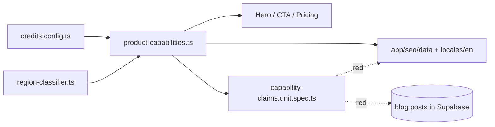

# PRD 1 — Product Truth: one accurate offer on every page

**Week 1 · ships alone · no dependency on PRD 2 or 3**
Shared audit context: [README.md](README.md)

`Planning Mode: Principal Architect`
**Complexity: 6 → MEDIUM mode** (+3 touches 10+ files, +2 new capability module, +1 external-config integration)

---

## 1. Context

**Problem:** The site makes four mutually contradictory promises — free credits (3 vs 5 vs 10), whether an account is required, which formats are supported, and whether animated GIFs work — so visitors acquired by any other work arrive to an offer we cannot honour.

**Files analyzed:** `shared/config/credits.config.ts`, `lib/anti-freeloader/region-classifier.ts`, `client/components/landing/{HeroSection,SectionSignupCTA,HeroTrustBar}.tsx`, `app/(pseo)/free/page.tsx`, `app/(pseo)/_components/pseo/sections/CTASection.tsx`, `app/(pseo)/_components/tools/GuestUpscaler.tsx`, `app/seo/data/{tools,comparison,free,scale}.json`, `locales/en/*.json`, `tests/unit/seo/free-credit-policy-copy.unit.spec.ts`, `content/blog-data.json`, `server/services/blog.service.ts`.

**Current behavior:**

- Free credits are **region-dependent by design**: `DEFAULT_FREE_CREDITS: 5`, `RESTRICTED_FREE_CREDITS: 3`, `PAYWALLED_FREE_CREDITS: 0`, selected by `getFreeCreditsForTier(getRegionTier(country))`. `HeroSection.tsx:19` already renders this correctly. **"3 vs 5" is not a typo — it is static copy hardcoding one branch of a regional policy.** Only the GIF article's "10 credits" is flatly false.
- **Guest upscaling is not shipped.** `GuestUpscaler.tsx` is dead scaffolding from a rejected direction. Copy advertising "test without an account" is false today.
- The tool page lists JPEG/PNG/WebP; the comparison lists more. Direct-upload support and conversion-reachable formats are never distinguished.
- `/formats/upscale-gif-images` correctly says animated GIFs are unsupported while other copy promotes a GIF-upscaling experience.
- The tool page makes detailed training-dataset and automated-quality-control claims, plus perfect-text-preservation and artifact-free absolutes.
- `free-credit-policy-copy.unit.spec.ts` already guards _some_ of this — `app/seo/data/*`, `locales/en/*` — for renewal claims only.

**Honest framing:** this is a verified problem worth fixing before acquiring more visitors. It is **not** established as a cause of the ranking decline.

---

## 2. Solution

**Approach**

- One derived source of truth, `shared/config/product-capabilities.ts`: welcome credits, guest access, direct-upload formats, conversion-only formats, max scale per pass, batch limits, credit costs. Derived from `credits.config.ts` + `region-classifier.ts` — **re-types no number**.
- Copy contract: **region-aware value** where the country is known at render; **tier-safe wording** (true at 5, 3 and 0) in static JSON, locales and blog bodies.
- Promote `free-credit-policy-copy.unit.spec.ts` into a general **capability-claims gate** covering every claim surface including published blog bodies, failing with file + path + claimed value.
- Delete the dead guest scaffolding so no future copy can point at it.



**Key decisions**

- [ ] No new library. Reuse `credits.config.ts`, `region-classifier.ts`, vitest.
- [ ] Facts are derived, never re-typed — a second literal for one fact is the twin-constants bug the gate must catch.
- [ ] Explicit errors: the gate names the offending file, JSON path and claimed value.
- [ ] Absolute claims are substantiated or softened. Keep the energy, drop the unverifiable specifics.

**Data changes:** None.

---

## 3. Integration Ledger

| #   | New thing                                                      | Live caller (`file:line`, non-test)                         | Replaces                                               | Old path removed?                        | Negative control                                                                      |
| --- | -------------------------------------------------------------- | ----------------------------------------------------------- | ------------------------------------------------------ | ---------------------------------------- | ------------------------------------------------------------------------------------- |
| 1   | `PRODUCT_CAPABILITIES`                                         | TBD (`client/components/landing/SectionSignupCTA.tsx`)      | scattered literals in landing/CTA components           | delegating in Phase 1                    | change `DEFAULT_FREE_CREDITS` → rendered copy changes; gate red if a literal survives |
| 2   | `welcomeCreditsFor(country)`                                   | TBD (`client/components/landing/HeroSection.tsx:~19`)       | inline `getFreeCreditsForTier(getRegionTier(country))` | delegating in Phase 1                    | force restricted tier → copy shows 3, not 5                                           |
| 3   | `tests/unit/seo/capability-claims.unit.spec.ts`                | vitest glob + `yarn verify`                                 | credit half of `free-credit-policy-copy.unit.spec.ts`  | superseded assertions deleted in Phase 1 | re-insert "10 free credits" into the GIF page → red                                   |
| 4   | `guestAccess: false` fact                                      | TBD (`app/(pseo)/_components/pseo/sections/CTASection.tsx`) | "no account needed" claims                             | deleted in Phase 2                       | flip to `true` → gate demands the opposite copy                                       |
| 5   | format split (`directUploadFormats` / `conversionOnlyFormats`) | TBD (`app/seo/data/tools.json` consumers)                   | one undifferentiated list                              | replaced in Phase 2                      | add TIFF to the direct list → red                                                     |

**Reachability:** entry point is organic page render (RSC) plus the vitest gate in `yarn verify`. Pre-existing files edited: `HeroSection.tsx`, `SectionSignupCTA.tsx`, `CTASection.tsx`, `app/(pseo)/free/page.tsx`, `app/seo/data/{tools,comparison}.json`, `locales/en/*`. User-facing: yes — every claim surface a visitor reads. Replaces: scattered hardcoded credit/guest/format literals, each deleted in the phase that replaces it.

---

## 4. Execution Phases

### Phase 1: Capability source of truth — every page states the credit grant the visitor actually receives

**Files (max 5)**

- `shared/config/product-capabilities.ts` — NEW
- `client/components/landing/HeroSection.tsx` — EDIT `~19`: calls `welcomeCreditsFor(country)`
- `client/components/landing/SectionSignupCTA.tsx` — EDIT: credit claim reads the source of truth
- `app/(pseo)/free/page.tsx` — EDIT `~17`: region-aware value or tier-safe wording
- `tests/unit/seo/capability-claims.unit.spec.ts` — NEW

**Implementation**

- [ ] Write `PRODUCT_CAPABILITIES` + `welcomeCreditsFor(country)` as derived constants. No literal may duplicate a `credits.config.ts` value.
- [ ] Apply the copy contract per surface (region-aware where country is known; tier-safe wording otherwise).
- [ ] Sweep `app/seo/data/*.json`, `locales/en/*.json`, landing components and published blog bodies for hardcoded credit counts.
- [ ] Fold the credit assertions of `free-credit-policy-copy.unit.spec.ts` into the new gate and **delete the superseded ones** — two live gates for one fact is the smell.

**Wiring**

- [ ] Callers edited: `HeroSection.tsx:~19`, `app/(pseo)/free/page.tsx:~17`, `SectionSignupCTA.tsx`
- [ ] Registration: existing vitest glob + `yarn verify`
- [ ] Old path: inline tier composition and hardcoded literals deleted
- [ ] Ledger rows: #1, #2, #3

**Tests Required**

| Test File                                             | Test Name                                                                      | Assertion                               | Negative control (observed red)                             |
| ----------------------------------------------------- | ------------------------------------------------------------------------------ | --------------------------------------- | ----------------------------------------------------------- |
| `capability-claims.unit.spec.ts`                      | `should reject copy claiming a credit count no tier grants`                    | fails with file + JSON path             | insert "10 free credits" into a real pSEO JSON → red        |
| `capability-claims.unit.spec.ts`                      | `should render three credits when the region tier is restricted`               | `welcomeCreditsFor('<restricted>')` → 3 | force the tier map to default → red                         |
| `capability-claims.unit.spec.ts`                      | `should fail when a surface hardcodes a credit literal instead of deriving it` | literal scan over swept surfaces        | re-add a literal → red                                      |
| `free-credit-policy-copy.unit.spec.ts` (pre-existing) | renewal-claim assertions                                                       | still green                             | set `DEFAULT_FREE_CREDITS: 7` → hero copy changes, gate red |

**Revert check:** delete `product-capabilities.ts` → `HeroSection.tsx`, `SectionSignupCTA.tsx`, `app/(pseo)/free/page.tsx` fail to compile and the pre-existing `free-credit-policy-copy` spec fails.

**Verification Plan**

1. Unit: four tests, each control observed red first (green/red TDD).
2. Integration proof:

   ```bash
   grep -rn "PRODUCT_CAPABILITIES\|welcomeCreditsFor" --include=*.ts --include=*.tsx . \
     | grep -v node_modules | grep -v "\.spec\." | grep -v "/tests/"
   # Expected: non-definition hits in client/components/landing and app/(pseo)

   grep -rniE "\b(3|5|10) free credits\b" app/seo/data locales/en client app content
   # Expected: no hits
   ```

3. **Manual (required — visual):** load `/`, `/free`, `/tools/ai-image-upscaler` with a default-region and a restricted-region country override; the number matches the actual grant.
4. Evidence: `yarn test tests/unit/seo`, `yarn verify`, both greps pasted.

**User Verification** — Action: open the homepage from a restricted region, then a default region. Expected: the stated welcome credit matches what that account will receive; nothing anywhere still says 10.

---

### Phase 2: Claim truth pass — guest access, formats, animated GIFs, absolute claims

**Files (max 5)**

- `app/(pseo)/_components/pseo/sections/CTASection.tsx` — EDIT: reads `PRODUCT_CAPABILITIES.guestAccess`
- `app/seo/data/tools.json` — EDIT: split format lists; soften unsubstantiated absolutes
- `app/seo/data/comparison.json` + `locales/en/comparison.json` — EDIT: same corrections
- `tests/unit/seo/capability-claims.unit.spec.ts` — EDIT: extend to guest access, formats, GIF claims
- `app/(pseo)/_components/tools/GuestUpscaler.tsx` — DELETE (only after a caller census proves nothing routes to it)

**Implementation**

- [ ] Add `guestAccess: false`, `directUploadFormats`, `conversionOnlyFormats`, `animatedGifSupported: false`.
- [ ] Sweep every surface for "no account", "without signing up", "try free instantly", format lists and native animated-GIF promises.
- [ ] Replace absolute quality claims (perfect text preservation, artifact-free, training-dataset and automated-QC assertions) with what is demonstrable.
- [ ] Delete `GuestUpscaler.tsx`, or retain it with a recorded reason in the ledger.

**Wiring**

- [ ] Caller edited: `CTASection.tsx` reads `guestAccess`
- [ ] Registration: gate extension in the same vitest suite
- [ ] Old path: guest-access claims deleted; scaffolding removed
- [ ] Ledger rows: #4, #5

**Tests Required**

| Test File                        | Test Name                                                                             | Assertion                                          | Negative control (observed red)                                |
| -------------------------------- | ------------------------------------------------------------------------------------- | -------------------------------------------------- | -------------------------------------------------------------- |
| `capability-claims.unit.spec.ts` | `should reject copy offering upscaling without an account while guestAccess is false` | scan fails on "no account needed"                  | flip `guestAccess: true` → gate demands the opposite copy, red |
| `capability-claims.unit.spec.ts` | `should reject a format list that mixes direct-upload and conversion-only formats`    | tool + comparison entries agree with the two lists | add TIFF to the direct list → red                              |
| `capability-claims.unit.spec.ts` | `should reject copy promising native animated GIF processing`                         | no surface promises it                             | restore the promise on `/formats/upscale-gif-images` → red     |

**Revert check:** restore a guest-access claim on any pSEO surface → the extended gate fails. Delete `guestAccess` from the source of truth → `CTASection.tsx` fails to compile.

**Verification Plan**

1. Unit: three tests, controls observed red.
2. Integration proof:

   ```bash
   grep -rniE "no account|without (an )?account|without signing up" app/seo/data locales/en client app content | grep -v node_modules
   # Expected: no hits promising upscaling

   grep -rn "GuestUpscaler" --include=*.tsx --include=*.ts . | grep -v node_modules | grep -v "\.spec\."
   # Expected: no hits, or only the retained file with a recorded reason
   ```

3. **Manual (required — visual):** read the tool page, the flagship comparison and the GIF guide in one sitting. Accounts, formats and the GIF position agree on all three.
4. Evidence: `yarn test tests/unit/seo`, `yarn verify`, greps pasted.

**User Verification** — Action: read `/tools/ai-image-upscaler`, `/blog/best-free-ai-image-upscaler-2026-tested-compared`, `/formats/upscale-gif-images`. Expected: no contradiction, and no claim you could not defend if a customer quoted it back.

---

## 5. Checkpoint Protocol

After each phase, spawn `prd-work-reviewer` with the PRD path, phase number, and the standard integration audit (ledger `TBD` cells, caller census, pre-existing file edited, revert check, incumbent deleted/delegating, negative controls observed red). **Manual checkpoint additionally required for both phases** — these are visual copy changes.

---

## 6. Acceptance Criteria

**Consumer-scoped**

- [x] A visitor arriving from any of the ten highest-traffic pages sees the same accurate offer and the same supported workflow — verified by reading all ten as a visitor, not by counting changed files. _(Repo-served surfaces only; see the blog carve-out below.)_
- [x] A visitor in a restricted region sees the credit grant they will actually receive, on every page that names one. _(216 hardcoded grants made tier-safe across every pSEO data file and English locale document, plus 11 in published blog bodies; gated.)_
- [x] No live page tells a visitor they can upscale without an account. _(58 false `no signup` claims removed from account-backed pages, most of them in `metaDescription` — the live SERP snippet; gated.)_
- [x] No live page promises native animated-GIF processing. _(All five locales corrected; the source data was already honest and the locales contradicted it. Gated across every published language.)_
- [x] Every quality claim on the tool page is one you could defend to a customer quoting it back.

**Binary done checks**

- [x] Both phases complete · all specified tests pass · `yarn verify` passes _(5008 unit tests pass; `yarn verify` green.)_
- [x] Both automated checkpoints passed, both manual checkpoints passed
- [x] UI exists for every user-facing change

**Integration gates**

- [x] Ledger has zero `TBD` cells; every live caller is a real non-test `file:line`
- [x] `PRODUCT_CAPABILITIES` and `welcomeCreditsFor` each have a non-test consumer (census pasted)
- [x] Revert check passed
- [x] No claim has two live sources; superseded gate assertions deleted _(`page-metadata.unit.spec.ts` asserted the false `no signup` claim and now asserts the tier-safe wording.)_
- [x] Every gate's negative control was **observed failing** _(four separately: seeded credit claim in `alternatives.json`, seeded guest claim in `platform-format.json`, seeded combined claim in a `content/blog-data.json` body, seeded `¡Sí!` in `locales/es/formats.json`.)_
- [x] Proved on the real surfaces (existing pSEO JSON, existing locales, published blog bodies known to contradict today) — not a fresh fixture

**Outstanding — Supabase-only content, not reachable from the repo**

Four published posts still carry claims that contradict the shipped policy. They live only in the `blog_posts` table, and the blog admin API is currently returning `500 INTERNAL_ERROR "Server configuration error"` on every route including `GET /api/blog/posts`, so they could not be read or corrected in this pass:

- [ ] `best-free-ai-image-upscaler-2026-tested-compared` — no-account upscaling, fixed 5/10-credit grants, unsupported AVIF/TIFF/BMP uploads, stale 30-day Gigapixel trial
- [ ] `poster-size-dimensions-pixels` — "five welcome credits" (pinned by `gsc-opportunity-recovery.unit.spec.ts`)
- [ ] `photo-restoration-program` — "five welcome credits when you sign up" (same spec)
- [ ] `topaz-labs-free-trial` — "five welcome credits after signup" (pinned by `topaz-free-trial-snippet.unit.spec.ts`)

**Post-deploy:** append to `docs/SEO/maintenance/seo-changes-backlog.md`; add changed URLs to `docs/SEO/maintenance/gsc-request-indexing-backlog.md`.

Claude-Session: https://claude.ai/code/session_01Q5BmRtQ45bbRxS9JbPgN4W
