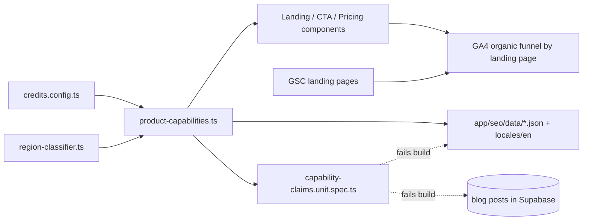
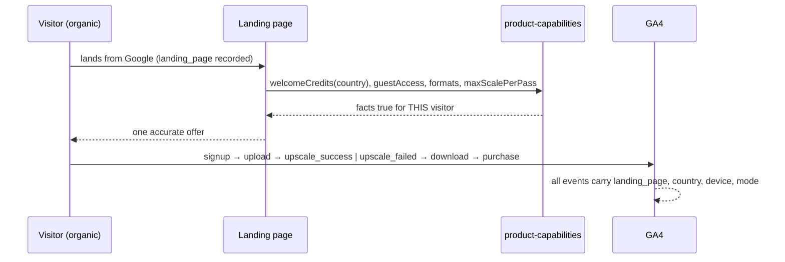

# SEO Recovery & Conversion Truth Pass — 30 Days (Sept 2026)

**Status:** PRD 1 done · PRD 2 done · PRD 3 partial — blocked on the blog admin API (last checked 2026-09-10)
**Owner:** Joao
**Window:** 2026-09-10 → 2026-10-10
**Source audit:** GSC, Aug 12 – Sep 8 2026 vs Jul 15 – Aug 11 2026 (explicit-date queries, not the rolling preview)

**This file is shared context and the index for three PRDs.** It is not itself a PRD — each PRD below carries its own complexity score, Integration Ledger, phases and acceptance criteria.

---

## 1. Context

**Problem:** Organic clicks fell 23.1% in 28 days while the site's public promises (credits, signup requirement, supported formats, animated-GIF support) contradict each other and the product, so acquiring more traffic before fixing the promises compounds the loss.

**Explicit decision this PRD encodes:** spend the next 30 days recovering traffic and improving conversion on pages that already work. **No new large batch of pSEO pages.**

### The data

| Metric                   | Previous 28d |  Latest 28d |     Change |
| ------------------------ | -----------: | ----------: | ---------: |
| Google Web Search clicks |        8,199 |   **6,308** | **−23.1%** |
| Impressions              |      377,471 | **324,738** | **−14.0%** |
| CTR                      |        2.17% |   **1.94%** |   −0.23 pp |
| Average position         |        12.26 |   **17.34** | 5.09 worse |

This is **not** one uniform site-wide ranking problem. Average position moves with which queries get impressions. The page level shows several different patterns.

| Page                                                     | Prev clicks |    Latest |              Change | What stands out                              |
| -------------------------------------------------------- | ----------: | --------: | ------------------: | -------------------------------------------- |
| Homepage                                                 |       3,705 | **2,327** | **−1,378 / −37.2%** | Impressions and rankings both weakened       |
| `/blog/best-free-ai-image-upscaler-2026-tested-compared` |       1,468 |   **806** |   **−662 / −45.1%** | CTR fell far more than ranking               |
| `/format-scale/gif-upscale-16x`                          |         204 |     **0** |                −204 | Google reports a redirect (ours, deliberate) |
| `/formats/upscale-gif-images`                            |         162 |    **36** |       −126 / −77.8% | Still indexed, substantially weaker          |

Those two top pages alone lost **2,040 reported page clicks**, exceeding the property's net decline of 1,891 — gains elsewhere are partially offsetting. (Page and property aggregations are not perfectly interchangeable.)

History says the traction is real and recoverable, not hypothetical:
homepage **1,328 (May) → 2,524 (Jun) → 4,948 (Jul) → 3,085 (Aug)**;
comparison article **162 → 803 → 1,802 → 1,135**.

### A quarter of the decline is branded demand, not ranking

Exact-match brand set (`myimageupscaler`, `my image upscaler`, `myimageupscaler.com`, `https myimageupscaler com`):

| Branded metric | Previous |     Latest |
| -------------- | -------: | ---------: |
| Clicks         |    1,228 |    **774** |
| Impressions    |    2,444 |  **1,431** |
| Avg position   |     1.01 |   **1.04** |
| CTR            |   50.25% | **54.09%** |

454 branded clicks lost **while still ranking ~#1** — roughly **24% of the net property decline**. Interpretation: part of the problem is reduced branded-search demand (returning users, referrals, promotion, product usage), not Google failing to rank us. This does **not** prove a retention problem, and title changes will not explain or fix it. Phase 3 is what makes this measurable.

### Files analyzed

- `shared/config/credits.config.ts`, `lib/anti-freeloader/region-classifier.ts`
- `client/components/landing/HeroSection.tsx`, `SectionSignupCTA.tsx`, `client/components/features/landing/Pricing.tsx`
- `app/seo/data/{free,tools,scale,comparison,alternatives}.json`, `locales/en/*.json`
- `app/(pseo)/free/page.tsx`, `app/(pseo)/_components/tools/GuestUpscaler.tsx`, `_components/pseo/sections/CTASection.tsx`
- `middleware.ts`, `lib/seo/intent-ownership.ts`, `app/[locale]/blog/page.tsx`, `app/robots.ts`, `app/sitemap-static.xml/route.ts`
- `server/services/blog.service.ts`, `shared/config/env.ts` (`GA_MEASUREMENT_ID`, `GA4_API_SECRET`)
- Existing gates: `tests/unit/seo/{free-credit-policy-copy,topaz-free-trial-snippet,blog-index-params-noindex,gif-intent-consolidation,three-kings-*}.unit.spec.ts`

### Current behavior (what the code actually does today)

- **Free credits are region-dependent by design**: `DEFAULT_FREE_CREDITS: 5`, `RESTRICTED_FREE_CREDITS: 3`, `PAYWALLED_FREE_CREDITS: 0`, selected by `getFreeCreditsForTier(getRegionTier(country))`. The homepage hero already renders this dynamically. **The "3 vs 5" contradiction is not a typo — it is static copy elsewhere hardcoding one branch of a regional policy.** The GIF article's "10 credits" is simply stale and false.
- **Guest upscaling does not exist as a shipped product.** `GuestUpscaler.tsx` is dead scaffolding from a rejected direction. Any copy advertising "test without an account" is false today.
- **The GIF redirect is ours and deliberate.** `lib/seo/intent-ownership.ts` + `middleware.ts` 301 the `gif-upscale-{2,4,8,16}x` variants to `/formats/upscale-gif-images`, guarded by `tests/unit/seo/gif-intent-consolidation.unit.spec.ts`. It is not an accident to reverse blindly.
- **`?q=` / `?page=N` blog URLs already emit `noindex`** via `generateMetadata` in `app/[locale]/blog/page.tsx`, yet `/en/blog?page=7&q=guides` is still _submitted and indexed_, and the blog index still emits internal `?q=` links (lines ~293, ~316) that invite the crawl.
- **GA4 is wired into the product** (`GA_MEASUREMENT_ID`, `GA4_API_SECRET`). What is missing is not analytics — it is a landing-page-level join from organic entry to successful upscale, download and purchase. "GA4 not connected" was true only of the GSC Wizard connector.

---

## 2. Solution

**Approach**

- Establish **one product-capabilities source of truth** (`shared/config/product-capabilities.ts`) covering welcome credits, guest access, supported formats, max scale per pass, batch limits and credit costs — derived from `credits.config.ts`, not duplicating it — and make every claim surface read from it.
- Make the free-credit claim **regionally honest** rather than picking a number: copy states the grant the visitor actually receives, or a form that is true for every tier.
- Turn `free-credit-policy-copy.unit.spec.ts` into a **general capability-claims gate** that fails on any surface (pSEO JSON, locales, landing components, published blog bodies) asserting a credit count, guest flow, format list or scale ceiling that contradicts the source of truth.
- **Instrument the organic funnel by landing page** before optimizing anything, so recovery is judged on paid conversions and contribution after processing cost, not clicks.
- Recover the **homepage** and the **flagship comparison** first; they are 2,040 of the lost clicks.
- **Audit** the GIF redirect and filtered URLs rather than reversing them; preserve the honest "we do not process animated GIFs" position.
- Strengthen pages that already rank (tool page, 16×, 2K, poster, Topaz, Photoshop). **Pause pSEO expansion; do not mass-delete.**

**Key decisions**

- [ ] No new library. Reuse `credits.config.ts`, `region-classifier.ts`, `zod` schemas, `vitest`, existing `.claude/skills/{gsc-analysis,ga-analysis,seo-growth-plan,three-kings-manager,blog-edit}`.
- [ ] Capability facts are **derived**, never re-typed. A second literal for the same fact is a bug the gate must catch (twin-constants anti-pattern).
- [ ] Editorial (blog) changes follow the established contract-spec pattern (`topaz-free-trial-snippet.unit.spec.ts`): pin exact copy + a `gsc-request-indexing-backlog.md` row.
- [ ] Errors explicit: the claims gate reports the offending file, path and claimed value — never a bare boolean.
- [ ] **No URL changes** on recovering pages. Titles/snippets may be tested; URLs are preserved and the previous title + change date recorded.

**Data changes:** None. No migrations.

---

## 3. Sequence Flow

---

## 4. The three PRDs

Each is independently shippable and carries its own complexity score, Integration Ledger, phases and acceptance criteria. This file is shared context only — it is not a PRD.

| #   | PRD                                                                                                                                   | Phases | Week | Ships alone?  |
| --- | ------------------------------------------------------------------------------------------------------------------------------------- | ------ | ---- | ------------- |
| 1   | [Product Truth](01-product-truth.md) — one accurate offer on every page                                                               | 2      | 1    | Yes           |
| 2   | [Measurement & URL Hygiene](02-funnel-and-url-hygiene.md) — know what a landing page is worth; verify the GIF and filtered-URL policy | 2      | 1    | Yes           |
| 3   | [Page Recovery](03-page-recovery.md) — homepage, flagship comparison, and the pages that already rank                                 | 3      | 2–4  | Needs 1 and 2 |

PRD 1 and PRD 2 can run in parallel. PRD 3 depends on PRD 1 for capability facts and PRD 2 for the funnel that judges whether the recovery worked.

### Proof subject (applies to all three)

**Proof subject:** the homepage and `/blog/best-free-ai-image-upscaler-2026-tested-compared` — the two largest real losses (2,040 clicks), in a live regional-credit, DB-backed-content environment.
**Not a toy:** no phase in any PRD is proved on a fresh scratch page. PRD 1's gate must run against the _existing_ pSEO JSON, the _existing_ locales and the _published_ blog bodies, which are known to contradict each other today.

### Cross-cutting rules

- **No new batch of pSEO pages this window.** Pause expansion; do not mass-delete.
- **No URL changes** on recovering pages. Record the previous title and change date for anything changed.
- **Do not change every title, template and link at once** — attribution becomes impossible.
- Every credit figure derives from PRD 1's `PRODUCT_CAPABILITIES`. No new literals anywhere.
- Recovery is judged on PRD 2's funnel — paid conversions and contribution after processing cost — not on clicks.

---

## 5. What plausible improvement looks like — not a forecast

At unchanged page-impression levels:

| Illustrative experiment | Assumed CTR change | Additional clicks / 28d |
| ----------------------- | ------------------ | ----------------------: |
| Flagship comparison     | 7.56% → 10%        |                **≈261** |
| Poster article          | 0.26% → 0.75%      |                **≈150** |
| Topaz trial article     | 1.32% → 2%         |                 **≈93** |
| **Combined arithmetic** |                    |                **≈503** |

These are **scenario calculations, not predictions or benchmarks.** They exist to show why improving existing pages is worth a month without assuming we suddenly rank #1 for "image upscaler". The business result still depends on whether those visitors successfully upscale and pay — which is exactly what Phase 3 makes visible.

---

## 6. Portfolio-level acceptance criteria

Criteria are written about the **consumer**, never the artifact.

**Product truth**

- [x] A visitor arriving from any of the ten highest-traffic pages sees the same accurate offer and the same supported workflow — verified by reading all ten as a visitor, not by counting files changed.
- [x] A visitor in a restricted region sees the credit grant they will actually receive, on every page that names one. _(Repo-served surfaces; four Supabase-only posts outstanding — see below.)_
- [x] No live page tells a visitor they can upscale without an account. _(Same carve-out.)_
- [x] No live page promises native animated-GIF processing.

**Recovery**

- [x] Homepage keeps its broad "image upscaler" role: the URL is unchanged, and its non-brand tracked query set is recorded with a dated baseline.
- [ ] The comparison article's Topaz/Gigapixel entry is correct by product and version, its ownership is disclosed, and its evidence is reproducible from the stated inputs. **Diagnosed only.**
- [x] Every GIF redirect lands on a relevant, indexable destination whose canonical agrees, and internal links point at the retained page directly. _(Verified live 2026-09-10.)_
- [x] `/en/blog?page=7&q=guides` and its siblings are out of the index, with ordinary pagination still discoverable. _(Verified live 2026-09-10.)_

**Measurement**

- [x] Successful upscales, downloads, purchases and failures can be compared **by organic landing page, country, device and mode** — including failed jobs, refunded credits and processing cost.
- [x] Branded-demand decline is tracked separately from non-brand ranking, so the two are never reported as one number again.

**Discipline**

- [x] No new batch of pSEO pages was published during this window.
- [x] Nothing was retired without checking backlinks and conversions first.
- [x] Every changed title/snippet has its previous value and change date recorded.

**Portfolio done**

- [x] [PRD 1](01-product-truth.md) done, all its integration gates checked
- [x] [PRD 2](02-funnel-and-url-hygiene.md) done, all its integration gates checked
- [ ] [PRD 3](03-page-recovery.md) done, all its integration gates checked

### The one thing still blocking this portfolio

Every remaining item needs a write to the `blog_posts` table, and the blog admin API returns `500 INTERNAL_ERROR "Server configuration error"` on every route including `GET /api/blog/posts` (checked 2026-09-10). Fix that credential/config first; the content work behind it is roughly half a day, and PRD 3 Phase 2 additionally needs a real benchmark run before the "Only 3 Worked" positioning can be kept rather than softened.

---

## 7. Limits of the source audit (carry these forward; do not overclaim)

- ~**49.2% of total clicks were not represented** in returned query-level rows, so page and property totals were weighted over visible keyword lists.
- Organic revenue, Core Web Vitals field data, the complete live redirect chain and a full-site crawl were **not** verified.
- GA4 was not connected to the GSC Wizard account; the CrUX API key was not configured there.
- The decline has **not** been attributed to speed, a Google update, a penalty or checkout failures. Copy inconsistency is a verified problem worth fixing — it is **not** a proven cause of the ranking decline.
- Do not treat the automated cannibalization score as evidence: it flags branded sitelinks, `site:` searches and in-page `#section` links. Investigate genuine editorial overlap ("best image upscaler" / "best AI photo enhancer" clusters) and merge only after checking intent, conversions, links and longer-term performance.
- Sitemaps are not the emergency: main sitemap has **0 errors** across 666 submitted URLs; the static sitemap has **1 warning**. `indexed: 0` from the API does not mean "nothing is indexed" — URL Inspection confirmed otherwise. Fix the warning; do not spend the sprint on sitemap cosmetics.
- Google Image Search produced **8 clicks** (from 26). Not a standalone project this window.

## 8. Post-deploy obligations

- Append an entry to [SEO changes backlog](../../SEO/maintenance/seo-changes-backlog.md) per shipped phase.
- Add one row per changed URL to [GSC request indexing backlog](../../SEO/maintenance/gsc-request-indexing-backlog.md); request indexing manually, then clean up.
- Re-measure the same page/query/device cohorts only **after** Google has had time to recrawl. Never change every title, URL and template at once.

Claude-Session: https://claude.ai/code/session_01Q5BmRtQ45bbRxS9JbPgN4W
