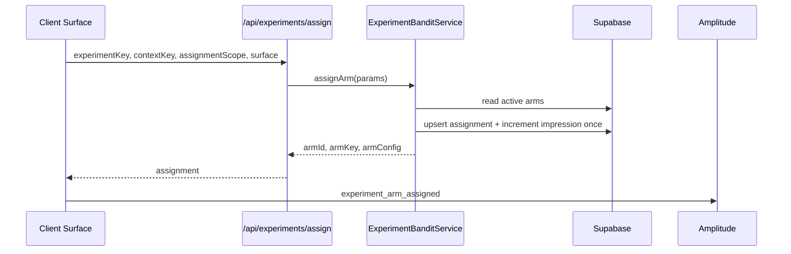
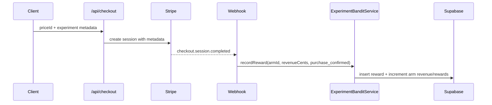

# PRD: Shared Bandit Experiment Platform

**Date:** 2026-05-26  
**Status:** Draft  
**Owner:** Growth / Platform  
**Depends on:** Existing regional pricing bandit  
**Enables:** Purchase conversion bandits, onboarding restoration bandit, post-download retention bandit, discount/rescue bandits  
**Complexity:** 11 -> HIGH mode

---

## 0. Complexity Assessment

**Score: 11 -> HIGH mode**

- +3 touches 10+ files across API, shared utilities, analytics, checkout metadata, webhook reward attribution, tests, and migrations
- +2 new reusable experiment assignment/reward module
- +2 complex state logic: stable assignment, context keys, delayed rewards, auth redirects, checkout/webhook attribution
- +1 database schema changes
- +1 external API integration: Amplitude event reporting and Stripe webhook reward attribution
- +2 multi-package changes across `app`, `client`, `server`, `shared`, `lib`, and `supabase`

This PRD is intentionally infrastructure-first. Product-specific bandits should not ship their own assignment logic, storage model, or reward attribution.

---

## 1. Context

**Problem:** MyImageUpscaler has one regional pricing bandit, but new purchase and retention bandits need a shared assignment, analytics, and reward system so experiments optimize real outcomes instead of clicks.

### Files Analyzed

- `docs/analysis/multi-armed-bandit-opportunities-2026-05-26.md`
- `docs/PRDs/regional-pricing-bandit.md`
- `lib/pricing-bandit/bandit.service.ts`
- `app/api/geo/route.ts`
- `app/api/checkout/route.ts`
- `app/api/webhooks/stripe/handlers/payment.handler.ts`
- `client/hooks/useRegionTier.ts`
- `client/utils/checkoutTrackingContext.ts`
- `client/analytics/analyticsClient.ts`
- `server/analytics/types.ts`
- `server/analytics/analyticsService.ts`
- `server/analytics/dashboardApi.ts`
- `shared/utils/pricing-geo-session.ts`
- `supabase/migrations/20260408_pricing_bandit_arms.sql`
- `tests/unit/pricing/bandit.service.unit.spec.ts`

### Current Behavior

- Regional pricing has a specialized Thompson Sampling service and table: `pricing_bandit_arms`.
- Product UX variants use local deterministic helpers such as `getVariant()`, but they do not optimize from rewards.
- Checkout metadata already carries `bandit_arm_id` for pricing and can carry more experiment attribution.
- Webhook-side `purchase_confirmed` is the most reliable purchase reward source.
- There is no generic table, API, or client helper for assigning reusable experiment arms.

---

## 2. Integration Points Checklist

**How will this feature be reached?**

- [x] Entry points identified:
  - Client UX surfaces request an assignment before rendering a treatment.
  - Server checkout route accepts experiment metadata from client context.
  - Stripe webhook records purchase rewards after successful payment.
  - Future server-side surfaces may assign arms directly.
- [x] Caller files identified:
  - Product PRDs will call shared assignment from `PurchaseModal`, `ModelGalleryModal`, onboarding, post-download prompts, discount banners, and checkout rescue.
  - `/api/checkout` will pass assignment metadata into Stripe session metadata.
  - `payment.handler.ts` will record purchase rewards.
- [x] Registration/wiring needed:
  - New migration for `experiment_arms` and reward/assignment audit tables.
  - New shared experiment service.
  - New API route or server action for client assignment.
  - Analytics event types for assignment and reward.

**Is this user-facing?**

- [x] Indirectly user-facing.
  - The platform itself is internal, but it decides which UI treatment users see.
  - Product PRDs define the visible treatments.

**Full user flow**

1. User reaches a bandit-enabled surface, such as purchase modal or onboarding.
2. Client requests or reads a stable assignment for `experimentKey + contextKey`.
3. Assignment service selects an active arm and records an impression once.
4. UI renders the assigned treatment.
5. Client includes `experimentArmId` in analytics and checkout context.
6. If a purchase happens, Stripe webhook records a revenue-weighted reward.
7. If a non-purchase reward happens, client/server records a binary or delayed reward event.

---

## 3. Solution

### Approach

1. Add a generic experiment-arm schema that can support Thompson Sampling for UX, checkout, and retention experiments.
2. Build a reusable assignment service modeled after `lib/pricing-bandit`, but keyed by `experiment_key` and `context_key`.
3. Persist stable assignment IDs in sessionStorage for session experiments and by user ID for lifecycle experiments.
4. Emit standard analytics: `experiment_arm_assigned` and `experiment_reward_recorded`.
5. Propagate experiment metadata through checkout context and Stripe metadata so webhook-side `purchase_confirmed` can reward the correct arm.

### Architecture Diagram

```mermaid
flowchart LR
    UI[Bandit-enabled UI] --> Hook[useExperimentArm]
    Hook --> API[/api/experiments/assign]
    API --> SVC[ExperimentBanditService]
    SVC --> DB[(experiment_arms)]
    UI --> A[Amplitude event metadata]
    UI --> CTX[checkoutTrackingContext]
    CTX --> Checkout[/api/checkout]
    Checkout --> Stripe[Stripe Session Metadata]
    Stripe --> Webhook[Stripe Webhook]
    Webhook --> Reward[recordExperimentReward]
    Reward --> DB
```

### Key Decisions

- Use Thompson Sampling for arm selection, with reward configurable per experiment.
- Preserve the existing regional pricing bandit for now. Do not migrate it in this PRD.
- Store `arm_config` as `jsonb` so product PRDs can define UI/copy/default-selection payloads without schema churn.
- Use `context_key` to split materially different populations, such as `model_gate:standard`, `purchase_modal:mobile`, or `onboarding:first_visit`.
- Record one impression per stable assignment per session/user to avoid modal reopen inflation.
- Optimize purchases on webhook-side revenue, not client-side success pages.

### Data Changes

Create a migration, suggested name:

`supabase/migrations/YYYYMMDD_create_experiment_bandit_tables.sql`

```sql
CREATE TABLE IF NOT EXISTS experiment_arms (
  id BIGSERIAL PRIMARY KEY,
  experiment_key TEXT NOT NULL,
  context_key TEXT NOT NULL DEFAULT 'global',
  arm_key TEXT NOT NULL,
  arm_config JSONB NOT NULL DEFAULT '{}'::jsonb,
  impressions INTEGER NOT NULL DEFAULT 0,
  rewards INTEGER NOT NULL DEFAULT 0,
  revenue_cents INTEGER NOT NULL DEFAULT 0,
  guardrail_failures INTEGER NOT NULL DEFAULT 0,
  is_active BOOLEAN NOT NULL DEFAULT true,
  created_at TIMESTAMPTZ NOT NULL DEFAULT now(),
  updated_at TIMESTAMPTZ NOT NULL DEFAULT now(),
  UNIQUE (experiment_key, context_key, arm_key)
);

CREATE TABLE IF NOT EXISTS experiment_assignments (
  id BIGSERIAL PRIMARY KEY,
  experiment_key TEXT NOT NULL,
  context_key TEXT NOT NULL,
  arm_id BIGINT NOT NULL REFERENCES experiment_arms(id),
  assignment_key TEXT NOT NULL,
  surface TEXT NOT NULL,
  metadata JSONB NOT NULL DEFAULT '{}'::jsonb,
  assigned_at TIMESTAMPTZ NOT NULL DEFAULT now(),
  UNIQUE (experiment_key, context_key, assignment_key)
);

CREATE TABLE IF NOT EXISTS experiment_rewards (
  id BIGSERIAL PRIMARY KEY,
  experiment_key TEXT NOT NULL,
  context_key TEXT NOT NULL,
  arm_id BIGINT NOT NULL REFERENCES experiment_arms(id),
  assignment_key TEXT,
  reward_type TEXT NOT NULL,
  reward_value INTEGER NOT NULL DEFAULT 1,
  revenue_cents INTEGER NOT NULL DEFAULT 0,
  source_event TEXT,
  metadata JSONB NOT NULL DEFAULT '{}'::jsonb,
  rewarded_at TIMESTAMPTZ NOT NULL DEFAULT now()
);

ALTER TABLE experiment_arms ENABLE ROW LEVEL SECURITY;
ALTER TABLE experiment_assignments ENABLE ROW LEVEL SECURITY;
ALTER TABLE experiment_rewards ENABLE ROW LEVEL SECURITY;

CREATE INDEX IF NOT EXISTS idx_experiment_arms_active
  ON experiment_arms (experiment_key, context_key)
  WHERE is_active = true;

CREATE INDEX IF NOT EXISTS idx_experiment_rewards_arm
  ON experiment_rewards (arm_id, rewarded_at);
```

Only service-role access should write these tables. Client assignment must go through an authenticated or safe server route.

---

## 4. Sequence Flows

### Assignment



### Purchase Reward



---

## 5. Execution Phases

#### Phase 1: Schema and Service - Experiments can be seeded and selected server-side

**Files (max 5):**

- `supabase/migrations/YYYYMMDD_create_experiment_bandit_tables.sql` - create tables and indexes
- `lib/experiments/experiment-bandit.service.ts` - generic Thompson Sampling assignment and reward logic
- `lib/experiments/index.ts` - exports
- `tests/unit/experiments/experiment-bandit.service.unit.spec.ts` - service tests
- `shared/types/experiments.types.ts` - shared assignment and reward types

**Implementation:**

- [ ] Add schema for arms, assignments, and rewards.
- [ ] Implement `assignExperimentArm(params)`.
- [ ] Implement `recordExperimentReward(params)`.
- [ ] Reuse beta/gamma sampling pattern from `lib/pricing-bandit/bandit.service.ts`.
- [ ] Ensure assignment impression increments only once per `experiment_key + context_key + assignment_key`.

**Tests Required:**

| Test File                                                       | Test Name                                      | Assertion                                                 |
| --------------------------------------------------------------- | ---------------------------------------------- | --------------------------------------------------------- |
| `tests/unit/experiments/experiment-bandit.service.unit.spec.ts` | `selects an active arm and records assignment` | Returns active arm and increments impressions once        |
| `tests/unit/experiments/experiment-bandit.service.unit.spec.ts` | `reuses stable assignment key`                 | Second call returns same arm without duplicate impression |
| `tests/unit/experiments/experiment-bandit.service.unit.spec.ts` | `records revenue reward`                       | Increments `rewards` and `revenue_cents`                  |
| `tests/unit/experiments/experiment-bandit.service.unit.spec.ts` | `returns null when no active arms exist`       | Product caller can fall back safely                       |

**User Verification:**

- Action: Seed test arms locally and call the service from a unit/integration test.
- Expected: Assignment and reward rows are written and arm counters update.

#### Phase 2: Assignment API and Client Hook - UI surfaces can request stable assignments

**Files (max 5):**

- `app/api/experiments/assign/route.ts` - assignment endpoint
- `client/hooks/useExperimentArm.ts` - client hook with sessionStorage persistence
- `client/utils/experimentAssignmentStorage.ts` - stable local assignment helpers
- `server/analytics/types.ts` - add experiment analytics event types
- `tests/unit/client/hooks/useExperimentArm.unit.spec.tsx` - hook tests

**Implementation:**

- [ ] Add POST endpoint accepting `experimentKey`, `contextKey`, `assignmentScope`, `surface`, and optional metadata.
- [ ] Generate anonymous session assignment keys client-side for session-scoped experiments.
- [ ] Use authenticated user ID when user-scoped experiments are requested and available.
- [ ] Return `armId`, `armKey`, `armConfig`, `experimentKey`, and `contextKey`.
- [ ] Track `experiment_arm_assigned` exactly once per stable assignment.

**Tests Required:**

| Test File                                                    | Test Name                              | Assertion                                                                              |
| ------------------------------------------------------------ | -------------------------------------- | -------------------------------------------------------------------------------------- |
| `tests/unit/client/hooks/useExperimentArm.unit.spec.tsx`     | `loads cached assignment`              | Does not call API when valid assignment exists                                         |
| `tests/unit/client/hooks/useExperimentArm.unit.spec.tsx`     | `requests assignment when missing`     | Calls endpoint and stores returned arm                                                 |
| `tests/unit/client/hooks/useExperimentArm.unit.spec.tsx`     | `falls back to control when API fails` | Returns configured fallback arm                                                        |
| `tests/unit/bugfixes/analytics-event-whitelist.unit.spec.ts` | `allows experiment events`             | Analytics whitelist accepts `experiment_arm_assigned` and `experiment_reward_recorded` |

**User Verification:**

- Action: Enable a test experiment on a non-critical local component.
- Expected: The same browser session receives the same arm after refresh.

#### Phase 3: Checkout Metadata and Webhook Rewards - Purchases reward assigned arms

**Files (max 5):**

- `client/utils/checkoutTrackingContext.ts` - carry experiment metadata
- `app/api/checkout/route.ts` - allow experiment metadata into Stripe metadata
- `app/api/webhooks/stripe/handlers/payment.handler.ts` - record purchase reward
- `shared/types/stripe.types.ts` - type checkout experiment metadata
- `tests/unit/api/payment-handler-fixes.unit.spec.ts` - webhook reward tests

**Implementation:**

- [ ] Extend checkout tracking context with `experimentKey`, `experimentArmId`, `experimentArmKey`, and `experimentContextKey`.
- [ ] Sanitize and allow reserved experiment metadata keys in `/api/checkout`.
- [ ] Add Stripe metadata fields with compact names to avoid metadata size issues.
- [ ] In webhook, parse experiment metadata and call `recordExperimentReward` on `purchase_confirmed`.
- [ ] Keep existing `bandit_arm_id` regional pricing logic unchanged.

**Tests Required:**

| Test File                                           | Test Name                                 | Assertion                                          |
| --------------------------------------------------- | ----------------------------------------- | -------------------------------------------------- |
| `tests/unit/api/checkout-route.unit.spec.ts`        | `preserves experiment metadata`           | Stripe session metadata includes experiment fields |
| `tests/unit/api/payment-handler-fixes.unit.spec.ts` | `records experiment reward on purchase`   | Webhook calls reward service with arm and amount   |
| `tests/unit/api/payment-handler-fixes.unit.spec.ts` | `ignores invalid experiment arm metadata` | Purchase still succeeds without reward write       |

**User Verification:**

- Action: Run a test checkout with experiment metadata in test mode.
- Expected: Checkout works and webhook test records reward attribution.

#### Phase 4: Seed First Experiments and Reporting Contract - Platform is ready for product PRDs

**Files (max 5):**

- `supabase/migrations/YYYYMMDD_seed_initial_experiment_arms.sql` - seed disabled or staging-only arms
- `docs/technical/systems/analytics.md` - document event contract
- `docs/PRDs/shared-bandit-experiment-platform.md` - update with final event names if changed
- `scripts/check-experiment-bandit-health.ts` - optional health script
- `tests/unit/experiments/experiment-contract.unit.spec.ts` - contract tests

**Implementation:**

- [ ] Seed initial arms for `purchase_modal_default_selection` and `model_gate_purchase_path` as inactive or environment-gated.
- [ ] Document required metadata on assignment, checkout, and reward events.
- [ ] Add a health script that prints impressions, rewards, revenue, and guardrail failures per active experiment.
- [ ] Add contract tests proving all product PRDs can use the same assignment response shape.

**Tests Required:**

| Test File                                                 | Test Name                              | Assertion                                 |
| --------------------------------------------------------- | -------------------------------------- | ----------------------------------------- |
| `tests/unit/experiments/experiment-contract.unit.spec.ts` | `assignment response matches contract` | Contains all fields product surfaces need |
| `tests/unit/experiments/experiment-contract.unit.spec.ts` | `checkout metadata keys stay compact`  | Metadata keys fit Stripe limits           |

**User Verification:**

- Action: Run health script against local seeded data.
- Expected: It prints experiment arms and counters without errors.

---

## 6. Checkpoint Protocol

After each implementation phase:

1. Run targeted tests for that phase.
2. Run `yarn tsc`.
3. Run `yarn test:unit` or the narrow affected test suite if full unit tests are too slow.
4. Spawn the required `prd-work-reviewer` checkpoint review before continuing.

Manual checkpoint required for Phase 3 because Stripe metadata and webhook attribution must be verified in a realistic checkout test path.

---

## 7. Success Metrics

Platform success metrics:

| Metric                                         | Target                                                             |
| ---------------------------------------------- | ------------------------------------------------------------------ |
| Assignment latency                             | p95 under 300ms server time                                        |
| Duplicate impression rate                      | Under 2% per assignment key                                        |
| Reward attribution loss for checkout purchases | Under 5% where experiment metadata exists                          |
| Experiment assignment event coverage           | 100% of assigned UI impressions                                    |
| Product team reuse                             | Purchase PRD uses platform without adding custom assignment tables |

---

## 8. Risks and Open Questions

- Assignment endpoints can add latency to critical UI. Mitigation: cache locally and allow control fallback.
- Too many context keys can fragment data. Mitigation: require explicit context-key review per product PRD.
- Revenue rewards may be delayed or missing if Stripe metadata is stripped. Mitigation: tests and webhook logging.
- RLS mistakes could expose experiment performance publicly. Mitigation: service-role-only writes and no public reads.
- Existing regional pricing bandit remains separate. Future consolidation can be considered after this platform is proven.

---

## 9. Out of Scope

- Migrating `pricing_bandit_arms` into the new generic tables.
- Building an admin UI for experiment management.
- Implementing onboarding, post-download, engagement discount, or checkout rescue bandits.
- Automatically determining statistical significance in the product UI.
