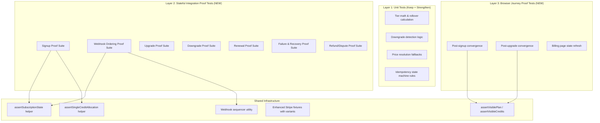
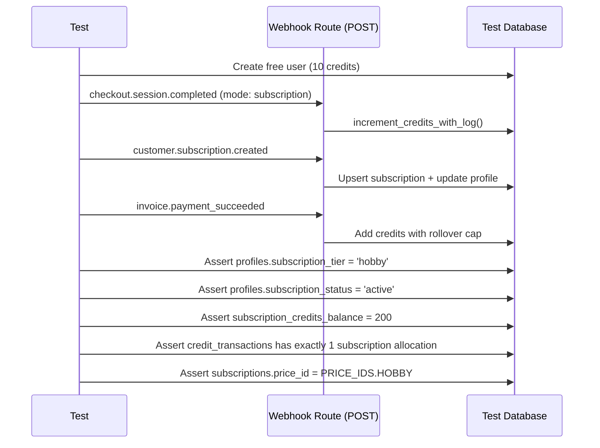
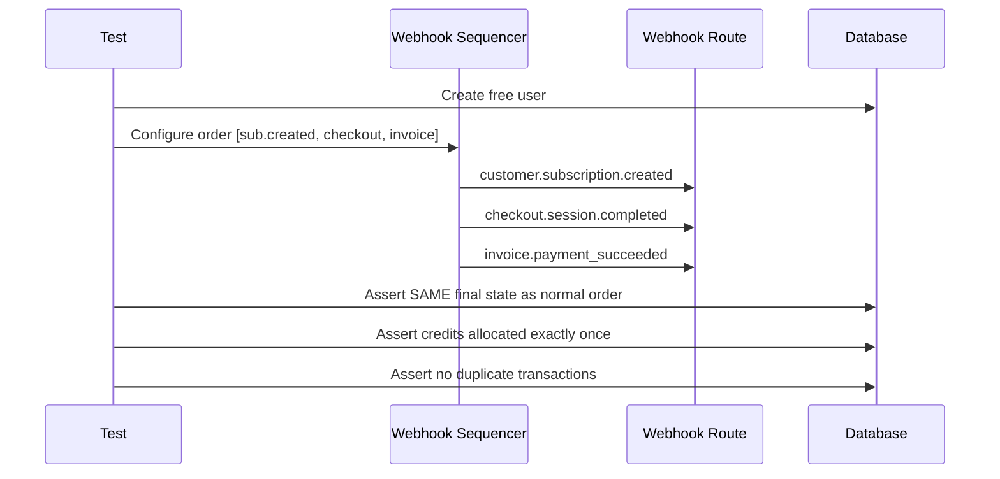

# Subscription System Test Overhaul PRD

**Complexity:** 8 → HIGH mode
**Status:** Draft
**Created:** 2026-03-09
**Insights:** `docs/plans/subscription-system-test-overhaul.md`
**System Doc:** `docs/technical/systems/subscription-system.md`

---

## 1. Context

**Problem:** Current subscription tests prove handlers return `200` and mocked helpers are called, but do not prove that real user journeys end with correct persisted state. This allows bugs where signup stays at 10 credits, upgrades leave stale tiers, or webhook races skip credit allocation.

**Files Analyzed:**

- `tests/unit/api/stripe-webhooks.unit.spec.ts` — 50+ tests, all mock DB writes
- `tests/unit/api/stripe-webhooks-idempotency.unit.spec.ts` — 14 tests, accepts `processing` duplicates as success
- `tests/integration/billing-system.integration.spec.ts` — 18 tests, asserts `200`/`received: true`
- `tests/integration/billing-workflow.api.spec.ts` — runs in mocked test-mode
- `tests/e2e/billing.e2e.spec.ts` — mocks checkout, focuses on UI interaction
- `tests/helpers/credit-assertions.ts` — good helpers exist but underused
- `tests/helpers/stripe-webhook-mocks.ts` — realistic fixtures exist
- `tests/helpers/test-context.ts` — `TestContext` supports user creation with subscription state
- `tests/unit/api/subscription-change-fixes.unit.spec.ts` — 23 tests, logic-only
- `tests/unit/bugfixes/downgrade-flow-bugs.unit.spec.ts` — 5 tests, narrow
- `tests/api/cron-sync.test.ts` — 15 tests, asserts `200`/`syncRunId` not actual DB changes
- `tests/unit/pricing/checkout-regional.unit.spec.ts` — 18 tests, utility-level only

**Current Behavior:**

- Webhook integration tests run in test-mode with mock DB writes
- Idempotency tests accept `processing` state duplicates without proving final state
- No test proves a Free → Paid signup ends with correct tier, status, and credits
- No test proves webhook reordering doesn't break credit allocation
- Browser tests bypass Stripe behavior entirely
- Cron sync tests prove `200` responses, not actual recovery outcomes

## 2. Solution

**Approach:**

- Build a **3-layer proof test architecture**: pure unit tests (keep), stateful integration proof tests (new), browser journey proof tests (new)
- Stateful tests call real webhook route handlers against a test database and assert **final persisted state** across `profiles`, `subscriptions`, and `credit_transactions`
- Webhook ordering tests fire the same events in different orders and assert identical final state
- Browser tests assert what the user actually sees after server state changes
- New shared assertion helpers enforce the invariant checklist per test

**Architecture:**



**Key Decisions:**

- Stateful integration tests use **real route handler calls** (not HTTP) via `POST` import from route files — this avoids needing a running server for the bulk of proof tests
- Use existing `TestContext` + `credit-assertions.ts` helpers, extend them with new assertion functions
- Webhook ordering tests use a **sequencer utility** that fires events in configurable order
- All proof tests follow the naming convention `*-proof.integration.spec.ts`
- Browser proof tests require a running dev server (Playwright)
- Regional pricing checkout integration tested as part of signup proof (not separate suite)

**Data Changes:** None — tests only, no schema or migration changes.

---

## 3. Sequence Flow

### Stateful Signup Proof Test Flow



### Webhook Ordering Proof Test Flow



---

## 4. Execution Phases

### Phase 1: Test Infrastructure — Proof test helpers and fixtures

**Files (5):**

- `tests/helpers/subscription-proof-assertions.ts` — new assertion helpers
- `tests/helpers/webhook-sequencer.ts` — new ordering utility
- `tests/helpers/stripe-webhook-mocks.ts` — extend with regional + inline price variants
- `tests/helpers/credit-assertions.ts` — extend with `assertSingleCreditAllocation`
- `tests/helpers/index.ts` — re-export new helpers

**Implementation:**

- [ ] Create `assertSubscriptionState(supabase, userId, { tier, status, subscriptionCredits, purchasedCredits, latestPriceId })` — queries `profiles` and `subscriptions`, asserts all fields
- [ ] Create `assertSingleCreditAllocation(supabase, userId, referenceId, expectedAmount)` — queries `credit_transactions`, asserts exactly one transaction with that `ref_id` and `amount`
- [ ] Create `assertNoDuplicateAllocations(supabase, userId)` — queries `credit_transactions` for type=`subscription`, asserts no duplicate `ref_id` entries
- [ ] Create `WebhookSequencer` class that accepts an array of fixture-generating functions and fires them in order against the route handler, returning all responses
- [ ] Add `createInvoicePaymentSucceededForPlan(planKey, options)` variant to `StripeWebhookMockFactory` that uses real price IDs from `PRICE_IDS` constant
- [ ] Add `createCheckoutSessionCompletedForRegionalSubscription(options & { countryCode, discountPercent })` variant
- [ ] Extend `credit-assertions.ts` with `assertSingleCreditAllocation` that checks `credit_transactions` for exactly one subscription-type entry matching a reference
- [ ] Re-export all new helpers from `tests/helpers/index.ts`

**Tests Required:**

| Test File | Test Name | Assertion |
|-----------|-----------|-----------|
| `tests/unit/helpers/subscription-proof-assertions.unit.spec.ts` | `assertSubscriptionState should throw when tier mismatch` | Verify helper throws descriptive error |
| `tests/unit/helpers/subscription-proof-assertions.unit.spec.ts` | `assertSingleCreditAllocation should pass with exactly one matching tx` | Verify helper passes correctly |
| `tests/unit/helpers/webhook-sequencer.unit.spec.ts` | `should fire events in configured order` | Verify sequencer calls handler in order |

**Verification Plan:**

1. **Unit Tests:** `tests/unit/helpers/*.unit.spec.ts` — helpers throw on mismatch, pass on match
2. **Evidence:** `yarn test --run tests/unit/helpers/` passes

---

### Phase 2: Signup Proof Suite — Free → {Hobby, Pro, Business} with end-state assertions

**Files (2):**

- `tests/integration/subscription-signup-proof.integration.spec.ts` — new proof test file
- `tests/helpers/subscription-proof-assertions.ts` — use assertions from Phase 1

**Implementation:**

- [ ] Test `Free → Hobby`: create free user (10 credits), fire `checkout.session.completed` (subscription mode, Hobby price), fire `customer.subscription.created`, fire `invoice.payment_succeeded` → assert `subscription_tier = 'hobby'`, `subscription_status = 'active'`, `subscription_credits_balance = 200`, `subscriptions.price_id = PRICE_IDS.HOBBY`, exactly 1 subscription credit allocation in `credit_transactions`
- [ ] Test `Free → Pro`: same flow with Pro values → assert `subscription_tier = 'pro'`, `subscription_credits_balance = 1000`
- [ ] Test `Free → Business`: same flow with Business values → assert `subscription_tier = 'business'`, `subscription_credits_balance = 5000`
- [ ] Test `Free → Starter`: same flow with Starter values → assert `subscription_tier = 'starter'`, `subscription_credits_balance = 100`
- [ ] Test `Credit Pack Purchase (no subscription)`: create free user, fire checkout.session.completed with `mode: payment` and `credits_amount: 200` → assert `purchased_credits_balance += 200`, `subscription_tier` unchanged, `subscription_status` unchanged
- [ ] Test `Signup does not double-allocate credits`: fire full webhook sequence, assert credit_transactions contains exactly 1 subscription allocation (not 2 or 3 from checkout + invoice)

**Tests Required:**

| Test File | Test Name | Assertion |
|-----------|-----------|-----------|
| `tests/integration/subscription-signup-proof.integration.spec.ts` | `Free → Hobby signup ends with correct tier, status, and credits` | `assertSubscriptionState(userId, { tier: 'hobby', status: 'active', subscriptionCredits: 200 })` |
| same | `Free → Pro signup ends with correct state` | tier=pro, credits=1000 |
| same | `Free → Business signup ends with correct state` | tier=business, credits=5000 |
| same | `Free → Starter signup ends with correct state` | tier=starter, credits=100 |
| same | `Credit pack purchase adds purchased credits only` | purchased=200, tier unchanged |
| same | `Signup webhook sequence allocates credits exactly once` | `assertSingleCreditAllocation` |

**Verification Plan:**

1. **Integration Tests:** Run proof suite, assert all DB state
2. **Evidence:** `yarn test --run tests/integration/subscription-signup-proof` passes
3. **Manual (HIGH):** Inspect test output to verify queries hit real DB state

---

### Phase 3: Webhook Ordering Proof Suite — Race conditions, duplicates, reordering

**Files (2):**

- `tests/integration/webhook-ordering-proof.integration.spec.ts` — new proof test file
- `tests/helpers/webhook-sequencer.ts` — use sequencer from Phase 1

**Implementation:**

- [ ] Test ordering 1: `checkout.session.completed → subscription.created → invoice.payment_succeeded` (normal order) → assert correct final state
- [ ] Test ordering 2: `subscription.created → checkout.session.completed → invoice.payment_succeeded` → assert SAME final state as ordering 1
- [ ] Test ordering 3: `invoice.payment_succeeded → checkout.session.completed → subscription.created` → assert SAME final state
- [ ] Test ordering 4: `subscription.created → invoice.payment_succeeded → checkout.session.completed` → assert SAME final state
- [ ] Test duplicate delivery: fire each event twice in normal order → assert credits allocated exactly once, no duplicate `credit_transactions`
- [ ] Test duplicate while processing: fire `checkout.session.completed` twice concurrently (Promise.all) → assert credits allocated exactly once
- [ ] Test duplicate `invoice.payment_succeeded`: fire twice → assert credits added exactly once, `credit_transactions` has exactly 1 entry for that invoice ref
- [ ] All ordering tests must assert: `subscription_tier` correct, `subscription_status = 'active'`, credits correct, no duplicate allocations, `subscriptions.price_id` correct

**Tests Required:**

| Test File | Test Name | Assertion |
|-----------|-----------|-----------|
| `tests/integration/webhook-ordering-proof.integration.spec.ts` | `Normal order: checkout → sub.created → invoice produces correct state` | Full state assertion |
| same | `Reversed: sub.created → checkout → invoice produces same state` | Same assertion as normal |
| same | `Invoice first: invoice → checkout → sub.created produces same state` | Same assertion |
| same | `Duplicate delivery does not double-allocate credits` | `assertNoDuplicateAllocations` |
| same | `Concurrent duplicate checkout does not double-allocate` | credits allocated once |
| same | `Concurrent duplicate invoice does not double-allocate` | single credit_transaction entry |

**Verification Plan:**

1. **Integration Tests:** All orderings produce identical final state
2. **Evidence:** `yarn test --run tests/integration/webhook-ordering-proof` passes

---

### Phase 4: Upgrade Proof Suite — All upgrade paths with end-state assertions

**Files (2):**

- `tests/integration/subscription-upgrade-proof.integration.spec.ts` — new proof test file
- `tests/helpers/subscription-proof-assertions.ts` — reuse from Phase 1

**Implementation:**

- [ ] Test `Starter → Hobby`: create user with active Starter subscription (100 credits), fire `subscription.updated` with Hobby price → assert `subscription_tier = 'hobby'`, `subscriptions.price_id = PRICE_IDS.HOBBY`, existing credits preserved
- [ ] Test `Starter → Pro`: same pattern → assert `subscription_tier = 'pro'`
- [ ] Test `Starter → Business`: same → assert `subscription_tier = 'business'`
- [ ] Test `Hobby → Pro`: create Hobby user (200 credits) → assert `subscription_tier = 'pro'`
- [ ] Test `Hobby → Business`: same → assert `subscription_tier = 'business'`
- [ ] Test `Pro → Business`: create Pro user (1000 credits) → assert `subscription_tier = 'business'`
- [ ] Test `Upgrade preserves existing credits`: user with 150 credits upgrades Starter → Hobby → credits remain 150, tier changes
- [ ] Test `Upgrade with proration invoice`: fire `invoice.payment_succeeded` with `billing_reason: 'subscription_update'` → assert no duplicate credit allocation (proration invoices should NOT add monthly credits)

**Tests Required:**

| Test File | Test Name | Assertion |
|-----------|-----------|-----------|
| `tests/integration/subscription-upgrade-proof.integration.spec.ts` | `Starter → Hobby updates tier and price correctly` | tier=hobby, priceId correct |
| same | `Hobby → Pro updates tier correctly` | tier=pro |
| same | `Pro → Business updates tier correctly` | tier=business |
| same | `Upgrade preserves existing credit balance` | credits unchanged |
| same | `Proration invoice does not add monthly credits` | no subscription credit_transaction |

**Verification Plan:**

1. **Integration Tests:** All upgrade paths produce correct tier + credits
2. **Evidence:** `yarn test --run tests/integration/subscription-upgrade-proof` passes

---

### Phase 5: Downgrade Proof Suite — Schedule creation, deferred execution

**Files (2):**

- `tests/integration/subscription-downgrade-proof.integration.spec.ts` — new proof test file
- `tests/helpers/subscription-proof-assertions.ts` — reuse

**Implementation:**

- [ ] Test `Business → Pro downgrade is deferred`: fire `subscription.updated` with `cancel_at_period_end: false` + schedule data → assert `subscription_tier` remains `'business'` during current period, scheduled change fields populated in DB
- [ ] Test `Pro → Hobby downgrade is deferred`: same pattern
- [ ] Test `Hobby → Starter downgrade is deferred`: same pattern
- [ ] Test `Scheduled downgrade completes at period end`: fire `subscription_schedule.completed` → assert tier updates to new (lower) tier, no immediate credit clawback
- [ ] Test `Cancel scheduled downgrade`: fire cancel-scheduled API → assert schedule cleared, tier remains current
- [ ] Test `No credit clawback on downgrade`: assert `credit_transactions` has no clawback entry, balance unchanged

**Tests Required:**

| Test File | Test Name | Assertion |
|-----------|-----------|-----------|
| `tests/integration/subscription-downgrade-proof.integration.spec.ts` | `Business → Pro downgrade keeps current tier during period` | tier=business until schedule completes |
| same | `Schedule completion updates tier to lower plan` | tier=pro after schedule event |
| same | `Cancel scheduled downgrade preserves current tier` | schedule cleared, tier=business |
| same | `Downgrade does not clawback credits` | no clawback in credit_transactions |

**Verification Plan:**

1. **Integration Tests:** Downgrade lifecycle assertions
2. **Evidence:** `yarn test --run tests/integration/subscription-downgrade-proof` passes

---

### Phase 6: Renewal Proof Suite — Rollover cap, post-upgrade, post-downgrade renewal

**Files (2):**

- `tests/integration/subscription-renewal-proof.integration.spec.ts` — new proof test file
- `tests/helpers/subscription-proof-assertions.ts` — reuse

**Implementation:**

- [ ] Test `Renewal below rollover cap`: Hobby user with 100 credits, fire `invoice.payment_succeeded` → assert `subscription_credits_balance = 300` (100 + 200)
- [ ] Test `Renewal at rollover cap`: Hobby user with 1200 credits (max), fire renewal → assert `subscription_credits_balance = 1200` (no credits added, already at cap)
- [ ] Test `Renewal just below cap`: Hobby user with 1100 credits, fire renewal → assert `subscription_credits_balance = 1200` (only 100 added to reach cap, not full 200)
- [ ] Test `Business renewal with no rollover`: Business user with 3000 credits, fire renewal → assert `subscription_credits_balance = 5000` (Business has `maxRollover: 0`, meaning use-it-or-lose-it — credits reset to plan allocation)
- [ ] Test `Renewal after upgrade`: user upgraded from Starter to Pro, fire renewal with Pro price → assert Pro credits (1000) added, Pro rollover cap (6000) applied
- [ ] Test `Renewal after downgrade effective`: user downgraded from Pro to Hobby (schedule completed), fire renewal → assert Hobby credits (200) added, Hobby cap (1200) applied
- [ ] Test `Renewal credits allocated exactly once`: fire `invoice.payment_succeeded`, assert `credit_transactions` has exactly 1 `subscription_renewal` entry for that invoice

**Tests Required:**

| Test File | Test Name | Assertion |
|-----------|-----------|-----------|
| `tests/integration/subscription-renewal-proof.integration.spec.ts` | `Renewal below cap adds full plan credits` | 100 + 200 = 300 |
| same | `Renewal at cap adds zero credits` | stays at 1200 |
| same | `Renewal just below cap adds partial credits` | 1100 + 100 = 1200 |
| same | `Business renewal resets credits (no rollover)` | credits = 5000 |
| same | `Post-upgrade renewal uses new plan credits` | 1000 added |
| same | `Post-downgrade renewal uses new plan credits` | 200 added |
| same | `Renewal credits allocated exactly once` | single credit_transaction |

**Verification Plan:**

1. **Integration Tests:** Rollover math verified against all edge cases
2. **Evidence:** `yarn test --run tests/integration/subscription-renewal-proof` passes

---

### Phase 7: Failure & Recovery Proof Suite — Skipped webhooks, crash recovery, cron reprocessing

**Files (2):**

- `tests/integration/webhook-recovery-proof.integration.spec.ts` — new proof test file
- `tests/helpers/subscription-proof-assertions.ts` — reuse

**Implementation:**

- [ ] Test `Checkout webhook skipped, subscription webhook recovers`: skip `checkout.session.completed`, fire only `subscription.created` + `invoice.payment_succeeded` → assert tier and credits correct (subscription.created should handle user lookup by customer_id)
- [ ] Test `Invoice webhook skipped, checkout + subscription recover`: skip `invoice.payment_succeeded`, fire `checkout.session.completed` + `subscription.created` → assert tier correct (credits may come from checkout)
- [ ] Test `Event stuck in processing state`: insert a `webhook_events` row with `status: 'processing'` for >5 minutes, fire recovery cron → assert event re-processed or marked unrecoverable
- [ ] Test `Recovery cron reprocesses failed events safely`: insert `webhook_events` row with `status: 'failed'`, `recoverable: true`, `retry_count: 0`, simulate cron → assert event retried and state corrected
- [ ] Test `Recovery cron respects max retries`: insert event with `retry_count: 3` → assert marked unrecoverable, not retried
- [ ] Test `No permanent "active plan, free credits" state`: create user, fire only `subscription.created` (no checkout, no invoice) → run recovery or manual check → assert user either gets credits or has a clear failed state (not stuck with active tier + 10 credits)

**Tests Required:**

| Test File | Test Name | Assertion |
|-----------|-----------|-----------|
| `tests/integration/webhook-recovery-proof.integration.spec.ts` | `Missing checkout webhook: subscription + invoice recover state` | tier + credits correct |
| same | `Missing invoice webhook: checkout + subscription establish tier` | tier correct |
| same | `Stuck processing event gets recovered by cron` | event no longer processing |
| same | `Failed event retried by recovery cron` | state corrected |
| same | `Max retries respected` | marked unrecoverable |
| same | `No "active plan, free credits" permanent state` | credits > 10 or clear failure |

**Verification Plan:**

1. **Integration Tests:** Recovery scenarios produce correct final state
2. **Evidence:** `yarn test --run tests/integration/webhook-recovery-proof` passes

---

### Phase 8: Refund/Dispute/Cancellation Proof Suite

**Files (2):**

- `tests/integration/subscription-lifecycle-proof.integration.spec.ts` — new proof test file
- `tests/helpers/subscription-proof-assertions.ts` — reuse

**Implementation:**

- [ ] Test `Subscription cancellation sets correct state`: create active user, fire `subscription.deleted` → assert `subscription_status = 'canceled'`, `subscription_tier = null`, credits preserved
- [ ] Test `Charge dispute created flags account`: create active user, fire `charge.dispute.created` → assert account flagged, dispute event logged, credits clawed back
- [ ] Test `Dispute won restores account`: fire `charge.dispute.closed` with status `won` → assert account unflagged, credits restored (if applicable)
- [ ] Test `Dispute lost maintains clawback`: fire `charge.dispute.closed` with status `lost` → assert credits remain clawed back
- [ ] Test `Refund creates clawback transaction`: fire `charge.refunded` → assert `credit_transactions` has clawback entry with correct amount and pool
- [ ] Test `Invoice payment failed sets past_due`: fire `invoice.payment_failed` → assert `subscription_status = 'past_due'`
- [ ] Test `Purchased credits remain distinct from subscription credits on cancellation`: user has 200 sub credits + 50 purchased, cancel → assert purchased credits intact

**Tests Required:**

| Test File | Test Name | Assertion |
|-----------|-----------|-----------|
| `tests/integration/subscription-lifecycle-proof.integration.spec.ts` | `Cancellation resets tier and status` | tier=null, status=canceled |
| same | `Dispute created flags account and claws back credits` | account flagged |
| same | `Dispute won restores account` | account unflagged |
| same | `Refund creates clawback transaction` | clawback in credit_transactions |
| same | `Payment failure sets past_due` | status=past_due |
| same | `Purchased credits survive cancellation` | purchased_credits unchanged |

**Verification Plan:**

1. **Integration Tests:** Lifecycle state transitions verified
2. **Evidence:** `yarn test --run tests/integration/subscription-lifecycle-proof` passes

---

### Phase 9: Browser Journey Proof Suite — E2E convergence tests

**Files (3):**

- `tests/e2e/subscription-signup-proof.e2e.spec.ts` — new
- `tests/e2e/subscription-upgrade-proof.e2e.spec.ts` — new
- `tests/pages/BillingPage.ts` — extend with proof assertion methods (if needed)

**Implementation:**

- [ ] Test `Post-signup success page shows correct plan`: complete signup flow, land on success page → assert `assertVisiblePlan(page, 'Hobby')` and `assertVisibleCredits(page, 200)`
- [ ] Test `Post-signup billing page shows active subscription`: navigate to billing page → assert plan name, credits, status visible and correct
- [ ] Test `Post-upgrade billing page reflects new tier`: upgrade Hobby → Pro, navigate to billing → assert `assertVisiblePlan(page, 'Professional')` and credits updated
- [ ] Test `Dashboard does not show stale cached tier after upgrade`: after upgrade, reload dashboard → assert sidebar/header shows new tier immediately
- [ ] Test `Post-cancellation billing page shows canceled state`: cancel subscription, navigate to billing → assert canceled state visible, upgrade options shown

**Tests Required:**

| Test File | Test Name | Assertion |
|-----------|-----------|-----------|
| `tests/e2e/subscription-signup-proof.e2e.spec.ts` | `Success page shows correct plan after signup` | visible plan name + credits |
| same | `Billing page shows active subscription after signup` | plan, credits, status visible |
| `tests/e2e/subscription-upgrade-proof.e2e.spec.ts` | `Billing page reflects new tier after upgrade` | new plan visible |
| same | `Dashboard shows updated tier without stale cache` | sidebar/header updated |

**Verification Plan:**

1. **E2E Tests:** Playwright tests with visual assertions
2. **Evidence:** `yarn test:e2e --grep "proof"` passes
3. **Manual (HIGH):** Visual review of page state after operations

---

### Phase 10: Unit Test Strengthening — Idempotency state machine, price resolution

**Files (2):**

- `tests/unit/api/webhook-idempotency-state-machine.unit.spec.ts` — new
- `tests/unit/api/subscription-price-resolution-fallbacks.unit.spec.ts` — new

**Implementation:**

- [ ] Idempotency state machine tests:
  - [ ] `new event → claimed → processing → completed` happy path
  - [ ] `duplicate while completed → skip` (no side effects)
  - [ ] `duplicate while processing → safe skip` (must not leave user stuck)
  - [ ] `processing for >5 min → stale, eligible for recovery`
  - [ ] `failed event → retry_count incremented → retried → completed`
  - [ ] `failed event at max retries → marked unrecoverable`
  - [ ] State transitions are atomic (constraint violation = skip, not error)
- [ ] Price resolution fallback tests:
  - [ ] Known price ID resolves to correct plan
  - [ ] `price_inline_temp_*` ID triggers Stripe API lookup
  - [ ] Unknown price ID falls back to Stripe subscription retrieval
  - [ ] Regional `price_data` generated ID resolves via subscription lookup
  - [ ] Complete resolution failure returns clear error, does not silently default

**Tests Required:**

| Test File | Test Name | Assertion |
|-----------|-----------|-----------|
| `tests/unit/api/webhook-idempotency-state-machine.unit.spec.ts` | `new → claimed → completed is valid transition` | state=completed |
| same | `duplicate while completed skips without side effects` | no DB writes |
| same | `duplicate while processing is safe skip` | no double-allocation |
| same | `stale processing event eligible for recovery` | recovery detects it |
| same | `max retries marks unrecoverable` | recoverable=false |
| `tests/unit/api/subscription-price-resolution-fallbacks.unit.spec.ts` | `known price ID resolves to plan` | correct plan returned |
| same | `inline temp price triggers Stripe lookup` | API called |
| same | `unknown price falls back to subscription retrieval` | correct plan via fallback |
| same | `complete failure returns clear error` | descriptive error thrown |

**Verification Plan:**

1. **Unit Tests:** Pure logic, fast, deterministic
2. **Evidence:** `yarn test --run tests/unit/api/webhook-idempotency-state-machine tests/unit/api/subscription-price-resolution-fallbacks` passes

---

## 5. CI Integration

### Recommended Test Tiers

| Tier | When | What | Time Budget |
|------|------|------|-------------|
| **Fast CI** (every push) | `yarn test` | Unit tests + selected integration smoke | < 2 min |
| **Full Billing CI** (PR merge) | `yarn test:billing` | All proof integration tests + webhook ordering | < 5 min |
| **Pre-Release Gate** | manual/tag | Full proof suite + browser proofs + cron recovery | < 10 min |

### New Test Script

Add to `package.json`:

```json
{
  "scripts": {
    "test:billing": "vitest run tests/integration/*-proof.integration.spec.ts",
    "test:billing:e2e": "playwright test tests/e2e/*-proof.e2e.spec.ts"
  }
}
```

---

## 6. New File Index

| File | Type | Phase |
|------|------|-------|
| `tests/helpers/subscription-proof-assertions.ts` | Helper | 1 |
| `tests/helpers/webhook-sequencer.ts` | Helper | 1 |
| `tests/unit/helpers/subscription-proof-assertions.unit.spec.ts` | Unit Test | 1 |
| `tests/unit/helpers/webhook-sequencer.unit.spec.ts` | Unit Test | 1 |
| `tests/integration/subscription-signup-proof.integration.spec.ts` | Integration | 2 |
| `tests/integration/webhook-ordering-proof.integration.spec.ts` | Integration | 3 |
| `tests/integration/subscription-upgrade-proof.integration.spec.ts` | Integration | 4 |
| `tests/integration/subscription-downgrade-proof.integration.spec.ts` | Integration | 5 |
| `tests/integration/subscription-renewal-proof.integration.spec.ts` | Integration | 6 |
| `tests/integration/webhook-recovery-proof.integration.spec.ts` | Integration | 7 |
| `tests/integration/subscription-lifecycle-proof.integration.spec.ts` | Integration | 8 |
| `tests/e2e/subscription-signup-proof.e2e.spec.ts` | E2E | 9 |
| `tests/e2e/subscription-upgrade-proof.e2e.spec.ts` | E2E | 9 |
| `tests/unit/api/webhook-idempotency-state-machine.unit.spec.ts` | Unit Test | 10 |
| `tests/unit/api/subscription-price-resolution-fallbacks.unit.spec.ts` | Unit Test | 10 |

**Total new files: 15** (2 helpers, 7 integration proof tests, 2 E2E proof tests, 4 unit tests)

---

## 7. Acceptance Criteria

- [ ] All 10 phases complete
- [ ] All proof tests assert final DB state, not just HTTP 200
- [ ] Webhook ordering tests prove identical final state under 4+ orderings
- [ ] Duplicate delivery tests prove credits allocated exactly once
- [ ] No subscription proof test passes based only on HTTP response code
- [ ] Browser tests prove user sees correct tier and credits post-signup/upgrade
- [ ] `yarn verify` passes
- [ ] All automated checkpoint reviews passed
- [ ] Test scripts (`test:billing`, `test:billing:e2e`) added to `package.json`

---

## 8. Execution Priority

Based on the overhaul plan's "First Implementation Slice" — build these first as they would have caught recent bugs:

1. **Phase 1** (infrastructure) — required by all others
2. **Phase 2** (signup proof) — `Free → Hobby` signup proof
3. **Phase 3** (webhook ordering) — duplicate/reordered initial webhook proof
4. **Phase 4** (upgrade proof) — `Pro → Business` upgrade proof
5. **Phase 9** (browser journey) — client store refresh proof

Phases 5-8 and 10 can follow in any order after the first slice is stable.
