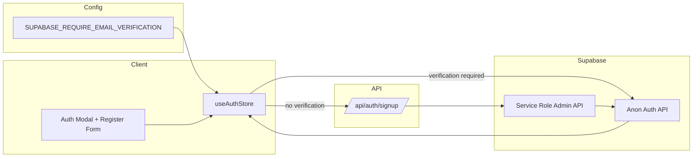
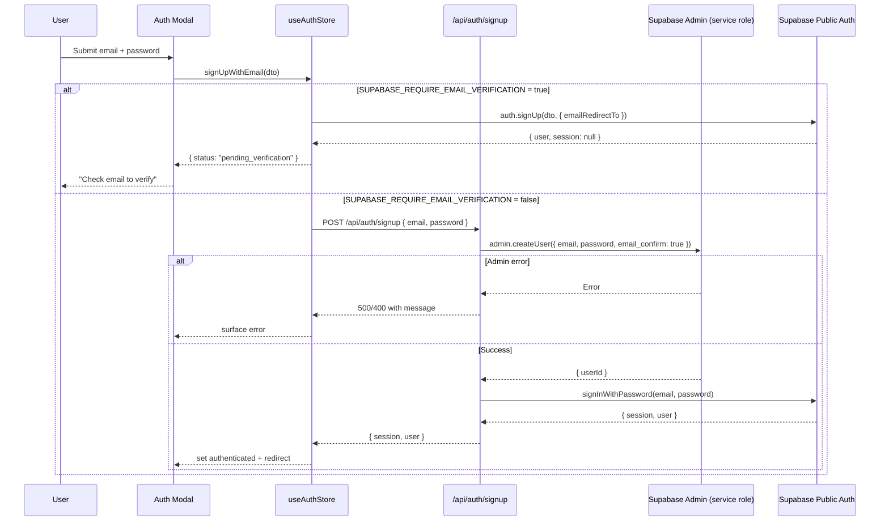

# Supabase Email Verification Toggle PRD

🧠 **Principal Architect Mode: Engaged. Analyzing codebase constraints...**

## 1. Context Analysis

### 1.1 Files Analyzed

- `/home/joao/projects/pixelperfect/shared/config/env.ts` - Centralized env schema and loaders (client + server)
- `/home/joao/projects/pixelperfect/.env.example` - Documented env surface; no verification toggle today
- `/home/joao/projects/pixelperfect/client/store/authStore.ts` - Sign-up/sign-in flows; signUp currently logs users in immediately
- `/home/joao/projects/pixelperfect/client/components/modal/auth/AuthenticationModal.tsx` - Auth modal UX + toasts for sign-up/sign-in
- `/home/joao/projects/pixelperfect/client/components/modal/auth/RegisterForm.tsx` - Registration UI inputs
- `/home/joao/projects/pixelperfect/server/supabase/supabaseClient.ts` - Browser-facing Supabase client initialization
- `/home/joao/projects/pixelperfect/shared/utils/supabase/server.ts` - Server-side Supabase client (cookie-aware)
- `/home/joao/projects/pixelperfect/tests/helpers/auth.ts` - Test helper auto-confirms users via admin API
- `/home/joao/projects/pixelperfect/docs/technical/systems/authentication.md` - Current auth architecture & flows
- `/home/joao/projects/pixelperfect/docs/guides/supabase-setup.md` - Operational guidance mentioning Supabase auth configuration

### 1.2 Component & Dependency Overview

```mermaid
graph TD
    Env[shared/config/env.ts<br/>.env.example] --> AuthStore[useAuthStore]
    AuthStore --> SupabaseClient[server/supabase/supabaseClient.ts<br/>@supabase/ssr]
    AuthStore --> UI[AuthenticationModal + RegisterForm]
    UI --> Users
    AuthStore --> Toasts[Toast Store]
    SupabaseClient --> SupabaseAuth[Supabase Auth Service]
    SupabaseAuth --> Profiles[DB Triggers/Profiles Table]
    Tests[tests/helpers/auth.ts] --> SupabaseAdmin[Service Role API]
```

### 1.3 Current Behavior Summary

- `signUpWithEmail` calls `supabase.auth.signUp` with a redirect URL, then immediately sets `isAuthenticated=true` and stores the user, regardless of whether Supabase requires email verification or returns a session.
- There is **no environment flag** to express whether email verification is required; flows assume immediate access post sign-up.
- Test helpers bypass verification using the admin API (`email_confirm: true`), masking gaps between prod vs. dev behavior.
- Auth UI surfaces a generic "Account created successfully" toast and closes the modal; it does not inform users to check email or handle a "pending verification" state.
- Supabase config (dashboard) controls actual verification requirements, but the app has no configuration or UX alignment with that setting.

### 1.4 Problem Statement

We need an explicit, environment-controlled switch to require or bypass Supabase email verification so sign-up, UX, and automated tests align with the underlying Supabase auth configuration without manual per-environment tweaks.

---

## 2. Proposed Solution

### 2.1 Architecture Summary

- Introduce a typed `SUPABASE_REQUIRE_EMAIL_VERIFICATION` flag (client + server) that defaults to `true` and drives both UX and backend behavior.
- Split sign-up handling: verification-required mode keeps sign-ups pending until confirmation; verification-optional mode uses a service-role pathway to auto-confirm users and issue a session without email loops (dev/test/staging).
- Add a server-side sign-up endpoint that centralizes the toggle, safely uses the service role for auto-confirm, and returns a session + user payload to the browser client.
- Update auth store and modal UX to respect the flag: show "check your email" state when verification is required; automatically sign in and redirect only when sessions are available.
- Align documentation/examples so operators set the Supabase dashboard email confirmation setting to match the flag, preventing drift.

**Alternatives considered (rejected):**

- **Dashboard-only toggle with no app changes:** UX would remain misleading; tests would still auto-confirm, hiding prod issues.
- **Client-only flag with no server involvement:** Cannot auto-confirm safely; still risks mismatch with Supabase config.
- **Always auto-confirm via service role:** Violates production security/compliance requirements.

### 2.2 Architecture Diagram



### 2.3 Key Technical Decisions

| Decision                                                                                                                             | Rationale                                                                                     |
| ------------------------------------------------------------------------------------------------------------------------------------ | --------------------------------------------------------------------------------------------- |
| **Env flag name/scope:** `SUPABASE_REQUIRE_EMAIL_VERIFICATION` (server) + `NEXT_PUBLIC_SUPABASE_REQUIRE_EMAIL_VERIFICATION` (client) | Server flag governs security-sensitive paths; client flag drives UX without exposing secrets. |
| **Service-role auto-confirm only when allowed:** use admin API to set `email_confirm=true`                                           | Prevents bypass in production; still enables fast local/dev flows.                            |
| **Centralized signup API route:** `/api/auth/signup` mediates the toggle                                                             | Keeps passwords off the client when auto-confirming; single place to enforce the flag.        |
| **Auth state handling:** never mark users authenticated without a session                                                            | Avoids false-positive auth states when Supabase withholds sessions until verification.        |
| **Telemetry/logging:** log verification mode per request                                                                             | Helps diagnose misconfigurations between flag and Supabase dashboard setting.                 |

### 2.4 Data Model Changes

**No Data Changes.** All changes are config + auth flow logic.

### 2.5 Runtime Execution Flow



---

## 3. Detailed Implementation Spec

### A. `shared/config/env.ts`

- **Changes Needed:** Add `SUPABASE_REQUIRE_EMAIL_VERIFICATION` to both client and server schemas using boolean coercion with sane defaults (`true`), plus helper `isEmailVerificationRequired()` for reuse.
- **Pseudo-code:**

```typescript
const clientEnvSchema = z.object({
  // ...
  SUPABASE_REQUIRE_EMAIL_VERIFICATION: z.coerce.boolean().default(true),
});

const serverEnvSchema = z.object({
  // ...
  SUPABASE_REQUIRE_EMAIL_VERIFICATION: z.coerce.boolean().default(true),
});

export function isEmailVerificationRequired() {
  return serverEnv.SUPABASE_REQUIRE_EMAIL_VERIFICATION;
}
```

- **Justification:** Typed, centralized flag prevents stringly-typed checks and keeps client/server values aligned.

### B. `.env.example`

- **Changes Needed:** Document `NEXT_PUBLIC_SUPABASE_REQUIRE_EMAIL_VERIFICATION=true` and `SUPABASE_REQUIRE_EMAIL_VERIFICATION=true` with guidance to match Supabase dashboard Auth settings per environment.
- **Justification:** Prevents hidden defaults and clarifies how to toggle behavior for dev/test vs. prod.

### C. `client/store/authStore.ts`

- **Changes Needed:** Inject the client flag; branch sign-up behavior. When verification is required, do **not** set authenticated or user session—store a transient "pending verification" state and let UI message reflect that. When not required, call the new API route and set session/user from its response. Add defensive handling to avoid treating `signUp` responses without sessions as authenticated.
- **Pseudo-code:**

```typescript
const requireVerification = clientEnv.SUPABASE_REQUIRE_EMAIL_VERIFICATION;

signUpWithEmail: async (email, password) => {
  loadingStore.getState().setLoading(true);
  if (requireVerification) {
    const { data, error } = await supabase.auth.signUp({
      email,
      password,
      options: { emailRedirectTo: clientEnv.BASE_URL },
    });
    if (error) throw error;
    set({ user: null, isAuthenticated: false, isLoading: false });
    return { status: 'pending_verification', email: data.user?.email };
  }

  const res = await fetch('/api/auth/signup', {
    method: 'POST',
    body: JSON.stringify({ email, password }),
  });
  if (!res.ok) throw await res.json();
  const { user, session } = await res.json();
  supabase.auth.setSession(session); // ensure cookies sync
  set({ user: mapUser(user), isAuthenticated: true, isLoading: false });
};
```

- **Justification:** Removes false-positive auth states and routes privileged flows through the server when bypassing verification.

### D. `client/components/modal/auth/AuthenticationModal.tsx` & `RegisterForm.tsx`

- **Changes Needed:** Show conditional success messaging: "Check your email to verify" when pending; keep the modal open long enough to show guidance. Optionally show a lightweight info box under the register form when verification is required. For auto-confirm mode, retain existing success/redirect behavior.
- **Justification:** Aligns UX with actual Supabase behavior; reduces user confusion.

### E. `app/api/auth/signup/route.ts` (NEW)

- **Purpose:** Secure sign-up endpoint used only when verification is not required.
- **Behavior:** Validate payload with Zod; short-circuit with 403 if `SUPABASE_REQUIRE_EMAIL_VERIFICATION` is true (defense in depth). Use `supabaseAdmin.auth.admin.createUser({ email, password, email_confirm: true })`; on success, sign the user in via a server-side public client (`createServerClient`) to obtain a session and set cookies in the response. Return `{ user, session }` JSON.
- **Error Handling:** Map admin errors to 400/409 (e.g., email exists), fall back to 500 with request ID logging.
- **Justification:** Keeps service role usage server-only, ensures cookies are set consistently with SSR auth strategy, and allows seamless login when verification is disabled.

### F. Tests (`tests/integration/auth-flow.integration.spec.ts` or new focused spec)

- **Changes Needed:** Add coverage for both modes by toggling the flag via env or dynamic config: (1) verification-required -> expect pending state and no session; (2) verification-disabled -> expect session + dashboard redirect. Update `tests/helpers/auth.ts` to optionally respect the flag and avoid auto-confirm in verification-required runs unless explicitly requested.
- **Justification:** Prevent regressions where UI or server paths drift from the configured verification mode.

### G. Docs (`docs/guides/supabase-setup.md`, `docs/technical/systems/authentication.md`)

- **Changes Needed:** Document the new flag, how it must mirror the Supabase dashboard email confirmation setting, and the security caveat that auto-confirm should not be enabled in production.
- **Justification:** Operator clarity; reduces misconfiguration risk.

---

## 4. Step-by-Step Execution Plan

### Phase 1: Configuration & Plumbing

- [ ] Add env schema entries + helpers in `shared/config/env.ts`.
- [ ] Update `.env.example` (and `.env.prod.example` if present) with the new variables and guidance.
- [ ] Wire the flag into client-side config imports.

### Phase 2: Auth Flow Updates

- [ ] Refactor `signUpWithEmail` to branch on the flag and remove auto-auth on pending verification.
- [ ] Implement `/api/auth/signup` with service-role auto-confirm, cookie/session handling, and validation.
- [ ] Update auth modal/register UX to display mode-specific messaging.

### Phase 3: Quality & Documentation

- [ ] Add tests covering both verification modes (unit + integration).
- [ ] Update Supabase setup/auth docs with configuration instructions and risks.
- [ ] Run lint/tests; verify SSR cookies are set in auto-confirm mode.

---

## 5. Testing Strategy

### Unit Tests

- Env parser: boolean coercion for `SUPABASE_REQUIRE_EMAIL_VERIFICATION` (client + server).
- Auth store: `signUpWithEmail` returns pending state and does not set auth when verification required; sets auth when API returns session.
- API route: rejects when flag is true; maps Supabase admin errors (email exists) to 409/400.

### Integration Tests

- Sign-up flow (verification required): submit registration, expect pending message, no session cookie, cannot access `/dashboard`.
- Sign-up flow (verification disabled): submit registration, expect session cookie set and redirect to dashboard/home.
- Regression for existing sign-in: unaffected by flag toggling.

### Edge Cases

| Scenario                                                | Expected Behavior                                                                            |
| ------------------------------------------------------- | -------------------------------------------------------------------------------------------- |
| Flag true but Supabase dashboard disables verification  | App still treats sign-up as pending; user can sign in manually; log config mismatch warning. |
| Flag false but Supabase dashboard enforces verification | API returns 500/409 with actionable message; operator alerted via logs.                      |
| Duplicate email on auto-confirm path                    | Return 409 with friendly error; no session set.                                              |
| Network failure during admin create                     | Roll back response, return 503/500; do not set cookies.                                      |

---

## 6. Acceptance Criteria

- [ ] `SUPABASE_REQUIRE_EMAIL_VERIFICATION` is defined, parsed, and available on both client and server with default `true`.
- [ ] Sign-up flow never marks users authenticated without a session; verification-required mode surfaces a clear "verify your email" message.
- [ ] Auto-confirm mode uses a server-only pathway (service role) and issues a valid Supabase session cookie when the flag is false.
- [ ] Tests cover both verification-required and auto-confirm modes.
- [ ] Documentation instructs operators how to align the flag with Supabase dashboard email confirmation settings and warns against enabling auto-confirm in production.
