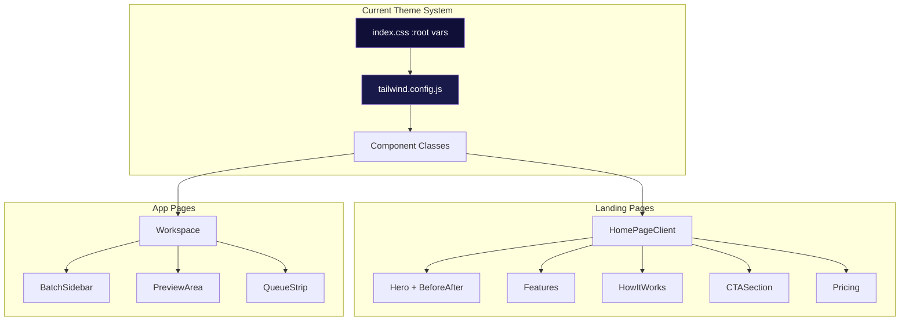
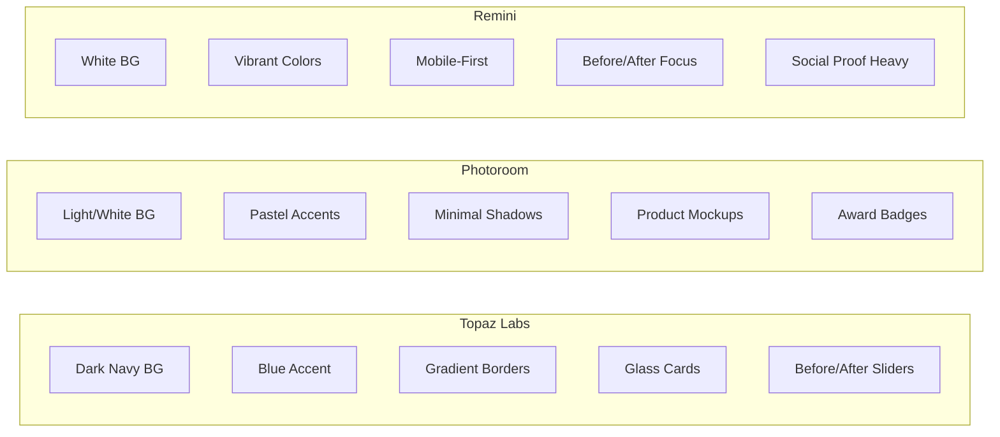
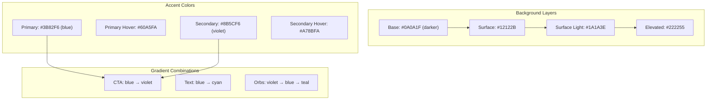
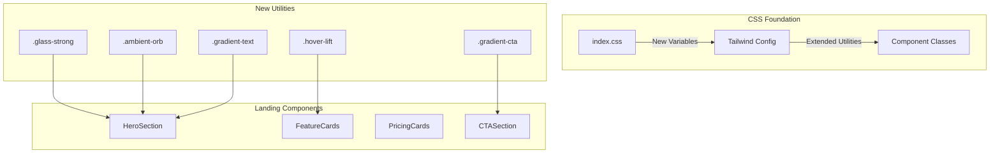
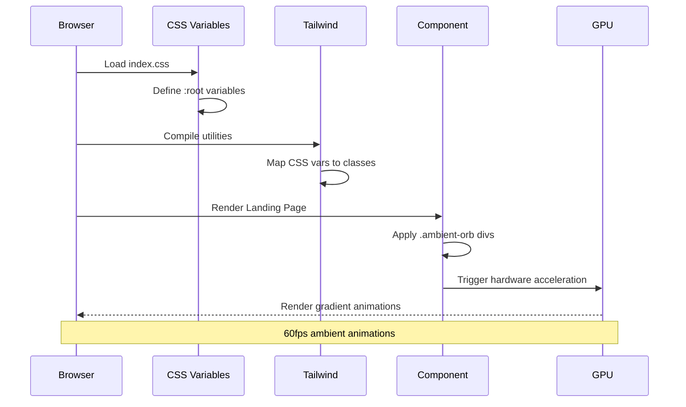

# PRD: Theme Restyling 2025 - Modern Visual Identity

**Status**: Draft
**Priority**: High
**Author**: Principal Architect
**Date**: December 25, 2025

---

## 1. Context Analysis

### 1.1 Files Analyzed

```
/home/joao/projects/pixelperfect/tailwind.config.js
/home/joao/projects/pixelperfect/client/styles/index.css
/home/joao/projects/pixelperfect/client/components/pages/HomePageClient.tsx
/home/joao/projects/pixelperfect/client/components/features/landing/Features.tsx
/home/joao/projects/pixelperfect/client/components/features/landing/CTASection.tsx
/home/joao/projects/pixelperfect/client/components/features/landing/Pricing.tsx
/home/joao/projects/pixelperfect/client/components/features/landing/HowItWorks.tsx
/home/joao/projects/pixelperfect/client/components/features/workspace/Workspace.tsx
/home/joao/projects/pixelperfect/client/components/landing/HeroBeforeAfter.tsx
/home/joao/projects/pixelperfect/client/components/ui/BeforeAfterSlider.tsx
/home/joao/projects/pixelperfect/docs/PRDs/done/dark-theme-system.md
```

### 1.2 Component & Dependency Overview



### 1.3 Current Behavior Summary

**Current Theme (Implemented Dec 2025):**

- Dark navy backgrounds (`#0F0F38`, `#1A1A4A`, `#252560`)
- Single blue accent color (`#2D81FF`)
- Basic glass morphism (5% white bg, blur)
- Simple glow effects on CTAs
- Inter + DM Sans typography
- Animated borders on hover
- Simple radial gradient backgrounds

**Problems Identified:**

- Feels generic - similar to many 2024 dark themes
- Single accent color lacks visual hierarchy depth
- Glass morphism is subtle to the point of being invisible
- Missing vibrant gradient orbs (2025 trend)
- No secondary accent color for visual interest
- CTA buttons blend too much with overall theme
- Landing page lacks "wow factor" compared to competitors

### 1.4 Problem Statement

The current dark theme implementation lacks the visual sophistication and premium feel of competitors like Topaz Labs and Photoroom. It needs a 2025-forward refresh with richer gradients, more prominent glassmorphism, and a dual-accent color system to create visual hierarchy and excitement.

---

## 2. Research: 2025 Design Trends

### 2.1 Industry Trends Summary

| Trend                      | Description                                                         | Adoption |
| -------------------------- | ------------------------------------------------------------------- | -------- |
| **Dark Glassmorphism**     | Frosted glass on dark backgrounds with vibrant gradient orbs behind | High     |
| **Dual-Accent Colors**     | Primary + secondary accent (e.g., blue + violet, or teal + coral)   | High     |
| **Ambient Gradient Blobs** | Large, floating, animated gradient orbs in background               | High     |
| **Soft Neumorphism**       | Subtle inset/outset shadows on dark backgrounds                     | Medium   |
| **Bold Typography**        | Larger display fonts, heavier weights, gradient text                | High     |
| **Micro-interactions**     | Purposeful hover animations, state transitions                      | High     |
| **One-tap Simplicity**     | Minimal UI, single-action CTAs                                      | High     |

### 2.2 Competitor Analysis



**Key Takeaways:**

- Topaz Labs: Premium dark aesthetic with interactive demos (closest match to our brand)
- Photoroom: Light, accessible, enterprise-friendly
- Remini: Mobile-first, consumer-focused, vibrant

### 2.3 Recommended Direction

Evolve the current Topaz-inspired dark theme with:

1. **Violet/Purple secondary accent** - Creates depth, feels AI/tech-forward
2. **More prominent glassmorphism** - Increase blur, add visible borders
3. **Animated gradient orbs** - Floating blobs behind hero sections
4. **Gradient CTAs** - Blue-to-violet gradients for primary actions
5. **Refined micro-interactions** - Subtle but noticeable hover states

---

## 3. Proposed Solution

### 3.1 Architecture Summary

1. **Dual-Accent Color System**: Add violet (`#8B5CF6`) as secondary accent alongside blue
2. **Enhanced Glassmorphism**: Increase blur to 16px, add subtle gradient borders
3. **Ambient Background System**: Floating gradient orbs with slow animations
4. **Gradient CTA System**: Blue-to-violet gradient buttons with enhanced glow
5. **Typography Refinement**: Larger hero text, gradient headings, better hierarchy
6. **Micro-interaction Polish**: Refined hover states, loading animations

**Alternatives Considered:**

| Alternative         | Why Rejected                            |
| ------------------- | --------------------------------------- |
| Light theme option  | Out of scope - dark is brand identity   |
| Teal/coral accents  | Too playful for professional AI tool    |
| Full neumorphism    | Accessibility concerns, dated by 2025   |
| Minimal flat design | Lacks the premium feel competitors have |

### 3.2 New Color System



### 3.3 Architecture Diagram



### 3.4 Key Technical Decisions

| Decision         | Choice          | Rationale                       |
| ---------------- | --------------- | ------------------------------- |
| Color format     | RGB in CSS vars | Tailwind opacity modifiers      |
| Gradient orbs    | CSS + keyframes | No JS overhead, GPU accelerated |
| Glass blur       | 16-20px         | More visible, still performant  |
| Secondary accent | Violet #8B5CF6  | Complements blue, AI/tech feel  |
| Animation timing | 20-30s loops    | Slow, ambient, not distracting  |

### 3.5 Data Model Changes

**No Data Changes.** This is a frontend styling update only.

---

## 4. Runtime Execution Flow



---

## 5. Detailed Implementation Spec

### A. `client/styles/index.css` - Updated Variables

**Changes Needed:** New color palette, enhanced utilities

```css
@layer base {
  :root {
    /* === UPDATED BACKGROUND COLORS === */
    --color-bg-base: 10 10 31; /* #0A0A1F - darker, richer */
    --color-bg-surface: 18 18 43; /* #12122B */
    --color-bg-surface-light: 26 26 62; /* #1A1A3E */
    --color-bg-elevated: 34 34 85; /* #222255 */

    /* === DUAL ACCENT SYSTEM === */
    /* Primary: Blue */
    --color-accent: 59 130 246; /* #3B82F6 */
    --color-accent-hover: 96 165 250; /* #60A5FA */
    --color-accent-light: 147 197 253; /* #93C5FD */

    /* Secondary: Violet */
    --color-secondary: 139 92 246; /* #8B5CF6 */
    --color-secondary-hover: 167 139 250; /* #A78BFA */
    --color-secondary-light: 196 181 253; /* #C4B5FD */

    /* Tertiary: Teal (for gradients) */
    --color-tertiary: 20 184 166; /* #14B8A6 */

    /* === TEXT COLORS (unchanged) === */
    --color-text-primary: 255 255 255;
    --color-text-secondary: 160 160 192;
    --color-text-muted: 107 107 141;

    /* === SEMANTIC (unchanged) === */
    --color-success: 16 185 129;
    --color-warning: 245 158 11;
    --color-error: 239 68 68;

    /* === LEGACY MAPPINGS === */
    --color-primary: var(--color-accent);
    --color-primary-hover: var(--color-accent-hover);
    --color-foreground: var(--color-text-primary);
    --color-muted-foreground: var(--color-text-secondary);
    --color-background: var(--color-bg-base);
    --color-card: var(--color-bg-surface);
    --color-border: 255 255 255 / 0.08;
  }
}
```

**New Component Classes:**

```css
@layer components {
  /* === ENHANCED GLASS MORPHISM === */
  .glass-strong {
    background: rgba(255, 255, 255, 0.03);
    backdrop-filter: blur(20px);
    -webkit-backdrop-filter: blur(20px);
    border: 1px solid rgba(255, 255, 255, 0.08);
    box-shadow:
      0 4px 30px rgba(0, 0, 0, 0.1),
      inset 0 1px 0 rgba(255, 255, 255, 0.05);
  }

  .glass-card-2025 {
    @apply glass-strong rounded-2xl p-6 transition-all duration-300;
  }

  .glass-card-2025:hover {
    background: rgba(255, 255, 255, 0.05);
    border-color: rgba(139, 92, 246, 0.3);
    transform: translateY(-4px);
    box-shadow:
      0 20px 40px rgba(0, 0, 0, 0.2),
      0 0 40px rgba(139, 92, 246, 0.1);
  }

  /* === GRADIENT CTA BUTTON === */
  .gradient-cta {
    background: linear-gradient(
      135deg,
      rgb(var(--color-accent)) 0%,
      rgb(var(--color-secondary)) 100%
    );
    box-shadow:
      0 4px 20px rgba(59, 130, 246, 0.3),
      0 4px 20px rgba(139, 92, 246, 0.2);
    transition: all 0.3s ease;
  }

  .gradient-cta:hover {
    background: linear-gradient(
      135deg,
      rgb(var(--color-accent-hover)) 0%,
      rgb(var(--color-secondary-hover)) 100%
    );
    box-shadow:
      0 8px 30px rgba(59, 130, 246, 0.4),
      0 8px 30px rgba(139, 92, 246, 0.3);
    transform: translateY(-2px);
  }

  .gradient-cta:active {
    transform: translateY(0);
  }

  /* === GRADIENT TEXT === */
  .gradient-text-primary {
    background: linear-gradient(
      135deg,
      rgb(var(--color-accent-light)) 0%,
      rgb(var(--color-tertiary)) 100%
    );
    -webkit-background-clip: text;
    background-clip: text;
    -webkit-text-fill-color: transparent;
  }

  .gradient-text-secondary {
    background: linear-gradient(
      135deg,
      rgb(var(--color-accent)) 0%,
      rgb(var(--color-secondary)) 100%
    );
    -webkit-background-clip: text;
    background-clip: text;
    -webkit-text-fill-color: transparent;
  }

  /* === AMBIENT ORB (Background Blobs) === */
  .ambient-orb {
    position: absolute;
    border-radius: 50%;
    filter: blur(80px);
    opacity: 0.4;
    pointer-events: none;
    will-change: transform;
  }

  .ambient-orb-violet {
    background: radial-gradient(circle, rgba(139, 92, 246, 0.6) 0%, rgba(139, 92, 246, 0) 70%);
  }

  .ambient-orb-blue {
    background: radial-gradient(circle, rgba(59, 130, 246, 0.5) 0%, rgba(59, 130, 246, 0) 70%);
  }

  .ambient-orb-teal {
    background: radial-gradient(circle, rgba(20, 184, 166, 0.4) 0%, rgba(20, 184, 166, 0) 70%);
  }

  /* === HERO GRADIENT 2025 === */
  .hero-gradient-2025 {
    background: rgb(var(--color-bg-base));
    position: relative;
    overflow: hidden;
  }

  /* === SECTION DIVIDER === */
  .section-glow-top {
    position: relative;
  }

  .section-glow-top::before {
    content: '';
    position: absolute;
    top: 0;
    left: 50%;
    transform: translateX(-50%);
    width: 60%;
    height: 1px;
    background: linear-gradient(
      90deg,
      transparent 0%,
      rgba(139, 92, 246, 0.5) 50%,
      transparent 100%
    );
  }
}
```

**New Utility Animations:**

```css
@layer utilities {
  /* === ORB FLOATING ANIMATIONS === */
  @keyframes float-orb-1 {
    0%,
    100% {
      transform: translate(0, 0) scale(1);
    }
    25% {
      transform: translate(30px, -40px) scale(1.1);
    }
    50% {
      transform: translate(-20px, -80px) scale(0.95);
    }
    75% {
      transform: translate(-40px, -30px) scale(1.05);
    }
  }

  @keyframes float-orb-2 {
    0%,
    100% {
      transform: translate(0, 0) scale(1);
    }
    33% {
      transform: translate(-50px, 30px) scale(1.15);
    }
    66% {
      transform: translate(40px, -50px) scale(0.9);
    }
  }

  @keyframes float-orb-3 {
    0%,
    100% {
      transform: translate(0, 0) scale(1);
    }
    20% {
      transform: translate(60px, 20px) scale(1.05);
    }
    40% {
      transform: translate(30px, -60px) scale(0.95);
    }
    60% {
      transform: translate(-30px, -40px) scale(1.1);
    }
    80% {
      transform: translate(-50px, 10px) scale(1);
    }
  }

  .animate-orb-1 {
    animation: float-orb-1 25s ease-in-out infinite;
  }
  .animate-orb-2 {
    animation: float-orb-2 30s ease-in-out infinite;
  }
  .animate-orb-3 {
    animation: float-orb-3 35s ease-in-out infinite;
  }

  /* === HOVER LIFT === */
  .hover-lift {
    transition:
      transform 0.3s ease,
      box-shadow 0.3s ease;
  }

  .hover-lift:hover {
    transform: translateY(-4px);
  }

  /* === GRADIENT BORDER ANIMATION (Enhanced) === */
  .animated-border-violet::before {
    background: linear-gradient(90deg, #3b82f6, #8b5cf6, #14b8a6, #8b5cf6, #3b82f6);
    background-size: 300% 100%;
  }

  /* === SHINE EFFECT === */
  .shine-effect {
    position: relative;
    overflow: hidden;
  }

  .shine-effect::after {
    content: '';
    position: absolute;
    top: 0;
    left: -100%;
    width: 50%;
    height: 100%;
    background: linear-gradient(90deg, transparent, rgba(255, 255, 255, 0.1), transparent);
    transition: left 0.5s ease;
  }

  .shine-effect:hover::after {
    left: 100%;
  }
}
```

**Justification:** Comprehensive update that:

- Deepens backgrounds for more contrast with glass effects
- Adds violet secondary accent for visual hierarchy
- Creates ambient orbs for modern "floating gradient" look
- Enhances glassmorphism to be more visible
- Adds gradient CTAs that stand out from the dark theme

---

### B. `tailwind.config.js` - Extended Configuration

**Changes Needed:** Add new colors and utilities

```javascript
export default {
  // ... existing content array
  theme: {
    extend: {
      // ... existing screens, fontFamily
      colors: {
        // Updated dark theme colors
        main: 'rgb(var(--color-bg-base) / <alpha-value>)',
        surface: 'rgb(var(--color-bg-surface) / <alpha-value>)',
        'surface-light': 'rgb(var(--color-bg-surface-light) / <alpha-value>)',
        elevated: 'rgb(var(--color-bg-elevated) / <alpha-value>)',

        accent: {
          DEFAULT: 'rgb(var(--color-accent) / <alpha-value>)',
          hover: 'rgb(var(--color-accent-hover) / <alpha-value>)',
          light: 'rgb(var(--color-accent-light) / <alpha-value>)',
        },

        // NEW: Secondary accent
        secondary: {
          DEFAULT: 'rgb(var(--color-secondary) / <alpha-value>)',
          hover: 'rgb(var(--color-secondary-hover) / <alpha-value>)',
          light: 'rgb(var(--color-secondary-light) / <alpha-value>)',
        },

        // NEW: Tertiary for gradients
        tertiary: 'rgb(var(--color-tertiary) / <alpha-value>)',

        // ... keep existing legacy colors
      },

      // NEW: Box shadow extensions
      boxShadow: {
        'glow-blue': '0 0 20px rgba(59, 130, 246, 0.3)',
        'glow-violet': '0 0 20px rgba(139, 92, 246, 0.3)',
        'glow-mixed': '0 0 30px rgba(59, 130, 246, 0.2), 0 0 30px rgba(139, 92, 246, 0.2)',
        'card-hover': '0 20px 40px rgba(0, 0, 0, 0.2), 0 0 40px rgba(139, 92, 246, 0.1)',
      },

      // ... existing keyframes + new
      keyframes: {
        // ... existing
        'gradient-shift': {
          '0%, 100%': { backgroundPosition: '0% 50%' },
          '50%': { backgroundPosition: '100% 50%' },
        },
      },

      animation: {
        // ... existing
        'gradient-shift': 'gradient-shift 8s ease infinite',
      },
    },
  },
};
```

---

### C. New Component: `client/components/landing/AmbientBackground.tsx`

**New File:** Reusable ambient orb background

```tsx
'use client';

import React from 'react';

interface AmbientBackgroundProps {
  variant?: 'hero' | 'section' | 'subtle';
}

export const AmbientBackground: React.FC<AmbientBackgroundProps> = ({ variant = 'hero' }) => {
  if (variant === 'hero') {
    return (
      <div className="absolute inset-0 overflow-hidden pointer-events-none">
        {/* Violet orb - top right */}
        <div
          className="ambient-orb ambient-orb-violet animate-orb-1 w-[500px] h-[500px]"
          style={{ top: '-10%', right: '-5%' }}
        />
        {/* Blue orb - center left */}
        <div
          className="ambient-orb ambient-orb-blue animate-orb-2 w-[600px] h-[600px]"
          style={{ top: '20%', left: '-15%' }}
        />
        {/* Teal orb - bottom */}
        <div
          className="ambient-orb ambient-orb-teal animate-orb-3 w-[400px] h-[400px]"
          style={{ bottom: '-5%', right: '20%' }}
        />
      </div>
    );
  }

  if (variant === 'section') {
    return (
      <div className="absolute inset-0 overflow-hidden pointer-events-none">
        <div
          className="ambient-orb ambient-orb-violet animate-orb-2 w-[300px] h-[300px] opacity-30"
          style={{ top: '10%', right: '10%' }}
        />
      </div>
    );
  }

  return null;
};
```

---

### D. Updated Hero Section Pattern

**Target:** `client/components/pages/HomePageClient.tsx`

```tsx
// Hero section update pattern
<section className="relative pt-20 pb-16 lg:pt-32 lg:pb-24 hero-gradient-2025">
  {/* Ambient background orbs */}
  <AmbientBackground variant="hero" />

  {/* Content with relative z-index */}
  <div className="relative z-10 max-w-7xl mx-auto px-4 sm:px-6 lg:px-8 text-center">
    {/* Badge with glass effect */}
    <div className="inline-flex items-center gap-2 px-4 py-2 rounded-full glass-strong text-xs font-semibold text-accent mb-8 animate-fade-in">
      <Sparkles size={14} />
      <span>AI-Powered Enhancement</span>
    </div>

    {/* Headline with gradient text */}
    <h1 className="text-4xl sm:text-5xl lg:text-7xl font-bold text-white mb-6">
      Transform Your Images with <span className="gradient-text-primary">Professional AI</span>
    </h1>

    {/* CTA with gradient button */}
    <button className="gradient-cta px-8 py-4 text-white font-semibold rounded-xl inline-flex items-center gap-2 shine-effect">
      <Sparkles size={20} />
      Start Enhancing Free
      <ArrowRight size={18} />
    </button>
  </div>
</section>
```

---

### E. Updated Feature Cards Pattern

```tsx
// Feature card update pattern
<div className="glass-card-2025 animated-border-violet h-full">
  <div className="inline-flex items-center justify-center h-12 w-12 rounded-xl mb-6 bg-gradient-to-br from-accent/20 to-secondary/20 text-accent">
    <Icon size={24} />
  </div>

  <h3 className="text-lg font-bold text-white mb-3 group-hover:gradient-text-secondary transition-colors">
    {title}
  </h3>

  <p className="text-muted-foreground text-sm leading-relaxed">{description}</p>
</div>
```

---

### F. Updated Pricing Cards Pattern

```tsx
// Pricing card - recommended tier
<div className="relative glass-card-2025 border-secondary/50 ring-2 ring-secondary/30 scale-105 z-10">
  {/* Glow effect behind card */}
  <div className="absolute inset-0 -z-10 rounded-2xl bg-gradient-to-b from-secondary/10 to-transparent blur-xl" />
  {/* Badge */}
  <div className="absolute top-0 left-1/2 transform -translate-x-1/2 -translate-y-1/2 bg-gradient-to-r from-accent to-secondary text-white px-4 py-1 rounded-full text-sm font-medium">
    Most Popular
  </div>
  {/* Content */}
  ...
  {/* CTA */}
  <button className="w-full gradient-cta py-3 rounded-xl font-semibold text-white shine-effect">
    Get Started
  </button>
</div>
```

---

## 6. Step-by-Step Execution Plan

### Phase 1: CSS Foundation (Parallelizable: Backend team unblocked)

- [ ] Update `client/styles/index.css` with new CSS variables
- [ ] Add new component classes (glass-strong, gradient-cta, ambient-orb)
- [ ] Add new utility animations (orb floats, shine effect)
- [ ] Update `tailwind.config.js` with new colors and shadows
- [ ] Run `yarn verify` to ensure no build errors

### Phase 2: Core Components (Parallelizable with Phase 1)

- [ ] Create `AmbientBackground.tsx` component
- [ ] Update `BeforeAfterSlider.tsx` with new accent colors
- [ ] Update `Button.tsx` to support gradient variant
- [ ] Test components in isolation

### Phase 3: Landing Page (Depends on Phase 1 & 2)

- [ ] Update `HomePageClient.tsx` - hero section with ambient orbs
- [ ] Update `Features.tsx` - glass-card-2025 styling
- [ ] Update `HowItWorks.tsx` - section styling
- [ ] Update `CTASection.tsx` - gradient CTA buttons
- [ ] Update `Pricing.tsx` - enhanced card styling

### Phase 4: App Pages (Parallelizable with Phase 3)

- [ ] Update `Workspace.tsx` - surface colors
- [ ] Update `BatchSidebar.tsx` - elevated background
- [ ] Update modals - glass-strong styling

### Phase 5: Polish & QA

- [ ] Cross-browser testing (Chrome, Firefox, Safari, Edge)
- [ ] Mobile responsive testing
- [ ] Performance audit (no layout shifts, 60fps animations)
- [ ] WCAG contrast verification
- [ ] Visual comparison with mockups

---

## 7. Testing Strategy

### Visual Regression Tests

- Screenshot comparison for hero section
- Screenshot comparison for pricing cards
- Animation performance check

### Accessibility Tests

| Element               | Required Contrast | Actual |
| --------------------- | ----------------- | ------ |
| Body text on base     | 4.5:1             | TBD    |
| Headings on base      | 3:1               | TBD    |
| CTA button text       | 4.5:1             | TBD    |
| Muted text on surface | 4.5:1             | TBD    |

### Edge Cases

| Scenario           | Expected Behavior                               |
| ------------------ | ----------------------------------------------- |
| Safari < 15        | Fallback solid backgrounds (no backdrop-filter) |
| Reduced motion     | Disable orb animations                          |
| High contrast mode | Maintain readable contrast                      |
| Mobile viewport    | Reduce orb count for performance                |

---

## 8. Acceptance Criteria

### Must Have

- [ ] New color palette implemented (deeper base, dual accents)
- [ ] Ambient gradient orbs visible in hero section
- [ ] Gradient CTA buttons on all primary actions
- [ ] Glass-strong effect visible on cards
- [ ] All text passes WCAG AA contrast (4.5:1)
- [ ] `yarn verify` passes
- [ ] No performance regression (LCP < 2.5s)

### Should Have

- [ ] Animated border glow on card hover
- [ ] Shine effect on CTA buttons
- [ ] Smooth orb animations at 60fps
- [ ] Section divider glow lines

### Nice to Have

- [ ] Reduced motion media query support
- [ ] Safari fallback tested
- [ ] Dark mode preference honored (already dark)

---

## 9. Verification & Rollback

### Success Metrics

- Lighthouse Performance: > 90
- Lighthouse Accessibility: > 95
- LCP: < 2.5s
- CLS: < 0.1
- FPS during scroll: 60

### Rollback Plan

1. CSS variables can be reverted to previous values
2. New classes are additive (won't break existing)
3. Git revert if needed - all changes in styling files only

---

## 10. Appendix: Updated Color Reference

| Token                | Current | New     | Usage             |
| -------------------- | ------- | ------- | ----------------- |
| `--color-bg-base`    | #0F0F38 | #0A0A1F | Deeper, richer    |
| `--color-bg-surface` | #1A1A4A | #12122B | Slightly darker   |
| `--color-accent`     | #2D81FF | #3B82F6 | Tailwind blue-500 |
| `--color-secondary`  | N/A     | #8B5CF6 | NEW: Violet       |
| `--color-tertiary`   | N/A     | #14B8A6 | NEW: Teal         |

---

## 11. Appendix: Competitor Reference Screenshots

> Note: Screenshots should be captured for reference during implementation

| Competitor | Key Elements to Reference                         |
| ---------- | ------------------------------------------------- |
| Topaz Labs | Dark nav, gradient borders, before/after sliders  |
| Photoroom  | Clean cards, subtle shadows, product mockups      |
| Remini     | Before/after focus, social proof, vibrant accents |

---

## Sources

### 2025 Design Trends

- [Top 12 SaaS Design Trends 2025](https://www.designstudiouiux.com/blog/top-saas-design-trends/)
- [15 Modern UI Trends SaaS Companies Will Embrace in 2025](https://www.sanjaydey.com/modern-ui-trends-saas-companies-2025/)
- [Dark Mode and Glass Morphism: The Hottest UI Trends in 2025](https://medium.com/@frameboxx81/dark-mode-and-glass-morphism-the-hottest-ui-trends-in-2025-864211446b54)
- [Dark Glassmorphism: The Aesthetic That Will Define UI in 2026](https://medium.com/@developer_89726/dark-glassmorphism-the-aesthetic-that-will-define-ui-in-2026-93aa4153088f)

### Image Upscaling Apps

- [Top 5 AI Image Upscalers 2025 - Photoroom](https://www.photoroom.com/blog/best-ai-image-upscalers)
- [AI Image Editing Trends 2025 - Analytics Insight](https://www.analyticsinsight.net/artificial-intelligence/ai-image-editing-trends-to-watch-in-2025)
- [Topaz Labs Official](https://www.topazlabs.com/)

### UI Design Resources

- [Landingfolio - Landing Page Components](https://www.landingfolio.com/)
- [Neumorphism CSS Generator](https://neumorphism.io/)
