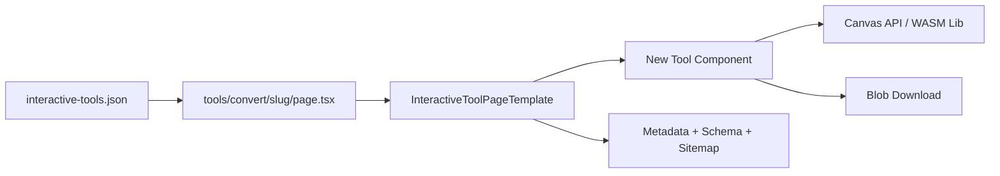
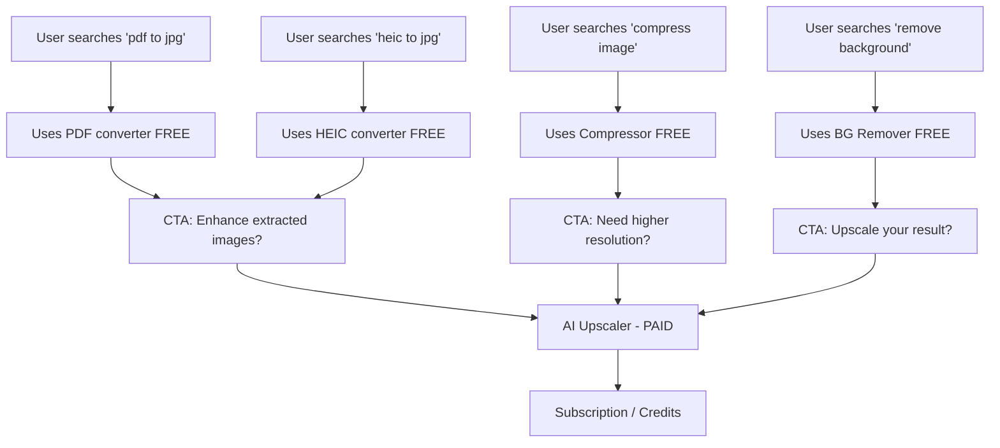

# PRD: Tools & Resources Enhancement — Keyword-Driven Expansion

**Status**: Draft
**Author**: Claude (Principal Architect)
**Date**: March 4, 2026
**Version**: 1.0
**Complexity**: 9 → HIGH mode

---

## 1. Context

### 1.1 Problem Statement

Google Keyword Planner research (12,623 keywords) reveals massive organic traffic opportunities in image tools that we either don't have or underserve. With DR 19 and only 159/1,380 pages indexed (11.5%), we need to prioritize **high-quality interactive tools** over thin content pages. Our pSEO penalty risk is 73/100 (CRITICAL) — real tools with genuine utility are the antidote.

### 1.2 Files Analyzed

```
app/(pseo)/_components/tools/InteractiveTool.tsx
app/(pseo)/_components/tools/ImageCompressor.tsx
app/(pseo)/_components/tools/ImageResizer.tsx
app/(pseo)/_components/tools/FormatConverter.tsx
app/(pseo)/_components/tools/BackgroundRemover.tsx
app/(pseo)/_components/tools/BulkImageResizer.tsx
app/(pseo)/_components/tools/BulkImageCompressor.tsx
app/(pseo)/_components/tools/GuestUpscaler.tsx
app/(pseo)/_components/pseo/templates/InteractiveToolPageTemplate.tsx
app/(pseo)/tools/[slug]/page.tsx
app/(pseo)/tools/convert/[slug]/page.tsx
app/(pseo)/tools/compress/[slug]/page.tsx
app/(pseo)/tools/resize/[slug]/page.tsx
app/seo/data/interactive-tools.json
app/seo/data/tools.json
app/seo/data/free.json
app/seo/data/bulk-tools.json
lib/seo/metadata-factory.ts
lib/seo/sitemap-generator.ts
lib/seo/locale-sitemap-handler.ts
lib/seo/localization-config.ts
middleware.ts
client/utils/image-compression.ts
package.json
```

### 1.3 Current State

- **8 interactive tools**: image-resizer, image-compressor, png-to-jpg, jpg-to-png, webp-to-jpg, webp-to-png, jpg-to-webp, png-to-webp
- **All client-side** via Canvas API (zero server cost for free tools)
- **Background remover** uses `@imgly/background-removal` WASM (15MB lazy-loaded)
- **Modular architecture**: `InteractiveTool` base wrapper + `toolComponent` string mapping + `toolConfig` JSON
- **Template system**: `InteractiveToolPageTemplate` with hero, tool embed, features, FAQ, CTA
- **Cross-sell**: `relatedTools` field → `RelatedPagesSection` + post-processing CTAs
- **Localized**: 10 categories × 7 locales, tools is a LOCALIZED_CATEGORY

### 1.4 Keyword Opportunity Summary

| Opportunity | Monthly Volume | YoY | Status | Action |
|---|---|---|---|---|
| Background Remover | ~15M+ | +23% | Have tool, weak SEO | Enhance + SEO reframe |
| Image Compressor | ~1.5M | +50% | Have basic tool | Major UX upgrade |
| PDF ↔ Image | ~9M+ | +22-49% | Missing entirely | **Build new** |
| HEIC/Format Converters | ~1.2M | +22% | Missing HEIC, BMP, etc. | **Build new** |
| AI Photo Enhancer | ~550K | +22% | Have but poor SEO | SEO reframe |
| Background Changer | ~673K | -18% | Have remover, no changer | **Build new** |
| Image to Text (OCR) | ~368K | -18% | Missing entirely | **Build new** |
| Word to Image | ~450K | Stable | Missing entirely | Defer (low fit) |
| Image Transparency | ~40K | Stable | Have via BG remover | SEO reframe |
| Collage Maker | ~27K | Stable | Missing entirely | Defer (low fit) |

---

## 2. Solution

### 2.1 Strategy: Three Pillars

1. **Enhance existing tools** — Upgrade compressor and background remover UX to be best-in-class; better SEO targeting
2. **Build new browser-based tools** — HEIC converter, PDF tools, OCR, background changer (all client-side, zero server cost)
3. **SEO reframing** — Create new landing pages for existing functionality under high-volume keywords ("photo quality enhancer" → existing AI enhancer)

### 2.2 Architecture

All new tools follow the existing pattern:



**Key Decisions:**

- All new tools are **100% browser-based** (Canvas API, pdf.js, Tesseract.js WASM) — zero server cost
- **No new API routes** needed for free tools (Cloudflare 10ms CPU limit irrelevant for client-side)
- New libraries: `pdf-lib` (PDF creation, ~180KB), `pdfjs-dist` (PDF rendering, ~400KB), `tesseract.js` (OCR, lazy-loaded ~5MB WASM)
- Reuse existing `InteractiveTool` wrapper, `FileUpload`, `InteractiveToolPageTemplate`
- Each tool gets entries in `interactive-tools.json` with proper `toolComponent` + `toolConfig`
- Cross-sell every tool → upscaler (the monetization funnel)

### 2.3 Priority Tiers

**Tier 1 — Quick Wins (Enhance existing, SEO reframe):**
- Image Compressor UX upgrade
- New SEO landing pages for existing tools under high-volume keywords
- HEIC/BMP/GIF/AVIF format converters (extend existing FormatConverter)

**Tier 2 — High-Impact New Tools:**
- PDF to Image converter (pdf-to-jpg, pdf-to-png)
- Image to PDF converter
- Background Changer (extend BackgroundRemover)

**Tier 3 — Medium-Impact New Tools:**
- OCR / Image to Text
- SVG to PNG rasterizer

### 2.4 Data Changes

- **Extend `interactive-tools.json`** with ~15 new tool entries
- **New tool components** in `app/(pseo)/_components/tools/`
- **New route slugs** in `app/(pseo)/tools/convert/[slug]/` (format conversions) and potentially `app/(pseo)/tools/[slug]/` (PDF, OCR, BG changer)
- **Sitemap updates** to include new tool pages
- **Middleware updates** if new path prefixes added

---

## 3. Execution Phases

### Phase 1: Image Compressor UX Upgrade
**Goal**: Make our compressor best-in-class for the +50% YoY "image compressor" keyword (1.5M/mo)

**User-visible outcome**: Compressor shows real-time file size preview, supports target size, batch mode link, and has polished UI matching top competitors.

**Files (max 5):**
- `app/(pseo)/_components/tools/ImageCompressor.tsx` — Enhanced UI with real-time preview, target file size mode, quality presets
- `app/seo/data/interactive-tools.json` — Update compressor entry with richer SEO content, new secondaryKeywords targeting "reduce image size", "photo compressor", "picture compressor", "compress jpeg"
- `client/utils/image-compression.ts` — Add target-size compression mode (binary search to hit target KB)
- `app/(pseo)/_components/tools/shared/CompressionPreview.tsx` — New: real-time before/after size comparison widget
- `tests/unit/seo/tools-compressor.unit.spec.ts` — SEO metadata + keyword tests

**Implementation:**
- [ ] Add quality presets: "Web (80%)", "Email (60%)", "Maximum (40%)" with estimated output size
- [ ] Add "Target file size" mode — user enters desired KB, binary search finds optimal quality
- [ ] Show real-time compression stats: original size, compressed size, reduction %, dimensions
- [ ] Add format selection (JPEG, PNG, WebP) with smart defaults based on input
- [ ] Update SEO data: metaTitle → "Image Compressor - Reduce Image Size Free Online", primaryKeyword → "image compressor", secondaryKeywords to include "reduce image size", "photo compressor", "compress jpeg", "picture compressor"
- [ ] Add cross-sell CTA: "Need higher resolution? Try our AI Upscaler"

**Verification Plan:**
1. Unit tests for target-size compression algorithm
2. SEO metadata test: title ≤70 chars, description ≤160 chars, primaryKeyword present
3. Manual: Upload 5MB JPEG → compress to 200KB target → verify output is ≤200KB

---

### Phase 2: Format Converter Expansion (HEIC, BMP, GIF, AVIF, SVG)
**Goal**: Capture 1.2M+/mo searches for "heic to jpg", "webp to jpg", "bmp to jpg", etc.

**User-visible outcome**: 7 new format conversion tools, all browser-based, each with dedicated SEO-optimized landing page.

**Files (max 5):**
- `app/(pseo)/_components/tools/FormatConverter.tsx` — Extend to support HEIC (via `heic2any`), BMP, GIF, AVIF input; add SVG rasterization via Canvas
- `app/seo/data/interactive-tools.json` — Add 7 new entries: heic-to-jpg, heic-to-png, bmp-to-jpg, bmp-to-png, gif-to-png, avif-to-jpg, svg-to-png
- `app/(pseo)/tools/convert/[slug]/page.tsx` — Verify dynamic routing handles new slugs (should work via generateStaticParams)
- `package.json` — Add `heic2any` dependency (~50KB, browser-based HEIC decoding)
- `tests/unit/seo/tools-format-converters.unit.spec.ts` — SEO tests for all new converter pages

**Implementation:**
- [ ] Install `heic2any` for HEIC → JPEG/PNG conversion in browser
- [ ] Extend FormatConverter to detect HEIC input (`.heic`, `.heif` extensions) and decode via heic2any before Canvas processing
- [ ] Add BMP input support (Canvas natively handles BMP via `new Image()`)
- [ ] Add GIF input support (first frame extraction via Canvas for static conversion)
- [ ] Add AVIF input support (browser-native where supported, with fallback message)
- [ ] Add SVG → PNG rasterization (Canvas `drawImage` on SVG, configurable output dimensions)
- [ ] Create 7 new entries in `interactive-tools.json` with proper SEO data:
  - `heic-to-jpg`: primaryKeyword "heic to jpg" (1.22M/mo)
  - `heic-to-png`: primaryKeyword "heic to png" (201K/mo)
  - `bmp-to-jpg`: primaryKeyword "bmp to jpg"
  - `bmp-to-png`: primaryKeyword "bmp to png"
  - `gif-to-png`: primaryKeyword "gif to png"
  - `avif-to-jpg`: primaryKeyword "avif to jpg"
  - `svg-to-png`: primaryKeyword "svg to png" (301K/mo)
- [ ] Each entry includes: relatedTools cross-linking, features, FAQ, how-it-works steps
- [ ] Verify `TOOLS_INTERACTIVE_PATHS` in `locale-sitemap-handler.ts` maps new slugs correctly

**Verification Plan:**
1. SEO tests: all 7 new pages have valid metadata (title ≤70, desc ≤160, primaryKeyword set)
2. Build test: `generateStaticParams()` includes all new slugs
3. Manual: Upload .heic file → converts to .jpg successfully in Chrome/Safari

---

### Phase 3: SEO Landing Pages for Existing Tools (Reframe)
**Goal**: Capture 550K+/mo searches for "photo quality enhancer", "ai image enhancer", "make image transparent" by creating targeted landing pages that route to existing tools.

**User-visible outcome**: New SEO-optimized entry points like `/tools/photo-quality-enhancer`, `/tools/make-image-transparent` that embed existing tool components.

**Files (max 5):**
- `app/seo/data/interactive-tools.json` — Add 5 new entries pointing to existing components:
  - `photo-quality-enhancer` → GuestUpscaler component (550K/mo)
  - `ai-image-enhancer` → GuestUpscaler component (550K/mo)
  - `make-image-transparent` → BackgroundRemover component (40K/mo)
  - `make-background-transparent` → BackgroundRemover component (18K/mo)
  - `remove-image-background` → BackgroundRemover component (captures "remove background from image" queries)
- `app/(pseo)/tools/[slug]/page.tsx` — Verify it renders these correctly (should work, same toolComponent mapping)
- `lib/seo/locale-sitemap-handler.ts` — Verify `TOOLS_INTERACTIVE_PATHS` includes new slugs
- `tests/unit/seo/tools-seo-reframe.unit.spec.ts` — SEO tests for reframed pages
- `app/seo/data/free.json` — Update free-background-remover entry with enriched keywords

**Implementation:**
- [ ] Create entries with unique, high-quality content (NOT duplicate of existing pages):
  - Unique `h1`, `intro`, `description`, `features`, `useCases`, `faq` for each
  - Each targets different keyword intent (e.g., "enhance" vs "upscale" vs "improve quality")
- [ ] Set `toolComponent` to existing component names (GuestUpscaler, BackgroundRemover)
- [ ] Set `isInteractive: true` so InteractiveToolPageTemplate renders the tool
- [ ] Ensure `primaryKeyword` uses exact high-volume keyword phrase
- [ ] Cross-link with `relatedTools` to other tools in the ecosystem
- [ ] **No duplicate content risk**: Each page must have unique intro (≥150 words), unique features list, unique FAQ

**Verification Plan:**
1. SEO tests: no duplicate primaryKeyword across all interactive-tools entries
2. SEO tests: each new page has unique metaTitle and metaDescription
3. Build test: pages render correctly with embedded tool
4. `yarn verify` passes

---

### Phase 4: PDF to Image Converter
**Goal**: Capture "pdf to jpg" (9.1M/mo) and "pdf to png" (823K/mo) — the single highest-volume opportunity.

**User-visible outcome**: Upload a PDF, get individual page images (JPG or PNG) as a ZIP download. All browser-based.

**Files (max 5):**
- `app/(pseo)/_components/tools/PdfToImage.tsx` — New component: PDF rendering via pdfjs-dist, Canvas extraction, ZIP via jszip
- `app/seo/data/interactive-tools.json` — Add `pdf-to-jpg` and `pdf-to-png` entries
- `package.json` — Add `pdfjs-dist` dependency
- `app/(pseo)/_components/tools/InteractiveToolPageTemplate.tsx` — Register PdfToImage in `TOOL_COMPONENTS` map
- `tests/unit/seo/tools-pdf-converter.unit.spec.ts` — SEO + component tests

**Implementation:**
- [ ] Install `pdfjs-dist` (Mozilla's PDF.js, browser-based, ~400KB)
- [ ] Create `PdfToImage` component:
  - Accept `.pdf` files (configure `InteractiveTool` with `accept=".pdf"`)
  - Parse PDF, render each page to Canvas at configurable DPI (default 150, options: 72, 150, 300)
  - Convert each Canvas to target format (JPEG or PNG based on `toolConfig.defaultTargetFormat`)
  - Single page → direct download; multi-page → ZIP download via jszip (already installed)
  - Show page thumbnails during processing with progress bar
  - Page selection: "All pages" or "Pages 1-5" range selector
- [ ] Register in `TOOL_COMPONENTS` map in InteractiveToolPageTemplate
- [ ] Create JSON entries with SEO data:
  - `pdf-to-jpg`: primaryKeyword "pdf to jpg", metaTitle "PDF to JPG Converter - Convert PDF to Images Free"
  - `pdf-to-png`: primaryKeyword "pdf to png", metaTitle "PDF to PNG Converter - Convert PDF Pages to PNG"
- [ ] Handle toolConfig: `{ defaultTargetFormat: 'jpeg' | 'png', defaultDpi: 150 }`
- [ ] Add routes: both served via `/tools/convert/[slug]/` (consistent with format converters)
- [ ] Cross-sell: "Need to enhance your extracted images? Try our AI Upscaler"

**Verification Plan:**
1. Unit test: PdfToImage component renders, accepts PDF file type
2. SEO tests: pdf-to-jpg and pdf-to-png have valid metadata
3. Manual: Upload multi-page PDF → get ZIP with correct number of JPG/PNG files
4. Performance: 10-page PDF processes in <10 seconds in Chrome

---

### Phase 5: Image to PDF Converter
**Goal**: Capture "image to pdf" (3.3M/mo), "jpg to pdf" (3.3M/mo), "png to pdf" (301K/mo).

**User-visible outcome**: Upload one or more images, combine into a single PDF. All browser-based.

**Files (max 5):**
- `app/(pseo)/_components/tools/ImageToPdf.tsx` — New component: multi-image upload, PDF creation via pdf-lib, page order, orientation
- `package.json` — Add `pdf-lib` dependency (~180KB, browser-based PDF creation)
- `app/seo/data/interactive-tools.json` — Add `image-to-pdf`, `jpg-to-pdf`, `png-to-pdf` entries
- `app/(pseo)/_components/tools/InteractiveToolPageTemplate.tsx` — Register ImageToPdf in `TOOL_COMPONENTS`
- `tests/unit/seo/tools-image-to-pdf.unit.spec.ts` — SEO tests

**Implementation:**
- [ ] Install `pdf-lib` for browser-based PDF generation (no server needed)
- [ ] Create `ImageToPdf` component:
  - Multi-file upload (reuse `MultiFileDropzone` from `client/components/tools/shared/`)
  - Drag-to-reorder pages before combining
  - Page size options: A4, Letter, Original (fit image to page)
  - Orientation: Auto (based on image aspect ratio), Portrait, Landscape
  - Margin options: None, Small, Medium
  - Compress images before embedding (use existing compression util)
  - Generate PDF and trigger download
- [ ] Create 3 JSON entries:
  - `image-to-pdf`: primaryKeyword "image to pdf" (3.3M/mo)
  - `jpg-to-pdf`: primaryKeyword "jpg to pdf" (3.3M/mo, specific intent)
  - `png-to-pdf`: primaryKeyword "png to pdf" (301K/mo)
- [ ] Route via `/tools/convert/[slug]/` (consistent pattern)
- [ ] Cross-sell: "Before converting, enhance your images with our AI Upscaler"

**Verification Plan:**
1. Unit test: ImageToPdf renders multi-upload interface
2. SEO tests: all 3 entries have valid, unique metadata
3. Manual: Upload 3 JPGs → download PDF → verify 3 pages, correct orientation

---

### Phase 6: Background Changer
**Goal**: Capture "change picture background" (673K/mo) by extending existing BackgroundRemover.

**User-visible outcome**: Remove background → choose replacement (solid color, preset backgrounds, or upload custom background). All browser-based.

**Files (max 5):**
- `app/(pseo)/_components/tools/BackgroundChanger.tsx` — New component: wraps BackgroundRemover + background replacement via Canvas compositing
- `app/seo/data/interactive-tools.json` — Add `background-changer` and `photo-background-changer` entries
- `public/images/backgrounds/` — Add 8-10 preset background images (nature, studio, office, gradient, etc.)
- `app/(pseo)/_components/tools/InteractiveToolPageTemplate.tsx` — Register BackgroundChanger
- `tests/unit/seo/tools-bg-changer.unit.spec.ts` — SEO tests

**Implementation:**
- [ ] Create `BackgroundChanger` component:
  - Step 1: Upload image → auto-remove background (reuse BackgroundRemover logic via `@imgly/background-removal`)
  - Step 2: Choose replacement:
    - Solid color picker (white, black, + custom hex)
    - Preset backgrounds grid (8-10 curated images)
    - Upload custom background image
  - Step 3: Composite via Canvas: draw background → draw foreground (transparent PNG from step 1)
  - Step 4: Download as PNG or JPG
- [ ] Add 8-10 preset background images (compressed, ~50KB each):
  - Solid white, solid black
  - Nature/outdoor scenes (2-3)
  - Studio/professional (2-3)
  - Gradients (2-3)
- [ ] Create JSON entries:
  - `background-changer`: primaryKeyword "change picture background" (673K/mo)
  - `photo-background-changer`: primaryKeyword "photo background changer" (673K/mo, different intent)
- [ ] Route via `/tools/[slug]/` (main tools path)
- [ ] Cross-sell: "Need higher resolution? Upscale your result with our AI Upscaler"

**Verification Plan:**
1. SEO tests: both entries have valid metadata, unique content
2. Manual: Upload portrait → background removed → select preset → download composited image
3. Visual: composited image has clean edges, no artifacts at boundary

---

### Phase 7: OCR / Image to Text
**Goal**: Capture "image to text converter" (368K/mo). Adjacent use case that attracts different audience segment.

**User-visible outcome**: Upload image → extract text → copy to clipboard or download as .txt file.

**Files (max 5):**
- `app/(pseo)/_components/tools/ImageToText.tsx` — New component: OCR via Tesseract.js WASM
- `package.json` — Add `tesseract.js` dependency (WASM OCR, lazy-loaded ~5MB)
- `app/seo/data/interactive-tools.json` — Add `image-to-text` entry
- `app/(pseo)/_components/tools/InteractiveToolPageTemplate.tsx` — Register ImageToText
- `tests/unit/seo/tools-ocr.unit.spec.ts` — SEO tests

**Implementation:**
- [ ] Install `tesseract.js` for browser-based OCR
- [ ] Create `ImageToText` component:
  - Upload image (JPG, PNG, WebP, BMP, TIFF)
  - Language selection: English (default), Spanish, Portuguese, German, French, Italian, Japanese
  - Process via Tesseract.js with progress indicator (model download + recognition)
  - Display extracted text in editable textarea
  - Actions: Copy to clipboard, Download as .txt, Clear
  - Show confidence percentage
  - Lazy-load Tesseract WASM (similar pattern to BackgroundRemover)
- [ ] Create JSON entry:
  - `image-to-text`: primaryKeyword "image to text converter" (368K/mo)
  - secondaryKeywords: "ocr online", "extract text from image", "photo to text"
- [ ] Route via `/tools/[slug]/` (main tools path)
- [ ] Cross-sell: "Need to enhance image text clarity first? Try our AI Upscaler"

**Verification Plan:**
1. SEO tests: entry has valid metadata
2. Manual: Upload screenshot with text → extracted text matches content
3. Performance: OCR completes in <15 seconds for standard image

---

### Phase 8: Internal Linking Overhaul
**Goal**: Fix the architectural gap where `relatedTools` data is ignored, wire up cross-category linking, and eliminate orphaned page clusters. Internal linking directly improves crawl efficiency and page authority distribution — critical at DR 19.

**User-visible outcome**: Every tool page shows contextually relevant "Related Tools" and "You might also like" sections. Orphaned categories become discoverable.

**Files (max 5):**
- `lib/seo/related-pages.ts` — Rewrite `getRelatedPages()` to use `relatedTools` data from JSON instead of hardcoded category mappings. Add cross-category resolution (tool slug → any category page).
- `app/seo/data/interactive-tools.json` — Enrich `relatedTools` arrays for all entries to cross-link converters ↔ compressor ↔ upscaler ↔ BG remover
- `app/seo/data/tools.json` — Add `relatedTools` linking premium tools → interactive tools, free tools, format pages
- `app/seo/data/formats.json` — Add `relatedTools` linking format pages → relevant interactive converters (e.g., "upscale-jpeg-images" → "jpg-to-png", "image-compressor")
- `tests/unit/seo/internal-linking.unit.spec.ts` — Tests for cross-category link resolution, no broken relatedTools references

**Implementation:**
- [ ] **Fix core architecture**: Rewrite `getRelatedPages()` to:
  1. First resolve `relatedTools` slugs from the page's JSON data
  2. Search across ALL category data files to find matching slugs (not just same category)
  3. Return resolved pages with proper title, description, category, URL
  4. Fall back to current hardcoded logic only if `relatedTools` is empty
- [ ] **Enrich relatedTools data** across categories:

  | From Category | Should Link To | Example |
  |---|---|---|
  | interactive-tools (converters) | Other converters, compressor, upscaler | png-to-jpg → jpg-to-png, image-compressor, ai-image-upscaler |
  | tools (premium AI) | Free equivalents, interactive tools | ai-background-remover → free-background-remover, background-changer |
  | formats | Relevant interactive converter + upscaler | upscale-jpeg-images → jpg-to-png, image-compressor, ai-image-upscaler |
  | free | Premium equivalents, interactive tools | free-background-remover → ai-background-remover, background-changer |
  | guides | Related tools + format pages | heic-format-guide → heic-to-jpg, upscale-heic-images |
  | use-cases | Relevant tools | ecommerce-product-photos → image-compressor, image-resizer, ai-image-upscaler |
  | alternatives | Our equivalent tool + comparison | topaz-alternative → ai-image-upscaler, best-ai-upscalers |
  | scale | Format-scale combos + interactive tools | upscale-to-4k → image-resizer, ai-image-upscaler |

- [ ] **Validate no broken references**: Test that every slug in `relatedTools` resolves to an actual page across all data files
- [ ] **Limit related pages to 6**: Cap rendered links at 6 per page (existing behavior, just ensure data doesn't overflow)

**Verification Plan:**
1. Unit test: `getRelatedPages()` resolves cross-category slugs correctly
2. Unit test: no `relatedTools` slug references a non-existent page
3. Unit test: every interactive-tools entry has ≥3 relatedTools
4. `yarn verify` passes

---

### Phase 9: Post-Tool Cross-Sell CTAs + Navigation
**Goal**: Add "What's next?" CTAs inside tool components after processing completes, and expand nav/footer to surface orphaned categories.

**User-visible outcome**: After compressing an image, user sees "Convert format?" and "Enhance with AI?" suggestions. Footer shows all tool categories.

**Files (max 5):**
- `app/(pseo)/_components/tools/shared/PostToolCTA.tsx` — New: reusable "What's next?" component showing 2-3 contextual tool suggestions after processing
- `app/(pseo)/_components/tools/ImageCompressor.tsx` — Integrate PostToolCTA after download (suggest: format converter, upscaler, resizer)
- `app/(pseo)/_components/tools/FormatConverter.tsx` — Integrate PostToolCTA after download (suggest: compressor, upscaler)
- `app/(pseo)/_components/tools/BackgroundRemover.tsx` — Integrate PostToolCTA after download (suggest: background changer, upscaler)
- `client/components/layout/Footer.tsx` — Add "Tools" section with subcategories: Converters, Compressors, AI Tools, PDF Tools

**Implementation:**
- [ ] Create `PostToolCTA` component:
  - Renders after `processedBlob` is available (processing complete)
  - Shows 2-3 contextual suggestions as cards with icon + title + description
  - Configurable via props: `suggestions: Array<{ title, description, href, icon }>`
  - Subtle animation (fade in after processing)
  - Tracked via analytics: `tool_cross_sell_click` event
- [ ] Wire into existing tools:
  - ImageCompressor → "Convert to WebP?", "Upscale with AI?"
  - FormatConverter → "Compress your image?", "Enhance with AI?"
  - BackgroundRemover → "Change background?", "Upscale result?"
  - ImageResizer → "Compress for web?", "Enhance quality?"
  - PdfToImage (Phase 4) → "Enhance extracted images?", "Compress?"
  - ImageToPdf (Phase 5) → "Upscale before converting?"
  - BackgroundChanger (Phase 6) → "Upscale result?", "Compress?"
  - ImageToText (Phase 7) → "Enhance image clarity?"
- [ ] Expand Footer "Tools" section:
  - Format Converters: HEIC to JPG, PNG to JPG, WebP to JPG, PDF to JPG
  - Image Editors: Compressor, Resizer, Background Remover
  - AI Tools: Upscaler, Enhancer, Background Changer
  - Utilities: Image to Text, Image to PDF
- [ ] Add "All Tools" and "Free Tools" links to footer

**Verification Plan:**
1. Manual: Complete image compression → PostToolCTA appears with relevant suggestions
2. Manual: Click suggestion → navigates to correct tool page
3. Footer includes all tool categories with working links
4. `yarn verify` passes

---

### Phase 10: Tools Hub & Resources Page Enhancement
**Goal**: Improve the `/tools` hub page to showcase all tools, improve internal linking, and create a proper "Free Tools" landing page.

**User-visible outcome**: Professional tools directory page with categories, search, and clear tool descriptions.

**Files (max 5):**
- `app/(pseo)/tools/page.tsx` — Redesign hub page with categorized grid, tool count badges, search/filter
- `app/(pseo)/free/page.tsx` — Create or enhance free tools landing page (targets "free image tools" keywords)
- `app/seo/data/interactive-tools.json` — Ensure all tools have consistent `category` tagging for filtering
- `lib/seo/metadata-factory.ts` — Verify hub page metadata optimized for "online image tools", "free photo tools"
- `tests/unit/seo/tools-hub.unit.spec.ts` — SEO tests for hub pages

**Implementation:**
- [ ] Redesign `/tools` hub page:
  - Category sections: "Format Converters", "Image Editors", "PDF Tools", "AI Tools"
  - Tool cards with icon, name, description, "Free" badge where applicable
  - Tool count indicator ("20+ Free Tools")
  - Internal linking to all tool pages
  - SEO-optimized intro paragraph
- [ ] Create/enhance `/free` hub page:
  - Lists all free browser-based tools
  - Highlights "no signup required" for browser tools
  - Conversion funnel: free tools → paid AI tools
- [ ] Update metadata for hub pages:
  - `/tools`: "Free Online Image Tools - Compress, Convert, Edit | MyImageUpscaler"
  - `/free`: "Free Image Tools Online - No Signup Required | MyImageUpscaler"
- [ ] Add structured data: `ItemList` schema for tool collections

**Verification Plan:**
1. SEO tests: hub pages have valid metadata, structured data
2. Manual: all tools accessible from hub page, no broken links
3. Lighthouse: hub pages score ≥90 for SEO
4. `yarn verify` passes

---

## 4. New Dependencies

| Package | Size | Purpose | Phase |
|---------|------|---------|-------|
| `heic2any` | ~50KB | HEIC → JPEG/PNG browser decoding | Phase 2 |
| `pdfjs-dist` | ~400KB (lazy) | PDF → Canvas rendering | Phase 4 |
| `pdf-lib` | ~180KB | Image → PDF creation | Phase 5 |
| `tesseract.js` | ~5MB (lazy WASM) | Browser-based OCR | Phase 7 |

All are lazy-loaded on first use (same pattern as `@imgly/background-removal`). No impact on initial bundle size.

---

## 5. SEO Impact Projection

| Phase | New Pages | Target Monthly Searches | Est. Traffic (1% CTR at avg pos 15) |
|-------|-----------|------------------------|--------------------------------------|
| Phase 1: Compressor upgrade | 0 new, 1 enhanced | 1,500,000 | 15,000 |
| Phase 2: Format converters | 7 new | 1,900,000 | 19,000 |
| Phase 3: SEO reframe | 5 new | 1,158,000 | 11,580 |
| Phase 4: PDF → Image | 2 new | 9,923,000 | 99,230 |
| Phase 5: Image → PDF | 3 new | 6,900,000 | 69,000 |
| Phase 6: BG Changer | 2 new | 1,346,000 | 13,460 |
| Phase 7: OCR | 1 new | 368,000 | 3,680 |
| Phase 8: Internal linking overhaul | 0 new, all enhanced | Indirect (crawl + authority) | — |
| Phase 9: Post-tool CTAs + nav | 0 new, all enhanced | Indirect (cross-sell + discovery) | — |
| Phase 10: Hub pages | 2 enhanced | Indirect (internal linking) | — |
| **Total** | **20 new + all enhanced** | **~23M addressable** | **~230K potential** |

*Conservative estimate. Actual CTR depends on ranking position achieved. DR 19 means we'll rank for long-tail variants first.*

---

## 6. Cross-Sell Funnel

Every free tool feeds the paid upscaler funnel:



Each tool component includes a post-processing CTA that routes to the upscaler.

---

## 7. Risk Assessment

| Risk | Impact | Mitigation |
|------|--------|------------|
| HEIC support varies by browser | Medium | Feature detection + graceful fallback message |
| PDF.js bundle size (400KB) | Low | Lazy-load on first PDF upload, same as BG remover pattern |
| Tesseract.js accuracy for non-English | Medium | Default to English, show confidence %, suggest "enhance first" |
| pSEO thin content penalty | High | Every page has real interactive tool + unique 150+ word content |
| Keyword cannibalization between pages | Medium | Distinct primaryKeyword per page, no duplicates, canonical URLs |
| Cloudflare Workers CPU limit | None | All processing is client-side, no server involvement |

---

## 8. Acceptance Criteria

- [ ] All 10 phases complete
- [ ] All specified tests pass
- [ ] `yarn verify` passes after each phase
- [ ] All automated checkpoint reviews pass
- [ ] Every new tool is accessible from the /tools hub page
- [ ] Every new tool has valid SEO metadata (title ≤70, desc ≤160, primaryKeyword set)
- [ ] Every new tool has structured data (WebApplication schema)
- [ ] Every new tool has sitemap entry
- [ ] Every new tool has cross-sell CTA to upscaler
- [ ] No duplicate primaryKeywords across all interactive-tools entries
- [ ] Lighthouse SEO score ≥90 on all new pages
- [ ] All new tools work in Chrome, Firefox, Safari, Edge

---

## 9. Out of Scope (Deferred)

| Item | Reason | When to Reconsider |
|------|--------|-------------------|
| Word to Image converter | Low fit with core product (⭐⭐⭐) | When DR > 30 and we need more breadth |
| Collage Maker | Low volume (27K), complex UX | When we have a design system for drag-and-drop |
| Video to GIF | Different tech stack, complex | When video tools become strategic |
| Batch PDF conversion | Nice-to-have, adds complexity | After single-file PDF tools prove traction |
| Server-side PDF processing | Cloudflare CPU limit, unnecessary | Only if browser PDF quality is insufficient |
| Localized versions of new tools | Need English to prove value first | After tools index in Google (3-6 months) |
