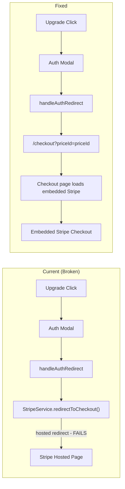
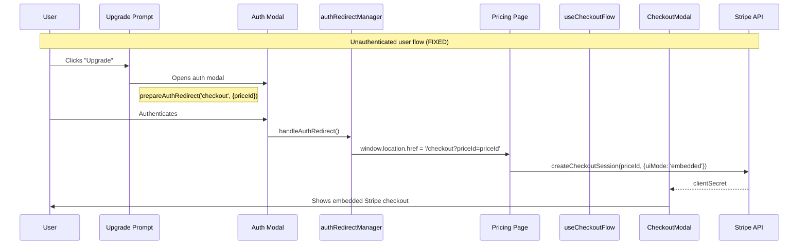

# Upgrade Funnel Fix

`Complexity: 8 → HIGH mode`

## 1. Context

**Problem:** 99% of users who click upgrade never see the checkout page. Today's fix (commit 272dba7) addressed mobile redirect but the post-auth checkout resume path is still broken, and 8 upgrade entry points add unnecessary navigation steps.

**Files Analyzed:**

- `client/hooks/useCheckoutFlow.ts` — Fixed today: now uses embedded modal for all devices
- `client/utils/authRedirectManager.ts` — **STILL BROKEN**: line 98 calls `StripeService.redirectToCheckout()` (hosted redirect)
- `client/services/stripeService.ts` — `redirectToCheckout()` creates hosted session + `window.location.href` redirect
- `client/components/stripe/CheckoutModal.tsx` — Embedded Stripe checkout modal (working)
- `client/components/stripe/PricingCard.tsx` — Uses `useCheckoutFlow` correctly
- `client/components/features/workspace/PostDownloadPrompt.tsx` — Links to `/dashboard/billing`
- `client/components/features/workspace/ModelGalleryModal.tsx` — Links to `/dashboard/billing`
- `client/components/features/workspace/BatchLimitModal.tsx` — Links to `/dashboard/billing`
- `client/components/features/workspace/AfterUpscaleBanner.tsx` — Links to `/dashboard/billing`
- `client/components/features/workspace/FirstDownloadCelebration.tsx` — Links to `/dashboard/billing`
- `client/components/features/workspace/MobileUpgradePrompt.tsx` — Links to `/dashboard/billing`
- `client/components/features/workspace/PremiumUpsellModal.tsx` — Links to `/dashboard/billing`
- `client/components/features/image-processing/FileSizeUpgradePrompt.tsx` — Links to `/pricing`
- `client/components/stripe/OutOfCreditsModal.tsx` — Links to `/pricing`
- `app/[locale]/checkout/page.tsx` — Standalone checkout page (alternative path)
- `client/store/auth/postAuthRedirect.ts` — Thin wrapper for `handleAuthRedirect()`

**Current Behavior:**

- Today's fix consolidated mobile+desktop on embedded CheckoutModal — resolves the primary 99% drop-off
- `authRedirectManager.ts:98` still calls `StripeService.redirectToCheckout()` which creates a **hosted** Stripe session and does `window.location.href = url` (full page redirect to Stripe). This is the same broken pattern removed from `useCheckoutFlow` today
- 8 upgrade prompts link to `/dashboard/billing` requiring users to: click upgrade → navigate to billing page → find pricing card → click plan → open checkout. That's 4 steps instead of 1
- No hard timeout on Stripe embed load — users on slow networks see perpetual spinner
- No `checkout_opened` event between `upgrade_prompt_clicked` and `checkout_step_viewed` — impossible to diagnose where drops happen between click and modal render

**Integration Points:**

```markdown
**How will this feature be reached?**
- [x] Entry point: Post-authentication redirect, upgrade prompt clicks from workspace
- [x] Caller files: authRedirectManager.ts (post-auth), all upgrade prompt components
- [x] Registration/wiring: Changes to existing handlers, no new routes needed

**Is this user-facing?**
- [x] YES — Fixes broken checkout path after auth, adds timeout UX on slow embed loads

**Full user flow (post-auth fix):**
1. User clicks upgrade (unauthenticated) → auth modal opens
2. User authenticates → handleAuthRedirect() fires
3. Instead of broken hosted redirect → navigates to /checkout?priceId=priceId
4. Checkout page creates embedded Stripe session automatically
```

## 2. Solution

**Approach:**

- **Phase 1**: Fix `authRedirectManager.ts` to redirect to `/checkout?priceId={priceId}` instead of calling `StripeService.redirectToCheckout()`. The standalone checkout page (`app/[locale]/checkout/page.tsx`) already handles embedded checkout for authenticated users via the `?priceId=` URL param
- **Phase 2**: Add `checkout_opened` analytics event in `useCheckoutFlow` and add 30-second hard timeout on Stripe embed load in `CheckoutModal`
- **Phase 3**: Shorten upgrade prompt paths — upgrade prompts in workspace should link to `/pricing` instead of `/dashboard/billing` (pricing page is the correct destination for new subscribers; billing page is for managing existing subscriptions)

**Architecture Diagram:**



**Key Decisions:**

- Redirect to `/checkout?priceId=xxx` — the standalone checkout page already handles embedded Stripe checkout for authenticated users (reads `priceId` from searchParams)
- The pricing page does NOT auto-open checkout from URL params, so we use the dedicated checkout page instead
- Hard timeout of 30s on Stripe embed — shows error + retry instead of infinite spinner
- Upgrade prompts should link to `/pricing` not `/dashboard/billing` — billing is for managing existing subscriptions

**Data Changes:** None

## 3. Sequence Flow



## 4. Execution Phases

### Phase 1: Fix Post-Auth Checkout Redirect — Users who authenticate before checkout reach embedded checkout instead of broken hosted redirect

**Files (3):**

- `client/utils/authRedirectManager.ts` — Replace `StripeService.redirectToCheckout()` with redirect to `/checkout?priceId=xxx`
- `tests/unit/client/utils/authRedirectManager.unit.spec.ts` — Test the new redirect behavior (create if doesn't exist)
- `client/hooks/useCheckoutFlow.ts` — Add `checkout_opened` event when modal opens

**Implementation:**

- [ ] In `authRedirectManager.ts`, replace lines 95-106:
  ```typescript
  // OLD (broken):
  if (intent?.action === 'checkout' && typeof intent.context?.priceId === 'string') {
    const { StripeService } = await import('@client/services/stripeService');
    await StripeService.redirectToCheckout(intent.context.priceId, { ... });
    return;
  }

  // NEW (working):
  if (intent?.action === 'checkout' && typeof intent.context?.priceId === 'string') {
    window.location.href = `/checkout?priceId=${encodeURIComponent(intent.context.priceId)}`;
    return;
  }
  ```
- [ ] In `useCheckoutFlow.ts`, add `checkout_opened` analytics event when `setShowCheckoutModal(true)` is called (line 113):
  ```typescript
  // Track that the checkout modal actually opened (bridges gap between upgrade_prompt_clicked and checkout_step_viewed)
  analytics.track('checkout_opened', { priceId, source: 'embedded_modal' });
  setShowCheckoutModal(true);
  ```
- [ ] Add `checkout_opened` to allowed analytics events in `app/api/analytics/event/route.ts`
- [ ] Add `checkout_opened` to analytics type union in `server/analytics/types.ts`

**Tests Required:**

| Test File | Test Name | Assertion |
|-----------|-----------|-----------|
| `tests/unit/client/utils/authRedirectManager.unit.spec.ts` | `should redirect to /checkout with priceId param when checkout intent exists` | `expect(window.location.href).toBe('/checkout?priceId=price_test_123')` |
| `tests/unit/client/utils/authRedirectManager.unit.spec.ts` | `should URL-encode the priceId parameter` | `expect(window.location.href).toContain(encodeURIComponent(priceId))` |
| `tests/unit/client/utils/authRedirectManager.unit.spec.ts` | `should redirect to dashboard when no intent exists` | `expect(window.location.href).toBe('/dashboard')` |
| `tests/unit/client/utils/authRedirectManager.unit.spec.ts` | `should not redirect when intent is expired` | `expect(window.location.href).toBe('/dashboard')` |

**Verification Plan:**

1. **Unit Tests:** `tests/unit/client/utils/authRedirectManager.unit.spec.ts` — all 4 tests above
2. **Evidence:** `yarn verify` passes

---

### Phase 2: Add Stripe Embed Hard Timeout — Users on slow networks see error + retry instead of infinite spinner

**Files (3):**

- `client/components/stripe/CheckoutModal.tsx` — Add 30s hard timeout on session creation
- `server/analytics/types.ts` — Add `checkout_timeout` event type (if not already present)
- `tests/unit/analytics/checkout-funnel.unit.spec.ts` — Add timeout test

**Implementation:**

- [ ] In `CheckoutModal.tsx`, wrap the `createCheckoutSession` call with a timeout:
  ```typescript
  // In the useEffect that creates checkout session (line 310-351):
  const CHECKOUT_TIMEOUT_MS = 30000; // 30 seconds

  const timeoutId = setTimeout(() => {
    setError('Checkout is taking too long. Please try again.');
    setLoading(false);
    trackError('network_error', 'Checkout session creation timeout (30s)', 'plan_selection');
  }, CHECKOUT_TIMEOUT_MS);

  try {
    // ... existing createCheckoutSession logic ...
  } finally {
    clearTimeout(timeoutId);
    setLoading(false);
  }
  ```
- [ ] Add a retry button in the error state that resets state and re-attempts session creation

**Tests Required:**

| Test File | Test Name | Assertion |
|-----------|-----------|-----------|
| `tests/unit/analytics/checkout-funnel.unit.spec.ts` | `should track timeout error when checkout session creation exceeds 30s` | Event data includes errorType 'network_error' and message containing 'timeout' |

**Verification Plan:**

1. **Unit Tests:** timeout behavior test
2. **Evidence:** `yarn verify` passes

---

### Phase 3: Shorten Upgrade Prompt Paths — Upgrade prompts link to `/pricing` instead of `/dashboard/billing` reducing clicks-to-checkout from 4 to 2

**Files (5):**

- `client/components/features/workspace/PostDownloadPrompt.tsx` — Change `/dashboard/billing` to `/pricing`
- `client/components/features/workspace/AfterUpscaleBanner.tsx` — Change `/dashboard/billing` to `/pricing`
- `client/components/features/workspace/ModelGalleryModal.tsx` — Change `router.push('/dashboard/billing')` to `router.push('/pricing')`
- `client/components/features/workspace/BatchLimitModal.tsx` — Change `router.push('/dashboard/billing')` to `router.push('/pricing')`
- `client/components/features/workspace/MobileUpgradePrompt.tsx` — Change `/dashboard/billing` to `/pricing`

**Implementation:**

- [ ] In each component, change the upgrade destination from `/dashboard/billing` to `/pricing`
- [ ] Update analytics `destination` property from `'/dashboard/billing'` to `'/pricing'` in each component's `upgrade_prompt_clicked` tracking

**Tests Required:**

| Test File | Test Name | Assertion |
|-----------|-----------|-----------|
| `tests/unit/client/components/PostDownloadPrompt.unit.spec.ts` | `should link to /pricing instead of /dashboard/billing` | `expect(link).toHaveAttribute('href', '/pricing')` |

**Verification Plan:**

1. **Unit Tests:** Link destination tests
2. **Evidence:** `yarn verify` passes

---

### Phase 4: Remaining Upgrade Prompt Path Fixes — Complete the path shortening for remaining components

**Files (3):**

- `client/components/features/workspace/FirstDownloadCelebration.tsx` — Change `router.push('/dashboard/billing')` to `router.push('/pricing')`
- `client/components/features/workspace/PremiumUpsellModal.tsx` — Change destination to `/pricing`
- `client/components/features/image-processing/ImageComparison.tsx` — Change `/dashboard/billing` to `/pricing` (if upgrade link exists)

**Implementation:**

- [ ] Same pattern as Phase 3 — update destination URLs and analytics tracking

**Tests Required:**

| Test File | Test Name | Assertion |
|-----------|-----------|-----------|
| `tests/unit/client/components/FirstDownloadCelebration.unit.spec.ts` | `should navigate to /pricing for upgrade` | Router push called with `/pricing` |

**Verification Plan:**

1. **Unit Tests:** Destination tests
2. **Evidence:** `yarn verify` passes

---

## 5. Acceptance Criteria

- [ ] Post-auth checkout redirect uses `/checkout?priceId=priceId` instead of `StripeService.redirectToCheckout()`
- [ ] `checkout_opened` event fires when CheckoutModal renders (bridges analytics gap)
- [ ] Stripe embed has 30s hard timeout with error + retry UX
- [ ] All 8 upgrade prompts link to `/pricing` instead of `/dashboard/billing`
- [ ] All analytics `destination` properties updated to reflect new paths
- [ ] All tests pass
- [ ] `yarn verify` passes

## 6. Success Metrics

| Metric | Current | Target | Measurement |
|--------|---------|--------|-------------|
| upgrade_prompt_clicked → checkout_step_viewed rate | 1.4% (2/143) | 50%+ | Amplitude funnel |
| checkout_opened fires per upgrade_prompt_clicked | 0% (event didn't exist) | 95%+ | Amplitude |
| Stripe embed timeout errors | Unknown | <5% | checkout_error with timeout |
| Checkout completion rate | 0% (0/143) | 5%+ | purchase_confirmed / upgrade_prompt_clicked |

## 7. Risks

| Risk | Severity | Mitigation |
|------|----------|------------|
| Checkout page requires auth — user must be authenticated when landing | LOW | User just completed auth via `handleAuthRedirect`, so they are authenticated |
| Users on `/dashboard/billing` expect to see plan options for upgrading | LOW | Billing page still shows plan grid for plan changes — this only affects initial subscription from free |
| 30s timeout too aggressive for slow regions (India, PH) | LOW | Monitor `checkout_error` with timeout; adjust if >5% of sessions timeout |
