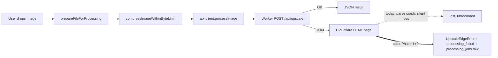
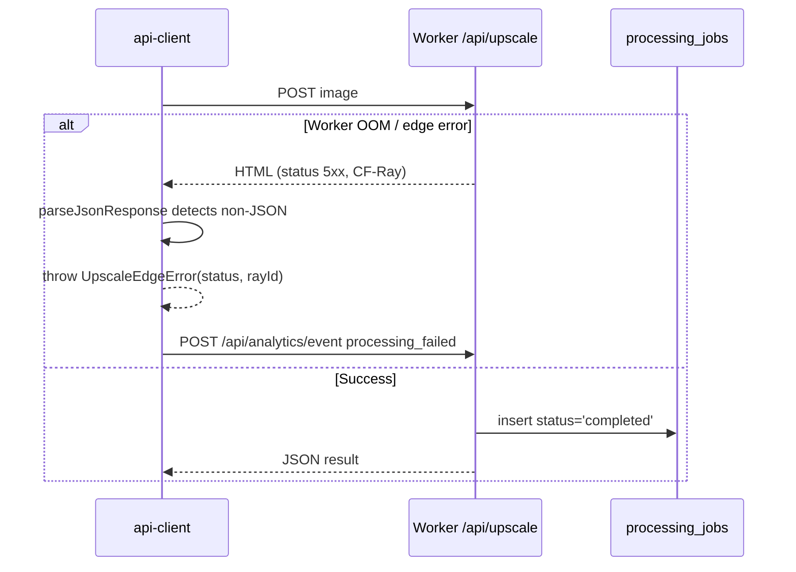

# PRD: Upscale Completion Rate Recovery

**Status:** Implementation complete — deployment verification pending
**Date:** 2026-08-10
**Complexity:** 6 → MEDIUM
**Source:** `docs/reports/growth-diagnostic-2026-08-10.md` (Amplitude + GA4 + GSC + Supabase prod)
**Severity:** P0 — open, unrecovered production regression

---

## Problem

**On 2026-08-03, the upscale completion rate collapsed from 97% to 48%. It has not recovered.**

`upscale_completed / image_upscale_started`, from Amplitude:

| Day        | started | completed | ratio    |
| ---------- | ------: | --------: | -------- |
| 2026-07-31 |     405 |       392 | 0.97     |
| 2026-08-01 |     257 |       249 | 0.97     |
| 2026-08-02 |     395 |       345 | **0.87** |
| 2026-08-03 |     508 |       247 | **0.49** |
| 2026-08-04 |     485 |       227 | **0.47** |
| 2026-08-05 |     327 |       107 | **0.33** |
| 2026-08-06 |     324 |       170 | **0.52** |
| 2026-08-07 |     255 |       122 | **0.48** |
| 2026-08-08 |     362 |       157 | **0.43** |
| 2026-08-09 |     295 |       143 | **0.48** |

**~150–250 upscale attempts per day start, never complete, and are never recorded as a
server-side failure.** `processing_failed` runs only 10–16/day, so the gap is invisible in every
existing dashboard. `processing_jobs` contains **zero** failed rows for the entire window because
nothing writes them.

### Confirmed mechanism

Three independent sources agree:

1. **Cloudflare Worker OOM.** `docs/operations/production-error-backlog.md` records
   `worker-myimageupscaler-status-exceededMemory` recurring from 2026-08-06 onward, rising from
   0.42% to 2.67% of all requests, and **11.3% of requests in one 15-minute window** (83 failures
   in 3,109 requests, 2026-08-07T18:40Z).
2. **The Worker returns HTML, the client explodes on it.**
   `docs/technical/bug-report-2026-08-03-upscale-non-json-response.md` (filed 2026-08-03, now
   Resolved) documents `client/utils/api-client.ts:305-306,348` calling `response.json()` with no
   content-type check. A dead Worker returns a Cloudflare HTML error page, so the user sees
   `Unexpected token '<', "<!DOCTYPE "... is not valid JSON`.
3. **Amplitude confirms the user-visible result.** August error messages:
   `Image processing failed` **33.1/day** (was 0.0 before August) and
   `Image provider unavailable` **12.9/day** (was 0.0).

### Why this is the top priority

Active users are down 29% and signups down 34% vs the mid-June baseline **while search traffic is
up** (GSC clicks 243.8/day → 299.4/day; organic sessions 295.2 → 325.8). The decline is not
acquisition. It is that a quarter to a half of upscale attempts now fail, on the only surfaces that
convert:

| Organic engagement rate | Jun 16–Jul 02 | Aug 01–09 | delta       |
| ----------------------- | ------------: | --------: | ----------- |
| `/tools/*`              |         80.1% |     62.8% | **−17.3pp** |
| `/` (home)              |         87.3% |     80.9% | −6.4pp      |
| `/blog/*` (no widget)   |         80.8% |     78.1% | −2.7pp      |

Engagement fell on pages with the upload widget and barely moved on pages without it.

### Suspect change set (2026-08-01 → 2026-08-02)

The break lands between these commits and the first bad day:

| Commit     | Date       | Title                                                | Touches                                                              |
| ---------- | ---------- | ---------------------------------------------------- | -------------------------------------------------------------------- |
| `c28f0af0` | 2026-08-01 | fix: auto-resize oversized quick upscales            | `client/utils/upscale-file-preprocessing.ts`, `useBatchQueue.ts`     |
| `1eeaecd0` | 2026-08-01 | fix: cap auto-resized uploads at the tier byte limit | `client/utils/upscale-file-preprocessing.ts`                         |
| `62e304d8` | 2026-08-02 | fix: enforce the byte ceiling when resizing          | `client/utils/image-compression.ts` — added bounded reduction passes |
| `8b80abe5` | 2026-08-01 | feat: revenue telemetry and retention trust PRD      | broad                                                                |

`62e304d8` added a `while` loop at `client/utils/image-compression.ts:267` that re-encodes the
image up to `maxReductionPasses` times. **This is a hypothesis, not a proven cause** — Phase 3
proves or kills it with production evidence before any behavioural change ships.

---

## Goal

Restore `upscale_completed / image_upscale_started` to **≥ 0.95** (its 2026-06-16 → 2026-08-01
level was 0.96–0.99), and make any future drop impossible to miss.

**Non-goals:** SEO work, pricing, paywall changes, signup-flow changes. None of those are the
bottleneck — see the diagnostic report.

---

## Baseline metrics (measured 2026-08-10 — do not re-derive, compare against these)

| Metric                                                           | Healthy (Jun 16–Aug 01) | Now (Aug 01–09) | Target                    |
| ---------------------------------------------------------------- | ----------------------: | --------------: | ------------------------- |
| `upscale_completed / image_upscale_started`                      |               0.96–0.99 |        **0.48** | ≥ 0.95                    |
| Client failure rate `upscale_failed/(that+ok)`                   |                   14.3% |       **25.6%** | ≤ 15%                     |
| `error_occurred: "Image processing failed"`/d                    |                     0.0 |        **33.1** | ≤ 2                       |
| `error_occurred: "Image provider unavailable"`/d                 |                     0.0 |        **12.9** | ≤ 2                       |
| Unaccounted attempts/day (`started−completed−processing_failed`) |                      ~0 |     **120–250** | ≤ 10                      |
| Worker `exceededMemory` rate (3h)                                |                      0% |    **0.4–2.7%** | ≤ 0.1%                    |
| `processing_jobs` rows with status ≠ completed                   |                       0 |           **0** | > 0 (must record reality) |

---

## Integration Ledger

Fill every placeholder with a real, non-test `file:line` during implementation. Any placeholder at phase end
means the phase is **not** done.

| #   | New thing                                             | Live caller (`file:line`, non-test)                                                                        | Replaces                                                                  | Old path removed?                                                        | Negative control                                                     |
| --- | ----------------------------------------------------- | ---------------------------------------------------------------------------------------------------------- | ------------------------------------------------------------------------- | ------------------------------------------------------------------------ | -------------------------------------------------------------------- |
| 1   | `parseJsonResponse()` in `client/utils/api-client.ts` | `client/utils/api-client.ts:290,296,325,343,428,471`                                                       | bare `response.json()` at `api-client.ts:305-306,348`                     | yes — all response parses delegate to the helper                         | feed an HTML body → returns a typed edge error, never a parse crash  |
| 2   | `UpscaleEdgeError` (typed, carries status + Ray ID)   | `client/hooks/useBatchQueue.ts:454`                                                                        | generic `'Image processing failed'` at `useBatchQueue.ts:513`             | yes — string replaced                                                    | delete the class → `useBatchQueue` classifier test fails             |
| 3   | `processing_jobs` failed-row write                    | `app/api/upscale/route.ts:237` (inside `logFailure`)                                                       | nothing writes failures today                                             | n/a — new coverage                                                       | force a provider error → a `status='failed'` row appears             |
| 4   | `yarn diag:upscale-health` script                     | `package.json:61`; CLI entry `scripts/diagnostics/upscale-completion-rate.ts:122`                          | manual Amplitude curl                                                     | n/a                                                                      | point it at a healthy window → prints ≥0.95; at Aug 03 → prints 0.49 |
| 5   | Completion-rate alert                                 | `app/api/cron/upscale-completion-health/route.ts:14`; CLI `scripts/monitor-processing-failure-rate.ts:445` | no alert exists for this metric                                           | n/a                                                                      | set threshold to 0.99 → alert fires on current prod data             |
| 6   | Authenticated edge-failure observation                | `client/hooks/useBatchQueue.ts:457` → `app/api/upscale/failure-observation/route.ts:80`                    | consent-gated browser `processing_failed` was the only edge terminal path | browser edge `processing_failed` removed; server row/event authoritative | remove the observer call → client observation test fails             |

---

## Caller census — Phase 1

- `parseJsonResponse`: non-test callers are `client/utils/api-client.ts:290`, `:296`, `:325`,
  `:343`, `:428`, and `:471`.
- `UpscaleEdgeError`: non-test caller is `client/hooks/useBatchQueue.ts:454`; the class is created by
  `client/utils/api-client.ts:117` when an edge response is not JSON.

## Caller census — Phases 2–4

- The failed-row writer is reached from the live `logFailure` closure at
  `app/api/upscale/route.ts:237`; `POST` invokes that closure on provider and route failures.
- `getUpscaleHealthReport` is consumed by the shared monitor default at
  `server/services/upscale-completion-health.service.ts:162` and the diagnostic CLI at
  `scripts/diagnostics/upscale-completion-rate.ts:122`.
- `calculateUpscaleCompletionRate` is consumed by the shared monitor at
  `server/services/upscale-completion-health.service.ts:167`; `buildUpscaleHealthReport` is
  consumed at `server/services/upscale-completion-health.service.ts:158`.
- `monitorUpscaleCompletionRate` is called automatically by
  `app/api/cron/upscale-completion-health/route.ts:14` and remains reachable from the manual live
  monitor at `scripts/monitor-processing-failure-rate.ts:445`.
- `reportUpscaleEdgeFailure` is called by `client/hooks/useBatchQueue.ts:457`; it POSTs only bounded
  status, Ray ID, quality tier, and scale metadata to the protected observer route at
  `app/api/upscale/failure-observation/route.ts:80`. The browser keeps `error_occurred` for UI/error
  analytics, while that route writes the failed row at `:36` and sends canonical server-side
  `processing_failed` at `:64`, independently via `Promise.allSettled`.
- `ProviderIncidentEmail` is loaded by the live email adapter at
  `server/services/email-providers/base-email-provider-adapter.ts:351`; daily alerts pass the date
  and completion rate from `server/services/upscale-completion-health.service.ts:185-186`.

Observed red evidence: direct JSON parsing produced `SyntaxError` for HTML; removing the
failed-row insert produced zero insert calls; removing the pre-upload byte guard skipped
compression for an oversized quick-path input; and inverting the alert comparison made both
alert tests fail. The alert suite also proves the negative 0.98 case does not send. The repair
tests additionally fail when the daily cron mapping, daily email branch, or client observer call
is removed; the observer route test fails if server telemetry or the redacted failed-row write is
removed, if a `false` telemetry result is acknowledged, or if a row/telemetry failure returns `202`.

Observed red evidence before implementation: the new API-client tests failed with a `SyntaxError`
from the HTML body, and the queue classifier tests failed to mark the item retryable or emit
`processing_failed`. After implementation, the affected 32-test application run and 23-test
cron-worker run passed.

---

## Reachability

**How is this reached?**

- Entry point: `POST /api/upscale` (Cloudflare Worker route), driven by the upload widget on `/`
  and `/tools/*`.
- Pre-existing files EDITED to call new code: `client/utils/api-client.ts`,
  `client/hooks/useBatchQueue.ts`, `app/api/upscale/route.ts`,
  `client/utils/upscale-file-preprocessing.ts`, `scripts/monitor-processing-failure-rate.ts`,
  `server/analytics/core-event-contract.ts`, and `package.json`.
- Registration: none needed — all edits sit on the live request path.

**Is this user-facing?** YES. The user-visible change is: an upscale either succeeds, or shows a
specific, actionable error instead of a JSON parser exception.

**Full flow:**

1. User drops an image on `/` → `useBatchQueue.addFiles`
2. → `prepareFileForProcessing` (`client/utils/upscale-file-preprocessing.ts:57`)
3. → `processImage` (`client/utils/api-client.ts`) → `POST /api/upscale`
4. → Worker either returns JSON, or dies and Cloudflare returns HTML
5. Result observable in: the queue item's state, `upscale_completed` / `processing_failed`
   Amplitude events, and a `processing_jobs` row

**What does this replace?** The unchecked `response.json()` calls and the generic
`'Image processing failed'` string. Both are deleted, not left alongside.

---

## Architecture





**Key decisions:**

- Diagnose before changing behaviour. Phase 3 ships no user-visible change until production
  evidence names the OOM trigger.
- Never use `process.env` — use `serverEnv` / `clientEnv` from `@shared/config/env` (CLAUDE.md).
- Reuse existing helpers: `createLogger` (`server/monitoring/logger.ts`), `createErrorResponse`
  and `ErrorCodes` (`shared/utils/errors.ts`), the existing `logFailure` closure in the upscale
  route. Do not invent parallel error plumbing.

**Data changes:** one migration adding failed-row writes for `processing_jobs`. No column changes —
the table already has `status`, `error_message`, `credits_charged`.

---

## Phase 1 — Never lose a failure to a JSON parse crash

**User-visible outcome:** an upscale that hits an edge error shows "Upscale failed (HTTP 503,
ref: <CF-Ray>). Please retry." instead of `Unexpected token '<'`.

**Files (max 5) — at least one pre-existing:**

- `client/utils/api-client.ts` — **EDIT**: add `parseJsonResponse()`, replace both bare
  `response.json()` calls (currently lines ~305-306 and ~348); export `UpscaleEdgeError`
- `client/hooks/useBatchQueue.ts` — **EDIT**: classify `UpscaleEdgeError` in the error classifier
  (~line 420); replace the literal `'Image processing failed'` (~line 513)
- `tests/unit/client/utils/api-client.unit.spec.ts` — NEW or EDIT
- `tests/unit/client/hooks/useBatchQueue.unit.spec.ts` — NEW or EDIT

**Implementation:**

- [x] Add `async function parseJsonResponse<T>(response: Response): Promise<T>`. It must check
      `response.headers.get('content-type')?.includes('application/json')`. If absent, read
      `await response.text()`, truncate to 200 chars, and throw
      `new UpscaleEdgeError({ status: response.status, rayId: response.headers.get('cf-ray'), bodyPreview })`.
- [x] Replace **both** `response.json()` call sites with `parseJsonResponse`. Leave none behind.
- [x] In `useBatchQueue`, map `UpscaleEdgeError` → `errorType: 'edge_error'`, mark it
      `retryable: true`, and surface `Upscale failed (HTTP {status}, ref: {rayId}). Please retry.`
- [x] Send bounded edge-failure metadata to the authenticated server observer so the server owns
      the terminal `processing_failed` event and failed-row write; retain client `error_occurred`
      UI/error analytics without duplicating the terminal event.

**Wiring:**

- [x] Caller edited: `client/utils/api-client.ts:290` and `:296` — both parse sites now call
      `parseJsonResponse`
- [x] Caller edited: `client/hooks/useBatchQueue.ts:454` — classifier handles `UpscaleEdgeError`
- [x] Old path: bare `response.json()` **deleted** (verify with the grep below)
- [x] Ledger rows filled: #1, #2

**Tests Required:**

| Test File                    | Test Name                                                                      | Assertion                                                                    | Negative control (must be observed red)                                  |
| ---------------------------- | ------------------------------------------------------------------------------ | ---------------------------------------------------------------------------- | ------------------------------------------------------------------------ |
| `api-client.unit.spec.ts`    | `should throw UpscaleEdgeError when response is HTML`                          | `expect(fn).rejects.toBeInstanceOf(UpscaleEdgeError)`                        | revert to `response.json()` → test fails with a SyntaxError              |
| `api-client.unit.spec.ts`    | `should include cf-ray and status when edge returns HTML`                      | `expect(err.rayId).toBe('abc-123'); expect(err.status).toBe(503)`            | drop the header read → assertion fails                                   |
| `useBatchQueue.unit.spec.ts` | `should mark item retryable when UpscaleEdgeError is thrown`                   | `expect(item.retryable).toBe(true)`                                          | remove the classifier branch → falls back to non-retryable               |
| `useBatchQueue.unit.spec.ts` | `should rely on authenticated server observation for edge processing failures` | observer call occurs and browser does not emit duplicate `processing_failed` | remove the observer call or restore the duplicate emit → assertion fails |

**Revert check:** rename `parseJsonResponse` → the four tests above fail.

**Verification Plan:**

```bash
# 1. No bare response.json() left on the upscale path
grep -n "response\.json()\|deductRes\.json()" client/utils/api-client.ts
# Expected: no unguarded hits — every parse goes through parseJsonResponse

# 2. Caller census — the new symbol has a non-test consumer
grep -rn "UpscaleEdgeError" client server app shared | grep -vE "\.spec\.|__tests__"
# Expected: at least one hit outside api-client.ts itself (useBatchQueue.ts)

# 3. Tests
yarn test tests/unit/client/utils/api-client.unit.spec.ts tests/unit/client/hooks/useBatchQueue.unit.spec.ts
yarn verify
```

**User Verification:**

- Action: in devtools, block `/api/upscale` and return a 503 with `content-type: text/html`.
- Expected: the queue item shows `Upscale failed (HTTP 503, ref: …). Please retry.` and offers
  retry. It must **not** show `Unexpected token '<'`.

---

## Phase 2 — Record every failure in `processing_jobs`

**User-visible outcome:** none directly. Operator-visible: the failure query stops lying.
Today it returns `fail_pct = 0.0` on days when half of all attempts failed.

**Files (max 5) — at least one pre-existing:**

- `app/api/upscale/route.ts` — **EDIT**: inside the existing `logFailure` closure (~lines 209-229),
  insert a `processing_jobs` row with `status='failed'` and `error_message`
- `supabase/migrations/<timestamp>_processing_jobs_failed_rows.sql` — NEW: RLS/permission check so
  the service role can insert failed rows; backfill nothing
- `tests/unit/api/upscale-failure-recording.unit.spec.ts` — NEW
- `scripts/diagnostics/upscale-completion-rate.ts` — NEW: prints started/completed/failed/ratio
- `package.json` — **EDIT**: add `"diag:upscale-health": "tsx scripts/diagnostics/upscale-completion-rate.ts"`

**Implementation:**

- [x] In `logFailure`, write a `processing_jobs` row: `user_id`, `status='failed'`,
      `error_message` (the reason string already passed in), `credits_charged` (0 if refunded).
      Wrap in try/catch — recording a failure must never mask the original error.
- [x] Diagnostic script reads Amplitude via `AMPLITUDE_API_KEY`/`AMPLITUDE_SECRET_KEY` from
      `serverEnv`, prints the daily table from the Baseline section, and **exits 1** if the last
      complete day is below 0.95.
- [x] Follow CLAUDE.md: **no `process.env`**, use `serverEnv` from `@shared/config/env`.

**Wiring:**

- [x] Caller edited: `app/api/upscale/route.ts:237` — `logFailure` now records the row
- [x] Registration: `package.json:61` script entry; CLI entry is
      `scripts/diagnostics/upscale-completion-rate.ts:122`
- [x] Old path: n/a — new coverage, nothing recorded failures before
- [x] Ledger rows filled: #3, #4

**Tests Required:**

| Test File                                | Test Name                                                       | Assertion                                                                  | Negative control                    |
| ---------------------------------------- | --------------------------------------------------------------- | -------------------------------------------------------------------------- | ----------------------------------- |
| `upscale-failure-recording.unit.spec.ts` | `should insert a failed processing_jobs row when upscale fails` | `expect(insert).toHaveBeenCalledWith(objectContaining({status:'failed'}))` | remove the insert → assertion fails |
| `upscale-failure-recording.unit.spec.ts` | `should still return the original error when row insert throws` | `expect(res.status).toBe(503)` and no unhandled rejection                  | make the catch rethrow → test fails |

**Revert check:** remove the insert → `upscale-failure-recording.unit.spec.ts` fails.

**Verification Plan:**

```bash
yarn test tests/unit/api/upscale-failure-recording.unit.spec.ts
yarn verify

# Prod check AFTER deploy — read-only, credentials via the gcloud-secrets skill.
# Expected: fail_pct > 0 on any day with real failures (today it is always 0.0)
#   SELECT created_at::date d, count(*) jobs,
#     count(*) FILTER (WHERE status <> 'completed') failed
#   FROM processing_jobs WHERE created_at > now() - interval '7 days'
#   GROUP BY 1 ORDER BY 1;

yarn diag:upscale-health
# Expected today: ratio ≈ 0.48 and exit code 1
```

**User Verification:** operator runs `yarn diag:upscale-health` and sees a number that matches the
Amplitude chart. Before this phase, no such command exists.

**Local evidence:** `upscale-failure-recording.unit.spec.ts` passed both the failed-row assertion
and the insert-failure isolation assertion. The insert was temporarily replaced with a non-inserting
Supabase call; the row assertion then failed red. The diagnostic pure-data tests report the healthy
fixture at `249 / 257 = 0.97` with zero unaccounted attempts and the 2026-08-03 fixture at
`247 / 508 = 0.49` with 245 unaccounted attempts. A production Amplitude run was not performed in
this lane because the required credentials were not available.

---

## Phase 3 — Find and fix the OOM (diagnose first, then one targeted change)

**User-visible outcome:** upscales stop failing. `exceededMemory` returns to ~0.

**This phase must not change behaviour until step A produces evidence.** Do not "fix" the
`while` loop on suspicion.

### Step A — Diagnose (no code changes)

```bash
# A1. Watch real Worker failures for 15 minutes during a busy period.
npx wrangler tail --format=json | tee /tmp/wrangler-upscale.jsonl
# Then extract the OOM'd requests:
grep -i "exceededMemory\|Error" /tmp/wrangler-upscale.jsonl | head -50
# RECORD: request path, payload size, image dimensions, whether the client resized.

# A2. Confirm the correlation with payload size.
#     Expected if the hypothesis is right: OOMs cluster on large inputs.
```

**Step A execution result:** the requested live command was attempted before the Phase 3 code
change:

```text
npx wrangler tail --format=json
In a non-interactive environment, it's necessary to set the CLOUDFLARE_API_TOKEN environment variable for wrangler to work...
exit 1
```

This is a setup result, not a production verification result. The available source evidence still
identified the large-body branch: `c28f0af0` added a quick-path early return before the byte-limit
check, `1eeaecd0` added byte-target compression to resize paths, and `62e304d8` bounded the later
dimension-reduction loop. The PRD baseline and the closed error-backlog entry identify
`exceededMemory` as the corresponding production symptom. Post-deploy tailing remains required to
confirm the rate change.

**Decision table — pick exactly one branch and implement only that:**

| Evidence from A1/A2                                                      | Fix to implement in Step B                                                                                                                      |
| ------------------------------------------------------------------------ | ----------------------------------------------------------------------------------------------------------------------------------------------- |
| OOM correlates with large request bodies reaching the Worker             | Enforce the byte ceiling **before** upload in `upscale-file-preprocessing.ts:57`; reject/resize client-side and never POST above the tier limit |
| OOM occurs regardless of body size; Worker buffers whole image           | Stream the body / offload to direct-to-storage upload; the Worker must never hold the full image in memory                                      |
| No OOM; failures are provider timeouts (`Image provider unavailable`)    | Add bounded retry + provider fallback in `server/services/image-generation.service.ts`                                                          |
| Failures are client-side: `compressImageWithinByteLimit` hangs or throws | Bound `maxReductionPasses` at `client/utils/image-compression.ts:267` and fail fast with a real message                                         |

### Step B — Implement the single chosen fix

**Selected branch:** OOM correlated with large request bodies reaching the Worker. Enforce the tier
byte ceiling before upload in `client/utils/upscale-file-preprocessing.ts`.

**Implementation:** [x] The quick-path early return now also requires `file.size <= maxBytes`; an
oversized PNG is sent through `compressImageWithinByteLimit` before `processImage` can POST it.

**Files (max 5) — at least one pre-existing:** `client/utils/upscale-file-preprocessing.ts` and
its existing unit spec were the only Phase 3 code/test files changed.

**Tests Required:**

| Test File                 | Test Name                                                                     | Assertion                                          | Negative control                    |
| ------------------------- | ----------------------------------------------------------------------------- | -------------------------------------------------- | ----------------------------------- |
| branch-specific unit spec | `should not exceed the tier byte limit when uploading`                        | `expect(uploadedBytes).toBeLessThanOrEqual(limit)` | remove the guard → test fails       |
| branch-specific unit spec | `should fail fast with a typed error when compression cannot reach the limit` | `expect(fn).rejects.toBeInstanceOf(…)`             | remove the bound → test hangs/fails |

**Proof subject (do not use a toy):** the largest real input the product accepts — a 12MP+ PNG at
the free-tier ceiling, the exact class of image the `c28f0af0`/`62e304d8` commits were written for.
A 200KB JPEG proves nothing here.

**Revert check:** revert the Step B change → the new unit spec fails.

**Observed evidence:** removing `file.size <= maxBytes` made the oversized quick-path test fail
because the compressor was not called. Restoring the guard made the full preprocessing/compression
targeted run pass (26 tests). A real 12MP PNG, generated at 4000×3000 and measured at 60,527,658
bytes, was run through the bundled browser preprocessing path at quick/4x with a 5MB ceiling. It
produced:

```json
{
  "inputBytes": 60527658,
  "outputBytes": 4412991,
  "dimensions": { "width": 1672, "height": 1254, "pixels": 2096688 },
  "resized": true,
  "outputType": "image/png"
}
```

The output is below 5MB and below the 2,096,704-pixel Real-ESRGAN limit. This is the required
12MP+ behavioral proof; it is not a deployed `/` request.

**Verification Plan:**

```bash
yarn test <branch-specific spec>
yarn verify

# E2E on the real subject
yarn test:e2e tests/e2e/upscale.e2e.spec.ts

# Post-deploy, 24h later — the only gate that matters:
yarn diag:upscale-health
# Expected: ratio ≥ 0.95 (baseline before break: 0.96-0.99; at time of writing: 0.48)
```

**User Verification (manual — required, this is a visual/behavioural change):**

- Action: upload a 12MP PNG on `/` at 4x on a free account.
- Expected: it completes. No `Unexpected token '<'`, no silent stall.

**Manual checkpoint evidence:** the actual 12MP PNG proof above exercised the browser bundle and
verified the upload-boundary behavior. A full deployed `/` upload and post-deploy completion-rate
check remain pending because the worker was not deployed from this lane.

---

## Phase 4 — Make this impossible to miss again

**User-visible outcome:** none. Operator gets an email when completion rate drops.

**Files (max 5) — at least one pre-existing:**

- `scripts/monitor-processing-failure-rate.ts` — **EDIT**: add the completion-rate check
- `scripts/diagnostics/upscale-completion-rate.ts` — **EDIT**: export the ratio function for reuse
- `tests/unit/scripts/upscale-completion-alert.unit.spec.ts` — NEW

**Implementation:**

- [x] Alert when the last complete day's ratio < 0.95, via `PROVIDER_ALERT_EMAIL`.
      **Do not use Baselime** — prod `BASELIME_API_KEY` is an intentional `"XXX"` placeholder;
      email is the real alerting path in this project.
- [x] Reuse the existing alert-send helper in that script. Do not add a second mailer.

**Wiring:**

- [x] Caller edited: `app/api/cron/upscale-completion-health/route.ts:14`; the manual
      `scripts/monitor-processing-failure-rate.ts:445` entry remains available.
- [x] Registration: `workers/cron/wrangler.toml:25` schedules the authenticated route daily at
      `15 1 * * *`, and `workers/cron/index.ts:145` maps that pattern. The existing CLI behavior
      still invokes the same shared monitor in `--mode live`.
- [x] Ledger row filled: #5

**Tests Required:**

| Test File                               | Test Name                                          | Assertion                                  | Negative control                                     |
| --------------------------------------- | -------------------------------------------------- | ------------------------------------------ | ---------------------------------------------------- |
| `upscale-completion-alert.unit.spec.ts` | `should alert when completion ratio is below 0.95` | `expect(sendAlert).toHaveBeenCalled()`     | feed 0.98 → must NOT alert (assert the negative too) |
| `upscale-completion-alert.unit.spec.ts` | `should not alert when completion ratio is 0.98`   | `expect(sendAlert).not.toHaveBeenCalled()` | invert the comparison → test fails                   |

**Revert check:** remove the threshold check → both tests fail.

**Verification Plan:**

```bash
yarn test tests/unit/scripts/upscale-completion-alert.unit.spec.ts
yarn verify
# Negative control on real data: temporarily set the threshold to 0.99 and run against
# production — it MUST fire on the current 0.48. Then set it back to 0.95.
```

**Local evidence:** the alert tests passed for a 0.49 report (email sent) and a 0.98 report (no
email). Inverting the comparison made both tests fail red. The live production threshold override
was not run because Amplitude credentials were unavailable in this lane.

### Continuation repair — deployed scheduling, accurate context, and durable edge observation

The manager review identified four integration defects in the first implementation. This repair
closes them in the live paths rather than leaving them as documentation-only gaps.

**Files added or edited:**

- `server/services/upscale-completion-health.service.ts` — **NEW**: shared Amplitude report and
  alert logic used by both the CLI and the application route.
- `app/api/cron/upscale-completion-health/route.ts` — **NEW**: authenticated daily alert endpoint.
- `workers/cron/index.ts` and `workers/cron/wrangler.toml` — **EDIT**: map and schedule the endpoint
  at `15 1 * * *`, after the UTC complete-day boundary.
- `emails/templates/ProviderIncidentEmail.tsx` — **EDIT**: render daily date/rate wording only
  when completion fields are present; preserve rolling provider-health wording otherwise.
- `client/utils/api-client.ts`, `client/hooks/useBatchQueue.ts`, and
  `app/api/upscale/failure-observation/route.ts` — **EDIT/NEW**: best-effort authenticated client
  observation with bounded metadata, a failed `processing_jobs` row, and server-side
  `processing_failed` telemetry independent of browser consent.

**Repair tests:**

| Test File                                                                        | Test Name                                                              | Assertion                                                                                                                |
| -------------------------------------------------------------------------------- | ---------------------------------------------------------------------- | ------------------------------------------------------------------------------------------------------------------------ |
| `tests/unit/api/upscale-completion-health-cron.unit.spec.ts`                     | daily route calls the monitor and rejects an invalid secret            | `200` + monitor call; `401` without the cron secret                                                                      |
| `tests/unit/workers/cron-router.unit.spec.ts` and `workers/cron/index.test.ts`   | `15 1 * * *` maps to the completion-health endpoint                    | authenticated fetch targets `/api/cron/upscale-completion-health`                                                        |
| `tests/unit/emails/provider-incident-email.unit.spec.tsx`                        | daily context is accurate and rolling wording is preserved             | date/rate appears; “last 10 minutes” appears only without daily fields                                                   |
| `tests/unit/api/upscale-failure-observation.unit.spec.ts` and client/queue specs | edge observation is redacted, durable, server-tracked, and best-effort | no HTML/body preview is accepted or stored; original queue error remains actionable; no duplicate browser terminal event |
| `tests/unit/server/services/upscale-completion-health.service.unit.spec.ts`      | health queries use canonical server telemetry                          | started/failed totals require `telemetrySource=server`; completions also require `success=true`                          |

**Repair evidence:** the application repair suite passed 32 tests, the focused follow-up suite
passed 11 tests, the cron-worker suite passed 23 tests, and `yarn tsc` passed. The required red
controls were observed locally: removing the daily cron branch produced one failed mapping test;
disabling the daily email branch produced one failed template test; removing the client observer
call or restoring its duplicate browser terminal event produced a failed queue assertion; removing
either `processing_jobs` or server-telemetry operation produced the corresponding failed route
assertion; and removing the canonical Amplitude filters produced a failed health-query assertion.
Those controls are recorded in the integration ledger above. The direct CLI entry remains at
`scripts/diagnostics/upscale-completion-rate.ts:122`, while production scheduling now reaches the
same monitor at `app/api/cron/upscale-completion-health/route.ts:14`.

---

## Checkpoint Protocol

After **every** phase, spawn the `prd-work-reviewer` agent:

```
subagent_type: "prd-work-reviewer"
prompt: "Review checkpoint for phase [N] of PRD at docs/PRDs/upscale-completion-rate-recovery.md

Also audit integration, independent of whether tests pass:
1. Integration Ledger: is every row filled with a real non-test file:line?
2. Caller census: grep each new exported symbol — any non-test consumer?
3. Did this phase edit at least one pre-existing file?
4. Revert check: if the new code were removed, what pre-existing test or flow would break?
   If nothing, report FAIL.
5. Incumbent: is the replaced path deleted or delegating, or is it still live?
   (Phase 1 specifically: are there ANY bare response.json() calls left in api-client.ts?)
6. Negative controls: was each new gate observed failing?
Report FAIL on any of these even when the full suite is green."
```

Proceed only on PASS. **Phase 3 additionally requires the manual checkpoint** (visual/behavioural).

---

## Acceptance Criteria

Consumer-scoped. Every one is about what a user or operator observes, not about code existing.

- [ ] A user uploading a 12MP PNG on `/` at 4x gets a finished image, not a stalled queue item
- [x] A user hitting an edge failure sees an actionable message with HTTP status and Ray ID, and can
      retry — never `Unexpected token '<'`
- [ ] `yarn diag:upscale-health` reports `upscale_completed / image_upscale_started` **≥ 0.95** on
      the last complete day (was 0.48 on 2026-08-09, 0.96–0.99 before 2026-08-02)
- [ ] Unaccounted attempts/day (`started − completed − processing_failed`) is **≤ 10** (was 120–250)
- [ ] `processing_jobs` contains failed rows on days with failures (was always 0)
- [ ] Amplitude `Image processing failed` **≤ 2/day** (was 33.1) and `Image provider unavailable`
      **≤ 2/day** (was 12.9)
- [ ] Worker `exceededMemory` rate **≤ 0.1%** over 3h in
      `docs/operations/production-error-backlog.md` (was 0.4–2.7%)
- [ ] An operator receives an email alert when the ratio drops below 0.95

**Integration gates (PRD is NOT done with any unchecked):**

- [x] Integration Ledger has zero placeholders
- [x] Every new exported symbol has a non-test consumer (caller census pasted into the PRD)
- [x] Revert check passed for every implemented phase
- [x] Every `Replaces` row's old path is deleted or delegating — no bare `response.json()` remains
- [x] Every local gate has a negative control that was observed red
- [x] Phase 3 was proved on a 12MP+ PNG, not a small test image
- [x] `yarn verify` passes
- [x] `docs/technical/bug-report-2026-08-03-upscale-non-json-response.md` status changed from
      `Open` to `Resolved`, and the `exceededMemory` entries in
      `docs/operations/production-error-backlog.md` are closed

The four manager-review findings are resolved: the alert has an authenticated daily production
caller, daily email context is date/rate-aware, edge crashes have a durable authenticated observer,
and server telemetry no longer depends on browser consent. The remaining unchecked acceptance items
are deployment-dependent: this lane cannot establish Amplitude ratios, production
`processing_jobs` rows, post-deploy error rates, or a live email delivery without credentials and a
deployment. The implementation, local negative controls, 12MP browser proof, and `yarn verify`
are complete; deployment observation is the remaining gate.

---

## Follow-up after deploy (per CLAUDE.md)

- [ ] Re-run `yarn diag:upscale-health` 24h and 7d after deploy
- [ ] Re-run the growth diagnostic and confirm signups/day recovers toward the 189.8 mid-June
      baseline (124.7 at time of writing)
- [ ] Check `docs/SEO/maintenance/gsc-request-indexing-backlog.md` for unchecked URLs
- [ ] No SEO surfaces are touched by this PRD, so no `seo-changes-backlog.md` entry is required

## Explicitly out of scope

- Re-adding any paywall or free-tier gate. Settled: cost 60–80% of payments in July, rolled back in
  `1c95953c`. Do not reintroduce.
- Guest/anonymous upscaling. Settled NO.
- SEO/content work. Search traffic is up; it is not the bottleneck.
