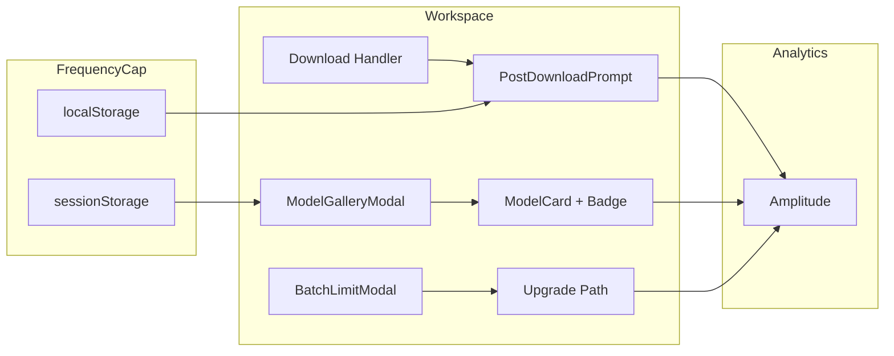
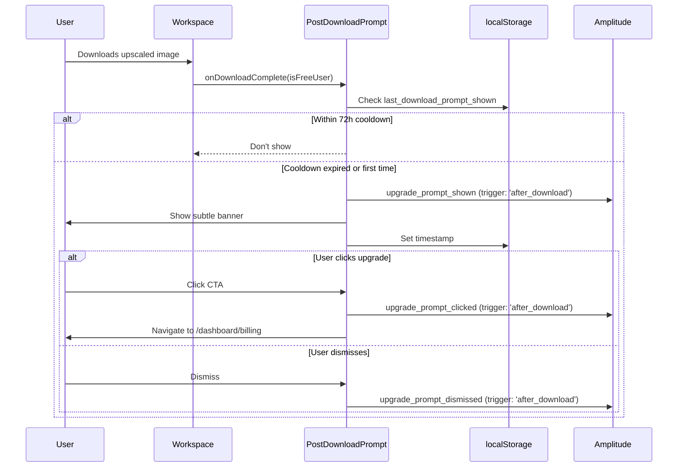

# UX & Conversion Optimization — Data-Driven Improvements

`Complexity: 7 → HIGH mode`

## 1. Context

**Problem:** Analytics data (Feb 26–Mar 2, 2026) reveals upgrade prompts have 3.8% CTR with 33% dismiss rate, model gallery UX causes confusion, and checkout abandonment lacks funnel visibility.

**Files Analyzed:**

```
client/components/features/workspace/AfterUpscaleBanner.tsx
client/components/features/workspace/UpgradeSuccessBanner.tsx
client/components/features/workspace/ModelGalleryModal.tsx
client/components/features/workspace/ModelCard.tsx
client/components/features/workspace/ModelGallerySearch.tsx
client/components/features/workspace/BatchLimitModal.tsx
client/components/features/workspace/BatchSidebar/QualityTierSelector.tsx
client/components/features/workspace/Workspace.tsx
client/components/features/workspace/PreviewArea.tsx
client/components/features/image-processing/ImageComparison.tsx
client/components/stripe/CheckoutModal.tsx
client/components/stripe/OutOfCreditsModal.tsx
client/analytics/analyticsClient.ts
client/hooks/useBatchQueue.ts
client/hooks/useLowCreditWarning.ts
client/store/userStore.ts
client/utils/download.ts
server/analytics/types.ts
server/analytics/analyticsService.ts
app/api/analytics/event/route.ts
app/[locale]/pricing/PricingPageClient.tsx
shared/types/coreflow.types.ts
shared/config/model-costs.config.ts
shared/config/subscription.utils.ts
locales/en/workspace.json
tests/unit/client/upgrade-prompts.unit.spec.tsx
tests/unit/analytics/funnel-events.unit.spec.ts
docs/PRDs/conversion-optimization.md
docs/PRDs/done/upgrade-prompts-strategy.md
```

**Current Behavior:**

- 5 upgrade prompts exist: `after_upscale` (3rd upscale), `model_gate` (gallery open), `after_comparison` (slider drag), `out_of_credits` (402 error), `premium_upsell` (unused)
- All use `sessionStorage` for once-per-session throttling, no cross-session frequency capping
- Model gallery shows 3 free + 12 premium tiers with no "recommended" or popularity signals
- Batch limit modal has decent 10-15% upgrade CTR but generic copy
- Checkout abandonment tracked at `plan_selection` and `stripe_embed` steps but no funnel dashboard
- No post-download upgrade prompt exists — the moment of highest satisfaction is unused
- `UpgradeSuccessBanner` fires after batch completion but links to `/pricing` (subscription-first) vs `/dashboard/billing` (credit-first, which is where most purchases happen per Stripe data)

**Integration Points Checklist:**

```
How will this feature be reached?
- [x] Entry points: Post-download callback, model gallery open, batch limit hit
- [x] Caller files: Workspace.tsx (orchestrator), ModelGalleryModal.tsx, BatchLimitModal.tsx
- [x] Registration/wiring: New PostDownloadPrompt wired into Workspace download handler

Is this user-facing?
- [x] YES → UI components: PostDownloadPrompt, updated ModelCard badges, updated BatchLimitModal copy

Full user flow:
1. User downloads upscaled image → sees subtle post-download upgrade nudge
2. User opens model gallery → sees "Popular" badge on top models, "Best for photos" hints
3. User hits batch limit → sees improved copy with remaining uses count
4. All interactions tracked → conversion funnel visible in Amplitude
```

## 2. Solution

**Approach:**

- Add a post-download upgrade prompt shown after first successful download (highest satisfaction moment)
- Add "Popular" / "Recommended" badges to model gallery cards using a static config
- Improve batch limit modal copy with value props, remaining count context, and social proof
- Add cross-session frequency capping via `localStorage` to prevent prompt fatigue
- Fix `UpgradeSuccessBanner` destination from `/pricing` to `/dashboard/billing` (credit-first)

**Architecture Diagram:**



**Key Decisions:**

- [x] Static badges via config (not API-based popularity) — KISS, no backend changes needed
- [x] `localStorage` for cross-session capping (max 1 post-download prompt per 72 hours)
- [x] Credit-first destination (`/dashboard/billing`) based on Stripe purchase data
- [x] Reuse existing analytics event types — no new event types needed, just new `trigger` values
- [x] No A/B testing infra in this PRD (future work) — focus on known improvements first

**Data Changes:** None — all changes are client-side UI/UX

## 3. Sequence Flow



---

## 4. Execution Phases

### Phase 1: Post-Download Upgrade Prompt — "Users see a subtle upgrade nudge after downloading their first upscaled image"

**Files (5):**

- `client/components/features/workspace/PostDownloadPrompt.tsx` — NEW component
- `client/components/features/workspace/Workspace.tsx` — Wire prompt into download handler
- `server/analytics/types.ts` — Add `'after_download'` to `IUpgradePromptTrigger`
- `app/api/analytics/event/route.ts` — Ensure events pass whitelist (already covered)
- `tests/unit/client/upgrade-prompts.unit.spec.tsx` — Add tests for new prompt

**Implementation:**

- [ ] Add `'after_download'` to `IUpgradePromptTrigger` union type in `types.ts`
- [ ] Create `PostDownloadPrompt` component:
  - Receives `isFreeUser: boolean` and `downloadCount: number` props
  - Shows after `downloadCount >= 1` AND `isFreeUser === true`
  - Cross-session throttle: `localStorage` key `post_download_prompt_last_shown` with 72-hour cooldown
  - Session throttle: `sessionStorage` key `upgrade_prompt_shown_after_download` (once per session)
  - Copy: "Love the result? Get 10x sharper with Premium models." + CTA "See Premium Plans" → `/dashboard/billing`
  - Fires `upgrade_prompt_shown/clicked/dismissed` with `trigger: 'after_download'`
  - Subtle slide-in animation, dismissible with X
  - Appears below the preview area (not a modal — non-blocking)
- [ ] Wire into `Workspace.tsx`:
  - Track `downloadCount` state, increment on successful `handleDownloadSingle`
  - Render `<PostDownloadPrompt>` below `<PreviewArea>` when `showSuccessBanner` is false
- [ ] Add localization keys to `locales/en/workspace.json`

**Tests Required:**

| Test File | Test Name | Assertion |
|-----------|-----------|-----------|
| `tests/unit/client/upgrade-prompts.unit.spec.tsx` | `should show PostDownloadPrompt after first download for free user` | Component renders when downloadCount >= 1 && isFreeUser |
| `tests/unit/client/upgrade-prompts.unit.spec.tsx` | `should NOT show PostDownloadPrompt for paid users` | Component returns null when !isFreeUser |
| `tests/unit/client/upgrade-prompts.unit.spec.tsx` | `should respect 72h localStorage cooldown` | Component returns null when within cooldown window |
| `tests/unit/client/upgrade-prompts.unit.spec.tsx` | `should fire upgrade_prompt_shown with trigger after_download` | analytics.track called with correct args |
| `tests/unit/client/upgrade-prompts.unit.spec.tsx` | `should fire upgrade_prompt_dismissed on X click` | analytics.track called on dismiss |
| `tests/unit/client/upgrade-prompts.unit.spec.tsx` | `should navigate to /dashboard/billing on CTA click` | Link href is /dashboard/billing |

**Verification Plan:**

1. **Unit Tests:** File: `tests/unit/client/upgrade-prompts.unit.spec.tsx` — 6 new tests as listed above
2. **Evidence Required:**
   - [ ] All tests pass (`yarn test`)
   - [ ] `yarn verify` passes
   - [ ] Component renders correctly in dev (manual check)

**User Verification:**

- Action: Upload an image, upscale it, download the result as a free user
- Expected: Subtle banner appears below preview: "Love the result? Get 10x sharper with Premium models."

---

### Phase 2: Model Gallery UX — "Users see 'Popular' and 'Best for' badges on model cards to reduce selection confusion"

**Files (4):**

- `shared/types/coreflow.types.ts` — Add `badge?` and `popularity?` fields to tier config
- `client/components/features/workspace/ModelCard.tsx` — Render badge on card
- `client/components/features/workspace/ModelGalleryModal.tsx` — Sort by popularity, add default recommendation
- `tests/unit/client/model-gallery-modal.unit.spec.tsx` — Test badge rendering and sorting

**Implementation:**

- [ ] Add optional fields to `QUALITY_TIER_CONFIG` entries in `coreflow.types.ts`:
  ```typescript
  badge?: 'popular' | 'recommended' | null;
  popularity?: number; // 1-100 for sorting, higher = more popular
  ```
- [ ] Set badges based on analytics data:
  - `quick`: `badge: 'popular'`, `popularity: 90` (most used free tier)
  - `face-restore`: `badge: 'recommended'`, `popularity: 80` (best results for portraits)
  - `budget-edit`: `popularity: 70` (most popular premium)
  - `hd-upscale`: `badge: 'popular'`, `popularity: 75` (highest quality popular tier)
  - All others: `popularity: 50`, no badge
- [ ] Update `ModelCard.tsx` to render badge:
  - Small pill badge in top-right corner of card: "Popular" (amber) or "Recommended" (green)
  - Use Tailwind tokens only
- [ ] Update `ModelGalleryModal.tsx`:
  - Sort tiers within each section (free/premium) by `popularity` descending
  - No behavior change — just visual ordering improvement
- [ ] Add `bestFor` as a visible subtitle under model name in `ModelCard.tsx` (already in config, just needs rendering)

**Tests Required:**

| Test File | Test Name | Assertion |
|-----------|-----------|-----------|
| `tests/unit/client/model-gallery-modal.unit.spec.tsx` | `should render Popular badge on quick tier` | Badge element with "Popular" text visible |
| `tests/unit/client/model-gallery-modal.unit.spec.tsx` | `should render Recommended badge on face-restore tier` | Badge element with "Recommended" text visible |
| `tests/unit/client/model-gallery-modal.unit.spec.tsx` | `should sort tiers by popularity within sections` | First free tier is 'quick', first premium tier is 'hd-upscale' |
| `tests/unit/client/model-gallery-modal.unit.spec.tsx` | `should not render badge when badge is null` | No badge element on tiers without badge config |

**Verification Plan:**

1. **Unit Tests:** File: `tests/unit/client/model-gallery-modal.unit.spec.tsx` — 4 new tests
2. **Evidence Required:**
   - [ ] All tests pass (`yarn test`)
   - [ ] `yarn verify` passes

**User Verification:**

- Action: Open model gallery as any user
- Expected: "Popular" badge on Quick tier, "Recommended" badge on Face Restore, tiers sorted by popularity

---

### Phase 3: Batch Limit Modal & UpgradeSuccessBanner Improvements — "Users see improved copy with value props and correct upgrade destination"

**Files (4):**

- `client/components/features/workspace/BatchLimitModal.tsx` — Improve copy, add remaining count context
- `client/components/features/workspace/UpgradeSuccessBanner.tsx` — Fix destination to `/dashboard/billing`
- `locales/en/workspace.json` — Update localization strings
- `tests/unit/client/upgrade-prompts.unit.spec.tsx` — Test updated copy and destinations

**Implementation:**

- [ ] Update `BatchLimitModal.tsx`:
  - For free users (`limit === 1`), change copy from generic message to:
    "You're using the free tier (1 image at a time). Upgrade to process up to 50 images in batch — starting at $5."
  - Add "You have {availableSlots} slots remaining" context when partially full
  - Change "Upgrade Plan" button text to "Unlock Batch Processing" (more specific value prop)
- [ ] Update `UpgradeSuccessBanner.tsx`:
  - Change `href="/pricing"` to `href="/dashboard/billing"` (credit-first, matching Stripe data showing credit packs as most popular purchase)
  - Add analytics tracking: `upgrade_prompt_shown/clicked/dismissed` with `trigger: 'after_batch'` (currently untracked)
- [ ] Update `locales/en/workspace.json` with new copy strings
- [ ] Add analytics tracking to `UpgradeSuccessBanner` (currently has no tracking events)

**Tests Required:**

| Test File | Test Name | Assertion |
|-----------|-----------|-----------|
| `tests/unit/client/upgrade-prompts.unit.spec.tsx` | `should show "Unlock Batch Processing" button text in BatchLimitModal` | Button text matches |
| `tests/unit/client/upgrade-prompts.unit.spec.tsx` | `should show free user specific copy when limit is 1` | Free user message rendered |
| `tests/unit/client/upgrade-prompts.unit.spec.tsx` | `UpgradeSuccessBanner should link to /dashboard/billing` | Link href is /dashboard/billing |
| `tests/unit/client/upgrade-prompts.unit.spec.tsx` | `UpgradeSuccessBanner should fire upgrade_prompt_shown` | analytics.track called on render |

**Verification Plan:**

1. **Unit Tests:** 4 new tests as listed
2. **Evidence Required:**
   - [ ] All tests pass (`yarn test`)
   - [ ] `yarn verify` passes

**User Verification:**

- Action: Hit batch limit as free user
- Expected: Modal shows "Unlock Batch Processing" with "starting at $5" value prop

---

### Phase 4: Cross-Session Frequency Capping — "Users aren't fatigued by seeing upgrade prompts every single session"

**Files (4):**

- `client/utils/promptFrequency.ts` — NEW utility for cross-session frequency management
- `client/components/features/workspace/AfterUpscaleBanner.tsx` — Add cross-session cooldown
- `client/components/features/image-processing/ImageComparison.tsx` — Add cross-session cooldown
- `tests/unit/client/upgrade-prompts.unit.spec.tsx` — Test frequency capping logic

**Implementation:**

- [ ] Create `promptFrequency.ts` utility:
  ```typescript
  interface IPromptFrequencyConfig {
    key: string;           // localStorage key
    cooldownMs: number;    // Minimum time between shows
    maxPerWeek?: number;   // Optional weekly cap
  }

  function canShowPrompt(config: IPromptFrequencyConfig): boolean
  function markPromptShown(config: IPromptFrequencyConfig): void
  function getPromptStats(key: string): { lastShown: number | null; weeklyCount: number }
  ```
- [ ] Apply to `AfterUpscaleBanner`:
  - 24-hour cross-session cooldown (in addition to existing per-session throttle)
  - Key: `prompt_freq_after_upscale`
- [ ] Apply to `ImageComparison` nudge:
  - 48-hour cross-session cooldown
  - Key: `prompt_freq_after_comparison`
- [ ] `PostDownloadPrompt` (Phase 1) already uses 72-hour cooldown via this utility
- [ ] Keep `model_gate` and `out_of_credits` prompts at current per-session frequency (these are contextual and expected)

**Tests Required:**

| Test File | Test Name | Assertion |
|-----------|-----------|-----------|
| `tests/unit/client/upgrade-prompts.unit.spec.tsx` | `promptFrequency: should allow prompt when no previous show` | canShowPrompt returns true |
| `tests/unit/client/upgrade-prompts.unit.spec.tsx` | `promptFrequency: should block prompt within cooldown period` | canShowPrompt returns false |
| `tests/unit/client/upgrade-prompts.unit.spec.tsx` | `promptFrequency: should allow prompt after cooldown expires` | canShowPrompt returns true after time passes |
| `tests/unit/client/upgrade-prompts.unit.spec.tsx` | `AfterUpscaleBanner should respect 24h cross-session cooldown` | Component not rendered within cooldown |

**Verification Plan:**

1. **Unit Tests:** 4 new tests
2. **Evidence Required:**
   - [ ] All tests pass (`yarn test`)
   - [ ] `yarn verify` passes

**User Verification:**

- Action: See after_upscale prompt, close tab, reopen within 24h
- Expected: Prompt does NOT appear again until 24h has elapsed

---

## 5. Checkpoint Protocol

All phases use **Automated Checkpoint** (prd-work-reviewer agent). Phases 1 and 2 additionally require **Manual Checkpoint** for visual UI verification.

---

## 6. Verification Strategy

### Phase Verification Summary

| Phase | Unit Tests | Manual Check | yarn verify |
|-------|-----------|--------------|-------------|
| 1 — Post-Download Prompt | 6 tests | Visual: banner renders below preview | Required |
| 2 — Model Gallery Badges | 4 tests | Visual: badges render on cards | Required |
| 3 — Copy & Destination Fixes | 4 tests | N/A | Required |
| 4 — Frequency Capping | 4 tests | N/A | Required |

**Total: 18 new tests across all phases**

---

## 7. Acceptance Criteria

- [ ] Post-download upgrade prompt appears for free users after first download (not every session — 72h cooldown)
- [ ] Model gallery shows "Popular"/"Recommended" badges and sorts by popularity
- [ ] Batch limit modal shows specific value prop copy ("Unlock Batch Processing, starting at $5")
- [ ] UpgradeSuccessBanner links to `/dashboard/billing` (credit-first) instead of `/pricing`
- [ ] UpgradeSuccessBanner fires analytics events (upgrade_prompt_shown/clicked/dismissed)
- [ ] Cross-session frequency capping prevents prompt fatigue (24-72h cooldowns)
- [ ] All 18 new tests pass
- [ ] `yarn verify` passes
- [ ] No new event types needed — reuses existing `upgrade_prompt_*` events with new trigger values
- [ ] All prompts correctly destination to `/dashboard/billing` (credit-first per Stripe data)

---

## KPIs to Monitor (Post-Implementation)

| Metric | Current | Target | Measurement |
|--------|---------|--------|-------------|
| Upgrade prompt CTR | 3.8% | 8%+ | `upgrade_prompt_clicked / upgrade_prompt_shown` in Amplitude |
| Upgrade prompt dismiss rate | 33% | <20% | `upgrade_prompt_dismissed / upgrade_prompt_shown` |
| Model gallery: selection without confusion | 93 changes / 56 opens (1.7x) | <1.3x changes per open | `model_selection_changed / model_gallery_opened` |
| Batch limit → pricing conversion | 10-15% | 20%+ | `batch_limit_upgrade_clicked / batch_limit_modal_shown` |
| Checkout abandonment rate | baseline TBD | -20% from baseline | `checkout_abandoned / checkout_started` |
