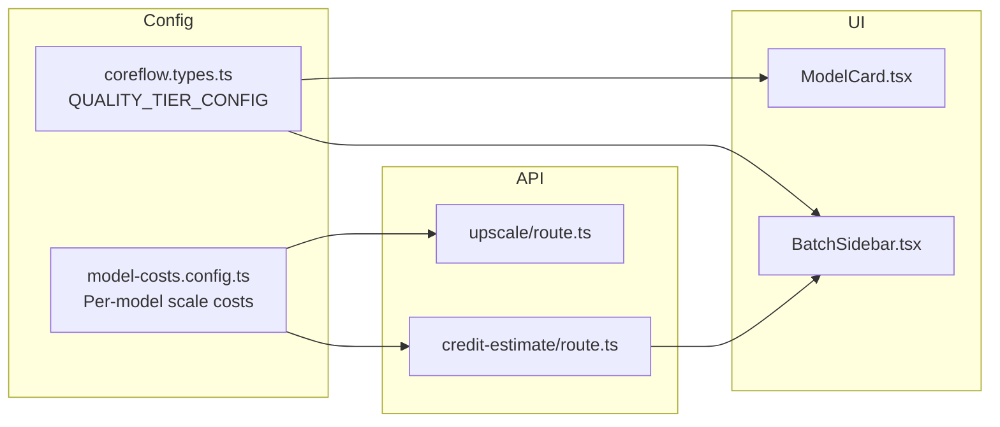
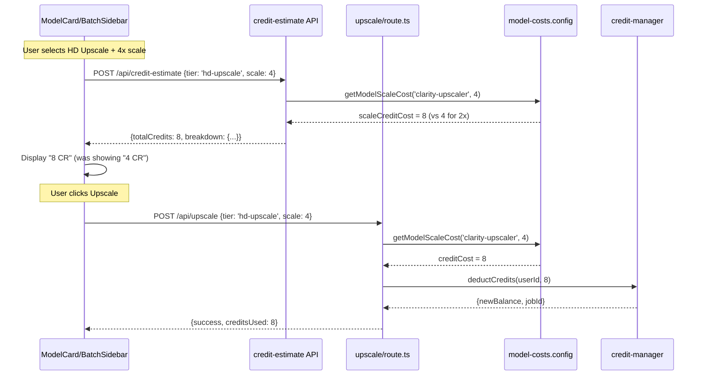

# PRD: Variable Credit Costs Per Model & Scale Factor

**Version:** 1.0
**Status:** Draft
**Date:** April 1, 2026
**Author:** Principal Architect
**Complexity:** MEDIUM (Score: 5)

---

## 1. Context

### Problem

Credit costs don't account for the actual API cost differences between scale factors. The Clarity Upscaler at 4x costs **$0.12/prediction** (billed per A100 GPU second), but the system charges the same 4 credits whether the user picks 2x ($0.017) or 4x ($0.12) — a **7x cost difference** invisible to our billing.

The `scaleMultipliers` config exists but is set to `1.0` for all scale factors, making it a no-op. Economics docs also miscalculate by assuming flat per-image costs regardless of scale.

### Files Analyzed

```
shared/config/credits.config.ts          - Model credit multipliers (no scale awareness)
shared/config/model-costs.config.ts      - Flat per-image costs (wrong for GPU-time models)
shared/config/subscription.config.ts     - scaleMultipliers all 1.0
shared/config/subscription.utils.ts      - getCreditsForTier()
shared/types/coreflow.types.ts           - QUALITY_TIER_CONFIG (flat credits per tier)
app/api/upscale/route.ts                 - Cost calculation (lines 607-623)
app/api/credit-estimate/route.ts         - Pre-calculation (line 265)
server/services/image-generation.service.ts - calculateCreditCost()
client/components/features/workspace/ModelCard.tsx - Credit display
client/components/features/workspace/BatchSidebar.tsx - Batch cost display
docs/business-model-canvas/economics/image-upscaling-models.md - Wrong cost assumptions
```

### Current Behavior

- All scale factors (2x, 4x, 8x) cost the same credits for a given tier
- `scaleMultipliers` in subscription config: `{ '2x': 1.0, '4x': 1.0, '8x': 1.0 }`
- Clarity Upscaler `hd-upscale` tier charges flat 4 credits at any scale
- Economics docs show Clarity Upscaler at "$0.017-0.035/image" — correct for 2x, wrong for 4x ($0.12)
- Real-ESRGAN is billed per-image ($0.002) so scale doesn't affect API cost — but GPU time does increase
- `MODEL_COSTS.CLARITY_UPSCALER_COST` is `0.017` — this is the 2x cost only

### Actual Replicate Costs by Model & Scale

| Model | Billing | 2x Cost | 4x Cost | Cost Ratio |
|-------|---------|---------|---------|------------|
| Real-ESRGAN | per image | $0.002 | $0.002 | 1.0x |
| GFPGAN | per second (T4) | ~$0.002 | ~$0.002 | 1.0x |
| Clarity Upscaler | per second (A100) | ~$0.017 | **~$0.12** | **7x** |
| Nano Banana Pro | per image | $0.13 | $0.13 | 1.0x |
| Flux 2 Pro | per run + per mp | ~$0.05 | N/A | N/A (no scale) |
| Qwen Image Edit | per image | $0.03 | N/A | N/A (no scale) |
| Seedream | per image | $0.04 | N/A | N/A (no scale) |
| P-Image-Edit | per image | $0.01 | N/A | N/A (no scale) |

**Key insight:** Only GPU-time-billed models (Clarity Upscaler, GFPGAN) have scale-dependent costs. Per-image-billed models have flat costs regardless of scale.

---

## 2. Solution

### Approach

1. **Replace global `scaleMultipliers` with per-model scale cost overrides** in `model-costs.config.ts` — each model declares its own cost-per-scale-factor
2. **Update `QUALITY_TIER_CONFIG`** to support `credits` as a `Record<scale, number>` OR a flat number (backward compat for enhancement-only models)
3. **Update cost calculation** in upscale route and credit-estimate API to use model-specific scale costs
4. **Update UI** (ModelCard, BatchSidebar) to display variable cost ranges when a model supports multiple scales
5. **Fix economics docs** with correct per-scale costs

### Architecture



### Key Decisions

- **Per-model scale costs over global multipliers** — models have fundamentally different billing models (per-image vs per-GPU-second). A global multiplier can't capture this.
- **Backward-compatible config shape** — tiers with no scale support (enhancement-only models) keep flat credit values. Only upscale-capable models get per-scale costs.
- **No database changes** — all configuration is in TypeScript config files, credit deduction RPC already accepts variable amounts.
- **Reuse existing `scaleMultipliers` field** — repurpose it as model-specific rather than adding a new field.

### Data Changes

None. All changes are configuration and code — no database migrations needed.

---

## 3. Sequence Flow



---

## 4. Execution Phases

### Phase 1: Per-Model Scale Cost Configuration — "Config correctly reflects actual API costs"

**Files (4):**

- `shared/config/model-costs.config.ts` — Add per-model scale cost multipliers
- `shared/config/credits.config.ts` — Add scale-aware credit constants
- `shared/types/coreflow.types.ts` — Update `QUALITY_TIER_CONFIG` credits to support per-scale values
- `shared/config/subscription.config.ts` — Remove misleading global `scaleMultipliers` (or mark deprecated)

**Implementation:**

- [ ] Add `MODEL_SCALE_COSTS` to `model-costs.config.ts` mapping each model to its per-scale API cost:
  ```typescript
  export const MODEL_SCALE_COSTS: Record<string, Record<number, number>> = {
    'real-esrgan': { 2: 0.002, 4: 0.002 },              // per-image, flat
    'gfpgan': { 2: 0.002, 4: 0.002 },                    // per-second but short runs
    'clarity-upscaler': { 2: 0.017, 4: 0.12 },           // per-second A100, huge 4x cost
    'nano-banana-pro': { 2: 0.13, 4: 0.13 },             // per-image, flat
    'realesrgan-anime': { 2: 0.0022, 4: 0.0022 },        // per-image, flat
    // Enhancement-only models (no scale): omitted
  };
  ```

- [ ] Add `MODEL_SCALE_CREDIT_MULTIPLIERS` — maps each model to per-scale credit multiplier relative to its base cost:
  ```typescript
  export const MODEL_SCALE_CREDIT_MULTIPLIERS: Record<string, Record<number, number>> = {
    'real-esrgan': { 2: 1.0, 4: 1.0 },
    'gfpgan': { 2: 1.0, 4: 1.0 },
    'clarity-upscaler': { 2: 1.0, 4: 2.0 },              // 4x costs 2x the credits
    'nano-banana-pro': { 2: 1.0, 4: 1.0 },
    'realesrgan-anime': { 2: 1.0, 4: 1.0 },
  };
  ```

- [ ] Update `QUALITY_TIER_CONFIG` credits for `hd-upscale` tier:
  ```typescript
  'hd-upscale': {
    label: 'HD Upscale',
    credits: { 2: 4, 4: 8 },  // Was flat 4 — now 4 at 2x, 8 at 4x
    // ...rest unchanged
  }
  ```

- [ ] Add helper `getCreditsForTierAtScale(tier: QualityTier, scale: number): number` to `subscription.utils.ts`

- [ ] Keep `getCreditsForTier()` backward-compatible (returns the minimum/2x cost for flat display)

**Tests Required:**

| Test File | Test Name | Assertion |
|-----------|-----------|-----------|
| `tests/unit/config/model-scale-costs.unit.spec.ts` | `should return correct API cost for clarity-upscaler at 2x` | `expect(cost).toBe(0.017)` |
| `tests/unit/config/model-scale-costs.unit.spec.ts` | `should return correct API cost for clarity-upscaler at 4x` | `expect(cost).toBe(0.12)` |
| `tests/unit/config/model-scale-costs.unit.spec.ts` | `should return flat cost for real-esrgan at any scale` | `expect(cost2x).toBe(cost4x)` |
| `tests/unit/config/model-scale-costs.unit.spec.ts` | `should return correct credit multiplier per model per scale` | `expect(getCreditsForTierAtScale('hd-upscale', 4)).toBe(8)` |
| `tests/unit/config/model-scale-costs.unit.spec.ts` | `should fall back to base credits when scale not in config` | `expect(getCreditsForTierAtScale('quick', 2)).toBe(1)` |

**User Verification:**

- Action: Import and call `getCreditsForTierAtScale('hd-upscale', 4)`
- Expected: Returns 8 (not 4)

---

### Phase 2: Update Cost Calculation in API Routes — "Correct credits deducted at processing time"

**Files (3):**

- `app/api/upscale/route.ts` — Use model-specific scale cost in credit calculation (lines 607-623)
- `app/api/credit-estimate/route.ts` — Use model-specific scale cost in pre-calculation (line 265)
- `server/services/image-generation.service.ts` — Update `calculateCreditCost()` function

**Implementation:**

- [ ] In `upscale/route.ts` (lines 607-623), replace:
  ```typescript
  // OLD: Global scale multiplier (always 1.0)
  const scaleMultiplier = creditCosts.scaleMultipliers[scaleKey] ?? 1.0;
  creditCost = Math.ceil(baseCost * scaleMultiplier) + smartAnalysisCost;
  ```
  With:
  ```typescript
  // NEW: Model-specific scale cost
  import { MODEL_SCALE_CREDIT_MULTIPLIERS } from '@shared/config/model-costs.config';

  const modelScaleMultipliers = MODEL_SCALE_CREDIT_MULTIPLIERS[resolvedModelId];
  const scaleMultiplier = modelScaleMultipliers?.[config.scale] ?? 1.0;
  creditCost = Math.ceil(baseCost * scaleMultiplier) + smartAnalysisCost;
  ```

- [ ] In `credit-estimate/route.ts` (line 253-265), replace the flat `scaleMultiplier = 1.0` with model-specific lookup:
  ```typescript
  import { MODEL_SCALE_CREDIT_MULTIPLIERS } from '@shared/config/model-costs.config';

  const modelScaleMultipliers = MODEL_SCALE_CREDIT_MULTIPLIERS[modelToUse];
  const scaleMultiplier = modelScaleMultipliers?.[validatedInput.config.scale] ?? 1.0;
  ```

- [ ] Update `calculateCreditCost()` in `image-generation.service.ts` to use model-specific multiplier

**Tests Required:**

| Test File | Test Name | Assertion |
|-----------|-----------|-----------|
| `tests/unit/api/credit-cost-calculation.unit.spec.ts` | `should charge 4 credits for hd-upscale at 2x` | `expect(cost).toBe(4)` |
| `tests/unit/api/credit-cost-calculation.unit.spec.ts` | `should charge 8 credits for hd-upscale at 4x` | `expect(cost).toBe(8)` |
| `tests/unit/api/credit-cost-calculation.unit.spec.ts` | `should charge 1 credit for quick upscale at any scale` | `expect(cost2x).toBe(cost4x)` |
| `tests/unit/api/credit-cost-calculation.unit.spec.ts` | `should add smart analysis cost on top of scale cost` | `expect(cost).toBe(8 + 1)` |
| `tests/unit/api/credit-cost-calculation.unit.spec.ts` | `should not exceed maximum cost cap` | `expect(cost).toBeLessThanOrEqual(MAX_COST)` |

**User Verification:**

- Action: `curl -X POST /api/credit-estimate -d '{"config":{"mode":"upscale","scale":4,"selectedModel":"clarity-upscaler"}}'`
- Expected: `totalCredits: 8` (was 4)

---

### Phase 3: Update UI Components — "User sees correct cost before upscaling"

**Files (3):**

- `client/components/features/workspace/ModelCard.tsx` — Show cost range (e.g., "4-8 CR") for models with variable scale costs
- `client/components/features/workspace/BatchSidebar.tsx` — Calculate batch total using selected scale
- `shared/types/coreflow.types.ts` — Export helper to get credit range for a tier

**Implementation:**

- [ ] Update ModelCard credit badge to show range when credits vary by scale:
  - For `hd-upscale`: show "4-8 CR" instead of "4 CR"
  - For `quick`: still show "1 CR" (no change)
  - Add helper: `getCreditRange(tier: QualityTier): { min: number; max: number } | number`

- [ ] Update BatchSidebar to use the currently selected scale factor when calculating per-image and total cost

- [ ] Ensure credit estimate API call in batch flow passes the correct scale factor

**Tests Required:**

| Test File | Test Name | Assertion |
|-----------|-----------|-----------|
| `tests/unit/ui/credit-display.unit.spec.ts` | `should show range for variable-cost tier` | `expect(getCreditRange('hd-upscale')).toEqual({min: 4, max: 8})` |
| `tests/unit/ui/credit-display.unit.spec.ts` | `should show flat cost for fixed-cost tier` | `expect(getCreditRange('quick')).toBe(1)` |
| `tests/unit/ui/credit-display.unit.spec.ts` | `should show flat cost for enhancement-only tier` | `expect(getCreditRange('face-pro')).toBe(6)` |

**User Verification:**

- Action: Open workspace, select HD Upscale model card
- Expected: Badge shows "4-8 CR" instead of "4 CR". Selecting 4x scale shows "8 CR" in batch sidebar.

---

### Phase 4: Fix Economics Documentation — "Docs reflect reality"

**Files (2):**

- `docs/business-model-canvas/economics/image-upscaling-models.md` — Update Clarity Upscaler costs with per-scale breakdown
- `docs/audits/pricing-strategy-economics-audit.md` — Update unit economics with scale-aware costs

**Implementation:**

- [ ] Update `image-upscaling-models.md` Clarity Upscaler entry:
  - Was: `$0.001150/second (~$0.017-0.035/image)`
  - Should be: `$0.001150/second (~$0.017/image at 2x, ~$0.12/image at 4x)`

- [ ] Add a "Per-Scale Cost Breakdown" table:
  ```markdown
  | Model | 2x Cost | 4x Cost | Credits (2x) | Credits (4x) |
  |-------|---------|---------|--------------|--------------|
  | Real-ESRGAN | $0.002 | $0.002 | 1 | 1 |
  | Clarity Upscaler | $0.017 | $0.12 | 4 | 8 |
  ```

- [ ] Update unit economics calculations to show worst-case (4x Clarity) and best-case (2x Real-ESRGAN) margins

- [ ] Update the pricing audit to note that scale-aware pricing mitigates the "negative margin at full utilization" issue for the Clarity Upscaler tier

**Tests Required:**

N/A — documentation only. Reviewed manually.

**User Verification:**

- Action: Read updated docs
- Expected: Clarity Upscaler 4x cost shown as $0.12, not $0.017-0.035

---

## 5. Acceptance Criteria

- [ ] All phases complete
- [ ] All specified tests pass
- [ ] `yarn verify` passes
- [ ] All automated checkpoint reviews passed
- [ ] Clarity Upscaler 4x upscale charges 8 credits (was 4)
- [ ] Clarity Upscaler 2x upscale still charges 4 credits
- [ ] Real-ESRGAN costs unchanged at any scale
- [ ] ModelCard shows credit range for variable-cost tiers
- [ ] BatchSidebar reflects actual cost for selected scale
- [ ] Economics docs accurately reflect per-scale costs
- [ ] Credit estimate API returns correct cost for model+scale combos
- [ ] No regressions in existing credit flows

---

## 6. Margin Analysis (Post-Implementation)

### HD Upscale Tier (Clarity Upscaler) — Current vs Proposed

**At 2x scale (unchanged):**
```
Credits charged: 4
API cost: $0.017
Credit value at Pro ($49/1000): $0.196
Margin: 91.3% ✅
```

**At 4x scale — BEFORE (broken):**
```
Credits charged: 4
API cost: $0.12
Credit value at Pro ($49/1000): $0.196
Margin: 38.8% ⚠️ (dangerously low)
```

**At 4x scale — AFTER (fixed):**
```
Credits charged: 8
API cost: $0.12
Credit value at Pro ($49/1000): $0.392
Margin: 69.4% ✅ (healthy)
```

### Impact on Plans (100% usage, worst case: all 4x Clarity Upscaler)

| Plan | Revenue | Before (4 CR) | After (8 CR) | Before Margin | After Margin |
|------|---------|---------------|--------------|---------------|--------------|
| Starter ($9, 100 CR) | $9 | 25 imgs × $0.12 = $3.00 | 12 imgs × $0.12 = $1.44 | 66.7% | 84.0% |
| Hobby ($19, 200 CR) | $19 | 50 imgs × $0.12 = $6.00 | 25 imgs × $0.12 = $3.00 | 68.4% | 84.2% |
| Pro ($49, 1000 CR) | $49 | 250 imgs × $0.12 = $30.00 | 125 imgs × $0.12 = $15.00 | 38.8% | 69.4% |
| Business ($149, 5000 CR) | $149 | 1250 imgs × $0.12 = $150 | 625 imgs × $0.12 = $75 | **-0.7%** ❌ | 49.7% ✅ |

**Business plan goes from slightly negative to ~50% margin.** This is the most critical fix.

---

## 7. Integration Points Checklist

```markdown
**How will this feature be reached?**
- [x] Entry point: Existing upscale flow (POST /api/upscale)
- [x] Caller file: app/api/upscale/route.ts (line 608-623) already calls getCreditsForTier
- [x] Registration/wiring: Swap from global scaleMultipliers to model-specific lookup

**Is this user-facing?**
- [x] YES → ModelCard shows credit range, BatchSidebar shows scale-aware cost

**Full user flow:**
1. User selects HD Upscale tier + 4x scale
2. ModelCard shows "4-8 CR" range, BatchSidebar shows "8 CR" for 4x
3. User clicks Upscale
4. API calculates 8 credits (4 base × 2.0 scale multiplier for clarity-upscaler at 4x)
5. 8 credits deducted, image processed
6. Response shows creditsUsed: 8
```

---

*See also: [Pricing Strategy Audit](../audits/pricing-strategy-economics-audit.md), [Image Upscaling Models](../business-model-canvas/economics/image-upscaling-models.md)*
