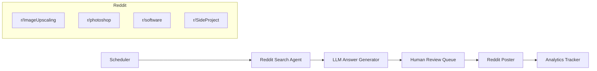
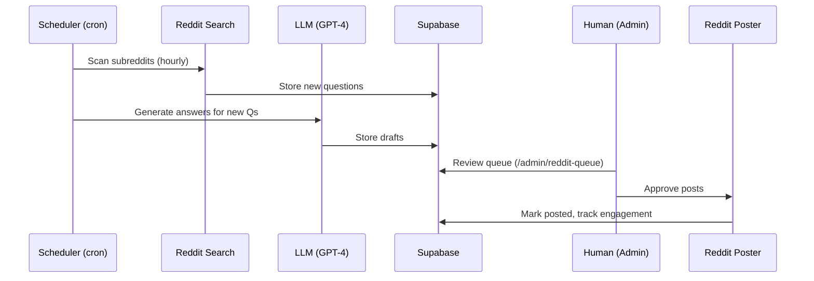

# PRD: PA-56 - SEO Agent + Reddit Question/Edit Strategy for Organic Traffic

**Project:** MyImageUpscaler.com
**Ticket ID:** t-1769845425388-oz863jz7w
**Created:** February 2, 2026
**Complexity:** 7 → HIGH mode (mandatory checkpoints)

---

## 1. Context

**Problem:** MIU has minimal traffic due to indexing issues (BLOCKER). Need an automated system to find relevant Reddit questions and post helpful answers with natural MIU mentions.

**Files Analyzed:**
- `/home/joao/projects/myimageupscaler.com/` - Project structure
- `MEMORY.md` - MIU context (Next.js 15, pSEO system, multi-language)
- `~/clawd/skills/reddit-lead-hunt/SKILL.md` - Reddit posting skill
- `~/clawd/skills/reddit/SKILL.md` - Reddit search skill
- `~/clawd/skills/humanizer/SKILL.md` - Writing style guidelines

**Current Behavior:**
- MIU launched Jan 2026, minimal traffic
- pSEO system exists: 8 categories (tools, formats, scale, use-cases, compare, alternatives, guides, free)
- Multi-language: EN, DE, JA, etc.
- No active Reddit/Quora strategy

---

## 2. Solution

**Approach:**
1. Build automated agent to scan relevant subreddits for image upscaling questions
2. Generate helpful, non-promotional answers using GPT-4
3. Post answers with natural MIU mentions (not spam)
4. Track engagement and refine strategy
5. Expand to Quora after Reddit validation

**Architecture:**

**Key Decisions:**
- **Language:** TypeScript + OpenRouter API (already has key)
- **Storage:** Supabase (existing) for leads, questions, answers
- **Queue:** Human review before posting (avoid spam bans)
- **Rate limiting:** 1-2 posts/day maximum (Reddit spam prevention)
- **Subreddits:** r/ImageUpscaling, r/photoshop, r/software, r/SideProject, r/SaaS

**Data Changes:**
- New Supabase tables: `reddit_questions`, `reddit_answers`, `reddit_posts`
- New Next.js admin page: /admin/reddit-queue (review pending posts)

---

## 3. Sequence Flow

---

## 4. Execution Phases

### Phase 1: Supabase Schema & Backend Setup - Store questions and answers

**Files:**
- `supabase/migrations/20260202_reddit_tables.sql` - New tables
- `src/lib/db/reddit.ts` - Database queries
- `src/types/reddit.ts` - TypeScript types

**Implementation:**
- [ ] Create `reddit_questions` table (id, subreddit, title, url, posted_at, answered_at)
- [ ] Create `reddit_answers` table (id, question_id, draft_content, status, posted_at)
- [ ] Create `reddit_posts` table (id, answer_id, reddit_post_id, score, comments)
- [ ] Add RLS policies (authenticated only for write, public for read)
- [ ] Create TypeScript types matching schema

**Tests Required:**
| Test File | Test Name | Assertion |
|-----------|-----------|-----------|
| `tests/unit/reddit-db.spec.ts` | `should insert question` | `expect(result.id).toBeDefined()` |
| `tests/unit/reddit-db.spec.ts` | `should fetch unanswered questions` | `expect(questions.length).toBe(5)` |
| `tests/unit/reddit-db.spec.ts` | `should update answer status` | `expect(answer.status).toBe('posted')` |

**User Verification:**
- Action: Run migration, check Supabase table editor
- Expected: 3 new tables exist with correct columns

**Checkpoint (automated + manual):**
- Run: `yarn test tests/unit/reddit-db.spec.ts`
- Check: Supabase dashboard shows tables
- Manual: [ ] Tables visible in Supabase, [ ] RLS policies active

---

### Phase 2: Reddit Search Integration - Find relevant questions

**Files:**
- `src/lib/reddit/search.ts` - Reddit API wrapper (using reddit skill)
- `src/jobs/reddit-scraper.ts` - Background job to scan subreddits
- `src/app/api/cron/reddit-scan/route.ts` - Cron endpoint

**Implementation:**
- [ ] Implement Reddit search (no API key needed, per skill)
- [ ] Target subreddits: r/ImageUpscaling, r/photoshop, r/software, r/SideProject
- [ ] Search keywords: "upscale image", "increase resolution", "image quality", "ai upscaler"
- [ ] Deduplicate by URL
- [ ] Store new questions in Supabase
- [ ] Rate limit: 1 request per 2 seconds (Reddit guidelines)

**Tests Required:**
| Test File | Test Name | Assertion |
|-----------|-----------|-----------|
| `tests/integration/reddit-search.spec.ts` | `should find relevant questions` | `expect(questions.length).toBeGreaterThan(0)` |
| `tests/integration/reddit-search.spec.ts` | `should deduplicate URLs` | `expect(urls.length).toBe(new Set(urls).size)` |
| `tests/integration/reddit-search.spec.ts` | `should store in database` | `expect(dbQuestions.length).toBe(5)` |

**User Verification:**
- Action: Trigger manual scan, check Supabase `reddit_questions` table
- Expected: 10+ new questions from target subreddits

**Checkpoint (automated only):**
- Run: `yarn test tests/integration/reddit-search.spec.ts`
- Run: `curl -X POST http://localhost:3000/api/cron/reddit-scan`
- Check: Supabase has new rows

---

### Phase 3: LLM Answer Generation - Draft helpful responses

**Files:**
- `src/lib/llm/reddit-answerer.ts` - OpenRouter integration
- `src/prompts/reddit-answer.ts` - Prompt templates
- `src/jobs/generate-answers.ts` - Background job

**Implementation:**
- [ ] Use OpenRouter API (MIU already has key)
- [ ] Create prompt template (helpful first, mention MIU naturally)
- [ ] Include subreddit context (r/photoshop vs r/SideProject = different tone)
- [ ] Generate 3 answer variations per question
- [ ] Store drafts in `reddit_answers` table (status='draft')
- [ ] Apply humanizer principles (no promotional fluff)

**Tests Required:**
| Test File | Test Name | Assertion |
|-----------|-----------|-----------|
| `tests/unit/answer-generator.spec.ts` | `should generate helpful answer` | `expect(answer).toContain('helpful')` |
| `tests/unit/answer-generator.spec.ts` | `should mention MIU naturally` | `expect(answer).toMatch(/myimageupscaler/i)` |
| `tests/unit/answer-generator.spec.ts` | `should avoid promotional language` | `expect(answer).not.toMatch(/best.*ever/i)` |

**User Verification:**
- Action: Manually trigger answer generation, review drafts
- Expected: Answers sound helpful, not spammy

**Checkpoint (automated + manual):**
- Run: `yarn test tests/unit/answer-generator.spec.ts`
- Check: Review 5 sample answers in Supabase
- Manual: [ ] 5 answers reviewed, [ ] All pass human check

---

### Phase 4: Admin Queue Page - Human review before posting

**Files:**
- `src/app/admin/reddit-queue/page.tsx` - Review interface
- `src/components/reddit/AnswerCard.tsx` - Answer display
- `src/app/api/reddit/approve/route.ts` - Approval endpoint

**Implementation:**
- [ ] Create admin page (protected route)
- [ ] List pending answers with question context
- [ ] Show subreddit, question title, draft answer
- [ ] Edit button (tweak answer before posting)
- [ ] Approve/Reject buttons
- [ ] Batch approve (select multiple)
- [ ] Show posted answers with engagement stats

**Tests Required:**
| Test File | Test Name | Assertion |
|-----------|-----------|-----------|
| `tests/e2e/admin-queue.spec.ts` | `should display pending answers` | `expect(page.locator('.answer-card').count()).toBe(5)` |
| `tests/e2e/admin-queue.spec.ts` | `should approve answer` | `await page.click('.approve'); expect(status).toBe('posted')` |
| `tests/e2e/admin-queue.spec.ts` | `should edit answer` | `await page.fill('textarea', 'new text'); expect(saved).toBe(true)` |

**User Verification:**
- Action: Visit /admin/reddit-queue, approve 1 answer
- Expected: Answer status changes to 'posted', appears on Reddit

**Checkpoint (automated + manual):**
- Run: `yarn playwright test tests/e2e/admin-queue.spec.ts`
- Manual: [ ] Navigate to /admin/reddit-queue, [ ] Approve test answer, [ ] Verify Reddit post

---

### Phase 5: Reddit Poster Integration - Publish approved answers

**Files:**
- `src/lib/reddit/poster.ts` - Reddit API poster (auth required)
- `src/app/api/reddit/post/route.ts` - Post endpoint
- `src/jobs/post-answers.ts` - Batch poster

**Implementation:**
- [ ] Implement Reddit OAuth (or use existing reddit skill approach)
- [ ] Post comment to Reddit thread
- [ ] Store Reddit post ID in `reddit_posts` table
- [ ] Update answer status to 'posted'
- [ ] Error handling (rate limits, deleted threads)
- [ ] Retry logic (failed posts)

**Tests Required:**
| Test File | Test Name | Assertion |
|-----------|-----------|-----------|
| `tests/integration/reddit-poster.spec.ts` | `should post comment` | `expect(redditId).toMatch(/^[a-z0-9]+$/)` |
| `tests/integration/reddit-poster.spec.ts` | `should handle rate limit` | `expect(error).toBe('rate_limited')` |
| `tests/integration/reddit-poster.spec.ts` | `should update database` | `expect(answer.status).toBe('posted')` |

**User Verification:**
- Action: Approve 1 answer in admin queue, check Reddit
- Expected: Comment appears under target post

**Checkpoint (automated + manual):**
- Run: `yarn test tests/integration/reddit-poster.spec.ts`
- Manual: [ ] Approve answer in queue, [ ] Find comment on Reddit, [ ] Verify it's not spammy

---

### Phase 6: Analytics & Refinement - Track what works

**Files:**
- `src/app/admin/reddit-analytics/page.tsx` - Analytics dashboard
- `src/jobs/score-fetcher.ts` - Fetch comment scores hourly
- `src/lib/analytics/reddit.ts` - Engagement metrics

**Implementation:**
- [ ] Fetch comment scores (upvotes) hourly
- [ ] Track replies to comments
- [ ] Calculate best/worst performing answers
- [ ] Show top subreddits by engagement
- [ ] Export to CSV for analysis
- [ ] A/B test: different answer styles

**Tests Required:**
| Test File | Test Name | Assertion |
|-----------|-----------|-----------|
| `tests/unit/analytics.spec.ts` | `should calculate engagement rate` | `expect(rate).toBe(0.15)` |
| `tests/unit/analytics.spec.ts` | `should rank answers by score` | `expect(top[0].score).toBeGreaterThan(top[1].score)` |

**User Verification:**
- Action: Visit /admin/reddit-analytics after 1 week
- Expected: See engagement data, top posts, trends

**Checkpoint (automated only):**
- Run: `yarn test tests/unit/analytics.spec.ts`
- Check: Analytics page loads with data

---

### Phase 7: Expansion to Quora - Apply learnings

**Files:**
- `src/lib/quora/search.ts` - Quora search (similar to Reddit)
- `src/app/admin/quora-queue/page.tsx` - Quora review queue

**Implementation:**
- [ ] Duplicate Reddit flow for Quora
- [ ] Adjust prompts for Quora format (longer answers allowed)
- [ ] Target topics: Image upscaling, AI tools, photo editing
- [ ] Unified queue (Reddit + Quora in one view)
- [ ] Platform-specific optimization

**Tests Required:**
| Test File | Test Name | Assertion |
|-----------|-----------|-----------|
| `tests/integration/quora-search.spec.ts` | `should find relevant questions` | `expect(questions.length).toBeGreaterThan(0)` |

**User Verification:**
- Action: Check unified queue has both Reddit and Quora questions
- Expected: Both platforms working

**Checkpoint (automated only):**
- Run: `yarn test tests/integration/quora-search.spec.ts`

---

## 5. Verification Strategy

### Evidence Required

**Phase 1 (Schema):**
- [ ] Migration runs without error
- [ ] 3 tables created in Supabase
- [ ] RLS policies active
- [ ] TypeScript types match schema

**Phase 2 (Search):**
- [ ] Cron job finds 10+ questions/day
- [ ] Questions stored in Supabase
- [ ] No duplicates (URL unique constraint)
- [ ] Rate limiting respected

**Phase 3 (LLM):**
- [ ] Answers generated for new questions
- [ ] Answers sound human (humanized)
- [ ] MIU mentioned naturally (not forced)
- [ ] 3 variations per question

**Phase 4 (Admin):**
- [ ] Admin page loads (< 2s)
- [ ] Can approve/reject answers
- [ ] Can edit before posting
- [ ] Auth protection works

**Phase 5 (Poster):**
- [ ] Comments post to Reddit successfully
- [ ] Reddit post IDs stored
- [ ] Error handling works (deleted threads)
- [ ] No spam bans (rate limiting)

**Phase 6 (Analytics):**
- [ ] Scores update hourly
- [ ] Top performers identified
- [ ] Export works

**Phase 7 (Quora):**
- [ ] Quora questions found
- [ ] Unified queue shows both platforms

---

## 6. Acceptance Criteria

- [ ] Supabase tables created with RLS
- [ ] Reddit search finds 10+ relevant questions/day
- [ ] LLM generates helpful, non-promotional answers
- [ ] Admin queue for human review exists
- [ ] Reddit posting works (comments appear)
- [ ] Analytics track engagement
- [ ] No spam bans (rate limited, human-reviewed)
- [ ] Quora integration working
- [ ] All tests passing (`yarn test`)
- [ ] E2E tests passing (`yarn playwright test`)
- [ ] `yarn verify` passes

---

## 7. Success Metrics

**Week 1-2:**
- 10+ questions found/day
- 20+ answers generated
- 5+ posted (after review)

**Week 3-4:**
- 50+ total posts
- 10+ upvotes across posts
- 0 spam bans

**Month 2-3:**
- 100+ total posts
- 50+ upvotes
- Referral traffic from Reddit (GA4 events)
- Improved organic rankings (track via GSC)

---

## 8. Next Steps After Validation

Once Reddit/Quora is working:
1. Add more platforms (Stack Overflow, Hacker News)
2. Auto-approve high-confidence answers (> 90% score)
3. A/B test different answer styles
4. Expand to other languages (DE, JA, ES)
