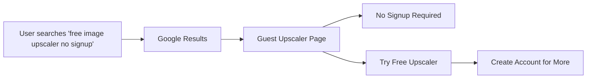

# PRD: Guest Upscaler pSEO Pages

**Ticket:** [PRD] Guest upscaler pSEO pages
**Impact:** High (SEO)
**Effort:** 5 SP
**Status:** TODO
**Date:** February 2, 2026

---

## Complexity Assessment

```
COMPLEXITY SCORE:
+1  Touches 1-5 files (new pSEO routes, content)
+1  New system/module from scratch (guest upscaler pSEO pages)
+0  Database schema changes (content only)
---
Total: 2 → LOW complexity
```

---

## 1. Context

**Problem:** MIU is missing pSEO pages targeting "guest upscaler" keywords — users who want to upscale images without creating an account. These are high-intent searches (e.g., "free image upscaler no signup", "ai photo upscaler without registration") that can drive organic traffic and funnel users into the free tier.

**Files Analyzed:**
- `/app/(pseo)/tools/[slug]/page.tsx` - Existing dynamic tool route
- `/lib/seo/data-loader.ts` - Tool data loader
- `/lib/seo/pseo-types.ts` - pSEO type definitions
- `/lib/seo/keyword-mappings.ts` - Keyword mappings

**Current Behavior:**
- MIU has tool pages for upscaling, compression, etc.
- No guest-specific landing pages emphasizing "no signup required"
- "Free upscaler" keywords are underserved
- Users must sign up to upscale — friction for casual users

---

## 2. Solution

**Approach:**
1. Create pSEO pages targeting guest/free upscaler keywords
2. Emphasize "no signup required" and "free" value props
3. Build pages for different use cases (one-click, batch, specific formats)
4. Add strong CTAs to convert guests to free tier users
5. Include upsell messaging to paid tiers

**Architecture Diagram:**



**Key Decisions:**
- **Guest-first messaging:** Lead with "no signup required" → lower friction
- **Free tier gateway:** Use these pages to funnel users into free tier
- **Multiple angles:** Different pages for different user intents
- **Upsell strategy:** Show value, then prompt for account (more credits, features)
- **Multi-language:** Support EN, DE, JA, and other MIU languages

**Data Changes:**
- New file: `/lib/seo/guest-upscaler-data.ts` - Guest upscaler page metadata
- Update: `/lib/seo/data-loader.ts` - Add guest upscaler loader
- No database changes (content is static/i18n)

---

## 3. Integration Points

**How will this feature be reached?**

- [x] Entry point: Organic search traffic to `/guest-upscaler/*` or `/tools/free-upscaler`
- [x] Internal linking: Link from homepage, pricing page
- [x] Sitemap: Add to `sitemap-tools.xml`

**Is this user-facing?**

- [x] YES → Public SEO pages for organic traffic

**Full user flow:**

1. User searches "free image upscaler no signup"
2. Google displays MIU guest upscaler page
3. User clicks and lands on page emphasizing "no signup required"
4. User sees demo/preview of upscaling quality
5. User clicks "Try Free Upscaler" (guest mode)
6. User upscales 1-3 images as guest (no account)
7. CTA: "Create account for 5 free credits/month"
8. User converts to free tier signup

---

## 4. Page Definitions

### Page 1: Free Image Upscaler (Primary)

**URL:** `/tools/free-image-upscaler`
**Slug:** `free-image-upscaler`

**Target Keywords:**
- Primary: "free image upscaler", "ai photo upscaler free"
- Secondary: "upscale image without signup", "no registration upscaler"
- Long-tail: "free online image upscaler no account", "ai image upscaler free online"

**Content Sections:**
1. **Hero** - "Upscale Images for Free — No Sign Up Required"
2. **Features** - Free tier benefits, quality, speed
3. **How It Works** - 3-step process (upload → upscale → download)
4. **Comparison** - Free vs paid tiers
5. **FAQ** - "Is it really free?", "Do I need an account?", "What's the catch?"
6. **CTA** - "Try Free Upscaler" → guest mode → upsell to account

### Page 2: One-Click Upscaler

**URL:** `/tools/one-click-upscaler`
**Slug:** `one-click-upscaler`

**Target Keywords:**
- Primary: "one click image upscaler", "instant photo upscaler"
- Secondary: "easy image upscaler", "simple ai upscaler"
- Long-tail: "upscale image in one click free"

**Content Sections:**
1. **Hero** - "One-Click AI Upscaling — Instant Results"
2. **Features** - Speed, simplicity, no settings needed
3. **Use Cases** - Quick enhancements, social media prep
4. **Comparison** - One-click vs advanced modes
5. **FAQ** - Quality questions, format support

### Page 3: No-Signup Upscaler (Landing Page)

**URL:** `/guest-upscaler`
**Slug:** `guest-upscaler`

**Target Keywords:**
- Primary: "image upscaler no signup", "ai upscaler without account"
- Secondary: "guest upscaler", "anonymous upscaler"
- Long-tail: "upscale image without creating account"

**Content Sections:**
1. **Hero** - "Upscale Images Instantly — No Account Needed"
2. **Privacy** - "We don't require your email"
3. **Features** - What you can do as guest
4. **Why Sign Up** - Benefits of account (more credits, history)
5. **CTA** - Start as guest or create account

---

## 5. SEO Specifications

### Meta Tags (Free Image Upscaler)
```html
<title>Free AI Image Upscaler | No Sign Up Required | MyImageUpscaler</title>
<meta name="description" content="Upsscale images instantly with AI — no signup required. Free online upscaler with 4x enhancement. Supports JPG, PNG, WebP. Try it now!" />
<meta name="keywords" content="free image upscaler, ai photo upscaler free, upscale image without signup, no registration upscaler, free online image upscaler" />
```

### Schema Markup
```json
{
  "@context": "https://schema.org",
  "@type": "SoftwareApplication",
  "name": "Free AI Image Upscaler",
  "applicationCategory": "MultimediaApplication",
  "operatingSystem": "Web Browser",
  "offers": {
    "@type": "Offer",
    "price": "0",
    "priceCurrency": "USD"
  },
  "featureList": ["AI upscaling", "No signup required", "4x enhancement", "Free tier"]
}
```

### Internationalization
- Support all MIU languages: EN, DE, FR, JA, PT, ES, IT, ZH
- URL pattern: `/[locale]/tools/free-image-upscaler`
- Hreflang tags for all language variants

---

## 6. Execution Phases

### Phase 1: Data & Route Setup

**Files (max 5):**
- `/lib/seo/guest-upscaler-data.ts` - Guest upscaler metadata
- `/lib/seo/data-loader.ts` - Add `getGuestUpscalerPages()` function
- `/lib/seo/pseo-types.ts` - Add `GuestUpscalerPage` type (if needed)
- `/app/(pseo)/tools/free-image-upscaler/page.tsx` - Primary page route

**Implementation:**

- [ ] Create `GuestUpscalerPage` interface (slug, title, keywords, content)
- [ ] Define 3 guest upscaler pages in data file
- [ ] Create data loader function
- [ ] Set up dynamic route for `/tools/free-image-upscaler`
- [ ] Add generateMetadata for SEO
- [ ] Add generateStaticParams for ISR

**Tests Required:**
| Test File | Test Name | Assertion |
|-----------|-----------|-----------|
| `tests/unit/guest-upscaler-data.spec.ts` | `should load guest upscaler pages` | `expect(getGuestUpscalerPages()).toHaveLength(3)` |
| `tests/unit/guest-upscaler-data.spec.ts` | `should include target keywords` | `expect(page.keywords).toContain('free image upscaler')` |

**User Verification:**
- Action: Visit `/tools/free-image-upscaler`
- Expected: Page loads, displays content, no console errors

---

### Phase 2: Content Creation

**Files (max 5):**
- `/lib/seo/guest-upscaler-content.ts` - Content for each page
- `/app/(pseo)/tools/[slug]/page.tsx` - Update to use guest upscaler data

**Implementation:**

- [ ] Write content for "Free Image Upscaler" page (all sections)
- [ ] Write content for "One-Click Upscaler" page
- [ ] Write content for "No-Signup Upscaler" landing page
- [ ] Add FAQ sections (5-8 questions each)
- [ ] Include upsell messaging to free/paid tiers
- [ ] Add i18n translations for DE, JA (others later)

**Tests Required:**
| Test File | Test Name | Assertion |
|-----------|-----------|-----------|
| `tests/unit/guest-upscaler-content.spec.ts` | `should return content for all locales` | `expect(getGuestUpscalerContent('en')).toBeDefined()` |
| `tests/unit/guest-upscaler-content.spec.ts` | `should include keywords naturally` | `expect(content).toContain('free image upscaler')` |

**User Verification:**
- Action: Visit each guest upscaler page
- Expected: All content sections render, FAQs display

---

### Phase 3: Guest Mode Integration

**Files (max 5):**
- `/app/(pseo)/tools/free-image-upscaler/page.tsx` - Add guest upscaler component
- `/client/components/upscaler/GuestUpscaler.tsx` - Create guest upscaler component
- `/app/api/upscale/guest/route.ts` - API route for guest upscaling (if needed)

**Implementation:**

- [ ] Create `GuestUpscaler` component (upload, upscale, download flow)
- [ ] Limit guest usage to 1-3 images (enforce on backend)
- [ ] Add CTA: "Create account for 5 free credits/month"
- [ ] Track guest upscaling events (analytics)
- [ ] Add error handling for rate limits

**Tests Required:**
| Test File | Test Name | Assertion |
|-----------|-----------|-----------|
| `tests/e2e/guest-upscaler.spec.ts` | `should upscale as guest` | `await page.locator('[data-testid="upscale-result"]').isVisible()` |
| `tests/e2e/guest-upscaler.spec.ts` | `should show signup CTA after limit` | `await page.locator('text=/create account/i').isVisible()` |

**User Verification:**
- Action: Upscale 1 image as guest
- Expected: Upscale completes, download works, CTA appears

---

### Phase 4: Internal Linking & Sitemap

**Files (max 5):**
- `/app/page.tsx` - Add guest upscaler links to homepage
- `/app/(pseo)/pricing/page.tsx` - Link from pricing page
- `/app/sitemap-tools.xml/route.ts` - Add guest upscaler URLs

**Implementation:**

- [ ] Add "Try Free Upscaler" link to homepage hero
- [ ] Add link from pricing page (guest option)
- [ ] Add guest upscaler URLs to sitemap
- [ ] Add hreflang links for all languages
- [ ] Verify anchor text uses target keywords

**Tests Required:**
| Test File | Test Name | Assertion |
|-----------|-----------|-----------|
| `tests/e2e/internal-links.spec.ts` | `should link to free upscaler from home` | `await page.locator('a[href*="free-image-upscaler"]').count() > 0` |

**User Verification:**
- Action: Navigate homepage → click free upscaler link
- Expected: Lands on free upscaler page

---

## 7. Verification Strategy

### Automated Verification

**Unit Tests:**
- Guest upscaler data loads correctly
- Content returns for all locales
- Keywords included in content
- Guest mode enforces limits

**E2E Tests:**
- Pages load without errors
- Guest upscaler component works
- Upscaling completes successfully
- CTA appears after limit
- Internal links work

**curl Proof:**
```bash
# Verify page loads
curl -s https://myimageupscaler.com/tools/free-image-upscaler | grep -o "<title>.*</title>"

# Expected: <title>Free AI Image Upscaler | No Sign Up Required | MyImageUpscaler</title>
```

### Manual Verification

1. **Content Quality:**
   - [ ] All sections present and complete
   - [ ] Grammar and spelling correct
   - [ ] Keywords naturally integrated
   - [ ] Upsell messaging is clear but not pushy

2. **SEO Checklist:**
   - [ ] Meta titles < 60 chars
   - [ ] Meta descriptions 150-160 chars
   - [ ] H1 tags present and match intent
   - [ ] Schema markup valid (Google Rich Results Test)
   - [ ] Hreflang tags present for all languages

3. **User Experience:**
   - [ ] Pages load < 2 seconds
   - [ ] Mobile responsive
   - [ ] Guest upscaling works smoothly
   - [ ] CTA to signup is prominent
   - [ ] Rate limiting works but isn't annoying

4. **Guest Mode:**
   - [ ] Can upscale 1 image without account
   - [ ] Download works for guest upscales
   - [ ] After limit, signup CTA appears
   - [ ] No forced redirects to login

---

## 8. Acceptance Criteria

- [ ] All 3 guest upscaler pages created with content
- [ ] Guest upscaler component functional (upload → upscale → download)
- [ ] Guest usage limited to 1-3 images
- [ ] Signup CTA appears after guest limit
- [ ] Target keywords included naturally
- [ ] Schema markup present and valid
- [ ] Internal links from homepage and pricing
- [ ] Sitemap includes guest upscaler URLs
- [ ] Hreflang tags for all languages
- [ ] All tests passing (unit + E2E)
- [ ] `yarn verify` passes (lint, type check)
- [ ] Google Rich Results Test passes
- [ ] Guest mode flow works end-to-end

---

## 9. Success Metrics

**SEO Metrics (measure 30 days after launch):**
- Avg position for "free image upscaler": target top 20
- Avg position for "ai upscaler no signup": target top 20
- Click-through rate: target > 5%
- Impressions: track baseline and growth

**User Metrics:**
- Guest upscaler conversion rate (guest → signup): target > 15%
- Guest upscaler usage: track volume
- Bounce rate: < 70%
- Time on page: > 1.5 minutes

**Funnel Metrics:**
- Guest upscaler page views → upscales attempted
- Upscales completed → signup conversions
- Signup → paid tier conversion (existing metric)

---

## 10. Notes

- **Guest funnel strategy:** Use these pages to capture users who aren't ready to commit
- **Competitor angle:** Many upscalers require signup immediately — differentiate with "no signup required"
- **Quality over quantity:** 3 well-targeted pages > 10 generic pages
- **International:** Start with EN + DE + JA (top MIU languages), expand later
- **Upsell timing:** Show value first (guest upscale), then prompt for account
- **Privacy angle:** "No email required" can be a selling point for privacy-conscious users
- After launch, monitor which page performs best and double down on that angle
