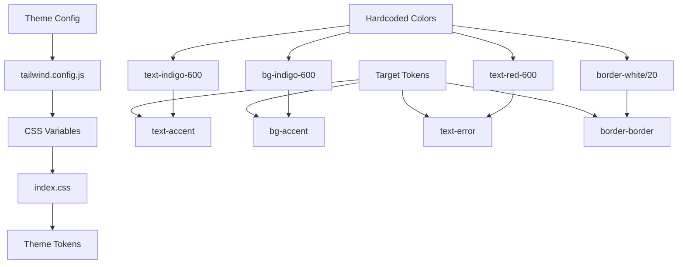
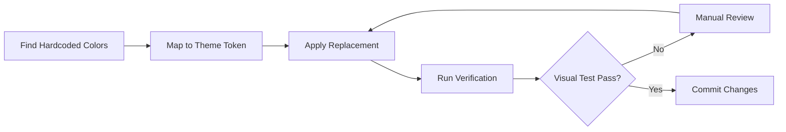

# Tailwind Theme Compliance Fix - Implementation Plan

🧠 **Principal Architect Mode: Engaged. Analyzing codebase constraints...**

---

## 1. Context Analysis

### 1.1 Files Analyzed

| File                                         | Purpose                                            |
| -------------------------------------------- | -------------------------------------------------- |
| `tailwind.config.js`                         | Theme token definitions and CSS variable mappings  |
| `client/styles/index.css`                    | CSS custom properties (color tokens in RGB format) |
| `app/**/*.tsx` (38+ files)                   | App Router pages with 90+ violations               |
| `client/components/**/*.tsx` (200+ files)    | React components with 200+ violations              |
| `app/(pseo)/_components/**/*.tsx` (23 files) | pSEO UI components with 24 violations              |

### 1.2 Component & Dependency Overview



### 1.3 Current Behavior Summary

- **Theme System**: Uses CSS custom properties (RGB format) for theming
- **Token Mapping**: `indigo-600` → should use `accent`, `red-600` → should use `error`, etc.
- **Problem**: 310+ instances of hardcoded Tailwind color utilities instead of semantic tokens
- **Impact**: Theme switching is broken, dark mode inconsistencies, maintenance overhead

### 1.4 Problem Statement

The codebase contains 310+ instances of hardcoded Tailwind color utilities (e.g., `text-indigo-600`, `bg-red-500`, `border-white/20`) that bypass the semantic theme system, making theme maintenance inconsistent and breaking the designed theming architecture.

---

## 2. Proposed Solution

### 2.1 Architecture Summary

- **Token-Based Replacement**: Create a deterministic mapping from hardcoded colors to semantic theme tokens
- **Pattern Matching**: Use regex-based find/replace with manual verification for edge cases
- **Parallel Execution**: Divide codebase by directory for independent parallel work
- **Validation**: Post-fix visual testing with Playwright to catch regressions

**Alternative Considered & Rejected**:

- _Automated codemod_: Too risky given the scale and potential for false positives
- _Complete theme redesign_: Out of scope; existing tokens are sufficient
- _Adding legacy color aliases_: Would perpetuate technical debt

### 2.2 Architecture Diagram



### 2.3 Key Technical Decisions

| Decision                            | Rationale                                             |
| ----------------------------------- | ----------------------------------------------------- |
| **Manual replacement**              | Ensures correctness; automation risks breaking intent |
| **Directory-based parallelization** | Enables multiple engineers to work simultaneously     |
| **Playwright validation**           | Catches visual regressions automatically              |
| **No new tokens**                   | Existing theme tokens cover all use cases             |
| **Batch by color pattern**          | Efficient for systematic replacement                  |

### 2.4 Data Model Changes

**No Data Changes.** This is purely a UI styling change.

---

## 3. Detailed Implementation Spec

### Color Mapping Reference

| Hardcoded Pattern        | Replace With            | Notes                  |
| ------------------------ | ----------------------- | ---------------------- |
| `text-indigo-600`        | `text-accent`           | Primary links, actions |
| `text-indigo-700`        | `text-accent-hover`     | Hover states           |
| `bg-indigo-600`          | `bg-accent`             | Primary buttons        |
| `hover:bg-indigo-700`    | `hover:bg-accent-hover` | Button hover           |
| `border-indigo-600`      | `border-accent`         | Focus states           |
| `text-red-600`           | `text-error`            | Error messages         |
| `bg-red-50`              | `bg-error/10`           | Error backgrounds      |
| `text-green-600`         | `text-success`          | Success messages       |
| `bg-green-100`           | `bg-success/20`         | Success backgrounds    |
| `text-amber-600`         | `text-warning`          | Warnings               |
| `bg-amber-50`            | `bg-warning/10`         | Warning backgrounds    |
| `text-blue-600`          | `text-accent`           | Links (blue variants)  |
| `bg-blue-50`             | `bg-accent/10`          | Info backgrounds       |
| `border-white/20`        | `border-border`         | Borders                |
| `text-gray-400`          | `text-text-muted`       | Muted text             |
| `text-gray-600`          | `text-text-secondary`   | Secondary text         |
| `text-white`             | `text-text-primary`     | Primary text           |
| `from-slate-50 to-white` | `from-surface to-main`  | Gradients              |

---

## 4. Step-by-Step Execution Plan

### Phase 1: High-Priority Pages (App Router)

**Owner**: Engineer A
**Dependencies**: None
**Estimated Files**: 19 files with 90+ violations

- [ ] **1.1** Fix `app/help/page.tsx` (12 violations)
  - Replace `text-indigo-600` → `text-accent`
  - Replace `bg-indigo-600 hover:bg-indigo-700` → `bg-accent hover:bg-accent-hover`
  - Replace `from-indigo-50 to-purple-50` → use theme gradient

- [ ] **1.2** Fix `app/dashboard/billing/page.tsx` (10 violations)
  - Replace `bg-blue-500/*` → `bg-accent/*`
  - Replace `bg-red-500/*` → `bg-error/*`
  - Replace `bg-amber-500/*` → `bg-warning/*`

- [ ] **1.3** Fix `app/subscription/confirmed/page.tsx` (8 violations)
  - Replace `from-slate-50 to-white` → `from-surface to-main`
  - Replace `text-orange-600` → `text-warning`
  - Replace `bg-blue-50` → `bg-accent/10`

- [ ] **1.4** Fix `app/success/page.tsx` (7 violations)
  - Replace `bg-green-100` → `bg-success/20`
  - Replace `text-green-600` → `text-success`

- [ ] **1.5** Fix `app/checkout/page.tsx` (6 violations)
  - Replace `bg-amber-50 border-amber-200` → `bg-warning/10 border-warning/20`
  - Replace `bg-red-50 border-red-200` → `bg-error/10 border-error/20`

- [ ] **1.6** Fix remaining app pages:
  - `app/canceled/page.tsx` (2 violations)
  - `app/auth/reset-password/page.tsx` (2 violations)
  - `app/auth/callback/page.tsx` (2 violations)
  - `app/auth/confirm/page.tsx` (1 violation)
  - `app/dashboard/admin/page.tsx` (5 violations)
  - `app/dashboard/admin/users/[userId]/page.tsx` (8 violations)
  - `app/dashboard/admin/users/page.tsx` (2 violations)
  - `app/dashboard/history/page.tsx` (1 violation)
  - `app/dashboard/settings/page.tsx` (1 violation)
  - `app/dashboard/support/page.tsx` (1 violation)
  - `app/privacy/page.tsx` (3 violations)
  - `app/(pseo)/*` pages (6 violations)
  - Error pages (9 violations)

---

### Phase 2: High-Volume Components (Parallel A)

**Owner**: Engineer B
**Dependencies**: None
**Estimated Files**: 50 files with 150+ violations

- [ ] **2.1** Fix Stripe Components (15 files)
  - `client/components/stripe/PricingCard.tsx` (21 violations)
  - `client/components/stripe/SubscriptionStatus.tsx` (9 violations)
  - `client/components/stripe/InsufficientCreditsModal.tsx` (8 violations)
  - `client/components/stripe/CancelSubscriptionModal.tsx` (8 violations)
  - `client/components/stripe/CreditsDisplay.tsx` (6 violations)
  - `client/components/stripe/ExpirationWarningBanner.tsx` (6 violations)
  - `client/components/stripe/PlanChangeModal.tsx` (5 violations)
  - `client/components/stripe/ErrorAlert.tsx` (5 violations)
  - `client/components/stripe/CreditHistory.tsx` (5 violations)
  - `client/components/stripe/CheckoutModal.tsx` (5 violations)

- [ ] **2.2** Fix Admin Components (3 files)
  - `client/components/admin/UserActionsDropdown.tsx` (17 violations)
  - Related admin components

- [ ] **2.3** Fix Feature Components
  - `client/components/features/workspace/BatchSidebar/CustomInstructionsModal.tsx` (11 violations)
  - `client/components/features/workspace/QueueStrip.tsx` (10 violations)
  - `client/components/features/image-processing/OversizedImageModal.tsx` (6 violations)
  - `client/components/features/workspace/Workspace.tsx` (5 violations)
  - `client/components/features/image-processing/ImageComparison.tsx` (4 violations)

- [ ] **2.4** Fix Blog Components
  - `client/components/blog/MDXComponents.tsx` (8 violations)

- [ ] **2.5** Fix Form Components
  - `client/components/form/PasswordStrengthIndicator.tsx` (5 violations)

---

### Phase 3: pSEO Components (Parallel B)

**Owner**: Engineer C
**Dependencies**: None
**Estimated Files**: 20 files with 60+ violations

- [ ] **3.1** Fix pSEO Templates (7 violations each)
  - `app/(pseo)/_components/pseo/templates/GuidePageTemplate.tsx` (14 violations)
  - `app/(pseo)/_components/pseo/templates/ComparePageTemplate.tsx` (11 violations)
  - `app/(pseo)/_components/pseo/templates/ScalePageTemplate.tsx` (7 violations)
  - `app/(pseo)/_components/pseo/templates/FreePageTemplate.tsx` (7 violations)

- [ ] **3.2** Fix pSEO UI Components
  - `app/(pseo)/_components/pseo/ui/BreadcrumbNav.tsx` (3 violations)
  - `app/(pseo)/_components/pseo/ui/UseCaseCard.tsx` (5 violations - hex colors need special handling)

- [ ] **3.3** Fix Tool Components
  - `app/(pseo)/_components/tools/PrintCalculator.tsx` (4 violations)
  - `app/(pseo)/_components/tools/InteractiveTool.tsx` (3 violations)
  - `app/(pseo)/_components/tools/FormatConverter.tsx` (3 violations - hex values may be intentional)

---

### Phase 4: UI Library & Remaining Components

**Owner**: Engineer D
**Dependencies**: None
**Estimated Files**: 10 files with 24 violations

- [ ] **4.1** Fix UI Components
  - `client/components/ui/BeforeAfterSlider.tsx` (2 violations)
  - `client/components/ui/MotionWrappers.tsx` (3 violations - inline boxShadow with RGBA)
  - `client/components/ui/ToggleButtonGroup.tsx` (1 violation)
  - `client/components/ui/TabButton.tsx` (1 violation)

- [ ] **4.2** Fix App UI Components
  - `app/(pseo)/_components/ui/FileUpload.tsx` (3 violations)
  - `app/(pseo)/_components/tools/ImageResizer.tsx` (2 violations)

- [ ] **4.3** Fix Common Components
  - `client/components/common/Toast.tsx` (5 violations)
  - `client/components/errors/ErrorBoundary.tsx` (4 violations)

---

### Phase 5: Special Cases (Hex Colors & Inline Styles)

**Owner**: Any Engineer
**Dependencies**: Phases 1-4 complete

- [ ] **5.1** Handle UseCaseCard.tsx hex colors (5 violations)
  - Create semantic color mapping for use case categories
  - Option A: Add to tailwind.config.js as `color-ecommerce`, `color-realestate`, etc.
  - Option B: Use existing accent/secondary/tertiary tokens

- [ ] **5.2** Handle FormatConverter.tsx hex colors (3 violations)
  - These are for image manipulation (pure black/white)
  - Decide: keep as-is or create `color-pure-black` / `color-pure-white` tokens

- [ ] **5.3** Handle CreditsDisplay.tsx hex fill (1 violation)
  - Replace `fill={isNoCredits ? '#DC2626' : '#F59E0B'}`
  - With `fill={isNoCredits ? 'rgb(var(--color-error))' : 'rgb(var(--color-warning))'}`

- [ ] **5.4** Handle RGBA shadow values
  - `MotionWrappers.tsx` (lines 287-289)
  - `QueueStrip.tsx` (multiple lines)
  - `ImageComparison.tsx` (line 130)
  - Consider: Use existing `shadow-glow-blue` utility or create new shadow tokens

---

### Phase 6: Validation & Testing

**Owner**: All Engineers
**Dependencies**: Phases 1-5 complete

- [ ] **6.1** Run `yarn verify` (build, type check, lint)
- [ ] **6.2** Run Playwright tests to catch visual regressions
- [ ] **6.3** Manual visual check of key pages:
  - Homepage
  - Pricing page
  - Dashboard
  - Checkout flow
  - Help/FAQ
- [ ] **6.4** Dark mode verification (if applicable)

---

## 5. Testing Strategy

### Unit Tests

No unit tests required for this change. This is a pure styling replacement.

### Integration Tests

| Test Suite             | Coverage                                  |
| ---------------------- | ----------------------------------------- |
| `playwright/tests/e2e` | Critical user flows (checkout, dashboard) |
| Visual regression      | Before/after screenshots of key pages     |

### Edge Cases

| Scenario                                                              | Expected Behavior                                                    |
| --------------------------------------------------------------------- | -------------------------------------------------------------------- |
| Hex color in inline style (e.g., `backgroundColor: '#FFFFFF'`)        | Replace with theme token or keep if intentional (image manipulation) |
| RGBA in shadow (e.g., `rgba(0,0,0,0.3)`)                              | Use existing shadow utility or document exception                    |
| Conditional color props (e.g., `fill={condition ? '#red' : '#blue'}`) | Replace with CSS variable references                                 |
| Gradient with hardcoded colors                                        | Replace with theme gradient tokens                                   |

---

## 6. Acceptance Criteria

- [ ] All hardcoded `indigo-*` colors replaced with `accent` tokens
- [ ] All hardcoded `red-*` colors replaced with `error` tokens
- [ ] All hardcoded `green-*` colors replaced with `success` tokens
- [ ] All hardcoded `amber-*` colors replaced with `warning` tokens
- [ ] All hardcoded `blue-*` colors replaced with `accent` tokens
- [ ] All hardcoded `gray-*` / `slate-*` colors replaced with text semantic tokens
- [ ] All `border-white/*` replaced with `border-border` or equivalent
- [ ] All `text-white` replaced with `text-text-primary` (where appropriate)
- [ ] Hex colors in inline styles replaced with CSS variables
- [ ] `yarn verify` passes (build, type check, lint)
- [ ] Playwright tests pass without visual regressions
- [ ] Manual visual inspection of key pages shows no issues

---

## 7. Verification & Rollback

### Success Criteria

| Metric                     | Target                              |
| -------------------------- | ----------------------------------- |
| Build success              | 100% (`yarn verify` passes)         |
| Test pass rate             | 100% (existing tests)               |
| Visual regression          | 0 differences in Playwright         |
| Hardcoded colors remaining | 0 (excluding documented exceptions) |

### Rollback Plan

- **Git Revert**: Each phase should be committed separately for easy rollback
- **Feature Flag**: Not applicable (this is not a runtime feature)
- **Fallback**: If visual issues found, revert individual file commits

### Verification Commands

```bash
# Verify build
yarn verify

# Run tests
yarn test

# Check for remaining hardcoded colors (manual grep)
grep -r "text-indigo-600" app/ client/ --include="*.tsx" --include="*.ts"
grep -r "bg-indigo-600" app/ client/ --include="*.tsx" --include="*.ts"
grep -r "text-red-600" app/ client/ --include="*.tsx" --include="*.ts"
```

---

## 8. Execution Notes

### For Each File Replacement

1. **Read the file** to understand context
2. **Identify all hardcoded colors** in the file
3. **Replace with appropriate theme token** using the mapping table
4. **Verify the change makes semantic sense** (e.g., error states should use `error` token)
5. **Run `yarn verify`** to catch any issues
6. **Mark task as complete**

### Special Handling

- **UseCaseCard.tsx**: The hex colors define category-specific branding. Consider adding these as semantic tokens to `tailwind.config.js`:

  ```javascript
  colors: {
    ecommerce: 'rgb(var(--color-ecommerce) / <alpha-value>)',
    realestate: 'rgb(var(--color-realestate) / <alpha-value>)',
    social: 'rgb(var(--color-social) / <alpha-value>)',
    print: 'rgb(var(--color-print) / <alpha-value>)',
  }
  ```

- **FormatConverter.tsx**: The black/white colors are for image manipulation backgrounds. These may be intentional and should be evaluated case-by-case.

---

## Appendix A: Complete Violation List

### App Pages (90+ violations)

| File                                          | Violations | Top Patterns                       |
| --------------------------------------------- | ---------- | ---------------------------------- |
| `app/help/page.tsx`                           | 12         | `text-indigo-600`, `bg-indigo-600` |
| `app/dashboard/billing/page.tsx`              | 10         | `bg-blue-500/*`, `bg-red-500/*`    |
| `app/subscription/confirmed/page.tsx`         | 8          | `text-orange-600`, `bg-blue-50`    |
| `app/success/page.tsx`                        | 7          | `text-green-600`, `bg-green-100`   |
| `app/checkout/page.tsx`                       | 6          | `bg-amber-50`, `bg-red-50`         |
| `app/dashboard/admin/page.tsx`                | 5          | `text-red-600`, `bg-blue-100`      |
| `app/dashboard/admin/users/[userId]/page.tsx` | 8          | `text-indigo-600`, `bg-indigo-600` |
| `app/canceled/page.tsx`                       | 2          | `bg-indigo-600`                    |
| `app/auth/reset-password/page.tsx`            | 2          | `text-indigo-600`                  |
| `app/auth/callback/page.tsx`                  | 2          | `bg-indigo-600`                    |
| `app/auth/confirm/page.tsx`                   | 1          | `bg-gradient-to-r`                 |
| `app/dashboard/admin/users/page.tsx`          | 2          | `text-red-600`                     |
| `app/dashboard/history/page.tsx`              | 1          | `bg-indigo-100`                    |
| `app/dashboard/settings/page.tsx`             | 1          | `text-white`                       |
| `app/dashboard/support/page.tsx`              | 1          | `text-white`                       |
| `app/privacy/page.tsx`                        | 3          | `text-indigo-600`                  |
| `app/(pseo)/*` pages                          | 6          | `text-blue-600`                    |
| Error pages                                   | 9          | `text-red-600`, `bg-indigo-600`    |

### Components (200+ violations)

| Directory                     | Files | Violations |
| ----------------------------- | ----- | ---------- |
| `client/components/stripe/`   | 15    | 100+       |
| `client/components/admin/`    | 3     | 25+        |
| `client/components/features/` | 8     | 35+        |
| `client/components/blog/`     | 1     | 8          |
| `client/components/form/`     | 1     | 5          |
| `client/components/common/`   | 2     | 9          |
| `app/(pseo)/_components/`     | 20    | 60+        |

---

## Appendix B: ESLint Rule (Future Prevention)

Consider adding `eslint-plugin-tailwindcss` with the `enforce-shorthand` and `no-contradicting-classname` rules:

```javascript
// eslint.config.js
import tailwindcss from 'eslint-plugin-tailwindcss';

export default [
  ...tailwindcss.configs.recommended,
  {
    rules: {
      'tailwindcss/no-custom-classname': 'warn',
    },
  },
];
```

Alternatively, create a custom rule to detect hardcoded color classes:

```javascript
// .eslintrc.js - custom rule
{
  rules: {
    'no-hardcoded-colors': {
      meta: {
        type: 'suggestion',
        docs: { description: 'Disallow hardcoded Tailwind color classes' },
        schema: [],
      },
      create: (context) => ({
        Literal(node) {
          const hardcodedPattern = /\b(text|bg|border|ring)-(red|blue|green|amber|indigo|purple|orange|gray|slate)-\d+/i;
          if (hardcodedPattern.test(node.value)) {
            context.report({
              node,
              message: 'Use semantic theme tokens instead of hardcoded color classes',
            });
          }
        },
      }),
    },
  },
}
```
